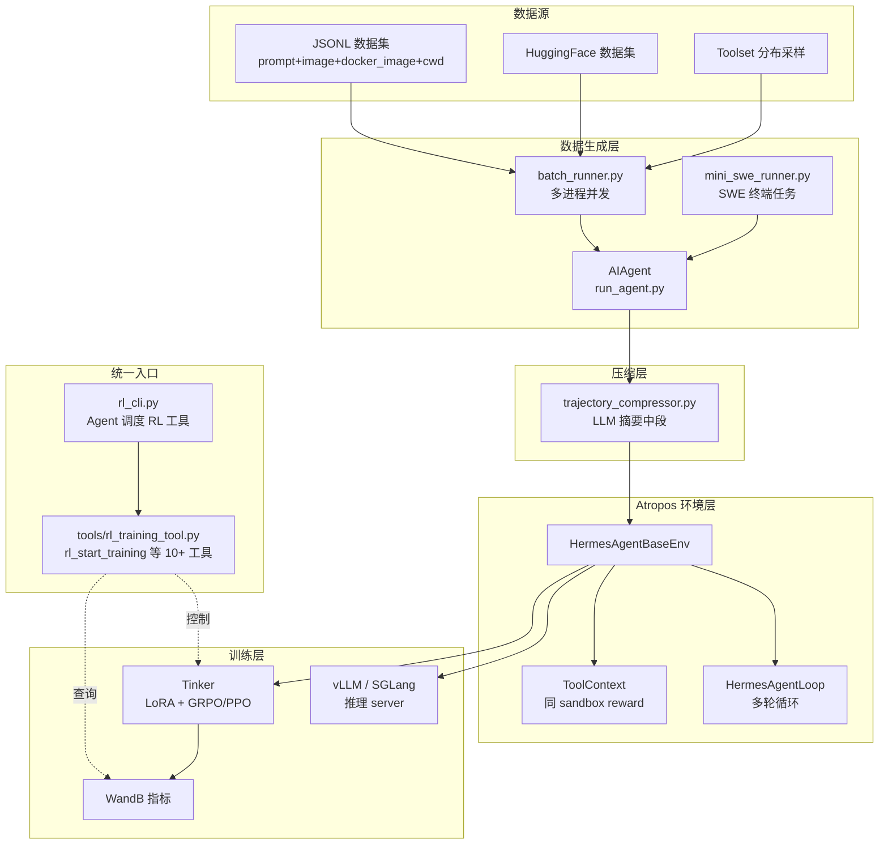
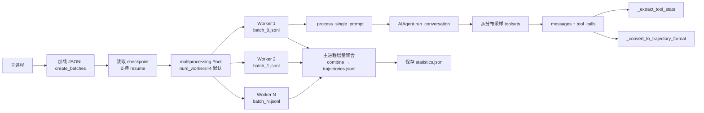
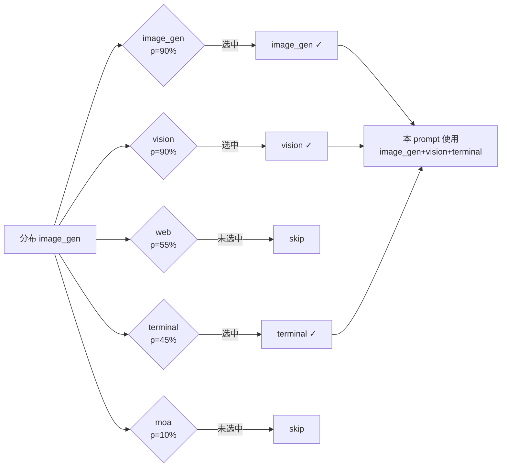
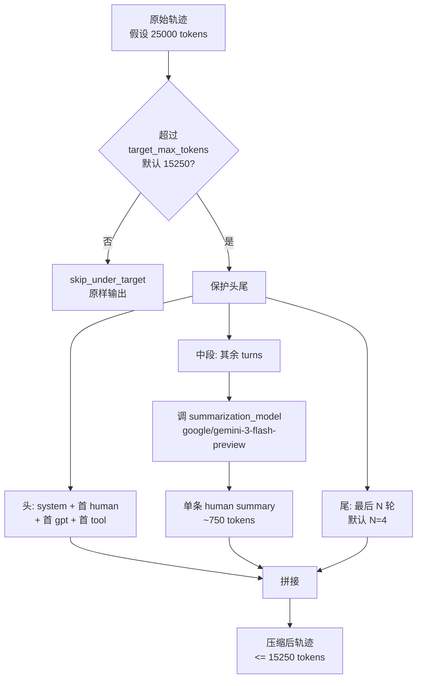
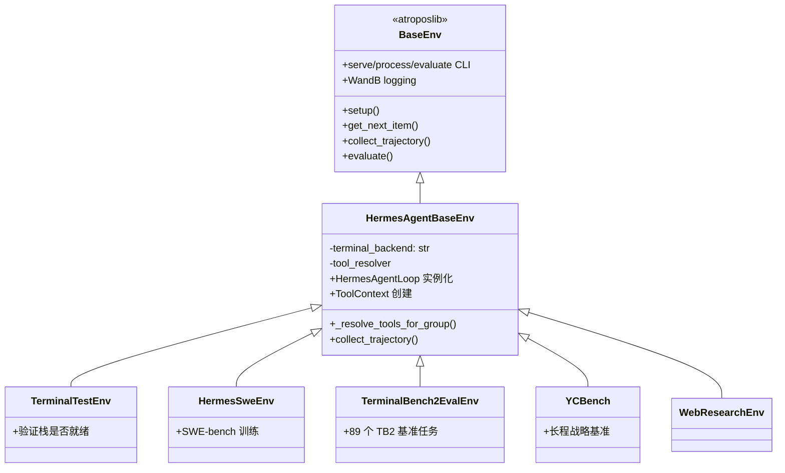
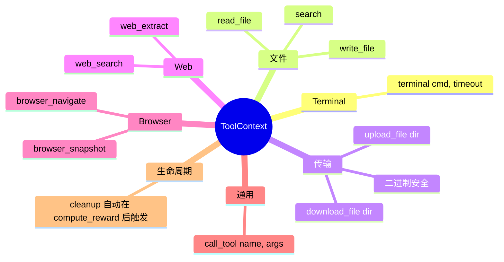
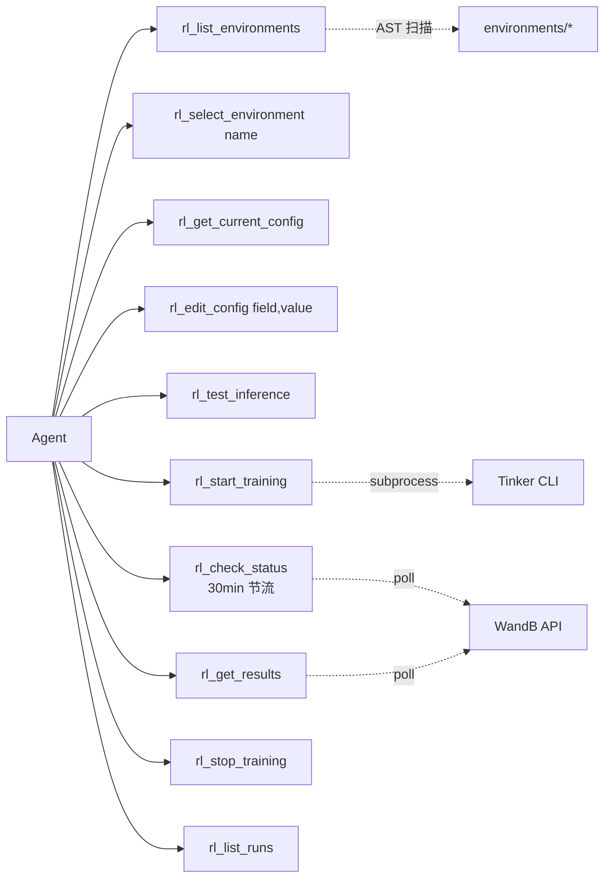
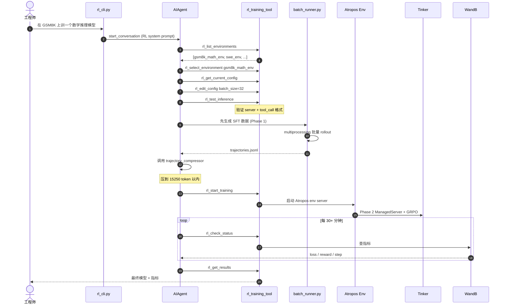

# Hermes 自动强化学习（Auto-RL）深度解析：从 Prompt 到 Tinker 的完整数据流

> 代码范围：`rl_cli.py`、`batch_runner.py`、`mini_swe_runner.py`、`trajectory_compressor.py`、`toolset_distributions.py`、`toolsets.py`、`tools/rl_training_tool.py`、`environments/**`、`run_agent.py` 中 `_convert_to_trajectory_format` 片段、`pyproject.toml` 中 `[rl]` extras。

## 1. 一句话总览

Hermes 不是一个 in-process 的 RL 训练器。**它是一条"数据生成 + 压缩 + 环境编排"的流水线，把真正的策略更新交给 Tinker，把环境调度交给 Atropos。** 拆开看，整条链路是四段：

```
[1] Prompts/数据集
        ↓  batch_runner.py / mini_swe_runner.py
[2] Agent Rollouts (多轮 tool-calling 对话)
        ↓  trajectory_compressor.py
[3] 压缩后的轨迹 (受 token 预算约束)
        ↓  environments/* 的 Atropos 环境
[4] Tinker 进行 LoRA GRPO/PPO 策略更新
```

Hermes 在其中负责三件事：**生成高质量 agentic 轨迹**、**把轨迹压进训练窗口**、**通过 Atropos 把 reward 函数接入到同一个 sandbox**。

## 2. 总体架构图



关键源码索引（file:line）：

| 组件 | 文件 | 关键位置 |
|---|---|---|
| RL CLI 入口 | `rl_cli.py` | `main()` 235–442；系统提示 113–170；常量 110–173 |
| 批量 rollout | `batch_runner.py` | `BatchRunner` 515–796；`_process_single_prompt` 233–385；`_process_batch_worker` 388–512；trajectory 拼装 461–471 |
| SWE 风格 runner | `mini_swe_runner.py` | `MiniSWERunner` 160–300 |
| 轨迹压缩 | `trajectory_compressor.py` | `TrajectoryCompressor` 332+；`CompressionConfig` 82–179；metrics 183–329 |
| Toolset 分布 | `toolset_distributions.py` | 分布字典 29–220；`sample_toolsets_from_distribution` 247–288 |
| Toolset 定义 | `toolsets.py` | `TOOLSETS` 与 `resolve_toolset` 29–480 |
| RL 工具集 | `tools/rl_training_tool.py` | 锁死 infra config 70–106；训练控制 1–350+ |
| Atropos 基类 | `environments/hermes_base_env.py` | `HermesAgentBaseEnv` + config |
| Agent 循环 | `environments/agent_loop.py` | `HermesAgentLoop` 119+；`AgentResult` |
| 奖励上下文 | `environments/tool_context.py` | `ToolContext` 全类 |
| 轨迹格式转换 | `run_agent.py` | `_convert_to_trajectory_format` 3487–3650 |

## 3. 数据生成：`batch_runner.py`

### 3.1 做什么

把一份 JSONL（每行一个 `{"prompt": ..., "image": ..., "docker_image": ..., "cwd": ...}`）交给**多进程池**，每个 worker 内部启动一个 `AIAgent`，按采样到的 toolset 组合跑到自然结束或达到 max_iterations，然后把消息序列转换成 Hermes 训练格式落盘。

### 3.2 并发模型



关键点：
- **批内串行、批间并行**：一个 worker 串行处理本 batch 的所有 prompt，batch 之间走进程池并行；
- **checkpoint 增量**：每写完一个 `batch_N.jsonl` 就更新 `checkpoint.json`，崩了重跑用 `--resume` 接着干；
- **每 prompt 独立采样 toolset**：`batch_runner.py:307` 调 `sample_toolsets_from_distribution`，同一个数据集跑出来的轨迹天然具有工具多样性；
- **过滤无推理样本**：没有产生 `<think>` 或 tool_call 的轨迹会被丢弃，训练语料里不留"空跑"的样本。

### 3.3 轨迹记录的 schema

`batch_runner.py:461` 构造的每条 JSONL：

```python
{
  "prompt_index": int,
  "conversations": [                              # ShareGPT 风格
    {"from": "system", "value": "..."},
    {"from": "human",  "value": "..."},
    {"from": "gpt",    "value": "<think>...</think>\n<tool_call>{...}</tool_call>"},
    {"from": "tool",   "value": "<tool_response>{...}</tool_response>"}
  ],
  "metadata": {"batch_num": int, "timestamp": str, "model": str},
  "completed": bool,              # 自然结束
  "partial":   bool,              # 因非法 tool_call 提前中止
  "api_calls": int,
  "toolsets_used": ["web", "terminal", ...],
  "tool_stats": {
    "<tool_name>": {"count": int, "success": int, "failure": int}
  },
  "tool_error_counts": {"<tool_name>": int}
}
```

格式转换在 `run_agent.py:3487-3650`：

- `system` / `human` / `gpt` / `tool` 四种角色；
- GPT 的 `<think>...</think>` 块保留**模型内部推理**（若底层模型产出了），紧接着 `<tool_call>` 的 XML；
- Tool 响应包成 `<tool_response>{tool_call_id,name,content}</tool_response>`。

这是后续 Tinker 训练时的**原子样本**。

### 3.4 典型调用

```bash
# 标准 run
python batch_runner.py \
  --dataset_file=data.jsonl \
  --batch_size=10 \
  --run_name=my_run \
  --distribution=image_gen

# resume
python batch_runner.py --dataset_file=data.jsonl --run_name=my_run --resume
```

## 4. Toolset 分布采样：让数据"自带多样性"

`toolset_distributions.py:29-220` 是一份巨大的字典，每个分布长这样：

```python
"image_gen": {
  "toolsets": {
    "image_gen": 90, "vision": 90,
    "web": 55, "terminal": 45, "moa": 10,
  },
},
```

**采样语义**：每个 toolset 以独立概率 p% 入选，不够一个就回退到概率最高的那个（`toolset_distributions.py:247`）。



预置的 13 种分布，覆盖 `default / research / science / development / safe / minimal / terminal_only / browser_use / browser_tasks / terminal_tasks / mixed_tasks / balanced / image_gen`——训练一个通才 agent 可以在一次 datagen run 里同时铺这几种分布。

## 5. 轨迹压缩：`trajectory_compressor.py`

Agent 跑出来的轨迹平均几千到几万 token，直接喂给训练会撑爆 context window。压缩器干的活：

### 5.1 策略



关键细节（`trajectory_compressor.py:82-179` 的 `CompressionConfig`）：

| 字段 | 默认 | 说明 |
|---|---|---|
| `tokenizer_name` | `moonshotai/Kimi-K2-Thinking` | 模型无关的 token 计数 |
| `target_max_tokens` | 15250 | 压缩目标 |
| `summary_target_tokens` | 750 | 摘要段长度 |
| `protect_last_n_turns` | 4 | 尾部保护轮数 |
| `summarization_model` | `google/gemini-3-flash-preview` | 便宜快速的摘要模型 |
| `temperature` | 0.3 | 降采样 |
| `max_concurrent_requests` | 50 | 并发上限 |
| `per_trajectory_timeout` | 300s | 超时放弃 |

### 5.2 为什么保护头尾

- **头 4 turn**：system prompt + 用户首问 + 模型第一次行动 + 第一次工具反馈，这是 agent 学会任务框架的关键；
- **尾 N turn**：Agent 的**最终行动**（通常是收尾/交付），直接决定 reward，绝不能被摘要；
- **只摘要中段**：中段往往是大量探索/试错/浏览输出，用一段 NL 摘要就能概括"它都翻过什么、试过什么"。

### 5.3 指标

`TrajectoryMetrics`（183）和 `AggregateMetrics`（228）记录：原始/压缩后 token 数、压缩比、被压缩的中段 turns 数、摘要 LLM 调用耗时。最终一份 `compression_metrics.json` 方便决策是否重跑。

### 5.4 调用示例

```bash
# 整目录压缩
python trajectory_compressor.py --input=data/my_run

# 采样 15% 文件用于预检
python trajectory_compressor.py --input=data/x.jsonl --sample_percent=15 --target_max_tokens=16000
```

## 6. Atropos 环境层：`environments/`

### 6.1 继承链

`environments/README.md:8-31` 和 `hermes_base_env.py` 定义了这条链路：



每个具体环境必须实现：
- `setup()` — 加载数据集；
- `get_next_item()` — 返回下一个任务；
- `format_prompt(item)` — 拼用户消息；
- `compute_reward(item, result, ctx)` — **这是整个 RL 的核心**；
- `evaluate()` — 周期性验证。

### 6.2 Agent 循环 `HermesAgentLoop`

`environments/agent_loop.py:119+` 是多轮 rollout 的引擎，行为上和 `run_agent.py` 的主循环一致，但为 RL 场景做了两处工程化：

```mermaid
sequenceDiagram
    autonumber
    participant Env as HermesAgentBaseEnv
    participant Loop as HermesAgentLoop
    participant Srv as Server (OpenAI/VLLM)
    participant Pool as ThreadPool
    participant TR as tools/registry dispatch

    Env->>Loop: run(messages, tools)
    loop 每轮
        Loop->>Srv: chat_completion(messages, tools=..., T=1.0)
        Srv-->>Loop: response (可能含 tool_calls)
        alt 有 tool_calls
            par 并发执行每个工具
                Loop->>Pool: run_in_executor(handle_function_call)
                Pool->>TR: dispatch(tool_name, args)
                TR-->>Pool: 结果
                Pool-->>Loop: tool response
            end
            Loop->>Loop: 追加 tool 消息
        else 无 tool_calls
            Loop-->>Env: AgentResult(messages, turns, reasoning, errors)
        end
    end
```

- **`run_in_executor` 线程池跑工具**：避免 Modal/Docker 后端内部 `asyncio.run()` 与 Atropos 主 loop 嵌套死锁；
- **`AgentResult` 记录每轮 reasoning**：若底层是 thinking 模型，保留每轮的 CoT，方便训练时做拆分监督。

### 6.3 两阶段 server：Phase 1 vs Phase 2

`environments/README.md:138-150` 讲得很清楚：

| 阶段 | Server | tool_call 解析 | 用途 |
|---|---|---|---|
| Phase 1 | OpenAI 兼容 (vLLM/SGLang/OpenRouter) | **Server 侧**原生解析 | 评测、SFT 数据生成 |
| Phase 2 | VLLM ManagedServer `/generate` | **客户端**用 `tool_call_parsers/` 解析 | 完整 RL 训练（要精确 token id + logprob） |

`tool_call_parsers/` 里内置了 10+ 种格式解析器：`hermes / mistral / llama3_json / qwen / qwen3_coder / deepseek_v3{,_1} / kimi_k2 / longcat / glm45 / glm47`，只依赖标准库，和 vLLM 解耦。

### 6.4 ToolContext：reward 函数的核武器

这是 Hermes 的一个**非常精妙的设计**（`environments/tool_context.py`）。`compute_reward` 拿到的 `ctx` 不是个只读对象，而是一个**绑定到同一个 task sandbox 的工具句柄**——意味着 reward 函数可以直接进模型刚才操作的那个容器里做验证。

```python
async def compute_reward(self, item, result, ctx: ToolContext):
    # 在模型刚才操作的 terminal 里跑测试
    test = ctx.terminal("pytest -v")
    if test["exit_code"] == 0:
        return 1.0
    # 读取模型创建的文件
    content = ctx.read_file("/workspace/solution.py")
    if content.get("content"):
        return 0.5
    return 0.0
```

它能提供：



核心特性：**task_id 一致**——模型在 rollout 期间写入 `/workspace` 的文件、浏览器里打开的标签页、后台启动的进程，`ctx` 都能看到。这让"端到端可验证奖励"变得像本地写单元测试一样简单。

## 7. 统一入口：`rl_cli.py` + `rl_training_tool.py`

### 7.1 `rl_cli.py` 自己不训练

它是一个**专为 RL 工程师优化过的 AIAgent 封装**：

- `RL_MAX_ITERATIONS = 200`（对比主 CLI 通常 30-50）；
- `RL_SYSTEM_PROMPT`（`rl_cli.py:113-170`）教会 Agent：**先列环境 → 选环境 → 改 config → 测推理 → 启动训练 → 至少等 30 分钟再看状态**；
- `RL_TOOLSETS = ["terminal", "web", "rl"]`：只暴露 terminal、web、还有下面讲的 `rl` 工具集；
- 启动时把 `TERMINAL_CWD` 指向 `tinker-atropos/` 子模块目录，所有终端命令自动跑在正确上下文里。

它的命令形态：

```bash
python rl_cli.py "Train a model on GSM8k for math reasoning"
python rl_cli.py --interactive
python rl_cli.py --list-environments
python rl_cli.py --check-server
```

### 7.2 `tools/rl_training_tool.py`：Agent 自己能按的按钮

这是实现"Agent 驱动的自动 RL"的关键：



**锁死字段**（`rl_training_tool.py:70-106`）：
- `tokenizer`、server URL、LoRA rank = 32、learning rate = 0.00004、max tokens = 9000；
- 这些是**基础设施参数**，Agent 不许改，防止"AI 把自己训崩"；
- 其余字段（batch size、num steps、数据路径等）允许 `rl_edit_config` 修改。

这就是"自动 RL"在 Hermes 里的含义：**不是自动做梯度更新，而是让 LLM Agent 自己驱动整个训练工作流**——选环境、调参、启停、读结果，全部通过工具完成。人类只要交代一句 *"在 GSM8K 上训一个数学推理模型"*，Agent 就会按 system prompt 里的 SOP 一步步把训练跑起来。

## 8. 端到端数据流

把四段拼起来看：



## 9. RL 依赖与安装

`pyproject.toml` 的 `[rl]` extras 是整个系统的"硬性闸门"：

```toml
[project.optional-dependencies]
rl = [
  "atroposlib @ git+https://github.com/NousResearch/atropos.git@...",
  "tinker @ git+https://github.com/thinking-machines-lab/tinker.git@...",
  "fastapi>=0.104.0",
  "uvicorn[standard]>=0.24.0",
  "wandb>=0.15.0",
]
```

```bash
pip install -e ".[rl]"
```

必须的环境变量：

| 变量 | 用途 |
|---|---|
| `TINKER_API_KEY` | Tinker 后端认证 |
| `WANDB_API_KEY` | 指标上报 |
| `OPENROUTER_API_KEY` | Agent 本身用的模型（默认走 OpenRouter） |

可选：`tinker-atropos/` 子模块初始化（`git submodule update --init`），否则 `rl_cli.py` 会回退到 hermes-agent 目录。

## 10. 设计哲学与总结

读完这整条链路，几个非常有想法的设计决定值得单独列出：

1. **数据生成与策略更新解耦**。Hermes 不碰梯度，只负责"喂什么进训练"。Tinker 负责"怎么更新"。这让 Hermes 可以同时服务多个训练框架。

2. **Toolset 分布采样保证数据多样性**。不是"一个 run 一种工具配置"，而是**每条样本独立采样**——同一个 10K prompt 数据集跑出来的轨迹，工具组合分布广到足以支撑 multi-skill 训练。

3. **轨迹压缩的"保头保尾"**。这是纯工程直觉：RL 训练最看重 prompt 理解 + 最终决策，中间的探索摘要化性价比最高。

4. **ToolContext 的"同 sandbox reward"**。过去写 RL reward 往往得"事后 diff 文件"或"用外部 verifier"，Hermes 直接让 reward 函数进到模型刚才的容器——测试通过就 1.0，文件存在就 0.5。像写单元测试。

5. **两阶段 server 拆分 SFT 与 RL**。Phase 1 用 OpenAI 兼容 API 拿结构化 tool_call，快速做评估和 SFT；Phase 2 切到 VLLM ManagedServer 拿精确 token id + logprob 做真 RL。解析器独立实现，和 vLLM 解耦。

6. **Agent 自驱训练工作流**。`rl_cli.py` 的创新不在 CLI 参数，而在"**把训练本身当成一种任务交给 Agent 去做**"——`rl_training_tool.py` 把 Tinker 的启停、WandB 的查询都封装成工具，Agent 按 SOP 驱动训练。这是"Auto-RL"这个名字的真正含义。

7. **把能锁死的全部锁死**。LoRA rank、学习率、server URL 这些基础设施参数在 `rl_training_tool.py:70-106` 里写死不许 Agent 动，避免 AI 把自己训崩。可改字段和不可改字段的白名单/黑名单是安全的最后一道防线。

---

> 如果你要从零接入一个新环境：继承 `HermesAgentBaseEnv`，实现 `setup / get_next_item / format_prompt / compute_reward / evaluate` 五个方法，reward 里用 `ctx: ToolContext` 直接访问模型的 sandbox。然后把环境放到 `environments/your_env/`，`rl_list_environments` 会通过 AST 扫描自动发现它。
