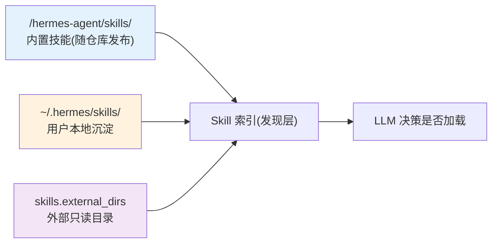
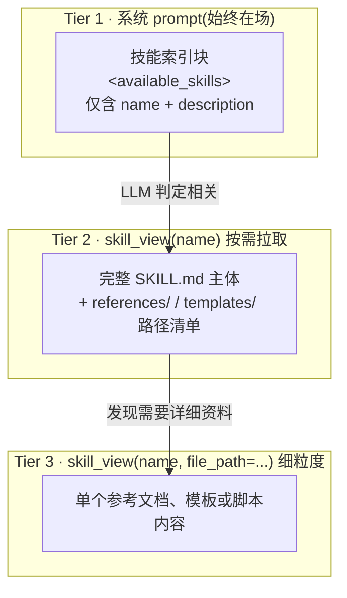
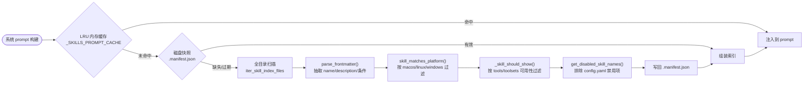
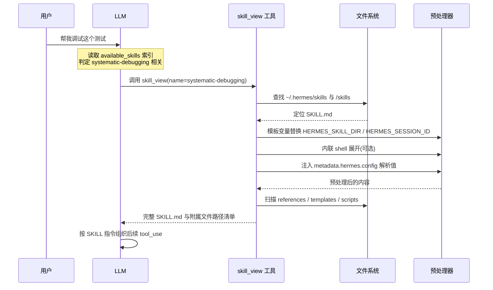
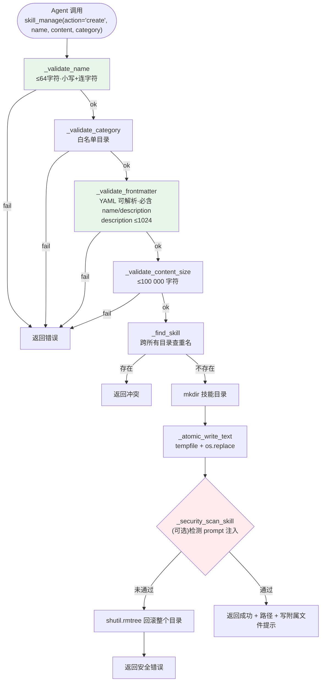
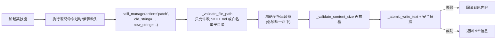
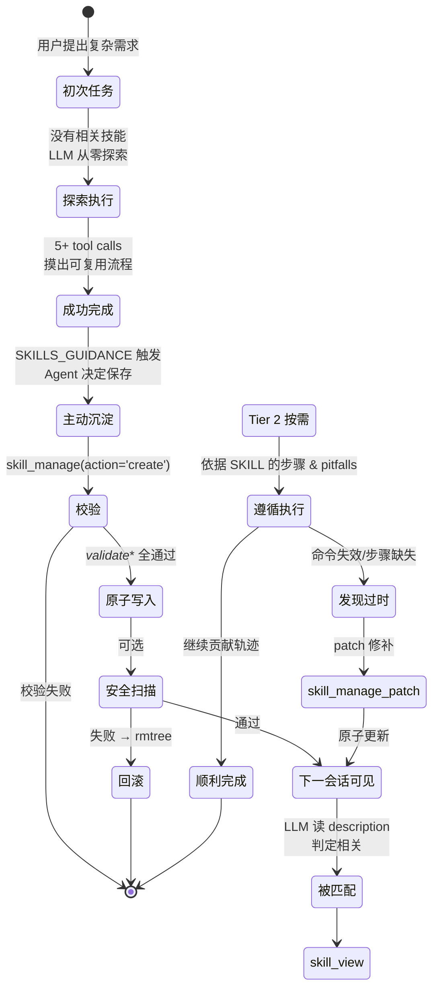
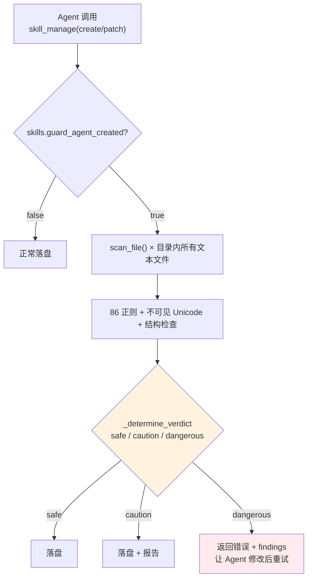
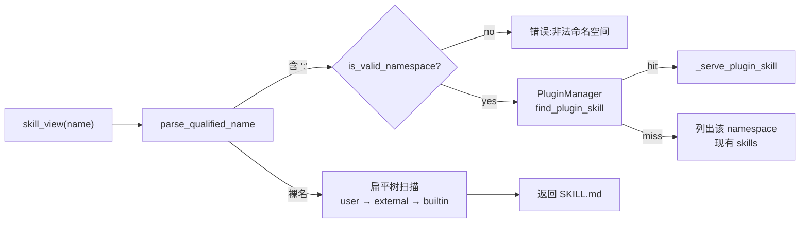
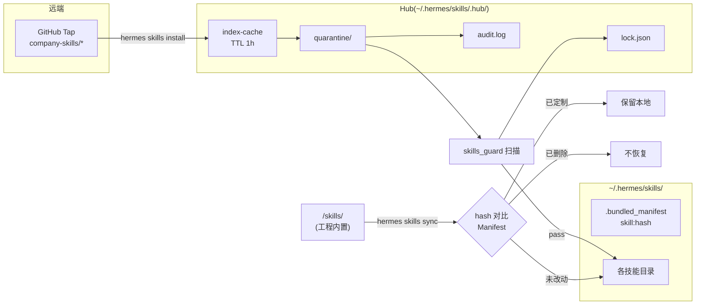

# Hermes 技能框架:Agent 如何从经验中沉淀与复用"技能"

> 本文基于 hermes-agent 源码逐层拆解,梳理它如何把一次成功的任务轨迹固化为可复用的 SKILL,以及下一次如何以最低上下文成本发现、加载并遵循这些技能。

---

## 0. 问题的起点:Agent 的"程序性记忆"放在哪

成熟的 Agent 需要两类长期记忆:

- **陈述性记忆(Memory)**:持久的事实、偏好、环境细节,每轮对话都会注入 prompt。
- **程序性记忆(Skill)**:一类任务的"做法",只在相关时按需加载。

hermes 在系统 prompt 里把两者的边界划得相当硬(见 `agent/prompt_builder.py:145-162`):

> "Do NOT save task progress, session outcomes, completed-work logs to memory; … Procedures and workflows belong in **skills**, not memory."

简单说:memory 回答"你是谁、你在什么环境里工作",skill 回答"这类事要怎么做"。本文只谈后者。

---

## 1. 什么是一个 Skill

Skill 的物理形态是一个目录,至少包含一份 `SKILL.md`:

```
~/.hermes/skills/<category>/<name>/
├── SKILL.md           # 主文档(必需)
├── references/        # 详细参考,按需加载
├── templates/         # 可复用模板
├── scripts/           # 可执行脚本
└── assets/            # 其他资源
```

`SKILL.md` 采用 **YAML frontmatter + Markdown body** 的双段结构:

```yaml
---
name: my-skill-name                # 小写 + 连字符,≤ 64 字符
description: Use when <trigger>.   # ≤ 1024 字符,以 "Use when" 开头
version: 1.0.0
author: Hermes Agent
license: MIT
metadata:
  hermes:
    tags: [authoring, conventions]
    related_skills: [writing-plans]
    config:
      - key: wiki.path
        default: "~/wiki"
---

# Title
## Overview
## When to Use
## <内容主体>
## Common Pitfalls
## Verification Checklist
```

硬校验规则在 `tools/skill_manager_tool.py` 中落地:

| 规则 | 上限 | 实现 |
|------|------|------|
| `name` 长度 | 64 | `_validate_name` |
| `description` 长度 | 1024 | `_validate_frontmatter` / `MAX_DESCRIPTION_LENGTH` |
| `SKILL.md` 总长 | 100 000 字符(约 36K token) | `MAX_SKILL_CONTENT_CHARS` |
| frontmatter 以 `---` 起始、`\n---\n` 收尾 | — | 同上 |

> 经验上,常规技能的体积落在 8–14K 字符;超过 20K 就应把细节拆进 `references/` 按需加载。

---

## 2. 两棵树:内置技能与用户沉淀技能



两棵树的关键区别(见 `skills/software-development/hermes-agent-skill-authoring/SKILL.md:17-20`):

- **内置技能**通过 `write_file` + `git add` 提交,作为仓库源码一起发布;`skill_manage(action='create')` **不会**写到这棵树。
- **用户本地**是 `skill_manage(action='create')` 的默认落点,也是 Agent 自主沉淀经验的归宿。
- 同名时本地优先;外部目录对 Agent 只读,只参与索引合并。

这一层分工让"团队共享的做法"与"个人积累"各得其所,不会相互污染。

---

## 3. 渐进式披露:让 1000 个技能不撑爆上下文

若把所有 SKILL.md 一次性塞进系统 prompt,几十 K tokens 会瞬间膨胀到几百 K。hermes 的做法是**三层渐进式加载**:



- **Tier 1** 只承载"这个技能适用什么场景",由 LLM 依据 description 自行判断是否相关。
- **Tier 2** 被触发时才把完整流程拉进上下文,对应 `tools/skills_tool.py:846` 的 `skill_view()`。
- **Tier 3** 连 `references/xxx.md` 也延迟到真正需要时再读。

这套节奏接近人脑"目录—章节—段落"的检索方式,而非把整本书背在脑子里。

---

## 4. 发现链:Agent 启动时如何"看见"所有技能

冷启动需要扫磁盘,但不能每次都扫。`agent/prompt_builder.py:690-876` 用一条三级缓存解决这个问题:



几个关键细节:

- YAML 解析优先使用 `yaml.CSafeLoader`,并带有 key:value 形式的降级兜底(`agent/skill_utils.py:52`)。
- **条件激活**:`metadata.hermes` 下可以声明 `requires_tools`、`requires_toolsets`、`fallback_for_*`;当前会话缺少相关工具集时,对应技能根本不进入索引。
- **平台绑定**:`platforms: [macos]` 的技能在 Linux 会话中直接隐身。
- **禁用列表**:`~/.hermes/config.yaml` 可临时屏蔽指定技能,支持 `platform_disabled` 按平台屏蔽。

最终注入系统 prompt 的索引形态(`prompt_builder.py:839-866`):

```text
## Skills (mandatory)
Before replying, scan the skills below. If a skill matches or is even partially relevant
to your task, you MUST load it with skill_view(name) and follow its instructions.
...
<available_skills>
  software-development:
    - systematic-debugging: Use when encountering any bug …
    - test-driven-development: Use when implementing any feature …
  github:
    - ...
</available_skills>
```

"mandatory + err on the side of loading"——系统 prompt 不只是把索引放进来,还**明确要求** LLM 宁可多加载,也不要漏加载。这是用"软指令"表达的硬规范。

---

## 5. 激活:一次调用的完整路径



预处理的三项能力(`agent/skill_preprocessing.py`):

1. **模板变量**:`${HERMES_SKILL_DIR}`、`${HERMES_SESSION_ID}` 会被替换为实际路径与会话 ID;无法解析的占位符原样保留,便于作者排查。
2. **内联 shell**:`` !`date +%Y-%m-%d` `` 这类语法先执行再替换,输出截断至 4000 字符,默认需要显式开启。
3. **配置注入**:`metadata.hermes.config` 声明的键从 `config.yaml` 取值,以 `[Skill config: ...]` 段落形式注入——技能无需硬编码路径,用户也无需改动 SKILL.md。

---

## 6. 核心机制:Agent 如何"自我沉淀"一个新技能

整个框架最有意思的部分在这里:**技能不仅由工程师编写,Agent 自己也能编写。**

### 6.1 软指令:让 Agent 主动沉淀

系统 prompt 里埋着两段互补指令(`agent/prompt_builder.py:170-177` 与 `:856-859`):

```text
SKILLS_GUIDANCE =
  "After completing a complex task (5+ tool calls), fixing a tricky error,
   or discovering a non-trivial workflow, save the approach as a
   skill with skill_manage so you can reuse it next time.
   When using a skill and finding it outdated, incomplete, or wrong,
   patch it immediately with skill_manage(action='patch') — don't wait
   to be asked. Skills that aren't maintained become liabilities."

"After difficult/iterative tasks, offer to save as a skill.
 If a skill you loaded was missing steps, had wrong commands, or needed
 pitfalls you discovered, update it before finishing."
```

触发条件是**隐式而经验化**的:5 次以上工具调用、处理了棘手的错误、摸索出非平凡的流程。这些句子把"沉淀"从一条用户指令,转化为 Agent 的职业本能。

### 6.2 skill_manage 的写操作模型

`tools/skill_manager_tool.py` 提供统一入口 `skill_manage(action=...)`,共六个动词:

| action | 用途 |
|--------|------|
| `create` | 新建用户本地技能(落在 `~/.hermes/skills/`) |
| `edit` | 整体重写现有 SKILL.md |
| `patch` | 基于 `old_string/new_string` 精确替换(小改首选) |
| `write_file` | 往 `references/` / `templates/` / `scripts/` / `assets/` 写附属文件 |
| `remove_file` | 删除附属文件 |
| `delete` | 删除整个技能目录 |

### 6.3 创建流程:一次 `create` 到底发生了什么



实现要点(`tools/skill_manager_tool.py:326-381`):

- **原子写**:`_atomic_write_text()` 使用 `tempfile + os.replace`,避免崩溃时遗留半截 SKILL.md。
- **冲突检测**:`_find_skill()` 扫描所有注册目录,**本地不得与外部/内置同名**,防止新技能覆盖已验证的流程。
- **安全扫描可选**:由 `skills.guard_agent_created` 开关控制;启用后写入立即扫描 prompt 注入特征,命中则 `rmtree` 回滚——**写入与扫描视为同一事务**。
- **缓存失效**:当前会话的 `_SKILLS_PROMPT_CACHE` 已锁定索引,新技能**下一会话**才会可见。这是刻意约束,避免 Agent 在同一轮次里把自己刚写的草稿当作权威。

### 6.4 `patch`:在使用中修补



`patch` 强制"一次只改一处"(`old_string` 必须唯一命中),再配合 `_atomic_write_text` 保留原文以便回滚——让 Agent 具备**边用边维护**的能力,发现坑就当场修掉,而不是把隐患留给后来者。

---

## 7. 轨迹压缩:给沉淀提供原料

`trajectory_compressor.py`(近 700 行)不直接写技能,但它把**对话轨迹转化为可消化的经验**,是整套机制的重要前置。

核心策略(简化自 `CompressionConfig`):

```python
target_max_tokens = 15250      # 压缩后目标长度
summary_target_tokens = 750    # 摘要预算
protect_first_system = True
protect_first_human  = True
protect_first_gpt    = True
protect_first_tool   = True
protect_last_n_turns = 4       # 保留最后若干轮(结果 + 结论)
```

压缩流程:


为什么保头保尾?头部承载任务设定与初始策略,尾部承载实际落地的方案与验证结果;中段的探索与反复才是最适合压缩的部分。压缩后的轨迹既可用于 RL/SFT 训练,也是人或 Agent 事后"从经验中抽技能"时信息密度最高的素材。

> 一句话概括:`trajectory_compressor.py` 让"经验"从一次性的对话流,变成可检索、可复用、可抽象的样本。

---

## 8. 完整生命周期:一个技能如何从无到有再到进化

把前面所有机制串起来:



四个值得玩味的设计选择:

1. **沉淀与使用对称**——`skill_manage` 的 `create` 与 `patch` 都是 Agent 的常规工具,而非管理员特权。
2. **本会话不见新技能**是刻意约束,防止 LLM 把自己刚写的草稿当权威使用。
3. **软指令触发、硬校验托底**——写技能靠 prompt 里的职业本能,但一旦动笔,名字/大小/冲突/YAML/安全扫描都不会放行违规内容。
4. **技能不是"写完即止"的静态资产**——rolling patch 把维护成本摊到"谁发现问题、谁顺手修"的时刻,不需要独立的维护周期。

---

## 9. 为什么这套设计值得借鉴

回到开头的问题:Agent 的程序性记忆应放在哪?hermes 的答案可以归纳为四条原则:

1. **做法是文件,不是提示词**——把"怎么做"从上下文里剥离,沉到磁盘。
2. **渐进式披露**——索引常驻、主体按需、参考文档再按需;上下文成本按相关性摊开。
3. **沉淀是职责,不是功能**——在系统 prompt 中把"发现非平凡做法 → 写成技能"定义为 Agent 的本职,再配合 `skill_manage` 这层低摩擦工具,沉淀就会自然发生。
4. **硬校验托底软指令**——YAML、大小、冲突、原子写、安全扫描全部由代码落地,不依赖 LLM 自律。

这套组合让 hermes 的技能库具备了"复利"属性:**每一次复杂任务,要么用到一个已有技能并顺手修正,要么新增一个技能**。Agent 不只是在解决问题,而是在系统性地积累工具。

---

## 10. 生产化四块拼图:安全扫描 / 插件命名空间 / Hub 与 Sync / 多租户

前九节描述的是"一个人、一台机器"的闭环。把这套机制推向团队或生产环境,还需要四块补充——它们在源码里各有一组文件,以可组合的方式拼在一起。

> 本节与 §7 的 `trajectory_compressor.py` 相互独立,专门讨论规模化能力。

### 10.1 安全扫描:为"Agent 自写技能"兜底

§6.3 提到的 `_security_scan_skill()`,背后是一个独立模块 `tools/skills_guard.py`(900+ 行)。

**扫描对象**(`tools/skills_guard.py:625-630`):不仅是 SKILL.md,而是整个技能目录——`references/`、`scripts/`、`templates/`、`assets/` 下所有文本文件都会扫一遍;位于 `SUSPICIOUS_BINARY_EXTENSIONS` 中的二进制扩展名直接被标为严重发现,不再尝试解析。

**检测维度**(86 条正则,分 10 类):

| 类别 | 典型特征 |
|------|---------|
| 外泄(exfiltration) | `curl/wget` 携带 `$TOKEN`/`$SECRET`、读 `$HOME/.ssh`、base64 拖走环境变量 |
| Prompt 注入 | "ignore previous instructions"、角色劫持、DAN-mode、隐藏 HTML 注释 |
| 破坏性操作 | `rm -rf /`、`chmod 777`、`mkfs`、写 `/etc/` |
| 持久化 | cron、shell rc、SSH 公钥投递、systemd、改 `CLAUDE.md` / `.hermes/config.yaml` |
| 网络 | 反向 shell、ngrok/serveo、硬编码 IP |
| 供应链 | `curl ... \| sh`、未 pin 版本的 `pip/npm`、运行期 `git clone` |
| 提权 | `sudo`、setuid/setgid、`NOPASSWD` |
| 混淆 | base64 管道、\x / \u 转义、`eval` / `exec`、`chr()` 拼串 |
| 结构异常 | 单文件 > 256 KB、总大小 > 1 MB、文件数 > 50、符号链接越狱 |
| 不可见 Unicode | 18 种零宽字符(U+200B / U+202E 等,`:509-527`) |

**信任级别 × 判定动作矩阵**(`skills_guard.py:46-96`):

```
                     safe    caution    dangerous
builtin(仓库自带)    pass    pass       pass          ← 不扫
trusted(openai/..)   pass    pass       block*        (* 可 --force)
community            pass    block*     block*
agent-created        pass    pass       ask(回错给 LLM)
```

其中 `ask` 的设计颇为讲究:Agent 创建技能命中 dangerous 模式时,工具调用不会静默失败,而是**把扫描报告当作错误回填给 LLM**,让 Agent 有机会改掉可疑片段再重试——扫描器扮演的是 code review,而非审查官。

**启用方式**(`tools/skill_manager_tool.py:56-69`):

```yaml
# ~/.hermes/config.yaml
skills:
  guard_agent_created: true   # 默认 false
```

两个容易忽略的细节:

- 从 Hub 或外部源安装的技能**始终扫描**,与开关无关;开关只约束 Agent 自己写的内容。
- 人类直接用编辑器修改 SKILL.md **不走扫描**——策略是信任人类,约束 Agent。



---

### 10.2 插件命名空间:让第三方技能不撞名

前面的示例只出现过 `skill_view(name="systematic-debugging")` 这种"裸名"调用;实际上 hermes 还支持 **`namespace:skill-name`** 形式的限定名,这是插件机制的入口。

**解析规则**(`agent/skill_utils.py:451-465`):

```python
def parse_qualified_name(name: str) -> Tuple[Optional[str], str]:
    if ":" not in name:
        return None, name           # 裸名 → (None, "skill-name")
    return tuple(name.split(":", 1)) # "memory:recall" → ("memory", "recall")

_NAMESPACE_RE = re.compile(r"^[a-zA-Z0-9_-]+$")
def is_valid_namespace(candidate): ...
```

**四种技能来源的优先级**(`hermes_cli/plugins.py:655-734`,后加载覆盖先加载):

```
pip entry-points(第三方包声明的插件)
    ↓
bundled    <repo>/plugins/
    ↓
project    ./.hermes/plugins/
    ↓
user       ~/.hermes/plugins/       ← 优先级最高
```

**分派逻辑**(`tools/skills_tool.py:868-930`):

- `skill_view("memory:recall")` 进入插件管理器,由 `find_plugin_skill()` 返回具体 SKILL.md 路径。
- `skill_view("systematic-debugging")` 走扁平树,按 user → external → builtin 顺序查找,第一个命中的胜出。
- 两种命名**并存**:`memory:recall` 与扁平树里同名的 `recall` 不会冲突,因为语法不同,语义也不同。
- 插件目录支持二级分类:`plugins/image_gen/openai/` 对应的 key 是 `image_gen/openai`,便于"同一领域多种实现"的插件按统一约定展开。



命名空间解决了两个问题:**其一**,第三方可以发布技能包而不污染用户的扁平树;**其二**,同一技能可以有多种实现(如 `memory:openviking` 与 `memory:clawhub`),切换 namespace 即切换后端。

---

### 10.3 Hub 与 Sync:分发与版本

§1 把"技能是文件"设为前提,但文件要怎么跨机器到位?hermes 用两个独立组件回答:

**`tools/skills_hub.py`(3000+ 行)—— 远端注册表与安装**

- `SkillSource` 抽象基类(`:252-278`)统一接口;`GitHubSource`(`:284-550`)目前是唯一的具体实现。
- 默认 5 个 tap(`DEFAULT_TAPS`):`openai/skills`、`anthropics/skills`、`VoltAgent/awesome-agent-skills`、`MiniMax-AI/cli`、`garrytan/gstack`。
- 用户可在 `~/.hermes/skills/.hub/taps.json` 追加私有 GitHub 仓库(例如公司内部 org),Hub 会并发查询所有 tap 后去重返回。
- 鉴权优先级:`GITHUB_TOKEN` 环境变量 → `gh auth token` → GitHub App JWT → 匿名访问(60 次 / 小时)。
- Hub 状态目录 `~/.hermes/skills/.hub/`:
  - `lock.json`:记录每个已安装技能的 provenance(来源仓库、版本 hash、信任级别)。
  - `quarantine/`:下载先落到隔离区,扫描通过后再推进到 `SKILLS_DIR`。
  - `audit.log`:安装与更新历史。
  - `index-cache/`:远端索引缓存,TTL 1 小时。

**`tools/skills_sync.py`(400+ 行)—— 本地 bundle 对齐**

仓库自带的 `<repo>/skills/` 如何同步到用户 `~/.hermes/skills/`?答案是一条**基于 hash 的三态逻辑**(`:132-150`):

```
.bundled_manifest (v2) 每行: <skill_name>:<origin_md5>

对每个 bundle 里的技能:
  - 不存在于用户目录    → 拷贝 + 写 manifest
  - 存在 且 origin_hash 与 manifest 匹配(用户未改)→ 允许升级,写新 hash
  - 存在 且 origin_hash 不匹配(用户改过)         → 跳过,尊重本地改动
  - 用户删掉了                                    → 不再补回
  - bundle 里被移除的                             → 从 manifest 清理
```

这样一来,团队可以把 `skills/` 作为工程源码管理(与 Git 一同版本化);每次拉取后运行 `hermes skills sync`,只会更新**未被个人定制过**的技能——思路与 `Cargo.lock`、`package-lock.json` 这类锁文件一脉相承。



---

### 10.4 多租户:组合而非强隔离

hermes 的多租户**不是操作系统级的隔离**——`~/.hermes/` 下的技能对同机用户一视同仁,没有 RBAC。团队级多租户实际上由四块组合而成:

1. **命名空间隔离**(§10.2):团队公共技能放在 `company:xxx`,个人实验不占用命名空间,避免互撞。
2. **Hub + `.bundled_manifest`**(§10.3):团队共用同一个 tap 与 manifest,保证"所有人看到同一组技能的同一版本",个人定制不会被强制覆盖。
3. **Gateway 模式**(`hermes_cli/gateway.py:46-120`):Gateway 是常驻服务,从 Discord/Slack/Telegram/WhatsApp 接收消息,为每条消息单独起一次 Agent 调用。同一 `HERMES_HOME` 服务多个终端用户——**逻辑多用户、存储单用户**。`discord.channel_prompts` / `telegram.channel_prompts` 允许按频道注入不同 system prompt,但技能集合是共享的。
4. **配置分层**(`hermes_cli/config.py:835-865`):`config.yaml` 里的 `skills.disabled`、`plugins.disabled`、`channel_prompts` 可在部署环境覆盖开发环境,让"同一份技能库在生产中被收窄"成为可能。

| 需求 | 推荐方案 |
|------|---------|
| 团队内共享做法 | 私有 GitHub tap + `hermes skills install` |
| 个人不污染团队 | 使用 `namespace:` 起用户前缀,或写入 `~/.hermes/plugins/<me>/` |
| 生产 vs 开发差异 | 不同 `HERMES_HOME` + 不同 `config.yaml` |
| 多终端用户共享 Agent | Gateway + `channel_prompts` |
| 避免同机用户互读技能 | 容器化 / 多 `HERMES_HOME` 独立实例(hermes 本身不提供 ACL) |

**关键取舍**:hermes 选择了"简单、可组合、基于文件系统"的路线,而不是"内置强隔离"。代价是——小团队几条配置即可上路,大型多租户场景则需要借助容器化或多实例部署补齐隔离能力。

---

## 参考代码索引

| 关注点 | 文件 | 关键位置 |
|--------|------|---------|
| frontmatter 解析 / 平台过滤 / 禁用列表 | `agent/skill_utils.py` | `parse_frontmatter:52`、`skill_matches_platform:92`、`get_disabled_skill_names:121` |
| 索引构建 + LRU 缓存 + 系统 prompt 注入 | `agent/prompt_builder.py` | `:690-876`,`SKILLS_GUIDANCE:170` |
| `skill_view` 完整加载 + 插件命名空间 | `tools/skills_tool.py` | `:846` |
| 模板变量 / 内联 shell / 配置注入 | `agent/skill_preprocessing.py` | 全文 |
| 创建 / 编辑 / patch / 删除的事务实现 | `tools/skill_manager_tool.py` | `_create_skill:326`、`_patch_skill:419`、`_atomic_write_text:290`、`_security_scan_skill:72` |
| 轨迹压缩 → 经验样本 | `trajectory_compressor.py` | `CompressionConfig` 与压缩主循环 |
| 安全扫描(86 条正则 + 不可见 Unicode + 信任级别) | `tools/skills_guard.py` | `scan_file`、`_determine_verdict`、`should_allow_install`;禁用/信任映射 `:46-96`、扫描主体 `:599-680` |
| 插件命名空间解析 + 插件管理器 | `agent/skill_utils.py` + `hermes_cli/plugins.py` + `tools/skills_tool.py` | `parse_qualified_name:451`、`is_valid_namespace:461`、`PluginManager.find_plugin_skill`、`skill_view :868-930` |
| Hub:远端发现 / 安装 / provenance | `tools/skills_hub.py` | `SkillSource:252`、`GitHubSource:284`、`DEFAULT_TAPS`、`GitHubAuth:129`;状态目录 `~/.hermes/skills/.hub/` |
| Sync:bundle ↔ 用户目录 hash 对齐 | `tools/skills_sync.py` | `.bundled_manifest v2`、三态更新 `:132-150` |
| Gateway 多终端 / 按频道 prompt | `hermes_cli/gateway.py` + `hermes_cli/config.py` | `:46-120`;`channel_prompts` `:835-865` |
| 作者规范(人类视角)| `skills/software-development/hermes-agent-skill-authoring/SKILL.md` | 全文 |

推荐阅读顺序:`skill_utils.py` → `prompt_builder.py`(只看 `build_skills_prompt_index` 周边)→ `skills_tool.py::skill_view` → `skill_manager_tool.py::_create_skill/_patch_skill` → `skills_guard.py` → `skills_hub.py` + `skills_sync.py` → 回到 SKILL.md 作者规范,形成闭环。
