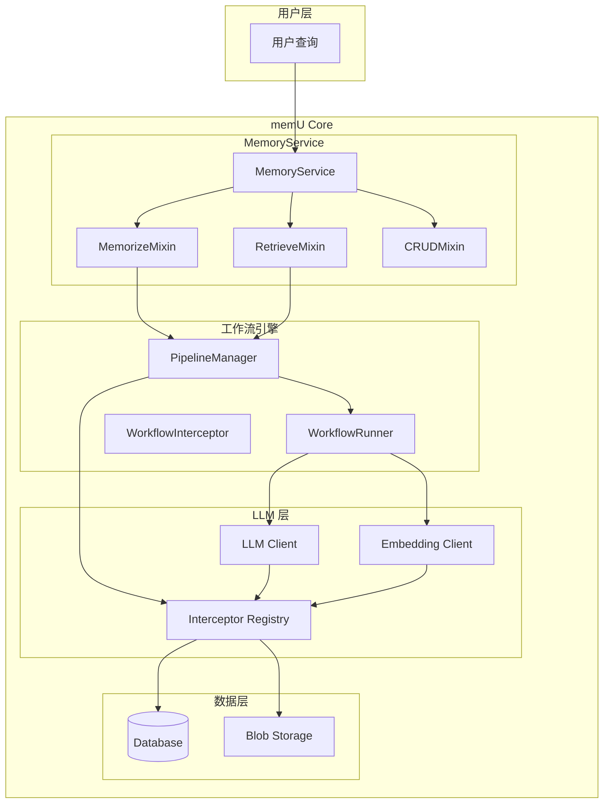
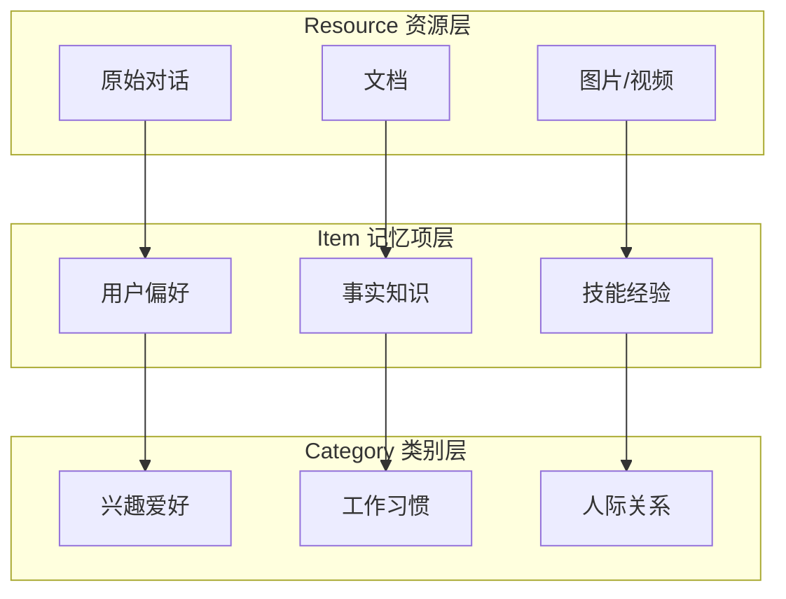
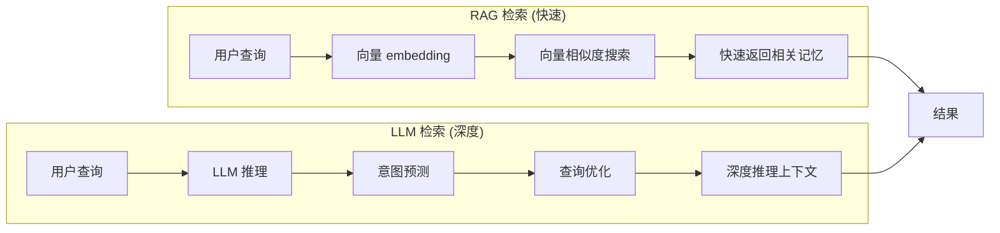
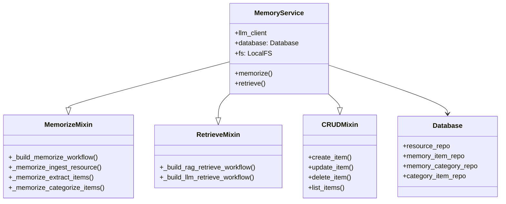
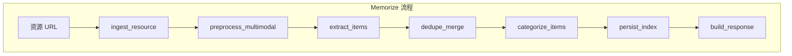

# memU 项目深度分析 (一)：整体架构与核心概念

> 基于源码分析的学习笔记

## 1. 项目概述

**memU** 是一个专为 **24/7 主动式 AI Agent** 设计的记忆框架。它的核心目标是：

- 🎯 **持续理解用户意图** - 即使没有明确指令，Agent 也能预判用户想要做什么
- 💰 **降低 Token 成本** - 通过缓存洞察和避免冗余的 LLM 调用
- 🧠 **构建长期记忆** - 让 AI 记住用户的偏好、习惯和上下文

> 这其实就是 OpenClaw 的 Memory System 增强版！

## 2. 核心架构图



## 3. 三大核心概念

### 3.1 记忆的三层结构

memU 将记忆组织为三层层级结构：



| 层级 | 类比文件系统 | 说明 |
|------|-------------|------|
| **Resource** | 挂载点 | 原始数据：对话、文档、图片、视频 |
| **Item** | 文件 | 提取的事实、偏好、技能 |
| **Category** | 文件夹 | 自动组织的主题/分类 |

### 3.2 两种检索模式

memU 支持两种不同的检索方式：



| 模式 | 速度 | 成本 | 适用场景 |
|------|------|------|---------|
| **RAG** | ⚡ 毫秒级 | 仅 Embedding | 实时建议、连续监控 |
| **LLM** | 🐢 秒级 | LLM 推理 | 复杂预测、深度理解 |

### 3.3 记忆类型 (Memory Types)

memU 定义了 6 种记忆类型：

```python
MemoryType = Literal[
    "profile",    # 用户画像：偏好、习惯、沟通风格
    "event",      # 事件：重要经历、里程碑
    "knowledge",  # 知识：学到的事实、技能
    "behavior",   # 行为模式：重复的动作习惯
    "skill",      # 技能：学会的能力、工具使用
    "tool"        # 工具记忆：API 调用、工具使用经验
]
```

## 4. 核心类关系图



## 5. 数据模型

### 5.1 Resource (资源)

```python
class Resource(BaseRecord):
    url: str              # 资源 URL
    modality: str         # 类型: conversation/document/image/video/audio
    local_path: str       # 本地存储路径
    caption: str | None   # 摘要/描述
    embedding: list[float] | None  # 向量表示
```

### 5.2 MemoryItem (记忆项)

```python
class MemoryItem(BaseRecord):
    resource_id: str | None    # 来源资源
    memory_type: str           # 记忆类型 (profile/event/knowledge...)
    summary: str               # 记忆内容
    embedding: list[float] | None  # 向量
    happened_at: datetime | None  # 发生时间
    extra: dict[str, Any]     # 扩展信息
```

### 5.3 MemoryCategory (类别)

```python
class MemoryCategory(BaseRecord):
    name: str                  # 类别名称
    description: str           # 类别描述
    embedding: list[float] | None  # 向量
    summary: str | None        # 类别摘要（自动更新）
```

### 5.4 CategoryItem (关联)

```python
class CategoryItem(BaseRecord):
    item_id: str           # 记忆项 ID
    category_id: str       # 类别 ID
```

## 6. 工作流程概览

### 6.1 Memorize (记忆) 流程



每个步骤都是独立的 **WorkflowStep**，可以灵活配置和扩展。

## 7. 与 OpenClaw 的对比

| 特性 | memU | OpenClaw |
|------|------|----------|
| 记忆组织 | 文件系统式层级 | 简单 Key-Value |
| 检索模式 | RAG + LLM 双模式 | 简单向量检索 |
| 记忆类型 | 6 种预定义类型 | 自定义 Memory |
| 主动学习 | ✅ 支持 | ❌ 不支持 |
| 多模态 | ✅ 支持图像/视频 | ❌ 有限 |

## 8. 总结

memU 是一个设计精良的**主动式记忆框架**，核心创新点：

1. **像文件系统一样组织记忆** - 直观易理解
2. **双模式检索** - 快慢结合，平衡性能与深度
3. **自动分类与摘要** - 减少人工维护
4. **工作流引擎** - 可扩展、可插拔

这为构建真正"记住用户"的 AI Agent 提供了坚实基础。
