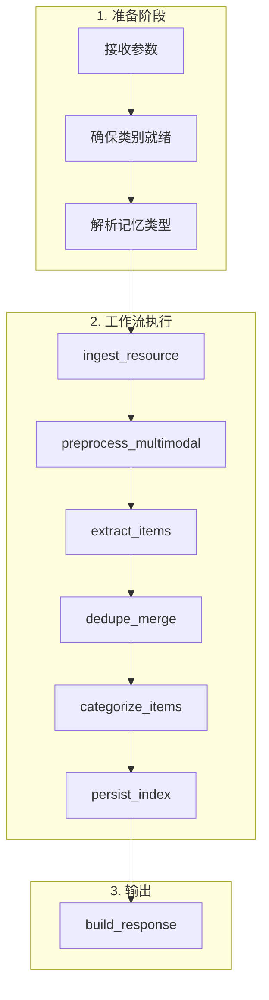
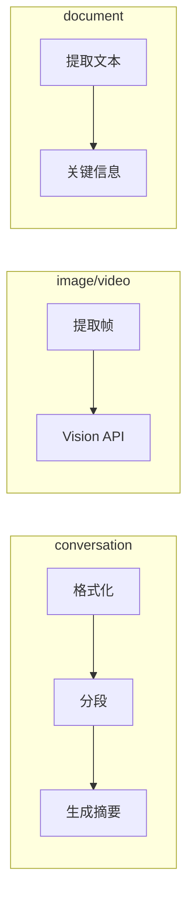
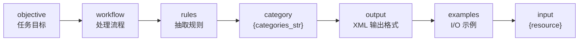
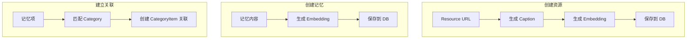
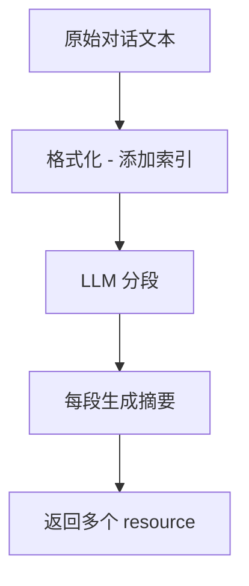

# memU 项目深度分析 (二)：记忆流程 (Memorize) 详解

> 基于源码分析的学习笔记

## 1. Memorize 流程概述

`memorize()` 是 memU 的核心 API 之一，负责**持续学习**——将输入资源转化为结构化记忆。

```python
result = await service.memorize(
    resource_url="path/to/file.json",  # 文件路径或 URL
    modality="conversation",            # 资源类型
    user={"user_id": "123"}            # 用户范围
)
```

## 2. 完整工作流程



## 3. 各步骤详解

### Step 1: ingest_resource (摄取资源)

```python
async def _memorize_ingest_resource(self, state: WorkflowState, step_context: Any) -> WorkflowState:
    local_path, raw_text = await self.fs.fetch(state["resource_url"], state["modality"])
    state.update({"local_path": local_path, "raw_text": raw_text})
    return state
```

**职责**：从各种来源获取资源内容
- 本地文件
- 远程 URL
- 支持多种格式 (JSON, TXT, Markdown 等)

**输出**：
- `local_path`: 本地文件路径
- `raw_text`: 原始文本内容

### Step 2: preprocess_multimodal (多模态预处理)

```python
async def _memorize_preprocess_multimodal(self, state: WorkflowState, step_context: Any) -> WorkflowState:
    llm_client = self._get_step_llm_client(step_context)
    preprocessed = await self._preprocess_resource_url(...)
    state["preprocessed_resources"] = preprocessed
    return state
```

**职责**：根据不同的 modality 类型进行预处理

| Modality | 处理方式 |
|----------|---------|
| `conversation` | 分段、添加索引 |
| `document` | 提取关键信息 |
| `image` | Vision API 提取描述 |
| `video` | 提取中间帧 + Vision API |
| `audio` | 转录为文本 |



### Step 3: extract_items (提取记忆项)

```python
async def _memorize_extract_items(self, state: WorkflowState, step_context: Any) -> WorkflowState:
    # 对每个预处理后的资源调用 LLM
    for prep in preprocessed_resources:
        structured_entries = await self._generate_structured_entries(...)
        resource_plans.append({...})
    state["resource_plans"] = resource_plans
    return state
```

**职责**：使用 LLM 从文本中提取结构化记忆。系统支持 6 种记忆类型，但**默认只启用 `profile` 与 `event`**：

```4:13:memU/src/memu/prompts/memory_type/__init__.py
# DEFAULT_MEMORY_TYPES: list[str] = ["profile", "event", "knowledge", "behavior"]
DEFAULT_MEMORY_TYPES: list[str] = ["profile", "event"]

PROMPTS: dict[str, str] = {
    "profile": profile.PROMPT.strip(),
    "event": event.PROMPT.strip(),
    "knowledge": knowledge.PROMPT.strip(),
    "behavior": behavior.PROMPT.strip(),
    "skill": skill.PROMPT.strip(),
    "tool": tool.PROMPT.strip(),
}
```

| 类型 | 默认开启 | 用途 |
|------|----------|------|
| `profile` | ✅ | 用户长期画像（基础信息、偏好、习惯） |
| `event`   | ✅ | 用户经历的具体事件（时间、地点、人物） |
| `knowledge` | ❌ | 用户陈述的知识/事实 |
| `behavior` | ❌ | 重复出现的行为模式 |
| `skill`   | ❌ | 用户掌握的技能 |
| `tool`    | ❌ | 工具调用记忆，附带 `when_to_use / metadata / tool_calls` 三个字段（写入 `MemoryItem.extra`） |

要启用更多类型，在 `MemorizeConfig.memory_types` 里显式列出即可：

```python
service = MemoryService(
    memorize_config={
        "memory_types": ["profile", "event", "knowledge", "skill", "tool"],
    },
)
```

#### Prompt 的"块化组合"架构

每个 memory type 的 prompt 都不是一整块大字符串，而是被拆成**七个语义独立的块**（参见 `prompts/memory_type/profile.py`）：



```30:38:memU/src/memu/prompts/memory_type/__init__.py
DEFAULT_MEMORY_CUSTOM_PROMPT_ORDINAL: dict[str, int] = {
    "objective": 10,
    "workflow": 20,
    "rules": 30,
    "category": 40,
    "output": 50,
    "examples": 60,
    "input": 90,
}
```

实际效果：

- 用户可以**只覆盖某一块**（比如只改 `examples`），而不用复制整段 prompt；
- 各块按 ordinal 排序后用 `\n\n` 拼接成最终的 system prompt；
- 输出格式从早期的 JSON（`PROMPT_LEGACY`）切换到 **XML `<item><memory>...`** 结构，对 LLM 来说边界更清晰、更容易稳定解析。

**输出格式**：
```python
# 每条记忆的格式
( memory_type, summary_text, category_names )
# 例如:
("profile", "用户喜欢在下午 2 点喝咖啡", ["生活习惯", "偏好"])
```

### Step 4: dedupe_merge（去重合并）

```python
def _memorize_dedupe_merge(self, state: WorkflowState, step_context: Any) -> WorkflowState:
    # 这一步本身只是 pass-through，真正的去重发生在写库时
    state["resource_plans"] = state.get("resource_plans", [])
    return state
```

> ⚠️ **早期博客曾说"目前是占位符"，事实上去重逻辑已经存在**——只是它被**下沉到了仓储层**：

启用 `MemorizeConfig.enable_item_reinforcement=True` 后，写入流程会调用 `MemoryItemRepo.create_item(reinforce=True)`，等价于走到 `create_item_reinforce`：

```122:147:memU/src/memu/database/inmemory/repositories/memory_item_repo.py
def create_item_reinforce(
    self, *, resource_id, memory_type, summary, embedding, user_data, ...
) -> MemoryItem:
    content_hash = compute_content_hash(summary, memory_type)

    # 在同一 user scope 下查找相同内容的记忆
    existing = self._find_by_hash(content_hash, user_data)
    if existing:
        # 找到就强化，而不是再插一条重复记忆
        current_extra = existing.extra or {}
        current_count = current_extra.get("reinforcement_count", 1)
        existing.extra = {
            **current_extra,
            "reinforcement_count": current_count + 1,
            "last_reinforced_at": pendulum.now("UTC").isoformat(),
        }
```

也就是说，`dedupe_merge` 这一步留在工作流里、handler 是空的，是为了**留出 hook 位**：用户可以通过 `service.replace_step("dedupe_merge", ...)` 注入自己的去重/合并策略（比如基于 LLM 的语义合并、跨 user 的归并等）。详细机制见 [第 09 篇：记忆强化与 Salience 评分](./analysis-09-salience-and-reinforcement.md)。

### Step 5: categorize_items (分类记忆项)

```python
async def _memorize_categorize_items(self, state: WorkflowState, step_context: Any) -> WorkflowState:
    embed_client = self._get_step_embedding_client(step_context)
    
    # 为每个资源创建 Resource 记录
    res = await self._create_resource_with_caption(...)
    resources.append(res)
    
    # 为每条记忆创建 MemoryItem 并建立关联
    mem_items, rels, cat_updates = await self._persist_memory_items(...)
    items.extend(mem_items)
    relations.extend(rels)
    
    state.update({
        "resources": resources,
        "items": items,
        "relations": relations,
        "category_updates": category_updates
    })
    return state
```

**职责**：
1. 创建 Resource 记录（带 caption embedding）
2. 创建 MemoryItem 记录（带记忆 embedding）
3. 建立 Item 与 Category 的关联
4. 记录需要更新的类别



### Step 6: persist_index (持久化与索引)

```python
async def _memorize_persist_and_index(self, state: WorkflowState, step_context: Any) -> WorkflowState:
    # 更新类别摘要
    updated_summaries = await self._update_category_summaries(
        state.get("category_updates", {}),
        ctx=state["ctx"],
        store=state["store"],
        llm_client=llm_client,
    )
    
    # 如果启用引用，建立 Item 引用关系
    if self.memorize_config.enable_item_references:
        await self._persist_item_references(...)
    return state
```

**职责**：
1. **更新类别摘要** - 用 LLM 合并新旧记忆
2. **建立引用** - 支持 `[ref:xxx]` 格式引用记忆项

```python
# 类别摘要更新 Prompt 的核心逻辑
prompt = f"""
类别: {category.name}
现有摘要: {original_summary}
新增记忆:
{new_items_text}

请更新摘要，保持目标长度: {target_length}
"""
```

### Step 7: build_response (构建响应)

```python
def _memorize_build_response(self, state: WorkflowState, step_context: Any) -> WorkflowState:
    response = {
        "resource": resources[0],    # 存储的资源
        "items": items,              # 提取的记忆项
        "categories": categories,    # 相关类别
        "relations": relations,      # 关联关系
    }
    state["response"] = response
    return state
```

## 4. 核心数据结构流转

```mermaid
flowchart TB
    subgraph "输入"
        IN1[resource_url]
        IN2[modality]
        IN3[user scope]
    end
    
    subgraph "State 流转"
        S1["resource_url, modality, user"] --> S2["local_path, raw_text"]
        S2 --> S3["preprocessed_resources"]
        S3 --> S4["resource_plans"]
        S4 --> S5["resources, items, relations"]
        S5 --> S6["updated_summaries"]
        S6 --> S7["response"]
    end
    
    subgraph "数据库操作"
        DB1[fetch() - Blob Storage]
        DB2[create_resource()]
        DB3[create_item()]
        DB4[link_item_category()]
        DB5[update_category()]
    end
    
    IN1 --> S1
    S1 --> DB1
    DB1 --> S2
    S2 --> S3
    S3 --> S4
    S4 --> S5
    DB2 --> S5
    DB3 --> S5
    DB4 --> S5
    S5 --> S6
    DB5 --> S6
    S6 --> S7
```

## 5. 多模态处理详解

### 5.1 对话 (conversation)



处理示例：
```
原始:
User: 你好
Assistant: 你好，有什么可以帮你？

处理后:
[0] User: 你好
[1] Assistant: 你好，有什么可以帮你？
```

### 5.2 图像 (image)

```python
async def _preprocess_image(self, local_path, template, llm_client):
    # 调用 Vision API
    processed = await client.vision(
        prompt=template,
        image_path=local_path
    )
    # 提取 description 和 caption
    description, caption = self._parse_multimodal_response(...)
    return [{"text": description, "caption": caption}]
```

### 5.3 视频 (video)

```python
async def _preprocess_video(self, local_path, template, llm_client):
    # 1. 提取中间帧
    frame_path = VideoFrameExtractor.extract_middle_frame(local_path)
    
    # 2. Vision API 分析
    processed = await client.vision(prompt=template, image_path=frame_path)
    
    # 3. 清理临时文件
    pathlib.Path(frame_path).unlink()
```

### 5.4 音频 (audio)

```python
async def _prepare_audio_text(self, local_path, text, llm_client):
    if text:
        return text
    
    # 转录音频
    transcribed = await client.transcribe(local_path)
    return transcribed
```

## 6. 配置选项

`MemorizeConfig` 是 Pydantic 模型，源码在 `src/memu/app/settings.py`：

```python
class MemorizeConfig(BaseModel):
    # —— 类别匹配阈值 ——
    category_assign_threshold: float = 0.25

    # —— 多模态预处理 ——
    multimodal_preprocess_prompts: dict[str, str | CustomPrompt] = {}
    preprocess_llm_profile: str = "default"

    # —— 记忆抽取 ——
    memory_types: list[str] = ["profile", "event"]    # 默认仅这两种
    memory_type_prompts: dict[str, str | CustomPrompt] = {...}
    memory_extract_llm_profile: str = "default"

    # —— 类别管理 ——
    memory_categories: list[CategoryConfig] = [...]
    default_category_summary_prompt: str | CustomPrompt = CATEGORY_SUMMARY_PROMPT
    default_category_summary_target_length: int = 400
    category_update_llm_profile: str = "default"

    # —— 高级特性 ——
    enable_item_references: bool = False        # 支持 [ref:ITEM_ID] 引用
    enable_item_reinforcement: bool = False     # 启用 reinforcement + content_hash 去重
```

`CustomPrompt` 用于"按块覆盖"提示词，例如只替换 `examples` 块：

```python
service = MemoryService(
    memorize_config={
        "memory_type_prompts": {
            "profile": {"examples": "## My custom example\n..."},  # 只覆盖 examples 块
        },
    },
)
```

### 关于 `enable_item_reinforcement`

打开后，**完全相同内容**的记忆不再重复入库，而是把已有记忆的 `extra.reinforcement_count` 自增、`extra.last_reinforced_at` 刷新为当前时间。检索阶段还可以把它和向量相似度组合成 salience-aware 排序——这部分见第 09 篇。

## 7. 实际使用示例

```python
from memu import MemoryService

service = MemoryService(
    llm_profiles={"default": {...}},
    database_config={"metadata_store": {"provider": "inmemory"}}
)

# 1. 记忆一段对话
result = await service.memorize(
    resource_url="conversation.txt",
    modality="conversation",
    user={"user_id": "tom"}
)

print(result)
# {
#     "resource": {...},
#     "items": [
#         {"memory_type": "profile", "summary": "用户喜欢简洁的沟通方式"},
#         {"memory_type": "knowledge", "summary": "用户了解 Python 编程"}
#     ],
#     "categories": [...],
#     "relations": [...]
# }

# 2. 记忆一张图片
result = await service.memorize(
    resource_url="photo.jpg",
    modality="image"
)

# 3. 记忆一个文档
result = await service.memorize(
    resource_url="notes.md",
    modality="document"
)
```

## 8. 总结

Memorize 流程的核心设计：

1. **工作流驱动** - 每一步都是独立可配置的步骤
2. **多模态支持** - 统一处理不同类型的输入
3. **自动分类** - 无需手动打标签
4. **渐进式摘要** - 类别摘要自动更新
5. **可扩展性** - 支持自定义 Prompt 和处理逻辑

这使得构建"持续学习"的 AI Agent 变得简单可控。
