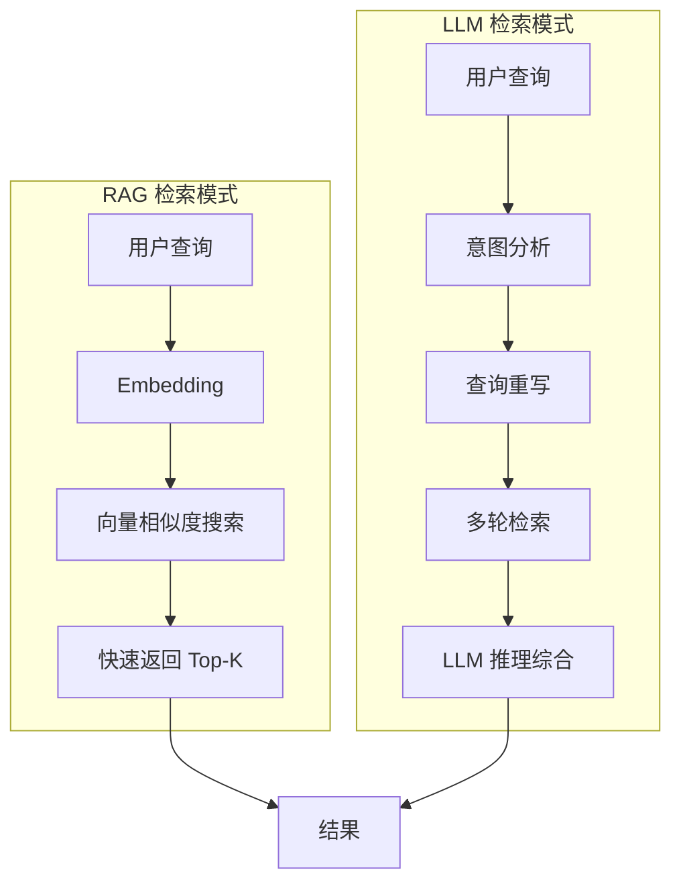
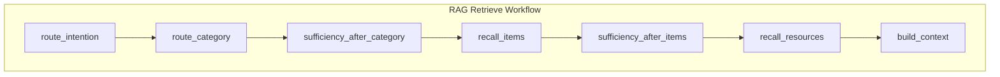
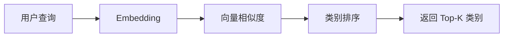
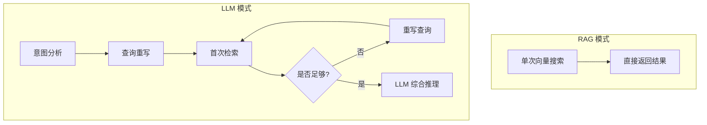
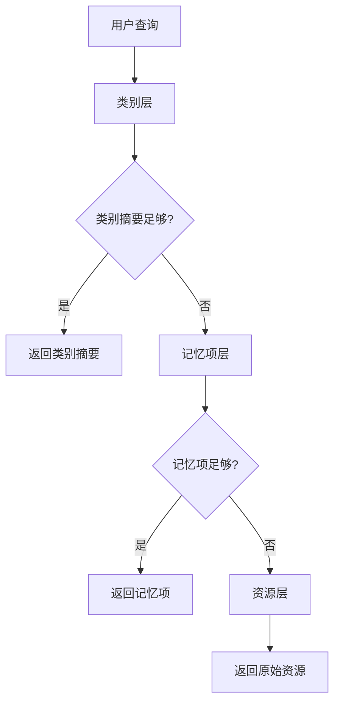

# memU 项目深度分析 (三)：检索流程 (Retrieve) 详解

> 基于源码分析的学习笔记

## 1. Retrieve 流程概述

`retrieve()` 是 memU 的另一个核心 API，负责从记忆库中检索相关信息。

```python
result = await service.retrieve(
    queries=[
        {"role": "user", "content": {"text": "用户的偏好是什么？"}},
        {"role": "assistant", "content": {"text": "好的，让我查一下"}},
        {"role": "user", "content": {"text": "他有什么习惯？"}},   # 真正的查询
    ],
    where={"user_id": "123"},  # 范围过滤
)
```

> **设计要点**：`queries` 是一个**对话历史列表**，**最后一条** message 才是真正的"current query"，前面是用作 query rewriting 的上下文。`method` 不是 `retrieve()` 的参数，而是配置在 `RetrieveConfig.method`（默认 `"rag"`，可改为 `"llm"`）。
>
> 来源：`src/memu/app/retrieve.py` 的 `retrieve()` 与 `_extract_query_text(queries[-1])`。

## 2. 两种检索模式对比



| 特性 | RAG | LLM |
|------|-----|-----|
| **速度** | ⚡ 毫秒级 | 🐢 秒级 |
| **成本** | 低 (仅 Embedding) | 高 (LLM 调用) |
| **准确性** | 基于相似度 | 基于推理 |
| **适用场景** | 实时建议、简单查询 | 复杂理解、多轮推理 |

## 3. RAG 检索工作流

### 3.1 完整流程



### 3.2 各步骤详解

#### Step 1: route_intention (路由意图)

```python
async def _rag_route_intention(self, state: WorkflowState, step_context: Any) -> WorkflowState:
    # 决定是否需要检索
    needs_retrieval, rewritten_query = await self._decide_if_retrieval_needed(
        state["original_query"],
        state["context_queries"],
        retrieved_content=None,
        llm_client=llm_client,
    )
    
    state.update({
        "needs_retrieval": needs_retrieval,
        "rewritten_query": rewritten_query,
        "active_query": rewritten_query,
        "next_step_query": None,
    })
    return state
```

**职责**：在真正进入向量检索前，先用 LLM 判断 **(a) 当前 query 到底要不要检索；(b) 如果要检索，先把代词、省略主语等指代解决掉**。这一步默认开启（`RetrieveConfig.route_intention=True`）。

#### Pre-Retrieval Decision Prompt

源码位置：`src/memu/prompts/retrieve/pre_retrieval_decision.py`：

```1:40:memU/src/memu/prompts/retrieve/pre_retrieval_decision.py
SYSTEM_PROMPT = """
# Task Objective
Determine whether the current query requires retrieving information from memory or can be answered directly without retrieval.
If retrieval is required, rewrite the query to include relevant contextual information.

# Workflow
1. Review the **Query Context** to understand prior conversation and available background.
2. Analyze the **Current Query**.
3. Consider the **Retrieved Content**, if any.
4. Decide whether memory retrieval is required based on the criteria.
5. If retrieval is needed, rewrite the query to incorporate relevant context from the query context.
6. If retrieval is not needed, keep the original query unchanged.

# Rules
- **NO_RETRIEVE** for:
  - Greetings, casual chat, or acknowledgments
  - Questions about only the current conversation/context
  - General knowledge questions
  - Requests for clarification
  - Meta-questions about the system itself
- **RETRIEVE** for:
  - Questions about past events, conversations, or interactions
  - Queries about user preferences, habits, or characteristics
  - Requests to recall specific information
  - Questions referencing historical data
- Do not add external knowledge beyond the provided context.
- If retrieval is not required, return the original query exactly.

# Output Format
Use the following structure:

<decision>
RETRIEVE or NO_RETRIEVE
</decision>

<rewritten_query>
If RETRIEVE: provide a rewritten query incorporating relevant context.
If NO_RETRIEVE: return `{query}` unchanged.
</rewritten_query>
"""
```

#### 与 query_rewriter 的区别

memU 实际上有**两份 prompt**：

| Prompt | 何时使用 | 输出标签 |
|--------|---------|---------|
| `pre_retrieval_decision` | RAG / LLM 模式都用 | `<decision>` + `<rewritten_query>` |
| `query_rewriter`         | 仅在多轮 LLM 模式中作为补强 | `<analysis>` + `<rewritten_query>` |

`query_rewriter` 专门负责**指代消解**（pronouns / referential expressions / implicit context），不判断是否检索：

```1:40:memU/src/memu/prompts/retrieve/query_rewriter.py
PROMPT = """
# Task Objective
Rewrite a user query to make it self-contained and explicit by resolving references and ambiguities using the conversation history.

# Workflow
1. Review the **Conversation History** to identify relevant entities, topics, and context.
2. Analyze the **Current Query**.
3. Determine whether the query contains:
   - Pronouns (e.g., "they", "it", "their", "his", "her")
   - Referential expressions (e.g., "that", "those", "the same")
   - Implicit context (e.g., "what about…", "and also…")
   - Incomplete information that can be inferred from the conversation history
```

#### 输出键

`route_intention` step 在 `state` 中产出：

| 键 | 含义 |
|----|------|
| `needs_retrieval` | bool，决定后续步骤是否真的执行检索 |
| `rewritten_query` | LLM 重写后的查询 |
| `active_query` | 当前轮次使用的查询（首轮等于 rewritten_query） |
| `next_step_query` | 下一轮 sufficiency_check 可能给出的更精确查询 |

如果 `queries` 只有 1 条（`skip_rewrite=True`），LLM 调用会被跳过，直接 `active_query = original_query`。

#### Step 2: route_category (路由类别)

```python
async def _rag_route_category(self, state: WorkflowState, step_context: Any) -> WorkflowState:
    embed_client = self._get_step_embedding_client(step_context)
    
    # 获取所有类别
    category_pool = store.memory_category_repo.list_categories(where_filters)
    
    # 生成查询向量
    qvec = (await embed_client.embed([state["active_query"]]))[0]
    
    # 按摘要相似度排序
    hits, summary_lookup = await self._rank_categories_by_summary(...)
    
    state.update({
        "query_vector": qvec,
        "category_hits": hits,
        "category_summary_lookup": summary_lookup,
    })
    return state
```

**职责**：找到最相关的记忆类别



#### Step 3: sufficiency_after_category (类别充分性检查)

```python
async def _rag_category_sufficiency(self, state: WorkflowState, step_context: Any) -> WorkflowState:
    # 使用 LLM 判断类别摘要是否足够回答问题
    is_sufficient, next_query = await self._check_sufficiency(
        state["active_query"],
        state["context_queries"],
        category_summaries,
        llm_client=llm_client,
    )
    
    state.update({
        "proceed_to_items": not is_sufficient,
        "next_step_query": next_query,
    })
    return state
```

**关键设计**：**渐进式检索**
- 如果类别摘要已经足够 → 直接返回
- 如果不够 → 继续检索具体记忆项

#### Step 4: recall_items (召回记忆项)

```python
async def _rag_recall_items(self, state: WorkflowState, step_context: Any) -> WorkflowState:
    embed_client = self._get_step_embedding_client(step_context)

    # 获取类别关联的记忆项
    item_pool = store.category_item_repo.get_items_by_categories(category_ids)

    # 向量检索
    hits = store.memory_item_repo.vector_search_items(
        query_vec=qvec,
        top_k=top_k,
        where=where_filters,
        ranking=self.retrieve_config.item.ranking,             # similarity / salience
        recency_decay_days=self.retrieve_config.item.recency_decay_days,
    )

    state["item_hits"] = hits
    return state
```

##### 两种 ranking 模式

| 模式 | 公式 | 适用场景 |
|------|------|---------|
| `similarity` (默认) | `cosine(query, item)` | 通用检索 |
| `salience` | `cosine × log(reinforcement+1) × exp(-0.693·days_since/half_life)` | 长期稳定的 user profile，越被反复确认越显著、越新越优先 |

源码：`src/memu/database/inmemory/vector.py::salience_score`

```16:53:memU/src/memu/database/inmemory/vector.py
def salience_score(
    similarity: float,
    reinforcement_count: int,
    last_reinforced_at: datetime | None,
    recency_decay_days: float = 30.0,
) -> float:
    """
    Formula: similarity * reinforcement_factor * recency_factor
    """
    reinforcement_factor = math.log(reinforcement_count + 1)
    if last_reinforced_at is None:
        recency_factor = 0.5
    else:
        ...
        recency_factor = math.exp(-0.693 * days_ago / recency_decay_days)
    return similarity * reinforcement_factor * recency_factor
```

> 详细原理与设计动机见 [第 09 篇：记忆强化与 Salience 评分](./analysis-09-salience-and-reinforcement.md)。

#### Step 5: sufficiency_after_items (记忆项充分性检查)

同样使用 LLM 判断是否需要继续检索资源。

#### Step 6: recall_resources (召回资源)

```python
async def _rag_recall_resources(self, state: WorkflowState, step_context: Any) -> WorkflowState:
    # 基于记忆项获取原始资源
    resource_ids = [item.resource_id for item in item_hits]
    resources = store.resource_repo.get_resources_by_ids(resource_ids)
    
    state["resource_hits"] = resources
    return state
```

#### Step 7: build_context (构建上下文)

```python
async def _rag_build_context(self, state: WorkflowState, step_context: Any) -> WorkflowState:
    response = {
        "categories": category_data,
        "items": item_data,
        "resources": resource_data,
        "next_step_query": state.get("next_step_query"),
    }
    state["response"] = response
    return state
```

## 4. LLM 检索工作流

### 4.1 与 RAG 的区别



### 4.2 核心特点

1. **意图预测** - LLM 推断用户真正想要什么
2. **查询进化** - 根据已有结果优化查询
3. **提前终止** - 找到足够信息就停止
4. **深度推理** - LLM 综合所有上下文

## 5. 渐进式检索策略

memU 的核心设计理念：**按需获取，渐进式深入**



### 5.1 充分性检查 (Sufficiency Check)

```python
async def _check_sufficiency(
    self,
    query: str,
    context_queries: list,
    retrieved_content: str,
    llm_client
) -> tuple[bool, str | None]:
    """
    判断检索结果是否足够回答问题
    
    返回: (是否充分, 可能的下一步查询)
    """
    prompt = f"""
    问题: {query}
    历史上下文: {context_queries}
    已检索内容: {retrieved_content}
    
    请判断以上内容是否足以回答问题。
    如果不足，请提出一个更精确的查询。
    """
```

## 6. 范围过滤 (Where)

`retrieve()` / `memorize()` / CRUD API 都接受 `where` 参数，**字段名必须是 `user_model` 中定义过的字段**——否则 `_normalize_where` 会直接抛 `ValueError`：

```87:104:memU/src/memu/app/retrieve.py
def _normalize_where(self, where: Mapping[str, Any] | None) -> dict[str, Any]:
    """Validate and clean the `where` scope filters against the configured user model."""
    if not where:
        return {}

    valid_fields = set(getattr(self.user_model, "model_fields", {}).keys())
    cleaned: dict[str, Any] = {}

    for raw_key, value in where.items():
        if value is None:
            continue
        field = raw_key.split("__", 1)[0]
        if field not in valid_fields:
            msg = f"Unknown filter field '{field}' for current user scope"
            raise ValueError(msg)
        cleaned[raw_key] = value

    return cleaned
```

### 6.1 支持的操作符

实际上 memU **只支持两种筛选方式**（不支持 `__gte` / `__lte` / `__contains`）：

| 操作符 | 说明 | 示例 |
|--------|------|------|
| 直接相等 | 精确匹配 | `{"user_id": "123"}` |
| `__in`   | 值在列表中 | `{"user_id__in": ["a", "b"]}` |

实现见 `src/memu/database/inmemory/repositories/filter.py::matches_where`。如果你需要更丰富的过滤（时间范围、模糊匹配），需要自己扩展仓储或在 LLM 模式下后置过滤。

### 6.2 用法

```python
# 单值
await service.retrieve(queries=[...], where={"user_id": "123"})

# 多值（OR 关系）
await service.retrieve(queries=[...], where={"user_id__in": ["123", "456"]})
```

### 6.3 自定义 user model 增加更多 scope

```python
from pydantic import BaseModel

class MyScope(BaseModel):
    user_id: str | None = None
    agent_id: str | None = None     # 多 agent 隔离
    session_id: str | None = None   # 单次会话隔离

service = MemoryService(
    user_config={"model": MyScope},
    ...
)
await service.retrieve(
    queries=[...],
    where={"user_id": "123", "agent_id": "support_bot"},
)
```

## 7. 响应格式

```python
{
    "categories": [
        {
            "id": "cat_xxx",
            "name": "用户偏好",
            "description": "记录用户偏好",
            "summary": "用户喜欢简洁的沟通方式...",
            "score": 0.95
        }
    ],
    "items": [
        {
            "id": "item_xxx",
            "memory_type": "profile",
            "summary": "用户喜欢在下午2点喝咖啡",
            "score": 0.88,
            "resource_id": "res_xxx"
        }
    ],
    "resources": [
        {
            "id": "res_xxx",
            "url": "conversation.txt",
            "modality": "conversation",
            "caption": "关于咖啡的讨论"
        }
    ],
    "next_step_query": "用户的饮食习惯"
}
```

## 8. 配置选项

源码：`src/memu/app/settings.py`：

```python
class RetrieveCategoryConfig(BaseModel):
    enabled: bool = True
    top_k: int = 5

class RetrieveItemConfig(BaseModel):
    enabled: bool = True
    top_k: int = 5
    use_category_references: bool = False              # 顺着 [ref:ITEM_ID] 拉取被类别摘要引用的记忆项
    ranking: Literal["similarity", "salience"] = "similarity"
    recency_decay_days: float = 30.0                   # salience 模式下的半衰期（天）

class RetrieveResourceConfig(BaseModel):
    enabled: bool = True
    top_k: int = 5

class RetrieveConfig(BaseModel):
    method: Literal["rag", "llm"] = "rag"
    route_intention: bool = True                       # ⚠️ 默认开启
    category: RetrieveCategoryConfig
    item: RetrieveItemConfig
    resource: RetrieveResourceConfig
    sufficiency_check: bool = True                     # ⚠️ 默认开启
    sufficiency_check_prompt: str = ""
    sufficiency_check_llm_profile: str = "default"
    llm_ranking_llm_profile: str = "default"
```

**注意默认值**：

- `route_intention=True`：意图路由默认就会触发一次 LLM 调用判断 `RETRIEVE / NO_RETRIEVE`。如果你的查询场景非常确定一定要查记忆（例如内部工具调用），可以关掉它来省一次 LLM 调用。
- `sufficiency_check=True`：每一层（category / item / resource）后都会触发 LLM 充分性检查。在小数据量场景里这意味着检索 1 次可能要发起 4 次以上 LLM 调用，**性价比要权衡**——可以在低延迟场景关掉，靠 `top_k` 控制召回数量。

## 9. 使用示例

### 9.1 基础检索

```python
result = await service.retrieve(
    queries=[{"role": "user", "content": {"text": "用户的咖啡偏好"}}]
)
```

### 9.2 多轮对话检索

```python
result = await service.retrieve(
    queries=[
        {"role": "user", "content": {"text": "他在公司负责什么?"}},
        {"role": "user", "content": {"text": "他有什么技能?"}}
    ]
)
```

### 9.3 启用 LLM 深度推理

```python
result = await service.retrieve(
    queries=[...],
    method="llm"  # 使用 LLM 模式
)
```

### 9.4 用户范围过滤

```python
result = await service.retrieve(
    queries=[...],
    where={"user_id": "123", "team_id": "engineering"}
)
```

## 10. 性能优化技巧

### 10.1 批量检索

```python
# 一次性检索多个查询
queries = [
    {"role": "user", "content": {"text": query1}},
    {"role": "user", "content": {"text": query2}},
    ...
]
result = await service.retrieve(queries=queries)
```

### 10.2 禁用不需要的层级

```python
service.retrieve_config.category.enabled = False  # 跳过类别检索
service.retrieve_config.resource.enabled = False  # 跳过资源检索
```

### 10.3 调整 Top-K

```python
service.retrieve_config.category.top_k = 5   # 更多类别
service.retrieve_config.item.top_k = 10     # 更多记忆项
```

## 11. 总结

Retrieve 流程的核心设计：

1. **双模式检索** - RAG 快、LLM 深，各取所长
2. **渐进式深入** - 按需获取，避免过度检索
3. **充分性检查** - LLM 判断何时停止
4. **意图路由** - 决定是否需要检索
5. **灵活过滤** - 细粒度范围控制

这使得 memU 能够高效地提供"对上下文敏感"的记忆检索。
