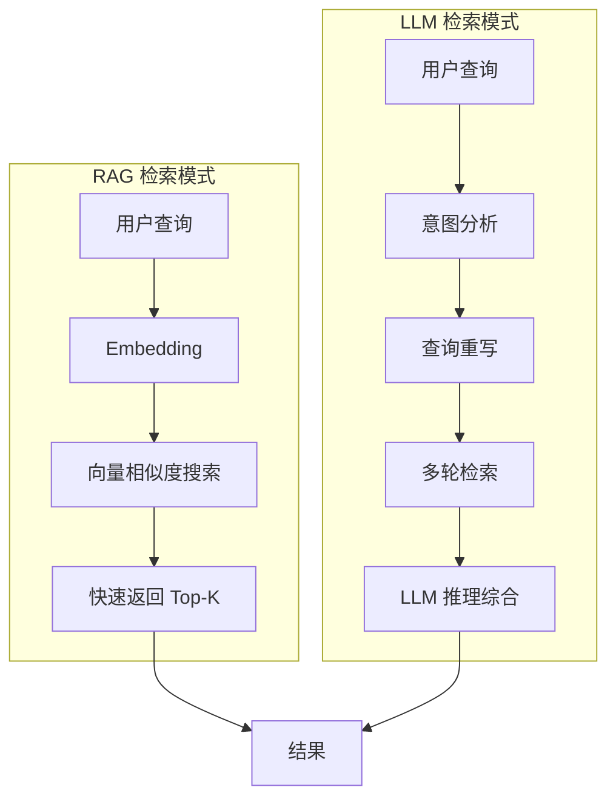
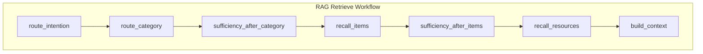
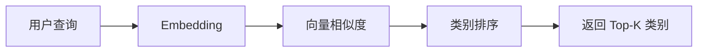
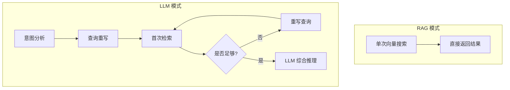
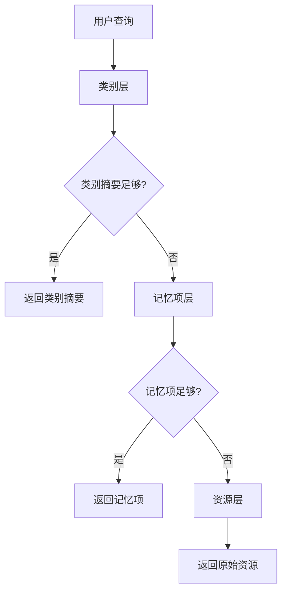

# memU 项目深度分析 (三)：检索流程 (Retrieve) 详解

> 基于源码分析的学习笔记

## 1. Retrieve 流程概述

`retrieve()` 是 memU 的另一个核心 API，负责从记忆库中检索相关信息。

```python
result = await service.retrieve(
    queries=[
        {"role": "user", "content": {"text": "用户的偏好是什么？"}},
        {"role": "user", "content": {"text": "他有什么习惯？"}}
    ],
    where={"user_id": "123"},  # 范围过滤
    method="rag"  # 或 "llm"
)
```

## 2. 两种检索模式对比



| 特性 | RAG | LLM |
|------|-----|-----|
| **速度** | ⚡ 毫秒级 | 🐢 秒级 |
| **成本** | 低 (仅 Embedding) | 高 (LLM 调用) |
| **准确性** | 基于相似度 | 基于推理 |
| **适用场景** | 实时建议、简单查询 | 复杂理解、多轮推理 |

## 3. RAG 检索工作流

### 3.1 完整流程



### 3.2 各步骤详解

#### Step 1: route_intention (路由意图)

```python
async def _rag_route_intention(self, state: WorkflowState, step_context: Any) -> WorkflowState:
    # 决定是否需要检索
    needs_retrieval, rewritten_query = await self._decide_if_retrieval_needed(
        state["original_query"],
        state["context_queries"],
        retrieved_content=None,
        llm_client=llm_client,
    )
    
    state.update({
        "needs_retrieval": needs_retrieval,
        "rewritten_query": rewritten_query,
        "active_query": rewritten_query,
        "next_step_query": None,
    })
    return state
```

**职责**：判断是否需要检索，避免不必要的 LLM 调用

```python
# 预检索决策 Prompt
SYSTEM_PROMPT = """
你是一个智能助手，负责决定是否需要从记忆库中检索信息。
"""
USER_PROMPT = """
用户问题: {query}
历史上下文: {context}

请判断是否需要检索记忆来回答这个问题。
"""
```

**输出**：
- `needs_retrieval`: 是否需要检索
- `rewritten_query`: 优化后的查询
- `active_query`: 当前活跃查询
- `next_step_query`: 可能的下一步查询

#### Step 2: route_category (路由类别)

```python
async def _rag_route_category(self, state: WorkflowState, step_context: Any) -> WorkflowState:
    embed_client = self._get_step_embedding_client(step_context)
    
    # 获取所有类别
    category_pool = store.memory_category_repo.list_categories(where_filters)
    
    # 生成查询向量
    qvec = (await embed_client.embed([state["active_query"]]))[0]
    
    # 按摘要相似度排序
    hits, summary_lookup = await self._rank_categories_by_summary(...)
    
    state.update({
        "query_vector": qvec,
        "category_hits": hits,
        "category_summary_lookup": summary_lookup,
    })
    return state
```

**职责**：找到最相关的记忆类别



#### Step 3: sufficiency_after_category (类别充分性检查)

```python
async def _rag_category_sufficiency(self, state: WorkflowState, step_context: Any) -> WorkflowState:
    # 使用 LLM 判断类别摘要是否足够回答问题
    is_sufficient, next_query = await self._check_sufficiency(
        state["active_query"],
        state["context_queries"],
        category_summaries,
        llm_client=llm_client,
    )
    
    state.update({
        "proceed_to_items": not is_sufficient,
        "next_step_query": next_query,
    })
    return state
```

**关键设计**：**渐进式检索**
- 如果类别摘要已经足够 → 直接返回
- 如果不够 → 继续检索具体记忆项

#### Step 4: recall_items (召回记忆项)

```python
async def _rag_recall_items(self, state: WorkflowState, step_context: Any) -> WorkflowState:
    embed_client = self._get_step_embedding_client(step_context)
    
    # 获取类别关联的记忆项
    item_pool = store.category_item_repo.get_items_by_categories(category_ids)
    
    # 向量检索
    item_embeddings = store.memory_item_repo.get_embeddings(item_ids)
    hits = cosine_topk(query_vector, item_embeddings, top_k)
    
    state["item_hits"] = hits
    return state
```

#### Step 5: sufficiency_after_items (记忆项充分性检查)

同样使用 LLM 判断是否需要继续检索资源。

#### Step 6: recall_resources (召回资源)

```python
async def _rag_recall_resources(self, state: WorkflowState, step_context: Any) -> WorkflowState:
    # 基于记忆项获取原始资源
    resource_ids = [item.resource_id for item in item_hits]
    resources = store.resource_repo.get_resources_by_ids(resource_ids)
    
    state["resource_hits"] = resources
    return state
```

#### Step 7: build_context (构建上下文)

```python
async def _rag_build_context(self, state: WorkflowState, step_context: Any) -> WorkflowState:
    response = {
        "categories": category_data,
        "items": item_data,
        "resources": resource_data,
        "next_step_query": state.get("next_step_query"),
    }
    state["response"] = response
    return state
```

## 4. LLM 检索工作流

### 4.1 与 RAG 的区别



### 4.2 核心特点

1. **意图预测** - LLM 推断用户真正想要什么
2. **查询进化** - 根据已有结果优化查询
3. **提前终止** - 找到足够信息就停止
4. **深度推理** - LLM 综合所有上下文

## 5. 渐进式检索策略

memU 的核心设计理念：**按需获取，渐进式深入**



### 5.1 充分性检查 (Sufficiency Check)

```python
async def _check_sufficiency(
    self,
    query: str,
    context_queries: list,
    retrieved_content: str,
    llm_client
) -> tuple[bool, str | None]:
    """
    判断检索结果是否足够回答问题
    
    返回: (是否充分, 可能的下一步查询)
    """
    prompt = f"""
    问题: {query}
    历史上下文: {context_queries}
    已检索内容: {retrieved_content}
    
    请判断以上内容是否足以回答问题。
    如果不足，请提出一个更精确的查询。
    """
```

## 6. 范围过滤 (Where)

memU 支持细粒度的检索范围控制：

```python
# 基本用法
result = await service.retrieve(
    queries=[...],
    where={"user_id": "123"}  # 只检索特定用户
)

# 高级过滤
result = await service.retrieve(
    queries=[...],
    where={
        "user_id": "123",
        "created_at__gte": "2024-01-01"
    }
)
```

### 6.1 支持的操作符

| 操作符 | 说明 | 示例 |
|--------|------|------|
| `__exact` | 精确匹配 | `user_id__exact="123"` |
| `__in` | 在列表中 | `user_id__in=["1","2","3"]` |
| `__gte` | 大于等于 | `created_at__gte="2024-01-01"` |
| `__lte` | 小于等于 | `created_at__lte="2024-12-31"` |
| `__contains` | 包含 | `name__contains="test"` |

## 7. 响应格式

```python
{
    "categories": [
        {
            "id": "cat_xxx",
            "name": "用户偏好",
            "description": "记录用户偏好",
            "summary": "用户喜欢简洁的沟通方式...",
            "score": 0.95
        }
    ],
    "items": [
        {
            "id": "item_xxx",
            "memory_type": "profile",
            "summary": "用户喜欢在下午2点喝咖啡",
            "score": 0.88,
            "resource_id": "res_xxx"
        }
    ],
    "resources": [
        {
            "id": "res_xxx",
            "url": "conversation.txt",
            "modality": "conversation",
            "caption": "关于咖啡的讨论"
        }
    ],
    "next_step_query": "用户的饮食习惯"
}
```

## 8. 配置选项

```python
@dataclass
class RetrieveConfig:
    # 检索方法
    method: Literal["rag", "llm"] = "rag"
    
    # 各层级配置
    category: CategoryRetrieveConfig
    item: ItemRetrieveConfig  
    resource: ResourceRetrieveConfig
    
    # 意图路由
    route_intention: bool = False
    
    # 充分性检查
    sufficiency_check: bool = False
    sufficiency_check_llm_profile: str | None = None
    
    # LLM Profile
    method_llm_profile: str | None = None

@dataclass
class CategoryRetrieveConfig:
    enabled: bool = True
    top_k: int = 3
```

## 9. 使用示例

### 9.1 基础检索

```python
result = await service.retrieve(
    queries=[{"role": "user", "content": {"text": "用户的咖啡偏好"}}]
)
```

### 9.2 多轮对话检索

```python
result = await service.retrieve(
    queries=[
        {"role": "user", "content": {"text": "他在公司负责什么?"}},
        {"role": "user", "content": {"text": "他有什么技能?"}}
    ]
)
```

### 9.3 启用 LLM 深度推理

```python
result = await service.retrieve(
    queries=[...],
    method="llm"  # 使用 LLM 模式
)
```

### 9.4 用户范围过滤

```python
result = await service.retrieve(
    queries=[...],
    where={"user_id": "123", "team_id": "engineering"}
)
```

## 10. 性能优化技巧

### 10.1 批量检索

```python
# 一次性检索多个查询
queries = [
    {"role": "user", "content": {"text": query1}},
    {"role": "user", "content": {"text": query2}},
    ...
]
result = await service.retrieve(queries=queries)
```

### 10.2 禁用不需要的层级

```python
service.retrieve_config.category.enabled = False  # 跳过类别检索
service.retrieve_config.resource.enabled = False  # 跳过资源检索
```

### 10.3 调整 Top-K

```python
service.retrieve_config.category.top_k = 5   # 更多类别
service.retrieve_config.item.top_k = 10     # 更多记忆项
```

## 11. 总结

Retrieve 流程的核心设计：

1. **双模式检索** - RAG 快、LLM 深，各取所长
2. **渐进式深入** - 按需获取，避免过度检索
3. **充分性检查** - LLM 判断何时停止
4. **意图路由** - 决定是否需要检索
5. **灵活过滤** - 细粒度范围控制

这使得 memU 能够高效地提供"对上下文敏感"的记忆检索。
