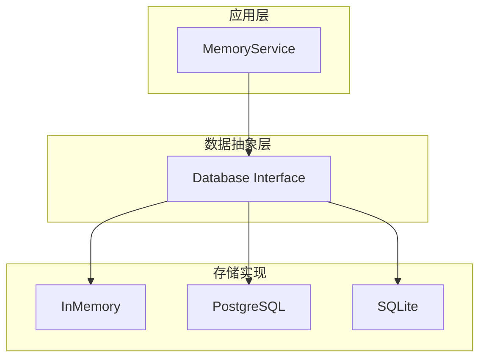
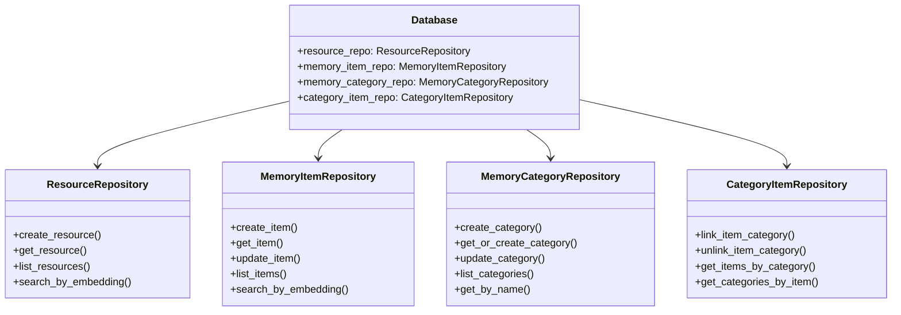

# memU 项目深度分析 (四)：数据层与存储架构

> 基于源码分析的学习笔记

## 1. 数据层概述

memU 支持多种数据存储后端，采用统一的接口设计：



## 2. 核心接口设计

### 2.1 Database 接口

```python
# src/memu/database/interfaces.py
class Database(Protocol):
    """数据库抽象接口"""
    
    @property
    def resource_repo(self) -> ResourceRepository: ...
    
    @property
    def memory_item_repo(self) -> MemoryItemRepository: ...
    
    @property
    def memory_category_repo(self) -> MemoryCategoryRepository: ...
    
    @property
    def category_item_repo(self) -> CategoryItemRepository: ...
```

### 2.2 四大仓库



## 3. 数据模型

### 3.1 基础模型

```python
class BaseRecord(BaseModel):
    id: str = Field(default_factory=lambda: str(uuid.uuid4()))
    created_at: datetime = Field(default_factory=lambda: pendulum.now("UTC"))
    updated_at: datetime = Field(default_factory=lambda: pendulum.now("UTC"))
```

### 3.2 Resource (资源)

```python
class Resource(BaseRecord):
    url: str                      # 资源来源 URL
    modality: str                 # 类型: conversation/document/image/video/audio
    local_path: str              # 本地存储路径
    caption: str | None          # 摘要描述
    embedding: list[float] | None # 语义向量
    # 继承自 BaseRecord:
    # id, created_at, updated_at
```

### 3.3 MemoryItem (记忆项)

```python
class MemoryItem(BaseRecord):
    resource_id: str | None       # 关联的资源
    memory_type: str              # 记忆类型
    summary: str                  # 记忆内容
    embedding: list[float] | None # 语义向量
    happened_at: datetime | None # 发生时间
    extra: dict[str, Any]         # 扩展字段
```

**extra 字段可能包含**：
```python
{
    # 强化记忆相关
    "content_hash": str,
    "reinforcement_count": int,
    "last_reinforced_at": str,
    
    # 引用相关
    "ref_id": str,
    
    # 工具记忆相关
    "when_to_use": str,
    "metadata": dict,
    "tool_calls": list[ToolCallResult]
}
```

### 3.4 MemoryCategory (类别)

```python
class MemoryCategory(BaseRecord):
    name: str                    # 类别名称
    description: str           # 类别描述
    embedding: list[float] | None  # 语义向量
    summary: str | None         # 类别摘要（自动更新）
```

### 3.5 CategoryItem (关联表)

```python
class CategoryItem(BaseRecord):
    item_id: str       # 记忆项 ID
    category_id: str   # 类别 ID
```

## 4. 存储实现

### 4.1 InMemory 实现

```python
# src/memu/database/inmemory/
class InMemoryDatabase:
    """内存数据库实现"""
    
    def __init__(self, config, user_model):
        self.resource_repo = InMemoryResourceRepository()
        self.memory_item_repo = InMemoryMemoryItemRepository()
        self.memory_category_repo = InMemoryMemoryCategoryRepository()
        self.category_item_repo = InMemoryCategoryItemRepository()
```

**特点**：
- 纯内存存储，重启丢失
- 速度快，适合开发测试
- 支持向量搜索（基于 numpy）

### 4.2 PostgreSQL 实现

```python
# src/memu/database/postgres/
class PostgresDatabase:
    """PostgreSQL + pgvector 实现"""
    
    def __init__(self, config, user_model):
        # 使用 pgvector 存储向量
        self.resource_repo = PostgresResourceRepository()
        self.memory_item_repo = PostgresMemoryItemRepository()
        # ...
```

**特点**：
- 持久化存储
- 支持 pgvector 向量索引
- 适合生产环境

### 4.3 SQLite 实现

```python
# src/memu/database/sqlite/
class SQLiteDatabase:
    """SQLite 实现"""
    
    def __init__(self, config, user_model):
        self.resource_repo = SQLiteResourceRepository()
        # ...
```

**特点**：
- 单文件存储
- 无需额外依赖
- 适合轻量级应用

## 5. 向量搜索

### 5.1 InMemory 向量搜索

```python
# src/memu/database/inmemory/vector.py
def cosine_topk(query_vector: list[float], vectors: list[list[float]], top_k: int):
    """计算余弦相似度并返回 Top-K"""
    
    # 归一化
    query_norm = normalize(query_vector)
    vector_norms = normalize_vectors(vectors)
    
    # 计算点积
    similarities = dot(query_norm, vector_norms)
    
    # 排序取 Top-K
    top_indices = np.argsort(similarities)[-top_k:][::-1]
    
    return [(idx, similarities[idx]) for idx in top_indices]
```

### 5.2 PostgreSQL 向量搜索

```sql
-- 使用 pgvector 的余弦距离
SELECT id, summary, 
       1 - (embedding <=> $query_vector) AS similarity
FROM memory_items
ORDER BY embedding <=> $query_vector
LIMIT $top_k;
```

## 6. 用户作用域 (User Scope)

memU 支持多用户隔离，通过用户模型实现：

### 6.1 定义用户模型

```python
from pydantic import BaseModel

class User(BaseModel):
    user_id: str
    team_id: str | None = None
    org_id: str | None = None
```

### 6.2 创建作用域模型

```python
# 自动合并用户模型和数据模型
def build_scoped_models(user_model: type[BaseModel]):
    resource_model = merge_scope_model(user_model, Resource, name_suffix="Resource")
    memory_category_model = merge_scope_model(user_model, MemoryCategory, name_suffix="MemoryCategory")
    memory_item_model = merge_scope_model(user_model, MemoryItem, name_suffix="MemoryItem")
    category_item_model = merge_scope_model(user_model, CategoryItem, name_suffix="CategoryItem")
    
    return resource_model, memory_category_model, memory_item_model, category_item_model
```

### 6.3 使用示例

```python
from memu import MemoryService
from pydantic import BaseModel

class User(BaseModel):
    user_id: str
    team_id: str

service = MemoryService(
    user_config={"model": User},
    ...
)

# 查询时自动添加用户过滤
result = await service.retrieve(
    queries=[...],
    where={"user_id": "123"}  # 自动过滤
)
```

## 7. 仓储实现详解

### 7.1 ResourceRepository

```python
class ResourceRepository(Protocol):
    def create_resource(
        self,
        url: str,
        modality: str,
        local_path: str,
        caption: str | None = None,
        embedding: list[float] | None = None,
        user_data: dict | None = None,
    ) -> Resource: ...
    
    def get_resource(self, resource_id: str) -> Resource | None: ...
    
    def list_resources(
        self,
        where: dict | None = None,
        limit: int = 100,
    ) -> list[Resource]: ...
    
    def search_by_embedding(
        self,
        query_vector: list[float],
        top_k: int = 10,
        where: dict | None = None,
    ) -> list[tuple[Resource, float]]: ...
```

### 7.2 MemoryItemRepository

```python
class MemoryItemRepository(Protocol):
    def create_item(
        self,
        resource_id: str | None,
        memory_type: str,
        summary: str,
        embedding: list[float] | None = None,
        user_data: dict | None = None,
        reinforce: bool = False,
    ) -> MemoryItem: ...
    
    def get_item(self, item_id: str) -> MemoryItem | None: ...
    
    def update_item(
        self,
        item_id: str,
        summary: str | None = None,
        extra: dict | None = None,
    ) -> MemoryItem | None: ...
    
    def list_items(
        self,
        memory_type: str | None = None,
        where: dict | None = None,
        limit: int = 100,
    ) -> list[MemoryItem]: ...
    
    def search_by_embedding(
        self,
        query_vector: list[float],
        top_k: int = 10,
        memory_type: str | None = None,
        where: dict | None = None,
    ) -> list[tuple[MemoryItem, float]]: ...
```

### 7.3 MemoryCategoryRepository

```python
class MemoryCategoryRepository(Protocol):
    def create_category(
        self,
        name: str,
        description: str = "",
        embedding: list[float] | None = None,
        user_data: dict | None = None,
    ) -> MemoryCategory: ...
    
    def get_or_create_category(
        self,
        name: str,
        description: str = "",
        embedding: list[float] | None = None,
        user_data: dict | None = None,
    ) -> MemoryCategory: ...
    
    def update_category(
        self,
        category_id: str,
        summary: str | None = None,
    ) -> MemoryCategory | None: ...
    
    def list_categories(
        self,
        where: dict | None = None,
    ) -> list[MemoryCategory]: ...
    
    def search_by_embedding(
        self,
        query_vector: list[float],
        top_k: int = 10,
        where: dict | None = None,
    ) -> list[tuple[MemoryCategory, float]]: ...
```

### 7.4 CategoryItemRepository

```python
class CategoryItemRepository(Protocol):
    def link_item_category(
        self,
        item_id: str,
        category_id: str,
        user_data: dict | None = None,
    ) -> CategoryItem: ...
    
    def unlink_item_category(
        self,
        item_id: str,
        category_id: str,
    ) -> bool: ...
    
    def get_items_by_category(
        self,
        category_id: str,
        where: dict | None = None,
    ) -> list[str]:  # item_ids
    
    def get_categories_by_item(
        self,
        item_id: str,
        where: dict | None = None,
    ) -> list[str]:  # category_ids
```

## 8. 数据库工厂

```python
# src/memu/database/factory.py
def build_database(
    config: DatabaseConfig,
    user_model: type[BaseModel],
) -> Database:
    """根据配置创建数据库实例"""
    
    metadata_provider = config.metadata_store.provider
    
    if metadata_provider == "inmemory":
        return InMemoryDatabase(config, user_model)
    elif metadata_provider == "postgres":
        return PostgresDatabase(config, user_model)
    elif metadata_provider == "sqlite":
        return SQLiteDatabase(config, user_model)
    else:
        raise ValueError(f"Unknown provider: {metadata_provider}")
```

## 9. 配置示例

### 9.1 内存数据库

```python
from memu import MemoryService

service = MemoryService(
    database_config={
        "metadata_store": {"provider": "inmemory"},
        "vector_index": {"provider": "inmemory"}
    }
)
```

### 9.2 PostgreSQL

```python
service = MemoryService(
    database_config={
        "metadata_store": {
            "provider": "postgres",
            "connection": {
                "host": "localhost",
                "port": 5432,
                "database": "memu",
                "user": "postgres",
                "password": "password"
            }
        },
        "vector_index": {
            "provider": "postgres"
        }
    }
)
```

### 9.3 SQLite

```python
service = MemoryService(
    database_config={
        "metadata_store": {
            "provider": "sqlite",
            "connection": {
                "path": "./memu.db"
            }
        }
    }
)
```

## 10. 状态管理

```python
# src/memu/database/inmemory/state.py
class InMemoryState:
    """内存数据库状态"""
    
    def __init__(self):
        self.resources: dict[str, Resource] = {}
        self.memory_items: dict[str, MemoryItem] = {}
        self.categories: dict[str, MemoryCategory] = {}
        self.category_items: dict[str, list[CategoryItem]] = {}  # category_id -> items
        
        # 向量存储
        self.resource_embeddings: dict[str, list[float]] = {}
        self.item_embeddings: dict[str, list[float]] = {}
        self.category_embeddings: dict[str, list[float]] = {}
```

## 11. 总结

memU 数据层的设计特点：

1. **统一接口** - Protocol 定义抽象，四大仓库各司其职
2. **多后端支持** - InMemory/PostgreSQL/SQLite 随意切换
3. **向量支持** - 内置向量搜索，pgvector 加持
4. **用户隔离** - User Scope 实现多租户
5. **可扩展性** - 易于添加新的存储后端

这种设计使得 memU 既适合快速开发测试，也能满足生产环境的高并发需求。
