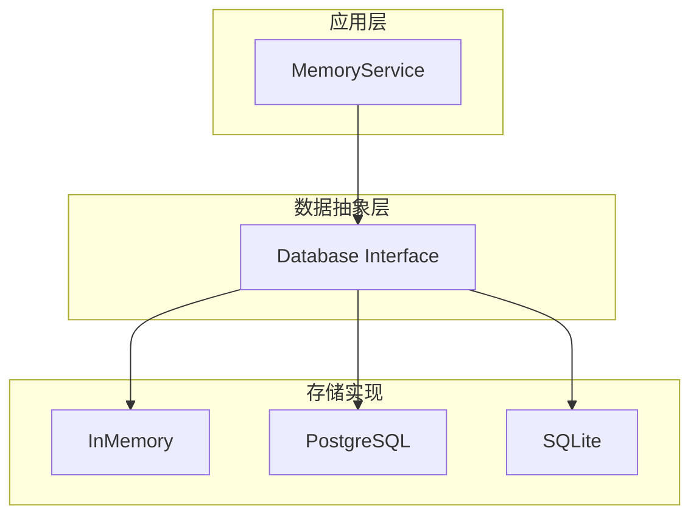
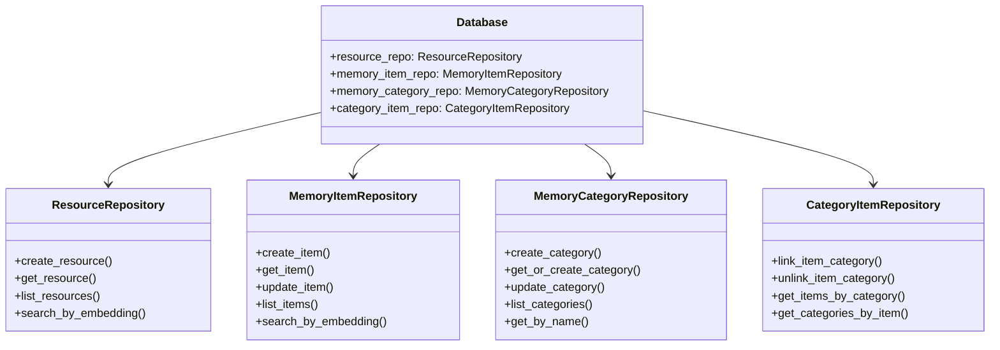

# memU 项目深度分析 (四)：数据层与存储架构

> 基于源码分析的学习笔记

## 1. 数据层概述

memU 支持多种数据存储后端，采用统一的接口设计：



## 2. 核心接口设计

### 2.1 Database 接口

```python
# src/memu/database/interfaces.py
class Database(Protocol):
    """数据库抽象接口"""
    
    @property
    def resource_repo(self) -> ResourceRepository: ...
    
    @property
    def memory_item_repo(self) -> MemoryItemRepository: ...
    
    @property
    def memory_category_repo(self) -> MemoryCategoryRepository: ...
    
    @property
    def category_item_repo(self) -> CategoryItemRepository: ...
```

### 2.2 四大仓库



## 3. 数据模型

### 3.1 基础模型

```python
class BaseRecord(BaseModel):
    id: str = Field(default_factory=lambda: str(uuid.uuid4()))
    created_at: datetime = Field(default_factory=lambda: pendulum.now("UTC"))
    updated_at: datetime = Field(default_factory=lambda: pendulum.now("UTC"))
```

### 3.2 Resource (资源)

```python
class Resource(BaseRecord):
    url: str                      # 资源来源 URL
    modality: str                 # 类型: conversation/document/image/video/audio
    local_path: str              # 本地存储路径
    caption: str | None          # 摘要描述
    embedding: list[float] | None # 语义向量
    # 继承自 BaseRecord:
    # id, created_at, updated_at
```

### 3.3 MemoryItem (记忆项)

```python
class MemoryItem(BaseRecord):
    resource_id: str | None       # 关联的资源
    memory_type: str              # 记忆类型
    summary: str                  # 记忆内容
    embedding: list[float] | None # 语义向量
    happened_at: datetime | None  # 发生时间
    extra: dict[str, Any]         # 扩展字段（见下）
```

#### 关键设计：`extra` 是一个"按需扩展"的口袋

memU **没有**把 `reinforcement_count` / `content_hash` 这些定义成 `MemoryItem` 的一等字段，而是统一塞进 `extra: dict`。原因有二：

1. **不破坏数据库 schema**：在 SQL 后端中 `extra` 是一个 JSON 列，新加字段无需迁表；
2. **不同记忆类型用不同子结构**：例如只有 tool 记忆才有 `tool_calls`，普通 profile 记忆带它就是浪费。

实际可能出现的字段：

| 字段 | 由谁写入 | 含义 |
|------|---------|------|
| `content_hash` | `create_item_reinforce` | `sha256(memory_type + summary)`，作为同 user scope 内的去重键 |
| `reinforcement_count` | 同上 | 该记忆被反复确认的次数，初始为 1 |
| `last_reinforced_at` | 同上 | ISO8601 时间戳，最近一次被强化的时间 |
| `ref_id` | `_persist_item_references` | 用于支持类别摘要中的 `[ref:ITEM_ID]` 引用 |
| `when_to_use` | tool memory | "什么时候该调用这个工具"的人类语言说明 |
| `metadata` | tool memory | 工具的结构化元信息（参数 schema 等） |
| `tool_calls` | tool memory | 历史调用的 input/output 样本 |

#### 为什么 `extra` 这种设计很关键？

如果你打算二次开发 memU，几乎所有"加一点东西又不想破坏既有代码"的场景，都可以塞进 `extra`：

- 给某条记忆加 `confidence_score`
- 给某条记忆打 `tags`（文章/笔记的多标签）
- 标注 `source_session_id`，方便后期审计

—— 都不需要改 SQLAlchemy 模型，只需要在自己的 step handler / interceptor 里读写 `extra` 即可。代价是这些字段没有索引，查询性能依赖于在 user scope 上先收窄候选集，再在 Python / JSON 函数里二次过滤。

### 3.4 MemoryCategory (类别)

```python
class MemoryCategory(BaseRecord):
    name: str                    # 类别名称
    description: str           # 类别描述
    embedding: list[float] | None  # 语义向量
    summary: str | None         # 类别摘要（自动更新）
```

### 3.5 CategoryItem (关联表)

```python
class CategoryItem(BaseRecord):
    item_id: str       # 记忆项 ID
    category_id: str   # 类别 ID
```

## 4. 存储实现

### 4.1 InMemory 实现

```python
# src/memu/database/inmemory/
class InMemoryDatabase:
    """内存数据库实现"""
    
    def __init__(self, config, user_model):
        self.resource_repo = InMemoryResourceRepository()
        self.memory_item_repo = InMemoryMemoryItemRepository()
        self.memory_category_repo = InMemoryMemoryCategoryRepository()
        self.category_item_repo = InMemoryCategoryItemRepository()
```

**特点**：
- 纯内存存储，重启丢失
- 速度快，适合开发测试
- 支持向量搜索（基于 numpy）

### 4.2 PostgreSQL 实现

```python
# src/memu/database/postgres/
class PostgresDatabase:
    """PostgreSQL + pgvector 实现"""
    
    def __init__(self, config, user_model):
        # 使用 pgvector 存储向量
        self.resource_repo = PostgresResourceRepository()
        self.memory_item_repo = PostgresMemoryItemRepository()
        # ...
```

**特点**：
- 持久化存储
- 支持 pgvector 向量索引
- 适合生产环境

### 4.3 SQLite 实现

```python
# src/memu/database/sqlite/
class SQLiteDatabase:
    """SQLite 实现"""
    
    def __init__(self, config, user_model):
        self.resource_repo = SQLiteResourceRepository()
        # ...
```

**特点**：
- 单文件存储
- 无需额外依赖
- 适合轻量级应用

## 5. 向量搜索

### 5.1 InMemory 向量搜索

memU 的内存实现做了一点**性能小优化**——用 `argpartition` 代替全排序：

```56:91:memU/src/memu/database/inmemory/vector.py
def cosine_topk(
    query_vec: list[float],
    corpus: Iterable[tuple[str, list[float] | None]],
    k: int = 5,
) -> list[tuple[str, float]]:
    ids: list[str] = []
    vecs: list[list[float]] = []
    for _id, vec in corpus:
        if vec is not None:
            ids.append(_id)
            vecs.append(cast(list[float], vec))

    if not vecs:
        return []

    q = np.array(query_vec, dtype=np.float32)
    matrix = np.array(vecs, dtype=np.float32)

    q_norm = np.linalg.norm(q)
    vec_norms = np.linalg.norm(matrix, axis=1)
    scores = matrix @ q / (vec_norms * q_norm + 1e-9)

    n = len(scores)
    actual_k = min(k, n)
    if actual_k == n:
        topk_indices = np.argsort(scores)[::-1]
    else:
        # O(n) topk vs O(n log n) full sort
        topk_indices = np.argpartition(scores, -actual_k)[-actual_k:]
        topk_indices = topk_indices[np.argsort(scores[topk_indices])[::-1]]

    return [(ids[i], float(scores[i])) for i in topk_indices]
```

> 注意 `+ 1e-9` 防止零向量除零。

### 5.2 Salience-aware 向量搜索

通过 `RetrieveItemConfig.ranking="salience"`，召回阶段会切换到 `cosine_topk_salience`，把"反复确认次数 + 最近被提及程度"也纳入排序：

```94:127:memU/src/memu/database/inmemory/vector.py
def cosine_topk_salience(
    query_vec: list[float],
    corpus: Iterable[tuple[str, list[float] | None, int, datetime | None]],
    k: int = 5,
    recency_decay_days: float = 30.0,
) -> list[tuple[str, float]]:
    """
    Top-k retrieval using salience-aware scoring.

    Ranks memories by: similarity * log(reinforcement+1) * recency_decay
    """
    q = np.array(query_vec, dtype=np.float32)
    scored: list[tuple[str, float]] = []

    for _id, vec, reinforcement_count, last_reinforced_at in corpus:
        if vec is None:
            continue
        ...
        score = salience_score(similarity, reinforcement_count, last_reinforced_at, recency_decay_days)
        scored.append((_id, score))

    scored.sort(key=lambda x: x[1], reverse=True)
    return scored[:k]
```

更详细的设计动机见 [第 09 篇：记忆强化与 Salience 评分](./analysis-09-salience-and-reinforcement.md)。

### 5.3 PostgreSQL 向量搜索

```sql
-- 使用 pgvector 的余弦距离运算符 <=>
SELECT id, summary,
       1 - (embedding <=> $query_vector) AS similarity
FROM memory_items
ORDER BY embedding <=> $query_vector
LIMIT $top_k;
```

PostgreSQL 后端的实现位于 `src/memu/database/postgres/postgres.py`，构造时会根据 `vector_provider == "pgvector"` 决定是否启用真正的 vector 列；否则退化为存 JSON + Python 端排序。

## 6. 用户作用域 (User Scope)

memU 支持多用户隔离，通过用户模型实现：

### 6.1 定义用户模型

```python
from pydantic import BaseModel

class User(BaseModel):
    user_id: str
    team_id: str | None = None
    org_id: str | None = None
```

### 6.2 创建作用域模型

```python
# 自动合并用户模型和数据模型
def build_scoped_models(user_model: type[BaseModel]):
    resource_model = merge_scope_model(user_model, Resource, name_suffix="Resource")
    memory_category_model = merge_scope_model(user_model, MemoryCategory, name_suffix="MemoryCategory")
    memory_item_model = merge_scope_model(user_model, MemoryItem, name_suffix="MemoryItem")
    category_item_model = merge_scope_model(user_model, CategoryItem, name_suffix="CategoryItem")
    
    return resource_model, memory_category_model, memory_item_model, category_item_model
```

### 6.3 使用示例

```python
from memu import MemoryService
from pydantic import BaseModel

class User(BaseModel):
    user_id: str
    team_id: str

service = MemoryService(
    user_config={"model": User},
    ...
)

# 查询时自动添加用户过滤
result = await service.retrieve(
    queries=[...],
    where={"user_id": "123"}  # 自动过滤
)
```

## 7. 仓储实现详解

### 7.1 ResourceRepository

```python
class ResourceRepository(Protocol):
    def create_resource(
        self,
        url: str,
        modality: str,
        local_path: str,
        caption: str | None = None,
        embedding: list[float] | None = None,
        user_data: dict | None = None,
    ) -> Resource: ...
    
    def get_resource(self, resource_id: str) -> Resource | None: ...
    
    def list_resources(
        self,
        where: dict | None = None,
        limit: int = 100,
    ) -> list[Resource]: ...
    
    def search_by_embedding(
        self,
        query_vector: list[float],
        top_k: int = 10,
        where: dict | None = None,
    ) -> list[tuple[Resource, float]]: ...
```

### 7.2 MemoryItemRepo

实际接口在 `src/memu/database/repositories/memory_item.py` 中以 Protocol 形式给出：

```9:54:memU/src/memu/database/repositories/memory_item.py
@runtime_checkable
class MemoryItemRepo(Protocol):
    """Repository contract for memory items."""

    items: dict[str, MemoryItem]

    def get_item(self, item_id: str) -> MemoryItem | None: ...

    def list_items(self, where: Mapping[str, Any] | None = None) -> dict[str, MemoryItem]: ...

    def clear_items(self, where: Mapping[str, Any] | None = None) -> dict[str, MemoryItem]: ...

    def create_item(
        self,
        *,
        resource_id: str,
        memory_type: MemoryType,
        summary: str,
        embedding: list[float],
        user_data: dict[str, Any],
        reinforce: bool = False,
        tool_record: dict[str, Any] | None = None,
    ) -> MemoryItem: ...

    def update_item(
        self,
        *,
        item_id: str,
        memory_type: MemoryType | None = None,
        summary: str | None = None,
        embedding: list[float] | None = None,
        extra: dict[str, Any] | None = None,
        tool_record: dict[str, Any] | None = None,
    ) -> MemoryItem: ...

    def delete_item(self, item_id: str) -> None: ...

    def list_items_by_ref_ids(
        self, ref_ids: list[str], where: Mapping[str, Any] | None = None
    ) -> dict[str, MemoryItem]: ...

    def vector_search_items(
        self, query_vec: list[float], top_k: int, where: Mapping[str, Any] | None = None
    ) -> list[tuple[str, float]]: ...
```

注意几个**与早期博客描述不一致的细节**：

- 没有 `search_by_embedding`，只有 `vector_search_items`，且各后端实现可以接受**额外的 `ranking` / `recency_decay_days` 参数**（见 InMemory 实现的 `vector_search_items`）以启用 salience-aware 排序。
- 没有 `memory_type=...` 这种内置过滤参数；按类型过滤需要走 `where`。
- `tool_record` 是给工具记忆的专门入口，会被铺平到 `extra.{when_to_use, metadata, tool_calls}`。
- `list_items` 返回的是 `dict[str, MemoryItem]`（item_id → MemoryItem），不是 list。

### 7.3 MemoryCategoryRepository

```python
class MemoryCategoryRepository(Protocol):
    def create_category(
        self,
        name: str,
        description: str = "",
        embedding: list[float] | None = None,
        user_data: dict | None = None,
    ) -> MemoryCategory: ...
    
    def get_or_create_category(
        self,
        name: str,
        description: str = "",
        embedding: list[float] | None = None,
        user_data: dict | None = None,
    ) -> MemoryCategory: ...
    
    def update_category(
        self,
        category_id: str,
        summary: str | None = None,
    ) -> MemoryCategory | None: ...
    
    def list_categories(
        self,
        where: dict | None = None,
    ) -> list[MemoryCategory]: ...
    
    def search_by_embedding(
        self,
        query_vector: list[float],
        top_k: int = 10,
        where: dict | None = None,
    ) -> list[tuple[MemoryCategory, float]]: ...
```

### 7.4 CategoryItemRepository

```python
class CategoryItemRepository(Protocol):
    def link_item_category(
        self,
        item_id: str,
        category_id: str,
        user_data: dict | None = None,
    ) -> CategoryItem: ...
    
    def unlink_item_category(
        self,
        item_id: str,
        category_id: str,
    ) -> bool: ...
    
    def get_items_by_category(
        self,
        category_id: str,
        where: dict | None = None,
    ) -> list[str]:  # item_ids
    
    def get_categories_by_item(
        self,
        item_id: str,
        where: dict | None = None,
    ) -> list[str]:  # category_ids
```

## 8. 数据库工厂

```python
# src/memu/database/factory.py
def build_database(
    config: DatabaseConfig,
    user_model: type[BaseModel],
) -> Database:
    """根据配置创建数据库实例"""
    
    metadata_provider = config.metadata_store.provider
    
    if metadata_provider == "inmemory":
        return InMemoryDatabase(config, user_model)
    elif metadata_provider == "postgres":
        return PostgresDatabase(config, user_model)
    elif metadata_provider == "sqlite":
        return SQLiteDatabase(config, user_model)
    else:
        raise ValueError(f"Unknown provider: {metadata_provider}")
```

## 9. 配置示例

### 9.1 内存数据库

```python
from memu import MemoryService

service = MemoryService(
    database_config={
        "metadata_store": {"provider": "inmemory"},
        "vector_index": {"provider": "inmemory"}
    }
)
```

### 9.2 PostgreSQL

```python
service = MemoryService(
    database_config={
        "metadata_store": {
            "provider": "postgres",
            "connection": {
                "host": "localhost",
                "port": 5432,
                "database": "memu",
                "user": "postgres",
                "password": "password"
            }
        },
        "vector_index": {
            "provider": "postgres"
        }
    }
)
```

### 9.3 SQLite

```python
service = MemoryService(
    database_config={
        "metadata_store": {
            "provider": "sqlite",
            "connection": {
                "path": "./memu.db"
            }
        }
    }
)
```

## 10. 状态管理

```python
# src/memu/database/inmemory/state.py
class InMemoryState:
    """内存数据库状态"""
    
    def __init__(self):
        self.resources: dict[str, Resource] = {}
        self.memory_items: dict[str, MemoryItem] = {}
        self.categories: dict[str, MemoryCategory] = {}
        self.category_items: dict[str, list[CategoryItem]] = {}  # category_id -> items
        
        # 向量存储
        self.resource_embeddings: dict[str, list[float]] = {}
        self.item_embeddings: dict[str, list[float]] = {}
        self.category_embeddings: dict[str, list[float]] = {}
```

## 11. 总结

memU 数据层的设计特点：

1. **统一接口** - Protocol 定义抽象，四大仓库各司其职
2. **多后端支持** - InMemory/PostgreSQL/SQLite 随意切换
3. **向量支持** - 内置向量搜索，pgvector 加持
4. **用户隔离** - User Scope 实现多租户
5. **可扩展性** - 易于添加新的存储后端

这种设计使得 memU 既适合快速开发测试，也能满足生产环境的高并发需求。
