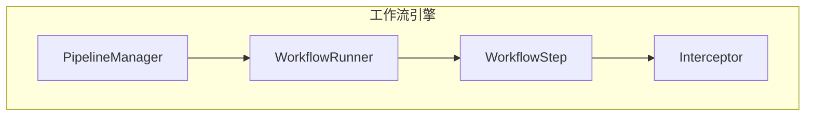
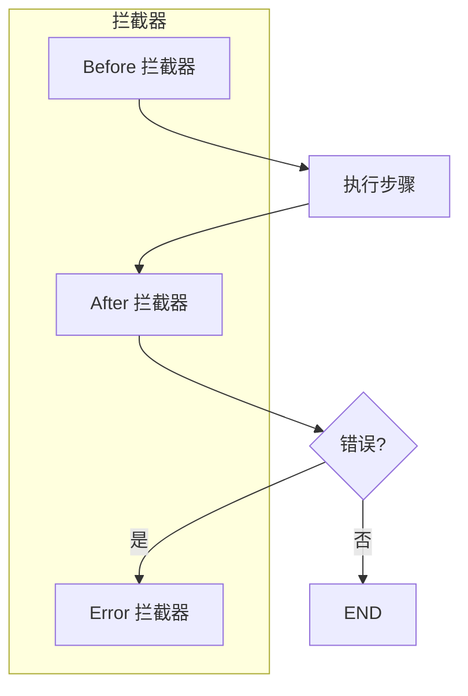
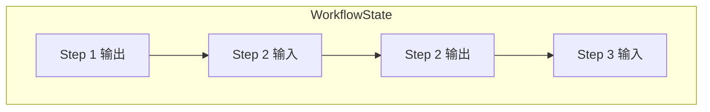

# memU 项目深度分析 (五)：工作流引擎详解

> 基于源码分析的学习笔记

## 1. 工作流引擎概述

memU 的核心设计理念之一是**工作流驱动**。无论是记忆(Memorize)还是检索(Retrieve)，都被封装为可配置的工作流。



## 2. 核心概念

### 2.1 WorkflowStep (工作流步骤)

```python
@dataclass
class WorkflowStep:
    step_id: str                           # 步骤唯一标识
    role: str                              # 角色: ingest/preprocess/extract/...
    handler: Callable                      # 处理函数
    requires: set[str]                    # 输入依赖
    produces: set[str]                    # 输出产物
    capabilities: set[str]                # 需要的能力: llm/vector/db/io/vision
    config: dict[str, Any] = field(default_factory=dict)  # 配置
    condition: Callable | None = None    # 条件函数
```

### 2.2 WorkflowState (工作流状态)

```python
# 本质上是一个字典
WorkflowState = dict[str, Any]
```

在流程中传递的数据上下文，包含所有步骤的输入输出。

### 2.3 Pipeline (流水线)

```python
# 一系列有序的 WorkflowStep
Pipeline = list[WorkflowStep]
```

## 3. PipelineManager

### 3.1 功能

```python
class PipelineManager:
    """流水线管理器"""
    
    def __init__(
        self,
        available_capabilities: set[str],
        llm_profiles: set[str],
    ):
        self._pipelines: dict[str, Pipeline] = {}
        self._initial_keys: dict[str, set[str]] = {}
    
    def register(
        self,
        name: str,
        pipeline: Pipeline,
        initial_state_keys: set[str],
    ) -> None:
        """注册一个流水线"""
    
    def build(self, name: str) -> list[WorkflowStep]:
        """构建流水线（解析条件等）"""
    
    def config_step(
        self,
        pipeline: str,
        step_id: str,
        configs: dict[str, Any],
    ) -> int:
        """配置特定步骤"""
    
    def insert_after(
        self,
        pipeline: str,
        target_step_id: str,
        new_step: WorkflowStep,
    ) -> int:
        """在指定步骤后插入"""
    
    def insert_before(
        self,
        pipeline: str,
        target_step_id: str,
        new_step: WorkflowStep,
    ) -> int:
        """在指定步骤前插入"""
    
    def replace_step(
        self,
        pipeline: str,
        target_step_id: str,
        new_step: WorkflowStep,
    ) -> int:
        """替换步骤"""
    
    def remove_step(
        self,
        pipeline: str,
        target_step_id: str,
    ) -> int:
        """移除步骤"""
```

### 3.2 内置流水线

memU 内置了多个流水线：

```python
# 注册的流水线
pipelines = {
    "memorize": memorize_workflow,
    "retrieve_rag": rag_retrieve_workflow,
    "retrieve_llm": llm_retrieve_workflow,
    "patch_create": create_item_workflow,
    "patch_update": update_item_workflow,
    "patch_delete": delete_item_workflow,
    "crud_list_memory_items": list_items_workflow,
    "crud_list_memory_categories": list_categories_workflow,
    "crud_clear_memory": clear_memory_workflow,
}
```

## 4. WorkflowRunner

### 4.1 执行器接口

```python
class WorkflowRunner(Protocol):
    """工作流运行器协议"""
    
    async def run(
        self,
        workflow_name: str,
        steps: list[WorkflowStep],
        initial_state: WorkflowState,
        runner_context: dict[str, Any],
        interceptor_registry: WorkflowInterceptorRegistry,
    ) -> WorkflowState:
        """执行工作流"""
```

### 4.2 内置运行器

```python
# src/memu/workflow/runner.py
class DefaultWorkflowRunner:
    """默认工作流运行器"""
    
    async def run(
        self,
        workflow_name: str,
        steps: list[WorkflowStep],
        initial_state: WorkflowState,
        runner_context: dict[str, Any],
        interceptor_registry: WorkflowInterceptorRegistry,
    ) -> WorkflowState:
        state = initial_state.copy()
        
        for step in steps:
            # 检查前置条件
            if not self._check_requirements(step, state):
                raise WorkflowError(f"Step {step.step_id} requirements not met")
            
            # 调用拦截器 - before
            await interceptor_registry.invoke_before(step, state, runner_context)
            
            # 执行步骤
            try:
                state = await step.handler(state, step_context)
            except Exception as e:
                # 调用错误拦截器
                await interceptor_registry.invoke_on_error(step, state, runner_context, e)
                raise
            
            # 调用拦截器 - after
            await interceptor_registry.invoke_after(step, state, runner_context)
        
        return state
```

## 5. 拦截器机制

### 5.1 拦截器类型



### 5.2 LLM 拦截器（带过滤器、优先级、丰富上下文）

memU 把对 LLM 的每一次调用统一包装在 `LLMClientWrapper._run_llm_call` 中，所有 `chat / embed / vision / transcribe` 调用都会经过 **before / after / on_error** 三个钩子。

#### 调用上下文 `LLMCallContext`

```17:27:memU/src/memu/llm/wrapper.py
@dataclass(frozen=True)
class LLMCallContext:
    profile: str
    request_id: str
    trace_id: str | None
    operation: str | None       # "chat" / "embed" / "vision" / "transcribe"
    step_id: str | None         # 来自当前 WorkflowStep
    provider: str | None        # "openai" / "lazyllm" / ...
    model: str | None
    tags: Mapping[str, Any] | None
```

每次 LLM 调用都会自动生成 `request_id`，并把当前所在的 step_id、profile（"default" / "embedding" / 你自己定义的 profile）等信息注入。这意味着拦截器可以在**调用现场**就拿到非常丰富的元信息，不需要从调用栈反推。

#### 过滤器 `LLMCallFilter`：精准定向拦截

```61:86:memU/src/memu/llm/wrapper.py
@dataclass(frozen=True)
class LLMCallFilter:
    operations: set[str] | None = None
    step_ids: set[str] | None = None
    providers: set[str] | None = None
    models: set[str] | None = None
    statuses: set[str] | None = None

    def matches(self, ctx: LLMCallContext, status: str | None) -> bool:
        if self.operations and (ctx.operation or "").lower() not in self.operations:
            return False
        if self.step_ids and (ctx.step_id or "") not in self.step_ids:
            return False
        if self.providers and (ctx.provider or "").lower() not in self.providers:
            return False
        ...
        return True
```

这套 filter 让你可以做这样的"精确狙击"：

```python
from memu.llm.wrapper import LLMCallFilter

# 只拦截 extract_items 这一个 step 的 chat 调用，用于专门记录抽取过程
service.intercept_after_llm_call(
    fn=record_extraction,
    name="extraction_audit",
    priority=10,
    where=LLMCallFilter(
        operations={"chat"},
        step_ids={"extract_items"},
    ),
)

# 只对 OpenAI 的 embedding 调用统计 token
service.intercept_after_llm_call(
    fn=count_embedding_tokens,
    where=LLMCallFilter(operations={"embed"}, providers={"openai"}),
)

# where 也可以是 callable
service.intercept_before_llm_call(
    fn=cache_lookup,
    where=lambda ctx, status: ctx.tags and ctx.tags.get("cacheable"),
)
```

#### 优先级与执行顺序

- **before** 拦截器按 `priority` **降序**执行（高优先级先跑）；
- **after / on_error** 按相反顺序执行——**先注册的最后执行**，符合"洋葱模型"。

这套"中间件式"的设计让两类典型需求都能并存：

| 场景 | 推荐 priority |
|------|--------------|
| **缓存 / 短路调用**（before 阶段就返回结果） | 高优先级（先于 logging/metrics） |
| **指标采集 / 链路追踪**（不能影响功能） | 中等 |
| **审计 / 持久化记录**（after 阶段写入） | 低优先级（最后执行） |

### 5.3 拦截器使用示例

```python
import time
from memu.llm.wrapper import LLMCallFilter

service = MemoryService(...)

# 1. 简单的"打印每次调用耗时"
async def latency_logger(context, request, response, usage):
    if usage and usage.latency_ms is not None:
        print(f"[{context.operation}] {context.model} took {usage.latency_ms:.0f}ms")

service.intercept_after_llm_call(fn=latency_logger, name="latency")

# 2. 只对 chat 调用计费
async def billing_recorder(context, request, response, usage):
    if usage and usage.total_tokens:
        await billing_db.record(
            user_id=context.tags.get("user_id"),
            tokens=usage.total_tokens,
            model=context.model,
        )

service.intercept_after_llm_call(
    fn=billing_recorder,
    where=LLMCallFilter(operations={"chat"}),
)

# 3. on_error 自动重试（更适合放在客户端层；这里只演示）
async def slack_alert(context, request, error):
    await slack.send(f"LLM call {context.request_id} failed: {error}")

service.intercept_on_error_llm_call(fn=slack_alert)
```

### 5.4 工作流拦截器（更轻量）

工作流拦截器**没有** `where filter` / `priority` 这些复杂特性——这是有意的设计：工作流步骤通常较粗粒度（每个 memorize 调用最多走过 7 个 step），不需要精确过滤。

```56:115:memU/src/memu/workflow/interceptor.py
class WorkflowInterceptorRegistry:
    """
    Registry for workflow step interceptors.

    Interceptors are called before and after each workflow step execution.
    Unlike LLM interceptors, workflow interceptors do not support filtering,
    priority, or ordering - they are called in registration order.
    """

    def register_before(self, fn, *, name=None) -> WorkflowInterceptorHandle: ...
    def register_after(self, fn, *, name=None) -> WorkflowInterceptorHandle: ...
    def register_on_error(self, fn, *, name=None) -> WorkflowInterceptorHandle: ...
```

如果在 worflow 拦截器中也需要按 `step_id` 过滤，自己在 fn 里加个 if 即可：

```python
async def trace_extract_only(step_context, state):
    if step_context.step_id != "extract_items":
        return
    print(f"extract_items started, resource_url={state.get('resource_url')}")

service.intercept_before_workflow_step(fn=trace_extract_only)
```

### 5.5 两套拦截器的搭配场景

| 需求 | 用 LLM 拦截器 | 用 Workflow 拦截器 |
|------|-------------|------------------|
| 记录每次 LLM 调用的 token / latency | ✅ | ❌（粒度太粗） |
| 给"分类摘要更新"这一个 step 加缓存 | ❌ | ✅（之前/之后处理 state） |
| 一次 memorize 全程链路追踪 | ✅（细粒度 span） | ✅（外层 trace） |
| 失败时报警 | ✅（精确到模型/步骤） | ✅（粗粒度兜底） |

## 6. Memorize 工作流详解

### 6.1 完整步骤

```python
def _build_memorize_workflow(self) -> list[WorkflowStep]:
    return [
        WorkflowStep(
            step_id="ingest_resource",
            role="ingest",
            handler=self._memorize_ingest_resource,
            requires={"resource_url", "modality"},
            produces={"local_path", "raw_text"},
            capabilities={"io"},
        ),
        WorkflowStep(
            step_id="preprocess_multimodal",
            role="preprocess",
            handler=self._memorize_preprocess_multimodal,
            requires={"local_path", "modality", "raw_text"},
            produces={"preprocessed_resources"},
            capabilities={"llm"},
            config={"chat_llm_profile": "default"},
        ),
        WorkflowStep(
            step_id="extract_items",
            role="extract",
            handler=self._memorize_extract_items,
            requires={
                "preprocessed_resources",
                "memory_types",
                "categories_prompt_str",
                "modality",
                "resource_url",
            },
            produces={"resource_plans"},
            capabilities={"llm"},
        ),
        # ... 更多步骤
    ]
```

### 6.2 数据流转

```mermaid
flowchart LR
    subgraph "Step 1: ingest_resource"
        I1[resource_url, modality] --> O1[local_path, raw_text]
    end
    
    subgraph "Step 2: preprocess_multimodal"
        I2[local_path, raw_text] --> O2[preprocessed_resources]
    end
    
    subgraph "Step 3: extract_items"
        I3[preprocessed_resources, memory_types] --> O3[resource_plans]
    end
    
    subgraph "Step 4: categorize_items"
        I4[resource_plans] --> O4[resources, items, relations]
    end
    
    subgraph "Step 5: persist_index"
        I5[category_updates] --> O5[categories]
    end
    
    O1 --> I2
    O2 --> I3
    O3 --> I4
    O4 --> I5
```



## 7. 动态修改工作流

### 7.1 配置步骤

```python
# 修改某步骤的配置
service.configure_pipeline(
    pipeline="memorize",
    step_id="extract_items",
    configs={
        "chat_llm_profile": "fast-model",
        "temperature": 0.5
    }
)
```

### 7.2 插入步骤

```python
# 在某步骤后插入新步骤
new_step = WorkflowStep(
    step_id="custom_validation",
    role="validate",
    handler=my_validation_handler,
    requires={"resource_plans"},
    produces={"validated_plans"},
    capabilities=set(),
)
service.insert_step_after(
    target_step_id="extract_items",
    new_step=new_step,
    pipeline="memorize"
)
```

### 7.3 替换步骤

```python
# 替换默认步骤
service.replace_step(
    target_step_id="extract_items",
    new_step=my_custom_extract_handler,
    pipeline="memorize"
)
```

### 7.4 移除步骤

```python
# 移除不需要的步骤
service.remove_step(
    target_step_id="dedupe_merge",
    pipeline="memorize"
)
```

## 8. 能力系统

### 8.1 定义的能力

```python
AVAILABLE_CAPABILITIES = {
    "llm",      # LLM 调用
    "vector",   # 向量搜索
    "db",       # 数据库操作
    "io",       # 文件/网络 IO
    "vision",   # 视觉模型
}
```

### 8.2 步骤能力要求

```python
WorkflowStep(
    step_id="preprocess_image",
    capabilities={"llm", "vision"},  # 需要视觉能力
    ...
)
```

### 8.3 能力检查

```python
def _check_capabilities(self, step: WorkflowStep) -> bool:
    return step.capabilities.issubset(self.available_capabilities)
```

## 9. 状态管理

### 9.1 初始状态键

```python
def _list_memorize_initial_keys() -> set[str]:
    return {
        "resource_url",
        "modality",
        "memory_types",
        "categories_prompt_str",
        "ctx",
        "store",
        "category_ids",
        "user",
    }
```

### 9.2 状态传播



工作流状态在步骤之间自动传递，前一步的输出作为后一步的输入。

## 10. 高级特性

### 10.1 条件执行

```python
WorkflowStep(
    step_id="optional_step",
    handler=my_handler,
    requires={...},
    produces={...},
    condition=lambda state: state.get("enable_optional"),  # 仅在条件满足时执行
)
```

### 10.2 错误处理

```python
async def run(self, ...):
    for step in steps:
        try:
            state = await step.handler(state, context)
        except Exception as e:
            # 调用错误拦截器
            await interceptor_registry.invoke_on_error(step, state, context, e)
            # 可以选择重试、跳过或终止
            if not self._handle_error(step, e):
                raise
```

### 10.3 重试机制

```python
@dataclass
class WorkflowStep:
    max_retries: int = 0
    retry_delay: float = 1.0
    
    async def handler_with_retry(self, state, context):
        for attempt in range(self.max_retries + 1):
            try:
                return await self.handler(state, context)
            except Exception as e:
                if attempt == self.max_retries:
                    raise
                await asyncio.sleep(self.retry_delay)
```

## 11. 使用场景

### 11.1 自定义记忆流程

```python
# 添加自定义验证步骤
validation_step = WorkflowStep(
    step_id="validate_content",
    role="validate",
    handler=validate_content_handler,
    requires={"preprocessed_resources"},
    produces={"validated_resources"},
    capabilities=set(),
)

service.insert_step_after(
    target_step_id="preprocess_multimodal",
    new_step=validation_step,
)
```

### 11.2 添加监控

```python
# 监控所有 LLM 调用
async def llm_monitor(request, response):
    logger.info(f"LLM调用耗时: {time.time() - start_time}")
    logger.info(f"Token使用: {response.usage}")

service.intercept_after_llm_call(llm_monitor)
```

### 11.3 缓存优化

```python
# LLM 响应缓存
cache = {}

async def cache_interceptor(request):
    key = hash(request)
    if key in cache:
        return cache[key]
    return None  # 继续原始调用

service.intercept_before_llm_call(cache_interceptor, priority=100)
```

## 12. 总结

memU 工作流引擎的核心特点：

1. **声明式定义** - 用配置定义工作流
2. **可插拔** - 随时插入、替换、删除步骤
3. **拦截器** - 灵活介入各阶段
4. **能力系统** - 按需加载资源
5. **错误处理** - 完善的重试和错误处理
6. **状态传递** - 步骤间自动状态流转

这种设计使得 memU 既保持了核心逻辑的稳定性，又提供了足够的灵活性来适应各种定制需求。
