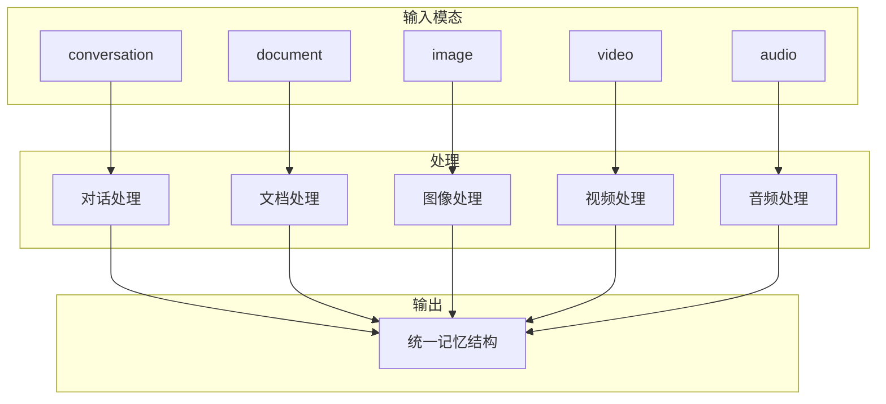
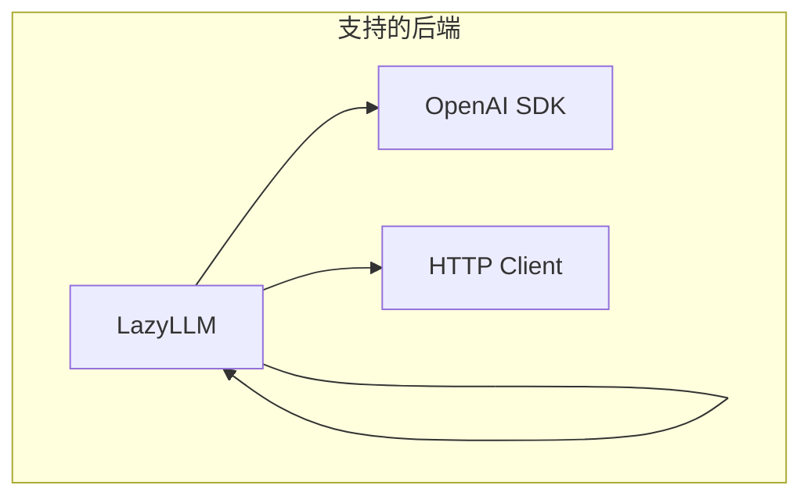

# memU 项目深度分析 (六)：多模态与集成详解

> 基于源码分析的学习笔记

## 1. 多模态支持概述

memU 支持多种模态的记忆处理：



## 2. 模态处理器

### 2.1 对话 (conversation)

```python
async def _preprocess_conversation(
    self,
    text: str,
    template: str,
    llm_client,
) -> list[dict[str, str | None]]:
    """
    处理对话数据
    1. 格式化对话（添加索引）
    2. LLM 分段
    3. 为每段生成摘要
    """
    
    # 1. 格式化
    preprocessed_text = format_conversation_for_preprocess(text)
    
    # 2. 分段
    prompt = template.format(conversation=...)
    processed = await client.chat(prompt)
    _, segments = self._parse_conversation_preprocess_with_segments(processed)
    
    # 3. 每段生成摘要
    resources = []
    for segment in segments:
        segment_text = extract_segment(...)
        caption = await self._summarize_segment(segment_text)
        resources.append({"text": segment_text, "caption": caption})
    
    return resources
```

**对话格式示例**：
```
原始:
User: 你好
Assistant: 你好！

处理后:
[0] User: 你好
[1] Assistant: 你好！有什么可以帮你？
```

### 2.2 文档 (document)

```python
async def _preprocess_document(
    self,
    text: str,
    template: str,
    llm_client,
) -> list[dict[str, str | None]]:
    """
    处理文档数据
    1. 提取关键信息
    2. 生成摘要
    """
    
    prompt = template.format(document_text=text)
    processed = await client.chat(prompt)
    
    # 解析处理后的内容和标题
    processed_content, caption = self._parse_multimodal_response(
        processed,
        "processed_content",
        "caption"
    )
    
    return [{"text": processed_content or text, "caption": caption}]
```

### 2.3 图像 (image)

```python
async def _preprocess_image(
    self,
    local_path: str,
    template: str,
    llm_client,
) -> list[dict[str, str | None]]:
    """
    处理图像数据
    使用 Vision API 提取描述
    """
    
    # 调用视觉模型
    processed = await client.vision(
        prompt=template,
        image_path=local_path,
    )
    
    # 解析详细描述和标题
    description, caption = self._parse_multimodal_response(
        processed,
        "detailed_description",
        "caption"
    )
    
    return [{"text": description, "caption": caption}]
```

**支持的图像格式**：
- PNG, JPG, JPEG, GIF, WebP, BMP

### 2.4 视频 (video)

```python
async def _preprocess_video(
    self,
    local_path: str,
    template: str,
    llm_client,
) -> list[dict[str, str | None]]:
    """
    处理视频数据
    1. 提取中间帧
    2. Vision API 分析
    3. 清理临时文件
    """
    
    # 检查 ffmpeg
    if not VideoFrameExtractor.is_ffmpeg_available():
        return [{"text": None, "caption": None}]
    
    # 提取中间帧
    frame_path = VideoFrameExtractor.extract_middle_frame(local_path)
    
    try:
        # 视觉分析
        processed = await client.vision(
            prompt=template,
            image_path=frame_path,
        )
        description, caption = self._parse_multimodal_response(...)
    finally:
        # 清理
        pathlib.Path(frame_path).unlink()
    
    return [{"text": description, "caption": caption}]
```

### 2.5 音频 (audio)

```python
async def _preprocess_audio(
    self,
    text: str,
    template: str,
    llm_client,
) -> list[dict[str, str | None]]:
    """
    处理音频数据
    1. 转录（如需要）
    2. 提取关键信息
    """
    
    prompt = template.format(transcription=text)
    processed = await client.chat(prompt)
    
    processed_content, caption = self._parse_multimodal_response(
        processed,
        "processed_content",
        "caption"
    )
    
    return [{"text": processed_content or text, "caption": caption}]
```

**支持的音频格式**：
- MP3, WAV, M4A, MP4, WebM

## 3. LLM 客户端

### 3.1 客户端类型



### 3.2 OpenAI SDK 客户端

```python
class OpenAISDKClient:
    """OpenAI SDK 客户端"""
    
    def __init__(
        self,
        base_url: str,
        api_key: str,
        chat_model: str,
        embed_model: str,
        embed_batch_size: int = 100,
    ):
        self.client = OpenAI(base_url=base_url, api_key=api_key)
        self.chat_model = chat_model
        self.embed_model = embed_model
    
    async def chat(
        self,
        prompt: str,
        system_prompt: str | None = None,
        **kwargs
    ) -> str:
        """聊天完成"""
    
    async def embed(self, texts: list[str]) -> list[list[float]]:
        """文本嵌入"""
    
    async def vision(
        self,
        prompt: str,
        image_path: str,
        system_prompt: str | None = None,
    ) -> str:
        """视觉理解"""
    
    async def transcribe(self, audio_path: str) -> str:
        """音频转录"""
```

### 3.3 HTTP 客户端

```python
class HTTPLLMClient:
    """通用 HTTP LLM 客户端"""
    
    def __init__(
        self,
        base_url: str,
        api_key: str,
        chat_model: str,
        provider: str | None = None,
        endpoint_overrides: dict | None = None,
        embed_model: str | None = None,
    ):
        ...
```

**支持的 Provider**：
- OpenAI
- Anthropic
- Azure OpenAI
- Google Gemini
- Claude
- 自定义

### 3.4 多 Profile 配置

```python
from memu import MemoryService

service = MemoryService(
    llm_profiles={
        # 默认 Profile
        "default": {
            "base_url": "https://api.openai.com/v1",
            "api_key": "sk-...",
            "chat_model": "gpt-4o",
            "client_backend": "sdk"
        },
        # Embedding 专用
        "embedding": {
            "base_url": "https://api.openai.com/v1",
            "api_key": "sk-...",
            "embed_model": "text-embedding-3-small",
            "client_backend": "sdk"
        },
        # 快速模型（用于简单任务）
        "fast": {
            "base_url": "https://api.openai.com/v1",
            "api_key": "sk-...",
            "chat_model": "gpt-4o-mini",
            "client_backend": "httpx"
        }
    }
)
```

## 4. 向量模型

### 4.1 支持的 Embedding 模型

```python
# OpenAI
- text-embedding-3-small
- text-embedding-3-large
- text-embedding-ada-002

# Cohere
- embed-multilingual-v3.0
- embed-english-v3.0

# Voyage
- voyage-3
- voyage-lite-2

# 自定义
- 任何支持 embedding API 的模型
```

### 4.2 Embedding 配置

```python
llm_profiles={
    "embedding": {
        "base_url": "https://api.voyageai.com/v1",
        "api_key": "voyage-...",
        "embed_model": "voyage-3.5-lite",
        "provider": "voyageai"
    }
}
```

## 5. Blob 存储

### 5.1 本地文件系统

```python
# src/memu/blob/local_fs.py
class LocalFS:
    """本地文件系统存储"""
    
    def __init__(self, resources_dir: str):
        self.resources_dir = resources_dir
    
    async def fetch(
        self,
        resource_url: str,
        modality: str,
    ) -> tuple[str, str]:
        """
        获取资源
        返回: (本地路径, 原始文本)
        """
        
        # 远程 URL - 下载
        if resource_url.startswith(("http://", "https://")):
            local_path = await self._download(resource_url)
        # 本地文件 - 读取
        else:
            local_path = resource_url
        
        # 读取内容
        text = await self._read_text(local_path, modality)
        
        return local_path, text
```

### 5.2 资源目录结构

```
resources/
├── conversations/
│   ├── 2024/
│   │   └── 01/
│   │       └── conv_001.txt
├── documents/
│   └── notes.md
├── images/
│   └── photos/
└── videos/
```

## 6. 集成示例

### 6.1 Slack 集成

```python
# 监听 Slack 消息并记忆
from slack_sdk import WebClient
from memu import MemoryService

service = MemoryService(...)

client = WebClient(token="xoxb-...")

@app.event("message")
async def handle_message(event):
    # 记忆消息
    await service.memorize(
        resource_url=event["text"],
        modality="conversation",
        user={"user_id": event["user"]}
    )
```

### 6.2 Discord 集成

```python
# Discord Bot 记忆
import discord
from memu import MemoryService

intents = discord.Intents.default()
client = discord.Client(intents=intents)

@client.event
async def on_message(message):
    # 记忆消息
    await service.memorize(
        resource_url=message.content,
        modality="conversation",
        user={"user_id": str(message.author.id)}
    )
```

### 6.3 Email 集成

```python
# Gmail 集成
from google.oauth2.credentials import Credentials
from googleapiclient.discovery import build
from memu import MemoryService

# 获取邮件
service_gmail = build('gmail', 'v1', credentials=credentials)
messages = service_gmail.users().messages().list(userId='me').execute()

# 记忆每封邮件
for msg in messages['messages']:
    email = service_gmail.users().messages().get(
        userId='me', id=msg['id'], format='full'
    ).execute()
    
    await memory_service.memorize(
        resource_url=email['snippet'],
        modality="conversation",
        user={"user_id": "me"}
    )
```

### 6.4 自定义 LLM

```python
# 使用 Ollama 本地模型
service = MemoryService(
    llm_profiles={
        "default": {
            "base_url": "http://localhost:11434/v1",
            "api_key": "ollama",
            "chat_model": "llama3",
            "client_backend": "httpx",
            "provider": "ollama"
        }
    }
)

# 或使用 OpenRouter
service = MemoryService(
    llm_profiles={
        "default": {
            "provider": "openrouter",
            "base_url": "https://openrouter.ai",
            "api_key": "openrouter-...",
            "chat_model": "anthropic/claude-3.5-sonnet",
            "client_backend": "httpx"
        }
    }
)
```

## 7. Prompt 定制

### 7.1 预处理 Prompt

```python
from memu.app.settings import MemorizeConfig

config = MemorizeConfig(
    multimodal_preprocess_prompts={
        "conversation": """你是一个对话分析助手。
请将以下对话分段，并标注每段的主题。

<conversation>
{conversation}
</conversation>

请返回 JSON 格式：
{
    "segments": [
        {"start": 0, "end": 5, "caption": "开场白"},
        {"start": 6, "end": 15, "caption": "讨论项目"}
    ]
}""",
        
        "image": """描述这张图片的详细内容。"""
    }
)
```

### 7.2 记忆提取 Prompt

```python
config = MemorizeConfig(
    memory_type_prompts={
        "profile": """从以下内容中提取用户画像信息：
- 偏好
- 习惯
- 特点

{resource}

请返回 XML 格式：
<entries>
    <entry>
        <content>提取的记忆</content>
        <categories>相关类别</categories>
    </entry>
</entries>""",
        
        "skill": """从以下内容中提取技能信息：
{resource}"""
    }
)
```

### 7.3 类别摘要 Prompt

```python
config = MemorizeConfig(
    default_category_summary_prompt="""你是类别摘要助手。
类别: {category}
现有摘要:
{original_content}

新增记忆:
{new_memory_items_text}

请更新摘要，保持在 {target_length} 字以内。"""
)
```

## 8. 配置大全

### 8.1 完整配置示例

```python
from memu import MemoryService

service = MemoryService(
    # LLM 配置
    llm_profiles={
        "default": {
            "base_url": "https://api.openai.com/v1",
            "api_key": "sk-...",
            "chat_model": "gpt-4o",
            "embed_model": "text-embedding-3-small",
            "client_backend": "sdk",
            "provider": "openai"
        }
    },
    
    # 数据库配置
    database_config={
        "metadata_store": {"provider": "inmemory"},
        "vector_index": {"provider": "inmemory"}
    },
    
    # Blob 存储
    blob_config={
        "resources_dir": "./resources"
    },
    
    # 记忆配置
    memorize_config={
        "memory_types": ["profile", "event", "knowledge", "behavior", "skill", "tool"],
        "enable_item_reinforcement": True,
        "enable_item_references": True,
        "preprocess_llm_profile": "default",
        "memory_extract_llm_profile": "default",
        "category_update_llm_profile": "default"
    },
    
    # 检索配置
    retrieve_config={
        "method": "rag",
        "route_intention": True,
        "sufficiency_check": True,
        "category": {"enabled": True, "top_k": 3},
        "item": {"enabled": True, "top_k": 10},
        "resource": {"enabled": True, "top_k": 5}
    },
    
    # 用户模型
    user_config={
        "model": {
            "user_id": str,
            "team_id": str | None
        }
    }
)
```

### 8.2 环境变量

```bash
# OpenAI
export OPENAI_API_KEY="sk-..."

# OpenRouter
export OPENROUTER_API_KEY="..."

# 自定义 API
export CUSTOM_API_KEY="..."
```

## 9. 最佳实践

### 9.1 生产环境配置

```python
# 生产环境使用 PostgreSQL
service = MemoryService(
    database_config={
        "metadata_store": {
            "provider": "postgres",
            "connection": {
                "host": "db.example.com",
                "port": 5432,
                "database": "memu_prod",
                "user": "memu",
                "password": "secure_password"
            }
        },
        "vector_index": {"provider": "postgres"}
    }
)
```

### 9.2 开发环境配置

```python
# 开发环境使用内存
service = MemoryService(
    database_config={
        "metadata_store": {"provider": "inmemory"},
        "vector_index": {"provider": "inmemory"}
    }
)
```

### 9.3 多租户配置

```python
from pydantic import BaseModel

class TenantUser(BaseModel):
    tenant_id: str
    user_id: str

service = MemoryService(
    user_config={"model": TenantUser}
)

# 检索时指定租户
result = await service.retrieve(
    queries=[...],
    where={"tenant_id": "corp_a"}
)
```

## 10. 总结

memU 的多模态和集成能力：

1. **统一接口** - 多种模态统一处理
2. **灵活客户端** - 支持多种 LLM 提供商
3. **可扩展存储** - 本地/云端多种选择
4. **Prompt 定制** - 完全可配置的提示词
5. **多租户支持** - 企业级应用支持
6. **易于集成** - 简单的 API 设计

这使得 memU 能够适配各种实际应用场景。
