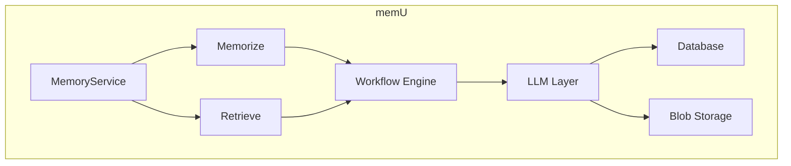
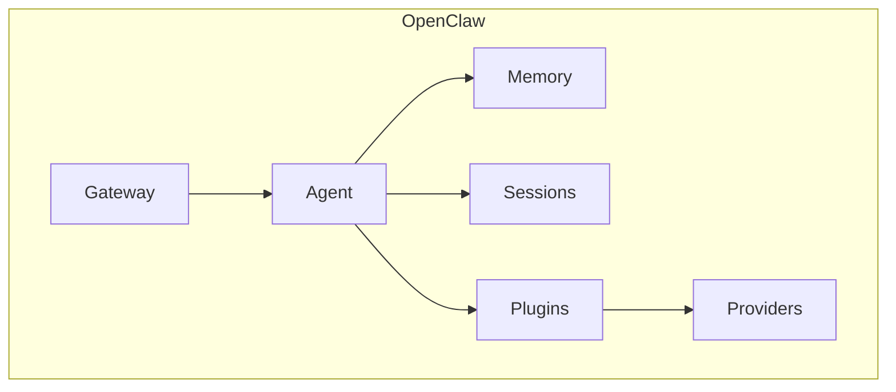
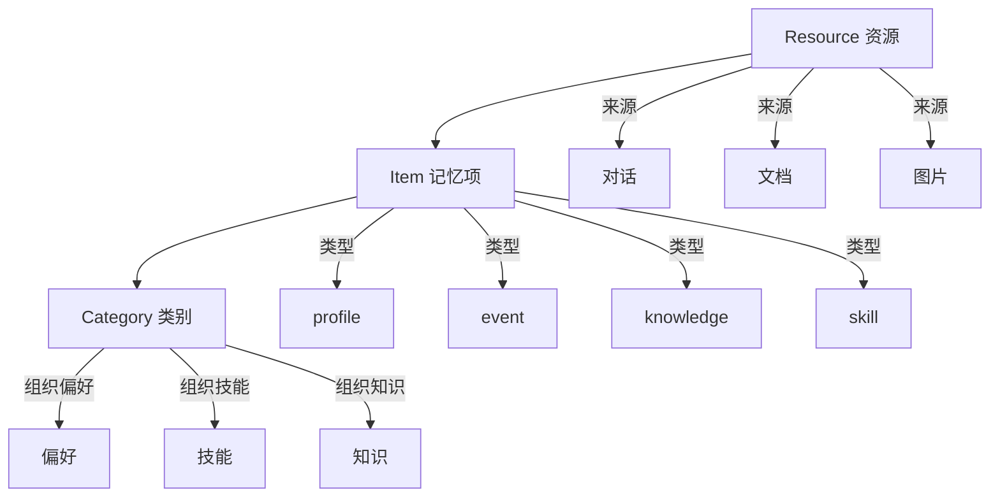

# memU vs OpenClaw：架构对比与启示

> 基于源码分析的学习笔记

## 1. 整体架构对比

### 1.1 核心理念

| 特性 | memU | OpenClaw |
|------|------|----------|
| **设计目标** | 24/7 主动式记忆 | 通用 AI Agent 框架 |
| **记忆方式** | 文件系统式层级 | 简单 Key-Value |
| **检索模式** | RAG + LLM 双模式 | 简单向量检索 |
| **主动学习** | ✅ 支持 | ❌ 不支持 |
| **多模态** | ✅ 完整支持 | ⚠️ 有限 |

### 1.2 架构图对比

#### memU 架构


#### OpenClaw 架构


## 2. 记忆系统对比

### 2.1 数据模型

#### memU 三层模型


#### OpenClaw 简单模型
```
Memory:
  - key: "user:tom:preferences"
  - value: {...}
  
  - key: "session:abc123"
  - value: {...}
```

### 2.2 检索能力

| 能力 | memU | OpenClaw |
|------|------|----------|
| 向量检索 | ✅ | ✅ |
| RAG 模式 | ✅ | ❌ |
| LLM 推理检索 | ✅ | ❌ |
| 渐进式检索 | ✅ | ❌ |
| 意图预测 | ✅ | ❌ |
| 充分性检查 | ✅ | ❌ |

## 3. 工作流引擎对比

### 3.1 memU 工作流

```python
# 声明式工作流定义
WorkflowStep(
    step_id="extract_items",
    handler=self._memorize_extract_items,
    requires={"preprocessed_resources", "memory_types"},
    produces={"resource_plans"},
    capabilities={"llm"},
)
```

**特点**：
- 声明式定义
- 步骤可插拔
- 拦截器机制
- 能力系统

### 3.2 OpenClaw 工作流

```python
# Agent 循环
async def run():
    while True:
        message = await receive()
        context = await build_context(message)
        response = await agent.think(context)
        await send(response)
```

**特点**：
- 消息驱动
- 循环执行
- 插件扩展

## 4. 可借鉴的设计

### 4.1 分层记忆结构

**建议 OpenClaw 采纳**：

```python
# 引入 Category 概念
class MemoryCategory:
    name: str
    summary: str
    embedding: list[float]

# 自动摘要更新
async def update_category_summary(category_id, new_items):
    # LLM 合并新旧摘要
    new_summary = await llm.merge(
        old=category.summary,
        new_items=new_items
    )
```

### 4.2 双模式检索

**建议 OpenClaw 采纳**：

```python
# RAG 快速模式
async def retrieve_rag(query, top_k=10):
    query_vec = await embed(query)
    results = await vector_search(query_vec, top_k)
    return results

# LLM 深度模式
async def retrieve_llm(query, context=[]):
    # 意图分析
    intention = await llm.analyze_intention(query)
    
    # 查询重写
    refined_query = await llm.refine(query, context)
    
    # 多轮检索
    results = await retrieve_rag(refined_query)
    
    # 综合推理
    return await llm.synthesize(query, results)
```

### 4.3 渐进式检索

```python
# 分层检索策略
async def progressive_retrieve(query):
    # 1. 类别层
    categories = await retrieve_categories(query)
    if is_sufficient(categories, query):
        return format_category_results(categories)
    
    # 2. 记忆项层
    items = await retrieve_items(query, categories)
    if is_sufficient(items, query):
        return format_item_results(items)
    
    # 3. 资源层
    resources = await retrieve_resources(query, items)
    return format_resource_results(resources)
```

### 4.4 工作流引擎

**建议 OpenClaw 采纳**：

```python
# 定义工作流步骤
step = WorkflowStep(
    step_id="process_message",
    handler=handle_message,
    requires={"message", "context"},
    produces={"response", "memory_updates"},
    capabilities={"llm", "io"}
)

# 可插拔设计
agent.insert_step_after(
    target_step_id="process_message",
    new_step=custom_validation_step
)
```

## 5. 代码结构对比

### 5.1 memU 目录结构
```
memU/
├── src/memu/
│   ├── app/
│   │   ├── service.py       # 核心服务
│   │   ├── memorize.py       # 记忆流程
│   │   ├── retrieve.py       # 检索流程
│   │   ├── crud.py          # 增删改查
│   │   └── settings.py      # 配置
│   ├── database/
│   │   ├── factory.py       # 工厂方法
│   │   ├── interfaces.py    # 接口定义
│   │   ├── models.py       # 数据模型
│   │   ├── inmemory/       # 内存实现
│   │   ├── postgres/       # PostgreSQL
│   │   └── sqlite/         # SQLite
│   ├── llm/                # LLM 客户端
│   ├── embedding/          # 向量模型
│   ├── blob/               # 文件存储
│   ├── workflow/           # 工作流引擎
│   ├── prompts/            # 提示词模板
│   └── utils/              # 工具函数
└── tests/
```

### 5.2 OpenClaw 目录结构
```
openclaw/
├── src/
│   ├── gateway/           # 网关
│   ├── agent/             # Agent 核心
│   ├── memory/            # 记忆系统
│   ├── sessions/          # 会话管理
│   ├── providers/         # 消息提供者
│   ├── plugins/           # 插件系统
│   ├── tools/             # 工具系统
│   └── ...
├── extensions/            # 扩展模块
└── ...
```

## 6. 学习 memU 的收益

### 6.1 对 OpenClaw 的改进建议

1. **增强 Memory 系统**
   - 引入分类(Categories)概念
   - 支持自动摘要更新
   - 添加记忆类型区分

2. **改进检索能力**
   - 实现 RAG 模式
   - 添加 LLM 推理检索
   - 支持渐进式检索

3. **工作流引擎**
   - 引入声明式工作流
   - 支持步骤插拔
   - 添加拦截器机制

4. **多模态支持**
   - 图像理解集成
   - 视频处理
   - 音频转录

### 6.2 可以直接复用的模式

```python
# 1. 用户作用域模式
class UserScope:
    def __init__(self, user_model):
        self.user_model = user_model
    
    def filter(self, where):
        # 验证并清理过滤条件
        return self._validate(where)

# 2. 数据库抽象
class DatabaseFactory:
    @staticmethod
    def create(config):
        provider = config.metadata_store.provider
        if provider == "postgres":
            return PostgresDatabase(config)
        elif provider == "inmemory":
            return InMemoryDatabase(config)

# 3. Prompt 模板管理
class PromptManager:
    def get(self, key, **kwargs):
        template = self._templates[key]
        return template.format(**kwargs)
```

## 7. 总结

memU 是一个专注于**主动记忆**的系统，设计精良，有很多值得借鉴的地方：

| 借鉴点 | 说明 |
|--------|------|
| 三层记忆结构 | Resource → Item → Category |
| 双模式检索 | RAG 快 + LLM 深 |
| 渐进式检索 | 按需获取，避免过度 |
| 工作流引擎 | 声明式、可插拔 |
| Prompt 管理 | 模板化、可定制 |
| 数据库抽象 | 多后端支持 |

通过学习 memU 的设计，可以为 OpenClaw 的记忆系统带来显著提升！
