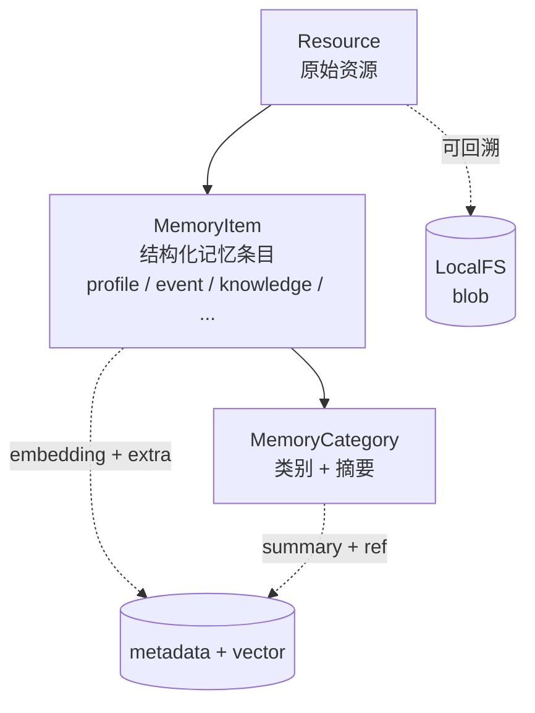
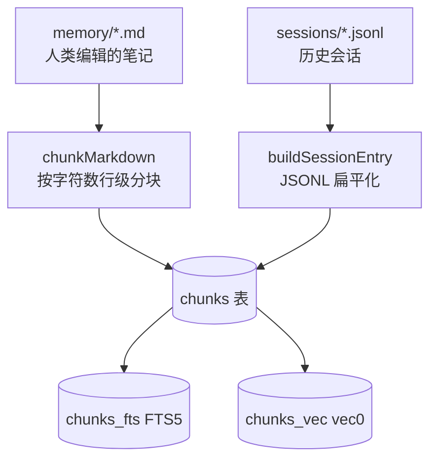
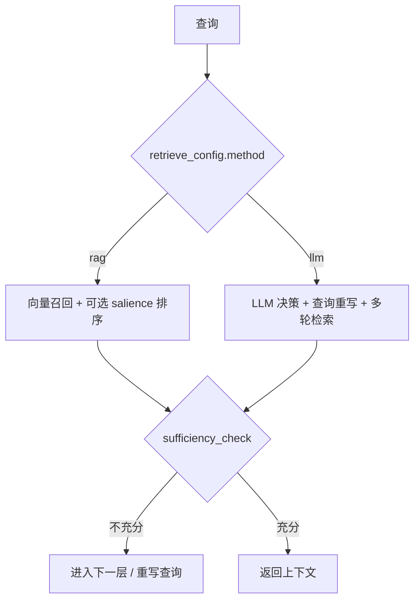
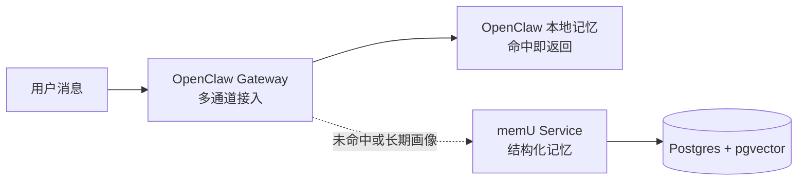
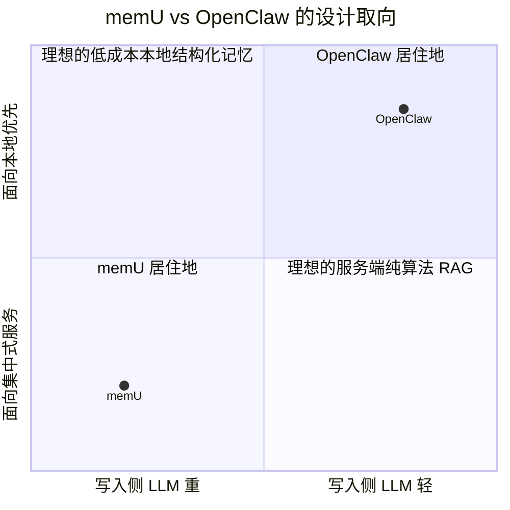

# memU vs OpenClaw：两种"长期记忆"架构的设计哲学对比

> 基于源码分析的学习笔记。本篇不站队、不夸张，只对比两套真实系统在**记忆 / 检索 / 集成**上的根本差异，
> 帮你判断哪一套更适合你的场景，或者如何把两边的优势组合起来用。

## 0. 先纠正一个常见误解

很多对比文档（包括本系列早期版本）把 OpenClaw 的记忆系统简化成 *"简单 Key-Value"*，这是错的。

OpenClaw 的 `src/memory/`（参见 [OPENCLAW-MEMORY-SYSTEM.md](../openclaw/OPENCLAW-MEMORY-SYSTEM.md)）实际上是一套相当工程化的 **本地优先 Hybrid RAG**：

- **存储**：SQLite + `sqlite-vec` 扩展（向量列）+ FTS5（全文倒排）；
- **召回**：余弦相似度 + BM25 加权融合（默认 `0.7 · vec + 0.3 · text`）；
- **重排**：Temporal Decay（`exp(-λ·age)` 半衰期衰减）+ MMR（Jaccard 多样性去重）；
- **多语言**：内建 7 种停用词 + CJK n-gram + 韩语助词剥离 + 日语书写系统切分；
- **多 Provider**：OpenAI / Gemini / Voyage / Mistral / Ollama / 本地 node-llama-cpp 都有适配；
- **同步**：chokidar 文件监听 + hash-based 去重 + session delta 阈值（5 秒防抖）。

所以正确的提问不是"谁更好"，而是 **"两套系统分别在什么 trade-off 下做了什么决定"**。

## 1. 整体定位

| 维度 | memU | OpenClaw |
|------|------|----------|
| 形态 | Python 库 + 可选服务端 | TypeScript 应用框架（Gateway + 多端节点） |
| 部署假设 | **服务端 / 多用户 / 多 Agent** | **本地优先 / 单用户 / 多通道** |
| 记忆持久化层 | InMemory / SQLite / **PostgreSQL + pgvector** | **SQLite + sqlite-vec + FTS5**（本机文件） |
| 主要面向 | 给"AI 应用 / SaaS 平台"加长期记忆 | 给"个人 AI 助理 + IM 通道"做随取即用记忆 |
| 数据来源 | 业务系统主动 `memorize(...)` 推入 | `memory/*.md` 和 `sessions/*.jsonl` 文件被自动扫描 |
| LLM 使用强度 | **写入侧重**：抽取 / 摘要 / 类别更新 / 充分性判断都走 LLM | **检索侧重**：写入只算 embedding + chunk，召回阶段才用 LLM |
| 适合谁 | 想给业务实体（用户、租户、Agent）建长期画像 | 想给"我自己用的 AI 助手"建本地知识库 + 会话记忆 |

一句话总结：**memU 把"理解"放在写入侧，OpenClaw 把"理解"留给消费侧**。这两条路线差异极大，下面逐项展开。

## 2. 数据模型对比

### 2.1 memU 的"分层文件系统"



- 写入时 LLM 把资源 **抽取** 成若干 `MemoryItem`，再 **聚合** 出类别摘要；
- 三层都有 embedding，可以分别召回（"按类别看一眼" → "看具体条目" → "回到原文"）；
- 适合做"问答型"长期记忆：*"我对张三了解多少？"* 直接看 category summary。

### 2.2 OpenClaw 的"文件-切块索引"



- 所有内容都被切成 **chunk**（默认 `maxChars = 1600`，`overlap = 320`），是扁平的；
- chunk 没有"类型"，只有 `path / source / startLine / endLine`；
- 适合做"取证型"召回：*"上次我和老板讨论 X 时说了啥？"* 直接精确回 chunk + 原文行号。

### 2.3 设计分歧

| 关注点 | memU | OpenClaw |
|--------|------|----------|
| 知识结构化 | LLM 抽取 + 类别摘要 → 高度结构化 | 不做结构化，原文即真理 |
| 写入成本 | 每条资源会触发多次 LLM | 只算 embedding + 写 SQLite，无 LLM |
| 召回多样性 | 三层渐进 + 充分性判断 | 单层 chunk + MMR 多样性 |
| 数据迁移 | DB schema 抽象，PG/SQLite/InMemory 互换 | 强绑定本机 SQLite + 文件路径 |
| 数据隐私 | 业务方负责数据库部署 | 全部在用户本地，零云依赖 |

## 3. 检索机制对比

### 3.1 memU 的"双模式 + 渐进式"



- `rag` 模式：纯向量检索（可选 `ranking="salience"`，详见 [analysis-09](./analysis-09-salience-and-reinforcement.md)）；
- `llm` 模式：LLM 自己决定 *要不要检索 / 怎么改写 / 是否够答* —— 比 RAG 慢 3-5 倍，但能处理"对话式追问"；
- 默认开启 `route_intention=True` 和 `sufficiency_check=True`，每次 retrieve 至少多 1-2 次 LLM 调用。

### 3.2 OpenClaw 的"Hybrid + 时间衰减 + MMR"

```mermaid
flowchart TB
    Q[查询] --> EM[query embedding]
    Q --> KW[extractKeywords\n多语言停用词]
    EM --> VS[searchVector\nsqlite-vec 余弦距离]
    KW --> FTS[searchKeyword\nFTS5 BM25]
    VS --> MG[mergeHybridResults\n0.7·vec + 0.3·text]
    FTS --> MG
    MG --> TD[applyTemporalDecay\nexp(-ln2·age/halfLife)]
    TD --> MMR[applyMMR\nJaccard diversity]
    MMR --> FT[minScore + maxResults]
    FT --> OUT[返回 chunk 列表]
```

- 单次搜索 **零 LLM 调用**，所有计算在 SQLite 进程内完成，毫秒级；
- 时间衰减让"昨天 memory/2026-04-26.md"自动比"上个月 memory/2026-03-26.md"分数更高；
- MMR 用 Jaccard 系数避免同一篇 markdown 的多个 chunk 占满前 N。

### 3.3 召回层面的"对偶设计"

注意一个有趣的对偶：

| 现象 | memU | OpenClaw |
|------|------|----------|
| 时间衰减 | 在 *写入侧* 通过 `reinforcement_count` + `last_reinforced_at` 累积，召回时按 salience 排序 | 在 *召回侧* 直接按文件名/mtime 计算 `exp(-λ·age)` |
| 重要度 | 通过类别摘要的"提炼"含蓄表达 | 通过 BM25（高频关键词更重要）显式表达 |
| 多样性 | 通过类别隔离实现（每个 category 独立 top_k） | 通过 MMR 后处理实现 |
| 多轮交互 | 工作流里的 `sufficiency_check` 决定要不要再走一轮 | Agent 自己根据返回结果决定是否再调 `memory_search` |

简单说：**memU 在数据层"先组织好再检索"，OpenClaw 在算法层"打分再重排"**。

## 4. 工作流 / 扩展性对比

### 4.1 memU 的工作流引擎

```python
WorkflowStep(
    step_id="extract_items",
    role="extract",
    handler=self._memorize_extract_items,
    requires={"preprocessed_resources", "memory_types"},
    produces={"resource_plans"},
    capabilities={"llm"},
)
```

- 显式声明 `requires / produces`，运行时按依赖图拓扑排序；
- `PipelineManager` 支持 `insert_before / insert_after / replace_step`；
- 两套拦截器：
  - **WorkflowInterceptor**：粗粒度，按 step_id 包前包后；
  - **LLMInterceptor**：细粒度，可以按 `operation / step_id / provider / model / status` 过滤，支持 `priority`（详见 [analysis-05](./analysis-05-workflow.md)）。

### 4.2 OpenClaw 的扩展形态

OpenClaw 的扩展性是 *沿着应用形态* 展开的，不是 *沿着工作流图* 展开的：

| 扩展类型 | 入口 | 适用场景 |
|---------|------|----------|
| **Channel Plugin** | `src/channels/plugins/` | 接入新 IM 平台（WhatsApp、Slack、Discord、iMessage…） |
| **Skill / Plugin** | `extensions/` | 预设场景化 Agent 行为 |
| **Hook** | `gateway_start / before_agent_start / before_model_resolve` | 在 Gateway 关键时刻插入逻辑 |
| **Tool** | `agentTools` | 给 Agent 加新动作（含 `memory_search` / `memory_get`） |
| **Memory Provider** | `MemorySearchManager` 接口 | 替换记忆后端，例如远程 QMD |

也就是说，**memU 让你定制"内部流水线"，OpenClaw 让你定制"外部接入面"**。两个是不同抽象层的扩展。

## 5. 多模态 vs 多通道

这是另一个常被混淆的维度：

| 维度 | memU | OpenClaw |
|------|------|----------|
| **多模态**（输入数据类型） | conversation / document / image / video / audio，全部经 LLM 预处理 | 主要是 markdown 和 JSONL，图像通过通道层处理（不进记忆索引） |
| **多通道**（外部交互入口） | **不负责**：你自己实现 HTTP/WS 接入 | **核心能力**：内置 11+ IM 平台 SDK 适配 |

如果你做的是 **"用户上传任何东西，AI 都要记住"**，memU 的多模态预处理（[analysis-06](./analysis-06-multimodal.md)）正好解决这个问题；
如果你做的是 **"用户在 WhatsApp 上聊，AI 自动记住"**，OpenClaw 的通道层是开箱即用的，记忆系统只是其中一块。

## 6. 真实场景下怎么选

### 6.1 用 memU 的场景

- 你在做 SaaS / API / 后端服务，需要给 N 个 user / tenant / agent **隔离地**维护长期记忆；
- 你愿意为"高质量结构化记忆"付出每次 memorize 多次 LLM 调用的成本；
- 你需要 *定制工作流*（比如插入合规审查、敏感信息脱敏 step）；
- 你需要混部 PostgreSQL 已有数据，对企业级运维要求高。

### 6.2 用 OpenClaw 的场景

- 你在做"自己用的"AI 助理，希望数据全在本机；
- 你的记忆来源主要是 **文件**（笔记、聊天日志），希望文件改动自动同步；
- 你需要原生接入 WhatsApp / Slack / iMessage 等 IM 通道；
- 你希望 *写入零 LLM 调用*（隐私 + 成本双低）。

### 6.3 二者结合的场景（也是 [analysis-08](./analysis-08-openclaw-integration.md) 的主题）

实际上很多团队会做一个混搭：



- OpenClaw 处理 *最近 N 条对话* 的快速召回（毫秒级、零 LLM）；
- memU 处理 *长期画像 + 跨会话事件*（提炼后才有的"用户喜欢咖啡"这种结构化结论）；
- Agent 在系统提示里同时能拿到"最近聊了啥"和"你是谁"两类信息。

## 7. 互相可借鉴的设计

不站队，认真说，两边都有对方可以借鉴的地方：

### memU → OpenClaw 可以借鉴

1. **类别摘要传播机制**（[analysis-10](./analysis-10-patch-and-propagation.md)）：当用户编辑一条 markdown 时，把"这条变化"作为 diff 喂给 LLM 让它增量更新某个 evergreen 文件的摘要，比"reindex 整个文件"更智能；
2. **声明式 Workflow**：把 chokidar → chunk → embed → write 这条流程显式建模成 step，方便插钩子（比如增量去重、敏感信息识别）；
3. **多 LLM Profile**：当前 OpenClaw 走 `pi-ai` 抽象，但没有"按操作类型路由不同 profile"的概念，可以学一下 memU 的 `preprocess_llm_profile / memory_extract_llm_profile` 拆分。

### OpenClaw → memU 可以借鉴

1. **Hybrid 检索**：memU 的 `rag` 模式纯靠向量，遇到"唯一 ID / 代码符号 / 专有名词"就有点弱；加一层 SQLite FTS5（或者 Postgres 的 `tsvector`）做关键词召回融合，几乎是免费的提升；
2. **Temporal Decay**：把 `salience_score` 的 recency 因子提到独立 step，所有 ranking 模式（不止 salience）都受益；
3. **Atomic Reindex**：embed 模型变更时，OpenClaw 是创建临时 DB → reindex → 原子 rename。memU 的迁移逻辑要更显式（目前换 embed model 等于全量 re-embed，需要业务方自己包）；
4. **MMR 后处理**：避免一次 retrieve 把同类别的多条几乎重复的 item 都塞回去，提升上下文密度。

## 8. 一图速记



## 9. 总结

| 设计维度 | memU 立场 | OpenClaw 立场 |
|---------|----------|---------------|
| 记忆形态 | 结构化（Item + Category） | 扁平 chunk + 原文 |
| 写入成本 | 高（多次 LLM） | 极低（仅 embedding） |
| 召回成本 | 中-高（可选 LLM 推理） | 极低（纯算法） |
| 时间感知 | reinforcement + salience | temporal decay + evergreen |
| 数据所有权 | 服务端为中心 | 本地优先 |
| 扩展面 | 工作流 step + 拦截器 | 通道插件 + Skill + Hook |
| 多模态 | 全 modality 预处理 | 主要是文本（图像走通道） |
| 多端 | 不内建 | 11+ IM 通道 + 多端节点 |
| 适合什么 | 服务端 SaaS、长期画像 | 个人助理、本地知识库 |

**结论**：这两套系统不是替代关系，而是 **同一问题在不同部署假设下的两种合理解法**。如果你正在选型，先问自己一个问题：*"我的记忆数据是属于平台、还是属于用户的设备？"* —— 答案决定了你应该走哪条路，或者怎么把两条路缝合起来。

> 想看具体怎么把 memU 接入 OpenClaw 的 Gateway，请直接看 [analysis-08-openclaw-integration.md](./analysis-08-openclaw-integration.md)。
