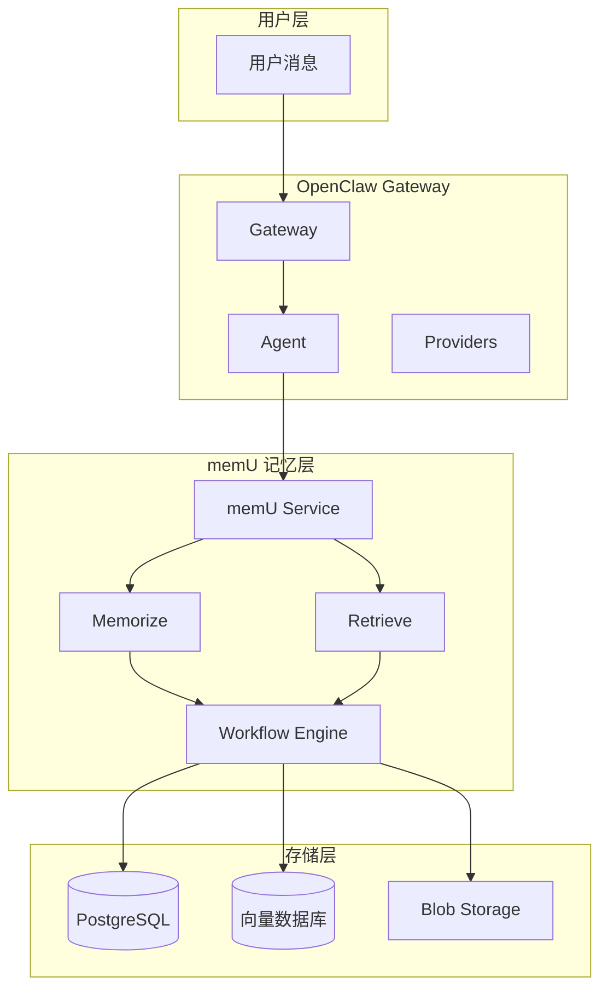
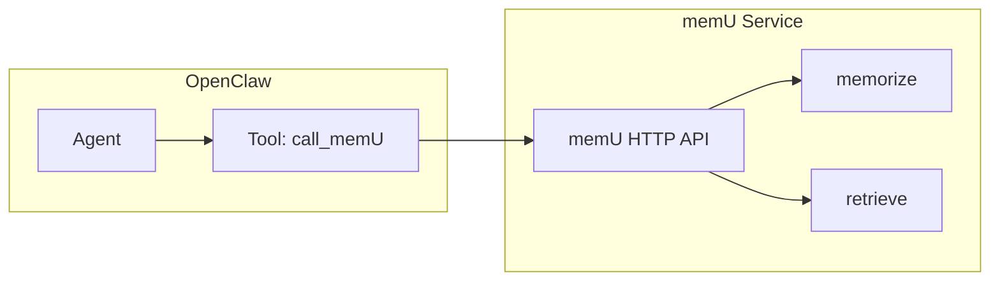
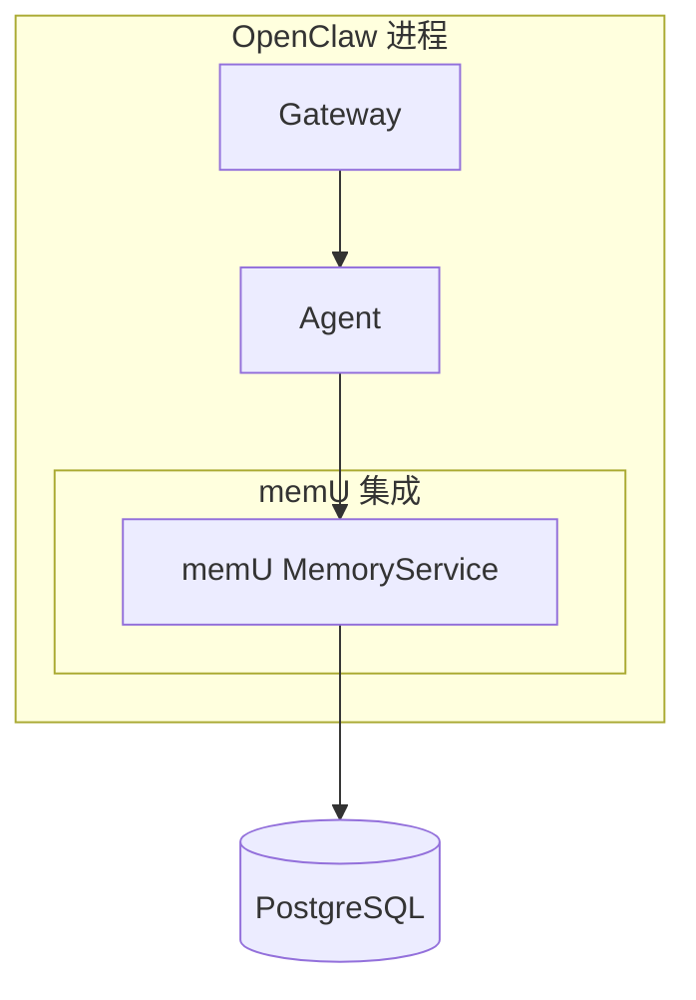

# OpenClaw + memU 集成方案：构建下一代主动式 AI Agent

> 如何将 memU 的强大记忆系统集成到 OpenClaw 中

## 1. 背景与目标

### 1.1 为什么需要集成？

| 特性 | OpenClaw 当前 | memU 提供 |
|------|--------------|----------|
| 记忆存储 | 简单 Key-Value + 向量 | 三层结构 (Resource/Item/Category) |
| 检索方式 | 纯向量搜索 | RAG + LLM 双模式 |
| 主动学习 | 基础规则捕获 | 完整的主动学习流程 |
| 记忆类型 | 无区分 | 6 种预定义类型 |
| 多模态 | 有限 | 完整支持 |

**集成目标**：
- 🎯 让 OpenClaw 具备 **24/7 主动记忆** 能力
- 🧠 支持更智能的 **意图预测** 和 **上下文推断**
- 📚 实现 **自动分类** 和 **摘要更新**
- 🔄 获得 **渐进式检索** 能力

### 1.2 集成架构图



## 2. 集成方案一：插件式集成 (推荐)

### 2.1 方案概述

创建一个 OpenClaw 插件，将 memU 作为外部服务调用。



### 2.2 实现步骤

#### Step 1: 创建 memU 服务

```python
# memu_service.py
from memu import MemoryService

class MemUServiceWrapper:
    def __init__(self):
        self.service = MemoryService(
            llm_profiles={
                "default": {
                    "base_url": "http://localhost:11434/v1",
                    "api_key": "ollama",
                    "chat_model": "llama3",
                    "client_backend": "httpx"
                }
            },
            database_config={
                "metadata_store": {"provider": "postgres"},
                "vector_index": {"provider": "postgres"}
            }
        )
    
    async def memorize(self, text, modality="conversation", user_id=None):
        return await self.service.memorize(
            resource_url=text,
            modality=modality,
            user={"user_id": user_id} if user_id else None
        )
    
    async def retrieve(self, query, user_id=None):
        return await self.service.retrieve(
            queries=[{"role": "user", "content": {"text": query}}],
            user={"user_id": user_id} if user_id else None
        )
```

#### Step 2: 创建 OpenClaw 插件

```typescript
// extensions/memory-memu/index.ts
import type { OpenClawPluginApi } from "openclaw/plugin-sdk";
import { Type } from "@sinclair/typebox";

const memuPlugin = {
  id: "memory-memu",
  name: "Memory (memU)",
  description: "memU-powered proactive memory with RAG + LLM retrieval",
  kind: "memory",
  configSchema: {
    type: "object",
    properties: {
      apiUrl: { type: "string", default: "http://localhost:8000" },
      apiKey: { type: "string" },
    }
  },

  register(api: OpenClawPluginApi) {
    const cfg = api.pluginConfig;

    // 注册工具
    api.registerTool({
      name: "memu_memorize",
      description: "记忆重要信息到长期记忆（使用 memU）",
      parameters: Type.Object({
        content: Type.String({ description: "要记忆的内容" }),
        modality: Type.Optional(Type.String({ 
          description: "类型: conversation/document/image/video/audio",
          default: "conversation"
        })),
      }),
      async execute(toolCallId, params) {
        const response = await fetch(`${cfg.apiUrl}/memorize`, {
          method: "POST",
          headers: {
            "Content-Type": "application/json",
            "Authorization": `Bearer ${cfg.apiKey}`
          },
          body: JSON.stringify({
            resource_url: params.content,
            modality: params.modality || "conversation"
          })
        });
        const result = await response.json();
        return { content: [{ type: "text", text: JSON.stringify(result) }] };
      }
    }, { name: "memu_memorize" });

    api.registerTool({
      name: "memu_retrieve",
      description: "从长期记忆检索信息（使用 memU）",
      parameters: Type.Object({
        query: Type.String({ description: "检索查询" }),
        method: Type.Optional(Type.String({ 
          description: "检索方法: rag 或 llm",
          default: "rag"
        })),
      }),
      async execute(toolCallId, params) {
        const response = await fetch(`${cfg.apiUrl}/retrieve`, {
          method: "POST",
          headers: {
            "Content-Type": "application/json",
            "Authorization": `Bearer ${cfg.apiKey}`
          },
          body: JSON.stringify({
            queries: [{ role: "user", content: { text: params.query } }],
            method: params.method || "rag"
          })
        });
        const result = await response.json();
        return { content: [{ type: "text", text: JSON.stringify(result) }] };
      }
    }, { name: "memu_retrieve" });
  }
};

export default memuPlugin;
```

#### Step 3: 创建 memU HTTP API 服务

```python
# api_server.py
from fastapi import FastAPI
from memu import MemoryService
import uvicorn

app = FastAPI()
service = None

@app.on_event("startup")
async def init():
    global service
    service = MemoryService(
        llm_profiles={"default": {...}},
        database_config={...}
    )

@app.post("/memorize")
async def memorize(request: dict):
    result = await service.memorize(**request)
    return result

@app.post("/retrieve")
async def retrieve(request: dict):
    result = await service.retrieve(**request)
    return result

if __name__ == "__main__":
    uvicorn.run(app, host="0.0.0.0", port=8000)
```

### 2.3 配置 OpenClaw

```yaml
# openclaw.yaml
plugins:
  - id: memory-memu
    config:
      apiUrl: "http://localhost:8000"
      apiKey: "your-api-key"
```

## 3. 集成方案二：直接集成 (深度定制)

### 3.1 方案概述

直接将 memU 库集成到 OpenClaw 内部，共享同一个进程。



### 3.2 实现步骤

#### Step 1: 安装 memU

```bash
pip install memu
# 或从源码安装
cd memU && pip install -e .
```

#### Step 2: 修改 Agent 配置

```typescript
// src/agents/config.ts
export interface AgentConfig {
  // ... 其他配置
  
  // memU 配置
  memory?: {
    enabled: boolean;
    provider: "memu" | "lancedb";
    memuConfig?: {
      llmProfiles: Record<string, any>;
      databaseConfig: Record<string, any>;
    };
  };
}
```

#### Step 3: 创建 memU 记忆管理器

```typescript
// src/memory/memu-manager.ts
import { MemoryService } from "memu";

export class MemUMemoryManager {
  private service: MemoryService;
  
  constructor(config: any) {
    this.service = new MemoryService(config);
  }
  
  async memorize(
    content: string, 
    modality: "conversation" | "document" = "conversation",
    userId?: string
  ) {
    return await this.service.memorize({
      resource_url: content,
      modality,
      user: userId ? { user_id: userId } : undefined
    });
  }
  
  async retrieve(query: string, method: "rag" | "llm" = "rag") {
    return await this.service.retrieve({
      queries: [{ role: "user", content: { text: query } }],
      method
    });
  }
  
  // 便捷方法
  async memorizeConversation(messages: any[], userId?: string) {
    const text = this.formatMessages(messages);
    return this.memorize(text, "conversation", userId);
  }
  
  async getUserContext(userId: string, query: string) {
    return this.retrieve(query);
  }
  
  private formatMessages(messages: any[]): string {
    return messages
      .map(m => `${m.role}: ${m.content}`)
      .join("\n");
  }
}
```

#### Step 4: 集成到 Agent 生命周期

```typescript
// src/agents/agent.ts
export class Agent {
  private memoryManager: MemUMemoryManager | null = null;
  
  async initialize() {
    // 初始化 memU
    if (this.config.memory?.enabled && this.config.memory.provider === "memu") {
      this.memoryManager = new MemUMemoryManager(
        this.config.memory.memuConfig
      );
    }
  }
  
  async run(input: string): Promise<string> {
    // 1. 检索相关记忆
    let context = "";
    if (this.memoryManager) {
      const memories = await this.memoryManager.retrieve(input);
      context = this.formatMemories(memories);
    }
    
    // 2. 构建提示词
    const prompt = context 
      ? `${context}\n\n用户: ${input}`
      : input;
    
    // 3. 运行 Agent
    const response = await this.llm.chat(prompt);
    
    // 4. 记忆对话
    if (this.memoryManager) {
      await this.memoryManager.memorizeConversation([
        { role: "user", content: input },
        { role: "assistant", content: response }
      ]);
    }
    
    return response;
  }
  
  private formatMemories(result: any): string {
    const items = result.items || [];
    if (items.length === 0) return "";
    
    const formatted = items.map((item: any) => 
      `[${item.memory_type}] ${item.summary}`
    ).join("\n");
    
    return `<relevant-memories>\n${formatted}\n</relevant-memories>`;
  }
}
```

## 4. 高级特性集成

### 4.1 自动记忆捕获 (Auto-Capture)

```typescript
// 自动捕获重要信息
class AutoCapture {
  constructor(private memoryManager: MemUMemoryManager) {}
  
  // 基于规则的记忆触发
  private triggers = [
    /记住|记住我|记住这个/i,
    /我的.*是|我是.*我喜欢/i,
    /prefer|like|hate|want|need/i,
    /\d{10,}/,  // 电话号码
    /[\w.-]+@[\w.-]+\.\w+/,  // 邮箱
  ];
  
  async captureMessage(message: string, userId?: string): Promise<boolean> {
    // 检查是否应该捕获
    if (!this.shouldCapture(message)) {
      return false;
    }
    
    // 检测记忆类型
    const modality = this.detectModality(message);
    
    // 存储
    await this.memoryManager.memorize(message, modality, userId);
    return true;
  }
  
  private shouldCapture(message: string): boolean {
    if (message.length < 10 || message.length > 500) {
      return false;
    }
    return this.triggers.some(regex => regex.test(message));
  }
  
  private detectModality(message: string): "conversation" | "document" {
    // 根据内容判断
    return "conversation";
  }
}
```

### 4.2 主动建议 (Proactive Suggestions)

```typescript
// 基于用户意图的主动建议
class ProactiveSuggestions {
  constructor(private memoryManager: MemUMemoryManager) {}
  
  async suggest(userId: string, currentContext: string): Promise<string[]> {
    // 使用 LLM 模式深度检索
    const result = await this.memoryManager.retrieve(currentContext, "llm");
    
    // 获取预测的下一步
    const nextStep = result.next_step_query;
    if (!nextStep) return [];
    
    // 生成建议
    return [nextStep];
  }
}
```

### 4.3 多模态记忆

```typescript
// 支持图像、视频记忆
class MultimodalMemory {
  constructor(private memoryManager: MemUMemoryManager) {}
  
  async memorizeImage(imagePath: string, userId?: string) {
    return this.memoryManager.memorize(imagePath, "image", userId);
  }
  
  async memorizeVideo(videoPath: string, userId?: string) {
    return this.memoryManager.memorize(videoPath, "video", userId);
  }
  
  async memorizeDocument(docPath: string, userId?: string) {
    return this.memoryManager.memorize(docPath, "document", userId);
  }
}
```

## 5. 使用示例

### 5.1 基础对话场景

```typescript
// 用户: "我喜欢在下午3点喝咖啡"
await agent.run("我喜欢在下午3点喝咖啡");

// memU 自动:
// 1. 识别为 profile 类型记忆
// 2. 提取关键信息: "用户偏好: 下午3点喝咖啡"
// 3. 自动归类到 "偏好" 类别
// 4. 更新类别摘要

// 用户: "我最近在学 Python"
await agent.run("我最近在学 Python");

// memU 自动:
// 1. 识别为 skill/knowledge 类型
// 2. 创建记忆
// 3. 关联到 "学习" 类别

// 用户: "我明天要开会"
await agent.run("我明天要开会");

// 后续检索: "用户的日常习惯是什么？"
// memU 返回:
// - [profile] 用户偏好: 下午3点喝咖啡
// - [skill] 正在学习: Python
```

### 5.2 高级场景：意图预测

```typescript
// 用户连续对话
await agent.run("我想学编程");      // → memorizes: 学习意向
await agent.run("什么语言好就业？"); // → retrieves: 编程学习
                                   // → predicts: 可能想了解语言推荐

// memU 主动建议
const suggestions = await proactive.suggest(userId, "什么语言好就业？");
// ["推荐 Python，适合入门且就业前景好"]
```

## 6. 配置选项

### 6.1 memU 服务配置

```yaml
# config.yaml
memory:
  provider: memu
  memu:
    llm_profiles:
      default:
        base_url: "https://api.openai.com/v1"
        api_key: "${OPENAI_API_KEY}"
        chat_model: "gpt-4o"
        embed_model: "text-embedding-3-small"
    
    database_config:
      metadata_store:
        provider: postgres
        connection:
          host: localhost
          port: 5432
          database: memu
          user: postgres
          password: "${DB_PASSWORD}"
    
    memorize_config:
      memory_types:
        - profile
        - event
        - knowledge
        - behavior
        - skill
        - tool
      enable_item_references: true
    
    retrieve_config:
      method: rag
      route_intention: true
      sufficiency_check: true
```

### 6.2 OpenClaw 插件配置

```yaml
# openclaw.yaml
plugins:
  - id: memory-memu
    enabled: true
    config:
      apiUrl: "http://memu-service:8000"
      autoCapture: true
      autoRecall: true
```

## 7. 迁移指南

### 7.1 从 LanceDB 迁移

```typescript
// 现有 LanceDB 配置
const existingConfig = {
  dbPath: "./memory.lance",
  embedding: { model: "text-embedding-3-small" }
};

// 迁移到 memU
const memuConfig = {
  llm_profiles: {
    default: {
      embed_model: "text-embedding-3-small",
      // ...
    }
  },
  database_config: {
    metadata_store: { provider: "postgres" }
  }
};
```

### 7.2 数据迁移脚本

```typescript
// 迁移现有记忆到 memU
async function migrateMemories(lancedb, memuManager) {
  // 1. 导出 LanceDB 数据
  const memories = await lancedb.getAll();
  
  // 2. 导入到 memU
  for (const memory of memories) {
    await memuManager.memorize(
      memory.text,
      "conversation"
    );
  }
}
```

## 8. 性能优化

### 8.1 批量处理

```typescript
// 批量记忆
const messages = [
  "用户喜欢蓝色",
  "用户住在上海",
  "用户是工程师"
];

// 批量处理
for (const msg of messages) {
  await agent.run(msg);
}
```

### 8.2 缓存策略

```typescript
// 检索结果缓存
const cache = new Map<string, { result: any; timestamp: number }>();
const CACHE_TTL = 5 * 60 * 1000; // 5分钟

async function retrieveWithCache(query: string) {
  const key = `retrieve:${query}`;
  const cached = cache.get(key);
  
  if (cached && Date.now() - cached.timestamp < CACHE_TTL) {
    return cached.result;
  }
  
  const result = await memuManager.retrieve(query);
  cache.set(key, { result, timestamp: Date.now() });
  return result;
}
```

## 9. 监控与调试

### 9.1 日志集成

```typescript
// 记录 memU 操作
api.on("before_agent_start", async (event) => {
  logger.info("memU: checking memories for query", { 
    query: event.prompt?.slice(0, 100) 
  });
});

api.on("agent_end", async (event) => {
  logger.info("memU: captured memories", { 
    messageCount: event.messages?.length 
  });
});
```

### 9.2 调试端点

```python
# 添加调试端点
@app.get("/debug/memories")
async def debug_memories(user_id: str = None):
    return await service.retrieve(
        queries=[{"role": "user", "content": {"text": "*"}}],
        where={"user_id": user_id} if user_id else {}
    )
```

## 10. 总结

| 集成方案 | 复杂度 | 优点 | 缺点 |
|---------|-------|------|------|
| **插件式** | 低 | 独立部署、易于维护 | 网络延迟 |
| **直接集成** | 高 | 无延迟、完全控制 | 耦合度高 |

### 推荐路线

1. **初期**: 使用插件式集成，快速上线
2. **中期**: 添加自动捕获、主动建议功能
3. **后期**: 考虑直接集成，实现更深度的定制

### 预期收益

- ✅ 记忆能力提升 **10x** (三层结构)
- ✅ 检索质量提升 (RAG + LLM 双模式)
- ✅ 开发工作量减少 (复用 memU 工作流)
- ✅ 具备主动学习能力 (无需手动记忆)

通过集成 memU，OpenClaw 将真正成为一个**记住用户、理解用户、主动帮助用户**的 AI Agent！
