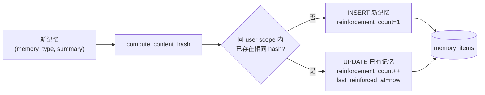
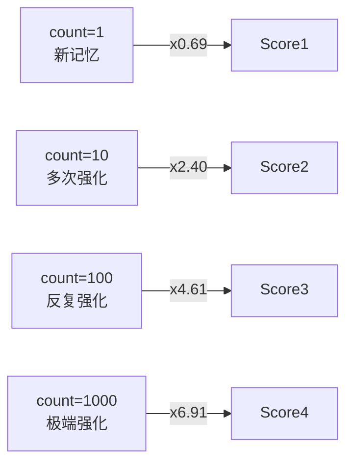
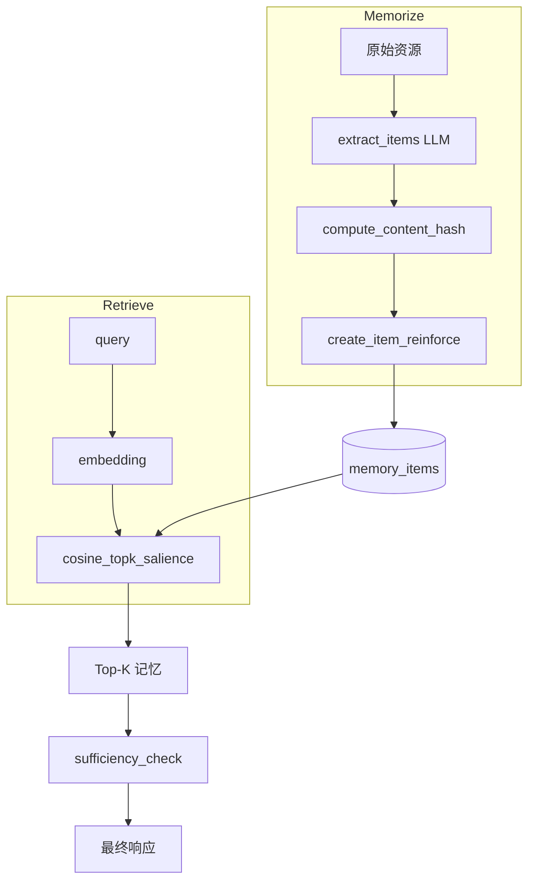

# memU 项目深度分析 (九)：记忆强化与 Salience 评分

> 基于源码分析的学习笔记。本篇专题讨论 memU 与"普通 RAG"最大的不同点之一 ——
> **不是所有记忆都同等重要**，越被反复确认、越新近发生的记忆，应该获得更高的检索优先级。

## 1. 问题：为什么纯余弦相似度不够用？

经典 RAG 检索 = 把 query 和所有候选向量算 cosine，取 Top-K。这种做法在"问答语料"场景里没问题，但对**长期记忆**有两个明显缺陷：

### 1.1 重复内容会反复占据 Top-K

如果用户在过去半年里反复说"我喜欢咖啡"5 次，传统 RAG 会得到 5 条几乎一样的记忆——它们的 cosine 相似度都接近 1.0。这会发生：

- 检索结果同质化，浪费 LLM 上下文窗口；
- 真正稀少但相关的记忆被挤出 Top-K；
- 写入端不停地堆数据，存储成本线性增长。

### 1.2 缺乏"时间感"

人类记忆有遗忘曲线：上周说过的话比一年前说过的话更可能反映用户当前状态。纯 cosine 排序对新旧一视同仁，结果就是：

- 早就改变的偏好（"我以前喜欢咖啡，现在改喝茶了"）永远会被检索出来；
- agent 给出"过时"的建议，损害用户信任。

## 2. memU 的解法：把"重复"变成"强化"



### 2.1 内容哈希：标准化 + 类型隔离

```15:32:memU/src/memu/database/models.py
def compute_content_hash(summary: str, memory_type: str) -> str:
    """
    Generate unique hash for memory deduplication.

    Operates on post-summary content. Normalizes whitespace to handle
    minor formatting differences like "I love coffee" vs "I  love  coffee".
    """
    # Normalize: lowercase, strip, collapse whitespace
    normalized = " ".join(summary.lower().split())
    content = f"{memory_type}:{normalized}"
    return hashlib.sha256(content.encode()).hexdigest()[:16]
```

设计要点：

| 设计 | 原因 |
|------|------|
| **小写 + 折叠空白** | `"I love coffee"` 与 `"I  love coffee"`、`"i love coffee"` 视为同一条 |
| **memory_type 作为前缀** | "用户喜欢 X" 作为 profile 和作为 event 是不同的事实，不应合并 |
| **截取前 16 字符** | hash 碰撞概率极低，但显著节约存储 |

`tests/test_salience.py` 里有完整的行为约束：

```93:104:memU/tests/test_salience.py
def test_whitespace_normalization(self):
    """Whitespace variations should produce same hash."""
    hash1 = compute_content_hash("User loves coffee", "profile")
    hash2 = compute_content_hash("User  loves   coffee", "profile")
    hash3 = compute_content_hash("  User loves coffee  ", "profile")
    assert hash1 == hash2 == hash3

def test_case_insensitive(self):
    """Hash should be case-insensitive."""
    hash1 = compute_content_hash("User loves coffee", "profile")
    hash2 = compute_content_hash("USER LOVES COFFEE", "profile")
    assert hash1 == hash2
```

### 2.2 写入路径：reinforce 模式

只有当 `MemorizeConfig.enable_item_reinforcement=True` 时，写入才会走 `create_item_reinforce`：

```122:167:memU/src/memu/database/inmemory/repositories/memory_item_repo.py
def create_item_reinforce(
    self,
    *,
    resource_id: str,
    memory_type: MemoryType,
    summary: str,
    embedding: list[float],
    user_data: dict[str, Any],
    reinforce: bool = False,
) -> MemoryItem:
    content_hash = compute_content_hash(summary, memory_type)

    # Check for existing item with same hash in same scope (deduplication)
    existing = self._find_by_hash(content_hash, user_data)
    if existing:
        # Reinforce existing memory instead of creating duplicate
        current_extra = existing.extra or {}
        current_count = current_extra.get("reinforcement_count", 1)
        existing.extra = {
            **current_extra,
            "reinforcement_count": current_count + 1,
            "last_reinforced_at": pendulum.now("UTC").isoformat(),
        }
        existing.updated_at = pendulum.now("UTC")
        return existing

    # Create new item with salience tracking in extra
    mid = str(uuid.uuid4())
    now = pendulum.now("UTC")
    item_extra = user_data.pop("extra", {}) if "extra" in user_data else {}
    item_extra.update({
        "content_hash": content_hash,
        "reinforcement_count": 1,
        "last_reinforced_at": now.isoformat(),
    })
    it = self.memory_item_model(
        id=mid,
        resource_id=resource_id,
        memory_type=memory_type,
        summary=summary,
        embedding=embedding,
        extra=item_extra,
        **user_data,
    )
```

注意几个微妙之处：

- **`_find_by_hash` 必须在 `user_data` 范围内查找**：这意味着不同 user 之间不会互相去重——A 用户和 B 用户都"喜欢咖啡"会各自维护一条记录。
- **tool 类型 _永远_ 不走 reinforce**：`create_item` 中有 `if reinforce and memory_type != "tool"` 的判断；因为工具记忆通常关心的是**每次调用**的不同入参/结果，去重等于丢信息。
- **PostgreSQL / SQLite 后端实现等价**：`memU/src/memu/database/postgres/repositories/memory_item_repo.py` 用 `extra->>'content_hash'`、SQLite 用 `json_extract(extra, '$.content_hash')` 走索引/全表扫描去查。

### 2.3 为什么把这些字段塞进 `extra` 而不是单独建列？

memU 选择了"**惰性扩展**"——不修改数据库 schema，而是用 JSON 字段承载所有可选属性。代价是查询时需要走 JSON 函数，索引不如普通列高效；但收益是：

- 这套强化机制**默认关闭**，关掉时表完全等价于不开启此功能的状态；
- 用户可以自由扩展 `extra` 添加自己的属性（如 `confidence`、`tags`、`source_session_id`），不破坏向上兼容；
- 不同 memory_type 可以有不同的 `extra` 形态，schema 不会因此变得臃肿。

## 3. 检索侧：salience-aware ranking

光去重还不够——召回时还要知道"哪条记忆值得优先返回"。memU 提供了一个加权评分：

### 3.1 公式

\[
\text{score} = \text{cosine}(q, v) \times \log(c + 1) \times \exp\!\left(-\ln 2 \cdot \frac{\Delta t}{T_{1/2}}\right)
\]

| 因子 | 含义 | 实现 |
|------|------|------|
| 相似度 | 语义匹配 | `cosine(query, memory.embedding)` |
| 强化因子 | 反复确认次数 | `log(reinforcement_count + 1)` |
| 衰减因子 | 距上次强化的时间 | `exp(-0.693 · days_ago / half_life_days)` |

源码：

```16:53:memU/src/memu/database/inmemory/vector.py
def salience_score(
    similarity: float,
    reinforcement_count: int,
    last_reinforced_at: datetime | None,
    recency_decay_days: float = 30.0,
) -> float:
    """
    Compute salience-aware score combining similarity, reinforcement, and recency.

    Formula: similarity * reinforcement_factor * recency_factor

    - reinforcement_factor: log(count + 1) to dampen extreme counts
      (Logarithmic scaling prevents runaway dominance by frequently repeated facts)
    - recency_factor: exponential decay based on days since last reinforcement
      (Uses half-life decay: after recency_decay_days, factor is ~0.5)
    """
    reinforcement_factor = math.log(reinforcement_count + 1)

    if last_reinforced_at is None:
        recency_factor = 0.5  # Unknown recency gets neutral score
    else:
        now = datetime.now(last_reinforced_at.tzinfo) if last_reinforced_at.tzinfo else datetime.utcnow()
        days_ago = (now - last_reinforced_at).total_seconds() / 86400
        # 0.693 = ln(2), gives us proper half-life decay
        recency_factor = math.exp(-0.693 * days_ago / recency_decay_days)

    return similarity * reinforcement_factor * recency_factor
```

### 3.2 三个因子的设计动机

#### 强化因子：为什么用 `log(count+1)` 而不是 `count`？



| count | linear | log(count+1) |
|-------|--------|--------------|
| 1     | 1      | 0.69         |
| 10    | 10     | 2.40         |
| 100   | 100    | 4.61         |
| 1000  | 1000   | 6.91         |

如果用线性，一条被强化 100 次的记忆会**永远碾压**其他记忆——但这不一定是用户期望的（高频未必更重要）。`log` 把无界增长压缩到温和的对数曲线，新记忆与老记忆之间始终有比较空间。

#### 衰减因子：精确控制半衰期

`exp(-ln2 · t / T)` 是经典的指数衰减，**半衰期就是参数 `recency_decay_days`**。默认 30 天：

| 时间 | 衰减系数 |
|------|---------|
| 0 天（今天）   | 1.00 |
| 30 天后      | 0.50 |
| 60 天后      | 0.25 |
| 90 天后      | 0.125 |

如果你的记忆库代表"用户 7 天内的活跃偏好"，把 `recency_decay_days` 设为 7，过去一周的记忆衰减会更明显——更适合实时类场景。

#### 边界情况：`last_reinforced_at` 为 None

`recency_factor = 0.5`（中性）—— 这里**不是**取 1.0（永不衰减），也**不是**取 0（直接屏蔽），而是给一个保守值。这种 fallback 对应的是"老数据被新功能开关启用"的迁移场景：之前没有这个字段的记忆，并不会因为缺字段就被永久屏蔽，但也不能享受"新鲜度"红利。

### 3.3 几个有代表性的 trade-off

`tests/test_salience.py` 里有一个绝佳的例子展示三因子之间的权衡：

```143:157:memU/tests/test_salience.py
def test_reinforcement_vs_recency_tradeoff(self):
    """High reinforcement old memory vs low reinforcement recent memory."""
    now = datetime.now(UTC)
    old = now - timedelta(days=30)  # 30 days ago = half-life

    # Memory A: high reinforcement (10), old (30 days)
    score_a = salience_score(0.85, 10, old, 30.0)

    # Memory B: low reinforcement (1), recent (now)
    score_b = salience_score(0.85, 1, now, 30.0)

    # A should score higher due to reinforcement
    # A: 0.85 * log(11) * 0.5 ≈ 0.85 * 2.4 * 0.5 ≈ 1.02
    # B: 0.85 * log(2) * 1.0 ≈ 0.85 * 0.69 * 1.0 ≈ 0.59
    assert score_a > score_b
```

> 解读：在相同相似度下，**"被强化 10 次的旧记忆"超过"刚强化 1 次的新记忆"**——因为 `log(11) ≈ 2.4` 的强化力度大于"30 天衰减的 0.5"造成的损失。如果你想让"新近"权重更大，调小 `recency_decay_days`（比如 7 天）即可让衰减更陡。

## 4. 怎么开启它？

### 4.1 在 memorize 阶段开启强化

```python
service = MemoryService(
    memorize_config={
        "enable_item_reinforcement": True,   # 关键开关
    },
)
```

> ⚠️ 仅在 `enable_item_reinforcement=True` 时，新写入才会走 `create_item_reinforce`、维护 `content_hash / reinforcement_count / last_reinforced_at`。否则即使后面切换到 salience ranking，也会因为没有这些字段而退回到 `recency_factor = 0.5` 的中性态。

### 4.2 在 retrieve 阶段开启 salience ranking

```python
service = MemoryService(
    retrieve_config={
        "item": {
            "ranking": "salience",          # 默认 "similarity"
            "recency_decay_days": 14.0,     # 半衰期 14 天
        },
    },
)

# 仍然按平时调用
result = await service.retrieve(queries=[...], where={"user_id": "123"})
```

### 4.3 完整组合

```python
service = MemoryService(
    llm_profiles={"default": {...}},
    database_config={"metadata_store": {"provider": "inmemory"}},
    memorize_config={
        "enable_item_reinforcement": True,
    },
    retrieve_config={
        "method": "rag",
        "item": {
            "ranking": "salience",
            "recency_decay_days": 30.0,
        },
    },
)
```

## 5. 与其他设计的协同



注意几条 **隐藏的依赖**：

1. **强化机制必须配合"用户范围 (user scope)"**：如果用户体系里只有一个 `user_id`，所有用户的"我喜欢咖啡"会被合并；要按 agent / session 隔离，得在自定义 user_model 里加 `agent_id` 或 `session_id`。
2. **强化只对 `extract_items` 产出的记忆生效**——CRUD 接口创建的记忆走的是普通 `create_item(reinforce=False)`，因为那是用户主动创建，不应该悄悄合并。
3. **salience 与 sufficiency_check 是正交的**：salience 改变排序，sufficiency_check 决定是否继续往下层（item → resource）走；两者都开启时，可以理解成"先按显著性排序，再让 LLM 评估这个排序结果是否够用"。

## 6. 你可能想问的几个问题

### Q1: 我能让删除/更新也参与"反强化"吗？

目前 `delete_memory_item` 只是物理删除，不会做"权重衰减"。如果你需要"软删除 + 衰减"，可以注册一个 workflow 拦截器在 `delete_memory_item` step 后把 item 写入一个 `extra.deprecated=True`，并在 `vector_search_items` 的 where 里过滤掉它。不动 memU 源码就能实现。

### Q2: 不同 memory_type 能用不同的 ranking 吗？

当前实现是**全局统一**的 `RetrieveItemConfig.ranking`。如果想让 `profile` 用 salience 而 `event` 用纯 cosine，需要：

1. 把 `recall_items` step 替换为自定义 handler；
2. 在 handler 里按 memory_type 分别调用 `cosine_topk` / `cosine_topk_salience`，再合并结果。

借助 `service.replace_step("recall_items", ...)` 即可，不需要 fork。

### Q3: 半衰期参数怎么调？

经验上：

| 场景 | `recency_decay_days` |
|------|---------------------|
| 客服 / 工单系统（事件性） | 7 ~ 14 |
| 通用助手 / 偏好画像 | 30（默认） |
| 长期知识库 / 个人传记 | 90 ~ 180 |

更激进的做法是把它做成 per-memory 的字段写到 `extra`，由 LLM 在抽取时给出 "这是临时偏好" / "这是长期事实" 的分类，从而个性化每条记忆的衰减速率。

## 7. 总结

memU 的"强化 + 显著性"系统由三段独立、又彼此协同的代码组成：

| 阶段 | 关键代码 | 角色 |
|------|---------|------|
| 写入去重 | `compute_content_hash` + `create_item_reinforce` | 同内容不重复入库，只增计数 |
| 元数据 | `extra.{content_hash, reinforcement_count, last_reinforced_at}` | 不动 schema 也能记录强化信息 |
| 检索加权 | `salience_score` + `cosine_topk_salience` | 把"反复确认 + 新鲜度"折算进相似度 |

这个特性看似只是"加了一个排序维度"，实际上是 memU 与"普通 RAG 记忆库"之间的**关键分界线**：它把记忆当成**有生命周期、有强弱的实体**来对待，而不是一堆"等价的向量"。
