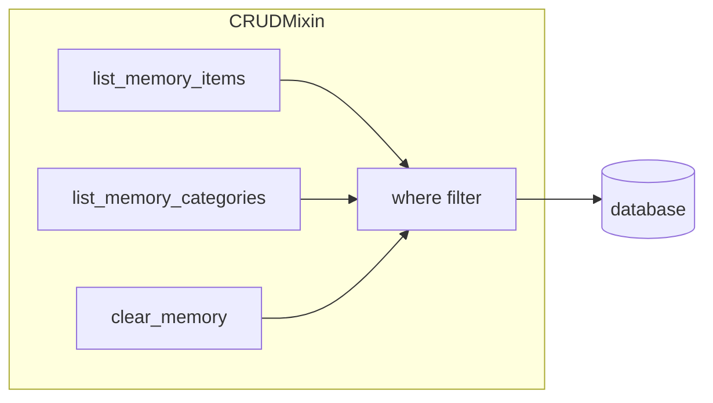
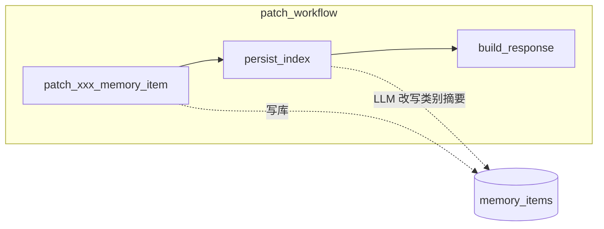
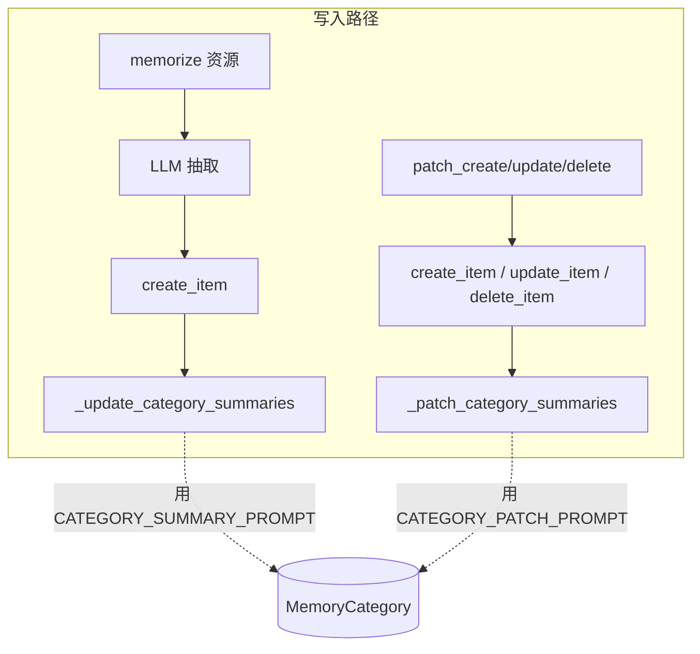

# memU 项目深度分析 (十)：CRUD 与类别摘要传播机制

> 基于源码分析的学习笔记。本篇专门讨论 memU 中 **PatchMixin / CRUDMixin** 提供的"手动管理记忆"接口，
> 以及它最有意思的设计 —— 当一条记忆被增/删/改时，**类别摘要会被 LLM 自动同步更新**。

## 1. 为什么需要"手动管理记忆"？

`memorize()` 的工作模式是 **把资源塞进去 → LLM 自动抽取**，但实际产品中经常有这些场景需要绕过 LLM 直接操作：

- 用户在 UI 上点击"忘记这条信息" → `delete_memory_item`
- 用户编辑了一条偏好 → `update_memory_item`
- 第三方系统（CRM、HRMS）直接同步用户字段 → `create_memory_item`

memU 把这些操作抽出来放进 `PatchMixin`（`src/memu/app/patch.py`）和 `CRUDMixin`（`src/memu/app/crud.py`），它们和 `MemorizeMixin` / `RetrieveMixin` 一起组装成 `MemoryService`。

## 2. CRUDMixin：只读 + 清空

`CRUDMixin` 提供三个工具型接口，都是工作流但只走 1～2 个 step：



| 方法 | 用途 |
|------|------|
| `list_memory_items(where=...)` | 列举（按 user scope）所有记忆项 |
| `list_memory_categories(where=...)` | 列举类别 |
| `clear_memory(where=...)` | 清空指定 scope 的 items + categories + relations + resources |

`clear_memory` 特别值得注意——它不是简单 DELETE，而是**会先清掉所有依赖关系**（CategoryItem 关联 → MemoryItem → Resource → MemoryCategory），保证不会留孤儿数据。

```python
# 典型用法：用户登出后清掉这个 user 的全部记忆
await service.clear_memory(where={"user_id": "tom"})
```

## 3. PatchMixin：写入 + 传播

`PatchMixin` 提供三个会**真正修改记忆**的接口：

```python
await service.create_memory_item(
    memory_type="profile",
    memory_content="The user works as a product manager",
    memory_categories=["Basic Information"],
    user={"user_id": "tom"},
    propagate=True,             # 关键开关
)

await service.update_memory_item(
    memory_id="abc-123",
    memory_content="The user works as a senior product manager",
    propagate=True,
)

await service.delete_memory_item(
    memory_id="abc-123",
    propagate=True,
)
```

### 3.1 内部的工作流形态

每个 patch 操作都是一个 3-step 工作流：



源码：

```146:174:memU/src/memu/app/patch.py
def _build_create_memory_item_workflow(self) -> list[WorkflowStep]:
    steps = [
        WorkflowStep(
            step_id="create_memory_item",
            role="patch",
            handler=self._patch_create_memory_item,
            requires={"memory_payload", "ctx", "store", "user"},
            produces={"memory_item", "category_updates"},
            capabilities={"db", "llm"},
        ),
        WorkflowStep(
            step_id="persist_index",
            role="persist",
            handler=self._patch_persist_and_index,
            requires={"category_updates", "ctx", "store"},
            produces={"categories"},
            capabilities={"db", "llm"},
        ),
        WorkflowStep(
            step_id="build_response",
            role="emit",
            handler=self._patch_build_response,
            requires={"memory_item", "category_updates", "ctx", "store"},
            produces={"response"},
            capabilities=set(),
        ),
    ]
```

### 3.2 关键状态：`category_updates`

每个 patch step 在 state 里产出 `category_updates: dict[str, tuple[str | None, str | None]]`，含义是：

```python
category_updates = {
    "category_id_1": ("旧内容", "新内容"),    # update
    "category_id_2": (None, "新内容"),       # add
    "category_id_3": ("旧内容", None),       # remove
}
```

这个三态元组是后续 LLM 传播的 **唯一输入**，编排巧妙：

#### Create

```261:289:memU/src/memu/app/patch.py
async def _patch_create_memory_item(self, state, step_context):
    ...
    item = store.memory_item_repo.create_item(...)
    cat_names = memory_payload["categories"]
    mapped_cat_ids = self._map_category_names_to_ids(cat_names, ctx)
    for cid in mapped_cat_ids:
        store.category_item_repo.link_item_category(item.id, cid, user_data=...)
        if propagate:
            category_memory_updates[cid] = (None, memory_payload["content"])  # add
```

#### Update（最复杂）

更新会区分**关联类别变化** vs **内容变化**：

```291:343:memU/src/memu/app/patch.py
async def _patch_update_memory_item(self, state, step_context):
    ...
    old_item_categories = store.category_item_repo.get_item_categories(memory_id)
    mapped_old_cat_ids = [cat.category_id for cat in old_item_categories]
    ...
    new_cat_names = memory_payload["categories"]
    mapped_new_cat_ids = self._map_category_names_to_ids(new_cat_names, ctx)

    cats_to_remove = set(mapped_old_cat_ids) - set(mapped_new_cat_ids)
    cats_to_add = set(mapped_new_cat_ids) - set(mapped_old_cat_ids)
    for cid in cats_to_remove:
        store.category_item_repo.unlink_item_category(memory_id, cid)
        if propagate:
            category_memory_updates[cid] = (old_content, None)        # remove
    for cid in cats_to_add:
        store.category_item_repo.link_item_category(memory_id, cid, ...)
        if propagate:
            category_memory_updates[cid] = (None, item.summary)       # add

    if propagate and memory_payload["content"]:
        for cid in set(mapped_old_cat_ids) & set(mapped_new_cat_ids):
            category_memory_updates[cid] = (old_content, item.summary)  # diff update
```

也就是说，**一次 update 可能同时产生 add / remove / diff** 三种类型的传播任务。

#### Delete

```345:365:memU/src/memu/app/patch.py
async def _patch_delete_memory_item(self, state, step_context):
    ...
    if propagate:
        for cat in item_categories:
            category_memory_updates[cat.category_id] = (item.summary, None)  # remove
    store.memory_item_repo.delete_item(memory_id)
```

### 3.3 `propagate=False` 的用途

如果你只想做"小手术"，不希望 LLM 重写类别摘要（节省调用、避免摘要漂移），可以传 `propagate=False`：

```python
# 仅修改这条记忆，不动任何类别摘要
await service.update_memory_item(
    memory_id="abc-123",
    memory_content="...",
    propagate=False,
)
```

这条路径下 `category_updates` 始终是空 dict，`persist_index` step 走的是 `_patch_category_summaries` 的"快路径"——直接 `if not updates: return`，**零 LLM 调用、零额外 DB 写**：

```404:412:memU/src/memu/app/patch.py
async def _patch_category_summaries(
    self,
    updates: dict[str, list[str]],
    ctx: Context,
    store: Database,
    llm_client: Any | None = None,
) -> None:
    if not updates:
        return
```

> **额外提醒**：哪怕 `propagate=True`，patch 走的 `update_category(category_id, summary)` 只刷新 `summary` 字段，**类别的 embedding 不会被重算**。这意味着如果你后续用 RAG 检索 category，检索向量还是按"被修订前的语义"来匹配。如果业务上需要"修订摘要后立刻让向量也跟上"，要么手动调一次 memorize（让 `_update_category_summaries` 走全量路径），要么做一个后台 reindex。

## 4. 类别摘要传播：`CATEGORY_PATCH_PROMPT`

这是本篇真正的"亮点设计"。

### 4.1 思路：让 LLM 做"diff -> rewrite"

类别（MemoryCategory）有一个 `summary` 字段，是对该类别下所有 items 的**人类可读综合描述**（例如 *"用户喜欢咖啡、绿茶，工作日下午 2 点固定补充咖啡因"*）。当某条 item 被改/删/增时，整个类别摘要可能就**不再准确**了。

朴素做法是：每次都重新读取所有 items、让 LLM 全量生成摘要。但这很贵。memU 选择更轻量的做法：**让 LLM 看 (旧 summary, 三元组变化)，输出新 summary**。

### 4.2 prompt 结构

```1:46:memU/src/memu/prompts/category_patch/category.py
PROMPT = """
# Task Objective
Your task is to read an existing user profile and an update related to a specific memory topic, then determine whether the profile needs to be updated.
If an update is required, you must generate the updated version of the profile based on the rules below.

# Workflow
1. Understand the Topic
Focus only on memories relevant to the specified Topic.

2. Analyze Original Content
Review the existing profile content enclosed in <content>...</content>.

3. Analyze Update
Determine whether the update represents:
- A new memory
- A variation of an existing memory
- A discarded (invalidated) memory

4. Decision Making
Judge whether the profile requires modification based on relevance and importance.

5. Generate Output
- If an update is required, produce the revised profile content.
- If not, explicitly indicate that no update is needed.


# Response Format (JSON):
{{
    "need_update": [bool, whether the profile needs to be updated]
    "updated_content": [str, the updated content of the profile if need_update is true, otherwise empty]
}}


# Input
Topic:
{category}

Original content:
<content>
{original_content}
</content>

Update:
{update_content}
"""
```

注意几个细节：

- 输出是 **JSON**（与抽取阶段的 XML 不同），因为这里只需要两个简单字段，JSON 解析器够用；
- LLM 拥有"否决权"：通过 `need_update=false` 直接拒绝传播——这是一个非常精明的设计，避免轻微变化把摘要不停"洗"得越来越长；
- `update_content` 由 `_build_category_patch_prompt` 拼装成不同句式，明确告诉 LLM 是 add / remove / diff：

```438:464:memU/src/memu/app/patch.py
def _build_category_patch_prompt(
    self, *, category: MemoryCategory, content_before: str | None, content_after: str | None
) -> str:
    if content_before and content_after:
        update_content = "\n".join([
            "The memory content before:",
            content_before,
            "The memory content after:",
            content_after,
        ])
    elif content_before:
        update_content = "\n".join([
            "This memory content is discarded:",
            content_before,
        ])
    elif content_after:
        update_content = "\n".join([
            "This memory content is newly added:",
            content_after,
        ])
```

### 4.3 LLM 否决权 + parse 的容错

```466:479:memU/src/memu/app/patch.py
def _parse_category_patch_response(self, response: str) -> tuple[bool, str]:
    try:
        data = json.loads(response)
    except (json.JSONDecodeError, TypeError):
        return False, ""
    if not isinstance(data, dict):
        return False, ""
    if not data.get("updated_content"):
        return False, ""
    need_update = data.get("need_update", False)
    updated_content = data["updated_content"].strip()
    if updated_content == "empty":
        updated_content = ""
    return need_update, updated_content
```

- JSON 解析失败 → 默默不更新（**不抛异常**），失败安全；
- LLM 返回字符串字面量 `"empty"` → 视为清空摘要；
- 这种容错策略很关键：传播失败不该影响主操作（item 已经写入），也不该让用户感知到。

### 4.4 并行化：一次 patch 触发的多个类别 LLM 调用是并发的

```404:436:memU/src/memu/app/patch.py
async def _patch_category_summaries(self, updates, ctx, store, llm_client=None) -> None:
    if not updates:
        return
    tasks = []
    target_ids: list[str] = []
    client = llm_client or self._get_llm_client()
    for cid, (content_before, content_after) in updates.items():
        cat = store.memory_category_repo.categories.get(cid)
        if not cat or (not content_before and not content_after):
            continue
        prompt = self._build_category_patch_prompt(...)
        tasks.append(client.chat(prompt))
        target_ids.append(cid)
    if not tasks:
        return
    patches = await asyncio.gather(*tasks)
    for cid, patch in zip(target_ids, patches, strict=True):
        ...
```

`asyncio.gather` 让"一条 update 同时触发 5 个类别更新"也能在同等延迟内完成。如果你需要给这些调用加全局并发限流，记得在 LLM 客户端外面加一层信号量，而不是改这里的代码。

## 5. 这套机制带来的运行时成本

| 操作 | DB 写 | LLM 调用 | embedding 调用 |
|------|------|---------|----------------|
| `create_memory_item`（`propagate=False`） | 1 INSERT + N link | 0 | 1（item content） |
| `create_memory_item`（`propagate=True`）  | 1 INSERT + N link + ≤N UPDATE | **N**（每个被影响类别一次） | 1 |
| `update_memory_item`（`propagate=True`） | 1 UPDATE + 调整关联 + ≤N UPDATE | 最多 **N**（每个变化的 cid 一次，Update 里 add/remove/diff 都各占一个 entry） | 1（如果改了 content） |
| `delete_memory_item`（`propagate=True`） | 1 DELETE + 解关联 + ≤N UPDATE | **N** | 0 |

> 注意点：3.2 节提到 *"update 可能同时产生 add/remove/diff 三类传播任务"*，但这三类**共享同一个 `category_updates` dict**（key 是 `cid`），所以同一个 cid 至多触发**一次** LLM 调用。整个 update 触发的 LLM 调用数 = `|cats_to_remove| + |cats_to_add| + |unchanged_cats_with_diff|`，最坏等于"新旧类别集合并集"的大小。

**实操建议**：

- 写入频率高的场景（每秒数十条）默认开启 propagate 会撑爆 LLM 配额。常见折中：**关掉 patch 的 propagate**，改为后台跑一个"按类别聚合的批量摘要更新任务"——把"一次 patch 触发一次摘要重写"降为"每分钟批量重写一次"。
- 对类别基数多但摘要不重要的应用，干脆把 `MemoryCategory.summary` 视作 best-effort，只在用户主动请求时再算。
- 如果你打开 `propagate=True` 是为了"让分类摘要看起来一直新鲜"，记得 4.3 提到的 LLM 否决权——*真实的更新数远小于触发数*，因为 LLM 经常会判定"这点变化对摘要影响不大，不动"。

## 6. 与 memorize 的关系



**两条路径用了不同的 prompt**：

| 写入路径 | Prompt | 设计意图 |
|---------|--------|---------|
| `memorize` 写入新批次 | `CATEGORY_SUMMARY_PROMPT` | 一次合并大量新 items，更适合"摘要 / 总结"任务 |
| `patch` 单条变更 | `CATEGORY_PATCH_PROMPT`  | 单条 diff，让 LLM 局部修订旧摘要 |

源码里把这两个职责清楚分开：

- `_update_category_summaries` 在 `memorize.py` 中，使用 `CATEGORY_SUMMARY_PROMPT`，处理类别新增大批 items 的初始化/合并；
- `_patch_category_summaries` 在 `patch.py` 中，使用 `CATEGORY_PATCH_PROMPT`，处理单条 item 的增减改。

这种"写入路径分流"是典型的 *prompt-as-code* 模式：把不同形态的输入输出绑到不同模板，而不是用一个超大 prompt 兜底。

## 7. 小结

PatchMixin + 类别摘要传播体现了 memU 的几个设计原则：

| 原则 | 体现 |
|------|------|
| **声明式 diff，而不是命令式 SQL** | 用 `(old, new)` 三元组描述变化，让 LLM 自己决定怎么改摘要 |
| **失败安全** | LLM 异常 / JSON 解析失败 → 静默跳过，主操作不受影响 |
| **可关闭** | `propagate=False` 让用户在性能与摘要鲜度之间自取平衡 |
| **结构化兜底** | LLM 输出 "empty" / `need_update=false` 也是合法路径 |
| **职责分流** | memorize（摘要）和 patch（diff）用不同 prompt |

如果你打算在 memU 之上做"用户可视化记忆管理"（让用户像管理 ChatGPT memories 一样修改、删除某条记忆），这一篇就是直接相关的源码地图。
