# OpenClaw Agent 运行时架构分析

> 从消息接收到响应返回的完整运行时架构，聚焦 Bootstrap 注入、Skills 加载、工具执行、会话管理和安全沙箱

## 目录

- [设计理念](#设计理念)
- [系统层次结构](#系统层次结构)
- [完整消息处理流](#完整消息处理流)
- [Bootstrap 上下文注入](#bootstrap-上下文注入)
- [Skills 渐进式加载](#skills-渐进式加载)
- [工具执行引擎](#工具执行引擎)
- [会话管理](#会话管理)
- [上下文窗口管理](#上下文窗口管理)
- [安全沙箱](#安全沙箱)
- [并发控制](#并发控制)

---

## 设计理念

Agent 运行时的设计围绕三个核心目标：

1. **最小化 token 消耗**：Bootstrap 文件按类型和会话类型过滤，Skills 采用渐进式披露（Metadata → Body → Resources），避免加载不必要的上下文。
2. **安全隔离**：非主会话默认 Docker 沙箱，工具执行受 policy engine 控制，危险环境变量被阻断。
3. **可恢复性**：auth profile 轮转、context overflow 多级恢复、compaction safeguard 主动裁剪，最大化运行成功率。

---

## 系统层次结构

```
┌─────────────────────────────────────────────────┐
│                 通道层 (Channels)                 │
│  Discord / Slack / Telegram / Signal / Web / ... │
└─────────────────────────────┬───────────────────┘
                              │
                              ▼
┌─────────────────────────────────────────────────┐
│              消息路由层 (Routing)                  │
│     resolveAgentRoute → binding → sessionKey     │
└─────────────────────────────┬───────────────────┘
                              │
                              ▼
┌─────────────────────────────────────────────────┐
│            Agent 运行时核心                       │
│  ┌──────────────┐ ┌──────────────┐ ┌──────────┐ │
│  │ Embedded PI  │ │  Subagent    │ │  Context  │ │
│  │   Runner     │ │  Registry    │ │  Engine   │ │
│  └──────────────┘ └──────────────┘ └──────────┘ │
│  ┌──────────────┐ ┌──────────────┐ ┌──────────┐ │
│  │   Skills     │ │ Tool Policy  │ │ Session  │ │
│  │   Loader     │ │   Engine     │ │  Store   │ │
│  └──────────────┘ └──────────────┘ └──────────┘ │
└─────────────────────────────┬───────────────────┘
                              │
                              ▼
┌─────────────────────────────────────────────────┐
│              工具执行引擎                         │
│  Bash/Exec │ Sandbox │ Browser │ File │ Memory   │
└─────────────────────────────┬───────────────────┘
                              │
                              ▼
┌─────────────────────────────────────────────────┐
│           模型提供商层 (20+ providers)             │
│  Claude / GPT / Gemini / Bedrock / Ollama / ...  │
└─────────────────────────────────────────────────┘
```

---

## 完整消息处理流

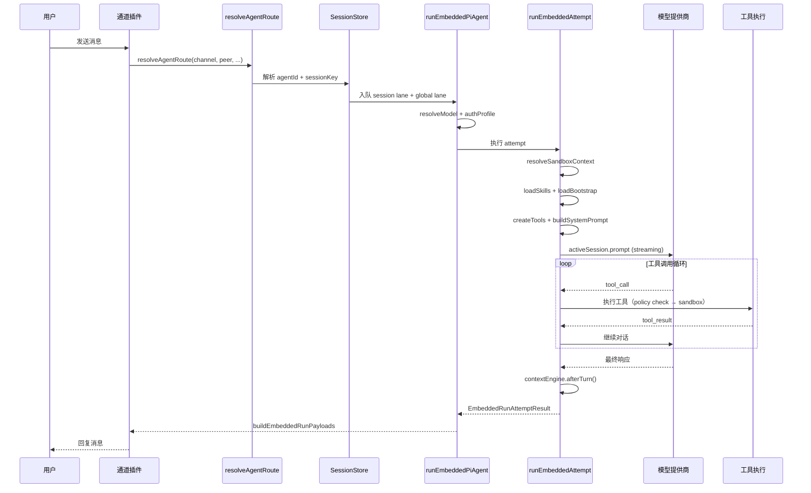

---

## Bootstrap 上下文注入

### Workspace 文件加载

入口：`src/agents/workspace.ts` → `loadWorkspaceBootstrapFiles(dir)`

**加载顺序**（固定，决定注入到 system prompt 的顺序）：

| 顺序 | 文件 | 用途 |
|------|------|------|
| 1 | `AGENTS.md` | Agent 身份和行为指令 |
| 2 | `SOUL.md` | 人格和对话风格 |
| 3 | `TOOLS.md` | 工具使用指导 |
| 4 | `IDENTITY.md` | 身份信息（名字、角色） |
| 5 | `USER.md` | 用户偏好和个性化 |
| 6 | `HEARTBEAT.md` | 心跳消息模板 |
| 7 | `BOOTSTRAP.md` | 通用启动上下文 |
| 8 | `MEMORY.md` / `memory.md` | 长期记忆 |

**安全限制**：
- `readWorkspaceFileWithGuards()`：单文件最大 **2MB**
- 缓存策略：基于 `dev:ino:size:mtime` 的 stat 缓存（避免重复读取未变化的文件）
- 边界安全读取：防止路径穿越

### 会话类型过滤

`filterBootstrapFilesForSession()` 根据会话类型裁剪 Bootstrap 文件：

| 会话类型 | 加载的文件 |
|----------|-----------|
| 主会话 | 全部 8 个文件 |
| Subagent / Cron | `MINIMAL_BOOTSTRAP_ALLOWLIST`：AGENTS.md, TOOLS.md, SOUL.md, IDENTITY.md, USER.md |

设计意图：subagent 和 cron 不需要 HEARTBEAT、BOOTSTRAP、MEMORY 等长期上下文，节省 token。

### Bootstrap Hook

`src/agents/bootstrap-hooks.ts` → `applyBootstrapHookOverrides()`：

1. 构建 `AgentBootstrapHookContext`（workspaceDir, bootstrapFiles, cfg, sessionKey, agentId）
2. 触发 `agent:bootstrap` hook
3. Hook 可以修改 `context.bootstrapFiles`（添加、移除、修改）
4. 返回修改后的 bootstrapFiles

内置 hook `bootstrap-extra-files`：通过 glob pattern 加载额外的 Bootstrap 文件。

### Bootstrap 预算分析

`resolveBootstrapContextForRun()` + `analyzeBootstrapBudget()`：

在注入前分析 Bootstrap 内容的 token 占用，如果总量超过上下文窗口的合理比例，会发出 `bootstrapPromptWarningSignature` 警告（每 session 仅警告一次）。

### Post-Compaction 重注入

`auto-reply/reply/post-compaction-context.ts`：

Compaction 后会从 `AGENTS.md` 提取关键 section 重新注入到上下文中，确保 Agent 身份和核心指令不因压缩丢失。

---

## Skills 渐进式加载

OpenClaw Skills 采用三层渐进式披露（Progressive Disclosure），在保证功能完整性的同时最小化 token 消耗。

### 三层加载模型

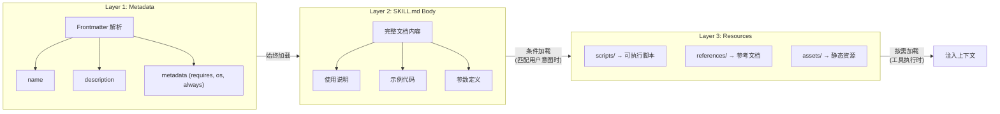

### Skills 加载管线（attempt.ts 中）

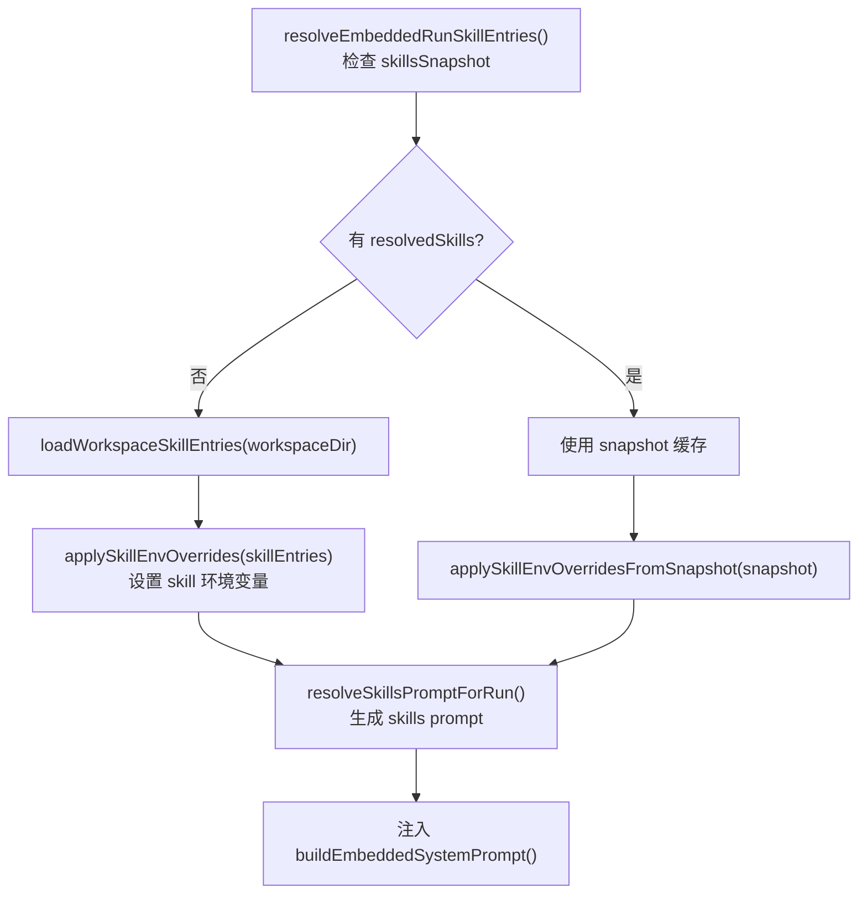

### Skills 来源优先级

| 优先级 | 来源 | 路径 |
|--------|------|------|
| 1（最低） | Bundled | 内置 skills 目录 |
| 2 | Plugin | 插件提供的 skills |
| 3 | Managed | `$CONFIG_DIR/skills/` |
| 4（最高） | Workspace | `$WORKSPACE/.openclaw/skills/` |

同名 skill 高优先级来源覆盖低优先级。

### Skill 过滤条件

`shouldIncludeSkill()` 决定一个 skill 是否参与 prompt：

1. `enabled === false` → 排除
2. bundled allowlist 检查 → 不在白名单则排除
3. `metadata.os` → 当前平台不匹配则排除
4. `metadata.always === true` → 强制包含
5. `requires.bins` → 缺少必要二进制则排除
6. `requires.env` → 缺少环境变量则排除

---

## 工具执行引擎

### 工具创建三层分离

`attempt.ts` 中的工具创建经过三层处理：

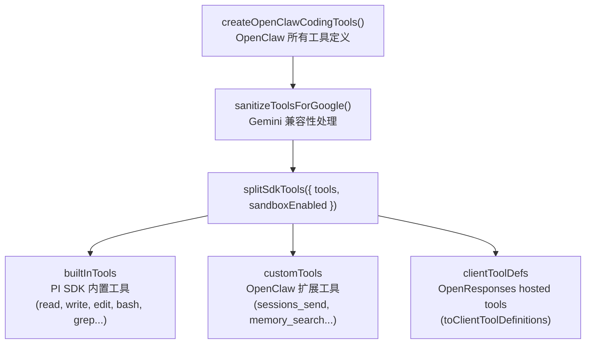

### 工具策略引擎

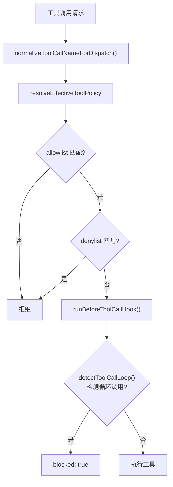

### 工具组

配置中可以使用工具组简化 policy 定义：

| 组名 | 包含工具 |
|------|----------|
| `group:fs` | read, write, edit, apply_patch |
| `group:runtime` | exec, process |
| `group:memory` | memory_search, memory_get |
| `group:web` | web_search, web_fetch |
| `group:sessions` | sessions_list, sessions_history, sessions_send, sessions_spawn |
| `group:messaging` | message |
| `group:automation` | cron, gateway |
| `group:nodes` | nodes |

### Bash 工具安全

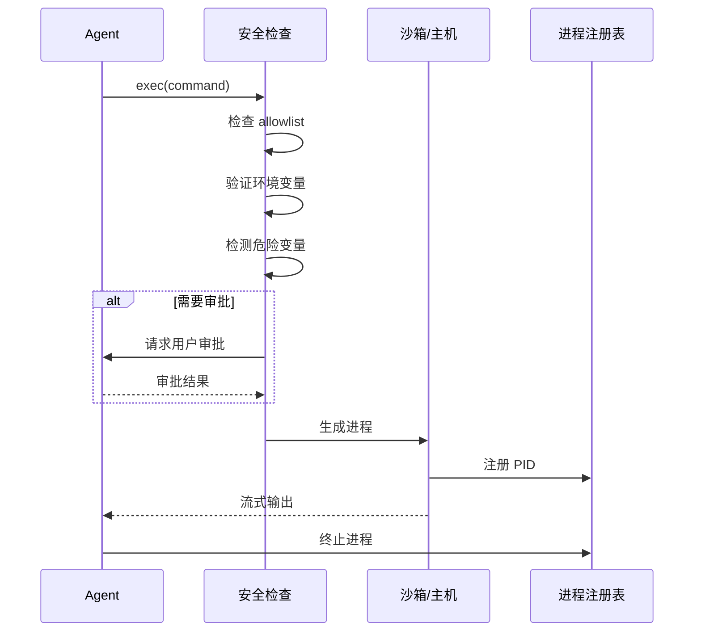

**危险环境变量阻止**：

```
LD_PRELOAD, LD_LIBRARY_PATH, LD_AUDIT,
DYLD_INSERT_LIBRARIES, DYLD_LIBRARY_PATH,
NODE_OPTIONS, NODE_PATH,
PYTHONPATH, PYTHONHOME,
RUBYLIB, PERL5LIB,
BASH_ENV, ENV, GCONV_PATH, IFS, SSLKEYLOGFILE
```

---

## 会话管理

### 会话类型

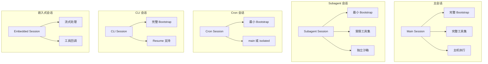

### Session Manager 初始化

`attempt.ts` 中的会话初始化：

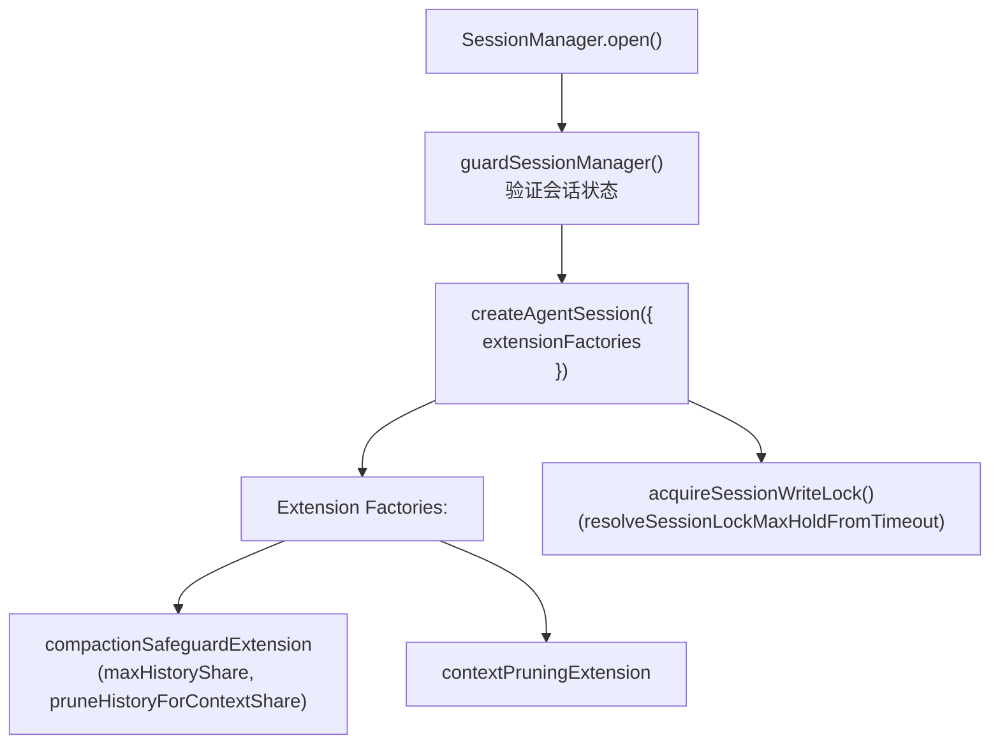

`extensionFactories` 是 Agent 运行时的扩展点，在 `createAgentSession` 时注入，影响 session 的 compaction 和 context 管理行为。

---

## 上下文窗口管理

### 多层防御架构

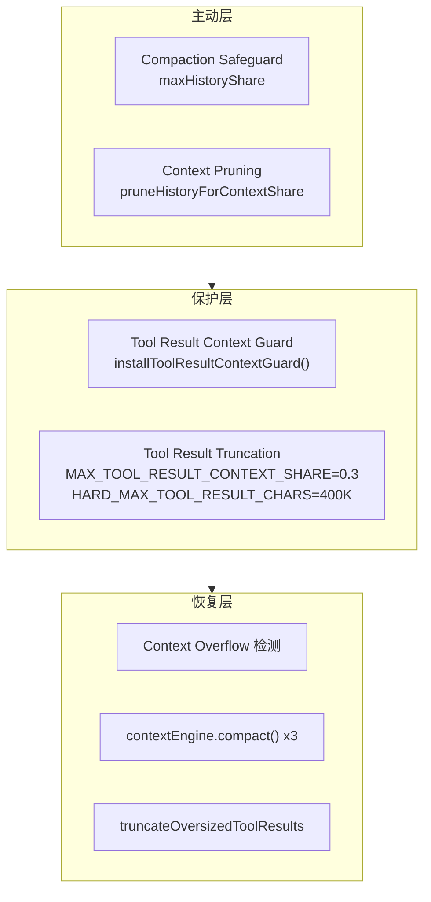

### ContextEngine 接口

`src/agents/context-engine/types.ts` 定义了上下文引擎的抽象接口：

| 方法 | 说明 |
|------|------|
| `bootstrap()` | 初始化上下文 |
| `ingest(data)` | 注入新数据 |
| `ingestBatch(items)` | 批量注入 |
| `assemble()` | 组装最终上下文 |
| `compact()` | 压缩上下文 |
| `afterTurn()` | turn 后处理 |
| `dispose()` | 资源清理 |

**当前实现**：`LegacyContextEngine`（ingest 为 no-op，compact 委托给 `compactEmbeddedPiSessionDirect`）。

解析方式：`resolveContextEngine(config)` 从 registry 获取，`ensureContextEnginesInitialized()` 确保初始化。

### Compaction Safeguard

`extensions.ts` → `compactionSafeguardExtension`：

当 compaction mode 为 `"safeguard"` 时启用，在 session 的 extension 层面主动管理上下文：

- **`maxHistoryShare`**：限制历史对话占总上下文的比例
- **`pruneHistoryForContextShare()`**：当历史超出比例时主动裁剪旧 turn
- **Quality guard**：确保裁剪不会损害对话质量

---

## 安全沙箱

### 沙箱决策

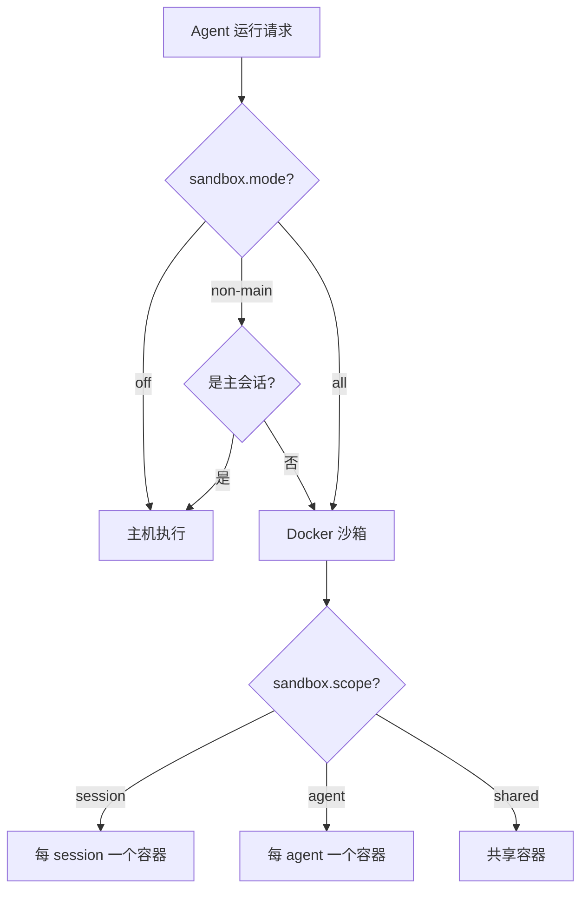

### Browser 沙箱

独立的浏览器容器通过 CDP (Chrome DevTools Protocol) + VNC 集成：
- 通过 `sandbox.browser.enabled` 启用
- 独立镜像和网络配置
- CDP port 映射用于浏览器控制
- VNC 用于可视化调试

### Sandbox Tool Policy

`sandbox-tool-policy.ts` → `pickSandboxToolPolicy()`：

根据沙箱模式决定工具的可用性和执行方式。沙箱内的工具执行通过 `fs-bridge.ts` 在 host 端进行文件操作桥接。

---

## 并发控制

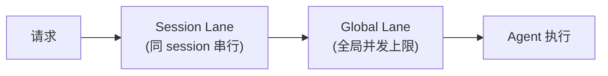

三层并发控制：

| 层级 | 粒度 | 作用 |
|------|------|------|
| Global | 全进程 | 限制同时向 LLM API 发送的请求数 |
| Session | 每 session | 保证同一 session 的请求串行执行 |
| Agent | 每 agent | 限制单 agent 的并发运行数（可配置） |

**Queue 模式**影响 session 内消息的处理方式：

| 模式 | 行为 |
|------|------|
| `steer` | 新消息追加到当前运行 |
| `followup` | 等待当前运行完成后自动续接 |
| `collect` | 收集所有消息后一次性处理 |
| `interrupt` | 中断当前运行，开始新运行 |
| `queue` | 严格队列，按顺序处理 |

---

## 流式事件处理

### 事件订阅

`subscribeEmbeddedPiSession()` → `createEmbeddedPiSessionEventHandler()` 处理以下事件：

| 事件 | 处理器 | 说明 |
|------|--------|------|
| `message_start` | `handlers.messages.ts` | 初始化消息状态 |
| `tool_execution_start` | `handlers.tools.ts` | 工具开始，推断元数据 |
| `tool_execution_update` | `handlers.tools.ts` | 工具执行中间结果 |
| `tool_execution_end` | `handlers.tools.ts` | 工具完成，规范化结果 |
| `message_end` | `handlers.messages.ts` | 消息结束处理 |
| `agent_start` / `agent_end` | lifecycle | Agent 生命周期管理 |
| `auto_compaction_*` | lifecycle | 自动压缩触发 |

### 状态跟踪

运行时跟踪的核心状态：

| 状态 | 说明 |
|------|------|
| `assistantTexts` | 助手文本数组（支持多段回复） |
| `toolMetas` | 工具元数据映射（tool_call_id → 元数据） |
| `blockBuffer` | 块缓冲区（用于流式输出的分块） |
| `isStreaming` | 是否正在流式输出 |
| `isCompacting` | 是否正在压缩 |

---

## 关键源码文件索引

| 文件 | 职责 |
|------|------|
| `src/agents/pi-embedded-runner/run.ts` | 外层运行循环、重试、failover |
| `src/agents/pi-embedded-runner/run/attempt.ts` | 单次尝试、sandbox、skills、prompt、LLM 调用 |
| `src/agents/pi-embedded-runner/compact.ts` | 会话压缩（direct/queued） |
| `src/agents/pi-embedded-runner/runs.ts` | 活跃运行状态管理 |
| `src/agents/pi-embedded-runner/run/payloads.ts` | 回复载荷构建 |
| `src/agents/pi-embedded-runner/extensions.ts` | Extension factories |
| `src/agents/pi-embedded-runner/tool-result-context-guard.ts` | 工具结果上下文保护 |
| `src/agents/pi-embedded-runner/tool-result-truncation.ts` | 工具结果截断 |
| `src/agents/pi-embedded-runner/system-prompt.ts` | System prompt 构建 |
| `src/agents/pi-embedded-runner/skills-runtime.ts` | Skills 加载和快照 |
| `src/agents/workspace.ts` | Workspace Bootstrap 文件加载 |
| `src/agents/bootstrap-hooks.ts` | Bootstrap hook 系统 |
| `src/agents/sandbox/` | 沙箱相关（config, docker, context, fs-bridge） |
| `src/agents/skills/` | Skills 系统（frontmatter, config, workspace） |
| `src/agents/context-engine/` | ContextEngine 接口和实现 |
| `src/agents/pi-embedded-subscribe/` | 流式事件订阅和处理 |

---

*基于 OpenClaw v2026.2.3-1 源码 `src/agents/` 分析*
