# OpenClaw Agent 运行时架构分析

## 概述

OpenClaw 是一个多通道 AI Agent 运行时系统，采用模块化架构设计，支持多种模型提供商、会话类型和工具执行环境。本文档深入分析 Agent 运行时的核心架构、消息处理流程、工具调用机制和 Skills 系统。

## 核心架构

### 系统层次结构

```
┌─────────────────────────────────────────────────────────────┐
│                    通道层 (Channels)                        │
│    Discord / Slack / Telegram / QQ / Web / etc.             │
└─────────────────────────────────────────────────────────────┘
                           │
                           ▼
┌─────────────────────────────────────────────────────────────┐
│                   消息路由层 (Routing)                       │
│              会话管理 / 消息分发 / 上下文路由                 │
└─────────────────────────────────────────────────────────────┘
                           │
                           ▼
┌─────────────────────────────────────────────────────────────┐
│                   Agent 运行时核心                          │
│  ┌─────────────┐  ┌─────────────┐  ┌─────────────────────┐  │
│  │ CLI Runner  │  │ Embedded PI │  │ Subagent Registry   │  │
│  └─────────────┘  └─────────────┘  └─────────────────────┘  │
│  ┌─────────────┐  ┌─────────────┐  ┌─────────────────────┐  │
│  │  Skills     │  │ Tool Policy │  │ Session Management │  │
│  └─────────────┘  └─────────────┘  └─────────────────────┘  │
└─────────────────────────────────────────────────────────────┘
                           │
                           ▼
┌─────────────────────────────────────────────────────────────┐
│                   工具执行引擎                               │
│  ┌─────────────┐  ┌─────────────┐  ┌─────────────────────┐  │
│  │ Bash/Exec   │  │  Sandbox    │  │ Tool Policy Engine  │  │
│  └─────────────┘  └─────────────┘  └─────────────────────┘  │
└─────────────────────────────────────────────────────────────┘
                           │
                           ▼
┌─────────────────────────────────────────────────────────────┐
│                   模型提供商层                              │
│  Claude / OpenAI / MiniMax / Bedrock / Venice / etc.       │
└─────────────────────────────────────────────────────────────┘
```

## Agent 生命周期状态机

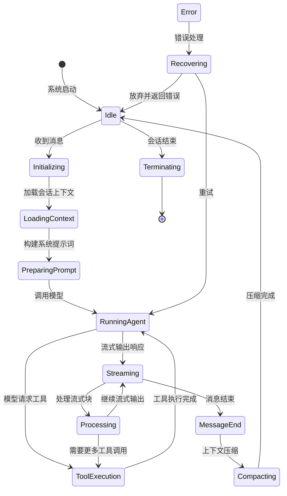

## 消息处理流程

### 完整消息流

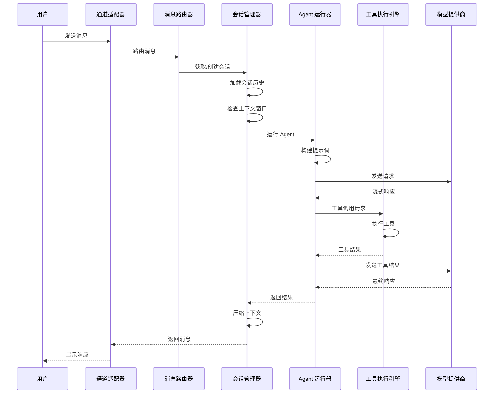

### 消息订阅处理流程

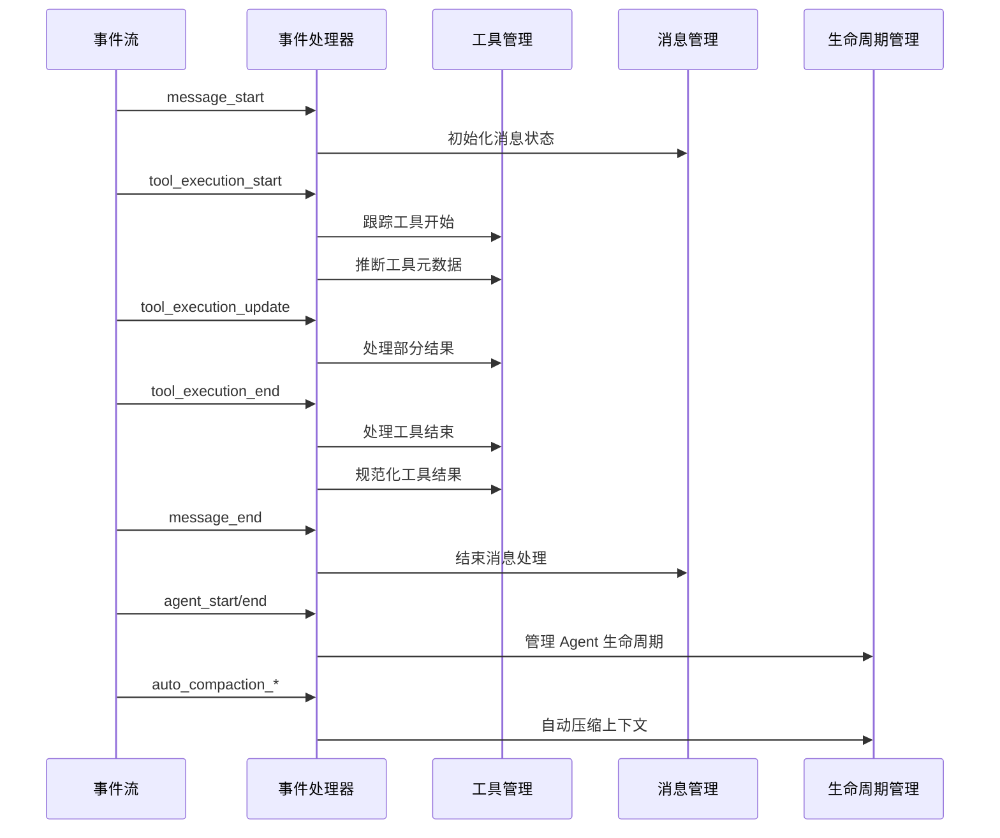

## 工具调用机制

### 工具执行引擎架构

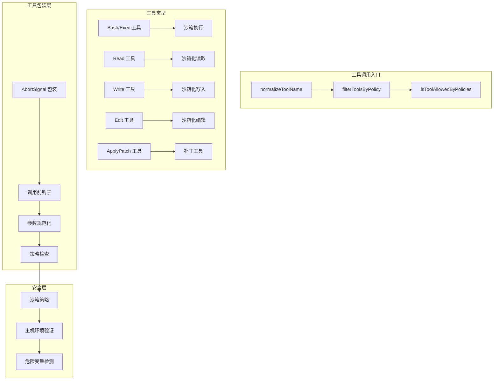

### Bash 工具执行流程

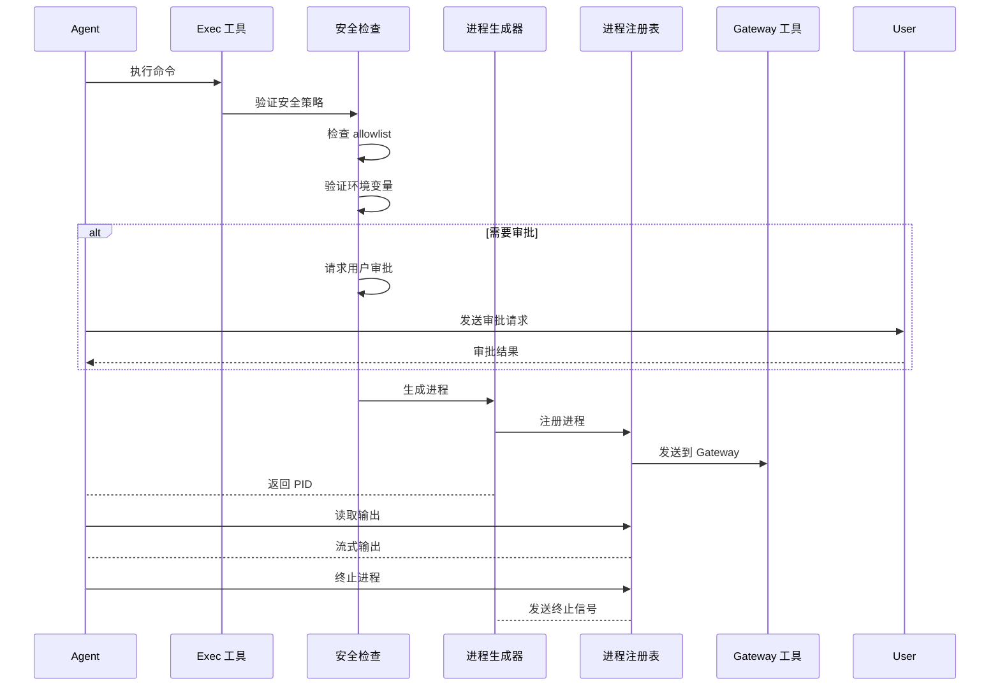

### 工具策略引擎

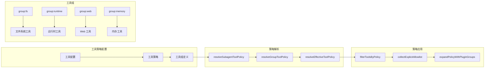

## Skills 渐进式披露机制

OpenClaw 的 Skills 系统采用**渐进式披露（Progressive Disclosure）**设计，通过分层加载策略优化上下文使用，在保证功能完整性的同时最小化 token 消耗。

### 1. 三层加载系统

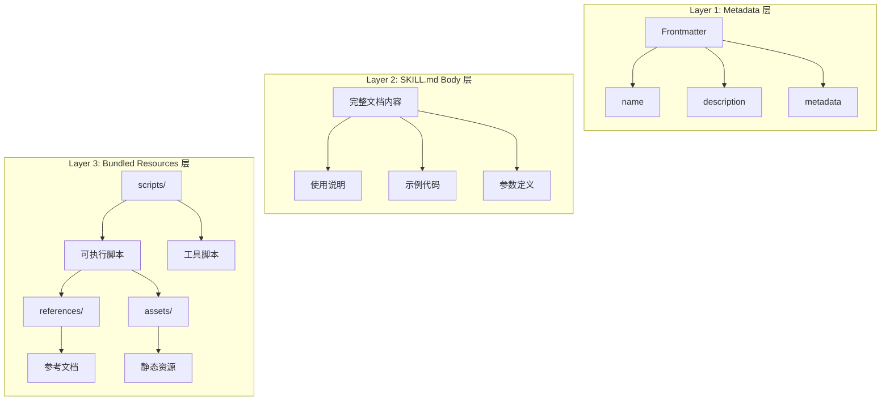

#### 1.1 Metadata 层（总是加载）

**加载时机**：Agent 启动时立即加载所有已安装 Skills 的 frontmatter

**Frontmatter 解析流程**：
```typescript
// src/agents/skills/frontmatter.ts
export function parseFrontmatter(content: string): ParsedSkillFrontmatter {
  return parseFrontmatterBlock(content);
}

export function resolveOpenClawMetadata(
  frontmatter: ParsedSkillFrontmatter,
): OpenClawSkillMetadata | undefined {
  // 解析 metadata JSON5 块
  // 提取 requires、install、os 等配置
}

export function resolveSkillInvocationPolicy(
  frontmatter: ParsedSkillFrontmatter,
): SkillInvocationPolicy {
  return {
    userInvocable: parseFrontmatterBool(getFrontmatterValue(frontmatter, "user-invocable"), true),
    disableModelInvocation: parseFrontmatterBool(
      getFrontmatterValue(frontmatter, "disable-model-invocation"),
      false,
    ),
  };
}
```

**触发条件**：
- `always: true` → 总是包含在 prompt 中
- 依赖检查通过 → `requires.bins`、`requires.env`、`requires.config`
- 操作系统匹配 → `metadata.os`
- 远程平台支持 → `eligibility.remote.platforms`

**匹配逻辑**：
```typescript
// src/agents/skills/config.ts
export function shouldIncludeSkill(params: {
  entry: SkillEntry;
  config?: OpenClawConfig;
  eligibility?: SkillEligibilityContext;
}): boolean {
  const { entry, config, eligibility } = params;
  
  // 1. 配置启用检查
  if (skillConfig?.enabled === false) {
    return false;
  }
  
  // 2. Bundled allowlist 检查
  if (!isBundledSkillAllowed(entry, allowBundled)) {
    return false;
  }
  
  // 3. 操作系统匹配
  if (osList.length > 0 && !osList.includes(resolveRuntimePlatform())) {
    return false;
  }
  
  // 4. always: true 强制包含
  if (entry.metadata?.always === true) {
    return true;
  }
  
  // 5. 依赖检查
  const requiredBins = entry.metadata?.requires?.bins ?? [];
  for (const bin of requiredBins) {
    if (!hasBinary(bin) && !eligibility?.remote?.hasBin?.(bin)) {
      return false;
    }
  }
  
  return true;
}
```

#### 1.2 SKILL.md Body 层（条件加载）

**加载时机**：当某个 Skill 被模型识别为可能需要使用时

**Prompt 构建流程**：
```typescript
// src/agents/skills/workspace.ts
export function buildWorkspaceSkillsPrompt(
  workspaceDir: string,
  opts?: {
    config?: OpenClawConfig;
    managedSkillsDir?: string;
    bundledSkillsDir?: string;
    entries?: SkillEntry[];
    skillFilter?: string[];
    eligibility?: SkillEligibilityContext;
  },
): string {
  const skillEntries = opts?.entries ?? loadSkillEntries(workspaceDir, opts);
  
  // 过滤适用的 Skills
  const eligible = filterSkillEntries(
    skillEntries,
    opts?.config,
    opts?.skillFilter,
    opts?.eligibility,
  );
  
  // 排除 disableModelInvocation 的 Skills
  const promptEntries = eligible.filter(
    (entry) => entry.invocation?.disableModelInvocation !== true,
  );
  
  // 生成提示词
  return formatSkillsForPrompt(promptEntries.map((entry) => entry.skill));
}
```

**条件加载触发条件**：
- Skill name 出现在用户 query 中
- Skill description 与用户意图语义匹配
- Skill 已被显式命令调用（如 `/skill-name`）

**上下文管理策略**：
```typescript
// 使用 formatSkillsForPrompt 生成精简的 skill 列表
// 只包含 name 和 description，不包含完整 SKILL.md 内容
```

#### 1.3 Bundled Resources 层（按需加载）

**资源类型**：
- `scripts/` → 可执行脚本和工具脚本
- `references/` → 参考文档和技术资料
- `assets/` → 静态资源文件

**执行时的动态加载**：
```typescript
// scripts/ 加载示例
// 脚本在工具执行时由工具定义动态加载
// 不是预先加载到上下文，而是在需要时直接执行

// references/ 引用
// 当工具执行需要特定文档时，按需读取
// 例如：外部 API 文档、配置文件模板等
```

### 2. 触发与匹配机制

#### 2.1 技能匹配算法

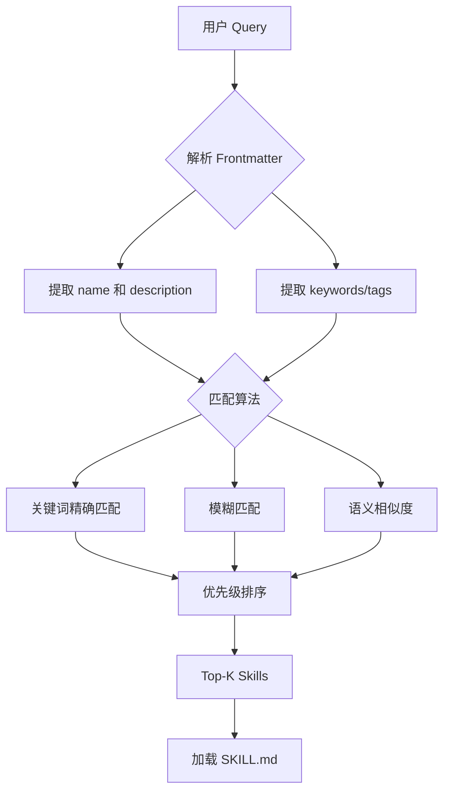

**匹配策略**：
1. **关键词匹配**：Skill name、description 中的关键词
2. **命令匹配**：`/skill-name` 格式的显式调用
3. **语义匹配**：基于 embedding 的相似度计算

#### 2.2 条件加载决策树

```mermaid
flowchart TD
    A[用户消息] --> B{解析消息}
    
    B --> C[/命令开头?]
    C -->|是| D[加载对应 Skill]
    D --> E[执行 Skill]
    
    C -->|否| F[提取关键词]
    F --> G[匹配 Skills 列表]
    
    G --> H[计算相关度]
    H --> I[Top 3-5 Skills]
    
    I --> J{有明确匹配?}
    J -->|是| K[加载完整 SKILL.md]
    J -->|否| L[仅使用 Metadata]
    
    K --> M[添加到上下文]
    L --> M
    
    M --> N[构建 Prompt]
    N --> O[发送给模型]
```

#### 2.3 多技能优先级排序

```typescript
// 优先级规则
const SKILL_PRIORITY = [
  // 1. 显式命令调用（最高优先级）
  { type: "explicit_command", score: 100 },
  
  // 2. 精确关键词匹配
  { type: "exact_match", score: 80 },
  
  // 3. 前缀匹配
  { type: "prefix_match", score: 60 },
  
  // 4. 模糊匹配
  { type: "fuzzy_match", score: 40 },
  
  // 5. 语义相似度
  { type: "semantic_similarity", score: 20 },
];
```

### 3. 上下文优化策略

#### 3.1 上下文膨胀控制

**文件大小阈值**：
```typescript
// 限制单个 SKILL.md 加载大小
const MAX_SKILL_CONTENT_SIZE = 50 * 1024; // 50KB

// 超过阈值的 Skill 摘要处理
function summarizeSkillContent(content: string): string {
  if (content.length > MAX_SKILL_CONTENT_SIZE) {
    return extractSummary(content);
  }
  return content;
}
```

**加载顺序优化**：
```typescript
// 优先级加载策略
const LOAD_ORDER = [
  "bundled/",    // 内置 Skills（最先加载）
  "managed/",    // 管理 Skills
  "workspace/",  // 工作区 Skills（最后加载，优先级最高）
];
```

**缓存机制**：
```typescript
// Skill Snapshot 缓存
export function buildWorkspaceSkillSnapshot(
  workspaceDir: string,
  opts?: {
    snapshotVersion?: number;
  },
): SkillSnapshot {
  // 缓存构建结果
  // 版本变化时重新构建
}
```

#### 3.2 渐进式披露流程图

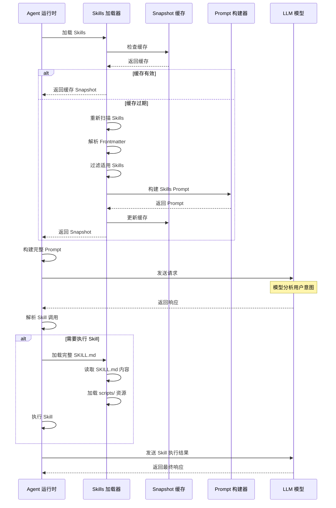

### 4. 源码级实现分析

#### 4.1 关键源码文件

| 文件路径 | 职责 |
|---------|------|
| `src/agents/skills/frontmatter.ts` | 解析 frontmatter，提取元数据 |
| `src/agents/skills/bundled-context.ts` | 构建 Skills 上下文 |
| `src/agents/skills/bundled-dir.ts` | 解析 bundled skills 目录 |
| `src/agents/skills/config.ts` | Skills 配置过滤和资格检查 |
| `src/agents/skills/workspace.ts` | 加载、过滤、构建 prompt |
| `src/agents/skills/refresh.ts` | Skills 监控和缓存刷新 |
| `src/agents/skills/types.ts` | TypeScript 类型定义 |
| `src/agents/skills/serialize.ts` | 序列化队列管理 |

#### 4.2 核心数据结构

```typescript
// src/agents/skills/types.ts

// 解析后的 Frontmatter
export type ParsedSkillFrontmatter = Record<string, string>;

// OpenClaw 特定元数据
export type OpenClawSkillMetadata = {
  always?: boolean;           // 总是包含
  skillKey?: string;           // 技能唯一键
  primaryEnv?: string;         // 主要环境变量
  emoji?: string;             // 图标
  homepage?: string;          // 主页
  os?: string[];              // 支持的操作系统
  requires?: {
    bins?: string[];          // 必需的二进制文件
    anyBins?: string[];        // 任一满足的二进制文件
    env?: string[];           // 环境变量
    config?: string[];         // 配置项
  };
  install?: SkillInstallSpec[]; // 安装规范
};

// 调用策略
export type SkillInvocationPolicy = {
  userInvocable: boolean;      // 是否可用户调用
  disableModelInvocation: boolean; // 是否禁用模型调用
};

// Skill 条目（完整信息）
export type SkillEntry = {
  skill: Skill;                // 原始 Skill 对象
  frontmatter: ParsedSkillFrontmatter;
  metadata?: OpenClawSkillMetadata;
  invocation?: SkillInvocationPolicy;
};

// Skill Snapshot（缓存格式）
export type SkillSnapshot = {
  prompt: string;              // 生成的 prompt
  skills: Array<{ name: string; primaryEnv?: string }>;
  resolvedSkills?: Skill[];
  version?: number;
};
```

### 5. 设计优势与限制

#### 5.1 优势

| 优势 | 说明 |
|------|------|
| **Token 节省** | 只加载必要的 Metadata，避免所有 SKILL.md 膨胀上下文 |
| **响应速度提升** | 启动时只解析 frontmatter，无需读取所有文档内容 |
| **灵活性** | 支持条件加载（always、requires、os 等） |
| **可扩展性** | 多来源加载（Bundled、Managed、Workspace、Plugin、Extra） |
| **缓存友好** | Snapshot 机制避免重复构建 |

#### 5.2 限制与注意事项

| 限制 | 注意事项 |
|------|----------|
| **冷启动延迟** | 首次匹配 Skill 时需要加载完整文档，有额外延迟 |
| **缓存失效** | 文件变化需要手动刷新或自动监控触发 |
| **匹配精度** | 依赖 keyword 和 description 的质量 |
| **大文件处理** | 超过阈值的 SKILL.md 需要额外摘要处理 |
| **版本兼容性** | metadata 格式变更可能影响旧 Skills |

### 6. 最佳实践

#### 6.1 编写高效的 SKILL.md

```markdown
---
name: "高效技能"
description: "简短描述这个技能能做什么"
metadata:
  requires:
    bins: ["jq"]
    env: ["API_KEY"]
---

# 详细说明

## 使用场景
...

## 参数说明
...

## 示例
...
```

#### 6.2 配置建议

```yaml
skills:
  load:
    watch: true              # 启用文件监控
    watchDebounceMs: 250     # 防抖时间
    extraDirs:               # 额外目录
      - ~/custom-skills
  entries:
    my-skill:
      enabled: true
```

## 总结

OpenClaw 的 Skills 渐进式披露机制通过三层设计实现了高效的上下文管理：

1. **Metadata 层**提供快速的 Skill 发现和筛选
2. **Body 层**实现按需的内容加载
3. **Resources 层**支持动态的执行时加载

这种设计在保持 Skills 系统灵活性的同时，有效控制了上下文大小，提升了整体响应性能。
```

## 会话管理架构

### 会话类型

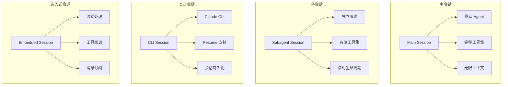

### 会话状态管理

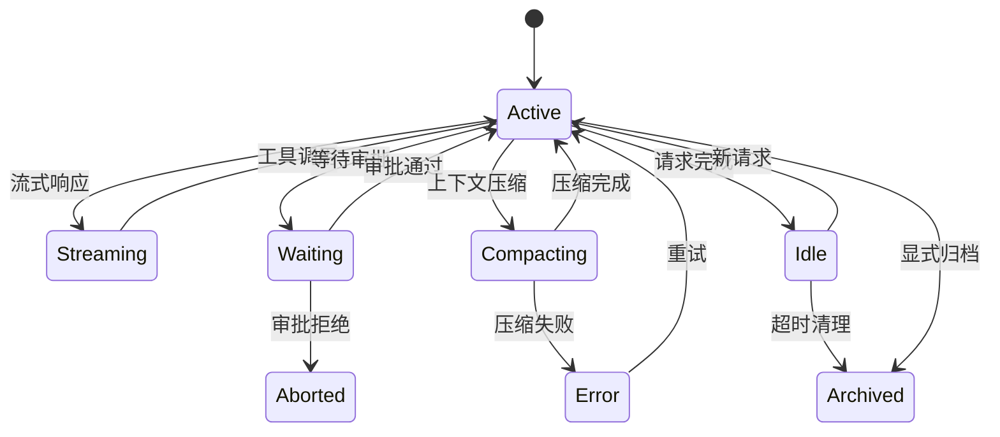

## 上下文窗口管理

### 上下文保护机制

```mermaid
graph TB
    subgraph "上下文监控"
        M1[CONTEXT_WINDOW_HARD_MIN] --> M2[硬性最小值]
        M1 --> M3[CONTEXT_WINDOW_WARN_BELOW]
        M1 --> M4[警告阈值]
    end
    
    subgraph "上下文评估"
        E1[evaluateContextWindowGuard] --> E2[检查当前使用量]
        E2 --> E3[计算剩余空间]
        E3 --> E4[确定行动]
    end
    
    subgraph "响应策略"
        E4 --> R1[正常继续]
        R1 --> Action1[继续处理]
        
        E4 --> R2[触发警告]
        R2 --> Action2[记录警告日志]
        
        E4 --> R3[拒绝新请求]
        R3 --> Action3[返回错误]
        
        E4 --> R4[触发压缩"
        R4 --> Action4[执行自动压缩]
    end
```

## 流式输出处理

### 流式响应架构

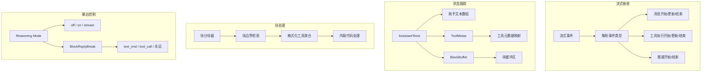

## 错误处理和恢复机制

### 故障转移策略

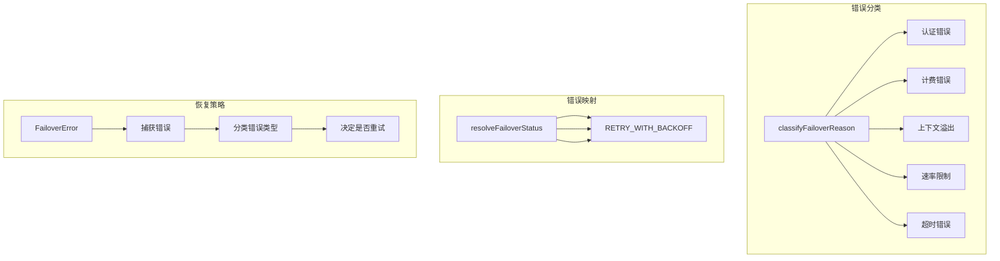

### 工具错误处理

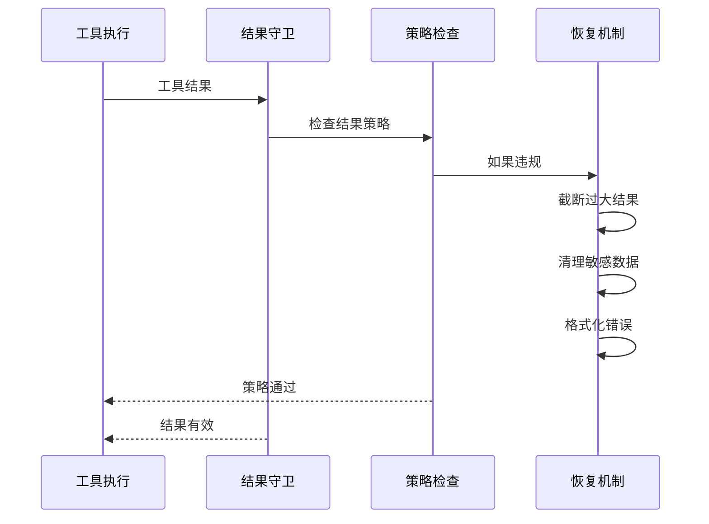

## 安全沙箱机制

### 沙箱架构

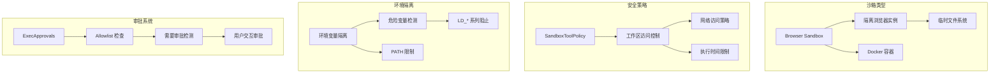

### 危险环境变量阻止列表

```typescript
const DANGEROUS_HOST_ENV_VARS = new Set([
  "LD_PRELOAD",
  "LD_LIBRARY_PATH",
  "LD_AUDIT",
  "DYLD_INSERT_LIBRARIES",
  "DYLD_LIBRARY_PATH",
  "NODE_OPTIONS",
  "NODE_PATH",
  "PYTHONPATH",
  "PYTHONHOME",
  "RUBYLIB",
  "PERL5LIB",
  "BASH_ENV",
  "ENV",
  "GCONV_PATH",
  "IFS",
  "SSLKEYLOGFILE",
]);
```

## 核心组件详解

### CLI Runner (`cli-runner.ts`)

**职责**：
- 协调 CLI 后端的 Agent 执行
- 管理会话 ID 和恢复机制
- 处理图像输入
- 构建系统提示词
- 执行 CLI 命令并解析输出

**关键流程**：
1. 解析输入参数和配置
2. 构建 CLI 参数和命令
3. 排队执行（支持序列化）
4. 解析输出（text/jsonl/json）
5. 处理错误和故障转移

### Embedded PI Runner (`pi-embedded-runner.ts`)

**职责**：
- 运行嵌入式 Agent 会话
- 管理流式响应
- 处理工具回调
- 协调上下文压缩

**关键组件**：
- `runEmbeddedAttempt`: 单次运行尝试
- `buildEmbeddedRunPayloads`: 构建运行负载
- `run.ts`: 主运行逻辑

### Subagent Registry (`subagent-registry.ts`)

**职责**：
- 管理子 Agent 生命周期
- 跟踪子 Agent 运行状态
- 处理清理和归档
- 恢复重启后的运行

**状态追踪**：
```typescript
type SubagentRunRecord = {
  runId: string;
  childSessionKey: string;
  requesterSessionKey: string;
  task: string;
  cleanup: "delete" | "keep";
  createdAt: number;
  startedAt?: number;
  endedAt?: number;
  outcome?: SubagentRunOutcome;
};
```

### Skills System (`skills/*.ts`)

**职责**：
- 发现和加载 Skills
- 过滤适用的 Skills
- 构建 Skills 提示词
- 管理 Skills 安装

**加载优先级**：
1. Bundled Skills（内置）
2. Managed Skills（管理）
3. Workspace Skills（工作区）
4. Plugin Skills（插件）
5. Extra Directory Skills（额外目录）

## 配置系统

### 工具配置

```typescript
type ExecToolDefaults = {
  host?: "sandbox" | "gateway" | "node";
  security?: "deny" | "allowlist" | "full";
  ask?: "off" | "on-miss" | "always";
  node?: string;
  pathPrepend?: string;
  safeBins?: string[];
  backgroundMs?: number;
  timeoutSec?: number;
  approvalRunningNoticeMs?: number;
};
```

### 工具组配置

```typescript
const TOOL_GROUPS: Record<string, string[]> = {
  "group:fs": ["read", "write", "edit", "apply_patch"],
  "group:runtime": ["exec", "process"],
  "group:memory": ["memory_search", "memory_get"],
  "group:web": ["web_search", "web_fetch"],
  "group:sessions": ["sessions_list", "sessions_history", ...],
  "group:messaging": ["message"],
  "group:automation": ["cron", "gateway"],
  "group:nodes": ["nodes"],
};
```

## 性能优化

### 并发控制

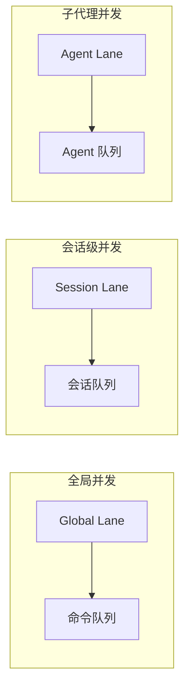

### 上下文压缩

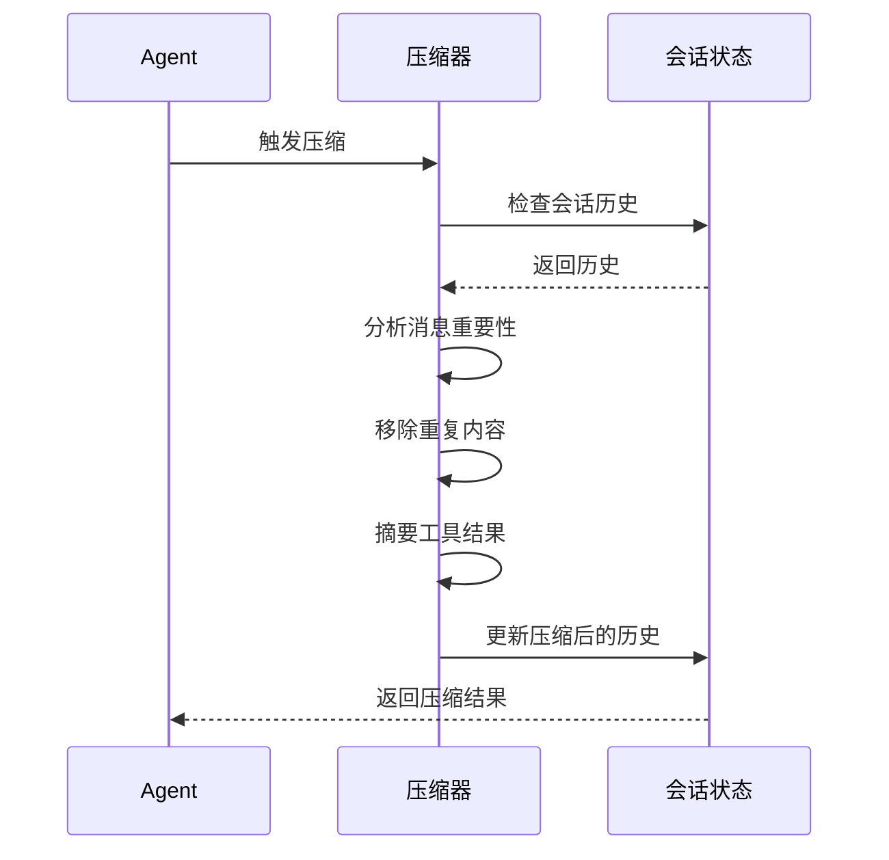

## 监控和日志

### 日志子系统

```typescript
const log = createSubsystemLogger("agent/claude-cli");
// 日志级别：info, warn, debug, error
```

### 事件追踪

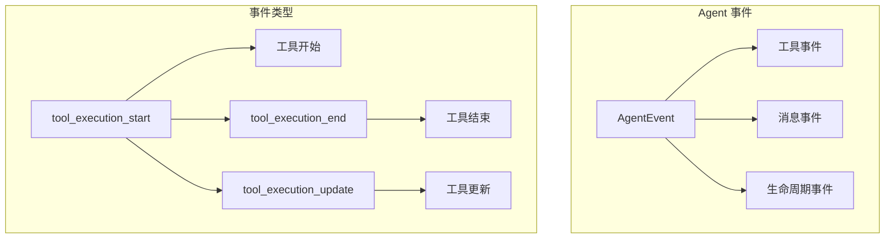

## 总结

### 核心架构特点

1. **模块化设计**：清晰的层次结构和职责分离
2. **多通道支持**：统一的 Agent 运行时支持多种通信通道
3. **灵活的会话管理**：主会话、子会话、CLI 会话、嵌入式会话
4. **强大的工具系统**：安全沙箱、策略引擎、审批流程
5. **Skills 生态系统**：可扩展的 Skills 加载和执行框架
6. **容错机制**：故障转移、错误恢复、上下文压缩
7. **安全性**：环境变量隔离、沙箱执行、策略控制

### 消息处理完整流程

1. **接收**：通道适配器接收用户消息
2. **路由**：消息路由器确定目标会话
3. **加载**：会话管理器加载上下文
4. **执行**：Agent 运行器调用模型
5. **工具**：工具执行引擎处理工具请求
6. **流式**：流式处理器管理输出
7. **压缩**：上下文压缩器优化历史
8. **响应**：结果返回给用户

### 工具调用执行机制

1. **规范化**：标准化工具名称
2. **策略检查**：应用工具策略
3. **安全验证**：检查沙箱策略
4. **执行**：调用具体工具
5. **结果处理**：规范化工具结果
6. **回调**：通知 Agent 结果

### Skills 加载和执行

1. **发现**：从多个来源加载 Skills
2. **过滤**：应用配置和资格过滤
3. **解析**：解析 Frontmatter 和元数据
4. **生成**：生成命令规范
5. **集成**：集成到提示词
6. **执行**：运行时执行 Skill 命令
