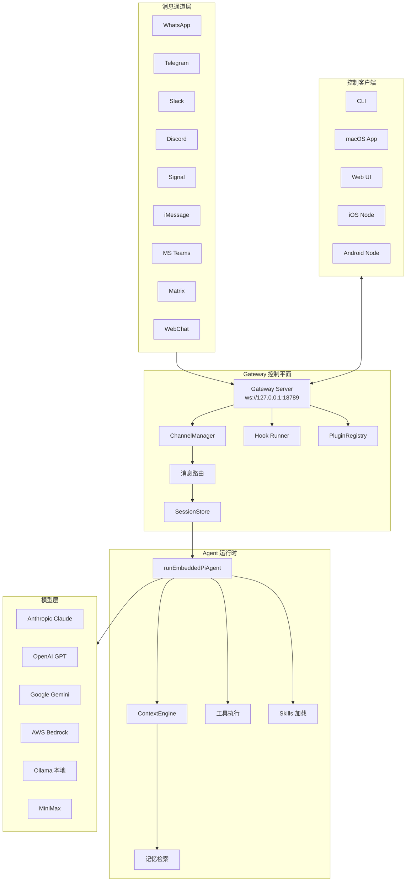
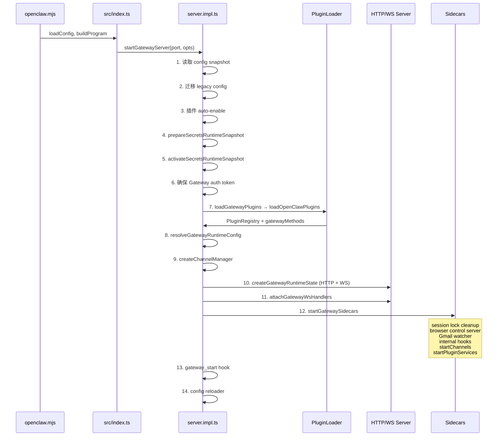
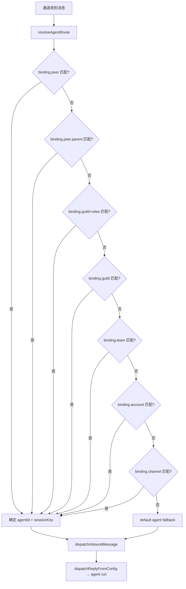
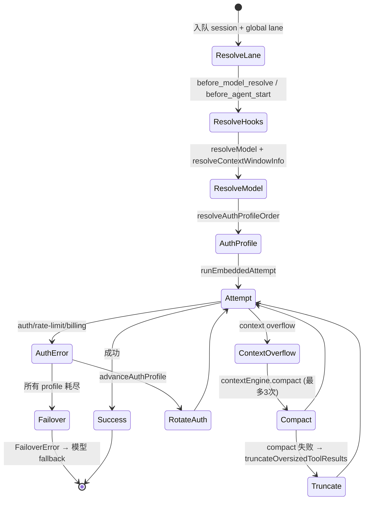
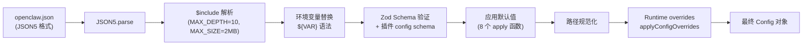
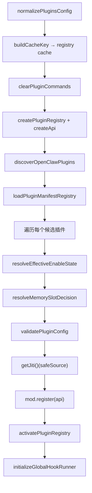
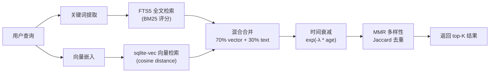
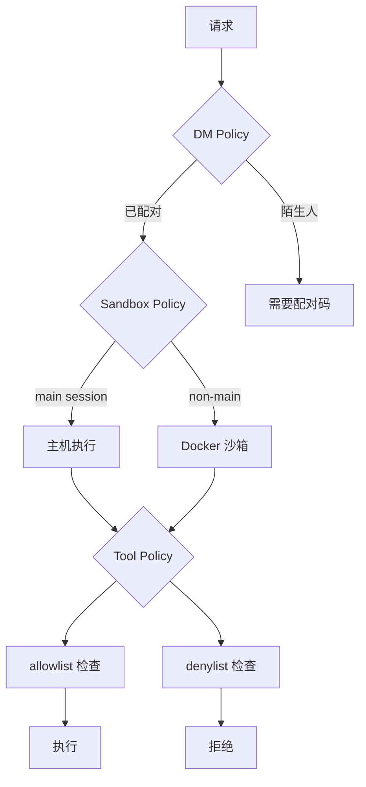
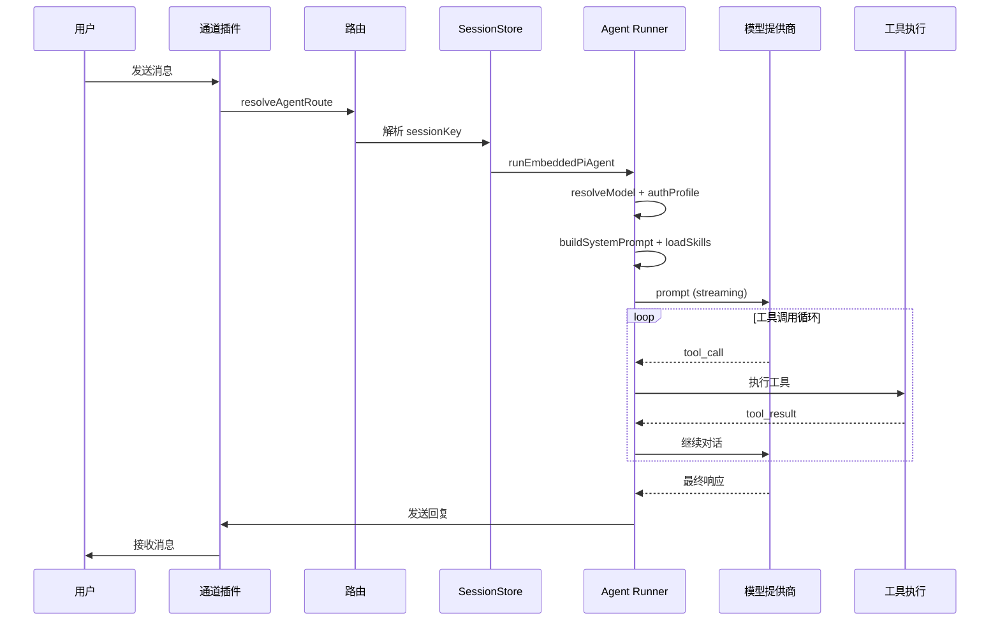
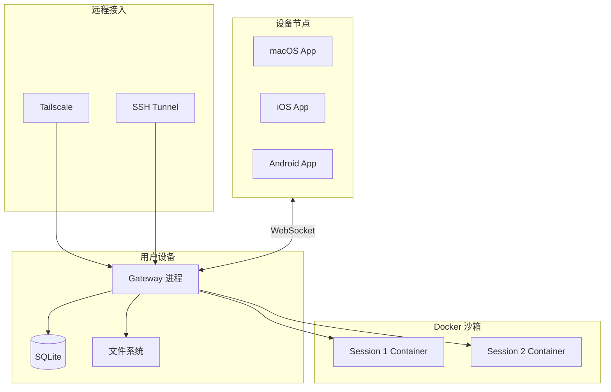

# OpenClaw 系统架构深度分析

## 目录
- [设计理念](#设计理念)
- [系统概述](#系统概述)
- [技术栈全景](#技术栈全景)
- [整体架构](#整体架构)
- [Gateway 控制平面](#gateway-控制平面)
- [消息路由与通道系统](#消息路由与通道系统)
- [Agent 运行时](#agent-运行时)
- [配置加载管线](#配置加载管线)
- [插件系统](#插件系统)
- [记忆系统](#记忆系统)
- [安全模型](#安全模型)
- [数据流全景](#数据流全景)
- [部署架构](#部署架构)

---

## 设计理念

OpenClaw 的架构遵循几个核心设计原则：

1. **本地优先 (Local-first)**: 所有数据（会话、记忆、配置）存储在用户本地设备，不依赖云端数据库。这决定了选用 SQLite + 文件系统而非远程数据库。
2. **单 Gateway 控制平面**: 一个 Gateway 进程统管所有通道、Agent、插件的生命周期。这简化了部署拓扑，但也意味着 Gateway 是系统的关键路径。
3. **插件化通道适配**: 每个消息通道（WhatsApp、Telegram 等）作为独立插件存在，通过统一的 `ChannelPlugin` 接口接入 Gateway，新通道只需实现适配器。
4. **渐进式上下文注入**: Agent 不一次加载所有上下文，而是按需注入 Bootstrap 文件、Skills、记忆，控制 token 消耗。
5. **安全默认**: 非主会话默认沙箱隔离，工具执行受策略控制，陌生人消息需配对验证。

---

## 系统概述

OpenClaw 是一个个人 AI 助手框架，在用户自有设备上运行。它通过单一 Gateway 控制平面管理 11+ 消息通道、AI Agent、工具执行和记忆检索。

**核心能力**：
- 多通道接入：WhatsApp、Telegram、Slack、Discord、Signal、iMessage、Google Chat、MS Teams、Matrix、Line、WebChat 等
- 多设备节点：macOS、iOS、Android 作为远端节点连接 Gateway
- 可扩展插件系统：40+ 扩展模块，支持通道、工具、Hook、Provider
- Skills 技能平台：自动发现、渐进式加载
- 混合 RAG 记忆：向量搜索 + 全文检索 + 时间衰减

---

## 技术栈全景

### 核心运行时

| 类别 | 技术 | 版本 | 用途 |
|------|------|------|------|
| 运行时 | Node.js | >= 22.12.0 | 主进程运行时 |
| 包管理 | pnpm | 10.23.0 | Monorepo workspace 管理 |
| 语言 | TypeScript | 5.9.3 | 核心语言 |
| 构建 | tsdown / rolldown | — | 打包编译 |
| HTTP 框架 | Hono | 4.11.8 | Gateway HTTP 服务 |
| WebSocket | ws | ^8.19.0 | Gateway 控制协议 |
| CLI 框架 | Commander | ^14.0.3 | 命令行入口 |

### 数据与配置

| 类别 | 技术 | 用途 |
|------|------|------|
| 配置格式 | JSON5 | 配置文件解析（支持注释、尾逗号） |
| 配置验证 | Zod ^4.3.6 + AJV ^8.17.1 | Schema 验证（Zod 用于配置，AJV 用于插件 config schema） |
| 类型系统 | @sinclair/typebox | JSON Schema 类型定义（工具参数、协议类型） |
| 数据库 | SQLite 3 + better-sqlite3 | 记忆索引存储 |
| 向量搜索 | sqlite-vec | SQLite 向量扩展（cosine distance） |
| 文件监控 | Chokidar | 记忆文件、配置文件变化监听 |
| 模块加载 | Jiti | 运行时动态加载 .ts/.js 插件 |
| 定时任务 | Croner | Cron 表达式解析和调度 |

### AI 与 Agent

| 类别 | 技术 | 用途 |
|------|------|------|
| Agent 核心 | @mariozechner/pi-agent-core | Agent 会话、工具调用、流式输出 |
| LLM API | @mariozechner/pi-ai | 统一 LLM 提供商接口（20+ provider） |
| 编码 Agent | @mariozechner/pi-coding-agent | 内置工具（read/write/edit/bash/grep） |
| TUI | @mariozechner/pi-tui | 终端 UI |

### 前端

| 类别 | 技术 | 用途 |
|------|------|------|
| Web UI | Lit ^3.3.2 + Vite 7.3.1 | Web Components 控制界面 |
| macOS | Swift + SwiftUI | 菜单栏应用 |
| iOS | Swift (原生) | 移动端节点 |
| Android | Kotlin + Jetpack Compose | 移动端节点 |

### 通道 SDK

| 通道 | SDK | 协议 |
|------|-----|------|
| WhatsApp | @whiskeysockets/baileys | WebSocket (Web API) |
| Telegram | grammY | Long Polling / Webhooks |
| Discord | discord.js | Gateway + REST |
| Slack | @slack/bolt | Socket Mode / Events API |
| Signal | — | 自定义适配器 |
| iMessage | — | BlueBubbles / 系统集成 |

---

## 整体架构



---

## Gateway 控制平面

Gateway 是 OpenClaw 的神经中枢。所有消息通道、控制客户端、Agent 运行都通过 Gateway 协调。

### 启动序列

源码入口：`src/gateway/server.impl.ts` → `startGatewayServer(port, opts)`



### WebSocket 协议

**连接握手**（`server/ws-connection.ts`）：

1. HTTP Upgrade → WebSocket 建立
2. 服务端发送 `connect.challenge`（含 nonce）
3. 客户端首消息必须是 `{ type: "req", method: "connect", params: ConnectParams }`
4. 校验：协议版本（`minProtocol` / `maxProtocol` vs `PROTOCOL_VERSION`）、角色解析（`parseGatewayRole`）、来源检查、认证
5. 成功返回 `hello-ok`：`{ snapshot, features, methods, events }`

**消息帧格式**：

| 方向 | 类型 | 格式 |
|------|------|------|
| 请求 | `req` | `{ type: "req", id, method, params }` |
| 响应 | `res` | `{ type: "res", id, ok, payload?, error? }` |
| 事件 | `event` | `{ type: "event", event, payload }` |

**安全限制**：
- `MAX_PREAUTH_PAYLOAD_BYTES`：握手前的最大消息体
- `MAX_PAYLOAD_BYTES`：握手后的最大消息体
- `MAX_BUFFERED_BYTES`：WebSocket 缓冲上限

### Gateway 运行时状态

`server-runtime-state.ts` → `createGatewayRuntimeState()` 管理：

| 状态 | 说明 |
|------|------|
| HTTP Server | Hono HTTP 服务实例 |
| WS Server | WebSocket 服务实例 |
| clients | 已连接的 `GatewayWsClient` 集合 |
| broadcast | 广播消息到所有客户端 |
| chat runs | 活跃的 Agent 运行状态 |

---

## 消息路由与通道系统

### 消息路由

消息从通道到 Agent 的完整路径（`src/routing/resolve-route.ts`）：



**Binding 优先级**（从高到低）：

1. `binding.peer` — 精确匹配 peer.kind + peer.id
2. `binding.peer.parent` — 匹配 thread 父级
3. `binding.guild+roles` — Discord guild + 角色匹配
4. `binding.guild` — Discord guild 匹配
5. `binding.team` — Slack team 匹配
6. `binding.account` — 账号级匹配
7. `binding.channel` — 通道级匹配
8. `default` — 全局 fallback agent

### Channel Registry

核心通道注册在 `src/channels/registry.ts`：

```typescript
// 核心通道顺序（影响 UI 展示和优先级）
CHAT_CHANNEL_ORDER: telegram, whatsapp, discord, irc, googlechat, slack, signal, imessage, line

// 通道别名映射
CHAT_CHANNEL_ALIASES: { imsg → imessage, gchat → googlechat }
```

### ChannelPlugin 接口

每个通道插件实现 `ChannelPlugin` 接口（`src/channels/plugins/types.plugin.ts`），包含 22 个可选适配器：

| 适配器 | 职责 |
|--------|------|
| `config` | 配置解析和账号解析 |
| `gateway` | Gateway 集成（startAccount / stopAccount） |
| `outbound` | 消息发送 |
| `security` | 安全策略（DM policy、allowlist） |
| `groups` | 群组管理 |
| `mentions` | @提及解析 |
| `setup` | 安装向导 |
| `pairing` | 设备配对 |
| `auth` | 认证管理 |
| `elevated` | 提权操作 |
| `commands` | 通道命令 |
| `streaming` | 流式消息 |
| `threading` | 线程/话题支持 |
| `messaging` | 消息操作（编辑、删除、反应） |
| `agentPrompt` | Agent 提示注入 |
| `directory` | 用户目录查询 |
| `resolver` | ID 解析 |
| `actions` | 消息动作 |
| `heartbeat` | 心跳检测 |
| `status` | 状态探针和审计 |
| `agentTools` | 通道专属 Agent 工具 |
| `gatewayMethods` | 自定义 WS 方法 |

### Channel 生命周期管理

`ChannelManager`（`src/gateway/server-channels.ts`）管理通道的启停：

- **启动**：`startChannels()` → 遍历 `listChannelPlugins()`，逐个 `startChannel(plugin.id)`
- **停止**：`stopChannel()` → abort + `plugin.gateway.stopAccount()`
- **自动重启策略**：
  - Backoff: 5s → 5min，factor 2，jitter 0.1
  - `MAX_RESTART_ATTEMPTS = 10`
  - 手动停止（`manuallyStopped`）不自动重启

---

## Agent 运行时

### 执行流程

Agent Loop 是 OpenClaw 的核心执行引擎，入口：`src/agents/pi-embedded-runner/run.ts` → `runEmbeddedPiAgent()`



### 单次 Attempt 内部

`run/attempt.ts` → `runEmbeddedAttempt()` 的内部步骤：

1. `resolveSandboxContext()` — 沙箱环境
2. `resolveEmbeddedRunSkillEntries()` → `applySkillEnvOverrides()` — Skills 加载和环境注入
3. `resolveBootstrapContextForRun()` + `analyzeBootstrapBudget()` — Bootstrap 上下文和 token 预算
4. `createOpenClawCodingTools()` → `splitSdkTools()` — 工具创建和分组
5. `SessionManager.open()` + `guardSessionManager()` — 会话管理
6. `buildEmbeddedSystemPrompt()` → `createSystemPromptOverride()` — System prompt 构建
7. `installToolResultContextGuard()` — 工具结果上下文保护
8. `subscribeEmbeddedPiSession()` — 流式事件订阅
9. `activeSession.prompt(effectivePrompt, { images })` — LLM 调用
10. `contextEngine.afterTurn()` — 后处理

---

## 配置加载管线

配置加载是一条精心设计的管线（`src/config/io.ts`）：



**Defaults 应用顺序**（`src/config/defaults.ts`）：
1. `applyMessageDefaults`
2. `applyLoggingDefaults`
3. `applySessionDefaults`
4. `applyAgentDefaults`
5. `applyContextPruningDefaults`
6. `applyCompactionDefaults`
7. `applyModelDefaults`
8. `applyTalkConfigNormalization` + `applyTalkApiKey`

**Config 路径优先级**：
1. `OPENCLAW_CONFIG_PATH` 环境变量
2. `$OPENCLAW_STATE_DIR/openclaw.json`
3. `~/.openclaw/openclaw.json`
4. Legacy: `clawdbot.json`, `moldbot.json`, `moltbot.json`

**Config 缓存**：`OPENCLAW_CONFIG_CACHE_MS`（默认 200ms），可通过 `OPENCLAW_DISABLE_CONFIG_CACHE` 禁用。

---

## 插件系统

### 加载管线



**插件发现安全检查**（`src/plugins/discovery.ts` → `isUnsafePluginCandidate()`）：
- 路径逃逸检测
- World-writable 目录检测
- 文件所有权验证

**插件来源优先级**：config > workspace > global > bundled (stock)

### Plugin services 生命周期

- **启动**：正序遍历 `registry.services`，调用 `service.start(serviceContext)`
- **停止**：反序遍历，调用 `service.stop()`

---

## 记忆系统

OpenClaw 使用混合 RAG（Retrieval-Augmented Generation）架构：



**存储结构**：
- 长期记忆：`workspace/MEMORY.md`
- 每日笔记：`workspace/memory/YYYY-MM-DD.md`
- 会话历史：`agents/{agentId}/sessions/*.jsonl`
- 向量索引：`~/.openclaw/memory/{agentId}.sqlite`

---

## 安全模型

### 多层安全策略



**沙箱模式**（`sandbox.mode`）：
| 模式 | 说明 |
|------|------|
| `off` | 所有会话直接在主机执行 |
| `non-main` | 仅非主会话使用 Docker 沙箱（默认） |
| `all` | 所有会话都使用 Docker 沙箱 |

**Docker 隔离**：
- `readOnlyRoot`: 只读根文件系统
- `capDrop: ["ALL"]`: 丢弃所有 Linux capabilities
- `network: "none"`: 默认无网络访问
- `tmpfs`: `/tmp`, `/var/tmp`, `/run` 临时文件系统

**安全审计**（`src/security/audit-extra.sync.ts`）：
- 危险 bind mount 检测
- 网络模式检查
- seccomp / AppArmor 策略验证
- Bind mount 安全验证（`validate-sandbox-security.ts`）

### 远程访问

| 方式 | 场景 |
|------|------|
| Tailscale Serve | 局域网/私网安全暴露 |
| Tailscale Funnel | 公网暴露（需 password auth） |
| SSH Tunnel | 手动隧道 |
| Token Auth | 所有连接必须认证 |

---

## 数据流全景

### 完整消息处理流



### Workspace 文件结构

```
~/.openclaw/                      # 状态目录（OPENCLAW_STATE_DIR）
├── openclaw.json                 # 主配置文件（JSON5）
├── agents/
│   └── {agentId}/
│       ├── sessions/
│       │   ├── sessions.json     # Session store
│       │   └── {sessionId}.jsonl # 会话 transcript
│       └── workspace/
│           ├── AGENTS.md         # Agent 身份和行为指令
│           ├── SOUL.md           # 人格和风格定义
│           ├── TOOLS.md          # 工具使用指导
│           ├── IDENTITY.md       # 身份信息
│           ├── USER.md           # 用户偏好
│           ├── HEARTBEAT.md      # 心跳消息模板
│           ├── BOOTSTRAP.md      # 启动上下文
│           ├── MEMORY.md         # 长期记忆
│           └── memory/           # 每日笔记
│               └── YYYY-MM-DD.md
├── memory/
│   └── {agentId}.sqlite          # 记忆向量索引
├── hooks/                        # 自定义 hooks
├── plugins/                      # 插件数据
└── logs/                         # 日志文件
```

---

## 部署架构

### 典型部署模式



**系统服务**：
| 平台 | 方式 |
|------|------|
| macOS | launchd (`~/Library/LaunchAgents/`) |
| Linux | systemd (`~/.config/systemd/user/`) |
| Docker | `docker-compose.yml` |

**CLI 命令**：

| 命令 | 功能 |
|------|------|
| `openclaw gateway` | 启动 Gateway 服务 |
| `openclaw agent` | 运行 Agent / 发送消息 |
| `openclaw setup` | 初始化配置和工作空间 |
| `openclaw configure` | 交互式配置向导 |
| `openclaw plugins` | 插件管理 |
| `openclaw models` | 模型配置和认证 |
| `openclaw doctor` | 健康检查和修复 |
| `openclaw backup` | 备份和恢复 |
| `openclaw devices` | 设备配对和管理 |

---

*基于 OpenClaw v2026.2.3-1 源码分析*
