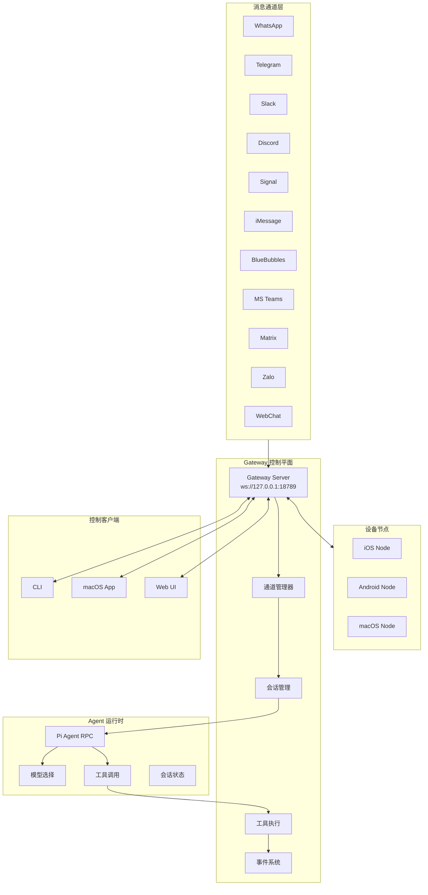
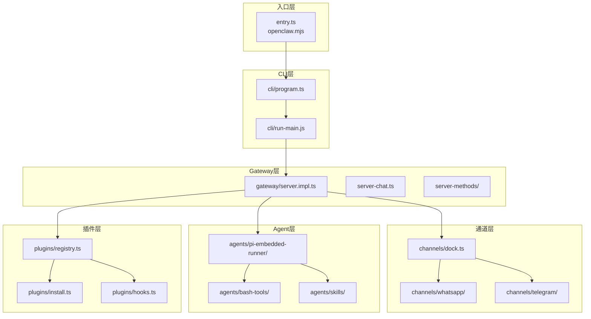
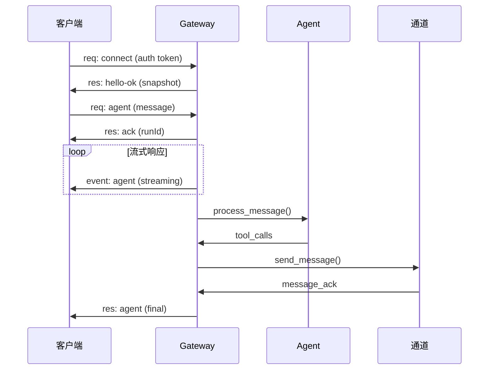
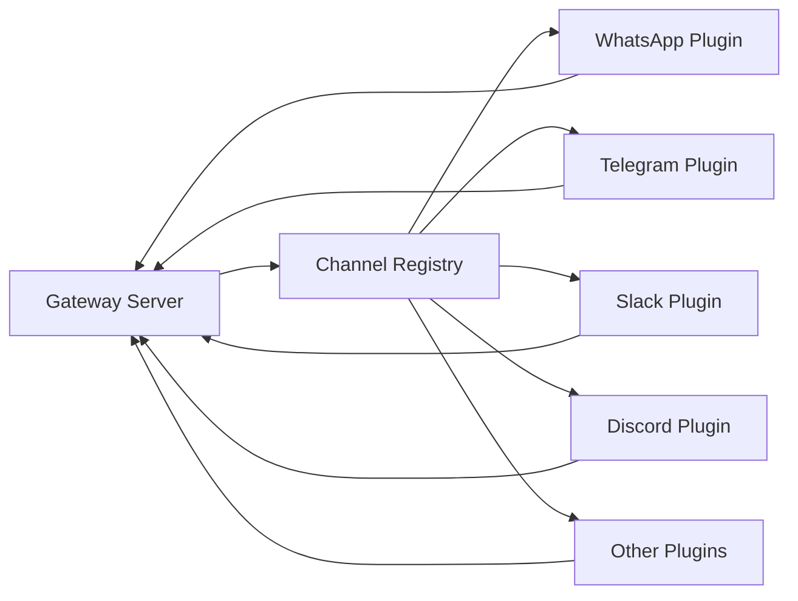
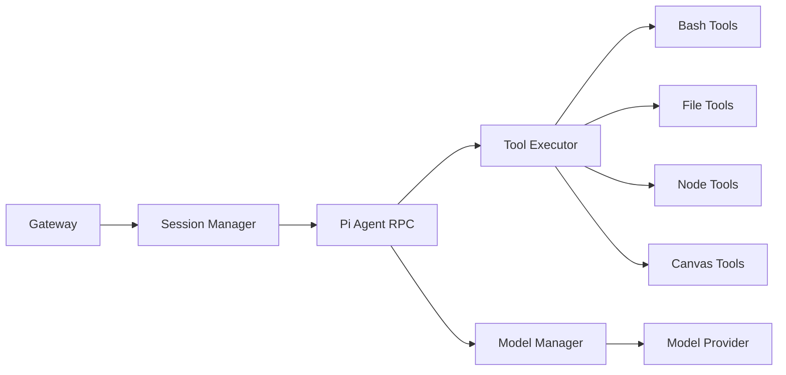
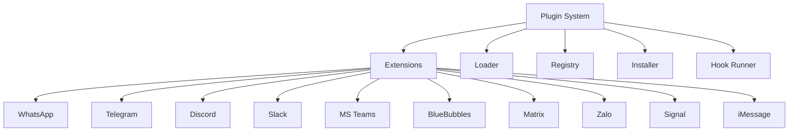
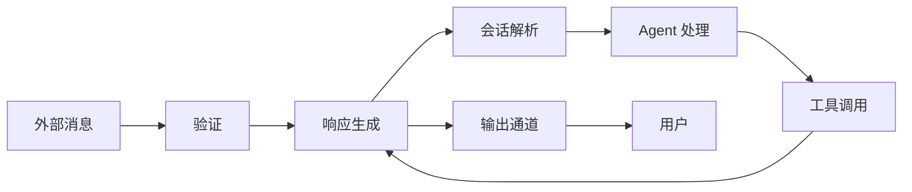
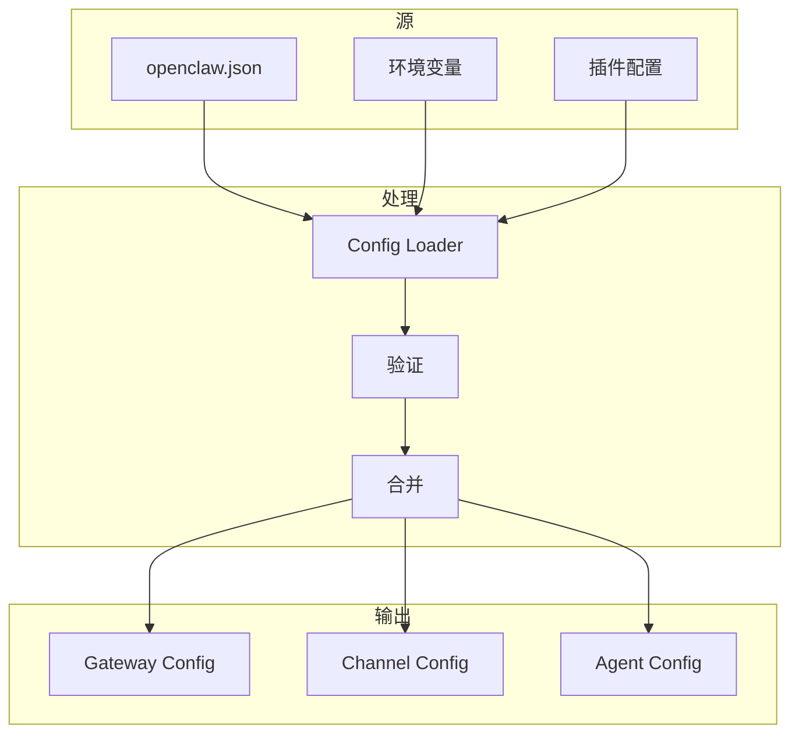
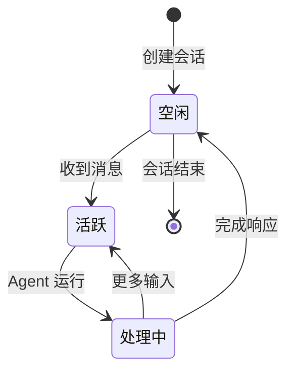

# OpenClaw 架构分析文档

## 📋 目录
- [系统概述](#系统概述)
- [核心组件](#核心组件)
- [系统架构图](#系统架构图)
- [组件间关系](#组件间关系)
- [数据流向](#数据流向)
- [关键技术点](#关键技术点)
- [扩展系统](#扩展系统)
- [安全模型](#安全模型)

---

## 系统概述

OpenClaw 是一个**个人 AI 助手**框架，允许用户在自有设备上运行私有 AI 助手。它通过单一的 **Gateway 控制平面**管理多个消息通道、工具和会话。

### 核心特性
- **多通道支持**: WhatsApp、Telegram、Slack、Discord、Google Chat、Signal、iMessage、BlueBubbles、Microsoft Teams、Matrix、Zalo、WebChat 等
- **本地优先架构**: 所有数据存储在本地，隐私优先
- **可扩展插件系统**: 支持通过扩展添加新功能和通道
- **Skills 平台**: 技能注册表，支持自动发现和安装
- **多设备节点**: 支持 macOS、iOS、Android 设备作为节点连接

### 技术栈
- **运行时**: Node.js ≥22.12.0
- **包管理**: pnpm 10.23.0
- **主要依赖**:
  - `@mariozechner/pi-agent-core` - Pi Agent 核心
  - `@whiskeysockets/baileys` - WhatsApp 支持
  - `grammy` - Telegram 支持
  - `@slack/bolt` - Slack 支持
  - `discord.js` - Discord 支持
  - `ws` - WebSocket 通信
  - `hono` - HTTP 服务器

---

## 项目技术栈

### 1. 前端技术

#### 1.1 命令行界面 (CLI)
- **语言**: TypeScript / Node.js
- **包管理器**: pnpm 10.23.0
- **主要依赖**:
  - `commander` (^14.0.3) - CLI 框架
  - `@clack/prompts` (^1.0.0) - 交互式提示
  - `chalk` (^5.6.2) - 终端着色
  - `inquirer` - 用户输入

#### 1.2 Web UI (控制界面)
- **框架**: Lit (Web Components) + Vite
- **构建工具**: Vite 7.3.1
- **主要依赖**:
  - `lit` (^3.3.2) - Web Components 库
  - `marked` (^17.0.1) - Markdown 渲染
  - `dompurify` (^3.3.1) - HTML 清理

#### 1.3 桌面客户端
- **macOS 应用**: Swift + Tauri (Rust 后端)
- **iOS 应用**: Swift (原生)
- **Android 应用**: Kotlin + Jetpack Compose
- **技术特点**: 跨平台支持、原生性能、节点管理

### 2. 后端技术

#### 2.1 核心运行时
- **语言**: TypeScript / Node.js
- **运行时**: Node.js ≥22.12.0
- **运行时环境**: Bun / Node.js 双支持
- **框架**:
  - `hono` (4.11.8) - HTTP 服务器框架
  - `ws` (^8.19.0) - WebSocket 通信
  - `express` (^5.2.1) - HTTP 服务器
- **协议**: WebSocket (ws://127.0.0.1:18789)

#### 2.2 Gateway 服务器
- **职责**: 消息路由、通道管理、认证、Agent 协调
- **核心模块**:
  - `server.impl.ts` - Gateway 主实现 (~1500+ 行)
  - `server-chat.ts` - 聊天会话管理
  - `server-channels.ts` - 通道管理
  - `server-methods/` - WS API 方法处理
  - `client.ts` - WS 客户端管理
  - `hooks.ts` - 钩子系统
- **通信协议**: WebSocket + HTTP (REST API)
- **认证方式**: Token / Password

### 3. 数据库

#### 3.1 数据库类型
- **主数据库**: SQLite 3 + sqlite-vec (向量搜索扩展)
- **ODM/ORM**: 原生 better-sqlite3
- **存储路径**: `~/.local/share/openclaw/memory/{agentId}.sqlite`
- **使用场景**:
  - 记忆向量存储
  - 会话状态缓存
  - 插件配置存储

#### 3.2 数据模型
**核心表/集合**:
- `documents` - 向量化文档存储
- `embeddings` - 向量嵌入记录
- `chunks` - 文档分块
- `cache` - 查询缓存
- `sessions` - 会话管理 (JSONL)
- `messages` - 消息历史 (JSONL)

### 4. 记忆系统

#### 4.1 记忆类型

**长期记忆 (MEMORY.md)**
- **存储位置**: `workspace/MEMORY.md`
- **格式**: Markdown
- **内容**: 重要决策、用户偏好、长期知识
- **加载方式**: 主会话自动加载

**每日笔记 (memory/YYYY-MM-DD.md)**
- **存储位置**: `workspace/memory/`
- **格式**: Markdown
- **内容**: 每日对话记录、待办事项、临时笔记
- **保留策略**: 长期保留，可手动清理

**会话历史**
- **存储位置**: `agents/main/sessions/`
- **格式**: JSONL (JSON Lines)
- **保留策略**: 按配置自动清理，默认保留最近 N 条
- **增量同步**: 支持 delta 同步 (100KB / 50 条消息)

#### 4.2 记忆检索
- **检索方式**:
  - 向量搜索 (sqlite-vec)
  - 关键词匹配
  - 混合搜索 (向量权重 70% + 文本权重 30%)
- **检索配置**:
  - `maxResults`: 最多返回 6 条结果
  - `minScore`: 最低相似度阈值 0.35
- **加载策略**: 按需加载，避免上下文膨胀
- **同步策略**:
  - 会话开始时同步
  - 搜索时同步
  - 文件监控自动同步
  - 定时增量同步

### 5. AI 模型集成

#### 5.1 支持的模型提供商
- **Anthropic**: Claude 3.5/3.7 (主要模型)
- **OpenAI**: GPT-4o, GPT-4, GPT-3.5
- **AWS Bedrock**: Claude, Titan, Llama
- **Ollama**: 本地部署模型 (Llama 3, Mistral, etc.)
- **MiniMax**: MiniMax-M2.1 (当前运行时使用)
- **Google Gemini**: Gemini Pro/Ultra

#### 5.2 模型选择策略
- **默认模型**: MiniMax-M2.1
- **配置方式**: `openclaw.json` / 环境变量
- **模型切换**: 动态路由，支持故障转移
- **认证管理**: Auth Profiles 多认证配置轮换
- **使用量跟踪**: Cost Tracking 成本监控

### 6. 消息通道技术

#### 6.1 核心通道 (11+)
- **即时通讯**: WhatsApp, Telegram, Signal
- **社交平台**: Discord, Slack
- **企业应用**: WeCom (企业微信), DingTalk (钉钉), Feishu (飞书)
- **移动消息**: iMessage (BlueBubbles), Google Chat
- **其他**: Matrix, Zalo, WebChat

#### 6.2 通道适配器
- **架构**: 插件化适配器设计
- **通信方式**:
  - WhatsApp: WebSocket (Baileys)
  - Telegram: Long Polling + Webhooks (grammY)
  - Discord: Gateway + REST API (discord.js)
  - Slack: Socket Mode + Events API (@slack/bolt)
- **消息格式**: 统一内部格式 (Channel-agnostic)
- **核心功能**:
  - 消息收发
  - 媒体处理 (图片、视频、文件)
  - 事件回调
  - 消息确认 (ACK) 和反应

### 7. 插件系统依赖

#### 7.1 核心插件
- **数量**: 30+ 扩展模块
- **类型**:
  - 通道插件 (Channel Plugins)
  - 工具插件 (Tool Plugins)
  - 集成插件 (Integration Plugins)
  - 认证插件 (Auth Plugins)

#### 7.2 插件机制
- **加载方式**: 动态加载，按需启用
- **manifest**: `extension.json` 定义插件元数据
- **扩展点**: Slots (插槽) 机制
- **生命周期**: Hooks (`install`, `load`, `unload`, `reload`)
- **隔离级别**: 进程隔离 (Worker/子进程)
- **版本管理**: SemVer 版本控制

### 8. 开发与部署

#### 8.1 开发环境
- **IDE**: VS Code (推荐)
- **语言**: TypeScript 5.9.3
- **构建工具**: tsdown, rolldown
- **包管理**: pnpm 10.23.0
- **调试**: Node.js Inspector, Chrome DevTools
- **测试框架**: Vitest 4.0.18
- **代码质量**: oxlint, oxfmt, swiftformat

#### 8.2 部署方式
- **本地开发**: 直接运行 (`pnpm dev`)
- **Docker 部署**: 多阶段构建，优化镜像体积
- **系统服务**:
  - macOS: launchd
  - Linux: systemd
  - 远程访问: Tailscale Serve/Funnel, SSH Tunnel

#### 8.3 监控与日志
- **日志系统**: tslog (结构化日志)
- **日志级别**: debug, info, warn, error
- **监控指标**:
  - Gateway 连接数
  - 消息吞吐量
  - 延迟统计
  - 错误率
- **健康检查**: `/health` HTTP 端点
- **调试工具**: `openclaw doctor` 健康检查命令

### 9. 其他关键依赖

#### 9.1 工具与库
- **代理 SDK**: `@agentclientprotocol/sdk` (0.14.1)
- **AI 核心**: `@mariozechner/pi-agent-core` (0.52.8)
- **AI 工具**: `@mariozechner/pi-ai`, `@mariozechner/pi-coding-agent`
- **终端 UI**: `@mariozechner/pi-tui`
- **文件处理**: `jszip`, `sharp`, `pdfjs-dist`
- **配置解析**: `yaml`, `json5`, `dotenv`

#### 9.2 基础设施
- **环境检查**: `@homebridge/ciao` (mDNS 发现)
- **进程管理**: `@lydell/node-pty` (伪终端)
- **任务调度**: `croner` (定时任务)
- **文件监控**: `chokidar` (文件变化监听)
- **HTTP 客户端**: `undici`, `hono/client`

#### 9.3 协议与数据
- **类型定义**: `@sinclair/typebox` (JSON Schema)
- **验证**: `zod` (^4.3.6), `ajv` (^8.17.1)
- **时间处理**: `long`, `date-fns`
- **Web 抓取**: `linkedom`, `@mozilla/readability`

---

## 核心组件

### 1. Gateway 服务器 (`src/gateway/`)
Gateway 是整个系统的控制平面，负责：
- 管理所有消息通道连接
- 处理 WebSocket 客户端连接
- 协调 Agent 会话
- 执行工具调用
- 管理节点设备

**关键模块**:
- `server.impl.ts` - Gateway 主实现
- `server-chat.ts` - 聊天会话管理
- `server-channels.ts` - 通道管理
- `server-methods/` - WS API 方法处理
- `client.ts` - WS 客户端管理
- `hooks.ts` - 钩子系统

### 2. CLI 系统 (`src/cli/`)
命令行界面入口：
- `entry.ts` - 程序入口，处理 Node 选项和环境
- `program.ts` - Commander 程序定义
- `run-main.js` - CLI 主运行逻辑

### 3. 通道系统 (`src/channels/`)
支持的消息通道实现：
- `whatsapp/` - WhatsApp (Baileys)
- `telegram/` - Telegram (grammY)
- `slack/` - Slack (Bolt)
- `discord/` - Discord
- `signal/` - Signal
- 扩展通道 (在 `extensions/` 目录)

**核心功能**:
- `dock.ts` - 通道注册表
- `allowlist-match.ts` - 允许名单匹配
- `ack-reactions.ts` - 消息确认和反应

### 4. Agent 系统 (`src/agents/`)
AI Agent 运行时：
- `pi-embedded-runner/` - Pi Agent 嵌入运行器
- `pi-embedded-subscribe/` - 消息订阅处理
- `bash-tools/` - Bash 命令工具
- `skills/` - 技能系统
- `sandbox/` - 沙箱隔离
- `model-selection.ts` - 模型选择
- `model-auth.ts` - 认证配置

### 5. 插件系统 (`src/plugins/`)
插件生命周期管理：
- `loader.ts` - 插件加载器
- `registry.ts` - 插件注册表
- `install.ts` - 安装逻辑
- `hooks.ts` - 插件钩子
- `tools.ts` - 插件工具

### 6. 配置系统 (`src/config/`)
- `config.ts` - 主配置加载
- `sessions.ts` - 会话存储
- `plugin-auto-enable.ts` - 插件自动启用

### 7. 基础设施 (`src/infra/`)
- `env.ts` - 环境变量处理
- `runtime-guard.ts` - 运行时检查
- `control-ui-assets.ts` - UI 资源
- `skills-remote.ts` - 远程技能

---

## 系统架构图

### 整体架构



### 组件层次结构



### WebSocket 协议架构



---

## 组件间关系

### 1. Gateway 与通道的关系


### 2. Gateway 与 Agent 的关系


### 3. 插件与扩展的关系


---

## 数据流向

### 消息处理流程



### 配置数据流



### 会话生命周期



---

## 关键技术点

### 1. WebSocket 协议
Gateway 使用单一 WebSocket 连接处理所有通信：
- **请求/响应模式**: `{type:"req", id, method, params}`
- **事件推送**: `{type:"event", event, payload}`
- **认证**: 通过 `OPENCLAW_GATEWAY_TOKEN` 或 `--token`
- **幂等性**: 使用 idempotency keys 防止重复处理

### 2. 插件架构
OpenClaw 采用模块化插件架构：
- **Manifest**: `extension.json` 定义插件元数据
- **Slots**: 插槽机制用于功能扩展
- **Hooks**: 生命周期钩子 (`install`, `load`, `unload`)
- **Services**: 插件服务接口

### 3. 工具系统
基于 Pi Agent 的工具调用框架：
- **Bash Tools**: 命令执行 (沙箱化)
- **File Tools**: 文件读写
- **Browser Tools**: 浏览器控制
- **Canvas Tools**: 可视化界面
- **Node Tools**: 设备节点控制

### 4. 模型选择与认证
- **多模型支持**: Anthropic, OpenAI, Bedrock, Ollama 等
- **Auth Profiles**: 认证配置轮换
- **Failover**: 模型故障转移
- **Cost Tracking**: 使用量跟踪

### 5. 安全机制
- **Sandboxing**: Docker 容器隔离非主会话
- **DM Policy**: 陌生人消息配对机制
- **工具策略**: 白名单/黑名单控制
- **TCC 权限**: macOS 权限管理

---

## 扩展系统

### 扩展目录结构
```
extensions/
├── whatsapp/         # WhatsApp 扩展
├── telegram/         # Telegram 扩展
├── discord/          # Discord 扩展
├── slack/            # Slack 扩展
├── msteams/          # MS Teams 扩展
├── bluebubbles/      # BlueBubbles (iMessage) 扩展
├── matrix/           # Matrix 扩展
├── zalo/             # Zalo 扩展
├── signal/           # Signal 扩展
└── ...
```

### 插件开发
```typescript
// 插件清单示例 (extension.json)
{
  "id": "my-plugin",
  "name": "My Plugin",
  "version": "1.0.0",
  "slots": ["channel", "tool"],
  "hooks": ["onMessage", "onSend"]
}
```

### 技能 (Skills)
```
skills/
├── coding-agent/    # 编码技能
├── canvas/          # Canvas 技能
├── github/          # GitHub 技能
├── discord/         # Discord 技能
└── ...
```

---

## 安全模型

### 默认安全策略
1. **主会话**: 完全信任，主机执行所有工具
2. **群组/通道会话**: 默认沙箱隔离
3. **DM 策略**: 陌生人需配对码验证
4. **工具白名单**: 默认只允许安全工具

### 配置示例
```json5
{
  agents: {
    defaults: {
      sandbox: {
        mode: "non-main",  // 非主会话使用沙箱
        allowlist: ["bash", "read", "write", "sessions_*"],
        denylist: ["browser", "canvas", "nodes"]
      }
    }
  }
}
```

### 远程访问安全
- **Tailscale Serve/Funnel**: 安全的远程暴露
- **SSH Tunnel**: 备选方案
- **Token Auth**: 必需的认证令牌
- **Password Auth**: Funnel 模式必需

---

## 文件结构概览

```
openclaw/
├── src/
│   ├── gateway/          # Gateway 服务器核心
│   ├── agents/           # Agent 运行时
│   ├── channels/         # 消息通道
│   ├── cli/              # CLI 实现
│   ├── config/           # 配置管理
│   ├── plugins/          # 插件系统
│   ├── infra/           # 基础设施
│   └── ...
├── extensions/          # 扩展模块
├── skills/              # 技能包
├── docs/                # 文档
├── apps/                # 应用程序 (macOS/iOS/Android)
└── openclaw.mjs         # CLI 入口
```

---

## 关键文件说明

| 文件路径 | 功能描述 |
|---------|---------|
| `src/entry.ts` | Node.js 入口，处理警告过滤和进程重载 |
| `src/index.ts` | CLI 主入口，配置加载和程序初始化 |
| `src/gateway/server.impl.ts` | Gateway 服务器核心实现 (~1500+ 行) |
| `src/gateway/client.ts` | WebSocket 客户端管理 |
| `src/gateway/server-chat.ts` | 聊天会话处理 |
| `src/channels/dock.ts` | 通道注册表 |
| `src/agents/pi-embedded-runner/` | Pi Agent 嵌入运行时 |
| `src/plugins/loader.ts` | 插件加载器 |
| `src/plugins/registry.ts` | 插件注册表 |
| `openclaw.mjs` | npm 包入口脚本 |

---

## 建议关注点

### 1. Gateway 性能
- 单点瓶颈：所有通道连接都经过 Gateway
- WebSocket 连接管理
- 会话状态内存占用

### 2. 插件兼容性
- 插件版本与 Gateway 版本匹配
- TypeBox Schema 变更影响
- 插槽机制使用

### 3. 安全边界
- 沙箱配置的正确性
- 陌生人 DM 策略
- 远程访问暴露面

### 4. 扩展开发
- 遵循 extension.json 规范
- 正确实现生命周期钩子
- 资源清理和错误处理

### 5. 调试技巧
- 使用 `OPENCLAW_LOG=debug` 启用详细日志
- `openclaw doctor` 健康检查
- Gateway WS 调试工具

---

## 参考链接

- [官方文档](https://docs.openclaw.ai)
- [Gateway 协议](https://docs.openclaw.ai/gateway/protocol)
- [插件开发指南](https://docs.openclaw.ai/tools/skills)
- [安全指南](https://docs.openclaw.ai/gateway/security)

---

*文档生成时间: 2026-02-08*
*基于 OpenClaw 源码分析*
