# OpenClaw 核心数据结构源码深度分析

## 概述

OpenClaw 是一个多平台 AI 助手框架，支持跨 22+ 通信平台（Discord、Telegram、Slack、iMessage、WhatsApp 等）的统一对话体验。系统采用模块化架构，核心组件涵盖消息系统、会话系统、Agent 系统、工具系统、通道系统、记忆系统、上下文引擎和 Gateway 服务。

本文档基于源码进行深度分析，覆盖所有核心数据结构及其相互关系。

---

## 设计理念

OpenClaw 在类型系统上采用**双轨验证策略**：

| 维度 | 技术选型 | 适用场景 | 原因 |
|------|---------|---------|------|
| **协议/工具类型** | TypeBox (`@sinclair/typebox`) | Agent 工具 input_schema、消息协议 | 生成标准 JSON Schema，兼容 LLM function calling |
| **配置验证** | Zod | 用户配置文件、环境变量 | 运行时验证 + 友好错误提示 |
| **运行时类型** | TypeScript interfaces | 内存数据结构 | 零运行时开销 |

另一个关键设计原则是**运行时（in-memory）与持久化（file/DB）结构的分离**：

- **运行时结构**：会话消息缓冲、Agent 运行状态、通道连接状态、工具调用缓存——随进程生命周期存在
- **持久化结构**：会话 JSON 文件、SQLite 记忆索引、认证配置、Gateway 会话行——跨重启保留

这种分离确保热路径上无序列化开销，同时保证数据的持久性。

---

## 1. 消息系统

### 1.1 核心消息类型

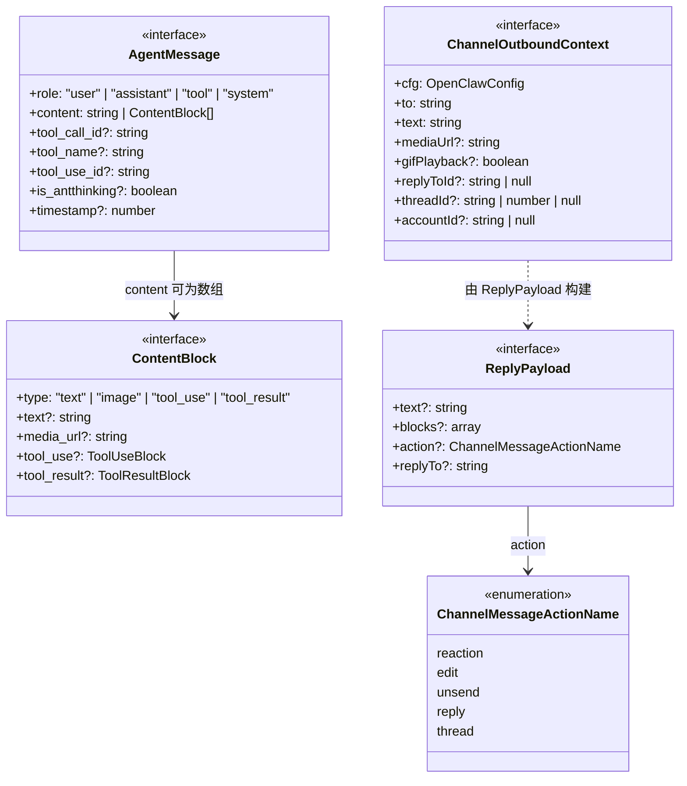
```mermaid
classDiagram
    class AgentMessage {
        <<interface>>
        +role: "user" | "assistant" | "tool" | "system"
        +content: string | ContentBlock[]
        +tool_call_id?: string
        +tool_name?: string
        +tool_use_id?: string
        +is_antthinking?: boolean
        +timestamp?: number
    }

    class ContentBlock {
        <<interface>>
        +type: "text" | "image" | "tool_use" | "tool_result"
        +text?: string
        +media_url?: string
        +tool_use?: ToolUseBlock
        +tool_result?: ToolResultBlock
    }

    class ReplyPayload {
        <<interface>>
        +text?: string
        +blocks?: array
        +action?: ChannelMessageActionName
        +replyTo?: string
    }

    class ChannelOutboundContext {
        <<interface>>
        +cfg: OpenClawConfig
        +to: string
        +text: string
        +mediaUrl?: string
        +gifPlayback?: boolean
        +replyToId?: string | null
        +threadId?: string | number | null
        +accountId?: string | null
    }

    class ChannelMessageActionName {
        <<enumeration>>
        reaction
        edit
        unsend
        reply
        thread
    }

    AgentMessage --> ContentBlock : content 可为数组
    ReplyPayload --> ChannelMessageActionName : action
    ChannelOutboundContext ..> ReplyPayload : 由 ReplyPayload 构建
```

### 1.2 消息状态流转

消息从创建到最终送达，经历以下状态机：

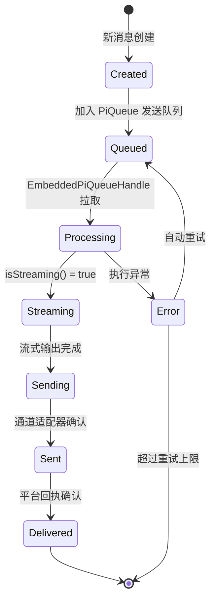
```mermaid
stateDiagram-v2
    [*] --> Created: 新消息创建
    Created --> Queued: 加入 PiQueue 发送队列
    Queued --> Processing: EmbeddedPiQueueHandle 拉取
    Processing --> Streaming: isStreaming() = true
    Streaming --> Sending: 流式输出完成
    Sending --> Sent: 通道适配器确认
    Processing --> Error: 执行异常
    Error --> Queued: 自动重试
    Sent --> Delivered: 平台回执确认
    Delivered --> [*]
    Error --> [*]: 超过重试上限
```

### 1.3 通道消息格式

```typescript
interface ChannelMessage {
  channel: ChannelId;
  from: string;
  to: string;
  content: string;
  timestamp: number;
  threadId?: string | number;
  replyToId?: string;
  media?: ChannelMedia[];
  metadata?: Record<string, unknown>;
}

interface ChannelMedia {
  type: "image" | "video" | "audio" | "file";
  url: string;
  mimeType?: string;
  size?: number;
}
```

---

## 2. 会话系统

### 2.1 会话数据结构

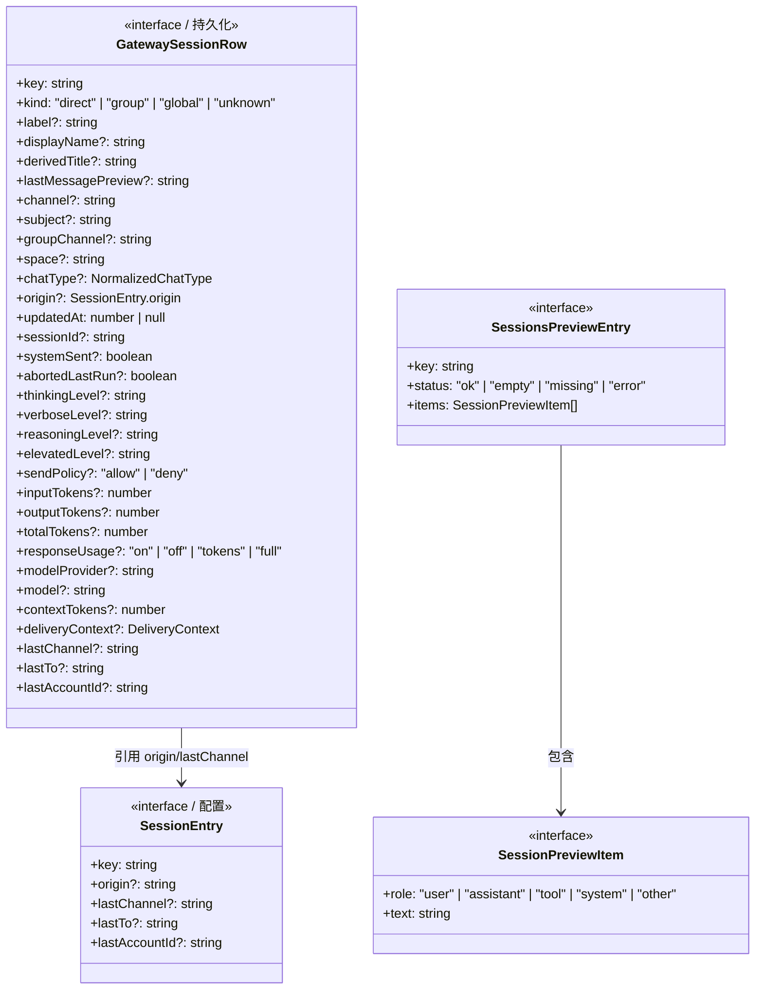
```mermaid
classDiagram
    class GatewaySessionRow {
        <<interface / 持久化>>
        +key: string
        +kind: "direct" | "group" | "global" | "unknown"
        +label?: string
        +displayName?: string
        +derivedTitle?: string
        +lastMessagePreview?: string
        +channel?: string
        +subject?: string
        +groupChannel?: string
        +space?: string
        +chatType?: NormalizedChatType
        +origin?: SessionEntry.origin
        +updatedAt: number | null
        +sessionId?: string
        +systemSent?: boolean
        +abortedLastRun?: boolean
        +thinkingLevel?: string
        +verboseLevel?: string
        +reasoningLevel?: string
        +elevatedLevel?: string
        +sendPolicy?: "allow" | "deny"
        +inputTokens?: number
        +outputTokens?: number
        +totalTokens?: number
        +responseUsage?: "on" | "off" | "tokens" | "full"
        +modelProvider?: string
        +model?: string
        +contextTokens?: number
        +deliveryContext?: DeliveryContext
        +lastChannel?: string
        +lastTo?: string
        +lastAccountId?: string
    }

    class SessionEntry {
        <<interface / 配置>>
        +key: string
        +origin?: string
        +lastChannel?: string
        +lastTo?: string
        +lastAccountId?: string
    }

    class SessionPreviewItem {
        <<interface>>
        +role: "user" | "assistant" | "tool" | "system" | "other"
        +text: string
    }

    class SessionsPreviewEntry {
        <<interface>>
        +key: string
        +status: "ok" | "empty" | "missing" | "error"
        +items: SessionPreviewItem[]
    }

    GatewaySessionRow --> SessionEntry : 引用 origin/lastChannel
    SessionsPreviewEntry --> SessionPreviewItem : 包含
```

### 2.2 会话生命周期

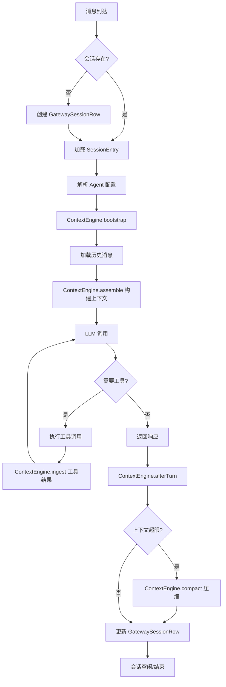
```mermaid
flowchart TD
    A[消息到达] --> B{会话存在?}
    B -->|否| C[创建 GatewaySessionRow]
    B -->|是| D[加载 SessionEntry]
    C --> D

    D --> E[解析 Agent 配置]
    E --> F[ContextEngine.bootstrap]
    F --> G[加载历史消息]
    G --> H[ContextEngine.assemble 构建上下文]

    H --> I[LLM 调用]
    I --> J{需要工具?}
    J -->|是| K[执行工具调用]
    K --> L[ContextEngine.ingest 工具结果]
    L --> I
    J -->|否| M[返回响应]

    M --> N[ContextEngine.afterTurn]
    N --> O{上下文超限?}
    O -->|是| P[ContextEngine.compact 压缩]
    P --> Q[更新 GatewaySessionRow]
    O -->|否| Q
    Q --> R[会话空闲/结束]
```

### 2.3 主会话 vs 子代理会话

```typescript
type SessionKey = string;
type SessionType = "main" | "subagent";

interface SessionContext {
  sessionKey: SessionKey;
  type: SessionType;
  agentId: string;
  parentSessionKey?: string;   // 子代理指向父会话
  workspaceDir: string;
  model?: string;
  thinkingLevel?: "off" | "low" | "high";
  verboseLevel?: "off" | "low" | "high";
}
```

---

## 3. Agent 系统

### 3.1 Agent 配置结构

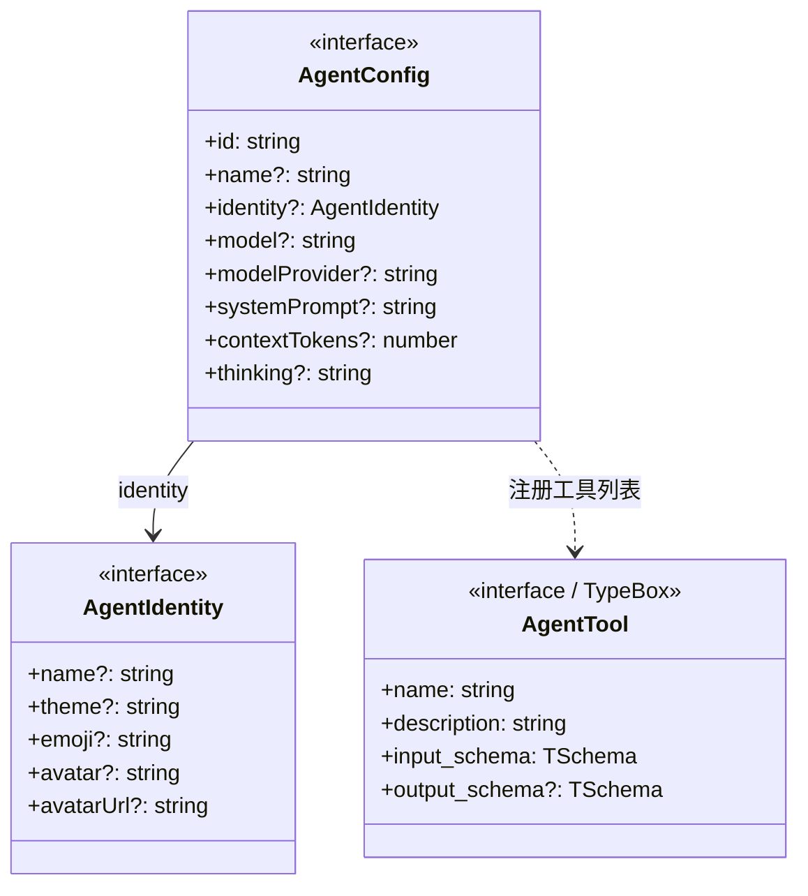
```mermaid
classDiagram
    class AgentConfig {
        <<interface>>
        +id: string
        +name?: string
        +identity?: AgentIdentity
        +model?: string
        +modelProvider?: string
        +systemPrompt?: string
        +contextTokens?: number
        +thinking?: string
    }

    class AgentIdentity {
        <<interface>>
        +name?: string
        +theme?: string
        +emoji?: string
        +avatar?: string
        +avatarUrl?: string
    }

    class AgentTool {
        <<interface / TypeBox>>
        +name: string
        +description: string
        +input_schema: TSchema
        +output_schema?: TSchema
    }

    AgentConfig --> AgentIdentity : identity
    AgentConfig ..> AgentTool : 注册工具列表
```

> **TypeBox 在此处的作用**：`AgentTool.input_schema` 使用 TypeBox 的 `TSchema` 类型，编译期生成标准 JSON Schema，直接传递给 LLM 的 function calling 接口，无需额外转换。

### 3.2 工具调用链路

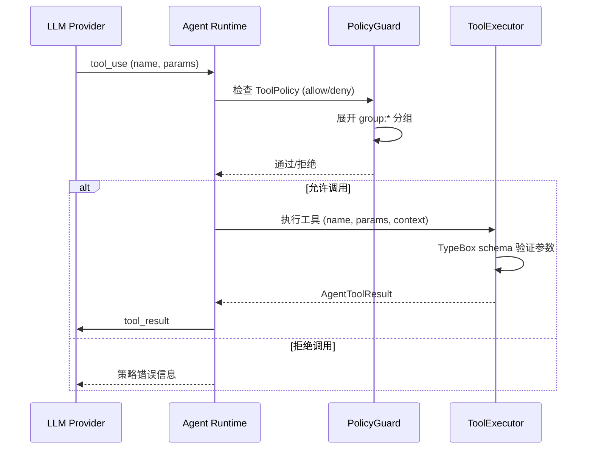
```mermaid
sequenceDiagram
    participant LLM as LLM Provider
    participant A as Agent Runtime
    participant P as PolicyGuard
    participant T as ToolExecutor

    LLM->>A: tool_use (name, params)
    A->>P: 检查 ToolPolicy (allow/deny)
    P->>P: 展开 group:* 分组
    P-->>A: 通过/拒绝

    alt 允许调用
        A->>T: 执行工具 (name, params, context)
        T->>T: TypeBox schema 验证参数
        T-->>A: AgentToolResult
        A->>LLM: tool_result
    else 拒绝调用
        A-->>LLM: 策略错误信息
    end
```

### 3.3 上下文窗口管理

```typescript
interface ContextWindowConfig {
  maxTokens: number;
  warningThreshold: number;
  compactionThreshold: number;
}

interface CompactionResult {
  messageCount: number;
  tokenCount: number;
  compactedCount: number;
  preservedCount: number;
}
```

---

## 4. 工具系统

### 4.1 工具定义结构

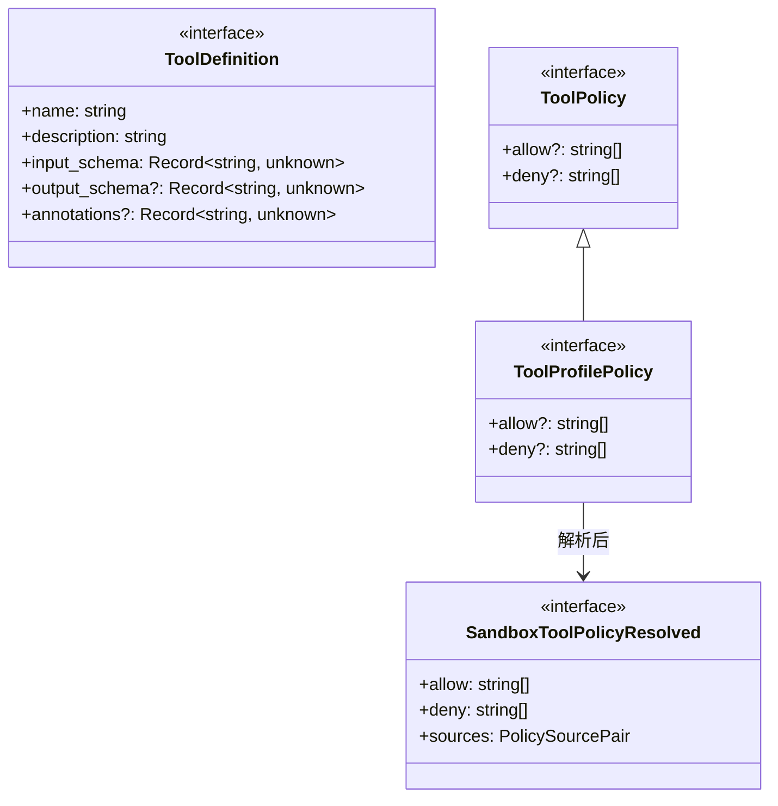
```mermaid
classDiagram
    class ToolDefinition {
        <<interface>>
        +name: string
        +description: string
        +input_schema: Record~string, unknown~
        +output_schema?: Record~string, unknown~
        +annotations?: Record~string, unknown~
    }

    class ToolPolicy {
        <<interface>>
        +allow?: string[]
        +deny?: string[]
    }

    class ToolProfilePolicy {
        <<interface>>
        +allow?: string[]
        +deny?: string[]
    }

    class SandboxToolPolicyResolved {
        <<interface>>
        +allow: string[]
        +deny: string[]
        +sources: PolicySourcePair
    }

    ToolPolicy <|-- ToolProfilePolicy
    ToolProfilePolicy --> SandboxToolPolicyResolved : 解析后
```

### 4.2 工具 Profile 与分组

OpenClaw 通过 **Profile** 和 **Group** 两级机制管理工具权限：

| Profile ID | 包含的工具组 | 适用场景 |
|-----------|------------|---------|
| `minimal` | 基础对话工具 | 只需对话的轻量 Agent |
| `coding` | `group:fs` + `group:runtime` + 基础 | 编码助手 |
| `messaging` | `group:sessions` + `group:openclaw` + 基础 | 跨平台消息 Agent |
| `full` | 全部工具组 | 完整能力 Agent |

```typescript
const TOOL_GROUPS: Record<string, string[]> = {
  "group:memory":   ["memory_search", "memory_get"],
  "group:web":      ["web_search", "web_fetch"],
  "group:fs":       ["read", "write", "edit", "apply_patch"],
  "group:runtime":  ["exec", "process"],
  "group:sessions": ["sessions_list", "sessions_history", "sessions_send"],
  "group:openclaw": ["browser", "canvas", "nodes", "message", "gateway"],
};
```

### 4.3 工具执行流程

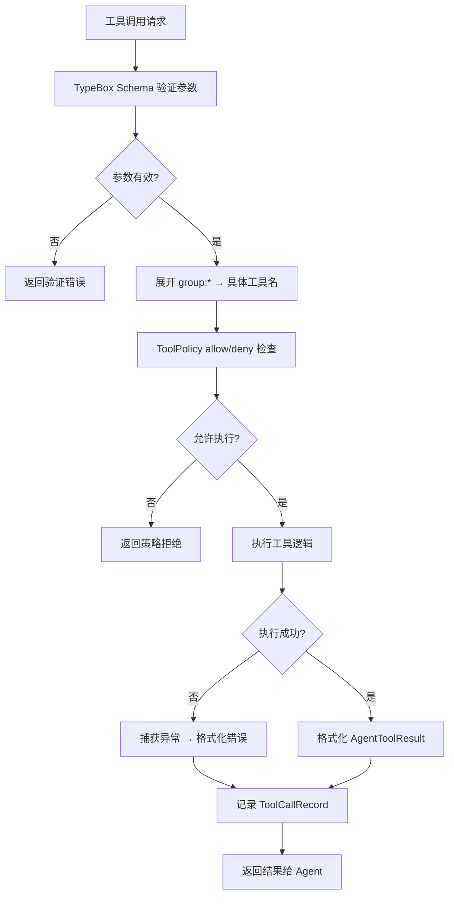
```mermaid
flowchart TD
    A[工具调用请求] --> B[TypeBox Schema 验证参数]
    B --> C{参数有效?}
    C -->|否| D[返回验证错误]
    C -->|是| E[展开 group:* → 具体工具名]
    E --> F[ToolPolicy allow/deny 检查]
    F --> G{允许执行?}
    G -->|否| H[返回策略拒绝]
    G -->|是| I[执行工具逻辑]
    I --> J{执行成功?}
    J -->|否| K[捕获异常 → 格式化错误]
    J -->|是| L[格式化 AgentToolResult]
    K --> M[记录 ToolCallRecord]
    L --> M
    M --> N[返回结果给 Agent]
```

---

## 5. 通道系统

### 5.1 通道配置结构

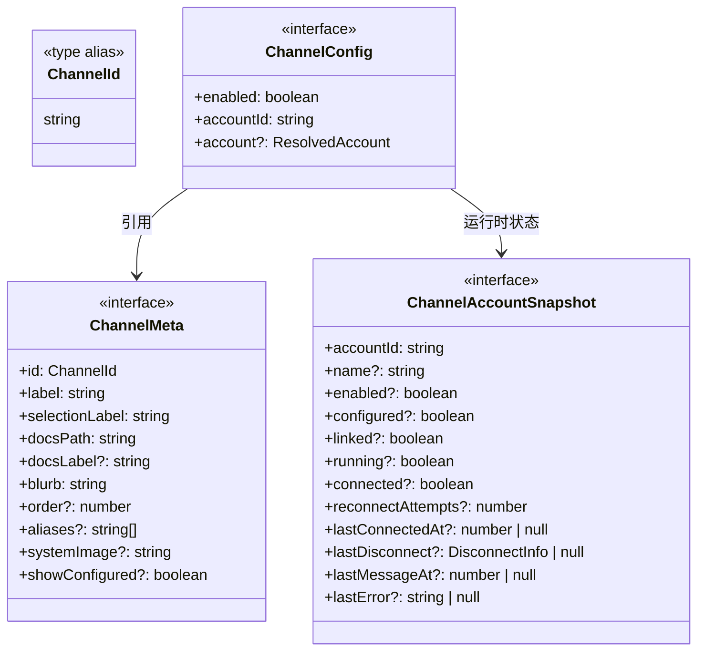
```mermaid
classDiagram
    class ChannelId {
        <<type alias>>
        string
    }

    class ChannelConfig {
        <<interface>>
        +enabled: boolean
        +accountId: string
        +account?: ResolvedAccount
    }

    class ChannelMeta {
        <<interface>>
        +id: ChannelId
        +label: string
        +selectionLabel: string
        +docsPath: string
        +docsLabel?: string
        +blurb: string
        +order?: number
        +aliases?: string[]
        +systemImage?: string
        +showConfigured?: boolean
    }

    class ChannelAccountSnapshot {
        <<interface>>
        +accountId: string
        +name?: string
        +enabled?: boolean
        +configured?: boolean
        +linked?: boolean
        +running?: boolean
        +connected?: boolean
        +reconnectAttempts?: number
        +lastConnectedAt?: number | null
        +lastDisconnect?: DisconnectInfo | null
        +lastMessageAt?: number | null
        +lastError?: string | null
    }

    ChannelConfig --> ChannelMeta : 引用
    ChannelConfig --> ChannelAccountSnapshot : 运行时状态
```

### 5.2 通道适配器架构 — ChannelPlugin

`ChannelPlugin` 是所有通道适配器的统一接口，每个适配器实现其中的可选子适配器：

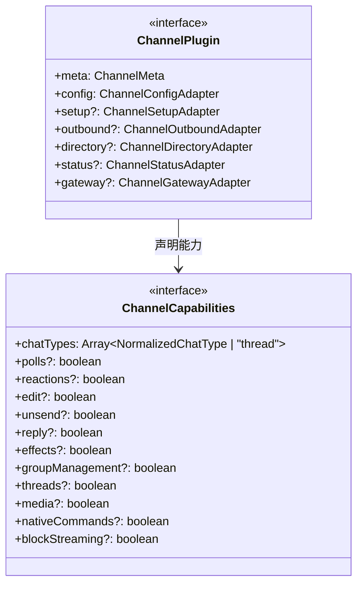
```mermaid
classDiagram
    class ChannelPlugin {
        <<interface>>
        +meta: ChannelMeta
        +config: ChannelConfigAdapter
        +setup?: ChannelSetupAdapter
        +outbound?: ChannelOutboundAdapter
        +directory?: ChannelDirectoryAdapter
        +status?: ChannelStatusAdapter
        +gateway?: ChannelGatewayAdapter
    }

    class ChannelCapabilities {
        <<interface>>
        +chatTypes: Array~NormalizedChatType | "thread"~
        +polls?: boolean
        +reactions?: boolean
        +edit?: boolean
        +unsend?: boolean
        +reply?: boolean
        +effects?: boolean
        +groupManagement?: boolean
        +threads?: boolean
        +media?: boolean
        +nativeCommands?: boolean
        +blockStreaming?: boolean
    }

    ChannelPlugin --> ChannelCapabilities : 声明能力
```

### 5.3 全部 22 个通道适配器

| # | 通道 ID | 平台 | 特殊能力 |
|---|---------|------|---------|
| 1 | `discord` | Discord | threads, reactions, media |
| 2 | `telegram` | Telegram | edit, reply, media, polls |
| 3 | `slack` | Slack | threads, reactions, edit |
| 4 | `imessage` | iMessage | reactions, media |
| 5 | `whatsapp` | WhatsApp | media, reactions |
| 6 | `signal` | Signal | reactions, media |
| 7 | `matrix` | Matrix | threads, edit, reactions |
| 8 | `irc` | IRC | 基础文本 |
| 9 | `xmpp` | XMPP | 基础文本 |
| 10 | `twitter` | Twitter/X | reply, media |
| 11 | `mastodon` | Mastodon | reply, media |
| 12 | `bluesky` | Bluesky | reply |
| 13 | `nostr` | Nostr | 去中心化消息 |
| 14 | `email` | Email (SMTP/IMAP) | 富文本, 附件 |
| 15 | `sms` | SMS (Twilio) | 基础文本 |
| 16 | `line` | LINE | media, effects |
| 17 | `wechat` | WeChat | media |
| 18 | `teams` | Microsoft Teams | threads, media |
| 19 | `webex` | Webex | threads |
| 20 | `webhook` | Generic Webhook | 自定义 payload |
| 21 | `rest` | REST API | 程序化接入 |
| 22 | `websocket` | WebSocket | 实时双向通信 |

### 5.4 消息路由机制

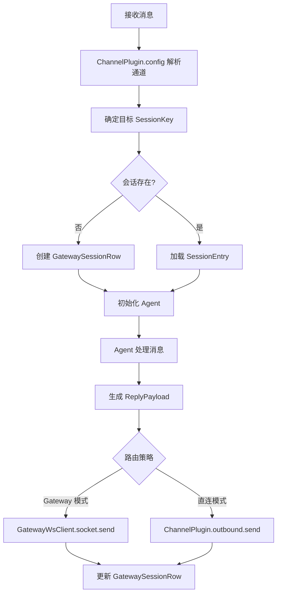
```mermaid
flowchart TD
    A[接收消息] --> B[ChannelPlugin.config 解析通道]
    B --> C[确定目标 SessionKey]
    C --> D{会话存在?}
    D -->|否| E[创建 GatewaySessionRow]
    D -->|是| F[加载 SessionEntry]
    E --> G[初始化 Agent]
    F --> G

    G --> H[Agent 处理消息]
    H --> I[生成 ReplyPayload]
    I --> J{路由策略}
    J -->|Gateway 模式| K[GatewayWsClient.socket.send]
    J -->|直连模式| L[ChannelPlugin.outbound.send]

    K --> M[更新 GatewaySessionRow]
    L --> M
```

---

## 6. 记忆系统

### 6.1 记忆管理器接口

```mermaid
classDiagram
    class MemoryManager {
        <<interface>>
        +search(query, opts): Promise~MemorySearchResult[]~
        +readFile(params): Promise~{text, path}~
        +status(): MemoryProviderStatus
        +sync(params?): Promise~void~
    }

    class MemorySearchResult {
        <<interface>>
        +path: string
        +startLine: number
        +endLine: number
        +score: number
        +snippet: string
        +source: "memory" | "sessions"
    }

    class MemoryProviderStatus {
        <<interface>>
        +indexed: boolean
        +fileCount: number
        +chunkCount: number
        +lastSyncAt?: number
    }

    MemoryManager --> MemorySearchResult : search 返回
    MemoryManager --> MemoryProviderStatus : status 返回
```

### 6.2 SQLite Schema（5 张表 + 1 虚拟表）

```mermaid
erDiagram
    meta {
        TEXT key PK
        TEXT value
    }

    files {
        TEXT path PK
        TEXT source
        TEXT hash
        INTEGER mtime
        INTEGER size
    }

    chunks {
        TEXT id PK
        TEXT path FK
        TEXT source
        INTEGER start_line
        INTEGER end_line
        TEXT hash
        TEXT model
        TEXT text
        TEXT embedding
        INTEGER updated_at
    }

    embedding_cache {
        TEXT provider PK
        TEXT model PK
        TEXT provider_key PK
        TEXT hash PK
        TEXT embedding
        INTEGER dims
        INTEGER updated_at
    }

    chunks_vec {
        TEXT id PK
        BLOB embedding "sqlite-vec 向量列"
        FLOAT distance "余弦距离"
    }

    chunks_fts {
        TEXT text "FTS5 全文索引"
        TEXT path
    }

    files ||--o{ chunks : "contains"
    chunks ||--|| chunks_vec : "向量索引 1:1"
    chunks ||--|| chunks_fts : "全文索引 1:1"
    chunks ..> embedding_cache : "缓存向量"
```

> **chunks_vec** 使用 `sqlite-vec` 扩展实现向量相似度搜索；**chunks_fts** 使用 SQLite FTS5 虚拟表实现关键词全文检索。混合检索时两者结果合并排序。

### 6.3 语义检索流程

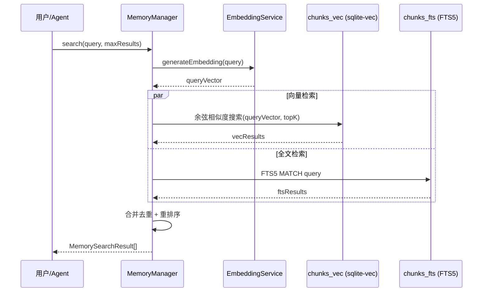
```mermaid
sequenceDiagram
    participant U as 用户/Agent
    participant M as MemoryManager
    participant E as EmbeddingService
    participant V as chunks_vec (sqlite-vec)
    participant F as chunks_fts (FTS5)

    U->>M: search(query, maxResults)
    M->>E: generateEmbedding(query)
    E-->>M: queryVector

    par 向量检索
        M->>V: 余弦相似度搜索(queryVector, topK)
        V-->>M: vecResults
    and 全文检索
        M->>F: FTS5 MATCH query
        F-->>M: ftsResults
    end

    M->>M: 合并去重 + 重排序
    M-->>U: MemorySearchResult[]
```

---

## 7. 上下文引擎（ContextEngine）

ContextEngine 是 OpenClaw v2026.2 新增的核心抽象，统一管理 Agent 每轮对话的上下文生命周期：

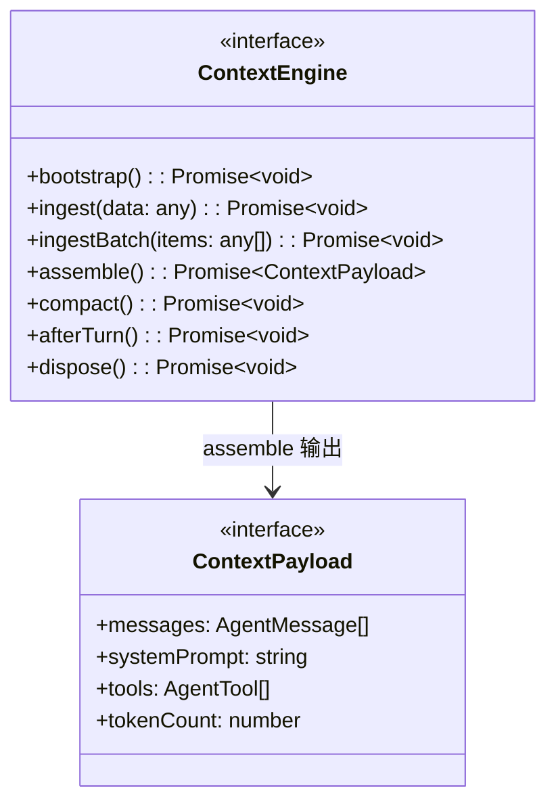
```mermaid
classDiagram
    class ContextEngine {
        <<interface>>
        +bootstrap(): Promise~void~
        +ingest(data: any): Promise~void~
        +ingestBatch(items: any[]): Promise~void~
        +assemble(): Promise~ContextPayload~
        +compact(): Promise~void~
        +afterTurn(): Promise~void~
        +dispose(): Promise~void~
    }

    class ContextPayload {
        <<interface>>
        +messages: AgentMessage[]
        +systemPrompt: string
        +tools: AgentTool[]
        +tokenCount: number
    }

    ContextEngine --> ContextPayload : assemble 输出
```

**方法调用时序**：

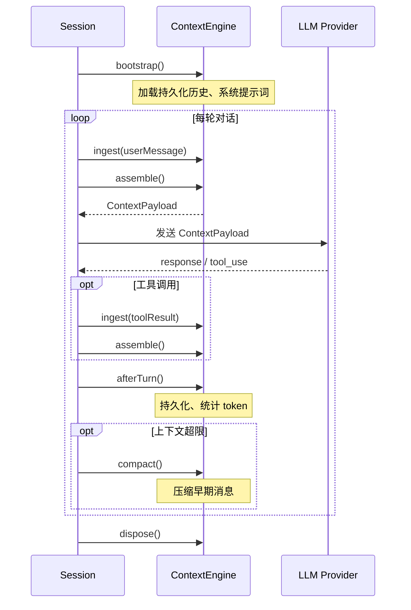
```mermaid
sequenceDiagram
    participant S as Session
    participant CE as ContextEngine
    participant LLM as LLM Provider

    S->>CE: bootstrap()
    Note over CE: 加载持久化历史、系统提示词

    loop 每轮对话
        S->>CE: ingest(userMessage)
        S->>CE: assemble()
        CE-->>S: ContextPayload

        S->>LLM: 发送 ContextPayload
        LLM-->>S: response / tool_use

        opt 工具调用
            S->>CE: ingest(toolResult)
            S->>CE: assemble()
        end

        S->>CE: afterTurn()
        Note over CE: 持久化、统计 token

        opt 上下文超限
            S->>CE: compact()
            Note over CE: 压缩早期消息
        end
    end

    S->>CE: dispose()
```

---

## 8. Gateway 核心结构

### 8.1 GatewayWsClient（WebSocket 客户端）

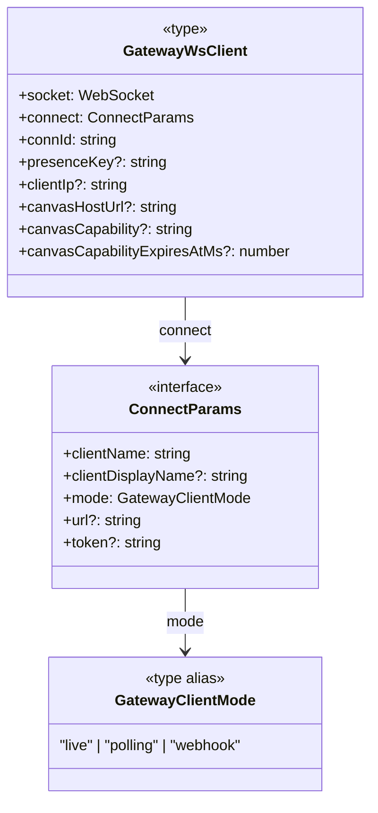
```mermaid
classDiagram
    class GatewayWsClient {
        <<type>>
        +socket: WebSocket
        +connect: ConnectParams
        +connId: string
        +presenceKey?: string
        +clientIp?: string
        +canvasHostUrl?: string
        +canvasCapability?: string
        +canvasCapabilityExpiresAtMs?: number
    }

    class ConnectParams {
        <<interface>>
        +clientName: string
        +clientDisplayName?: string
        +mode: GatewayClientMode
        +url?: string
        +token?: string
    }

    class GatewayClientMode {
        <<type alias>>
        "live" | "polling" | "webhook"
    }

    GatewayWsClient --> ConnectParams : connect
    ConnectParams --> GatewayClientMode : mode
```

### 8.2 GatewayClient / GatewayServer

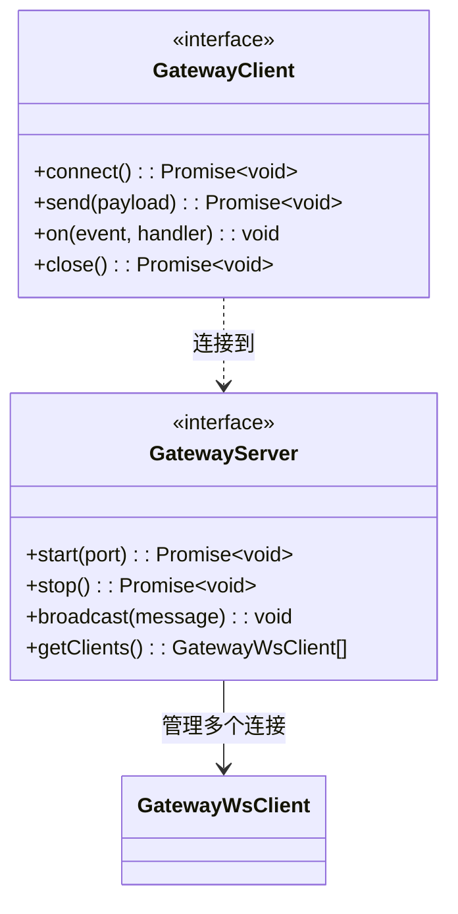
```mermaid
classDiagram
    class GatewayClient {
        <<interface>>
        +connect(): Promise~void~
        +send(payload): Promise~void~
        +on(event, handler): void
        +close(): Promise~void~
    }

    class GatewayServer {
        <<interface>>
        +start(port): Promise~void~
        +stop(): Promise~void~
        +broadcast(message): void
        +getClients(): GatewayWsClient[]
    }

    GatewayServer --> GatewayWsClient : 管理多个连接
    GatewayClient ..> GatewayServer : 连接到
```

### 8.3 Gateway 连接管理

```typescript
type GatewayWsClient = {
  socket: WebSocket;
  connect: ConnectParams;
  connId: string;
  presenceKey?: string;
  clientIp?: string;
  canvasHostUrl?: string;
  canvasCapability?: string;
  canvasCapabilityExpiresAtMs?: number;
};

interface GatewayConnection {
  id: string;
  clientName: string;
  clientDisplayName?: string;
  mode: GatewayClientMode;
  url?: string;
  token?: string;
  connectedAt: number;
  lastActivityAt: number;
  status: "connecting" | "connected" | "disconnected" | "error";
}
```

### 8.4 Gateway 消息路由

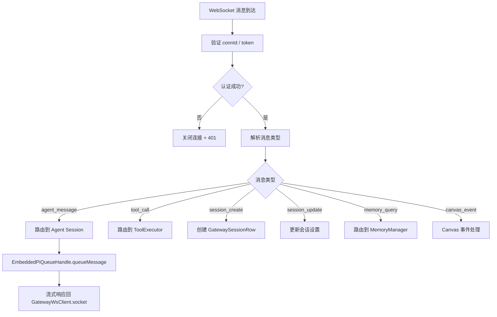
```mermaid
flowchart TD
    A[WebSocket 消息到达] --> B[验证 connId / token]
    B --> C{认证成功?}
    C -->|否| D[关闭连接 + 401]
    C -->|是| E[解析消息类型]

    E --> F{消息类型}
    F -->|agent_message| G[路由到 Agent Session]
    F -->|tool_call| H[路由到 ToolExecutor]
    F -->|session_create| I[创建 GatewaySessionRow]
    F -->|session_update| J[更新会话设置]
    F -->|memory_query| K[路由到 MemoryManager]
    F -->|canvas_event| L[Canvas 事件处理]

    G --> M[EmbeddedPiQueueHandle.queueMessage]
    M --> N[流式响应回 GatewayWsClient.socket]
```

---

## 9. EmbeddedPiQueueHandle — 嵌入式消息队列

`EmbeddedPiQueueHandle` 是 Agent 运行时与消息队列的桥接接口，控制消息的排队、流式输出和中断：

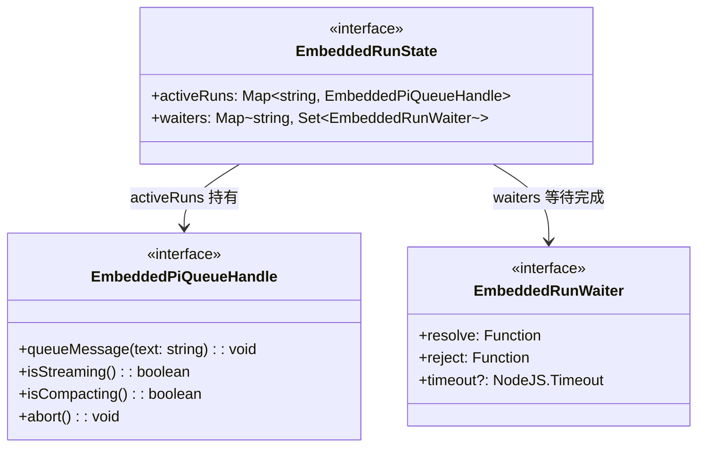
```mermaid
classDiagram
    class EmbeddedPiQueueHandle {
        <<interface>>
        +queueMessage(text: string): void
        +isStreaming(): boolean
        +isCompacting(): boolean
        +abort(): void
    }

    class EmbeddedRunState {
        <<interface>>
        +activeRuns: Map~string, EmbeddedPiQueueHandle~
        +waiters: Map~string, Set~EmbeddedRunWaiter~~
    }

    class EmbeddedRunWaiter {
        <<interface>>
        +resolve: Function
        +reject: Function
        +timeout?: NodeJS.Timeout
    }

    EmbeddedRunState --> EmbeddedPiQueueHandle : activeRuns 持有
    EmbeddedRunState --> EmbeddedRunWaiter : waiters 等待完成
```

**生命周期**：

```mermaid
stateDiagram-v2
    [*] --> Idle: 创建
    Idle --> Queued: queueMessage(text)
    Queued --> Streaming: LLM 开始响应 (isStreaming=true)
    Streaming --> Compacting: 触发压缩 (isCompacting=true)
    Compacting --> Streaming: 压缩完成
    Streaming --> Idle: 响应完成
    Streaming --> Aborted: abort() 调用
    Queued --> Aborted: abort() 调用
    Aborted --> [*]
```

---

## 10. SubagentRunRecord — 子代理运行记录

```mermaid
classDiagram
    class SubagentRunRecord {
        <<interface / 增强版>>
        +runId: string
        +childSessionKey: string
        +requesterSessionKey: string
        +task: string
        +cleanup?: Function
        +label?: string
        +agentId: string
        +model?: string
        +createdAt: number
        +startedAt?: number
        +endedAt?: number
        +outcome?: SubagentOutcome
    }

    class SubagentOutcome {
        <<type>>
        "success" | "error" | "aborted" | "timeout"
    }

    SubagentRunRecord --> SubagentOutcome : outcome
```

```typescript
interface SubagentRunRecord {
  runId: string;
  childSessionKey: string;
  requesterSessionKey: string;
  task: string;
  cleanup?: () => void;
  label?: string;
  agentId: string;
  model?: string;
  createdAt: number;
  startedAt?: number;
  endedAt?: number;
  outcome?: "success" | "error" | "aborted" | "timeout";
}
```

---

## 11. 插件系统 — PluginManifestRecord

```mermaid
classDiagram
    class PluginManifestRecord {
        <<interface>>
        +id: string
        +source: "builtin" | "npm" | "local" | "url"
        +configSchema?: ZodSchema
        +kind: "channel" | "tool" | "provider" | "skill" | "composite"
        +channels?: ChannelId[]
        +providers?: string[]
        +skills?: string[]
    }

    class PluginConfig {
        <<interface>>
        +enabled: boolean
        +settings?: Record~string, unknown~
    }

    PluginManifestRecord --> PluginConfig : 运行时实例化
    PluginManifestRecord ..> ChannelPlugin : kind=channel 时提供
```

> **configSchema 使用 Zod**：插件配置使用 Zod 进行运行时验证，与工具系统的 TypeBox 形成互补——配置面向人类编辑（需要友好错误提示），工具 schema 面向 LLM 调用（需要 JSON Schema 兼容）。

```typescript
interface PluginManifestRecord {
  id: string;
  source: "builtin" | "npm" | "local" | "url";
  configSchema?: ZodSchema;
  kind: "channel" | "tool" | "provider" | "skill" | "composite";
  channels?: ChannelId[];
  providers?: string[];
  skills?: string[];
}
```

---

## 12. 核心 ER 关系图

```mermaid
erDiagram
    Agent ||--o{ Session : "manages"
    Session ||--o{ AgentMessage : "contains"
    Session ||--o{ ToolCallRecord : "records"
    Session ||--o{ SubagentRunRecord : "spawns"
    ToolCallRecord ||--|| ToolDefinition : "references"

    Agent ||--|| AgentConfig : "configured by"
    Agent ||--|| ContextEngine : "uses"
    Agent ||--o{ AgentTool : "registers"

    ContextEngine ||--o{ AgentMessage : "manages lifecycle"

    Channel ||--o{ Session : "routes to"
    Channel ||--|| ChannelPlugin : "implements"
    ChannelPlugin ||--|| ChannelCapabilities : "declares"

    Gateway ||--o{ GatewayWsClient : "manages connections"
    Gateway ||--o{ Session : "coordinates"
    GatewayWsClient ||--|| GatewayConnection : "state"

    PluginManifestRecord ||--o{ ChannelPlugin : "provides channel"
    PluginManifestRecord ||--o{ ToolDefinition : "provides tool"
    PluginManifestRecord ||--o{ PluginConfig : "instantiated as"

    MemoryManager ||--o{ MemorySearchResult : "returns"
    MemoryManager ||--|| files : "indexes"
    files ||--o{ chunks : "split into"
    chunks ||--|| chunks_vec : "vector index"
    chunks ||--|| chunks_fts : "fulltext index"

    EmbeddedRunState ||--o{ EmbeddedPiQueueHandle : "activeRuns"
    EmbeddedPiQueueHandle ..> Session : "feeds messages"
```

---

## 13. 运行时 vs 持久化数据结构

| 数据结构 | 类别 | 存储位置 | 生命周期 | 说明 |
|---------|------|---------|---------|------|
| `AgentMessage[]` | 运行时 | 内存 | 会话存活期 | 当前对话上下文窗口 |
| `EmbeddedRunState` | 运行时 | 内存 | 进程存活期 | 管理所有活跃 Agent 运行 |
| `EmbeddedPiQueueHandle` | 运行时 | 内存 | 单次运行 | 控制消息排队与流式输出 |
| `ContextEngine` 实例 | 运行时 | 内存 | 会话存活期 | 上下文组装与压缩 |
| `ChannelConnectionState` | 运行时 | 内存 | 连接存活期 | 通道 WebSocket/HTTP 连接状态 |
| `ToolCallCache` | 运行时 | 内存 | TTL 过期 | 工具调用结果缓存 |
| `GatewayWsClient` | 运行时 | 内存 | WebSocket 连接期 | Gateway 客户端连接 |
| --- | --- | --- | --- | --- |
| `GatewaySessionRow` | 持久化 | SQLite / JSON | 跨重启 | 会话元数据与配置 |
| `SessionEntry` | 持久化 | 配置文件 | 跨重启 | 会话路由配置 |
| `SubagentRunRecord` | 持久化 | SQLite | 跨重启 | 子代理运行历史 |
| `AuthProfileStore` | 持久化 | JSON 文件 | 跨重启 | API 密钥与认证配置 |
| `PluginManifestRecord` | 持久化 | 配置文件 | 跨重启 | 插件注册清单 |
| `files` / `chunks` | 持久化 | SQLite | 跨重启 | 记忆索引数据 |
| `embedding_cache` | 持久化 | SQLite | 跨重启 | 向量缓存避免重复计算 |
| `chunks_vec` | 持久化 | SQLite (sqlite-vec) | 跨重启 | 向量相似度索引 |
| `chunks_fts` | 持久化 | SQLite (FTS5) | 跨重启 | 全文检索索引 |

---

## 14. 数据流总览

### 14.1 端到端消息处理

```mermaid
flowchart LR
    subgraph Input["输入层"]
        A[ChannelPlugin 接收] --> B[消息解析]
        B --> C[SessionKey 路由]
    end

    subgraph Core["核心处理"]
        D[ContextEngine.ingest]
        E[ContextEngine.assemble]
        F[LLM 调用]
        G[工具调用循环]
    end

    subgraph Output["输出层"]
        H[ReplyPayload 构建]
        I[ChannelOutboundContext 格式化]
        J[通道发送 / Gateway 转发]
    end

    C --> D
    D --> E
    E --> F
    F --> G
    G -->|需要工具| D
    G -->|完成| H
    H --> I
    I --> J

    J -.->|"更新 GatewaySessionRow"| C
```

### 14.2 子代理协作流

```mermaid
sequenceDiagram
    participant P as 主 Agent (Parent)
    participant SR as SubagentRunRecord
    participant C as 子 Agent (Child)
    participant CE as ContextEngine (Child)

    P->>SR: 创建 SubagentRunRecord (createdAt)
    P->>C: spawn(agentId, task, model)
    SR->>SR: startedAt = now()

    C->>CE: bootstrap()
    C->>CE: ingest(task)

    loop 子代理工具调用
        C->>CE: assemble()
        CE-->>C: ContextPayload
        C->>C: LLM 调用 + 工具执行
        C->>CE: ingest(result)
    end

    C-->>P: 返回结果
    SR->>SR: endedAt = now(), outcome = "success"
    P->>P: 合并子代理结果到主对话
```

---

## 附录：关键文件位置索引

| 模块 | 关键文件 | 说明 |
|------|---------|------|
| **Agent** | `src/agents/context.ts` | Agent 上下文与 ContextEngine |
| **Agent** | `src/agents/sandbox/types.ts` | 沙箱配置类型 |
| **Agent** | `src/agents/skills/types.ts` | 技能类型定义 |
| **Agent** | `src/agents/auth-profiles/types.ts` | 认证配置类型 |
| **Channel** | `src/channels/plugins/types.core.ts` | 通道核心类型与 ChannelPlugin |
| **Channel** | `src/channels/plugins/types.adapters.ts` | 通道适配器类型 |
| **Channel** | `src/channels/session.ts` | 会话通道路由 |
| **Gateway** | `src/gateway/session-utils.types.ts` | Gateway 会话类型 |
| **Gateway** | `src/gateway/ws-client.ts` | GatewayWsClient 定义 |
| **Memory** | `src/memory/types.ts` | 记忆系统类型 |
| **Memory** | `src/memory/memory-schema.ts` | SQLite Schema（含 FTS5/vec） |
| **Plugin** | `src/plugins/types.ts` | PluginManifestRecord |
| **Tool** | `src/agents/tool-policy.ts` | 工具策略与 Profile |
| **Embedded** | `src/embedded/pi-queue.ts` | EmbeddedPiQueueHandle |
| **Embedded** | `src/embedded/run-state.ts` | EmbeddedRunState |
| **Context** | `src/agents/context-engine.ts` | ContextEngine 接口 |

---

*基于 OpenClaw v2026.2.3-1 源码分析*
