# OpenClaw 核心数据结构

## 概述

OpenClaw 是一个多平台 AI 助手框架，支持跨多个通信平台（如 Discord、Telegram、Slack、iMessage 等）的统一对话体验。系统采用模块化架构设计，核心组件包括消息系统、会话系统、Agent 系统、工具系统、通道系统、记忆系统和 Gateway 服务。

本文档详细分析 OpenClaw 的核心数据结构及其相互关系。

---

## 1. 消息系统

### 1.1 消息类型定义

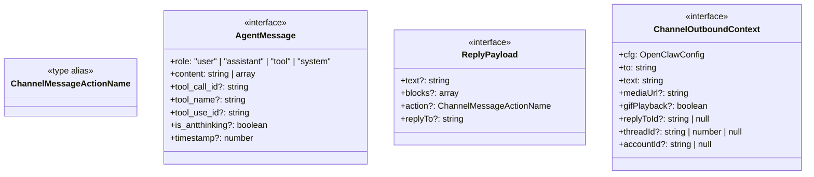

### 1.2 消息状态流转

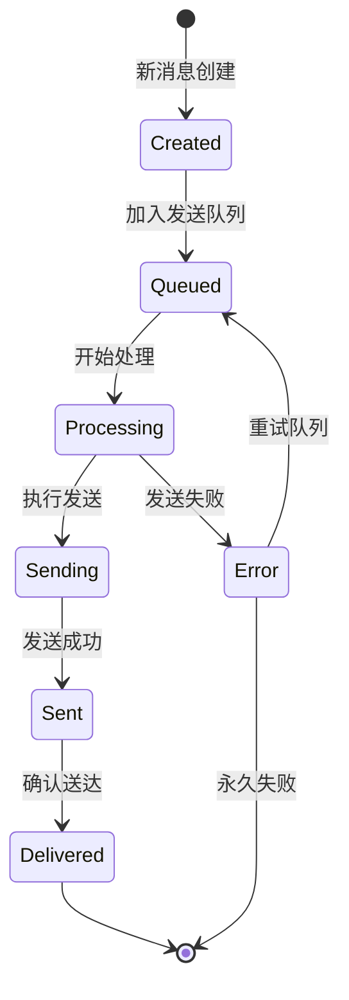

### 1.3 通道消息格式

```typescript
// 核心消息类型定义
interface ChannelMessage {
  channel: ChannelId;
  from: string;
  to: string;
  content: string;
  timestamp: number;
  threadId?: string | number;
  replyToId?: string;
  media?: ChannelMedia[];
  metadata?: Record<string, unknown>;
}

interface ChannelMedia {
  type: "image" | "video" | "audio" | "file";
  url: string;
  mimeType?: string;
  size?: number;
}
```

---

## 2. 会话系统

### 2.1 会话数据结构

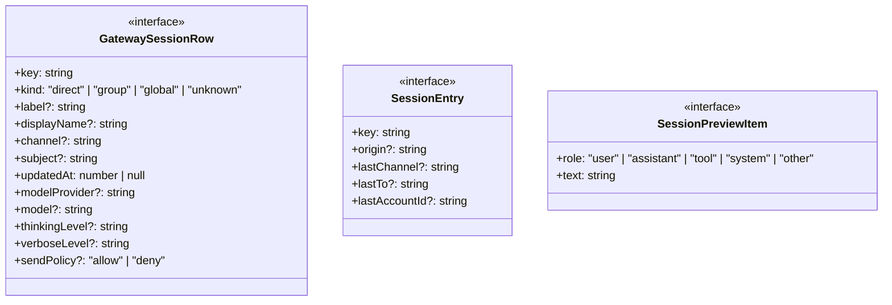

### 2.2 会话生命周期

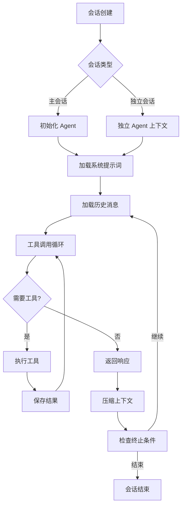

### 2.3 主会话 vs 独立会话

```typescript
// 会话相关类型
type SessionKey = string;
type SessionType = "main" | "subagent";

interface SessionContext {
  sessionKey: SessionKey;
  type: SessionType;
  agentId: string;
  parentSessionKey?: string;
  workspaceDir: string;
  model?: string;
  thinkingLevel?: "off" | "low" | "high";
  verboseLevel?: "off" | "low" | "high";
}

interface SubagentSpawnParams {
  agentId: string;
  sessionKey?: string;
  model?: string;
  message?: string;
  announce?: boolean;
}
```

---

## 3. Agent 系统

### 3.1 Agent 配置结构

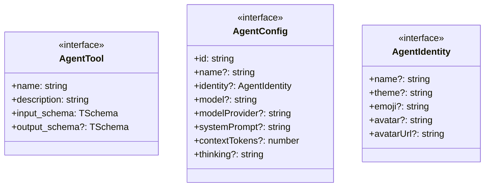

### 3.2 工具调用链路

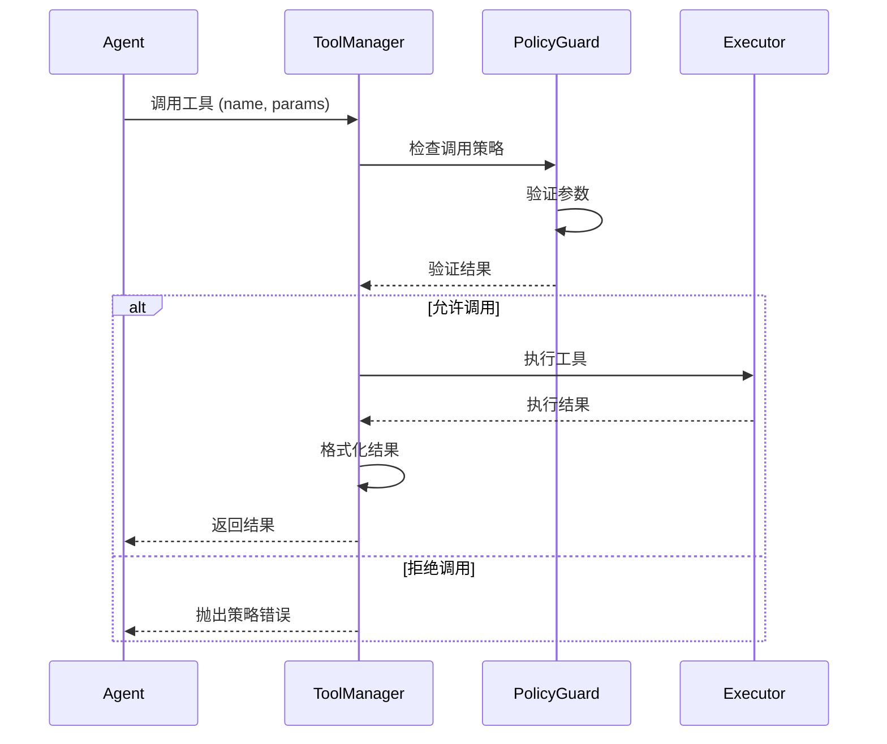

### 3.3 上下文窗口管理

```typescript
// Agent 相关类型
interface ContextWindowConfig {
  maxTokens: number;
  warningThreshold: number;
  compactionThreshold: number;
}

interface CompactionResult {
  messageCount: number;
  tokenCount: number;
  compactedCount: number;
  preservedCount: number;
}

interface ToolCallRecord {
  callId: string;
  toolName: string;
  params: Record<string, unknown>;
  startTime: number;
  endTime?: number;
  result?: unknown;
  error?: string;
}
```

---

## 4. 工具系统

### 4.1 工具定义结构

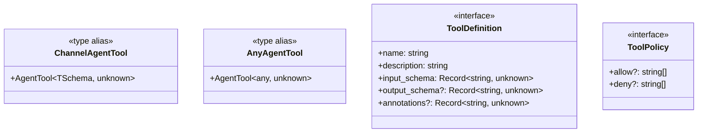

### 4.2 工具执行流程

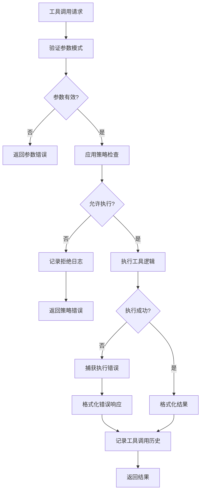

### 4.3 工具策略配置

```typescript
// 工具系统类型
type ToolProfileId = "minimal" | "coding" | "messaging" | "full";

interface ToolProfilePolicy {
  allow?: string[];
  deny?: string[];
}

interface ToolInvocationPolicy {
  userInvocable: boolean;
  disableModelInvocation: boolean;
}

const TOOL_GROUPS: Record<string, string[]> = {
  "group:memory": ["memory_search", "memory_get"],
  "group:web": ["web_search", "web_fetch"],
  "group:fs": ["read", "write", "edit", "apply_patch"],
  "group:runtime": ["exec", "process"],
  "group:sessions": ["sessions_list", "sessions_history", "sessions_send"],
  "group:openclaw": ["browser", "canvas", "nodes", "message", "gateway"],
};
```

---

## 5. 通道系统

### 5.1 通道配置结构

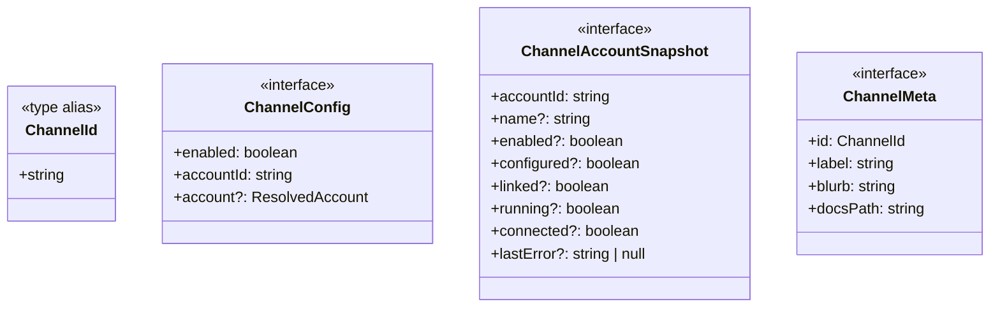

### 5.2 通道适配器架构

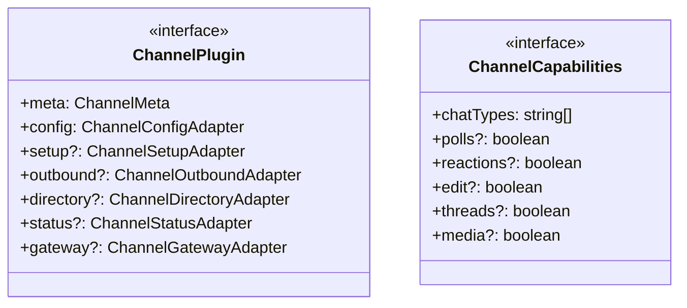

### 5.3 消息路由机制

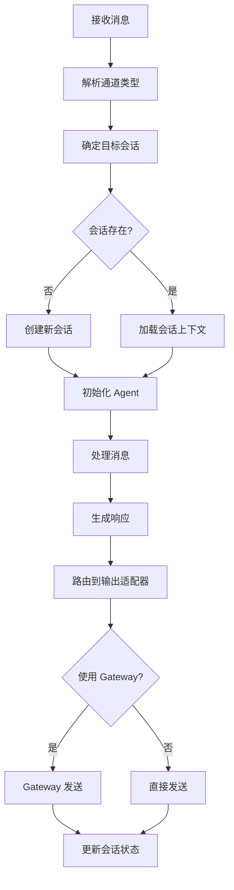

---

## 6. 记忆系统

### 6.1 记忆存储结构

```mermaid
classDiagram
    class MemoryManager {
        <<interface>>
        +search(query, opts): Promise~MemorySearchResult[]~
        +readFile(params): Promise~{text, path}~
        +status(): MemoryProviderStatus
        +sync(params?): Promise~void~
    }
    
    class MemorySearchResult {
        <<interface>>
        +path: string
        +startLine: number
        +endLine: number
        +score: number
        +snippet: string
        +source: MemorySource
    }
    
    class MemorySource {
        <<type alias>>
        +"memory" | "sessions"
    }
```

### 6.2 数据库 Schema

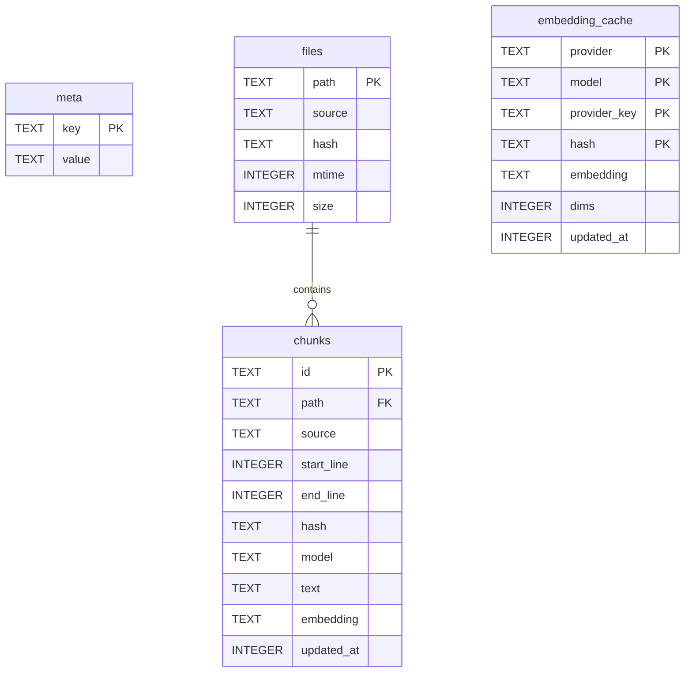

### 6.3 语义检索流程

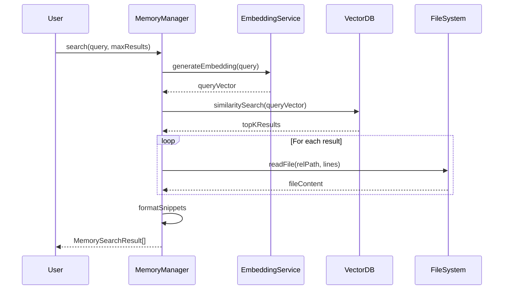

---

## 7. Gateway 核心结构

### 7.1 连接管理

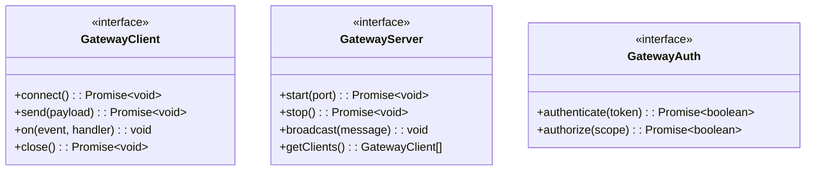

### 7.2 Gateway 消息路由

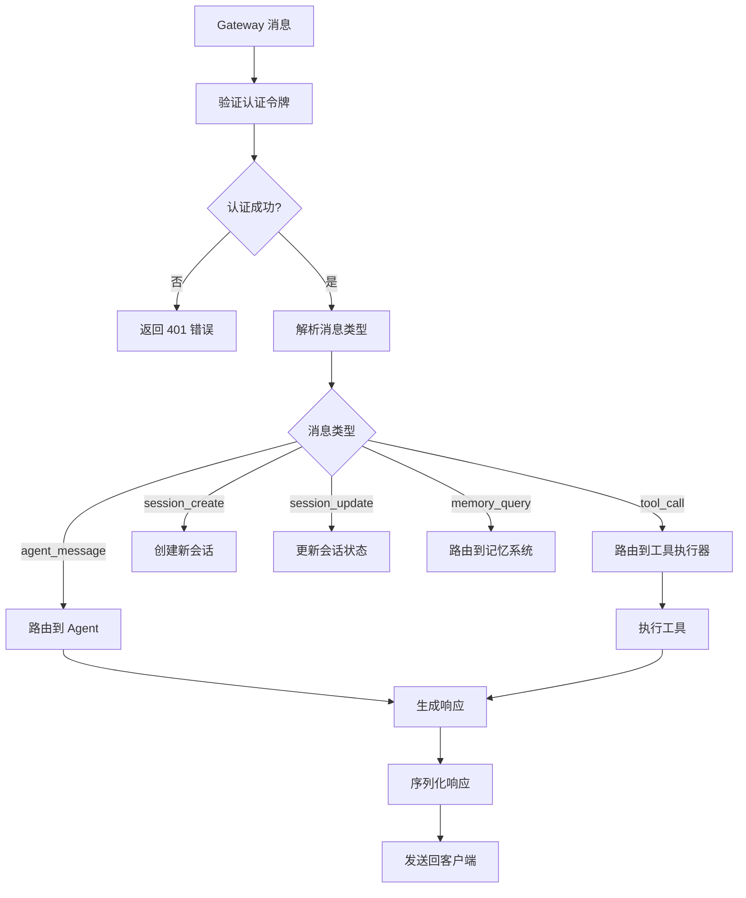

### 7.3 Gateway 连接状态

```typescript
// Gateway 核心类型
interface GatewayConnection {
  id: string;
  clientName: string;
  clientDisplayName?: string;
  mode: GatewayClientMode;
  url?: string;
  token?: string;
  connectedAt: number;
  lastActivityAt: number;
  status: "connecting" | "connected" | "disconnected" | "error";
}

type GatewayClientMode = "live" | "polling" | "webhook";

interface GatewayClientConfig {
  clientName: string;
  url?: string;
  token?: string;
  timeoutMs?: number;
  mode: GatewayClientMode;
}
```

---

## 8. 核心数据结构关系图

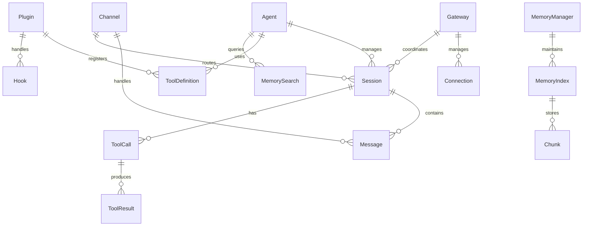

---

## 9. 数据流示例

### 9.1 消息处理数据流

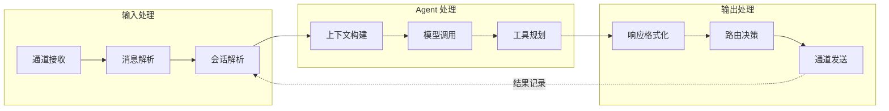

### 9.2 工具调用数据流

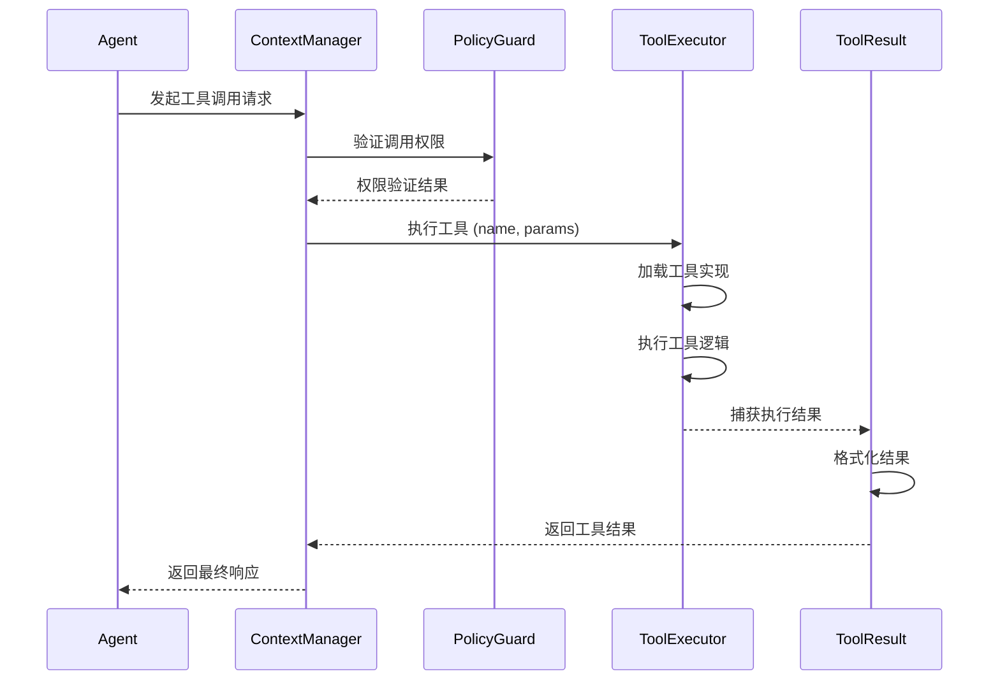

---

## 10. 关键类型定义

### 10.1 消息类型

```typescript
// 核心消息类型定义
import type { TSchema } from "@sinclair/typebox";
import type { AgentTool } from "@mariozechner/pi-agent-core";

// 消息角色类型
type MessageRole = "user" | "assistant" | "tool" | "system";

// 消息内容类型
type MessageContent = string | Array<ContentBlock>;

interface ContentBlock {
  type: "text" | "image" | "tool_use" | "tool_result";
  text?: string;
  media_url?: string;
  tool_use?: {
    id: string;
    name: string;
    input: Record<string, unknown>;
  };
  tool_result?: {
    id: string;
    content: string;
  };
}

// Agent 消息接口 (来自 pi-agent-core)
interface AgentMessage {
  role: MessageRole;
  content: MessageContent;
  timestamp?: number;
  // 工具相关
  tool_call_id?: string;
  tool_name?: string;
  tool_use_id?: string;
  // 思考标签
  is_antthinking?: boolean;
}

// 通道消息动作
type ChannelMessageActionName = 
  | "reaction"
  | "edit"
  | "unsend"
  | "reply"
  | "thread";

// 回复载荷
interface ReplyPayload {
  text?: string;
  blocks?: Array<Record<string, unknown>>;
  action?: ChannelMessageActionName;
  replyTo?: string;
}
```

### 10.2 会话类型

```typescript
// 会话相关类型
import type { NormalizedChatType } from "../channels/chat-type.js";
import type { SessionEntry } from "../config/sessions.js";
import type { DeliveryContext } from "../utils/delivery-context.js";

// 会话密钥类型
type SessionKey = string;

// 会话类型
type SessionKind = "direct" | "group" | "global" | "unknown";

// 会话行数据 (数据库存储)
interface GatewaySessionRow {
  key: SessionKey;
  kind: SessionKind;
  label?: string;
  displayName?: string;
  derivedTitle?: string;
  lastMessagePreview?: string;
  channel?: string;
  subject?: string;
  groupChannel?: string;
  space?: string;
  chatType?: NormalizedChatType;
  origin?: SessionEntry["origin"];
  updatedAt: number | null;
  sessionId?: string;
  systemSent?: boolean;
  abortedLastRun?: boolean;
  thinkingLevel?: string;
  verboseLevel?: string;
  reasoningLevel?: string;
  elevatedLevel?: string;
  sendPolicy?: "allow" | "deny";
  inputTokens?: number;
  outputTokens?: number;
  totalTokens?: number;
  responseUsage?: "on" | "off" | "tokens" | "full";
  modelProvider?: string;
  model?: string;
  contextTokens?: number;
  deliveryContext?: DeliveryContext;
  lastChannel?: SessionEntry["lastChannel"];
  lastTo?: string;
  lastAccountId?: string;
}

// 会话预览项
interface SessionPreviewItem {
  role: "user" | "assistant" | "tool" | "system" | "other";
  text: string;
}

// 会话预览结果
interface SessionsPreviewEntry {
  key: SessionKey;
  status: "ok" | "empty" | "missing" | "error";
  items: SessionPreviewItem[];
}

// 会话配置
interface SessionConfig {
  modelProvider: string | null;
  model: string | null;
  contextTokens: number | null;
  thinkingLevel?: string;
  verboseLevel?: string;
}
```

### 10.3 工具类型

```typescript
// 工具系统类型
import type { TSchema } from "@sinclair/typebox";
import type { AgentTool, AgentToolResult } from "@mariozechner/pi-agent-core";

// 工具配置
type ToolProfileId = "minimal" | "coding" | "messaging" | "full";

// 工具配置文件
interface ToolProfilePolicy {
  allow?: string[];
  deny?: string[];
}

// 工具策略来源
interface SandboxToolPolicySource {
  source: "agent" | "global" | "default";
  key: string;
}

// 解析后的工具策略
interface SandboxToolPolicyResolved {
  allow: string[];
  deny: string[];
  sources: {
    allow: SandboxToolPolicySource;
    deny: SandboxToolPolicySource;
  };
}

// 工具调用结果
type ToolResult<T = unknown> = 
  | { success: true; data: T }
  | { success: false; error: string };

// 工具执行上下文
interface ToolExecutionContext {
  toolName: string;
  params: Record<string, unknown>;
  sessionKey: string;
  agentId: string;
  sandboxed?: boolean;
}

// 工具调用记录
interface ToolCallRecord {
  callId: string;
  toolName: string;
  params: Record<string, unknown>;
  startTime: number;
  endTime?: number;
  result?: unknown;
  error?: string;
  durationMs?: number;
}
```

### 10.4 通道类型

```typescript
// 通道系统类型
import type { ChannelId } from "./plugins/types.core.js";

// 通道元数据
interface ChannelMeta {
  id: ChannelId;
  label: string;
  selectionLabel: string;
  docsPath: string;
  docsLabel?: string;
  blurb: string;
  order?: number;
  aliases?: string[];
  systemImage?: string;
  showConfigured?: boolean;
}

// 通道账户状态
type ChannelAccountState =
  | "linked"
  | "not linked"
  | "configured"
  | "not configured"
  | "enabled"
  | "disabled";

// 账户快照
interface ChannelAccountSnapshot {
  accountId: string;
  name?: string;
  enabled?: boolean;
  configured?: boolean;
  linked?: boolean;
  running?: boolean;
  connected?: boolean;
  reconnectAttempts?: number;
  lastConnectedAt?: number | null;
  lastDisconnect?: {
    at: number;
    status?: number;
    error?: string;
    loggedOut?: boolean;
  } | null;
  lastMessageAt?: number | null;
  lastError?: string | null;
}

// 通道能力
interface ChannelCapabilities {
  chatTypes: Array<NormalizedChatType | "thread">;
  polls?: boolean;
  reactions?: boolean;
  edit?: boolean;
  unsend?: boolean;
  reply?: boolean;
  effects?: boolean;
  groupManagement?: boolean;
  threads?: boolean;
  media?: boolean;
  nativeCommands?: boolean;
  blockStreaming?: boolean;
}

// 通道目录条目
interface ChannelDirectoryEntry {
  kind: "user" | "group" | "channel";
  id: string;
  name?: string;
  handle?: string;
  avatarUrl?: string;
  rank?: number;
  raw?: unknown;
}
```

---

## 11. 内存 vs 持久化

### 11.1 内存数据结构

```typescript
// 内存中临时数据结构

// 会话状态 (内存)
interface SessionRuntimeState {
  key: SessionKey;
  messages: AgentMessage[];
  contextTokens: number;
  lastActivityAt: number;
  isActive: boolean;
  currentModel?: string;
  toolCallHistory: ToolCallRecord[];
}

// Agent 运行时状态
interface AgentRuntimeState {
  agentId: string;
  config: AgentConfig;
  isRunning: boolean;
  currentSession?: SessionRuntimeState;
  toolPolicy: ToolProfilePolicy;
  embeddedSandbox?: SandboxContext;
}

// 通道连接状态
interface ChannelConnectionState {
  accountId: string;
  isConnected: boolean;
  lastPingAt: number;
  reconnectAttempts: number;
  pendingMessages: ReplyPayload[];
}

// 工具调用缓存
interface ToolCallCache {
  toolName: string;
  paramsHash: string;
  result: unknown;
  expiresAt: number;
}

// 上下文窗口状态
interface ContextWindowState {
  usedTokens: number;
  maxTokens: number;
  warningThreshold: number;
  compactionNeeded: boolean;
}
```

### 11.2 持久化结构

```typescript
// 持久化存储格式

// 会话文件结构 (JSON)
interface SessionFile {
  version: number;
  key: SessionKey;
  agentId: string;
  createdAt: number;
  updatedAt: number;
  metadata: {
    channel?: string;
    to?: string;
    subject?: string;
  };
  config: {
    modelProvider?: string;
    model?: string;
    thinkingLevel?: string;
  };
  messages: AgentMessage[];
}

// 认证配置文件 (JSON)
interface AuthProfileStore {
  version: number;
  profiles: Record<string, AuthProfileCredential>;
  order?: Record<string, string[]>;
  lastGood?: Record<string, string>;
  usageStats?: Record<string, ProfileUsageStats>;
}

// 配置快照 (JSON)
interface ConfigSnapshot {
  version: number;
  channels: Record<string, ChannelConfig>;
  agents: Record<string, AgentConfig>;
  plugins: Record<string, PluginConfig>;
  sandboxes?: SandboxConfig;
  memory?: MemoryProviderStatus;
}

// 记忆索引数据库 (SQLite)
interface MemoryIndexSchema {
  meta: { key: string; value: string };
  files: { path: string; source: string; hash: string; mtime: number; size: number };
  chunks: { 
    id: string; 
    path: string; 
    source: string;
    start_line: number; 
    end_line: number; 
    hash: string; 
    model: string; 
    text: string; 
    embedding: string;
    updated_at: number 
  };
  embedding_cache: {
    provider: string;
    model: string;
    provider_key: string;
    hash: string;
    embedding: string;
    dims: number;
    updated_at: number;
  };
}
```

---

## 附录：文件位置索引

| 模块 | 关键文件 | 说明 |
|------|---------|------|
| **Agent** | `src/agents/context.ts` | Agent 上下文定义 |
| **Agent** | `src/agents/sandbox/types.ts` | 沙箱配置类型 |
| **Agent** | `src/agents/skills/types.ts` | 技能类型定义 |
| **Agent** | `src/agents/auth-profiles/types.ts` | 认证配置类型 |
| **Channel** | `src/channels/plugins/types.core.ts` | 通道核心类型 |
| **Channel** | `src/channels/plugins/types.adapters.ts` | 通道适配器类型 |
| **Channel** | `src/channels/session.ts` | 会话通道类型 |
| **Gateway** | `src/gateway/session-utils.types.ts` | Gateway 会话类型 |
| **Memory** | `src/memory/types.ts` | 记忆系统类型 |
| **Memory** | `src/memory/memory-schema.ts` | 记忆数据库 Schema |
| **Plugin** | `src/plugins/types.ts` | 插件系统类型 |
| **Tool** | `src/agents/tool-policy.ts` | 工具策略类型 |

---

*文档生成时间: 2026-02-08*
*OpenClaw 版本: 基于代码分析*
