# OpenClaw FAQ - 常见问题解答

> 本文档收集 OpenClaw 源码中比较难理解的问题和概念，持续更新。

## 目录

- [基础概念](#基础概念)
- [架构设计](#架构设计)
- [Agent 运行时](#agent-运行时)
- [Skills 系统](#skills-系统)
- [消息系统](#消息系统)
- [通道系统](#通道系统)
- [记忆系统](#记忆系统)
- [工具系统](#工具系统)
- [安全与沙箱](#安全与沙箱)
- [部署与配置](#部署与配置)
- [常见错误排查](#常见错误排查)

---

## 基础概念

### Q1: OpenClaw 是什么？它和 Claude/ChatGPT 有什么不同？

**Answer:**

OpenClaw 是一个 **AI Agent 运行时框架**，而不仅仅是聊天机器人。

**核心区别：**

| 特性 | OpenClaw | Claude/ChatGPT |
|------|----------|----------------|
| **本质** | Agent 运行时框架 | AI 聊天应用 |
| **交互方式** | 多通道（QQ/微信/Discord/Telegram等） | 仅 Web/App |
| **工具能力** | 动态加载 Skills，可执行任意命令 | 有限的工具调用 |
| **记忆** | 长期记忆 + 每日笔记 + 向量检索 | 会话级记忆 |
| **定制性** | 高度可定制，插件化架构 | 封闭系统 |

**简单说：**
- Claude/ChatGPT 是"汽车"（成品，直接开）
- OpenClaw 是"汽车工厂"（可以造各种车，定制化）

---

### Q2: 什么是 Skills？它和 Plugins 有什么区别？

**Answer:**

**Skills（技能包）：**
- **用途**：为 Agent 提供特定领域的知识和工作流程
- **内容**：Markdown 文档 + 可选脚本/资源
- **加载方式**：渐进式披露（Metadata → Body → Resources）
- **数量**：54+ 社区贡献的 Skills
- **示例**：`ssh-remote-exec`、`docker-management`、`weather` 等

**Plugins（插件）：**
- **用途**：扩展 OpenClaw 核心功能
- **内容**：TypeScript/Go 代码模块
- **加载方式**：动态加载到 Gateway
- **数量**：33+ 核心扩展
- **示例**：通道插件（WhatsApp、Telegram）、工具插件（exec、read）

**对比表：**

| 维度 | Skills | Plugins |
|------|--------|---------|
| **本质** | 知识/流程封装 | 功能扩展 |
| **实现** | Markdown + 脚本 | TypeScript/Go 代码 |
| **触发** | 用户 query 匹配 | Gateway 自动加载 |
| **修改** | 用户可直接编辑 | 需要开发能力 |
| **分发** | ClawHub 分享 | 源码集成 |

---

### Q3: 主会话和独立会话有什么区别？

**Answer:**

OpenClaw 支持两种 Agent 运行模式：

### 主会话 (Main Session)

**特点：**
- 与用户直接交互的唯一会话
- 长期存在，生命周期与用户会话绑定
- 访问完整上下文（历史消息 + 长期记忆）
- 可以调用所有可用工具
- **会加载 MEMORY.md**（用户长期偏好/知识）

**使用场景：**
- 日常对话
- 复杂任务处理
- 需要长期记忆的任务

### 独立会话 (Isolated Session)

**特点：**
- 临时创建的子会话
- 任务完成后可自动删除
- **不会加载 MEMORY.md**（仅限当前任务上下文）
- 独立的沙箱环境（Docker）
- 有独立的执行超时限制

**使用场景：**
- Cron 定时任务
- 危险的工具调用（需要沙箱）
- 独立的分析任务
- 不需要长期记忆的一次性任务

**图示：**

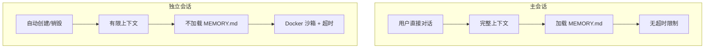

---

## 架构设计

### Q4: Gateway 是什么？为什么说它是中心化设计？

**Answer:**

**Gateway 是 OpenClaw 的中枢系统**，负责：
1. 消息路由（所有通道的消息都经过它）
2. 连接管理（WebSocket 长连接）
3. 认证授权
4. 通道协调
5. Agent 会话管理

### 架构位置

```
用户 ──► 消息通道(Telegram/QQ等) ──► Gateway(ws://127.0.0.1:18789) ──► Agent 运行时
                                                           │
                                                           ▼
                                                      工具执行引擎
```

### 为什么说中心化？

**优点：**
- ✅ 单一真相来源
- ✅ 易于管理连接状态
- ✅ 统一的认证和授权
- ✅ 简化消息路由逻辑

**缺点：**
- ⚠️ 单点故障风险
- ⚠️ 扩展性受限（单节点性能瓶颈）
- ⚠️ 所有通道共享同一 Gateway

### 替代方案（未来可能的方向）

- 分布式 Gateway 集群
- 通道级联模式（Gateway 之间的路由）
- 边缘计算（轻量级节点 + 中心 Gateway）

---

### Q5: 消息是如何从 QQ/Telegram 到达 Agent 的？

**Answer:**

完整消息流：

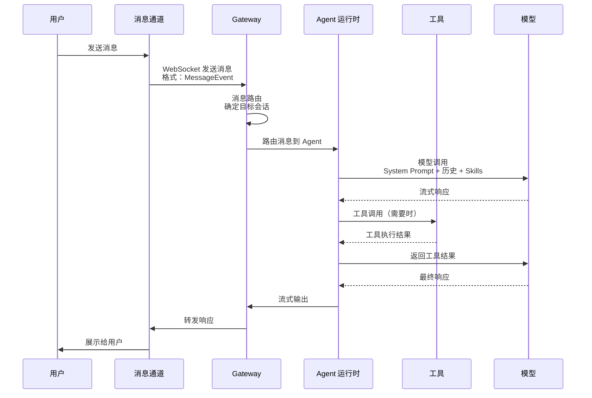

**关键步骤：**

1. **通道适配器**：将各平台消息格式转换为内部统一格式
2. **消息路由器**：根据会话 ID 路由到正确的 Agent
3. **上下文构建器**：组装 System Prompt + 历史消息 + 适用 Skills
4. **模型调用器**：发送请求到 AI 模型
5. **工具执行器**：解析模型输出的工具调用，执行并返回结果
6. **流式输出**：将响应流式返回给用户

---

## Agent 运行时

### Q6: Agent 上下文中包含哪些内容？

**Answer:**

Agent 上下文是一个分层结构：

```
┌─────────────────────────────────────────────┐
│           Agent 完整上下文                    │
├─────────────────────────────────────────────┤
│  1. System Prompt（系统提示词）              │
│     - SOUL.md 内容                          │
│     - AGENTS.md 指令                        │
│     - 动态生成的指令                         │
├─────────────────────────────────────────────┤
│  2. 用户历史消息                             │
│     - 当前会话消息                           │
│     - 重要历史消息（摘要后）                 │
├─────────────────────────────────────────────┤
│  3. 适用 Skills（渐进式披露）                │
│     - Skill Metadata（总是加载）             │
│     - SKILL.md Body（条件加载）             │
│     - Bundled Resources（按需加载）          │
├─────────────────────────────────────────────┤
│  4. 工具定义列表                             │
│     - 工具名称和描述                         │
│     - 参数模式                               │
├─────────────────────────────────────────────┤
│  5. 工具执行历史                             │
│     - 已调用的工具列表                       │
│     - 工具执行结果                           │
├─────────────────────────────────────────────┤
│  6. 长期记忆（仅主会话）                     │
│     - MEMORY.md 内容                        │
├─────────────────────────────────────────────┤
│  7. 项目上下文（workspace files）            │
│     - SOUL.md, USER.md                     │
│     - HEARTBEAT.md                         │
│     - 其他用户配置文件                       │
└─────────────────────────────────────────────┘
```

---

### Q7: 上下文窗口是如何管理的？如何防止溢出？

**Answer:**

OpenClaw 使用 **动态上下文压缩** 机制：

### 压缩触发条件

- Token 数量接近模型限制（通常是 80% 阈值）
- 连续多次模型调用
- 长时间会话

### 压缩策略

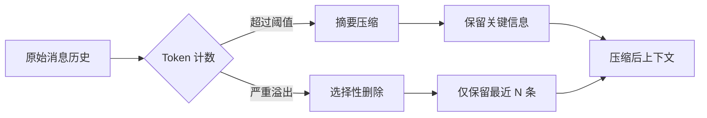

**保留优先级：**
1. System Prompt（永不删除）
2. 工具定义（必需）
3. Skills（按需加载）
4. 工具执行历史（保留摘要）
5. 用户消息（保留最近 20-50 条）
6. AI 响应（可大幅压缩）

### 手动触发压缩

用户可以要求 Agent 压缩上下文：
- "压缩一下上下文"
- "清理一下历史"

---

### Q8: 工具调用的完整流程是什么？

**Answer:**

工具调用是 OpenClaw 的核心能力：

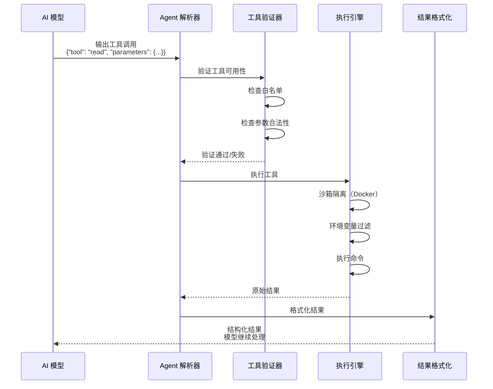

### 工具调用格式

```typescript
interface ToolCall {
  tool: string;           // 工具名称
  parameters: Record<string, any>; // 参数对象
  id?: string;            // 调用 ID（用于引用）
}

interface ToolResult {
  success: boolean;
  output?: string;       // 输出内容
  error?: string;        // 错误信息
  metadata?: {
    executionTime: number;
    exitCode: number;
  };
}
```

---

## Skills 系统

### Q9: Skills 是如何被触发的？什么条件会加载某个 Skill？

**Answer:**

Skills 使用 **渐进式披露** 机制：

### 三层加载流程

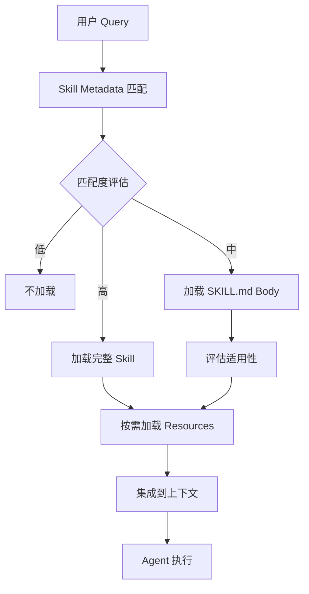

### 触发条件

**1. Metadata 层（总是加载）**
- Frontmatter 中的 `name` 和 `description`
- 简短关键词匹配

**2. Body 层（条件加载）**
- 用户 query 包含 Skill 描述中的关键词
- 明确表达需要该 Skill 的功能
- 模糊匹配 + 语义相似度

**3. Resources 层（按需加载）**
- 执行到需要脚本的步骤
- 引用到 reference 文档
- 使用到 asset 资源

### 示例

```
用户: "帮我远程重启 nginx"

匹配分析:
├── ssh-remote-exec (高匹配) ✓
│   ├── Metadata: "SSH remote execution" ✓
│   └── Body: "Docker management" ✓
│
└── docker-management (低匹配) ✗
    └── 不相关
```

---

### Q10: Skill 的 frontmatter 包含哪些字段？

**Answer:**

每个 Skill 的 `SKILL.md` 以 YAML frontmatter 开头：

```yaml
---
name: skill-name-here
description: |
  详细的技能描述
  可以多行
  说明用途和触发条件
metadata:
  {
    "openclaw": {
      "requires": { "bins": ["command"] },
      "install": [...]
    },
    "example": "usage example"
  }
---
```

### 字段说明

| 字段 | 必填 | 说明 |
|------|------|------|
| `name` | ✅ | Skill 名称（小写、中划线） |
| `description` | ✅ | 详细描述，用于匹配 |
| `metadata` | ❌ | 附加元数据 |
| `metadata.openclaw.requires.bins` | ❌ | 依赖的系统命令 |
| `metadata.openclaw.install` | ❌ | 安装指令 |

### 示例

```yaml
---
name: weather
description: |
  Get current weather and forecasts.
  Use when user asks about:
  - Current temperature
  - Weather forecast
  - Rain/snow prediction
  - Weather alerts
---
```

---

## 消息系统

### Q11: 消息类型有哪些？有什么区别？

**Answer:**

OpenClaw 定义了多种消息类型：

```typescript
enum MessageType {
  TEXT = "text",           // 普通文本
  IMAGE = "image",         // 图片
  VIDEO = "video",         // 视频
  AUDIO = "audio",         // 音频
  FILE = "file",           // 文件
  SYSTEM = "system",       // 系统消息
  TOOL_CALL = "tool_call", // 工具调用
  TOOL_RESULT = "tool_result", // 工具结果
  REACTION = "reaction",   // 表情反应
  EDIT = "edit",           // 消息编辑
  DELETE = "delete",       // 消息删除
}
```

### 消息状态

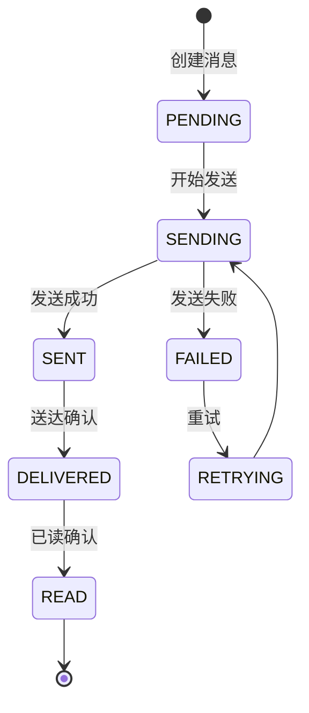

---

### Q12: 消息路由是如何工作的？

**Answer:**

消息路由决定消息从哪里来、到哪里去：

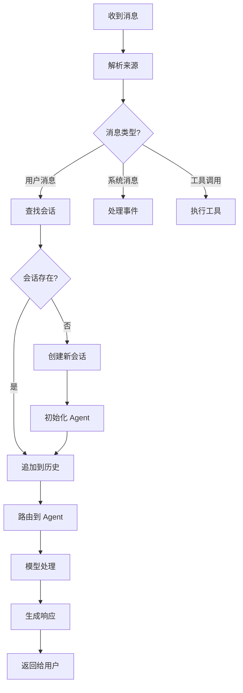

### 路由规则优先级

1. **精确匹配**：会话 ID 完全匹配
2. **通道 + 发送者**：同一通道的同一用户
3. **主题匹配**：基于话题的会话关联
4. **新建会话**：无匹配时创建

---

## 通道系统

### Q13: 通道适配器是如何工作的？

**Answer:**

每个消息通道都有一个适配器，负责：

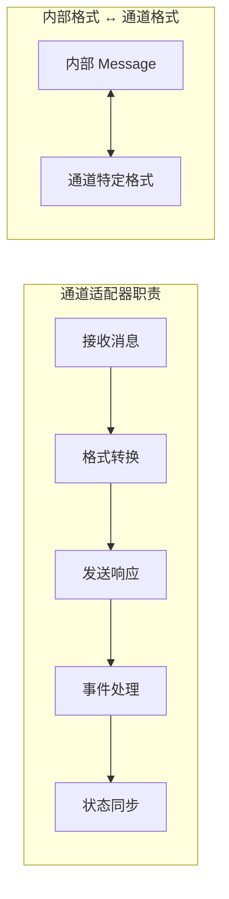

### 示例：Telegram 适配器

```
Telegram Bot API         OpenClaw 内部格式
┌──────────────────┐    ┌──────────────────┐
│ Update Object    │ ─► │ Message Event   │
│ - message.text   │    │ - content.text  │
│ - message.from   │    │ - author.id     │
│ - chat.id        │    │ - channel.id    │
└──────────────────┘    └──────────────────┘
```

### 支持的通道

| 通道 | 类型 | 协议 | 特点 |
|------|------|------|------|
| Telegram | IM | Bot API | 官方支持，完整功能 |
| Discord | 社区 | Bot API | 丰富的交互 |
| WhatsApp | IM | Web/Cloud | 支持多媒体 |
| QQ | IM | OneBot | 国内常用 |
| WeCom | 企业 | 企业 API | 集成办公 |
| DingTalk | 企业 | 钉钉 API | 审批集成 |
| Feishu | 企业 | 飞书 API | 文档协作 |
| Signal | IM | Signal API | 加密通信 |

---

### Q14: 可以在同一台服务器上运行多个通道吗？

**Answer:**

**可以**，但有一些注意事项：

### 方案 1：单 Gateway 多通道（推荐）

```
Gateway (ws://127.0.0.1:18789)
    ├── Telegram 适配器
    ├── QQ 适配器
    └── Discord 适配器
```

**优点：**
- ✅ 资源共享
- ✅ 统一管理
- ✅ 简单部署

**缺点：**
- ⚠️ 共享连接限额
- ⚠️ 故障影响范围大

### 方案 2：多 Gateway 分布式

```
Gateway-1 (Telegram) ─┐
Gateway-2 (QQ)      ──┼── 共享配置/数据库
Gateway-3 (Discord) ─┘
```

**优点：**
- ✅ 故障隔离
- ✅ 独立扩展
- ✅ 独立配置

**缺点：**
- ⚠️ 配置复杂
- ⚠️ 需要共享存储

### 注意事项

- **Webhooks**：某些通道需要公网可访问
- **Rate Limits**：各平台有限制，需要合理分配
- **Token 管理**：每个通道需要独立的 API Token

---

## 记忆系统

### Q15: MEMORY.md 和 daily notes 有什么区别？

**Answer:**

OpenClaw 有三层记忆系统：

### 记忆对比表

| 特性 | MEMORY.md | daily notes | 会话历史 |
|------|-----------|-------------|----------|
| **加载时机** | 仅主会话 | 每次会话 | 自动加载 |
| **格式** | Markdown | Markdown | JSONL |
| **内容** | 长期知识/偏好 | 每日记录 | 原始消息 |
| **持久化** | 手动更新 | 自动创建 | 自动记录 |
| **检索** | 语义搜索 | 关键词搜索 | 全文搜索 |
| **清理策略** | 手动维护 | 自动归档 | 自动压缩 |

### 记忆加载优先级

```mermaid
graph TD
    A[用户会话开始] --> B[加载 MEMORY.md<br/>(主会话)]
    B --> C[加载 daily notes<br/>(相关日期)]
    C --> D[加载会话历史<br/>(摘要)]
    D --> E[构建完整上下文]
```

### 使用建议

**MEMORY.md 存储：**
- 用户偏好（"喜欢用 Vim"）
- 重要决策（"使用 PostgreSQL"）
- 长期知识（"项目架构是微服务"）
- 敏感信息（GitHub Token）

**daily notes 存储：**
- 今日待办
- 会议记录
- 临时发现
- 实验结果

**会话历史：**
- 原始对话
- 工具调用记录
- 错误日志

---

### Q16: 语义搜索是如何工作的？

**Answer:**

OpenClaw 使用 **sqlite-vec** 进行语义搜索：

### 技术栈

- **向量数据库**：sqlite-vec（SQLite 扩展）
- **嵌入模型**：sentence-transformers
- **相似度计算**：余弦相似度

### 工作流程

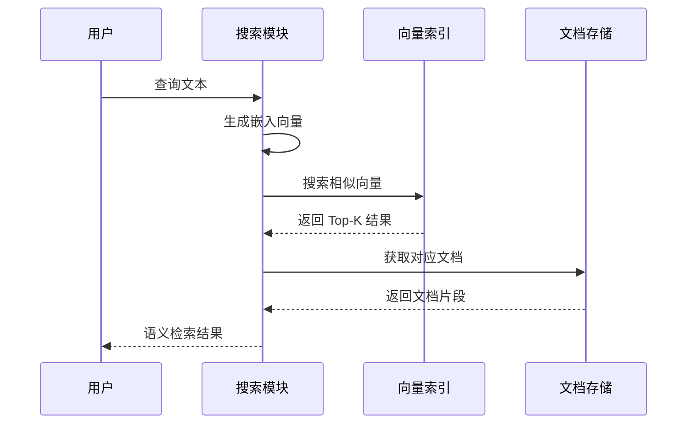

### 向量化流程

```
用户输入
    │
    ▼
┌─────────────────┐
│ Sentence Transformer │
│   (all-MiniLM-L6-v2) │
└────────┬────────┘
         │
         ▼
┌─────────────────┐
│  384 维向量     │
│  [0.123, ...]   │
└────────┬────────┘
         │
         ▼
┌─────────────────┐
│   存入 SQLite   │
│   vec0 表       │
└─────────────────┘
```

### 使用示例

```typescript
// 语义搜索记忆
const results = await semanticSearch(
  query: "用户在GitHub的设置",
  memoryDir: "./workspace",
  maxResults: 5
);
```

---

## 工具系统

### Q17: 工具白名单和黑名单是如何工作的？

**Answer:**

工具系统使用 **策略引擎** 控制工具访问：

### 策略配置

```typescript
interface ToolPolicy {
  // 白名单模式
  allowPatterns: string[];
  
  // 黑名单模式
  denyPatterns: string[];
  
  // 危险命令阻止
  dangerousCommands: string[];
  
  // 审批要求
  requireApproval: string[];
}
```

### 执行流程

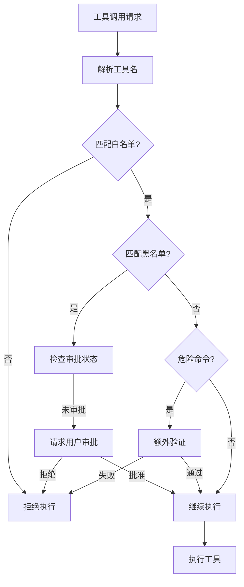

### 示例配置

```yaml
toolPolicy:
  # 允许的工具（默认全部允许）
  allow:
    - "read"
    - "write"
    - "exec"
    - "browser.*"
  
  # 禁止的工具
  deny:
    - "delete.*"  # 禁止删除操作
    - "format"     # 禁止格式化
  
  # 需要审批的工具
  requireApproval:
    - "exec"  # 执行命令需要审批
    - "browser.*"  # 浏览器操作需要审批
```

---

### Q18: 沙箱隔离是如何实现的？

**Answer:**

OpenClaw 使用 Docker 实现沙箱隔离：

### 隔离级别

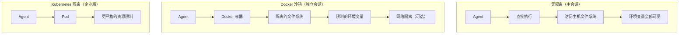

### Docker 配置

```typescript
interface SandboxConfig {
  // 基础配置
  image: string;           // 镜像
  memoryLimit: string;    // 内存限制
  cpuLimit: number;        // CPU 限制
  
  // 持久化卷
  volumes: {
    source: string;
    target: string;
    readOnly: boolean;
  }[];
  
  // 环境变量
  envWhitelist: string[];  // 允许的环境变量
  envBlacklist: string[]; // 阻止的环境变量
  
  // 安全选项
  readOnlyRoot: boolean;   // 根文件系统只读
  noNewPrivileges: boolean; // 禁止提权
  networkMode: string;     // 网络模式（bridge/none/host）
}
```

### 环境变量黑名单（默认阻止）

```bash
# 危险的环境变量
LD_*           # 链接器变量（可注入代码）
DYLD_*         # macOS 动态链接器
NODE_OPTIONS   # Node.js 选项（可执行任意代码）
BASH_ENV       # Bash 启动脚本
ENV            # 任意 shell 启动脚本
```

---

## 安全与沙箱

### Q19: DM（Direct Message）陌生人配对机制是什么？

**Answer:**

**DM 陌生人配对** 是 OpenClaw 的安全机制，用于处理陌生人发来的私信：

### 策略模式

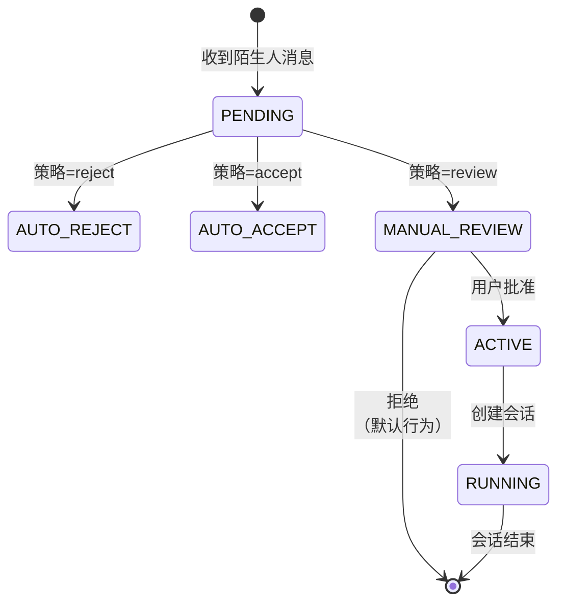

### 配对策略

| 策略 | 说明 | 使用场景 |
|------|------|----------|
| `reject` | 自动拒绝所有陌生人 | 高安全需求 |
| `accept` | 自动接受所有陌生人 | 低风险环境 |
| `review` | 需要用户手动批准 | 平衡安全与便利 |

### 配置示例

```yaml
dmPolicy:
  strategy: "review"  # 默认：需要审批
  
  # 自动接受的白名单
  autoAcceptFrom:
    - "friend:*"
    - "whitelist:*"
  
  # 触发审查的关键词
  triggerKeywords:
    - "密码"
    - "Token"
    - "API Key"
```

---

### Q20: 如何安全地使用远程访问（Tailscale/SSH Tunnel）？

**Answer:**

### 架构对比

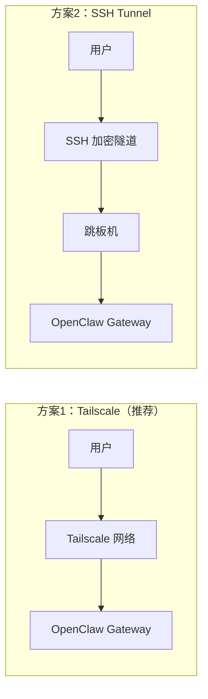

### Tailscale 模式（推荐）

**优点：**
- ✅ Zero-config 自动组网
- ✅ 内置 WireGuard 加密
- ✅ ACL 访问控制
- ✅ NAT 穿透

**配置：**

```yaml
remoteAccess:
  type: "tailscale"
  enabled: true
  authKey: "${TAILSCALE_AUTHKEY}"
  advertiseRoutes:
    - "192.168.1.0/24"
```

### SSH Tunnel 模式

**优点：**
- ✅ 成熟稳定
- ✅ 广泛支持
- ✅ 可审计

**配置：**

```bash
# 创建隧道
ssh -N -L 18789:localhost:18789 user@gateway-host

# 或反向隧道
ssh -N -R 18789:localhost:18789 user@gateway-host
```

### 安全最佳实践

1. **使用短生命 Token**
2. **限制访问 IP 范围**
3. **启用审计日志**
4. **定期轮换密钥**
5. **使用双因素认证**

---

## 部署与配置

### Q21: 如何选择部署方式？

**Answer:**

### 部署方式对比

| 方式 | 难度 | 扩展性 | 成本 | 适用场景 |
|------|------|--------|------|----------|
| **本地开发** | ⭐ | 低 | 低 | 开发测试 |
| **Docker** | ⭐⭐ | 中 | 低 | 个人/小团队 |
| **Systemd** | ⭐⭐ | 中 | 中 | 生产部署 |
| **Kubernetes** | ⭐⭐⭐⭐ | 高 | 高 | 企业级 |

### 推荐选择

**个人/开发：**
```
本地运行 + ngrok 暴露
```

**小团队（<100用户）：**
```
Docker Compose + 反向代理
```

**中大型团队：**
```
Kubernetes + 分布式 Gateway
```

### 配置示例（Docker Compose）

```yaml
version: '3.8'

services:
  gateway:
    image: openclaw/gateway:latest
    ports:
      - "18789:18789"
    volumes:
      - ./config:/app/config
      - ./data:/app/data
    environment:
      - DATABASE_URL=sqlite:///data/openclaw.db
      - TZ=Asia/Shanghai

  telegram:
    image: openclaw/channel-telegram:latest
    depends_on:
      - gateway
    environment:
      - GATEWAY_URL=ws://gateway:18789
      - TELEGRAM_TOKEN=${TELEGRAM_TOKEN}
```

---

### Q22: 如何配置 AI 模型？

**Answer:**

OpenClaw 支持多种 AI 模型提供商：

### 配置示例

```yaml
models:
  # 默认模型
  default: "minimax"
  
  # MiniMax（当前使用）
  minimax:
    provider: "minimax"
    model: "MiniMax-M2.1"
    apiKey: "${MINIMAX_API_KEY}"
    baseUrl: "https://api.minimax.chat/v1"
  
  # Claude（可选）
  claude:
    provider: "anthropic"
    model: "claude-3-5-sonnet-20241022"
    apiKey: "${ANTHROPIC_API_KEY}"
    maxTokens: 100000
  
  # GPT-4（可选）
  gpt4:
    provider: "openai"
    model: "gpt-4"
    apiKey: "${OPENAI_API_KEY}"
  
  # 本地 Ollama（可选）
  ollama:
    provider: "ollama"
    model: "llama3.1"
    baseUrl: "http://localhost:11434"
```

### 模型选择策略

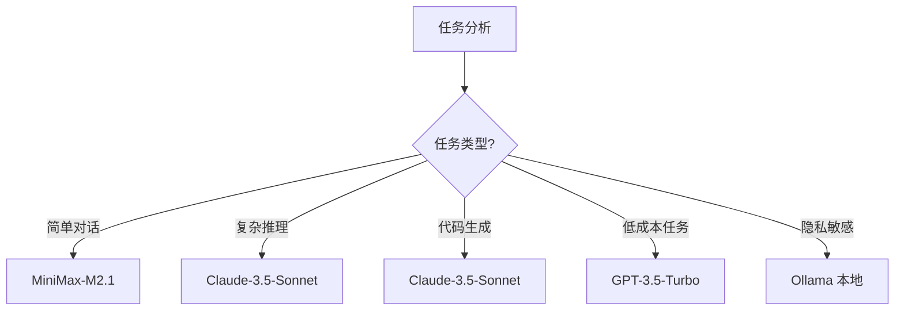

---

## 常见错误排查

### Q23: Gateway 连接失败怎么办？

**Answer:**

### 常见错误

```
Error: WebSocket connection to 'ws://127.0.0.1:18789' failed
```

### 排查步骤

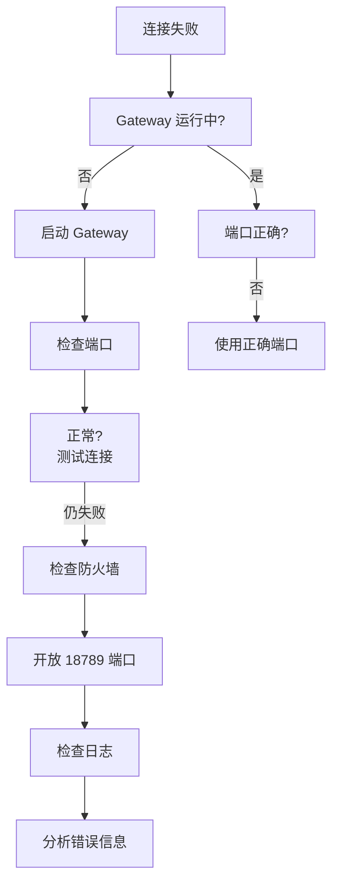

### 诊断命令

```bash
# 1. 检查 Gateway 状态
openclaw gateway status

# 2. 检查端口监听
netstat -tlnp | grep 18789

# 3. 测试本地连接
curl http://127.0.0.1:18789/health

# 4. 查看日志
tail -f ~/.local/share/openclaw/logs/gateway.log
```

---

### Q24: 工具调用失败怎么办？

**Answer:**

### 错误类型

| 错误码 | 说明 | 解决方案 |
|--------|------|----------|
| `TOOL_NOT_FOUND` | 工具不存在 | 检查工具名拼写 |
| `PERMISSION_DENIED` | 无权限 | 检查白名单配置 |
| `EXECUTION_FAILED` | 执行失败 | 检查命令语法 |
| `TIMEOUT` | 超时 | 增加超时时间 |
| `SANDBOX_ERROR` | 沙箱错误 | 检查 Docker 状态 |

### 排查流程

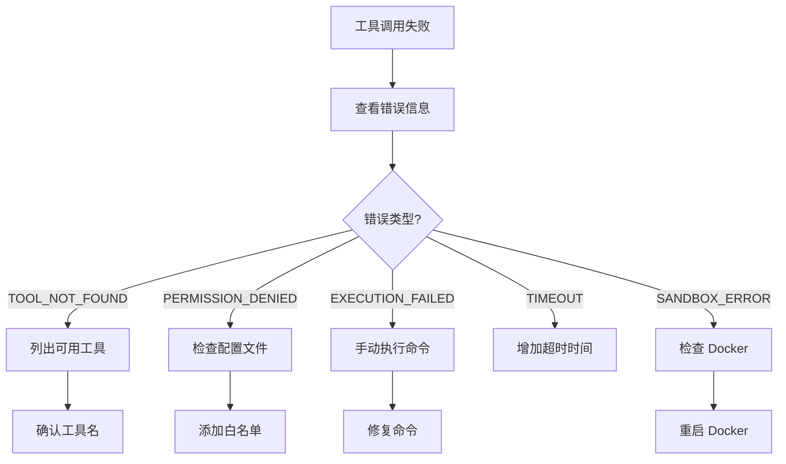

### 诊断命令

```bash
# 列出可用工具
openclaw tools list

# 测试工具调用
openclaw exec test --tool read --path /tmp/test.txt

# 查看工具策略
openclaw config get toolPolicy

# 检查 Docker 状态
docker ps
docker logs openclaw-sandbox
```

---

### Q25: 消息发不出去怎么办？

**Answer:**

### 常见原因

1. **通道未连接**
2. **API Token 过期**
3. **网络问题**
4. **消息格式错误**
5. **频率限制**

### 排查步骤

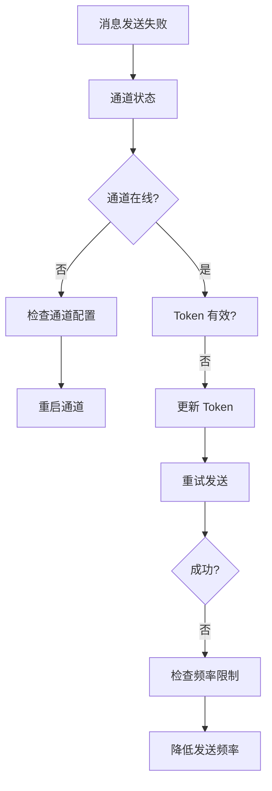

### 诊断命令

```bash
# 查看通道状态
openclaw channels status

# 测试通道连接
openclaw channels test telegram

# 查看发送日志
openclaw logs --channel telegram

# 重新授权
openclaw channels auth telegram --reauth
```

---

## 贡献指南

### 如何添加新问题

1. **确认问题**：先确认问题是通用的（非特定用户问题）
2. **分类**：选择合适的章节
3. **格式**：使用标准 Q&A 模板
4. **代码**：包含示例代码和 Mermaid 图表
5. **测试**：确保解答准确

### Q&A 模板

```markdown
### QXX: 问题标题

**Answer:**

[详细解答]

[可选：代码示例]

[可选：Mermaid 图表]

[可选：相关链接]
```

---

## 索引

- [架构问题](#架构设计) - Q4-Q5
- [Agent 问题](#agent-运行时) - Q6-Q8
- [Skills 问题](#skills-系统) - Q9-Q10
- [消息问题](#消息系统) - Q11-Q12
- [通道问题](#通道系统) - Q13-Q14
- [记忆问题](#记忆系统) - Q15-Q16
- [工具问题](#工具系统) - Q17-Q18
- [安全问题](#安全与沙箱) - Q19-Q20
- [部署问题](#部署与配置) - Q21-Q22
- [排查问题](#常见错误排查) - Q23-Q25

---

> 文档版本：1.0.0  
> 最后更新：2026-02-08  
> 维护者：OpenClaw Community
