# OpenClaw 常见问题（FAQ）

> 本文档收集 OpenClaw 源码中比较难理解的问题和概念，基于源码分析持续更新。

## 目录

- [1. 基础概念](#1-基础概念) — Q1–Q3
- [2. 架构与启动](#2-架构与启动) — Q4–Q5
- [3. Agent 运行时](#3-agent-运行时) — Q6–Q10
- [4. Skills 系统](#4-skills-系统) — Q11–Q12
- [5. 消息系统](#5-消息系统) — Q13–Q14
- [6. 通道系统](#6-通道系统) — Q15–Q16
- [7. 记忆系统](#7-记忆系统) — Q17–Q18
- [8. 工具系统](#8-工具系统) — Q19–Q20
- [9. 安全](#9-安全) — Q21–Q23
- [10. 配置](#10-配置) — Q24–Q26
- [11. 部署](#11-部署) — Q27–Q28
- [12. 排查](#12-排查) — Q29–Q31

---

## 1. 基础概念

### Q1: OpenClaw 是什么？它和 Claude/ChatGPT 有什么不同？

OpenClaw 是一个 **AI Agent 运行时框架**，而不仅仅是聊天机器人。

| 特性 | OpenClaw | Claude/ChatGPT |
|------|----------|----------------|
| **本质** | Agent 运行时框架 | AI 聊天应用 |
| **交互方式** | 多通道（QQ/微信/Discord/Telegram 等） | 仅 Web/App |
| **工具能力** | 动态加载 Skills，可执行任意命令 | 有限的工具调用 |
| **记忆** | 长期记忆 + 每日笔记 + 向量检索 | 会话级记忆 |
| **定制性** | 高度可定制，插件化架构 | 封闭系统 |

简单说：
- Claude/ChatGPT 是"汽车"（成品，直接开）
- OpenClaw 是"汽车工厂"（可以造各种车，定制化）

---

### Q2: 什么是 Skills？它和 Plugins 有什么区别？

| 维度 | Skills | Plugins |
|------|--------|---------|
| **本质** | 知识/流程封装 | 功能扩展 |
| **实现** | Markdown + 脚本 | TypeScript/Go 代码 |
| **触发** | 用户 query 匹配 | Gateway 自动加载 |
| **修改** | 用户可直接编辑 | 需要开发能力 |
| **分发** | ClawHub 分享 | 源码集成 |
| **安全** | 无特殊校验 | `isUnsafePluginCandidate()` 校验路径/权限/归属 |

> 源码: `src/plugins/discovery.ts` — 插件发现与安全检查

---

### Q3: 主会话和独立会话有什么区别？

OpenClaw 支持两种 Agent 运行模式：

| 特性 | 主会话 (Main Session) | 独立会话 (Isolated Session) |
|------|----------------------|---------------------------|
| 生命周期 | 与用户会话绑定，长期存在 | 临时创建，任务完成后可删除 |
| 上下文 | 完整（历史 + 长期记忆） | 仅限当前任务 |
| MEMORY.md | ✅ 加载 | ❌ 不加载 |
| 沙箱 | 无隔离 | Docker 沙箱 |
| Session ID 校验 | `SAFE_SESSION_ID_RE = /^[a-z0-9][a-z0-9._-]{0,127}$/i` | 同左 |

> 源码: `src/config/sessions/paths.ts:60` — Session ID 正则校验

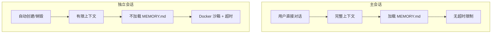

---

## 2. 架构与启动

### Q4: Gateway 是什么？为什么说它是中心化设计？

**Gateway 是 OpenClaw 的中枢系统**，负责消息路由、连接管理（WebSocket）、认证授权、通道协调以及 Agent 会话管理。

```
用户 ──► 消息通道(Telegram/QQ等) ──► Gateway(ws://127.0.0.1:18789) ──► Agent 运行时
                                                       │
                                                       ▼
                                                  工具执行引擎
```

**中心化的优缺点：**

| 优点 | 缺点 |
|------|------|
| 单一真相来源 | 单点故障风险 |
| 易于管理连接状态 | 扩展性受限 |
| 统一的认证和授权 | 所有通道共享同一 Gateway |

**替代方案（未来可能的方向）：** 分布式 Gateway 集群、通道级联模式、边缘计算（轻量级节点 + 中心 Gateway）。

---

### Q5: 消息是如何从 QQ/Telegram 到达 Agent 的？

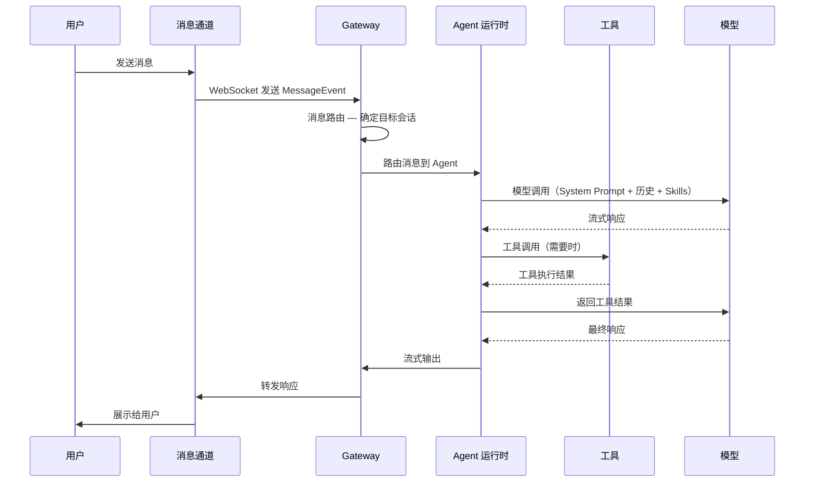

**关键步骤：**

1. **通道适配器** — 将各平台消息格式转换为内部统一格式
2. **消息路由器** — 根据会话 ID 路由到正确的 Agent
3. **上下文构建器** — 组装 System Prompt + 历史消息 + 适用 Skills
4. **模型调用器** — 发送请求到 AI 模型
5. **工具执行器** — 解析模型输出的工具调用，执行并返回结果
6. **流式输出** — 将响应流式返回给用户

---

## 3. Agent 运行时

### Q6: Agent 上下文中包含哪些内容？

Agent 上下文是一个分层结构：

```
┌─────────────────────────────────────────────┐
│           Agent 完整上下文                    │
├─────────────────────────────────────────────┤
│  1. System Prompt（系统提示词）              │
│     - SOUL.md / AGENTS.md / 动态指令        │
├─────────────────────────────────────────────┤
│  2. 用户历史消息                             │
│     - 当前会话 + 摘要后的历史                │
├─────────────────────────────────────────────┤
│  3. 适用 Skills（渐进式披露）                │
│     - Metadata → Body → Resources           │
├─────────────────────────────────────────────┤
│  4. 工具定义 + 工具执行历史                  │
├─────────────────────────────────────────────┤
│  5. 长期记忆（仅主会话）                     │
│     - MEMORY.md                             │
├─────────────────────────────────────────────┤
│  6. 项目上下文                               │
│     - SOUL.md, USER.md, HEARTBEAT.md        │
└─────────────────────────────────────────────┘
```

---

### Q7: 上下文窗口是如何管理的？如何防止溢出？

OpenClaw 使用**动态上下文压缩**机制。压缩触发条件包括：Token 数量接近模型限制（约 80% 阈值）、连续多次模型调用、长时间会话。

**保留优先级（从高到低）：**

1. System Prompt（永不删除）
2. 工具定义（必需）
3. Skills（按需加载）
4. 工具执行历史（保留摘要）
5. 用户消息（保留最近 20–50 条）
6. AI 响应（可大幅压缩）

> 具体的 Context Overflow 恢复策略见 [Q9](#q9-context-overflow-恢复策略的详细步骤)。

---

### Q8: 工具调用的完整流程是什么？

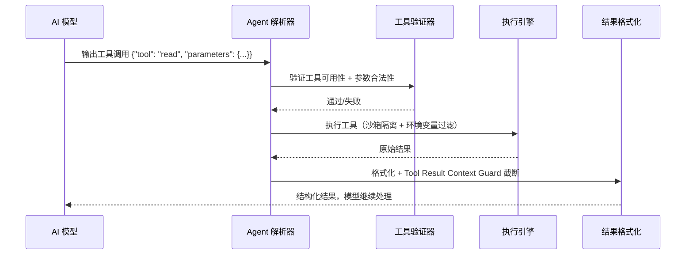

**Tool Result Context Guard（预防性截断）：**

| 常量 | 值 | 说明 |
|------|-----|------|
| `MAX_TOOL_RESULT_CONTEXT_SHARE` | `0.3` | 单个工具结果占上下文窗口最大比例 |
| `HARD_MAX_TOOL_RESULT_CHARS` | `400,000` | 单个工具结果硬字符上限（约 100K tokens） |

> 源码: `src/agents/pi-embedded-runner/tool-result-truncation.ts:11-19`、`src/agents/session-tool-result-guard.ts:26-33`

---

### Q9: Context Overflow 恢复策略的详细步骤？

当模型返回上下文溢出错误时，运行时会执行一个多阶段恢复流程：

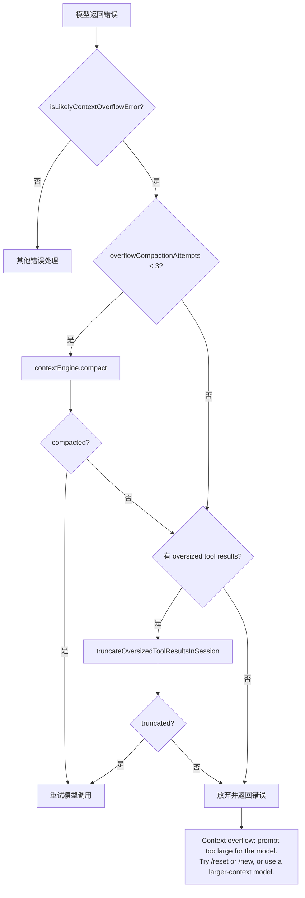

**阶段 1 — 检测（`isLikelyContextOverflowError()`）**

函数通过正则匹配错误消息来判断是否为上下文溢出。它会排除以下误报：
- Groq 的 413 TPM 限流（`hasRateLimitTpmHint`）
- Reasoning 约束错误
- 计费/配额错误（`isBillingErrorMessage`）
- 上下文窗口过小错误（`CONTEXT_WINDOW_TOO_SMALL_RE`）

> 源码: `src/agents/pi-embedded-helpers/errors.ts:127-164`

**阶段 2 — 压缩（最多 3 次尝试）**

```
MAX_OVERFLOW_COMPACTION_ATTEMPTS = 3
```

每次尝试调用 `contextEngine.compact()`，传入 `trigger: "overflow"` 和当前尝试次数。压缩引擎会按优先级删减旧消息、工具结果、AI 响应等。

> 源码: `src/agents/pi-embedded-runner/run.ts:740`（常量）、`run.ts:1055-1092`（compact 调用）

**阶段 3 — 兜底：截断超大工具结果**

如果 3 次压缩都无法解决，则调用 `truncateOversizedToolResultsInSession()`，对会话中超大的工具结果进行截断。

> 源码: `src/agents/pi-embedded-runner/tool-result-truncation.ts:206-211`

**阶段 4 — 放弃**

所有恢复手段耗尽后，返回用户可读的错误提示，建议 `/reset` 或切换到更大上下文窗口的模型。

---

### Q10: Auth Profile 轮转和 Failover 是怎么工作的？

Auth Profile 系统允许配置多个 API 密钥，在限流、故障时自动轮转和降级。

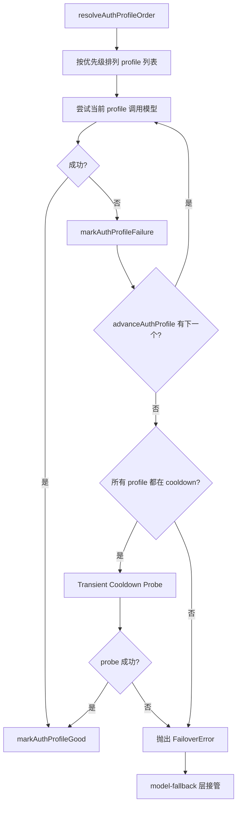

**核心函数链路：**

| 函数 | 源码位置 | 职责 |
|------|----------|------|
| `resolveAuthProfileOrder()` | `src/agents/auth-profiles/order.ts:67` | 解析 profile 优先级顺序，清除过期 cooldown |
| `advanceAuthProfile()` | `src/agents/pi-embedded-runner/run.ts:634` | 跳过 cooldown 中的 profile，尝试下一个 |
| `markAuthProfileFailure()` | `src/agents/auth-profiles/usage.ts:464` | 记录失败，达到阈值后进入 cooldown |
| `markAuthProfileGood()` | `src/agents/auth-profiles/profiles.ts:87` | 记录成功，更新 `lastGood` |

**运行时常量：**

| 常量 | 值 | 说明 |
|------|-----|------|
| `BASE_RUN_RETRY_ITERATIONS` | `24` | 基础重试次数 |
| `RUN_RETRY_ITERATIONS_PER_PROFILE` | `8` | 每增加一个 profile 额外重试次数 |
| `MIN_RUN_RETRY_ITERATIONS` | `32` | 最小重试次数 |
| `MAX_RUN_RETRY_ITERATIONS` | `160` | 最大重试次数 |

> 源码: `src/agents/pi-embedded-runner/run.ts:136-146`

最大重试次数计算公式：

```typescript
const scaled = BASE_RUN_RETRY_ITERATIONS
  + Math.max(1, profileCandidateCount) * RUN_RETRY_ITERATIONS_PER_PROFILE;
return Math.min(MAX_RUN_RETRY_ITERATIONS, Math.max(MIN_RUN_RETRY_ITERATIONS, scaled));
```

**Transient Cooldown Probe：**

当所有 profile 都处于 cooldown 但原因是 **暂时性的**（`rate_limit` / `overloaded` / `billing` / `unknown`）时，运行时会执行一次"探测"请求——跳过 cooldown 检查，尝试调用一次模型。每个 provider 每次 fallback 运行最多探测一次。

> 源码: `src/agents/pi-embedded-runner/run.ts:665-696`（probe 逻辑）、`src/agents/model-fallback.ts:588-633`（fallback 层）

**FailoverError：**

当所有 profile 和探测都失败后，抛出 `FailoverError`，携带 `reason`、`provider`、`model`、`profileId`、`status` 等信息，交由 `model-fallback.ts` 选择备选模型继续运行。

> 源码: `src/agents/failover-error.ts:11-39`

---

## 4. Skills 系统

### Q11: Skills 是如何被触发的？什么条件会加载某个 Skill？

Skills 使用**渐进式披露**机制，分三层加载：

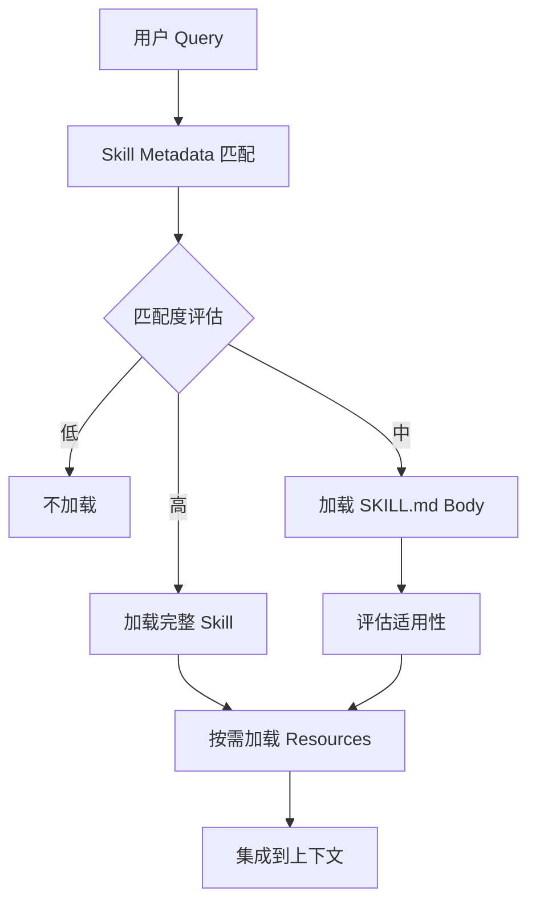

| 层级 | 加载条件 | 内容 |
|------|----------|------|
| **Metadata 层**（总是加载） | Frontmatter 中的 `name` + `description` | 简短关键词匹配 |
| **Body 层**（条件加载） | 用户 query 包含关键词 / 语义相似 | SKILL.md 正文 |
| **Resources 层**（按需加载） | 执行到需要脚本的步骤 | 脚本、reference 文档、asset 资源 |

---

### Q12: Skill 的 frontmatter 包含哪些字段？

```yaml
---
name: weather
description: |
  Get current weather and forecasts.
  Use when user asks about:
  - Current temperature
  - Weather forecast
  - Rain/snow prediction
metadata:
  {
    "openclaw": {
      "requires": { "bins": ["curl"] },
      "install": [...]
    }
  }
---
```

| 字段 | 必填 | 说明 |
|------|------|------|
| `name` | ✅ | Skill 名称（小写、中划线） |
| `description` | ✅ | 详细描述，用于匹配和触发 |
| `metadata` | ❌ | 附加元数据 |
| `metadata.openclaw.requires.bins` | ❌ | 依赖的系统命令 |
| `metadata.openclaw.install` | ❌ | 安装指令 |

---

## 5. 消息系统

### Q13: 消息类型有哪些？有什么区别？

```typescript
enum MessageType {
  TEXT = "text",
  IMAGE = "image",
  VIDEO = "video",
  AUDIO = "audio",
  FILE = "file",
  SYSTEM = "system",
  TOOL_CALL = "tool_call",
  TOOL_RESULT = "tool_result",
  REACTION = "reaction",
  EDIT = "edit",
  DELETE = "delete",
}
```

**消息状态机：**

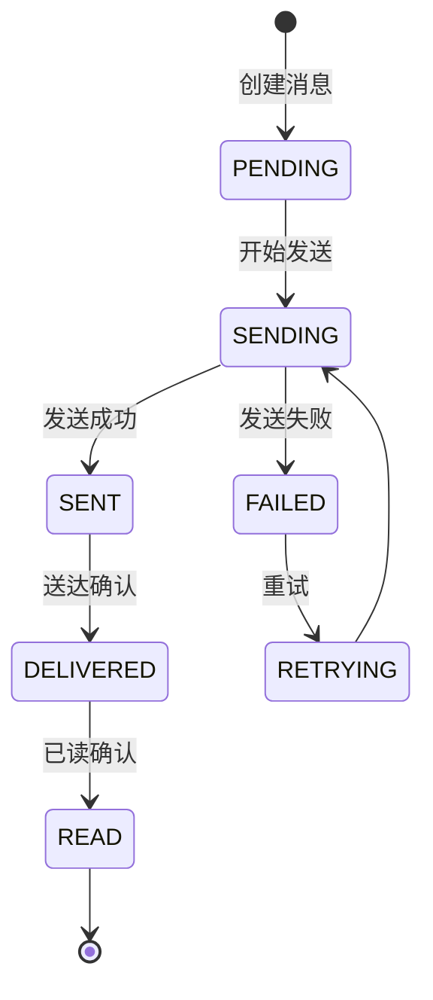

---

### Q14: 消息路由是如何工作的？

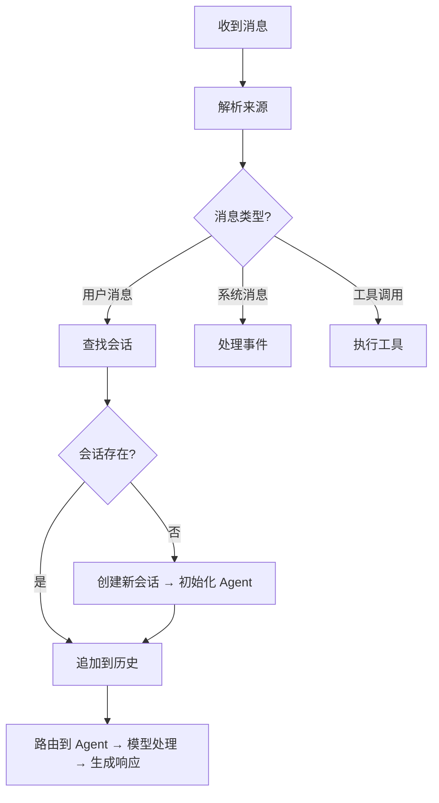

**路由规则优先级：**

1. 精确匹配 — 会话 ID 完全匹配
2. 通道 + 发送者 — 同一通道的同一用户
3. 主题匹配 — 基于话题的会话关联
4. 新建会话 — 无匹配时创建

---

## 6. 通道系统

### Q15: 通道适配器是如何工作的？

每个消息通道都有一个适配器，负责格式转换：

```
Telegram Bot API              OpenClaw 内部格式
┌──────────────────┐         ┌──────────────────┐
│ Update Object    │   ──►   │ Message Event    │
│ - message.text   │         │ - content.text   │
│ - message.from   │         │ - author.id      │
│ - chat.id        │         │ - channel.id     │
└──────────────────┘         └──────────────────┘
```

**支持的通道：**

| 通道 | 类型 | 协议 | 特点 |
|------|------|------|------|
| Telegram | IM | Bot API | 官方支持，完整功能 |
| Discord | 社区 | Bot API | 丰富的交互 |
| WhatsApp | IM | Web/Cloud | 支持多媒体 |
| QQ | IM | OneBot | 国内常用 |
| WeCom | 企业 | 企业 API | 集成办公 |
| DingTalk | 企业 | 钉钉 API | 审批集成 |
| Feishu | 企业 | 飞书 API | 文档协作 |
| Signal | IM | Signal API | 加密通信 |

---

### Q16: 可以在同一台服务器上运行多个通道吗？

**可以**。有两种方案：

**方案 1：单 Gateway 多通道（推荐）**

```
Gateway (ws://127.0.0.1:18789)
    ├── Telegram 适配器
    ├── QQ 适配器
    └── Discord 适配器
```

优点：资源共享、统一管理、简单部署。缺点：共享连接限额、故障影响范围大。

**方案 2：多 Gateway 分布式**

```
Gateway-1 (Telegram) ─┐
Gateway-2 (QQ)      ──┼── 共享配置/数据库
Gateway-3 (Discord) ─┘
```

优点：故障隔离、独立扩展。缺点：配置复杂、需要共享存储。

**注意事项：** Webhooks 需要公网可访问；各平台有 Rate Limits；每个通道需要独立的 API Token。

---

## 7. 记忆系统

### Q17: MEMORY.md 和 daily notes 有什么区别？

OpenClaw 有三层记忆系统：

| 特性 | MEMORY.md | daily notes | 会话历史 |
|------|-----------|-------------|----------|
| **加载时机** | 仅主会话 | 每次会话 | 自动加载 |
| **格式** | Markdown | Markdown | JSONL |
| **内容** | 长期知识/偏好 | 每日记录 | 原始消息 |
| **持久化** | 手动更新 | 自动创建 | 自动记录 |
| **检索** | 语义搜索 | 关键词搜索 | 全文搜索 |
| **清理策略** | 手动维护 | 自动归档 | 自动压缩 |

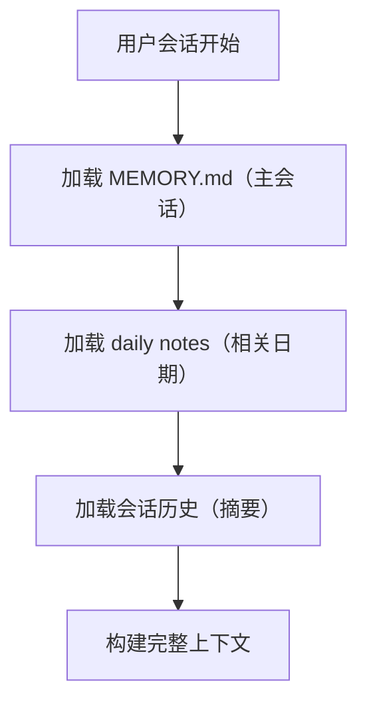

---

### Q18: 语义搜索是如何工作的？

OpenClaw 使用 **sqlite-vec**（SQLite 扩展）进行语义搜索。

**技术栈：** 嵌入模型 sentence-transformers (all-MiniLM-L6-v2)，生成 384 维向量，余弦相似度匹配。

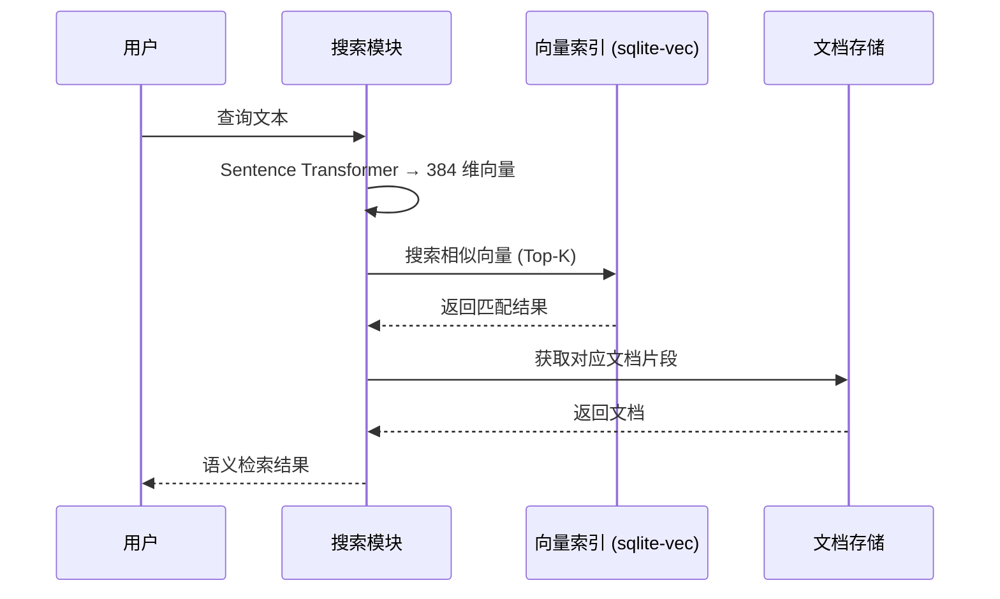

---

## 8. 工具系统

### Q19: 工具白名单和黑名单是如何工作的？

工具系统使用策略引擎控制工具访问：

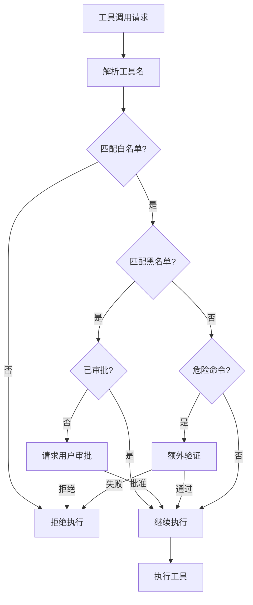

---

### Q20: 沙箱隔离是如何实现的？

OpenClaw 使用 Docker 实现沙箱隔离。环境变量黑名单默认阻止以下危险变量：

```
LD_*           # 链接器变量（可注入代码）
DYLD_*         # macOS 动态链接器
NODE_OPTIONS   # Node.js 选项（可执行任意代码）
BASH_ENV       # Bash 启动脚本
ENV            # 任意 shell 启动脚本
```

隔离级别分为三档：无隔离（主会话直接执行）、Docker 沙箱（独立会话）、Kubernetes 隔离（企业版，更严格的资源限制）。

---

## 9. 安全

### Q21: DM（Direct Message）陌生人配对机制是什么？

DM 陌生人配对是 OpenClaw 的安全机制，用于处理陌生人发来的私信：

| 策略 | 说明 | 使用场景 |
|------|------|----------|
| `reject` | 自动拒绝所有陌生人 | 高安全需求 |
| `accept` | 自动接受所有陌生人 | 低风险环境 |
| `review` | 需要用户手动批准 | 平衡安全与便利（默认） |

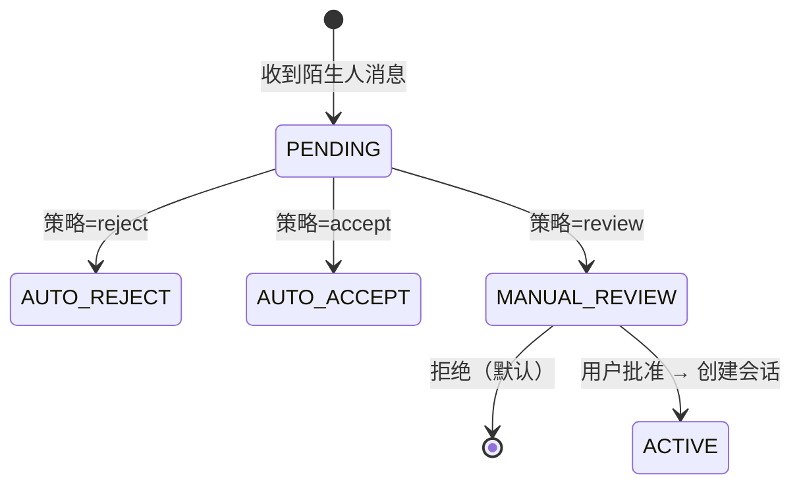

---

### Q22: 如何安全地使用远程访问（Tailscale/SSH Tunnel）？

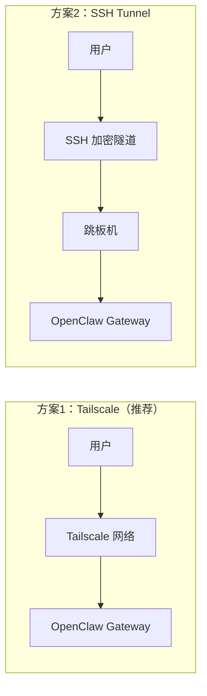

| 特性 | Tailscale | SSH Tunnel |
|------|-----------|------------|
| 配置复杂度 | Zero-config | 需手动设置 |
| 加密 | 内置 WireGuard | SSH 加密 |
| NAT 穿透 | ✅ | ❌ 需手动 |
| 审计 | ACL 控制 | 可审计 |

**安全最佳实践：** 使用短生命 Token、限制访问 IP 范围、启用审计日志、定期轮换密钥、使用双因素认证。

---

### Q23: 插件安全检查机制是怎样的？

OpenClaw 在加载插件前会执行严格的安全检查，核心函数为 `isUnsafePluginCandidate()`。

**检查项目：**

| 检查 | 函数/逻辑 | 触发条件 |
|------|-----------|----------|
| **路径逃逸** | `checkSourceEscapesRoot()` — `isPathInside(rootRealPath, sourceRealPath)` | 插件路径超出允许的根目录 |
| **世界可写** | `(modeBits & 0o002) !== 0` → `path_world_writable` | 文件权限允许任意用户写入 |
| **可疑归属** | `stat.uid !== params.uid && stat.uid !== 0` → `path_suspicious_ownership` | 文件归属非当前用户且非 root |

> 源码: `src/plugins/discovery.ts:250-272`（安全校验入口）、`discovery.ts:116-135`（路径逃逸）、`discovery.ts:185-208`（权限/归属）

**发现缓存 TTL：**

```
DEFAULT_DISCOVERY_CACHE_MS = 1000  // ~1 秒
DEFAULT_MANIFEST_CACHE_MS = 1000   // 清单注册表同样 ~1 秒
```

> 源码: `src/plugins/discovery.ts:38-39`、`src/plugins/manifest-registry.ts:50`

**Manifest 校验：**

`readPackageManifest()` 通过 `openBoundaryFileSync()` 打开 `package.json`，该函数会：
1. 校验路径不超出插件目录边界
2. 拒绝硬链接（`rejectHardlinks = true`）
3. 解析 JSON 并验证结构

> 源码: `src/plugins/discovery.ts:298-317`

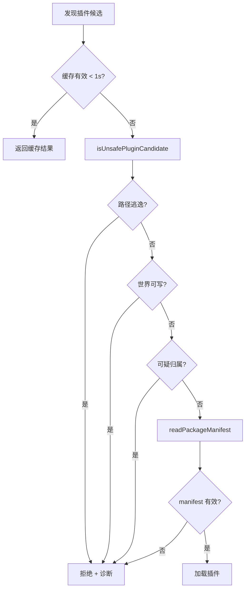

---

## 10. 配置

### Q24: Config `$include` 机制是怎么工作的？

OpenClaw 配置文件支持 `$include` 指令，可以将配置拆分到多个文件中。

> 源码: `src/config/includes.ts`

**核心常量：**

| 常量 | 值 | 说明 |
|------|-----|------|
| `INCLUDE_KEY` | `"$include"` | 指令关键字 |
| `MAX_INCLUDE_DEPTH` | `10` | 最大嵌套深度，防止循环引用 |
| `MAX_INCLUDE_FILE_BYTES` | `2 * 1024 * 1024` (2 MB) | 单个 include 文件大小上限 |

> 源码: `src/config/includes.ts:21-23`

**使用方式：**

```yaml
# 方式 1：字符串 — include 单个文件
$include: "./auth-config.yaml"

# 方式 2：数组 — 按顺序 include 多个文件并 deep merge
$include:
  - "./base-config.yaml"
  - "./auth-config.yaml"
  - "./channel-config.yaml"
```

**Deep Merge 规则：**

| 类型 | 合并行为 |
|------|----------|
| 数组 | 拼接（`[...target, ...source]`） |
| 对象 | 递归合并 |
| 原始值 | source 覆盖 target |

> 源码: `src/config/includes.ts:68-84`

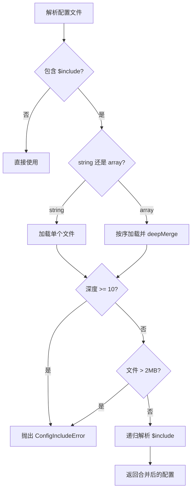

---

### Q25: Session 磁盘空间管理？

OpenClaw 提供多层 session 磁盘管理策略，防止会话文件无限膨胀。

**管理函数：**

| 函数 | 源码位置 | 职责 |
|------|----------|------|
| `pruneStaleEntries()` | `src/config/sessions/store-maintenance.ts:155` | 按 `maxAgeMs` 删除过期条目 |
| `capEntryCount()` | `src/config/sessions/store-maintenance.ts:226` | 按 `maxEntries` 上限，按 `updatedAt` 排序保留最新 |
| `rotateSessionFile()` | `src/config/sessions/store-maintenance.ts:275` | 文件超过 `rotateBytes` 时轮转，保留 3 个最近备份 |
| `enforceSessionDiskBudget()` | `src/config/sessions/disk-budget.ts:188` | 全局磁盘预算，删除归档 artifacts 和无引用 transcripts |

**Session ID 校验：**

```
SAFE_SESSION_ID_RE = /^[a-z0-9][a-z0-9._-]{0,127}$/i
```

> 源码: `src/config/sessions/paths.ts:60`

所有 session 操作都先通过 `validateSessionId()` 检查 ID 格式，防止路径遍历攻击。不合法的 ID 会被立即拒绝。

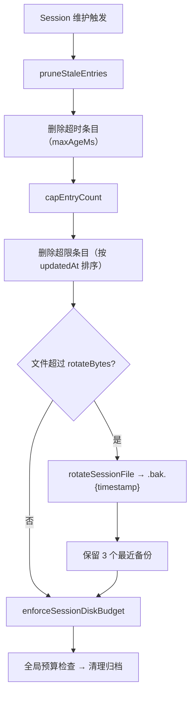

---

### Q26: Subagent 嵌套深度如何计算？

Subagent 的嵌套深度通过 `getSubagentDepth()` 函数计算，它统计 session key 中 `:subagent:` 分隔符的数量。

```typescript
// src/sessions/session-key-utils.ts:89-95
function getSubagentDepth(sessionKey: string | undefined | null): number {
  const raw = (sessionKey ?? "").trim().toLowerCase();
  if (!raw) return 0;
  return raw.split(":subagent:").length - 1;
}
```

**示例：**

| Session Key | 深度 |
|-------------|------|
| `user123` | 0 |
| `user123:subagent:task1` | 1 |
| `user123:subagent:task1:subagent:subtask` | 2 |

**嵌套限制：**

```
DEFAULT_SUBAGENT_MAX_SPAWN_DEPTH = 1
```

> 源码: `src/config/agent-limits.ts:6`

默认最大 spawn 深度为 **1**，即子 agent 不能再创建子 agent。可通过配置 `cfg.agents.defaults.subagents.maxSpawnDepth` 覆盖。

检查位置包括：`src/agents/subagent-spawn.ts:336`、`src/agents/subagent-capabilities.ts:97,131`、`src/agents/pi-tools.policy.ts:106`。

---

## 11. 部署

### Q27: 如何选择部署方式？

| 方式 | 难度 | 扩展性 | 成本 | 适用场景 |
|------|------|--------|------|----------|
| 本地开发 | ⭐ | 低 | 低 | 开发测试 |
| Docker | ⭐⭐ | 中 | 低 | 个人/小团队 |
| Systemd | ⭐⭐ | 中 | 中 | 生产部署 |
| Kubernetes | ⭐⭐⭐⭐ | 高 | 高 | 企业级 |

**Docker Compose 示例：**

```yaml
version: '3.8'
services:
  gateway:
    image: openclaw/gateway:latest
    ports:
      - "18789:18789"
    volumes:
      - ./config:/app/config
      - ./data:/app/data
    environment:
      - DATABASE_URL=sqlite:///data/openclaw.db
      - TZ=Asia/Shanghai
  telegram:
    image: openclaw/channel-telegram:latest
    depends_on:
      - gateway
    environment:
      - GATEWAY_URL=ws://gateway:18789
      - TELEGRAM_TOKEN=${TELEGRAM_TOKEN}
```

---

### Q28: 如何配置 AI 模型？

OpenClaw 支持多种 AI 模型提供商：

```yaml
models:
  default: "minimax"
  minimax:
    provider: "minimax"
    model: "MiniMax-M2.1"
    apiKey: "${MINIMAX_API_KEY}"
    baseUrl: "https://api.minimax.chat/v1"
  claude:
    provider: "anthropic"
    model: "claude-3-5-sonnet-20241022"
    apiKey: "${ANTHROPIC_API_KEY}"
  ollama:
    provider: "ollama"
    model: "llama3.1"
    baseUrl: "http://localhost:11434"
```

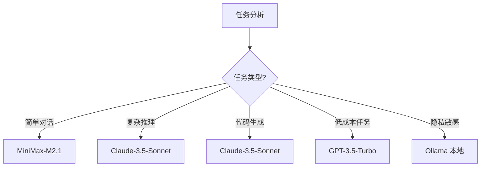

Auth Profile 轮转机制可为同一 provider 配置多个 API Key，实现自动 failover（详见 [Q10](#q10-auth-profile-轮转和-failover-是怎么工作的)）。

---

## 12. 排查

### Q29: Gateway 连接失败怎么办？

**常见错误：**

```
Error: WebSocket connection to 'ws://127.0.0.1:18789' failed
```

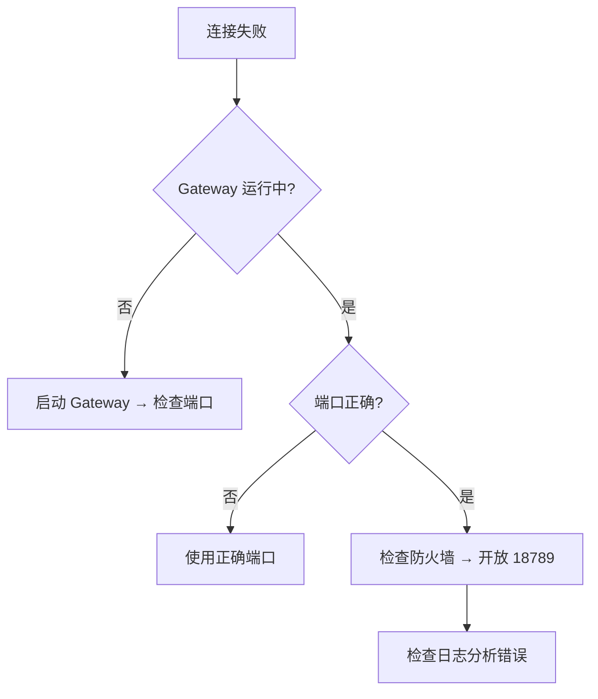

**诊断命令：**

```bash
openclaw gateway status         # 检查 Gateway 状态
netstat -tlnp | grep 18789     # 检查端口监听
curl http://127.0.0.1:18789/health  # 测试本地连接
tail -f ~/.local/share/openclaw/logs/gateway.log  # 查看日志
```

---

### Q30: 工具调用失败怎么办？

| 错误码 | 说明 | 解决方案 |
|--------|------|----------|
| `TOOL_NOT_FOUND` | 工具不存在 | 检查工具名拼写，运行 `openclaw tools list` |
| `PERMISSION_DENIED` | 无权限 | 检查白名单配置 |
| `EXECUTION_FAILED` | 执行失败 | 手动执行命令验证语法 |
| `TIMEOUT` | 超时 | 增加超时时间 |
| `SANDBOX_ERROR` | 沙箱错误 | 检查 Docker 状态 `docker ps` |

**上下文溢出相关错误：**

如果工具结果过大导致 context overflow，运行时会自动触发 `truncateOversizedToolResultsInSession()`。预防性截断阈值为单个工具结果不超过上下文窗口的 30%（`MAX_TOOL_RESULT_CONTEXT_SHARE=0.3`）或 400K 字符（`HARD_MAX_TOOL_RESULT_CHARS`）。

---

### Q31: 消息发不出去怎么办？

**常见原因与排查：**

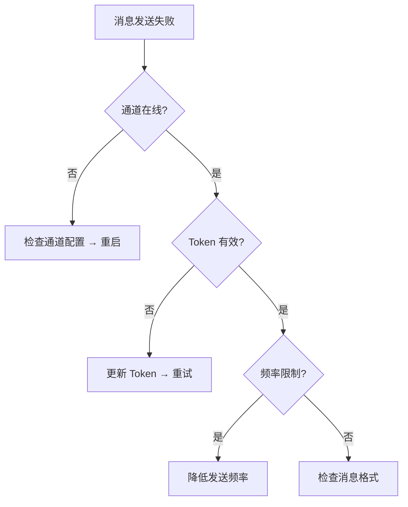

**Auth Profile 相关故障：**

如果多个通道同时出问题，可能是 API 密钥问题。检查 auth profile 状态：
- 所有 profile 都在 cooldown → 等待冷却或添加新 profile
- 持续 `FailoverError` → 检查 provider 服务状态
- Transient probe 频繁触发 → 可能是账单或配额问题

**诊断命令：**

```bash
openclaw channels status              # 查看通道状态
openclaw channels test telegram       # 测试通道连接
openclaw logs --channel telegram      # 查看发送日志
openclaw channels auth telegram --reauth  # 重新授权
```

---

## 索引

| 分类 | 问题 |
|------|------|
| [基础概念](#1-基础概念) | Q1–Q3 |
| [架构与启动](#2-架构与启动) | Q4–Q5 |
| [Agent 运行时](#3-agent-运行时) | Q6–Q10（含 Auth Profile 轮转、Context Overflow 恢复） |
| [Skills 系统](#4-skills-系统) | Q11–Q12 |
| [消息系统](#5-消息系统) | Q13–Q14 |
| [通道系统](#6-通道系统) | Q15–Q16 |
| [记忆系统](#7-记忆系统) | Q17–Q18 |
| [工具系统](#8-工具系统) | Q19–Q20 |
| [安全](#9-安全) | Q21–Q23（含插件安全检查） |
| [配置](#10-配置) | Q24–Q26（含 `$include`、Session 磁盘管理、Subagent 嵌套） |
| [部署](#11-部署) | Q27–Q28 |
| [排查](#12-排查) | Q29–Q31 |

---

*基于 OpenClaw v2026.2.3-1 源码分析*
