# OpenClaw ACP 协议源码深度分析

> Agent Communication Protocol：从 IDE 到 Agent 的标准化通信桥梁

## 目录

- [设计理念](#设计理念)
- [ACP 协议概览](#acp-协议概览)
- [架构全景](#架构全景)
- [传输层：NDJSON over Stdio](#传输层ndjson-over-stdio)
- [协议消息类型](#协议消息类型)
- [握手与初始化](#握手与初始化)
- [会话生命周期](#会话生命周期)
- [Prompt 与响应流](#prompt-与响应流)
- [工具调用流](#工具调用流)
- [工具权限控制](#工具权限控制)
- [AcpGatewayAgent：核心桥接层](#acpgatewayagent核心桥接层)
- [ACP Control Plane：会话管理器](#acp-control-plane会话管理器)
- [ACP Runtime：后端抽象](#acp-runtime后端抽象)
- [Persistent Bindings：通道绑定](#persistent-bindings通道绑定)
- [Provenance：来源追踪](#provenance来源追踪)
- [安全机制](#安全机制)
- [配置参考](#配置参考)
- [ACP 与 Gateway 的集成点](#acp-与-gateway-的集成点)
- [ACPX 扩展](#acpx-扩展)
- [常见问题](#常见问题)

---

## 设计理念

ACP（Agent Communication Protocol）解决的核心问题是：**如何让外部 IDE、CLI 工具和自动化流程以标准化的方式与 OpenClaw Agent 交互？**

传统上，IDE 和 Agent 的集成是点对点的——每个 IDE 需要实现自己的 Agent 协议。ACP 提供了一个统一的中间层：

1. **标准化协议**：基于 `@agentclientprotocol/sdk` 的 NDJSON-over-stdio 协议，任何能启动子进程的 IDE 都能接入
2. **Gateway 桥接**：ACP Server 不直接运行 Agent，而是通过 WebSocket 桥接到 OpenClaw Gateway，复用 Gateway 的全部能力（模型选择、Auth 轮转、工具系统、记忆检索等）
3. **会话持久化**：ACP 会话映射到 Gateway session，享受完整的会话管理（历史、压缩、重置）
4. **工具审批**：安全工具自动放行，危险工具需要用户确认，平衡效率和安全
5. **通道绑定**：ACP 会话可以绑定到 Discord/Telegram 对话，实现跨界面的 Agent 交互

---

## ACP 协议概览

ACP 使用 `@agentclientprotocol/sdk`（v0.16.1）定义的协议规范。通信基于 **NDJSON（Newline-Delimited JSON）** 格式，通过 **stdio**（标准输入/输出）传输。

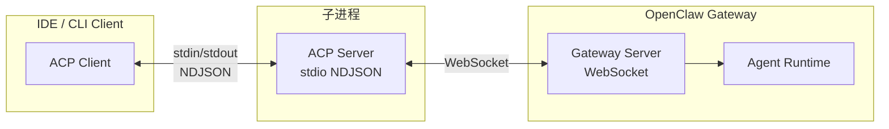

**为什么选择 stdio？**
- 零配置：不需要端口、证书或服务发现
- 进程隔离：ACP Server 作为子进程运行，生命周期由 IDE 管理
- 跨平台：Windows、macOS、Linux 均支持
- IDE 友好：VS Code、JetBrains 等都原生支持子进程通信

---

## 架构全景

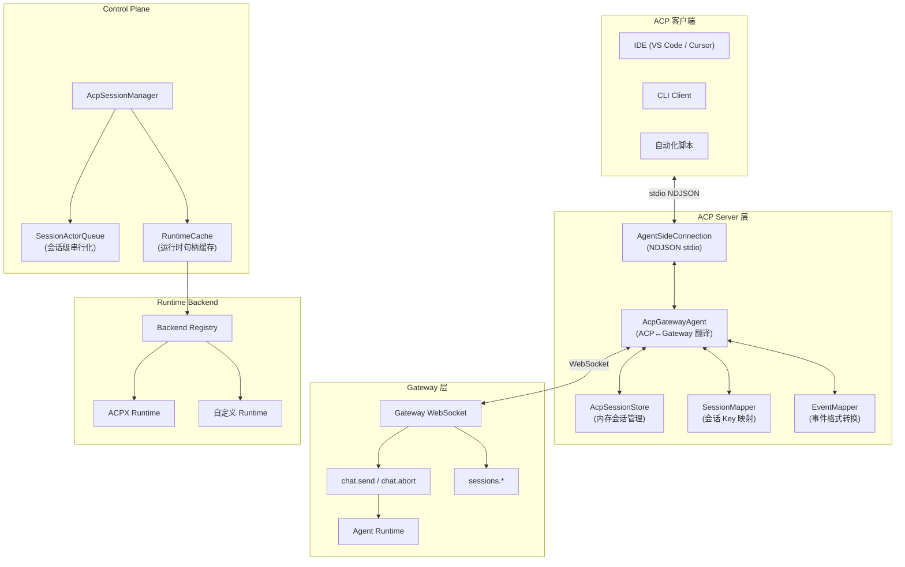

---

## 传输层：NDJSON over Stdio

### 协议格式

每条消息是一行 JSON，以换行符 `\n` 分隔：

```
{"jsonrpc":"2.0","id":1,"method":"initialize","params":{...}}\n
{"jsonrpc":"2.0","id":1,"result":{...}}\n
{"jsonrpc":"2.0","method":"session/update","params":{...}}\n
```

### 客户端实现

源码：`src/acp/client.ts`

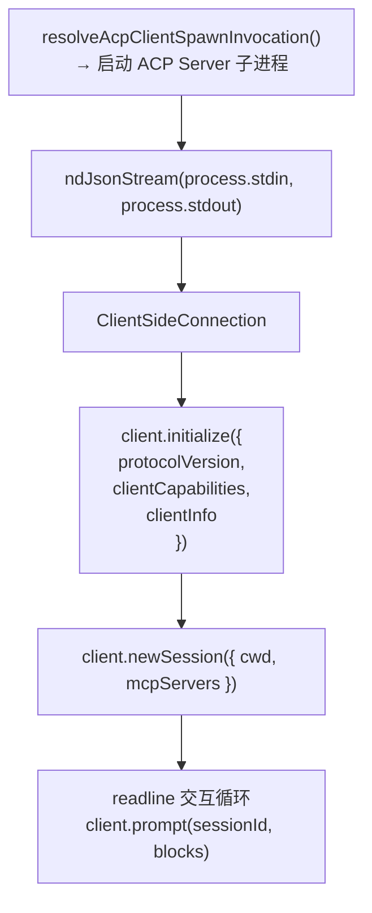

**环境变量处理**：

- 设置 `OPENCLAW_SHELL=acp-client` 标识 ACP 环境
- 可选剥离 provider auth 变量（避免泄漏到子进程）

### 服务端实现

源码：`src/acp/server.ts`

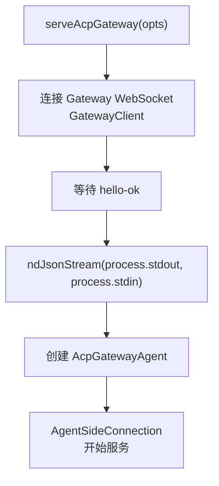

CLI 参数：

| 参数 | 说明 |
|------|------|
| `--url` | Gateway WebSocket URL |
| `--token` / `--token-file` | Gateway 认证 Token |
| `--password` / `--password-file` | Gateway 密码 |
| `--session` | 默认 session key |
| `--session-label` | 会话标签 |
| `--require-existing` | 要求已存在的会话 |
| `--reset-session` | 重置会话 |
| `--no-prefix-cwd` | 不在 session key 中加入 cwd |
| `--provenance` | 来源追踪模式 |
| `--verbose` | 详细日志 |

---

## 协议消息类型

### 请求/响应消息

| 方向 | 方法 | 说明 |
|------|------|------|
| Client → Server | `initialize` | 协议握手，交换能力和版本 |
| Client → Server | `session/new` | 创建新会话 |
| Client → Server | `session/load` | 加载已有会话 |
| Client → Server | `session/list` | 列出所有会话 |
| Client → Server | `prompt` | 发送用户消息 |
| Client → Server | `cancel` | 取消当前请求（通知类型） |
| Client → Server | `authenticate` | 认证 |
| Client → Server | `session/set_mode` | 设置会话模式 |
| Client → Server | `session/set_config_option` | 设置会话配置选项 |
| Server → Client | `permission/request` | 请求工具执行权限 |

### 通知消息（Server → Client）

| 通知类型 | `sessionUpdate` 值 | 说明 |
|----------|-------------------|------|
| 文本输出 | `agent_message_chunk` | Agent 回复的增量文本 |
| 思考过程 | `agent_thought_chunk` | Agent 的推理过程 |
| 工具调用 | `tool_call` | 工具调用开始 |
| 工具更新 | `tool_call_update` | 工具执行进度/结果 |
| 用量统计 | `usage_update` | Token 使用量 |
| 命令更新 | `available_commands_update` | 可用命令列表变化 |

---

## 握手与初始化

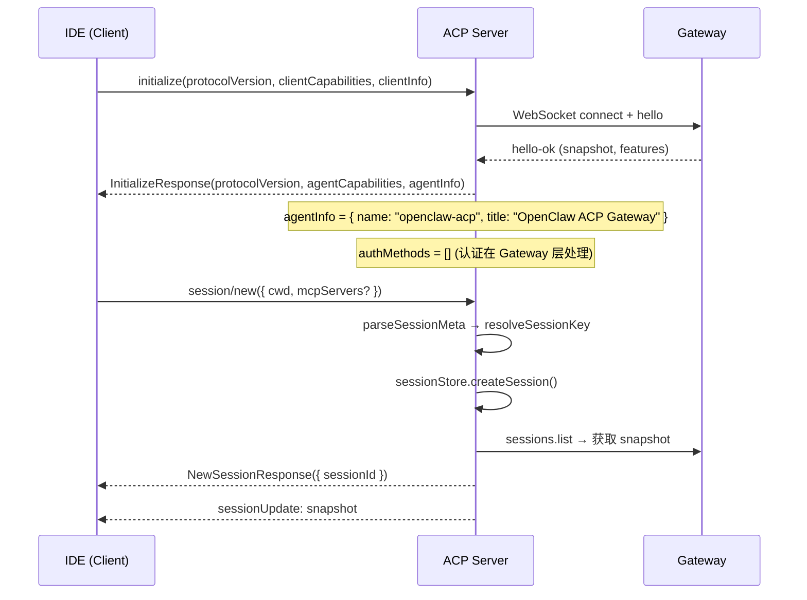

**agentCapabilities** 声明了 Server 支持的能力：
- 会话管理（create, load, list）
- 工具权限请求
- 流式输出
- 取消操作

**agentInfo**：

```typescript
{
  name: "openclaw-acp",
  title: "OpenClaw ACP Gateway",
  version: "<当前版本>"
}
```

---

## 会话生命周期

### Session Key 映射

ACP session 通过 `session-mapper.ts` 映射到 Gateway session key：

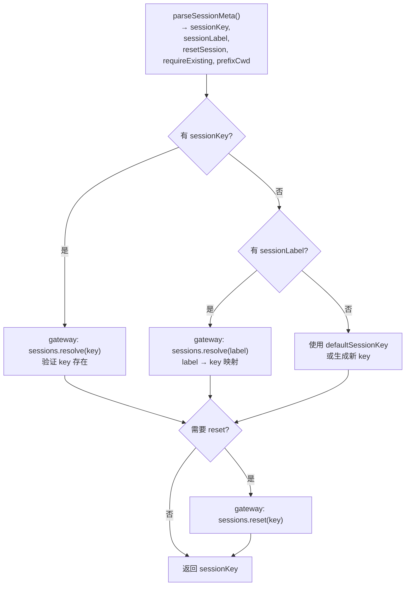

**Session Key 格式**：`agent:<agentId>:acp:<identifier>`

`isAcpSessionKey()` 判断：key 以 `acp:` 开头或 `parsed.rest` 以 `acp:` 开头。

### 内存会话存储

源码：`src/acp/session.ts` → `AcpSessionStore`

| 参数 | 默认值 | 说明 |
|------|--------|------|
| `DEFAULT_MAX_SESSIONS` | 5,000 | 最大会话数 |
| `DEFAULT_IDLE_TTL_MS` | 24 小时 | 空闲超时 |

**驱逐策略**：当达到最大会话数时，按 `lastTouchedAt` 最老的空闲会话优先驱逐。

```typescript
interface AcpSession {
  sessionId: string;
  sessionKey: string;
  cwd: string;
  createdAt: number;
  lastTouchedAt: number;
  abortController: AbortController | null;
  activeRunId: string | null;
}
```

---

## Prompt 与响应流

### 发送 Prompt

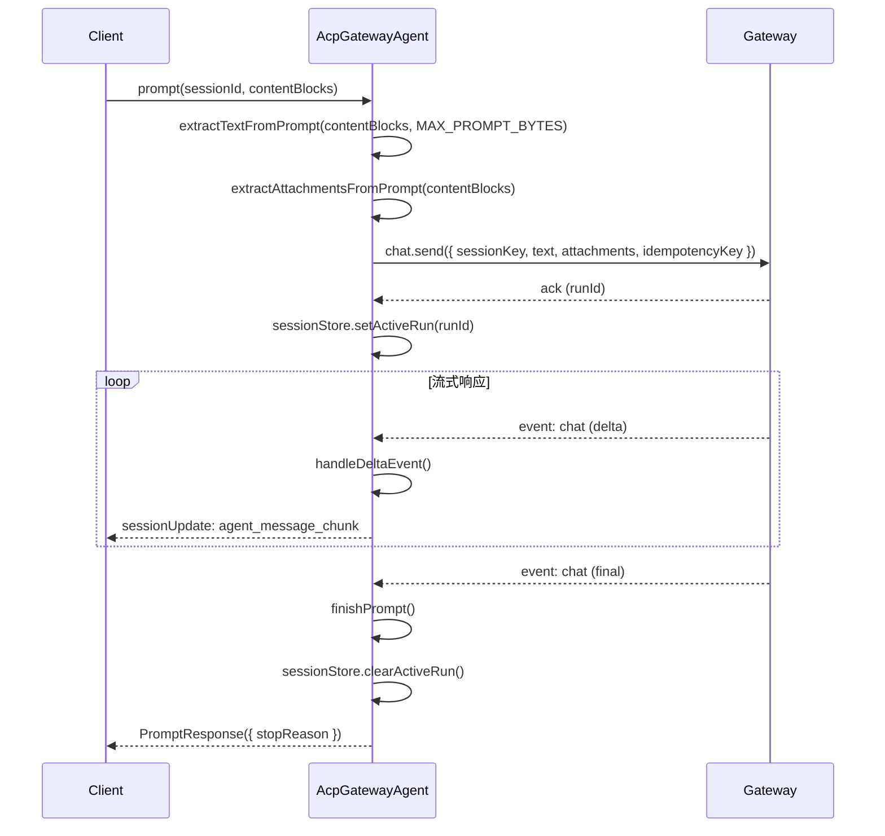

**MAX_PROMPT_BYTES = 2MB**：防止超大 prompt 导致内存问题。

**idempotencyKey**：每次 prompt 生成唯一的幂等 key，防止网络重试导致重复处理。

### 取消请求

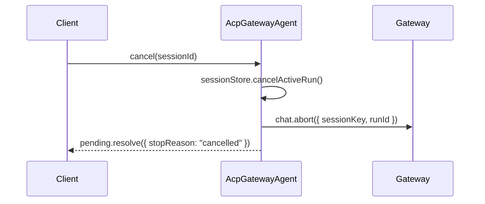

---

## 工具调用流

工具调用通过 Gateway 的 `agent` 事件流传递到 ACP 客户端：

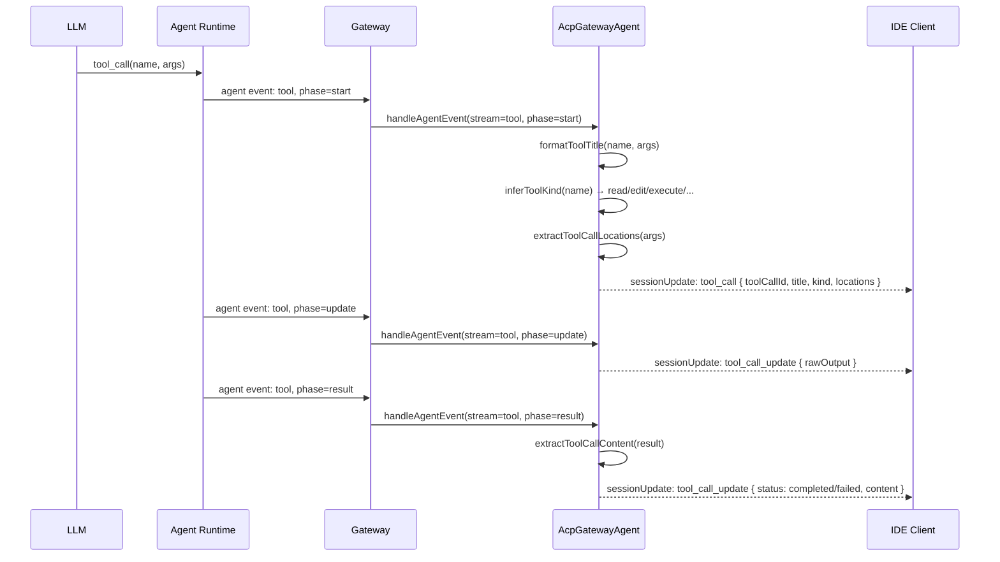

### 工具类型推断

`inferToolKind(name)` 将工具名映射为 ACP 标准类型：

| ACP Kind | 对应工具 |
|----------|----------|
| `read` | read, cat, head, tail, grep, find, ls, glob, memory_search |
| `edit` | write, edit, apply_patch, insert |
| `delete` | rm, delete |
| `move` | mv, move, rename |
| `search` | search, web_search, grep |
| `execute` | exec, bash, shell, run |
| `fetch` | web_fetch, curl, fetch |
| `other` | 其他所有工具 |

### 位置信息提取

`extractToolCallLocations()` 从工具参数和结果中提取文件位置：

- 扫描 `path`, `filePath`, `file`, `filename` 等 key
- 扫描 `line`, `lineNumber`, `startLine`, `endLine` 等 key
- 解析 `FILE:` 和 `MEDIA:` 标记
- 返回 `{ path, line?, endLine? }[]` 用于 IDE 跳转

---

## 工具权限控制

源码：`src/acp/client.ts` → `resolvePermissionRequest()`

### 权限决策流

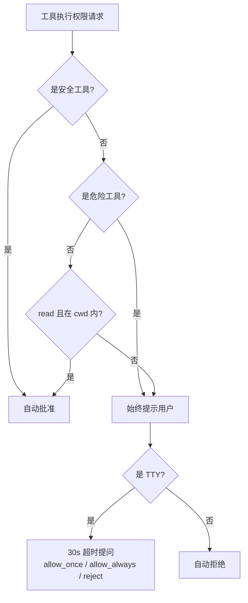

### 安全工具（自动批准）

```
read, search, web_search, memory_search
```

其中 `read` 还需要检查路径是否在 `cwd` 范围内（`isPathWithinRoot()`）。

### 危险工具（始终提示）

```
exec, spawn, shell, sessions_spawn, sessions_send,
gateway, fs_write, fs_delete, fs_move, apply_patch
```

### 权限选项

| 选项 | 说明 |
|------|------|
| `allow_once` | 本次允许 |
| `allow_always` | 永久允许该工具 |
| `reject_once` | 本次拒绝 |
| `reject_always` | 永久拒绝该工具 |

---

## AcpGatewayAgent：核心桥接层

源码：`src/acp/translator.ts`

`AcpGatewayAgent` 是整个 ACP 系统的核心，它实现了 ACP SDK 的 `Agent` 接口，将每个 ACP 操作翻译为对应的 Gateway WebSocket 请求。

### 接口实现

| ACP 方法 | Gateway 操作 |
|----------|-------------|
| `initialize()` | 返回能力声明，无 Gateway 调用 |
| `newSession()` | `sessions.resolve` + `sessions.list` |
| `loadSession()` | `sessions.resolve` + transcript replay |
| `listSessions()` | `sessions.list` |
| `authenticate()` | 直接返回 `{}`（认证在 Gateway 层） |
| `prompt()` | `chat.send` |
| `cancel()` | `chat.abort` |
| `setSessionMode()` | 配置映射 |
| `setSessionConfigOption()` | 配置映射 |

### 会话快照

创建/加载会话后，Server 会发送 `SessionNotification` 包含当前会话状态快照：
- 会话 ID 和 key
- 已安装工具列表
- 可用命令列表
- 会话配置

### 断线处理

```typescript
handleGatewayDisconnect() {
  // 拒绝所有待处理的 prompt
  for (const pending of pendingPrompts.values()) {
    pending.reject(new Error("Gateway disconnected"));
  }
  // 清除所有活跃运行
  for (const session of sessionStore.all()) {
    sessionStore.clearActiveRun(session.sessionId);
  }
}
```

### 速率限制

会话创建受速率限制保护：
- 默认：120 请求 / 10 秒
- 可通过 `sessionCreateRateLimit` 配置

---

## ACP Control Plane：会话管理器

源码：`src/acp/control-plane/manager.core.ts`

`AcpSessionManager` 是一个单例，管理所有 ACP 会话的生命周期和 runtime 后端。

### 核心操作

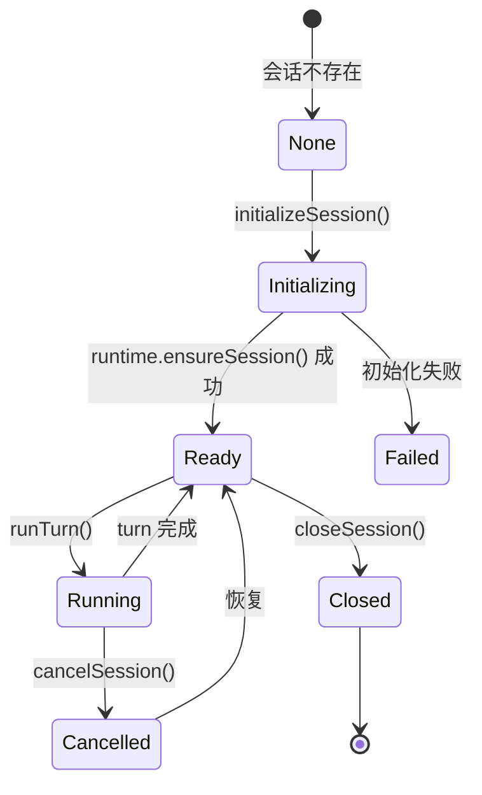

### 会话级串行化

`SessionActorQueue`（`session-actor-queue.ts`）确保同一 session 的操作串行执行，避免并发冲突：

```typescript
// 每个 session 有独立的 actor queue
withSessionActor(sessionKey, async () => {
  // 这里的操作保证串行
  await runtime.runTurn(input);
});
```

### Runtime 缓存

`RuntimeCache`（`runtime-cache.ts`）缓存 runtime 句柄，避免重复创建：

- 按 session key 缓存 `AcpRuntimeHandle`
- 空闲驱逐：定期检查并关闭空闲过久的句柄
- `evictIdleRuntimeHandles()` 清理超时的句柄

### 会话解析

`resolveSession()` 通过读取 SessionEntry 的 `acp` 元数据确定会话状态：

| 状态 | 条件 | 说明 |
|------|------|------|
| `ready` | 有 `acp` meta | 会话正常 |
| `stale` | 有 entry 但无 `acp` meta | 元数据丢失 |
| `none` | 无 entry | 会话不存在 |

---

## ACP Runtime：后端抽象

源码：`src/acp/runtime/types.ts`, `src/acp/runtime/registry.ts`

### AcpRuntime 接口

```typescript
interface AcpRuntime {
  ensureSession(input: AcpRuntimeEnsureInput): Promise<AcpRuntimeHandle>;
  runTurn(input: AcpRuntimeTurnInput): AsyncIterable<AcpRuntimeEvent>;
  getCapabilities?(handle): Promise<AcpRuntimeCapabilities>;
  getStatus?(handle): Promise<AcpRuntimeStatus>;
  setMode?(handle, mode): Promise<void>;
  setConfigOption?(handle, key, value): Promise<void>;
  doctor?(handle): Promise<AcpRuntimeDoctorReport>;
  cancel(handle): Promise<void>;
  close(handle): Promise<void>;
}
```

### Runtime 事件类型

```typescript
type AcpRuntimeEvent =
  | { type: "text_delta"; text: string }
  | { type: "status"; message: string }
  | { type: "tool_call"; toolCallId: string; name: string; args?: string }
  | { type: "done"; stopReason: string }
  | { type: "error"; message: string; code?: string };
```

### Backend 注册

`registerAcpRuntimeBackend(id, factory)` 注册 runtime 后端。OpenClaw 通过 plugin system 注册后端：

```mermaid
flowchart LR
    PLUGIN["acpx 插件"] -->|registerAcpRuntimeBackend| REG["Backend Registry"]
    REG --> MGR["AcpSessionManager"]
    MGR -->|requireRuntimeBackend(backendId)| REG
    REG -->|创建| RT["AcpRuntime 实例"]
```

### Runtime Handle

```typescript
interface AcpRuntimeHandle {
  sessionKey: string;
  backend: string;
  runtimeSessionName?: string;
  cwd?: string;
  acpxRecordId?: string;
  backendSessionId?: string;
  agentSessionId?: string;
}
```

Handle 是 runtime 与 session 的关联凭证，用于后续的 turn、cancel、close 操作。

---

## Persistent Bindings：通道绑定

源码：`src/acp/persistent-bindings.*.ts`

### 设计场景

将 Discord thread 或 Telegram topic 直接绑定到一个 ACP 会话，实现：
- 在 Discord 中发消息 → 路由到 ACP Agent
- ACP Agent 的回复 → 发送到 Discord thread

### Binding 规范

```typescript
interface ConfiguredAcpBindingSpec {
  channel: "discord" | "telegram";
  accountId: string;
  conversationId: string;
  parentConversationId?: string;
  agentId: string;
  acpAgentId?: string;
  mode: "persistent" | "oneshot";
  cwd?: string;
  backend?: string;
  label?: string;
}
```

### Session Key 生成

```typescript
// 格式：agent:<agentId>:acp:binding:<channel>:<accountId>:<hash>
// hash = SHA256(channel:accountId:conversationId) 的前 16 个字符
buildConfiguredAcpSessionKey(spec) =>
  `agent:${agentId}:acp:binding:${channel}:${accountId}:${hash}`
```

### 绑定解析流程

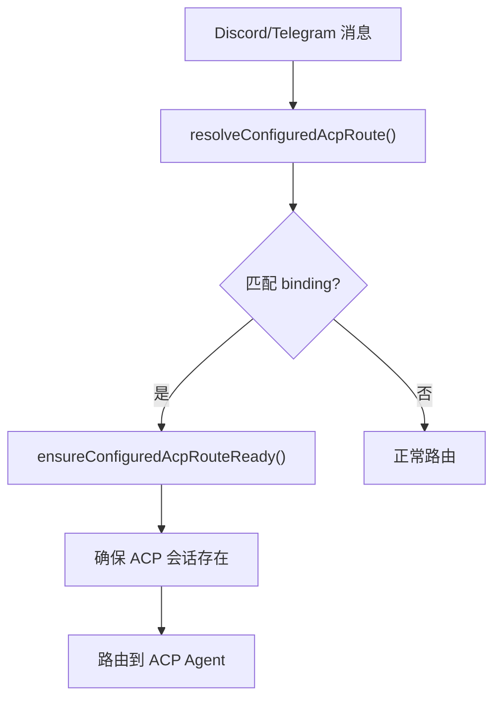

### 生命周期管理

`persistent-bindings.lifecycle.ts`：

- `ensureConfiguredAcpBinding()` — 创建或恢复绑定会话
- `resetConfiguredAcpBinding()` — 重置绑定会话
- 启动时 `reconcileAcpThreadBindingsOnStartup()` 恢复所有绑定

---

## Provenance：来源追踪

ACP 支持来源追踪，让 Gateway 知道消息来自 ACP 桥接：

### 模式

| 模式 | 说明 |
|------|------|
| `off` | 不追踪 |
| `meta` | 附带来源元数据（sessionId, channel, tool） |
| `meta+receipt` | 元数据 + 回执（bridge, host, cwd, session IDs） |

### 来源数据

```typescript
// meta 模式
{
  originSessionId: "acp-session-123",
  sourceChannel: "acp",
  sourceTool: "openclaw_acp"
}

// receipt 模式额外包含
{
  bridge: "openclaw-acp",
  host: "hostname",
  cwd: "/path/to/project",
  sessionIds: { acp: "...", gateway: "..." }
}
```

**安全限制**：`chat.send` 方法会检查发送者身份，只有 ACP bridge client（`displayName === "ACP" && version === "acp"`）才能发送 `systemInputProvenance` 和 `systemProvenanceReceipt` 字段。

---

## 安全机制

### 多层安全

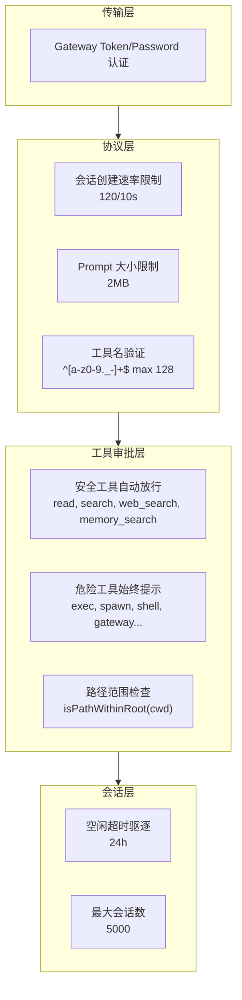

### Secret File 安全

`src/acp/secret-file.ts` → `readSecretFromFile()`：

- 最大文件大小限制
- 拒绝符号链接
- 去除尾部空白

### ACP Dispatch Policy

```typescript
// policy.ts
type AcpDispatchPolicyState =
  | "enabled"           // ACP 完全启用
  | "acp_disabled"      // ACP 被禁用
  | "dispatch_disabled" // ACP 启用但 dispatch 被禁用
```

- `isAcpEnabledByPolicy(cfg)` — `cfg.acp?.enabled !== false`
- `isAcpAgentAllowedByPolicy(cfg, agentId)` — 如果设置了 `allowedAgents`，agent 必须在列表中

---

## 配置参考

### 完整 ACP 配置

```json5
{
  acp: {
    // 是否启用 ACP
    enabled: true,

    // Runtime 后端（默认 "acpx"）
    backend: "acpx",

    // 默认 Agent
    defaultAgent: "main",

    // 允许的 Agent 列表（空 = 全部允许）
    allowedAgents: ["main", "coding"],

    // 最大并发会话
    maxConcurrentSessions: 100,

    // Dispatch 配置
    dispatch: {
      enabled: true,
    },

    // 流式输出配置
    stream: {
      // 合并空闲毫秒（减少小消息数量）
      coalesceIdleMs: 50,
      // 单次 chunk 最大字符
      maxChunkChars: 4096,
      // 重复抑制
      repeatSuppression: true,
      // 交付模式：live（实时）或 final_only（仅最终结果）
      deliveryMode: "live",
      // 最大输出字符
      maxOutputChars: 1000000,
      // 标签可见性控制
      tagVisibility: {
        agent_message_chunk: true,
        tool_call: true,
        tool_call_update: true,
        usage_update: false,
      },
    },

    // Runtime 配置
    runtime: {
      // 运行时 TTL（分钟）
      ttlMinutes: 60,
      // 安装命令
      installCommand: "npm install -g @acpx/runtime",
    },
  },
}
```

### Agent 级 ACP 配置

```json5
{
  agents: {
    coding: {
      acp: {
        // Agent 级 ACP 运行时配置
        runtime: { ... },
        // ACP 绑定
        bindings: [
          {
            type: "acp",
            channel: "discord",
            accountId: "123456",
            conversationId: "789",
            mode: "persistent",
          }
        ],
      },
    },
  },
}
```

---

## ACP 与 Gateway 的集成点

### Gateway 侧集成

| 集成点 | 文件 | 说明 |
|--------|------|------|
| 会话重置/删除 | `session-reset-service.ts` | 关闭 ACP runtime handle（15s 超时） |
| 启动 | `server-startup.ts` | 身份协调 `reconcilePendingSessionIdentities` |
| Chat 发送 | `server-methods/chat.ts` | ACP bridge client 身份检查，provenance 字段保护 |
| Agent 运行 | `server-methods/agent.ts` | 保留 session entry 的 `acp` 元数据 |
| Sessions patch | `sessions-patch.ts` | `acp:*` session key 视为 spawned session |

### Agent 侧集成

| 集成点 | 文件 | 说明 |
|--------|------|------|
| ACP spawn | `agents/acp-spawn.ts` | 通过 `sessions_spawn` 工具的 `runtime="acp"` 参数 |
| System prompt | `agents/system-prompt.ts` | 当 `acpEnabled` 时注入 ACP 路由指引 |
| Subagent announce | `agents/subagent-announce.ts` | ACP harness 指引 |
| Subagent lifecycle | `agents/subagent-lifecycle-events.ts` | `targetKind = "acp"` |
| Agent command | `commands/agent.ts` | ACP 会话路由到 `acpManager.runTurn` |

### 通道侧集成

| 通道 | 集成方式 |
|------|----------|
| Discord | Thread bindings (`targetKind: "acp"`), ACP route 解析, 原生命令路由 |
| Telegram | Topic conversation bindings, ACP route 解析, 原生命令路由 |

---

## ACPX 扩展

源码：`extensions/acpx/`

ACPX 是 OpenClaw 默认的 ACP runtime 后端实现，作为插件注册。

### 注册

```typescript
// extensions/acpx/service.ts
registerAcpRuntimeBackend("acpx", acpxRuntimeFactory);
```

### AcpxRuntime

实现 `AcpRuntime` 接口：

| 方法 | 说明 |
|------|------|
| `ensureSession` | 创建或恢复 ACPX 会话 |
| `runTurn` | 执行 turn，返回 AsyncIterable<AcpRuntimeEvent> |
| `getCapabilities` | 返回 runtime 能力 |
| `getStatus` | 返回会话状态 |
| `cancel` | 取消当前 turn |
| `close` | 关闭会话 |

### 自动启用

当配置中 `acp.enabled = true` 或 `acp.backend = "acpx"` 时，acpx 插件会被自动启用（`plugin-auto-enable.ts`）。

---

## 常见问题

### Q1: ACP 和 Gateway WebSocket 协议有什么区别？

| 维度 | ACP | Gateway WS |
|------|-----|-----------|
| 传输 | NDJSON over stdio | WebSocket |
| 场景 | IDE / CLI 集成 | 内部控制平面 |
| 认证 | 依赖 Gateway 认证 | Token / Password |
| 会话 | ACP 会话 → 映射到 Gateway session | 直接管理 session |
| 工具审批 | 客户端侧审批 | 服务端策略控制 |

ACP 是面向外部工具的高层协议，Gateway WS 是内部控制协议。ACP Server 本质上是 Gateway WS 的一个客户端，将 ACP 协议翻译为 Gateway 操作。

### Q2: 为什么工具权限要在客户端侧处理？

因为 ACP 的设计场景是 IDE 集成。用户在 IDE 中操作时，应该看到工具执行的审批提示并做出决策。这比服务端静默执行更安全，也更符合 IDE 的交互模式。

### Q3: 如何自定义 ACP Runtime 后端？

通过插件注册自定义后端：

```typescript
import { registerAcpRuntimeBackend } from "openclaw/plugin-sdk/acpx";

registerAcpRuntimeBackend("my-backend", {
  async ensureSession(input) { /* ... */ },
  async *runTurn(input) { yield { type: "text_delta", text: "..." }; },
  async cancel(handle) { /* ... */ },
  async close(handle) { /* ... */ },
});
```

然后在配置中指定 `acp.backend: "my-backend"`。

### Q4: Persistent Bindings 是怎么工作的？

当你在 Discord/Telegram 中通过特定 thread/topic 与 Agent 对话时，OpenClaw 可以将该对话绑定到一个 ACP 会话。这意味着：

1. 消息路由：Discord thread 的消息 → 匹配 binding → 路由到 ACP Agent
2. 会话持久化：对话历史保存在 ACP session 中
3. 跨重启恢复：Gateway 重启后自动恢复绑定

### Q5: ACP 的 `sessions_spawn` 和普通 `sessions_spawn` 有什么区别？

`sessions_spawn` 工具支持 `runtime="acp"` 参数，此时会通过 `spawnAcpDirect()` 而非普通 subagent 执行。ACP spawn 会：
- 通过 AcpSessionManager 创建 ACP 会话
- 使用配置的 ACP runtime 后端
- 受 ACP dispatch policy 控制
- 支持 ACP 特有的流式输出和 stream 配置

### Q6: 错误码代表什么？

| 错误码 | 说明 |
|--------|------|
| `ACP_BACKEND_MISSING` | 没有注册任何 runtime 后端 |
| `ACP_BACKEND_UNAVAILABLE` | 后端不可用 |
| `ACP_BACKEND_UNSUPPORTED_CONTROL` | 后端不支持请求的控制操作 |
| `ACP_DISPATCH_DISABLED` | ACP dispatch 被配置禁用 |
| `ACP_INVALID_RUNTIME_OPTION` | 无效的 runtime 配置选项 |
| `ACP_SESSION_INIT_FAILED` | 会话初始化失败 |
| `ACP_TURN_FAILED` | turn 执行失败 |

---

## 关键源码文件索引

| 文件 | 职责 |
|------|------|
| `src/acp/translator.ts` | AcpGatewayAgent — ACP↔Gateway 核心桥接 |
| `src/acp/server.ts` | ACP Server 入口（stdio + Gateway WS） |
| `src/acp/client.ts` | ACP Client（启动子进程、交互循环、权限审批） |
| `src/acp/types.ts` | 核心类型（AcpSession, AcpServerOptions, Provenance） |
| `src/acp/session.ts` | 内存会话存储（限制、TTL、驱逐） |
| `src/acp/session-mapper.ts` | Session key/label 映射和解析 |
| `src/acp/event-mapper.ts` | 事件格式转换（Prompt、Tool、Attachment） |
| `src/acp/policy.ts` | Dispatch 策略控制 |
| `src/acp/commands.ts` | 可用命令列表 |
| `src/acp/control-plane/manager.core.ts` | AcpSessionManager 实现 |
| `src/acp/control-plane/session-actor-queue.ts` | 会话级串行化 |
| `src/acp/control-plane/runtime-cache.ts` | Runtime 句柄缓存 |
| `src/acp/runtime/types.ts` | AcpRuntime 接口和事件类型 |
| `src/acp/runtime/registry.ts` | Backend 注册表 |
| `src/acp/runtime/errors.ts` | AcpRuntimeError 和错误码 |
| `src/acp/persistent-bindings.*.ts` | Discord/Telegram 通道绑定 |
| `src/config/types.acp.ts` | ACP 配置类型 |
| `extensions/acpx/` | ACPX 默认 runtime 后端 |

---

*基于 OpenClaw v2026.2.3-1 源码 `src/acp/` 及相关模块分析*
