# OpenClaw Agent Loop 机制源码深度分析

> 基于源码的全面解析，帮助你深入理解 OpenClaw 的 Agent 循环执行机制

## 目录

- [概述](#概述)
- [架构设计](#架构设计)
- [核心组件](#核心组件)
  - [运行器入口](#运行器入口)
  - [执行尝试](#执行尝试)
  - [会话压缩](#会话压缩)
  - [运行状态管理](#运行状态管理)
- [消息处理流程](#消息处理流程)
  - [消息接收](#消息接收)
  - [提示词构建](#提示词构建)
  - [LLM 调用](#llm-调用)
  - [工具执行循环](#工具执行循环)
- [关键机制](#关键机制)
  - [流式响应](#流式响应)
  - [上下文管理](#上下文管理)
  - [工具策略](#工具策略)
  - [错误处理](#错误处理)
- [生命周期](#生命周期)
- [Mermaid 流程图](#mermaid-流程图)
- [源码关键代码解读](#源码关键代码解读)
- [常见问题](#常见问题)

---

## 概述

OpenClaw 的 **Agent Loop（代理循环）** 是系统的核心执行引擎，负责接收消息、构建上下文、调用 LLM、执行工具、处理响应，形成一个完整的对话循环。

### 核心特性

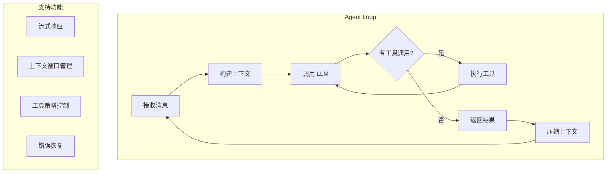

### 循环流程

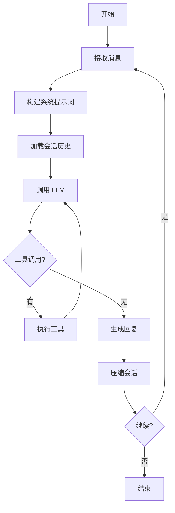

---

## 架构设计

### 模块结构

```
src/agents/pi-embedded-runner/
├── run.ts                          # 主运行入口
├── run/
│   ├── params.ts                  # 运行参数
│   ├── attempt.ts                 # 单次执行尝试
│   ├── payloads.ts                # 载荷构建
│   └── images.ts                  # 图片处理
├── compact.ts                      # 会话压缩
├── runs.ts                         # 运行状态管理
├── history.ts                      # 历史管理
├── lanes.ts                        # 执行队列通道
├── system-prompt.ts               # 系统提示词构建
├── tool-split.ts                  # 工具拆分
├── tool-result-truncation.ts      # 工具结果截断
├── types.ts                       # 类型定义
└── utils.ts                       # 工具函数
```

### 核心类型定义

```typescript
// types.ts

export type EmbeddedPiRunResult = {
  success: boolean;
  reply?: string;
  usage?: Usage;
  error?: string;
};

export type EmbeddedPiAgentMeta = {
  runId: string;
  sessionId: string;
  provider: string;
  modelId: string;
  thinkLevel: ThinkLevel;
};

// 运行状态
export type EmbeddedPiRunStatus =
  | { status: "idle" }
  | { status: "streaming" }
  | { status: "compacting" }
  | { status: "completed" }
  | { status: "error"; error: string };
```

---

## 核心组件

### 运行器入口

**文件**: `run.ts`

主入口函数，处理整个运行生命周期。

```typescript
export async function runEmbeddedPiAgent(
  params: RunEmbeddedPiAgentParams,
): Promise<EmbeddedPiRunResult> {
  const sessionLane = resolveSessionLane(params.sessionKey || params.sessionId);
  
  return enqueueSession(() =>
    enqueueGlobal(async () => {
      // 1. 准备工作区
      const workspaceResolution = resolveRunWorkspaceDir({...});
      const resolvedWorkspace = workspaceResolution.workspaceDir;
      
      // 2. 解析模型配置
      const { model, error, authStorage } = resolveModel(
        provider, modelId, agentDir, params.config
      );
      
      if (!model) {
        throw new Error(error ?? `Unknown model: ${provider}/${modelId}`);
      }
      
      // 3. 检查上下文窗口
      const ctxInfo = resolveContextWindowInfo({...});
      const ctxGuard = evaluateContextWindowGuard({...});
      
      // 4. 执行循环
      const result = await runEmbeddedAttempt({
        ...params,
        model,
        authStorage,
        workspaceDir: resolvedWorkspace,
        sessionId: redactedSessionId,
      });
      
      return result;
    })
  );
}
```

**参数定义**:

```typescript
type RunEmbeddedPiAgentParams = {
  message: string;              // 用户消息
  sessionId: string;            // 会话 ID
  sessionKey?: string;         // 会话 Key
  agentId?: string;            // Agent ID
  provider?: string;           // 模型提供商
  model?: string;             // 模型名称
  workspaceDir?: string;      // 工作区目录
  config?: OpenClawConfig;    // 配置
  messageChannel?: string;   // 消息通道
  messageProvider?: string;   // 消息提供商
  // ... 更多参数
};
```

### 执行尝试

**文件**: `run/attempt.ts`

单个执行尝试，包含完整的 LLM 调用和工具执行循环。

```typescript
export async function runEmbeddedAttempt(
  params: EmbeddedRunAttemptParams,
): Promise<EmbeddedRunAttemptResult> {
  const workspace = resolveUserPath(params.workspaceDir);
  
  // 1. 解析沙箱配置
  const sandbox = await resolveSandboxContext({
    config: params.config,
    sessionKey: params.sessionKey || params.sessionId,
    workspaceDir: workspace,
  });
  
  // 2. 加载 Skills
  const skillEntries = loadWorkspaceSkillEntries(workspace);
  const skillsPrompt = resolveSkillsPromptForRun({...});
  
  // 3. 构建系统提示词
  const { systemPrompt, snapshot } = buildEmbeddedSystemPrompt({...});
  
  // 4. 准备会话管理器
  const sessionManager = await prepareSessionManagerForRun({
    sessionId: params.sessionId,
    sessionKey: params.sessionKey,
    systemPrompt,
    workspaceDir: workspace,
    config: params.config,
  });
  
  // 5. 构建工具定义
  const tools = await toClientToolDefinitions({
    config: params.config,
    sessionManager,
    sandbox,
  });
  
  // 6. 注册运行状态
  const handle = registerRun({
    sessionId: params.sessionId,
    sessionManager,
  });
  
  try {
    // 7. 发送用户消息
    await sessionManager.appendUserMessage(params.message);
    
    // 8. 执行主循环
    while (true) {
      // 调用 LLM
      const response = await sessionManager.complete({
        model: params.modelId,
        tools,
        thinking: params.thinkLevel,
      });
      
      // 检查是否有工具调用
      if (response.tool_calls?.length > 0) {
        // 执行工具
        for (const toolCall of response.tool_calls) {
          const result = await executeTool(toolCall);
          await sessionManager.appendToolResult(toolCall.id, toolCall.name, result);
        }
        continue;  // 继续循环
      }
      
      // 没有工具调用，返回结果
      return {
        success: true,
        reply: response.content,
        usage: response.usage,
      };
    }
  } finally {
    unregisterRun(params.sessionId);
  }
}
```

### 会话压缩

**文件**: `compact.ts`

管理上下文窗口，避免超出限制。

```typescript
export async function compactEmbeddedPiSession(
  params: CompactEmbeddedPiSessionParams,
): Promise<EmbeddedPiCompactResult> {
  const { sessionManager } = await prepareSessionManagerForRun({...});
  
  // 1. 检查是否需要压缩
  const needsCompaction = await sessionManager.needsCompaction();
  
  if (!needsCompaction) {
    return { ok: true, compacted: false };
  }
  
  // 2. 估算压缩后的令牌数
  const estimate = await sessionManager.compactionEstimate();
  
  // 3. 执行压缩
  const result = await sessionManager.compact({
    systemPrompt: buildSystemPrompt(),
    reserveTokens: resolveCompactionReserveTokensFloor(params.config),
  });
  
  if (result.success) {
    return {
      ok: true,
      compacted: true,
      originalTokens: estimate.originalTokens,
      compactedTokens: result.tokenCount,
    };
  }
  
  return {
    ok: false,
    compacted: false,
    reason: result.error,
  };
}
```

### 运行状态管理

**文件**: `runs.ts`

跟踪当前运行的会话状态。

```typescript
// 活动运行映射
const ACTIVE_EMBEDDED_RUNS = new Map<string, EmbeddedPiQueueHandle>();

// 等待器映射
const EMBEDDED_RUN_WAITERS = new Map<string, Set<EmbeddedRunWaiter>>();

// 注册活动运行
export function setActiveEmbeddedRun(
  sessionId: string,
  handle: EmbeddedPiQueueHandle
) {
  ACTIVE_EMBEDDED_RUNS.set(sessionId, handle);
}

// 检查是否有活动运行
export function isEmbeddedPiRunActive(sessionId: string): boolean {
  return ACTIVE_EMBEDDED_RUNS.has(sessionId);
}

// 队列消息（用于流式响应）
export function queueEmbeddedPiMessage(sessionId: string, text: string): boolean {
  const handle = ACTIVE_EMBEDDED_RUNS.get(sessionId);
  if (!handle) return false;
  
  handle.queueMessage(text);
  return true;
}

// 中断运行
export function abortEmbeddedPiRun(sessionId: string): boolean {
  const handle = ACTIVE_EMBEDDED_RUNS.get(sessionId);
  if (!handle) return false;
  
  handle.abort();
  return true;
}
```

---

## 消息处理流程

### 消息接收

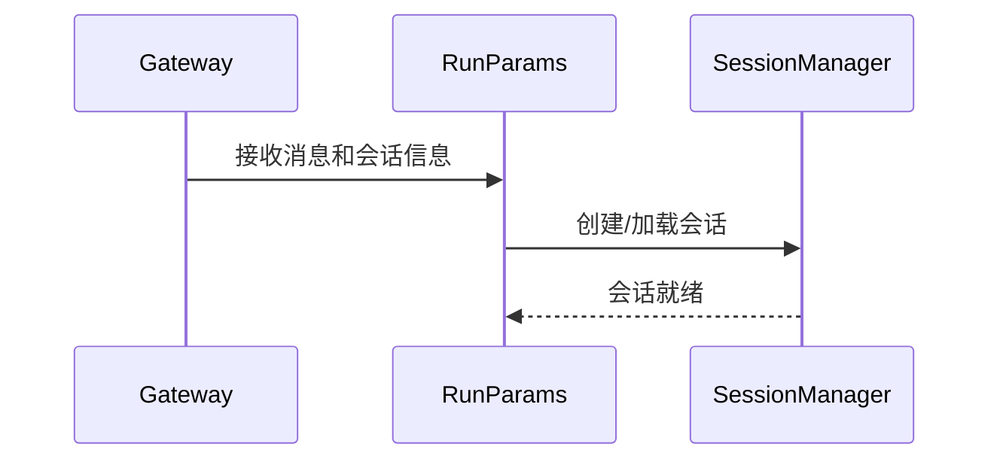

```typescript
// 从参数构建运行上下文
async function prepareRunContext(params) {
  // 1. 解析会话
  const sessionManager = await prepareSessionManagerForRun({
    sessionId: params.sessionId,
    sessionKey: params.sessionKey,
    workspaceDir: params.workspaceDir,
    config: params.config,
  });
  
  // 2. 加载引导文件
  const { bootstrapFiles, contextFiles } = await resolveBootstrapContextForRun({
    workspaceDir: params.workspaceDir,
    config: params.config,
    sessionKey: params.sessionKey,
  });
  
  return { sessionManager, bootstrapFiles, contextFiles };
}
```

### 提示词构建

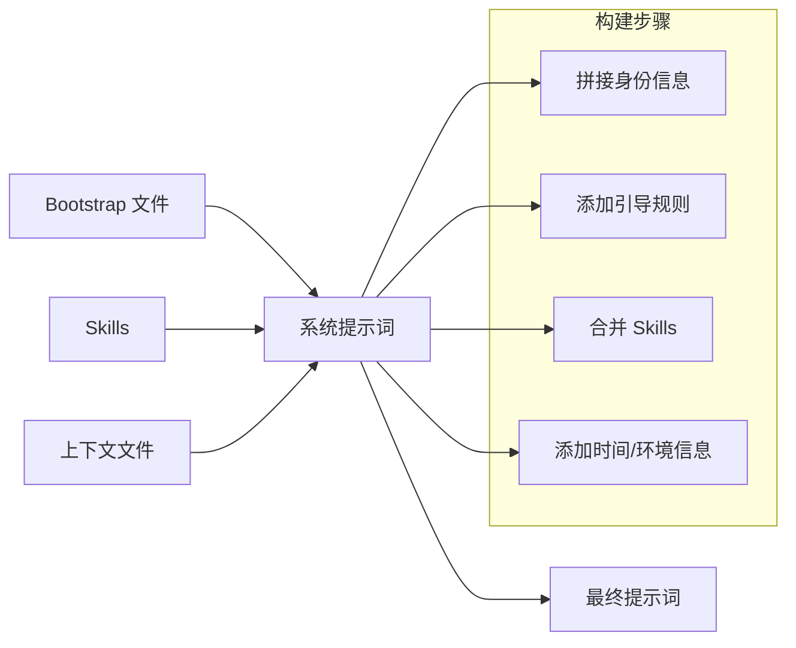

```typescript
// 构建系统提示词
function buildEmbeddedSystemPrompt(params) {
  const { sessionManager, config, workspaceDir, bootstrapFiles } = params;
  
  // 1. 基础身份
  const identity = buildIdentitySection();
  
  // 2. 引导文件内容
  const bootstrap = loadBootstrapFiles(bootstrapFiles);
  
  // 3. Skills 提示
  const skills = resolveSkillsPromptForRun({
    config,
    workspaceDir,
  });
  
  // 4. 工具描述
  const tools = buildToolDescriptions();
  
  // 5. 合并所有部分
  return [
    identity,
    bootstrap,
    skills,
    tools,
  ].join("\n\n---\n\n");
}
```

### LLM 调用

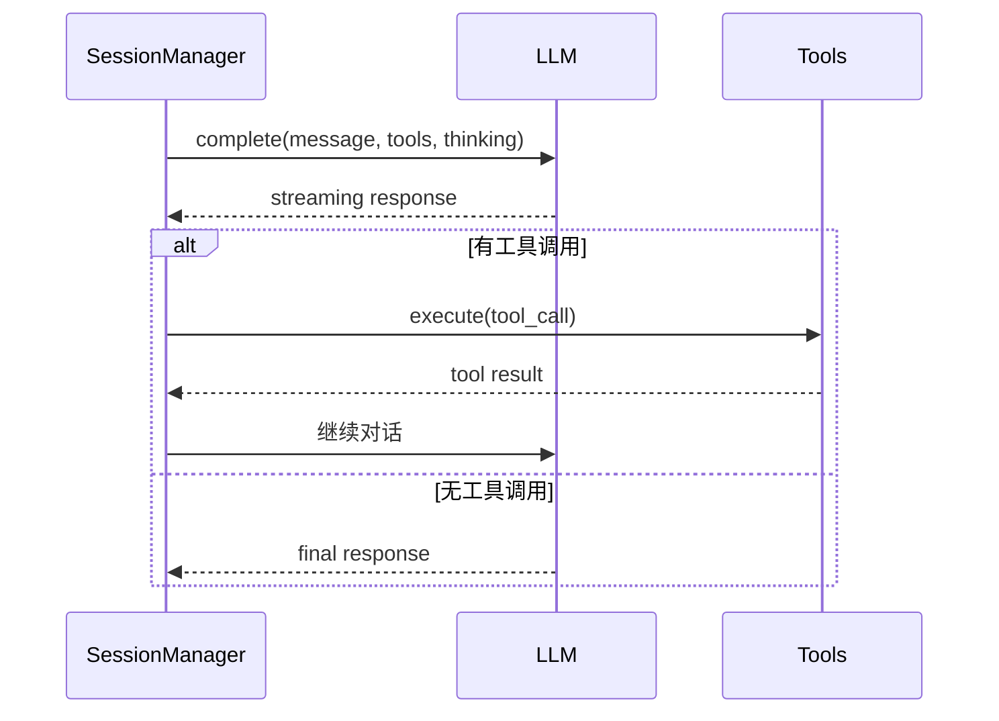

```typescript
// 执行 LLM 调用
async function callLLM(params) {
  const { sessionManager, model, tools, thinking } = params;
  
  const response = await sessionManager.complete({
    model,
    tools,
    thinking,
    
    // 流式回调
    onChunk: (chunk) => {
      // 处理流式响应
      handleStreamingChunk(chunk);
    },
    
    onComplete: (response) => {
      // 处理完成
      handleComplete(response);
    },
  });
  
  return response;
}
```

### 工具执行循环

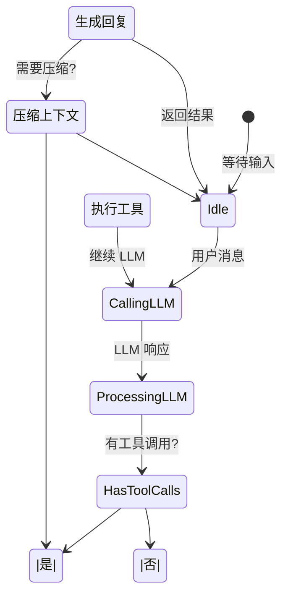

```typescript
// 主执行循环
async function executeLoop(params) {
  const { sessionManager, tools } = params;
  
  // 1. 发送用户消息
  await sessionManager.appendUserMessage(params.message);
  
  // 2. 循环直到没有工具调用
  while (true) {
    // 2.1 调用 LLM
    const response = await sessionManager.complete({
      model: params.modelId,
      tools,
      thinking: params.thinkLevel,
    });
    
    // 2.2 检查工具调用
    if (response.tool_calls?.length > 0) {
      // 2.3 执行所有工具调用
      for (const toolCall of response.tool_calls) {
        const result = await executeTool(toolCall);
        
        // 2.4 添加工具结果到会话
        await sessionManager.appendToolResult(
          toolCall.id,
          toolCall.name,
          result
        );
      }
      
      // 2.5 继续循环
      continue;
    }
    
    // 3. 没有工具调用，完成
    return {
      success: true,
      reply: response.content,
      usage: response.usage,
    };
  }
}
```

---

## 关键机制

### 流式响应

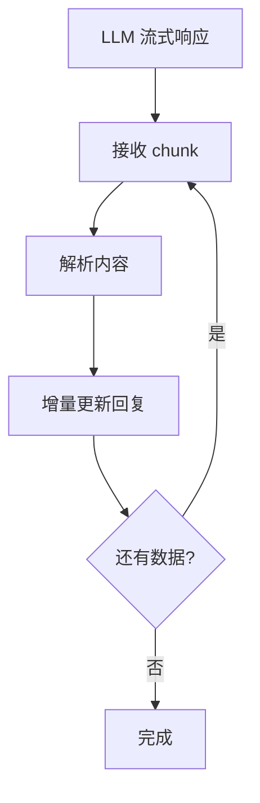

```typescript
// 流式响应处理
async function handleStreaming(params) {
  const { sessionManager, onChunk } = params;
  
  // 累积响应
  let accumulatedContent = "";
  
  await sessionManager.complete({
    model: params.modelId,
    tools: params.tools,
    thinking: params.thinking,
    
    // 流式回调
    onChunk: async (chunk) => {
      if (chunk.content) {
        accumulatedContent += chunk.content;
        
        // 发送增量更新
        onChunk?.({
          type: "content",
          content: chunk.content,
          fullContent: accumulatedContent,
        });
      }
      
      if (chunk.tool_use) {
        // 工具调用开始
        onChunk?.({
          type: "tool_call",
          tool: chunk.tool_use.name,
          id: chunk.tool_use.id,
        });
      }
    },
  });
}
```

### 上下文管理

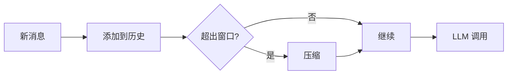

```typescript
// 上下文窗口管理
async function manageContext(params) {
  const { sessionManager, config } = params;
  
  // 1. 检查当前上下文大小
  const info = await sessionManager.contextInfo();
  
  if (info.tokenCount > config.contextWindow * 0.9) {
    // 2. 需要压缩
    const result = await sessionManager.compact({
      systemPrompt: buildSystemPrompt(),
      reserveTokens: resolveCompactionReserveTokensFloor(config),
    });
    
    if (!result.success) {
      throw new Error("Compaction failed: " + result.error);
    }
    
    return { compacted: true, originalTokens: info.tokenCount };
  }
  
  return { compacted: false, originalTokens: info.tokenCount };
}
```

### 工具策略

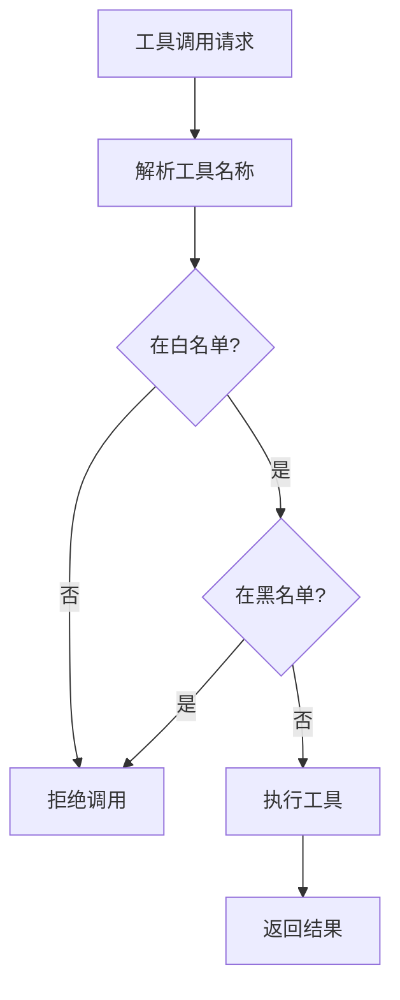

```typescript
// 工具策略检查
async function checkToolPolicy(params) {
  const { toolName, config, session } = params;
  
  // 获取工具策略
  const policy = resolveSandboxToolPolicyForAgent(
    config,
    session.agentId
  );
  
  // 检查是否允许
  if (!isToolAllowed(policy, toolName)) {
    return {
      allowed: false,
      reason: `Tool "${toolName}" is blocked by policy`,
    };
  }
  
  return { allowed: true };
}
```

### 错误处理

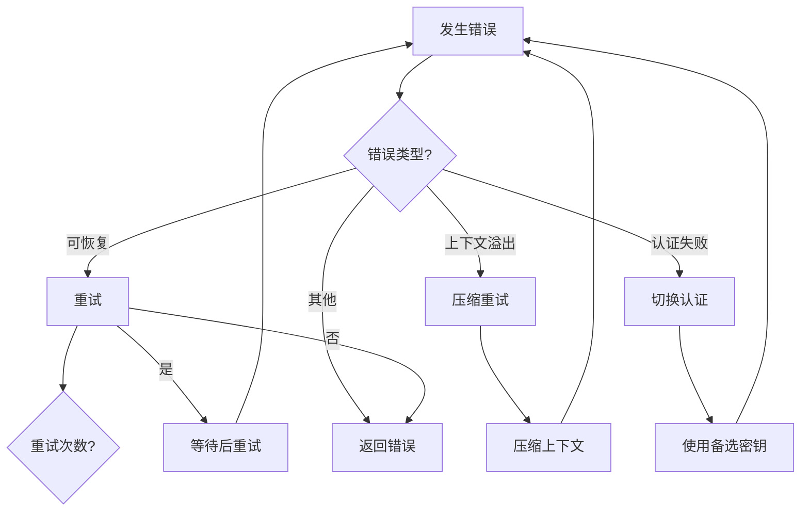

```typescript
// 错误处理和重试
async function handleError(params) {
  const { error, sessionManager, retryCount } = params;
  
  if (isContextOverflowError(error)) {
    // 1. 上下文溢出，尝试压缩
    const compactResult = await sessionManager.compact({
      systemPrompt: buildSystemPrompt(),
      reserveTokens: resolveCompactionReserveTokensFloor(),
    });
    
    if (compactResult.success && retryCount < MAX_RETRIES) {
      return { action: "retry", reason: "compacted" };
    }
  }
  
  if (isAuthError(error)) {
    // 2. 认证错误，尝试切换
    const failover = await attemptAuthFailover(sessionManager);
    if (failover.success) {
      return { action: "retry", reason: "auth_failover" };
    }
  }
  
  if (isRateLimitError(error)) {
    // 3. 速率限制，等待后重试
    await sleep(getRetryDelay(error));
    return { action: "retry", reason: "rate_limit" };
  }
  
  // 4. 其他错误
  return { action: "fail", error: error.message };
}
```

---

## 生命周期

### 完整生命周期

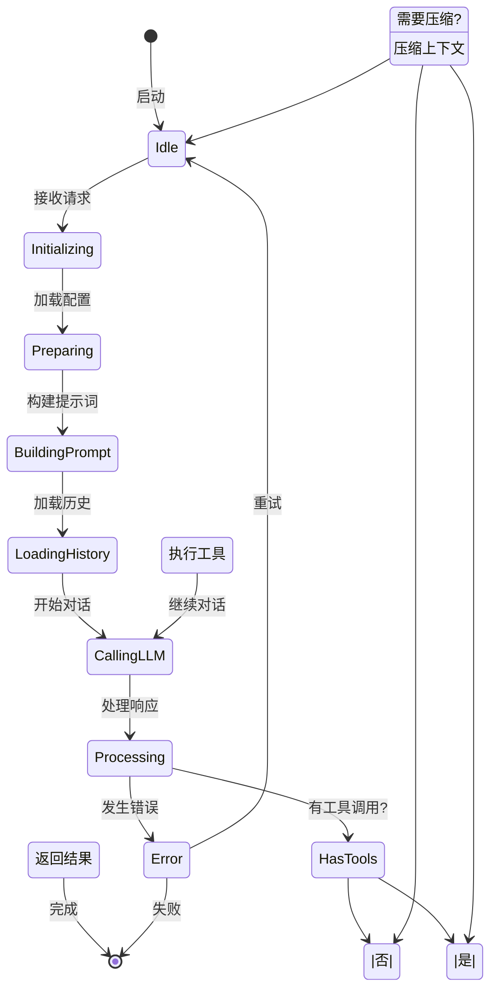

### 状态转换

```typescript
// 状态枚举
enum AgentLoopState {
  IDLE = "idle",
  INITIALIZING = "initializing",
  PREPARING = "preparing",
  BUILDING_PROMPT = "building_prompt",
  LOADING_HISTORY = "loading_history",
  CALLING_LLM = "calling_llm",
  PROCESSING = "processing",
  EXECUTING = "executing",
  COMPACTING = "compacting",
  RETURNING = "returning",
  ERROR = "error",
}

// 状态机
class AgentLoopStateMachine {
  private currentState: AgentLoopState = AgentLoopState.IDLE;
  
  transition(event: AgentLoopEvent): void {
    switch (this.currentState) {
      case AgentLoopState.IDLE:
        if (event === "REQUEST") {
          this.currentState = AgentLoopState.INITIALIZING;
        }
        break;
      // ... 其他转换
    }
  }
}
```

---

## Mermaid 流程图

### 完整消息处理流程

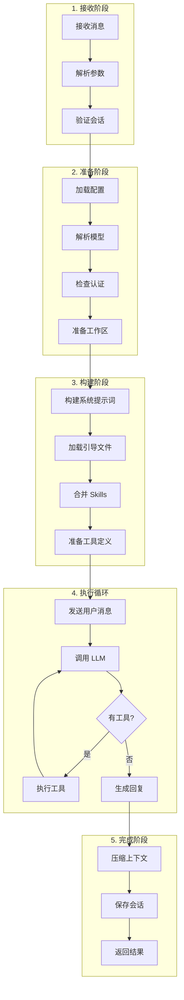

### 错误恢复流程

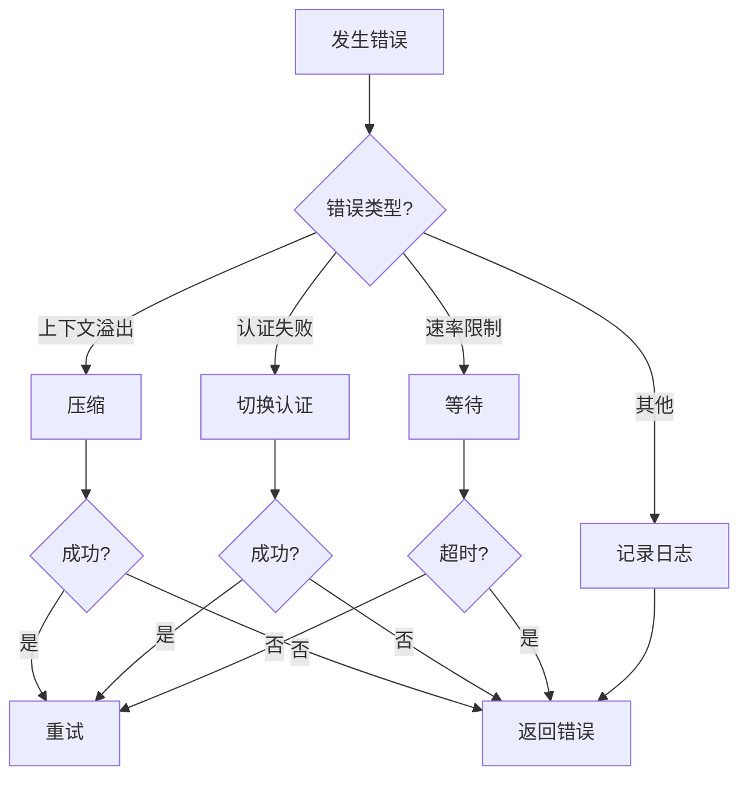

### 上下文管理流程

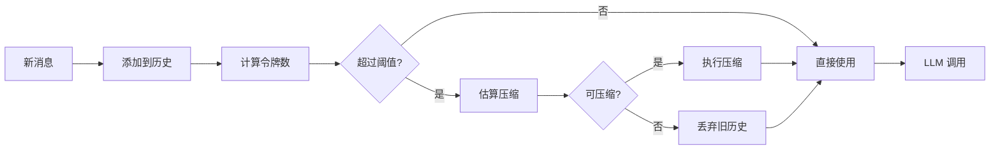

---

## 源码关键代码解读

### 1. 主运行入口

```typescript
// run.ts

export async function runEmbeddedPiAgent(
  params: RunEmbeddedPiAgentParams,
): Promise<EmbeddedPiRunResult> {
  const started = Date.now();
  
  // 1. 解析执行通道（支持优先级队列）
  const sessionLane = resolveSessionLane(params.sessionKey || params.sessionId);
  const globalLane = resolveGlobalLane(params.lane);
  
  return enqueueSession(() =>
    enqueueGlobal(async () => {
      try {
        // 2. 准备工作区
        const workspace = resolveRunWorkspaceDir({
          workspaceDir: params.workspaceDir,
          sessionKey: params.sessionKey,
          agentId: params.agentId,
        });
        
        // 3. 解析模型配置
        const { model, authStorage } = await resolveModel({
          provider: params.provider,
          modelId: params.model,
          agentDir: params.agentDir,
        });
        
        // 4. 执行
        const result = await runEmbeddedAttempt({
          ...params,
          model,
          authStorage,
          workspaceDir: workspace.workspaceDir,
        });
        
        // 5. 记录指标
        logRunMetrics({
          runId: params.runId,
          duration: Date.now() - started,
          result,
        });
        
        return result;
      } catch (error) {
        return handleRunError(error);
      }
    })
  );
}
```

### 2. 执行尝试循环

```typescript
// run/attempt.ts

export async function runEmbeddedAttempt(params): Promise<EmbeddedRunAttemptResult> {
  const { sessionManager, tools } = params;
  
  // 注册运行状态
  const handle = registerRun({
    sessionId: params.sessionId,
    sessionManager,
  });
  
  try {
    // 发送用户消息
    await sessionManager.appendUserMessage(params.message);
    
    // 主循环
    let iterations = 0;
    const maxIterations = params.maxIterations ?? 20;
    
    while (iterations < maxIterations) {
      iterations++;
      
      // 调用 LLM
      const response = await sessionManager.complete({
        model: params.modelId,
        tools,
        thinking: params.thinkLevel,
        
        onChunk: (chunk) => {
          // 流式处理
          handleStreamingChunk(chunk);
        },
      });
      
      // 检查工具调用
      if (response.tool_calls?.length > 0) {
        // 执行所有工具调用
        for (const toolCall of response.tool_calls) {
          const result = await executeTool({
            name: toolCall.name,
            arguments: toolCall.arguments,
          });
          
          // 添加工具结果
          await sessionManager.appendToolResult({
            callId: toolCall.id,
            name: toolCall.name,
            content: result,
          });
        }
        
        continue;  // 继续循环
      }
      
      // 完成
      return {
        success: true,
        reply: response.content,
        usage: response.usage,
      };
    }
    
    // 超出最大迭代次数
    return {
      success: false,
      error: "Max iterations exceeded",
    };
  } finally {
    unregisterRun(params.sessionId);
  }
}
```

### 3. 会话压缩

```typescript
// compact.ts

export async function compactEmbeddedPiSession(params): Promise<EmbeddedPiCompactResult> {
  const { sessionManager, config } = params;
  
  // 1. 检查是否需要压缩
  const needsCompaction = await sessionManager.needsCompaction();
  if (!needsCompaction) {
    return { ok: true, compacted: false };
  }
  
  // 2. 获取压缩估算
  const estimate = await sessionManager.compactionEstimate();
  
  // 3. 执行压缩
  const result = await sessionManager.compact({
    systemPrompt: buildSystemPrompt(),
    reserveTokens: resolveCompactionReserveTokensFloor(config),
    
    // 压缩策略
    strategy: "summarize",  // 总结模式
    targetTokens: estimate.targetTokens,
  });
  
  if (result.success) {
    return {
      ok: true,
      compacted: true,
      originalTokens: estimate.originalTokens,
      compactedTokens: result.tokenCount,
    };
  }
  
  return {
    ok: false,
    compacted: false,
    reason: result.error,
  };
}
```

### 4. 工具执行

```typescript
// 工具执行逻辑
async function executeTool(params) {
  const { name, arguments } = params;
  
  // 1. 查找工具定义
  const toolDef = findToolDefinition(name);
  if (!toolDef) {
    return { error: `Unknown tool: ${name}` };
  }
  
  // 2. 验证参数
  const validation = validateParameters(toolDef.schema, arguments);
  if (!validation.valid) {
    return { error: validation.error };
  }
  
  // 3. 检查策略
  const policyCheck = await checkToolPolicy({
    toolName: name,
    arguments,
  });
  if (!policyCheck.allowed) {
    return { error: policyCheck.reason };
  }
  
  // 4. 执行工具
  try {
    const result = await toolDef.handler(arguments);
    return { success: true, result };
  } catch (error) {
    return { error: error.message };
  }
}
```

### 5. 错误分类

```typescript
// 错误分类和恢复
function classifyError(error: Error): ErrorCategory {
  const message = error.message;
  
  if (message.includes("context_length_exceeded")) {
    return "CONTEXT_OVERFLOW";
  }
  
  if (message.includes("rate_limit")) {
    return "RATE_LIMIT";
  }
  
  if (message.includes("authentication")) {
    return "AUTH_ERROR";
  }
  
  if (message.includes("timeout")) {
    return "TIMEOUT";
  }
  
  return "UNKNOWN";
}

// 错误恢复策略
async function recoverFromError(
  error: Error,
  context: RunContext,
): Promise<RecoveryResult> {
  const category = classifyError(error);
  
  switch (category) {
    case "CONTEXT_OVERFLOW":
      // 尝试压缩
      const compactResult = await compactSession(context);
      if (compactResult.success) {
        return { action: "retry", reason: "compacted" };
      }
      return { action: "fail", reason: "cannot_compact" };
    
    case "RATE_LIMIT":
      // 等待后重试
      await sleep(getRetryDelay(error));
      return { action: "retry", reason: "rate_limited" };
    
    case "AUTH_ERROR":
      // 尝试切换认证
      const failoverResult = await attemptAuthFailover(context);
      if (failoverResult.success) {
        return { action: "retry", reason: "auth_failover" };
      }
      return { action: "fail", reason: "auth_failed" };
    
    default:
      return { action: "fail", reason: error.message };
  }
}
```

---

## 常见问题

### Q1: Agent Loop 和普通对话有什么区别？

| 方面 | Agent Loop | 普通对话 |
|------|-----------|---------|
| **工具调用** | 支持自动调用工具 | 仅文本交互 |
| **迭代** | 循环直到无工具调用 | 单轮响应 |
| **上下文** | 自动压缩管理 | 手动管理 |
| **流式** | 支持增量响应 | 等待完整响应 |

### Q2: 如何限制循环次数？

```typescript
// 配置最大迭代次数
await runEmbeddedPiAgent({
  message: "...",
  maxIterations: 10,  // 最多 10 轮（LLM 调用）
});
```

### Q3: 上下文压缩会影响质量吗？

压缩策略：
- **summarize**: 总结旧消息，保留关键信息
- **truncate**: 截断超长消息
- **hybrid**: 结合总结和截断

```typescript
// 配置压缩策略
{
  agents: {
    defaults: {
      compaction: {
        strategy: "summarize",
        reserveTokens: 2000,
      },
    },
  },
}
```

### Q4: 如何调试循环过程？

```typescript
// 启用调试日志
log.setLevel("debug");

// 查看详细执行流程
await runEmbeddedPiAgent({
  message: "...",
  debug: {
    logSteps: true,
    logTools: true,
    logPrompt: true,
  },
});
```

### Q5: 工具调用失败会怎样？

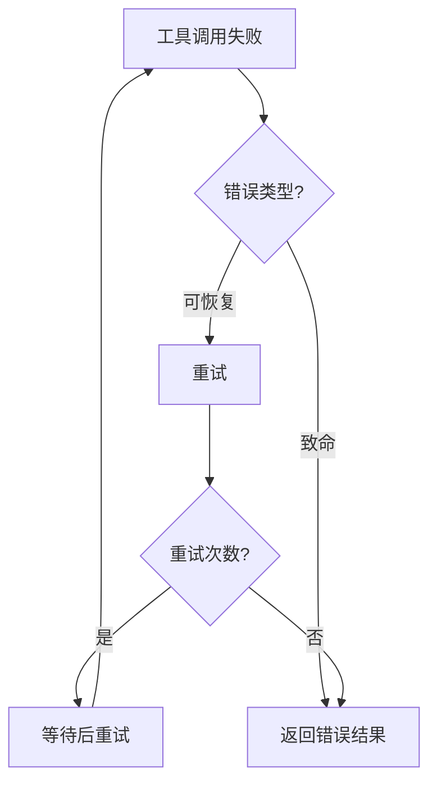

### Q6: 如何处理长时间运行的任务？

```typescript
// 设置超时
await runEmbeddedPiAgent({
  message: "分析这个大型项目",
  timeoutMs: 300000,  // 5 分钟超时
});

// 或者使用后台执行
await sessions_spawn({
  task: "深度分析代码库",
  runTimeoutSeconds: 1800,  // 30 分钟
  cleanup: "keep",  // 保留结果
});
```

### Q7: 流式响应如何工作？

```typescript
// 启用流式
await runEmbeddedPiAgent({
  message: "写一篇长文章",
  streaming: true,
  
  onChunk: (chunk) => {
    // 实时接收增量内容
    process.stdout.write(chunk.content);
  },
  
  onComplete: (result) => {
    // 完成后处理
    console.log("\n完成!");
  },
});
```

### Q8: 如何自定义工具策略？

```yaml
# openclaw.yaml
tools:
  sandbox:
    tools:
      allow:
        - read
        - write
        - exec
      deny:
        - dangerous_command
```

---

## 总结

OpenClaw Agent Loop 机制核心要点：

### 架构设计

1. **模块化** - 分离运行、尝试、压缩等功能
2. **状态管理** - 跟踪运行状态和等待者
3. **错误恢复** - 多种错误类型对应不同恢复策略
4. **上下文优化** - 自动压缩避免超出窗口限制

### 关键流程

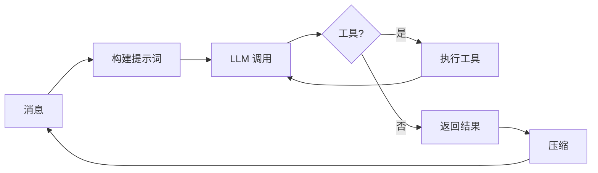

### 最佳实践

1. **合理设置超时** - 避免长时间阻塞
2. **配置压缩策略** - 根据需求选择总结或截断
3. **工具白名单** - 只暴露必要的工具
4. **监控执行** - 使用日志追踪执行流程

掌握这些概念，就能深入理解并高效使用 OpenClaw 的 Agent Loop 机制！
