# OpenClaw Agent Loop 源码深度分析

> 基于 `src/agents/pi-embedded-runner/` 源码的全面解析，深入理解 Agent 循环执行机制的设计理念和实现细节

## 目录

- [设计理念](#设计理念)
- [模块结构](#模块结构)
- [外层运行循环：run.ts](#外层运行循环runts)
  - [Lane 并发控制](#lane-并发控制)
  - [模型解析与上下文窗口](#模型解析与上下文窗口)
  - [Auth Profile 轮转](#auth-profile-轮转)
  - [重试与 Failover 策略](#重试与-failover-策略)
- [单次执行尝试：attempt.ts](#单次执行尝试attemptts)
  - [Attempt 内部步骤](#attempt-内部步骤)
  - [工具创建与分组](#工具创建与分组)
  - [System Prompt 构建管线](#system-prompt-构建管线)
  - [Tool Name Normalization](#tool-name-normalization)
  - [sessions_yield 中断机制](#sessions_yield-中断机制)
- [上下文窗口管理](#上下文窗口管理)
  - [Context Window Guard](#context-window-guard)
  - [Compaction Safeguard Extension](#compaction-safeguard-extension)
  - [Tool Result Context Guard](#tool-result-context-guard)
  - [Context Overflow 恢复策略](#context-overflow-恢复策略)
- [会话压缩：compact.ts](#会话压缩compactts)
- [运行状态管理：runs.ts](#运行状态管理runsts)
- [载荷构建：payloads.ts](#载荷构建payloadsts)
- [错误处理与恢复](#错误处理与恢复)
- [生命周期状态机](#生命周期状态机)
- [关键常量参考](#关键常量参考)
- [常见问题](#常见问题)

---

## 设计理念

Agent Loop 的设计回答了一个核心问题：**如何在不可靠的 LLM API 上构建一个可靠的、可自愈的执行引擎？**

设计哲学：

1. **重试优先于失败**：LLM API 的错误（rate limit、auth 过期、context overflow）多数是瞬时的。通过 Auth profile 轮转、context compaction、backoff 等机制，尽可能自动恢复，而非直接报错给用户。
2. **Lane 并发控制**：同一 session 的请求串行化（session lane），全局请求受限（global lane），避免 API 配额竞争和会话状态冲突。
3. **渐进式上下文管理**：不是一次性加载所有历史，而是通过 compaction safeguard 主动裁剪、tool result guard 预防性截断、overflow 后多级恢复，保持上下文在窗口内。
4. **Provider 容错**：不同 LLM provider 返回的工具调用格式有差异（工具名异常、消息顺序等），通过 normalization 层统一处理。

---

## 模块结构

```
src/agents/pi-embedded-runner/
├── run.ts                              # 外层运行循环：lane 入队、模型解析、auth 轮转、重试
├── run/
│   ├── attempt.ts                      # 单次尝试：sandbox、skills、prompt、工具、LLM 调用
│   ├── params.ts                       # RunEmbeddedPiAgentParams 类型
│   ├── payloads.ts                     # 回复载荷构建（文本、媒体、错误、推理）
│   ├── types.ts                        # EmbeddedRunAttemptParams, EmbeddedRunAttemptResult
│   └── images.ts                       # 图片处理
├── compact.ts                          # 会话压缩（direct 和 queued 两种模式）
├── runs.ts                             # 活跃运行状态：消息队列、中断、等待
├── skills-runtime.ts                   # Skills 加载和快照解析
├── system-prompt.ts                    # 系统提示词构建
├── history.ts                          # 历史轮次限制
├── extensions.ts                       # Extension factories (compaction safeguard, context pruning)
├── tool-result-truncation.ts           # 工具结果超大截断
├── tool-result-context-guard.ts        # 工具结果上下文保护（预防性截断）
├── tool-result-char-estimator.ts       # Token/char 估算
├── compaction-safety-timeout.ts        # 压缩超时保护
├── session-manager-init.ts             # SessionManager 初始化
├── wait-for-idle-before-flush.ts       # 空闲后刷新待处理工具结果
├── types.ts                            # EmbeddedPiAgentMeta, EmbeddedPiRunResult
└── lanes.ts                            # Lane 定义
```

---

## 外层运行循环：run.ts

入口函数 `runEmbeddedPiAgent()` 是 Agent Loop 的最外层，负责并发控制、模型解析、认证轮转和重试逻辑。

### Lane 并发控制

每次 Agent 运行首先入队两层 lane：

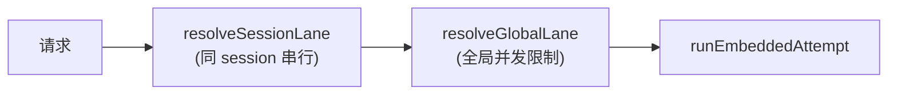

- **Session Lane**：同一个 session 的请求必须串行执行，避免会话状态冲突
- **Global Lane**：全局并发上限，防止同时向 LLM API 发送过多请求

### 模型解析与上下文窗口

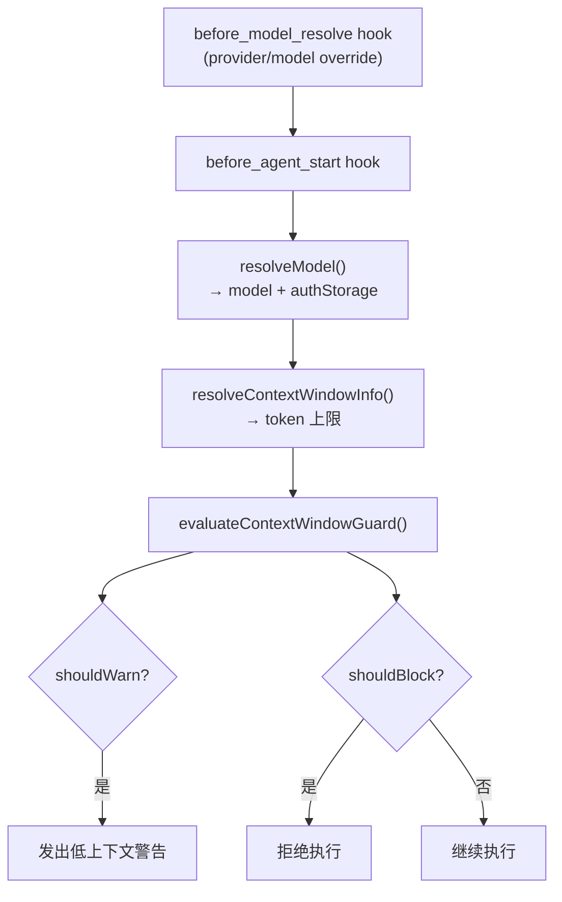

**上下文窗口解析链**：`modelsConfig` → `model.contextWindow` → `defaultTokens`，再受 `agents.defaults.contextTokens` 上限约束。

**硬限制**：
- `CONTEXT_WINDOW_HARD_MIN_TOKENS = 16,000` — 低于此值直接阻止执行
- `CONTEXT_WINDOW_WARN_BELOW_TOKENS = 32,000` — 低于此值发出警告

### Auth Profile 轮转

OpenClaw 支持配置多个 API 认证 profile。当一个 profile 遇到 auth 错误、rate limit、billing 问题时，自动切换到下一个。

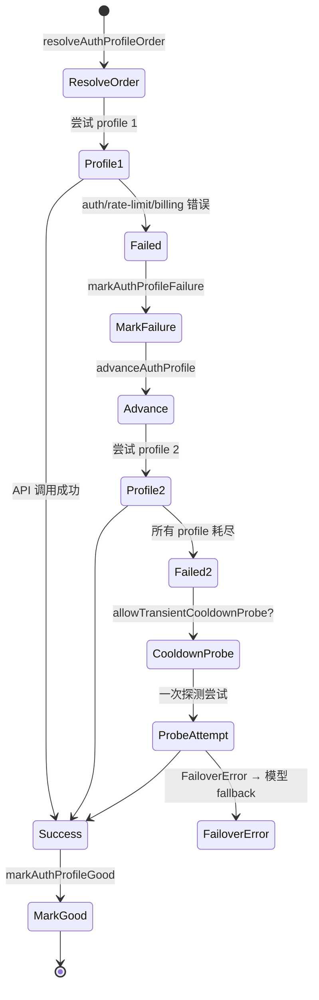

**Transient Cooldown Probe**：当所有 profile 都进入冷却期（原因为 rate_limit、overloaded、billing、unknown 等瞬时原因时），允许做一次额外探测尝试。

**Overload Backoff**：`OVERLOAD_FAILOVER_BACKOFF_POLICY`（250ms-1.5s），在 overload failover 前短暂等待。

### 重试与 Failover 策略

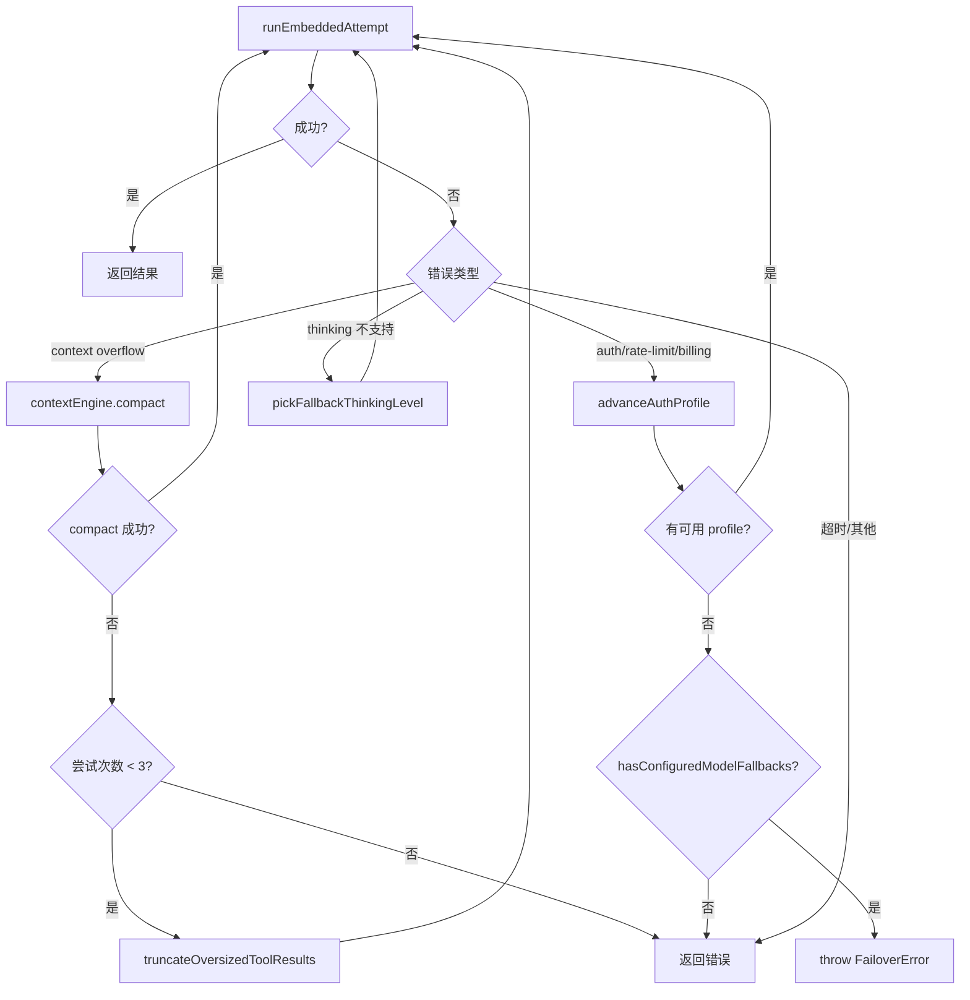

---

## 单次执行尝试：attempt.ts

### Attempt 内部步骤

`runEmbeddedAttempt()` 是单次 LLM 调用的完整流程：

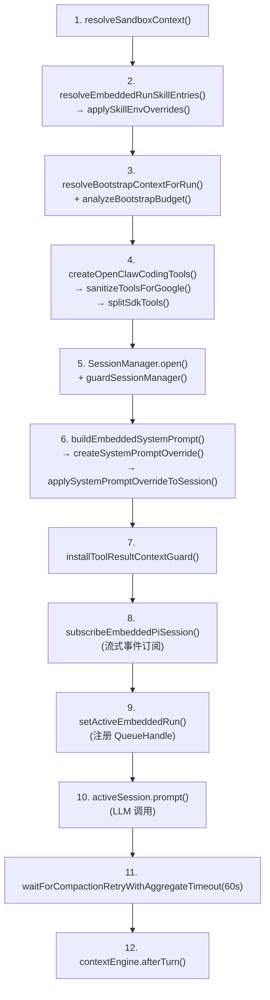

### 工具创建与分组

工具创建经过三层处理：

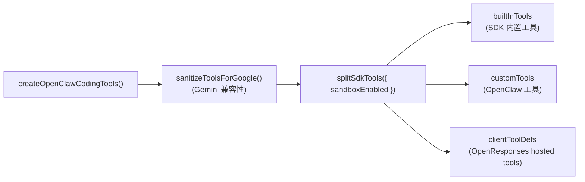

- **builtInTools**：Pi SDK 提供的基础工具（read、write、edit、bash、grep 等）
- **customTools**：OpenClaw 扩展工具（sessions_send、sessions_spawn、memory_search 等）
- **clientToolDefs**：通过 `toClientToolDefinitions()` 暴露给 OpenResponses 的工具

### System Prompt 构建管线

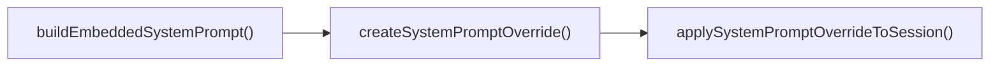

`buildEmbeddedSystemPrompt()` 接收：
- Bootstrap 文件内容（AGENTS.md、SOUL.md 等）
- Skills prompt（由 `resolveSkillsPromptForRun()` 生成）
- 配置信息（agent 身份、工具描述、环境信息）

### Tool Name Normalization

不同 LLM provider 返回的工具调用名可能有异常（前缀、后缀、大小写问题）。OpenClaw 通过 normalization 层处理：

- `normalizeToolCallNameForDispatch()`：分发前规范化工具名
- `inferToolNameFromToolCallId()`：从 tool_call_id 推断工具名（当 provider 返回空名时）
- `wrapStreamTrimToolCallNames()`：在流式阶段修剪工具名异常

### sessions_yield 中断机制

`sessions_yield` 是一种特殊的工具调用，允许 Agent 主动"让出"控制权：

- `onYield` 回调 → `queueSessionsYieldInterruptMessage()`
- `stripSessionsYieldArtifacts()` 清理 yield 产生的痕迹
- `persistSessionsYieldContextMessage()` 持久化 yield 上下文
- yield 中断被视为 clean stop，不算错误

---

## 上下文窗口管理

上下文管理是 Agent Loop 最复杂的部分之一。OpenClaw 采用多层防御策略：

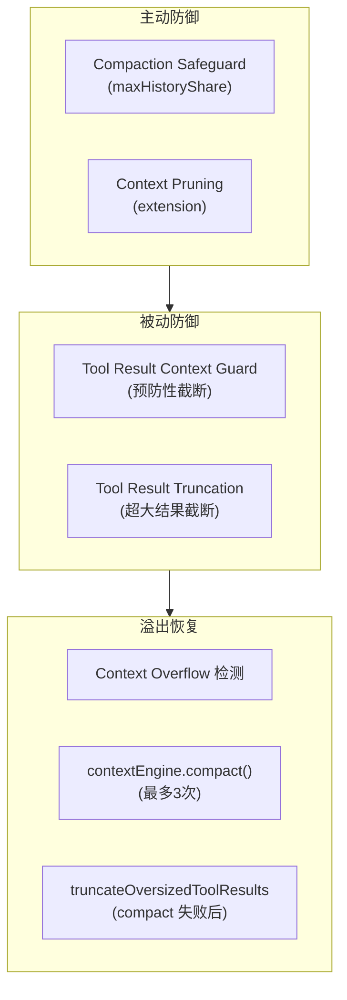

### Context Window Guard

`context-window-guard.ts` 在执行前评估上下文窗口是否足够：

| 参数 | 值 | 说明 |
|------|-----|------|
| `CONTEXT_WINDOW_HARD_MIN_TOKENS` | 16,000 | 低于此值阻止执行 |
| `CONTEXT_WINDOW_WARN_BELOW_TOKENS` | 32,000 | 低于此值发出警告 |

### Compaction Safeguard Extension

`extensions.ts` → `compactionSafeguardExtension`（当 compaction mode 为 `"safeguard"` 时启用）：

- `maxHistoryShare`：限制历史对话占总上下文的比例
- `pruneHistoryForContextShare()`：当历史超出比例时主动裁剪
- Quality guard：确保裁剪不会损害对话质量

这是一个 `extensionFactory`，在 `createAgentSession` 时注入。

### Tool Result Context Guard

`tool-result-context-guard.ts` → `installToolResultContextGuard()`：

在 Agent 的 `transformContext` 钩子中安装，**在每次 LLM 调用前**检查工具结果是否占用过多上下文，预防性截断大型工具结果。

关键参数：
- `MAX_TOOL_RESULT_CONTEXT_SHARE = 0.3`：单个工具结果最多占上下文的 30%
- `HARD_MAX_TOOL_RESULT_CHARS = 400,000`：单个工具结果的绝对上限

截断策略（`truncateToolResultText()`）：保留头部 + 尾部（当尾部包含错误信息或 JSON 时优先保留尾部）。

### Context Overflow 恢复策略

当 LLM API 返回 context overflow 错误时，`run.ts` 的恢复流程：

```
尝试 1: contextEngine.compact()
尝试 2: contextEngine.compact() (如果第一次 compact 后仍然 overflow)
尝试 3: contextEngine.compact() (第三次机会)
所有 compact 失败: truncateOversizedToolResultsInSession()
  → sessionLikelyHasOversizedToolResults() 检测是否有超大结果
  → 截断后重新尝试
```

最大 overflow compaction 尝试次数：`MAX_OVERFLOW_COMPACTION_ATTEMPTS = 3`

---

## 会话压缩：compact.ts

提供两种压缩模式：

| 模式 | 函数 | 说明 |
|------|------|------|
| Direct | `compactEmbeddedPiSessionDirect()` | 无 lane 排队，用于已在 lane 内的场景 |
| Queued | `compactEmbeddedPiSession()` | 入队 session + global lane |

**压缩流程**：

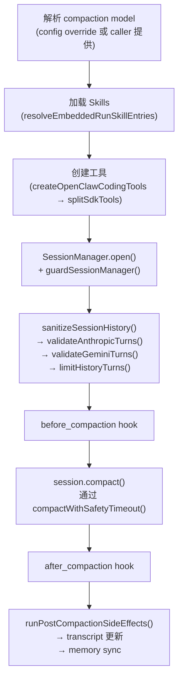

**关键细节**：
- Compaction 有独立的超时保护：`compactWithSafetyTimeout()`
- `sanitizeSessionHistory()` 在 compact 前修复 provider-specific 的消息格式问题
- 在 compact 流程中 `ctx.model` 为 undefined；compaction safeguard 使用 `runtime.model` 替代

---

## 运行状态管理：runs.ts

`runs.ts` 通过一个 singleton `embeddedRunState` 管理所有活跃的 Agent 运行：

```typescript
interface EmbeddedRunState {
  activeRuns: Map<string, EmbeddedPiQueueHandle>;
  waiters: Map<string, Set<EmbeddedRunWaiter>>;
}

interface EmbeddedPiQueueHandle {
  queueMessage: (text: string) => void;   // 向运行中的 Agent 追加消息
  isStreaming: () => boolean;              // 是否正在流式输出
  isCompacting: () => boolean;            // 是否正在压缩
  abort: () => void;                       // 中断运行
}
```

**API**：

| 函数 | 说明 |
|------|------|
| `setActiveEmbeddedRun(sessionId, handle)` | 注册活跃运行 |
| `clearActiveEmbeddedRun(sessionId)` | 清除运行 |
| `queueEmbeddedPiMessage(sessionId, text)` | 追加消息（仅当运行活跃且正在流式时） |
| `abortEmbeddedPiRun(sessionId)` | 中断指定运行 |
| `abortEmbeddedPiRun(undefined, { mode: "all" })` | 中断所有运行 |
| `abortEmbeddedPiRun(undefined, { mode: "compacting" })` | 仅中断正在压缩的运行 |
| `waitForActiveEmbeddedRuns(timeoutMs)` | 等待所有运行结束（用于重启） |
| `waitForEmbeddedPiRunEnd(sessionId, timeoutMs)` | 等待指定运行结束 |

---

## 载荷构建：payloads.ts

`buildEmbeddedRunPayloads()` 将 Agent 运行结果转换为用户可见的回复载荷：

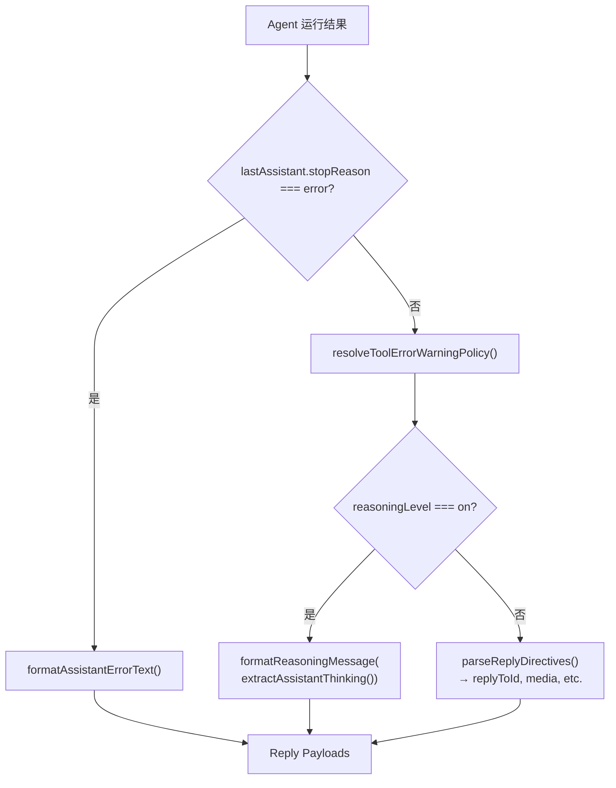

**Tool Error Warning Policy**（`resolveToolErrorWarningPolicy()`）：
- Mutating tools（文件写入等）的错误**始终**向用户展示
- `exec`/`bash` 错误默认抑制（除非 verbose 模式）
- `sessions_send` 错误始终抑制（避免循环错误通知）

**特殊处理**：
- `suppressAssistantArtifacts`：当触发了 deterministic approval prompt 时，不展示 assistant 文本
- `ANTHROPIC_MAGIC_STRING_TRIGGER_REFUSAL`：从 prompt 中清洗 Anthropic 的 refusal 触发字符串，避免 transcript 污染

---

## 错误处理与恢复

### 错误分类

| 错误类型 | 检测方式 | 恢复策略 |
|----------|----------|----------|
| Context overflow | `isLikelyContextOverflowError()` | compact (最多3次) → truncate tool results |
| Auth 错误 | auth error 类型 | advanceAuthProfile → FailoverError |
| Rate limit | rate_limit 错误 | advanceAuthProfile + backoff |
| Billing 错误 | billing 错误 | advanceAuthProfile |
| Overload | overloaded 错误 | backoff (250ms-1.5s) → failover |
| Timeout | 超时 | 返回超时错误消息 |
| Thinking 不支持 | unsupported thinking | `pickFallbackThinkingLevel()` 降级 |
| Role ordering | 消息顺序冲突 | 返回 "Message ordering conflict" |
| Image size | 图片过大 | 返回 "Image too large for the model" |
| Retry limit | 超出最大重试 | 返回 "Request failed after repeated internal retries" |

### 用户可见的错误消息

- `context_overflow` / `compaction_failure` → 建议使用 `/reset` 或切换更大模型
- `role_ordering` → "Message ordering conflict"
- `image_size` → "Image too large for the model"
- `retry_limit` → "Request failed after repeated internal retries"
- 无回复超时 → "Request timed out before a response was generated"

---

## 生命周期状态机

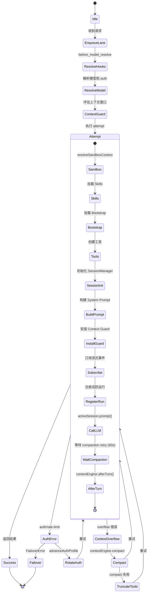

---

## 关键常量参考

| 常量 | 值 | 说明 |
|------|-----|------|
| `BASE_RUN_RETRY_ITERATIONS` | 24 | 基础重试次数 |
| `RUN_RETRY_ITERATIONS_PER_PROFILE` | 8 | 每个 auth profile 额外重试次数 |
| `MAX_RUN_LOOP_ITERATIONS` | 32-160 | 最大循环次数（24 + 8*profiles，下限32，上限160） |
| `MAX_OVERFLOW_COMPACTION_ATTEMPTS` | 3 | 最大 overflow compact 尝试次数 |
| `CONTEXT_WINDOW_HARD_MIN_TOKENS` | 16,000 | 上下文窗口绝对下限 |
| `CONTEXT_WINDOW_WARN_BELOW_TOKENS` | 32,000 | 上下文窗口警告阈值 |
| `MAX_TOOL_RESULT_CONTEXT_SHARE` | 0.3 | 单个工具结果最大上下文占比 |
| `HARD_MAX_TOOL_RESULT_CHARS` | 400,000 | 单个工具结果绝对字符上限 |
| Compaction retry timeout | 60s | `waitForCompactionRetryWithAggregateTimeout` |
| Overload backoff | 250ms-1.5s | `OVERLOAD_FAILOVER_BACKOFF_POLICY` |

---

## 常见问题

### Q1: 为什么重试次数这么多（最多 160 次）？

这不是 160 次 LLM 调用。`MAX_RUN_LOOP_ITERATIONS` 是**外层循环**的最大次数，包含了 auth profile 轮转、compact 重试、backoff 等待等。实际 LLM 调用次数取决于工具调用循环，外层循环更多是处理瞬时错误恢复。`24 + 8 * profiles` 的设计确保每个 auth profile 都有足够的重试机会。

### Q2: Auth Profile 轮转和模型 Fallback 是什么关系？

Auth Profile 轮转在**同一模型**内切换不同的 API key/认证。当所有 profile 都耗尽后，如果配置了 `modelFallbacks`，会抛出 `FailoverError`，由上层切换到备选模型重新执行。这是两层 failover 机制。

### Q3: Context Overflow 恢复的三次 compact 之间有什么区别？

三次尝试使用相同的 `contextEngine.compact()` 方法，但每次之后上下文会变小。如果连续三次 compact 后仍然 overflow，说明问题不在历史长度而在于某些超大的工具结果，此时降级到 `truncateOversizedToolResultsInSession()` 强制截断。

### Q4: Probe session 有什么特殊处理？

以 `probe-` 开头的 sessionId 被视为探测会话：
- 减少日志输出
- 不发出超时警告
- 用于系统内部的健康检查和模型可用性探测

### Q5: sessions_yield 什么时候会触发？

当 Agent 运行中调用 `sessions_yield` 工具时，表示"我完成了当前阶段，让出控制权"。这在 subagent 场景中常见，子 agent 完成部分任务后通过 yield 通知主 agent。yield 被视为 clean stop，不会触发错误恢复。

### Q6: UsageAccumulator 为什么只取最后一次 API 调用的 cache 数据？

`lastCacheRead`/`lastCacheWrite` 只取最后一次 API 调用的值，而非累加。这是因为 cache 数据代表的是当前上下文快照的缓存命中情况，累加会严重高估实际 cache 使用量。

---

*基于 OpenClaw v2026.2.3-1 源码 `src/agents/pi-embedded-runner/` 分析*
