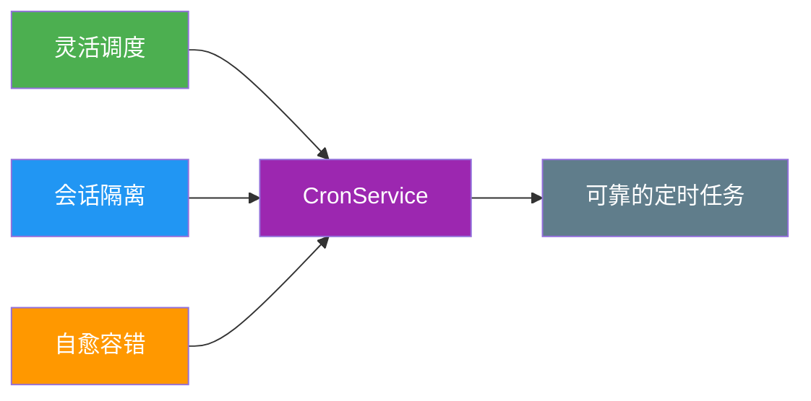
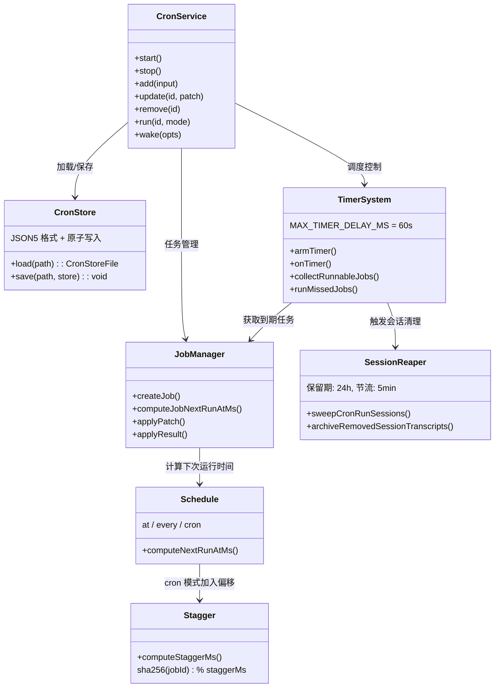
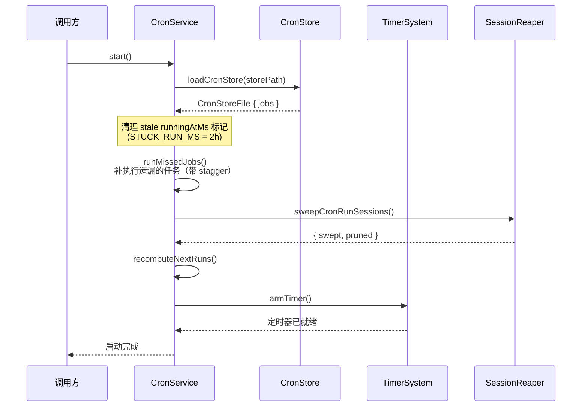
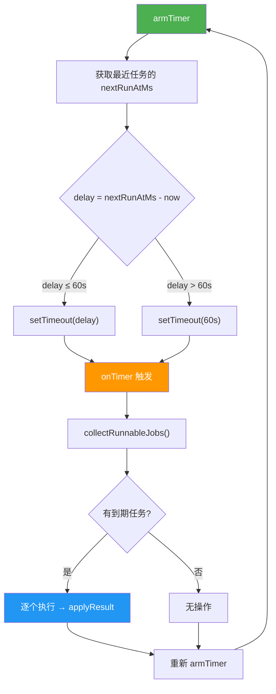
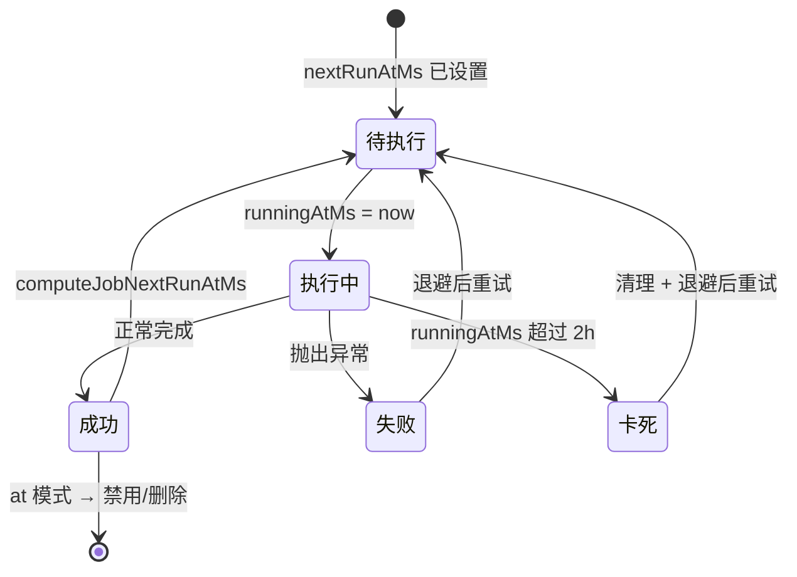
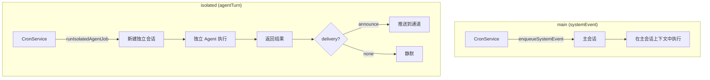
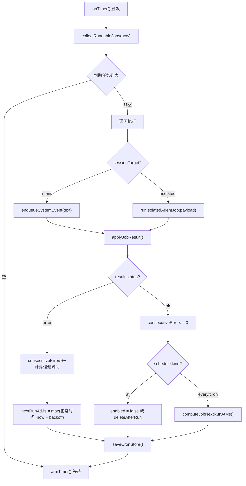

# OpenClaw Cron 定时任务系统源码深度分析

> 基于 OpenClaw v2026.2.3-1 源码的全面解析，深入剖析 Cron 定时任务的设计理念、调度算法与运行机制。

## 目录

- [设计理念](#设计理念)
- [架构设计](#架构设计)
- [三种调度模式](#三种调度模式)
  - [at：绝对时间（一次性）](#at绝对时间一次性)
  - [every：相对间隔（周期性）](#every相对间隔周期性)
  - [cron：Cron 表达式](#croncron-表达式)
- [Stagger 算法](#stagger-算法)
- [核心数据结构](#核心数据结构)
- [CronService 核心服务](#cronservice-核心服务)
- [CronStore 持久化层](#cronstore-持久化层)
- [Timer System 定时器系统](#timer-system-定时器系统)
  - [MAX_TIMER_DELAY_MS 机制](#max_timer_delay_ms-机制)
  - [onTimer 与 collectRunnableJobs](#ontimer-与-collectrunnablejobs)
  - [启动时补执行 runMissedJobs](#启动时补执行-runmissedjobs)
- [Stuck Run 卡死任务清理](#stuck-run-卡死任务清理)
- [MIN_REFIRE_GAP_MS 最小重触发间隔](#min_refire_gap_ms-最小重触发间隔)
- [两种会话模式](#两种会话模式)
  - [main（systemEvent）](#mainsystemevent)
  - [isolated（agentTurn）](#isolatedagentturn)
- [任务执行流程](#任务执行流程)
  - [computeNextRunAtMs vs computeJobNextRunAtMs](#computenextrunatms-vs-computejobnextrunatms)
  - [执行与结果处理](#执行与结果处理)
- [错误退避](#错误退避)
- [Session Reaper 会话收割器](#session-reaper-会话收割器)
- [交付机制](#交付机制)
- [配置参考](#配置参考)

---

## 设计理念

OpenClaw Cron 系统的核心设计理念可以归纳为三个关键词：**灵活**、**隔离**、**自愈**。

### 灵活：三种调度模式

不同的任务场景需要不同的时间描述方式。Cron 系统提供了三种调度模式，覆盖从一次性提醒到复杂周期调度的全部场景：

| 模式 | 场景 | 示例 |
|------|------|------|
| `at` | 一次性任务，到点即执行 | 明天 8:00 提醒我开会 |
| `every` | 固定间隔的周期任务 | 每 5 分钟检查一次状态 |
| `cron` | 复杂的周期规则 | 每周一到周五 9:00 发送日报 |

### 隔离：两种会话模式

- **main（systemEvent）**：在主会话中注入系统事件，适合轻量级触发
- **isolated（agentTurn）**：创建独立会话运行 Agent，适合需要完整上下文的复杂任务

### 自愈：指数退避与卡死检测

系统具备自我恢复能力：
- 任务失败后自动按指数退避重试（30s → 1m → 5m → 15m → 60m）
- 检测运行超过 2 小时的卡死任务并自动清理
- 启动时补执行遗漏的任务，保证不丢失调度



---

## 架构设计

### 模块结构

```
src/cron/
├── types.ts              # 类型定义
├── normalize.ts          # 输入标准化
├── parse.ts              # 时间解析
├── schedule.ts           # 执行时间计算 (computeNextRunAtMs)
├── stagger.ts            # Stagger 偏移算法
├── delivery.ts           # 交付计划解析
├── store.ts              # JSON5 持久化存储
│
├── service/
│   ├── index.ts          # CronService 入口
│   ├── state.ts          # 服务状态
│   ├── ops.ts            # 操作方法 (start/stop/add/update/remove/run/wake)
│   ├── jobs.ts           # 任务 CRUD + computeJobNextRunAtMs
│   ├── timer.ts          # 定时器管理 (armTimer/onTimer/collectRunnableJobs)
│   ├── execute.ts        # 任务执行
│   ├── locked.ts         # 互斥锁
│   └── run-log.ts        # 运行日志
│
├── session-reaper.ts     # 会话收割器（自动清理 + 归档）
└── isolated-agent.ts     # 独立 Agent 执行
```

### 组件交互



---

## 三种调度模式

### at：绝对时间（一次性）

指定一个确切的时间点，到时触发一次即完成。

```typescript
// schedule 配置
{ kind: "at", at: "2026-02-11T08:00:00+08:00" }
```

**行为**：
- 时间到达后执行一次
- 执行成功后，若 `deleteAfterRun` 为 `true` 则删除任务，否则将任务 `enabled` 设为 `false`
- 若指定时间已过，`computeNextRunAtMs` 返回 `undefined`，不再执行

### every：相对间隔（周期性）

以固定的毫秒间隔反复执行，可搭配 `anchorMs` 对齐时间轴。

```typescript
// 每 5 分钟执行一次
{ kind: "every", everyMs: 300_000 }

// 每天执行，锚定到某个时间点
{ kind: "every", everyMs: 86_400_000, anchorMs: 1704067200000 }
```

**`anchorMs` 的作用**：

`every` 模式的下次执行时间并非简单地"上次执行时间 + 间隔"，而是基于锚点时间（`anchorMs`）对齐。计算逻辑：

```
elapsed = nowMs - anchorMs
steps = ceil(elapsed / everyMs)
nextRunAtMs = anchorMs + steps * everyMs
```

这样可以保证任务始终在锚点的整数倍时刻执行，避免因执行延迟导致的时间漂移。

### cron：Cron 表达式

使用 [croner](https://github.com/hexagon/croner) 库解析 cron 表达式，支持时区和 stagger 偏移。

```typescript
// 每天早上 8 点（上海时区）
{ kind: "cron", expr: "0 8 * * *", tz: "Asia/Shanghai" }

// 每周一到周五 9:00，带 stagger 分散
{ kind: "cron", expr: "0 9 * * 1-5", tz: "Asia/Shanghai", staggerMs: 60_000 }
```

**特性**：
- `tz`：时区，默认使用系统本地时区（`Intl.DateTimeFormat().resolvedOptions().timeZone`）
- `staggerMs`：可选的 stagger 窗口，用于分散多个 cron 任务的执行时间

---

## Stagger 算法

> 这是 Cron 系统中一个精巧但容易被忽略的设计。

### 问题

当多个任务使用相同的 cron 表达式（如 `0 * * * *`，每小时整点执行），它们会在完全相同的时刻触发，造成瞬间负载峰值。

### 解决方案

`stagger.ts` 基于 `jobId` 的哈希值，为每个任务计算一个确定性的时间偏移：

```typescript
// stagger.ts (核心逻辑)

function computeStaggerOffsetMs(jobId: string, staggerMs: number): number {
  const hash = sha256(jobId);          // 对 jobId 取 SHA-256 哈希
  const hashInt = parseInt(hash.slice(0, 8), 16);  // 取前 8 个十六进制字符转整数
  return hashInt % staggerMs;          // 对 stagger 窗口取模
}
```

### 效果

假设 `staggerMs = 60000`（1 分钟窗口），三个任务的 cron 表达式都是 `0 * * * *`：

```
原始触发时间: 所有任务都在 HH:00:00

应用 stagger 后:
  job-alpha  → sha256("job-alpha")  % 60000 = 12,345ms → HH:00:12.345
  job-beta   → sha256("job-beta")   % 60000 = 47,891ms → HH:00:47.891
  job-gamma  → sha256("job-gamma")  % 60000 = 3,210ms  → HH:00:03.210
```



```mermaid
gantt
    title Stagger 效果示意（1 分钟窗口）
    dateFormat X
    axisFormat %S秒

    section 无 Stagger
    job-alpha   :0, 1
    job-beta    :0, 1
    job-gamma   :0, 1

    section 有 Stagger
    job-gamma   :3, 4
    job-alpha   :12, 13
    job-beta    :47, 48
```

**关键特性**：
- **确定性**：同一个 jobId 始终得到相同的偏移，重启后不变
- **均匀分布**：SHA-256 的均匀性保证偏移在窗口内均匀分布
- **可配置**：通过 `staggerMs` 控制分散程度

---

## 核心数据结构

### CronJob - 定时任务

```typescript
export type CronJob = {
  // 核心标识
  id: string;
  agentId?: string;
  name: string;
  description?: string;

  // 启用状态
  enabled: boolean;
  deleteAfterRun?: boolean;       // true 则执行后删除（一次性任务）

  // 时间信息
  createdAtMs: number;
  updatedAtMs: number;
  schedule: CronSchedule;

  // 执行配置
  sessionTarget: "main" | "isolated";
  wakeMode: "now" | "next-heartbeat";
  payload: CronPayload;

  // 交付配置
  delivery?: CronDelivery;

  // 运行状态
  state: CronJobState;
};
```

### CronSchedule - 调度配置

```typescript
export type CronSchedule =
  | { kind: "at"; at: string }
  | { kind: "every"; everyMs: number; anchorMs?: number }
  | { kind: "cron"; expr: string; tz?: string; staggerMs?: number };
```

### CronJobState - 运行状态

```typescript
export type CronJobState = {
  nextRunAtMs?: number;           // 下次执行时间
  runningAtMs?: number;           // 当前运行开始时间（存在即表示正在运行）
  lastRunAtMs?: number;           // 上次执行时间
  lastStatus?: "ok" | "error" | "skipped";
  lastError?: string;
  lastDurationMs?: number;
  consecutiveErrors?: number;     // 连续错误次数（用于退避计算）
};
```

### CronPayload - 任务负载

```typescript
export type CronPayload =
  | { kind: "systemEvent"; text: string }
  | {
      kind: "agentTurn";
      message: string;
      model?: string;
      thinking?: string;
      timeoutSeconds?: number;
      allowUnsafeExternalContent?: boolean;
      deliver?: boolean;
      channel?: string;
      to?: string;
      bestEffortDeliver?: boolean;
    };
```

---

## CronService 核心服务

`CronService` 是对外暴露的入口类，封装了所有操作：

```typescript
export class CronService {
  // 生命周期
  async start()                          // 加载存储 → 清理卡死 → 补执行 → 启动定时器
  stop()                                 // 停止定时器、清理状态

  // 任务 CRUD
  async add(input: CronJobCreate)        // 创建任务
  async update(id: string, patch)        // 更新任务配置
  async remove(id: string)               // 删除任务
  async list(opts?)                      // 列出任务
  async status()                         // 服务状态

  // 执行控制
  async run(id: string, mode?: "due" | "force")  // 手动触发
  wake(opts: { mode; text })             // 唤醒（now 或 next-heartbeat）
}
```

### 启动流程



---

## CronStore 持久化层

CronStore 使用 **JSON5** 格式存储任务数据，支持注释和尾逗号，方便人工编辑。

### 写入安全：原子写入

```typescript
export async function saveCronStore(storePath: string, store: CronStoreFile) {
  // 1. 确保目录存在
  await fs.promises.mkdir(path.dirname(storePath), { recursive: true });

  // 2. 写入临时文件（同目录，避免跨文件系统）
  const tmp = `${storePath}.${process.pid}.${random}.tmp`;
  await fs.promises.writeFile(tmp, JSON.stringify(store, null, 2));

  // 3. 原子重命名（rename 在同一文件系统上是原子操作）
  await fs.promises.rename(tmp, storePath);

  // 4. 写入备份
  await fs.promises.copyFile(storePath, `${storePath}.bak`);
}
```

**为什么用原子写入？** 如果直接 `writeFile` 在写入过程中进程崩溃，文件可能被截断。先写临时文件再 `rename` 可以保证文件要么是旧内容，要么是完整的新内容。

---

## Timer System 定时器系统

Timer System 是 Cron 的心跳，基于 `setTimeout` 实现轮询。

### MAX_TIMER_DELAY_MS 机制

```typescript
const MAX_TIMER_DELAY_MS = 60_000;  // 最大定时器延迟：1 分钟
```

无论下一个任务的 `nextRunAtMs` 多远，定时器最多等待 **60 秒**就会唤醒一次。这是为了：

1. **及时发现新增任务**：新任务可能在两次 tick 之间被添加
2. **避免系统时间跳变**：如 NTP 校准或休眠唤醒后，长定时器可能失准
3. **定期清理机会**：每次唤醒可以顺带执行会话清理等维护操作



### onTimer 与 collectRunnableJobs

`onTimer()` 是定时器的回调入口：

```typescript
async function onTimer(state: CronServiceState) {
  await locked(state, async () => {
    const now = state.deps.nowMs();

    // 1. 收集到期任务
    const runnableJobs = collectRunnableJobs(state, now);

    // 2. 逐个执行
    for (const job of runnableJobs) {
      const result = await executeJob(state, job);
      applyJobResult(state, job, result);
    }

    // 3. 持久化
    await saveCronStore(state.storePath, state.store);

    // 4. 会话清理
    await sweepCronRunSessions(state);

    // 5. 重新调度
    armTimer(state);
  });
}
```

`collectRunnableJobs` 的过滤条件：

| 条件 | 说明 |
|------|------|
| `job.enabled === true` | 任务已启用 |
| `job.state.nextRunAtMs <= now` | 已到期 |
| `job.state.runningAtMs == null` | 不在运行中 |
| `now - job.state.lastRunAtMs >= MIN_REFIRE_GAP_MS` | 距离上次执行超过 2 秒 |

### 启动时补执行 runMissedJobs

服务重启后，可能有在停机期间错过的任务。`runMissedJobs()` 会：

1. 扫描所有 `enabled` 且 `nextRunAtMs < now` 的任务
2. 受 `maxMissedJobsPerRestart` 配置限制，防止重启后大量任务涌入
3. 补执行时带 stagger 间隔，避免瞬间负载

```
重启补执行示意：

停机期间     重启点     补执行（带 stagger）
───────────────┤────────┤──────────────────>
  job-A 到期 ──┘        │
  job-B 到期 ──┘        ├─ job-A (offset: 0ms)
  job-C 到期 ──┘        ├─ job-B (offset: +stagger)
                        └─ job-C (offset: +stagger×2)
```

---

## Stuck Run 卡死任务清理

```typescript
const STUCK_RUN_MS = 2 * 60 * 60 * 1000;  // 2 小时 = 7,200,000ms
```

任务开始执行时会设置 `state.runningAtMs`，执行完成后清除。如果进程崩溃或任务挂死，`runningAtMs` 会残留。

**清理逻辑**（在 `start()` 和 `onTimer()` 中执行）：

```typescript
for (const job of store.jobs) {
  if (job.state.runningAtMs != null) {
    const elapsed = now - job.state.runningAtMs;
    if (elapsed > STUCK_RUN_MS) {
      // 标记为卡死，清理运行状态
      job.state.runningAtMs = undefined;
      job.state.lastStatus = "error";
      job.state.lastError = "stuck: exceeded 2h timeout";
      job.state.consecutiveErrors = (job.state.consecutiveErrors ?? 0) + 1;
    }
  }
}
```



---

## MIN_REFIRE_GAP_MS 最小重触发间隔

```typescript
const MIN_REFIRE_GAP_MS = 2_000;  // 2 秒
```

**作用**：防止同一任务在极短时间内被重复触发。

**场景**：
- 任务执行非常快（如几毫秒），`computeJobNextRunAtMs` 可能返回刚过去的时间点
- 系统时间微调导致 `nextRunAtMs` 反复命中
- 定时器在 `applyResult` 后立即再次触发

**机制**：`collectRunnableJobs()` 检查 `now - lastRunAtMs >= MIN_REFIRE_GAP_MS`，不满足则跳过本轮。

---

## 两种会话模式

### main（systemEvent）

```typescript
// payload 配置
{ kind: "systemEvent", text: "检查待办事项" }
```

**执行方式**：通过 `enqueueSystemEvent()` 将事件注入主会话。

**特点**：
- 不创建新会话，在已有的主 Agent 会话中执行
- 适合轻量级操作：发送提醒、触发简单逻辑
- 无独立超时控制
- 不支持交付（delivery）

### isolated（agentTurn）

```typescript
// payload 配置
{
  kind: "agentTurn",
  message: "生成本周代码审查报告",
  model: "opus",
  thinking: "high",
  timeoutSeconds: 300
}
```

**执行方式**：通过 `runIsolatedAgentJob()` 创建独立会话。

**特点**：
- 每次运行创建全新的会话（session key: `cron:{jobName}:run:{uuid}`）
- 支持指定模型、thinking 级别、超时
- 支持交付结果到指定通道
- 会话由 Session Reaper 定期清理

### 对比



| 特性 | main (systemEvent) | isolated (agentTurn) |
|------|---------------------|----------------------|
| 会话 | 共享主会话 | 每次独立新建 |
| 上下文 | 继承主会话上下文 | 空白上下文 |
| 结果交付 | 不支持 | 支持 (announce / none) |
| 超时控制 | 无 | 可配置 `timeoutSeconds` |
| 模型覆盖 | 不支持 | 支持 `model` 参数 |
| 适用场景 | 简单触发、提醒 | 复杂任务、报告生成 |

---

## 任务执行流程

### computeNextRunAtMs vs computeJobNextRunAtMs

这两个函数容易混淆，但职责不同：

**`computeNextRunAtMs(schedule, nowMs)`** — 位于 `schedule.ts`

纯粹基于 `CronSchedule` 计算下一次时间，不关心任务运行历史：

```typescript
export function computeNextRunAtMs(schedule: CronSchedule, nowMs: number): number | undefined {
  if (schedule.kind === "at") {
    const atMs = new Date(schedule.at).getTime();
    return atMs > nowMs ? atMs : undefined;  // 已过期则返回 undefined
  }

  if (schedule.kind === "every") {
    const anchorMs = schedule.anchorMs ?? 0;
    const elapsed = nowMs - anchorMs;
    const steps = Math.ceil(elapsed / schedule.everyMs);
    return anchorMs + steps * schedule.everyMs;
  }

  // cron 模式
  const cron = new Cron(schedule.expr, {
    timezone: schedule.tz ?? Intl.DateTimeFormat().resolvedOptions().timeZone,
  });
  const next = cron.nextRun(new Date(nowMs - 1000))?.getTime();

  // 加入 stagger 偏移
  if (next != null && schedule.staggerMs) {
    return next + computeStaggerOffsetMs(jobId, schedule.staggerMs);
  }
  return next;
}
```

**`computeJobNextRunAtMs(job, nowMs)`** — 位于 `jobs.ts`

考虑任务的运行历史和完整上下文：

```typescript
export function computeJobNextRunAtMs(job: CronJob, nowMs: number): number | undefined {
  if (!job.enabled) return undefined;

  if (job.schedule.kind === "every") {
    // every 模式特殊处理：基于 lastRunAtMs 而非 schedule 单独计算
    const base = job.state.lastRunAtMs ?? job.createdAtMs;
    return base + job.schedule.everyMs;
  }

  // at / cron 模式委托给 computeNextRunAtMs
  return computeNextRunAtMs(job.schedule, nowMs);
}
```

**关键区别**：

| | `computeNextRunAtMs` | `computeJobNextRunAtMs` |
|---|---|---|
| 位置 | `schedule.ts` | `jobs.ts` |
| 输入 | `CronSchedule` + `nowMs` | `CronJob` + `nowMs` |
| `every` 模式 | 基于 `anchorMs` 对齐 | 基于 `lastRunAtMs` 递推 |
| 适用时机 | 首次计算、重建 | 每次执行后更新 |

### 执行与结果处理



---

## 错误退避

系统采用**固定阶梯式**的指数退避策略，而非随机退避：

```typescript
const ERROR_BACKOFF_SCHEDULE_MS = [
  30_000,      // 第 1 次错误 →  30 秒
  60_000,      // 第 2 次错误 →   1 分钟
  300_000,     // 第 3 次错误 →   5 分钟
  900_000,     // 第 4 次错误 →  15 分钟
  3_600_000,   // 第 5+ 次错误 → 60 分钟（上限）
];

function errorBackoffMs(consecutiveErrors: number): number {
  const idx = Math.min(consecutiveErrors - 1, ERROR_BACKOFF_SCHEDULE_MS.length - 1);
  return ERROR_BACKOFF_SCHEDULE_MS[Math.max(0, idx)];
}
```

**退避时间线**：

```
时间 ──────────────────────────────────────────────────────>

✗ 错误#1
├── 30s ──┤
           ✗ 错误#2
           ├──── 1min ────┤
                           ✗ 错误#3
                           ├──────── 5min ────────┤
                                                   ✗ 错误#4
                                                   ├──────────── 15min ────────────┤
                                                                                    ✗ 错误#5
                                                                                    ├──── 60min（上限）────┤
                                                                                                           ✓ 成功 → 计数器归零
```

**退避时间与正常下次执行时间取较大值**：

```typescript
if (result.status === "error") {
  const backoff = errorBackoffMs(job.state.consecutiveErrors);
  const normalNext = computeJobNextRunAtMs(job, Date.now());
  job.state.nextRunAtMs = Math.max(normalNext ?? 0, Date.now() + backoff);
}
```

---

## Session Reaper 会话收割器

Session Reaper 负责清理 isolated 模式产生的会话数据，防止无限膨胀。

### 核心参数

| 参数 | 值 | 说明 |
|------|-----|------|
| `sessionRetention` | 默认 24 小时 | 会话保留时长 |
| `MIN_SWEEP_INTERVAL_MS` | 5 分钟 | 两次清理的最小间隔（节流） |

### 清理目标

仅清理 cron 运行会话，key 格式匹配：

```
agent:default:cron:{jobName}:run:{uuid}
              ^^^^           ^^^^
              cron 前缀       run 标记
```

### 完整流程

```typescript
export async function sweepCronRunSessions(params): Promise<ReaperResult> {
  const now = params.nowMs ?? Date.now();

  // 1. 节流：5 分钟内不重复执行
  if (now - lastSweepAtMs < MIN_SWEEP_INTERVAL_MS) {
    return { swept: false, pruned: 0 };
  }

  // 2. 加载会话存储
  const store = await loadSessionStore(params.sessionStorePath);

  // 3. 计算截止时间
  const cutoff = now - retentionMs;
  let pruned = 0;
  const removed: RemovedSession[] = [];

  for (const [key, entry] of Object.entries(store)) {
    if (!isCronRunSessionKey(key)) continue;
    if (entry.updatedAt >= cutoff) continue;

    removed.push({ key, entry });
    delete store[key];
    pruned++;
  }

  // 4. 归档被移除会话的 transcript
  await archiveRemovedSessionTranscripts(removed);

  // 5. 保存
  await saveSessionStore(params.sessionStorePath, store);
  lastSweepAtMs = now;

  return { swept: true, pruned };
}
```

### Transcript 归档

`archiveRemovedSessionTranscripts()` 确保会话被清理前，其对话记录被归档保存，便于事后审计和排查问题。

---

## 交付机制

### 两种交付模式

| 模式 | 行为 |
|------|------|
| `none` | 静默执行，不发送任何通知 |
| `announce` | 通过 Announce 系统将结果推送到指定通道 |

### CronDelivery 配置

```typescript
export type CronDelivery = {
  mode: "none" | "announce";
  channel?: string;          // 通道标识
  to?: string;               // 收件人标识
  bestEffort?: boolean;      // 尽力交付（失败不影响任务状态）
};
```

### 交付计划解析优先级

`resolveCronDeliveryPlan()` 按以下优先级确定交付策略：

```
1. job.delivery 配置          ← 最高优先级（新版推荐方式）
2. job.payload 中的旧版字段    ← 向后兼容（deliver/channel/to）
3. 默认值                     ← mode: "none"
```

---

## 配置参考

### 全局配置

```json5
{
  "cron": {
    "enabled": true,                    // 是否启用 Cron 系统
    "sessionRetention": "24h",          // 会话保留时长
    "maxMissedJobsPerRestart": 10,      // 重启后最多补执行的任务数
  }
}
```

### 任务配置示例

#### 一次性定时任务

```json5
{
  "id": "one-time-alert",
  "name": "一次性提醒",
  "enabled": true,
  "deleteAfterRun": true,
  "schedule": {
    "kind": "at",
    "at": "2026-03-15T09:00:00+08:00"
  },
  "sessionTarget": "isolated",
  "wakeMode": "now",
  "payload": {
    "kind": "agentTurn",
    "message": "提醒：下午 2 点有产品评审会议",
    "timeoutSeconds": 60
  },
  "delivery": {
    "mode": "announce",
    "channel": "qqbot",
    "to": "5DE05A2765375641985DB70CAE9611DB"
  }
}
```

#### 周期性间隔任务

```json5
{
  "id": "health-check",
  "name": "系统健康检查",
  "enabled": true,
  "schedule": {
    "kind": "every",
    "everyMs": 300000             // 每 5 分钟
  },
  "sessionTarget": "main",
  "wakeMode": "now",
  "payload": {
    "kind": "systemEvent",
    "text": "执行系统健康检查"
  }
}
```

#### Cron 表达式任务（带 Stagger）

```json5
{
  "id": "daily-report",
  "name": "每日工作报告",
  "enabled": true,
  "schedule": {
    "kind": "cron",
    "expr": "0 18 * * 1-5",       // 周一到周五 18:00
    "tz": "Asia/Shanghai",
    "staggerMs": 60000             // 1 分钟 stagger 窗口
  },
  "sessionTarget": "isolated",
  "wakeMode": "now",
  "payload": {
    "kind": "agentTurn",
    "message": "汇总今天的 Git 提交和 PR 状态，生成工作日报",
    "model": "opus",
    "thinking": "high",
    "timeoutSeconds": 300
  },
  "delivery": {
    "mode": "announce",
    "channel": "qqbot"
  }
}
```

### 配置项速查表

| 配置项 | 类型 | 默认值 | 说明 |
|--------|------|--------|------|
| `cron.enabled` | `boolean` | `true` | 是否启用 Cron 系统 |
| `cron.sessionRetention` | `string` | `"24h"` | 会话保留时长 |
| `cron.maxMissedJobsPerRestart` | `number` | — | 重启补执行上限 |
| `jobs[].id` | `string` | 自动生成 UUID | 任务唯一 ID |
| `jobs[].name` | `string` | `"Unnamed Job"` | 显示名称 |
| `jobs[].enabled` | `boolean` | `true` | 是否启用 |
| `jobs[].deleteAfterRun` | `boolean` | `false` | 执行后是否删除 |
| `jobs[].schedule.kind` | `"at"` / `"every"` / `"cron"` | — | 调度类型 |
| `jobs[].schedule.staggerMs` | `number` | — | Stagger 窗口（仅 cron） |
| `jobs[].sessionTarget` | `"main"` / `"isolated"` | — | 会话模式 |
| `jobs[].wakeMode` | `"now"` / `"next-heartbeat"` | `"now"` | 唤醒模式 |
| `jobs[].payload.kind` | `"systemEvent"` / `"agentTurn"` | — | 负载类型 |
| `jobs[].delivery.mode` | `"none"` / `"announce"` | `"announce"` | 交付模式 |
| `jobs[].delivery.bestEffort` | `boolean` | `false` | 交付失败是否忽略 |

---

*基于 OpenClaw v2026.2.3-1 源码分析*
