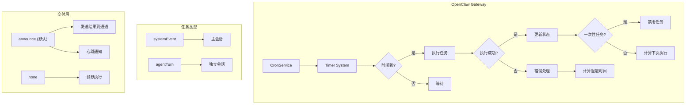
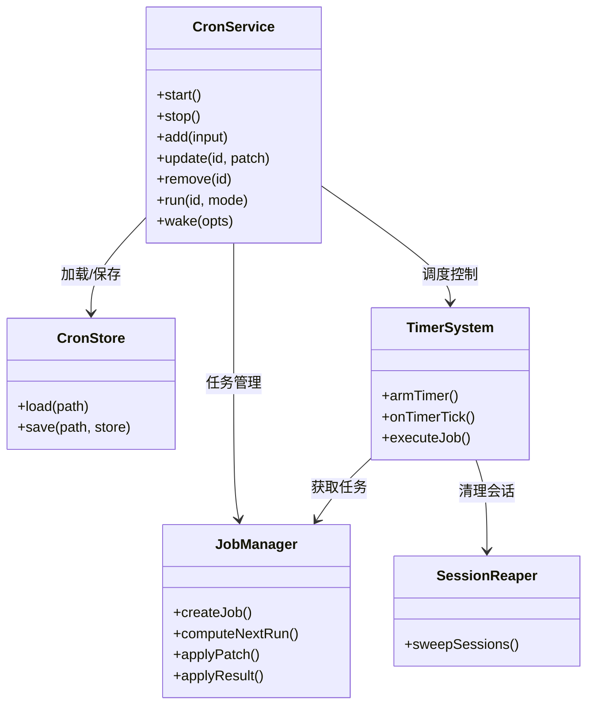
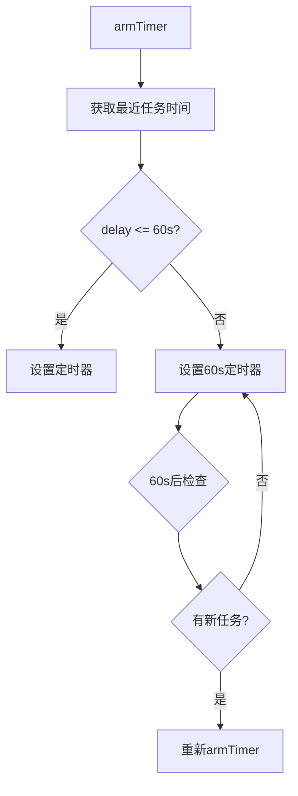
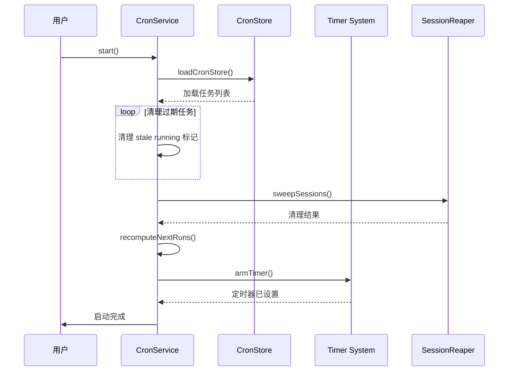
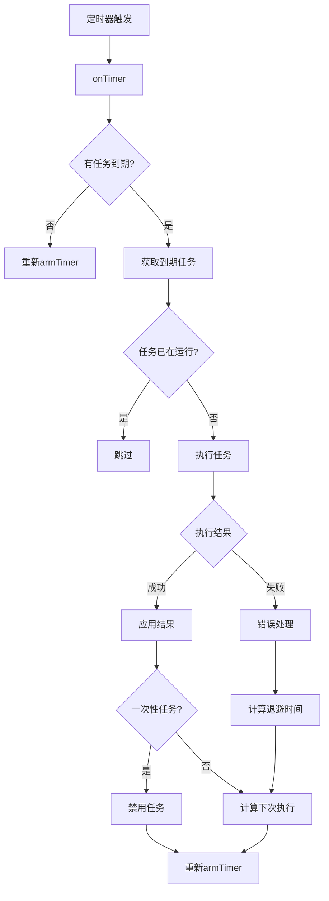

# OpenClaw Cron 定时任务系统源码深度分析

> 基于源码的全面解析，帮助你深入理解 OpenClaw 的 Cron 定时任务机制

## 目录

- [概述](#概述)
- [架构设计](#架构设计)
- [核心数据结构](#核心数据结构)
- [核心组件详解](#核心组件详解)
  - [CronService](#cronservice)
  - [CronStore](#cronstore)
  - [Timer System](#timer-system)
  - [Job Execution](#job-execution)
- [任务调度流程](#任务调度流程)
  - [启动流程](#启动流程)
  - [任务触发](#任务触发)
  - [结果处理](#结果处理)
- [定时策略](#定时策略)
  - [时间格式](#时间格式)
  - [下一次执行时间计算](#下一次执行时间计算)
  - [错误重试与退避](#错误重试与退避)
- [会话管理](#会话管理)
  - [会话清理](#会话清理)
  - [主会话 vs 独立会话](#主会话-vs-独立会话)
- [交付机制](#交付机制)
  - [交付模式](#交付模式)
  - [通道解析](#通道解析)
- [配置选项](#配置选项)
- [使用指南](#使用指南)
  - [创建任务](#创建任务)
  - [执行任务](#执行任务)
  - [更新与删除](#更新与删除)
- [源码关键代码解读](#源码关键代码解读)
- [常见问题](#常见问题)

---

## 概述

OpenClaw 的 Cron 系统是一个**灵活的定时任务调度框架**，支持：

1. **多种时间格式** - 绝对时间、相对间隔、Cron 表达式
2. **两种会话模式** - 主会话 (main) 和独立会话 (isolated)
3. **智能交付** - 自动交付结果到指定通道
4. **错误处理** - 指数退避、任务卡死检测
5. **会话清理** - 自动清理过期会话

### 系统定位



### 核心特性

| 特性 | 描述 |
|------|------|
| **灵活调度** | `at` / `every` / `cron` 三种模式 |
| **双会话模式** | main (systemEvent) / isolated (agentTurn) |
| **智能交付** | 自动/手动交付模式，结果推送 |
| **容错机制** | 指数退避、自动禁用卡死任务 |
| **会话管理** | 自动清理过期 Cron 会话 |

---

## 架构设计

### 模块结构

```
src/cron/
├── types.ts              # 类型定义
├── normalize.ts         # 输入标准化
├── parse.ts             # 时间解析
├── schedule.ts          # 执行时间计算
├── delivery.ts          # 交付计划解析
├── store.ts             # 存储操作
│
├── service/
│   ├── index.ts         # CronService 入口
│   ├── state.ts        # 服务状态
│   ├── ops.ts          # 操作方法
│   ├── jobs.ts         # 任务 CRUD
│   ├── timer.ts        # 定时器管理
│   ├── execute.ts      # 任务执行
│   ├── locked.ts       # 互斥锁
│   └── run-log.ts      # 运行日志
│
├── session-reaper.ts    # 会话清理
└── isolated-agent.ts   # 独立 Agent 执行
```

### 组件交互



---

## 核心数据结构

### CronJob - 定时任务

```typescript
// types.ts

export type CronJob = {
  // 核心标识
  id: string;                    // 唯一 ID
  agentId?: string;             // Agent ID
  name: string;                  // 显示名称
  description?: string;          // 描述
  
  // 启用状态
  enabled: boolean;             // 是否启用
  deleteAfterRun?: boolean;    // 执行后删除 (一次性任务)
  
  // 时间信息
  createdAtMs: number;        // 创建时间
  updatedAtMs: number;         // 更新时间
  schedule: CronSchedule;        // 调度配置
  
  // 执行配置
  sessionTarget: "main" | "isolated";  // 会话模式
  wakeMode: "now" | "next-heartbeat"; // 唤醒模式
  payload: CronPayload;         // 负载
  
  // 交付配置
  delivery?: CronDelivery;     // 交付计划
  
  // 运行状态
  state: CronJobState;         // 状态信息
};
```

### CronSchedule - 调度配置

```typescript
// 三种调度模式

export type CronSchedule =
  // 模式1: 绝对时间 (一次性)
  | { kind: "at"; at: string }
  
  // 模式2: 相对间隔 (周期性)
  | { kind: "every"; everyMs: number; anchorMs?: number }
  
  // 模式3: Cron 表达式
  | { kind: "cron"; expr: string; tz?: string };
```

**示例**：

```typescript
// 一次性任务: 2026-02-11 08:00 执行
{ kind: "at", at: "2026-02-11T08:00:00+08:00" }

// 周期性任务: 每5分钟执行
{ kind: "every", everyMs: 300000 }

// Cron 表达式: 每天早上8点
{ kind: "cron", expr: "0 8 * * *", tz: "Asia/Shanghai" }
```

### CronPayload - 任务负载

```typescript
// 两种负载类型

export type CronPayload =
  // 类型1: 系统事件 (main 会话)
  | { kind: "systemEvent"; text: string }
  
  // 类型2: Agent 执行 (isolated 会话)
  | {
      kind: "agentTurn";
      message: string;           // Agent 提示词
      model?: string;           // 模型覆盖
      thinking?: string;         // Thinking 级别
      timeoutSeconds?: number;  // 超时时间
      allowUnsafeExternalContent?: boolean;
      
      // 交付配置 (兼容旧版)
      deliver?: boolean;
      channel?: string;
      to?: string;
      bestEffortDeliver?: boolean;
    };
```

### CronJobState - 运行状态

```typescript
export type CronJobState = {
  nextRunAtMs?: number;       // 下次执行时间
  runningAtMs?: number;       // 开始执行时间
  lastRunAtMs?: number;       // 上次执行时间
  lastStatus?: "ok" | "error" | "skipped";  // 上次状态
  lastError?: string;         // 上次错误信息
  lastDurationMs?: number;    // 上次执行耗时
  consecutiveErrors?: number;  // 连续错误次数
};
```

---

## 核心组件详解

### CronService

**入口类**，提供所有操作接口：

```typescript
// service/index.ts

export class CronService {
  constructor(deps: CronServiceDeps) {
    this.state = createCronServiceState(deps);
  }
  
  async start() {
    await ops.start(this.state);
  }
  
  stop() {
    ops.stop(this.state);
  }
  
  async status() { /* ... */ }
  
  async list(opts?: { includeDisabled?: boolean }) { /* ... */ }
  
  async add(input: CronJobCreate) {
    return await ops.add(this.state, input);
  }
  
  async update(id: string, patch: CronJobPatch) {
    return await ops.update(this.state, id, patch);
  }
  
  async remove(id: string) {
    return await ops.remove(this.state, id);
  }
  
  async run(id: string, mode?: "due" | "force") {
    return await ops.run(this.state, id, mode);
  }
  
  wake(opts: { mode: "now" | "next-heartbeat"; text: string }) {
    return ops.wakeNow(this.state, opts);
  }
}
```

### CronStore

**持久化层**，使用 JSON5 格式存储：

```typescript
// store.ts

export async function loadCronStore(storePath: string): Promise<CronStoreFile> {
  // 1. 读取文件
  const raw = await fs.promises.readFile(storePath, "utf-8");
  
  // 2. 解析 JSON5 (支持注释、尾逗号)
  const parsed = JSON5.parse(raw);
  
  // 3. 返回结构化数据
  return {
    version: 1,
    jobs: parsed.jobs ?? [],
  };
}

export async function saveCronStore(storePath: string, store: CronStoreFile) {
  // 1. 确保目录存在
  await fs.promises.mkdir(path.dirname(storePath), { recursive: true });
  
  // 2. 写入临时文件
  const tmp = `${storePath}.${process.pid}.${random}.tmp`;
  await fs.promises.writeFile(tmp, JSON.stringify(store, null, 2));
  
  // 3. 原子重命名
  await fs.promises.rename(tmp, storePath);
  
  // 4. 备份
  await fs.promises.copyFile(storePath, `${storePath}.bak`);
}
```

### Timer System

**定时器管理**，使用 `setTimeout` 实现：

```typescript
// service/timer.ts

const MAX_TIMER_DELAY_MS = 60_000;  // 最大延迟60秒

export function armTimer(state: CronServiceState) {
  // 1. 清除旧定时器
  if (state.timer) {
    clearTimeout(state.timer);
  }
  
  // 2. 获取最近任务时间
  const nextAt = nextWakeAtMs(state);
  if (!nextAt) {
    return;  // 没有待执行任务
  }
  
  // 3. 计算延迟
  const now = state.deps.nowMs();
  const delay = Math.max(nextAt - now, 0);
  
  // 4. 设置新定时器
  state.timer = setTimeout(async () => {
    await onTimer(state);
  }, Math.min(delay, MAX_TIMER_DELAY_MS));
}
```

**定时器设计要点**：



### Job Execution

**任务执行流程**：

```typescript
// service/execute.ts

export async function executeJob(state: CronServiceState, job: CronJob): Promise<ExecuteResult> {
  const startedAt = state.deps.nowMs();
  
  try {
    // 1. 标记运行中
    job.state.runningAtMs = startedAt;
    
    // 2. 执行任务
    if (job.sessionTarget === "main") {
      // 主会话: 发送系统事件
      await state.deps.enqueueSystemEvent(job.payload.text, {
        agentId: job.agentId,
      });
    } else {
      // 独立会话: 运行 Agent
      const result = await state.deps.runIsolatedAgentJob({
        job,
        message: job.payload.message,
      });
      
      // 3. 处理结果
      return {
        status: result.status,
        summary: result.summary,
        outputText: result.outputText,
        error: result.error,
        sessionId: result.sessionId,
        sessionKey: result.sessionKey,
      };
    }
    
    return { status: "ok" as const };
    
  } finally {
    // 4. 清理运行标记
    job.state.runningAtMs = undefined;
  }
}
```

---

## 任务调度流程

### 启动流程



### 任务触发



### 结果处理

```typescript
// service/timer.ts

function applyJobResult(state: CronServiceState, job: CronJob, result: ExecuteResult): boolean {
  job.state.runningAtMs = undefined;
  job.state.lastRunAtMs = result.startedAt;
  job.state.lastStatus = result.status;
  job.state.lastDurationMs = result.durationMs;
  job.state.lastError = result.error;
  job.updatedAtMs = Date.now();
  
  // 连续错误计数
  if (result.status === "error") {
    job.state.consecutiveErrors = (job.state.consecutiveErrors ?? 0) + 1;
  } else {
    job.state.consecutiveErrors = 0;
  }
  
  // 一次性任务执行成功后删除
  if (job.schedule.kind === "at" && result.status === "ok" && job.deleteAfterRun) {
    return true;  // 需要删除
  }
  
  // 更新下次执行时间
  if (job.schedule.kind === "at") {
    // 一次性任务禁用
    job.enabled = false;
    job.state.nextRunAtMs = undefined;
  } else if (result.status === "error") {
    // 错误: 应用退避
    const backoff = errorBackoffMs(job.state.consecutiveErrors);
    const normalNext = computeJobNextRunAtMs(job, Date.now());
    job.state.nextRunAtMs = Math.max(normalNext ?? 0, Date.now() + backoff);
  } else {
    // 正常: 计算下次执行
    job.state.nextRunAtMs = computeJobNextRunAtMs(job, Date.now());
  }
  
  return false;
}
```

---

## 定时策略

### 时间格式

```typescript
// normalize.ts

// 支持多种输入格式
{ kind: "at", atMs: 1704067200000 }          // 旧版: 毫秒时间戳
{ kind: "at", at: "2026-02-11T08:00:00+08:00" }  // ISO 8601
{ kind: "at", at: "2026-02-11 08:00:00" }         // 简化格式

{ kind: "every", everyMs: 300000 }            // 间隔毫秒
{ kind: "every", everyMs: "5m" }              // 字符串格式

{ kind: "cron", expr: "0 8 * * *" }          // Cron 表达式
```

### 下一次执行时间计算

```typescript
// schedule.ts

export function computeNextRunAtMs(schedule: CronSchedule, nowMs: number): number | undefined {
  if (schedule.kind === "at") {
    const atMs = new Date(schedule.at).getTime();
    return atMs > nowMs ? atMs : undefined;
  }
  
  if (schedule.kind === "every") {
    const anchorMs = schedule.anchorMs ?? schedule.createdAtMs;
    const elapsed = nowMs - anchorMs;
    const steps = Math.ceil(elapsed / schedule.everyMs);
    return anchorMs + steps * schedule.everyMs;
  }
  
  // Cron 表达式
  const cron = new Cron(schedule.expr, {
    timezone: schedule.tz ?? Intl.DateTimeFormat().resolvedOptions().timeZone,
  });
  return cron.nextRun(new Date(nowMs - 1000))?.getTime();
}
```

### 错误重试与退避

```typescript
// service/timer.ts

// 指数退避表
const ERROR_BACKOFF_SCHEDULE_MS = [
  30_000,      // 1次错误 → 30秒
  60_000,      // 2次错误 → 1分钟
  300_000,     // 3次错误 → 5分钟
  900_000,     // 4次错误 → 15分钟
  3600_000,    // 5+错误 → 60分钟
];

function errorBackoffMs(consecutiveErrors: number): number {
  const idx = Math.min(consecutiveErrors - 1, ERROR_BACKOFF_SCHEDULE_MS.length - 1);
  return ERROR_BACKOFF_SCHEDULE_MS[Math.max(0, idx)];
}
```

**退避示意**：

```
时间轴:
─────────────────────────────────────────────────────────>
  │
  │  ✗ 错误 #1
  │  │────────── 30秒 ──────────│
  │  │                    ✗ 错误 #2
  │  │                    │────────── 1分钟 ──────────│
  │  │                                          ✗ 错误 #3
  │  │                                          │────────── 5分钟 ──────────│
  │  │                                                              ✓ 成功
```

---

## 会话管理

### 会话清理 (Session Reaper)

```typescript
// session-reaper.ts

const DEFAULT_RETENTION_MS = 24 * 60 * 60 * 1000;  // 24小时
const MIN_SWEEP_INTERVAL_MS = 5 * 60 * 1000;        // 5分钟

export async function sweepCronRunSessions(params: {
  cronConfig?: CronConfig;
  sessionStorePath: string;
  nowMs?: number;
  log: Logger;
}): Promise<ReaperResult> {
  const now = params.nowMs ?? Date.now();
  
  // 1. 节流: 5分钟内不重复清理
  if (now - lastSweepAtMs < MIN_SWEEP_INTERVAL_MS) {
    return { swept: false, pruned: 0 };
  }
  
  // 2. 加载会话存储
  const store = await loadSessionStore(params.sessionStorePath);
  
  // 3. 清理过期会话
  const cutoff = now - retentionMs;
  let pruned = 0;
  
  for (const [key, entry] of Object.entries(store)) {
    if (!isCronRunSessionKey(key)) continue;  // 只清理 Cron 会话
    if (entry.updatedAt >= cutoff) continue;
    
    delete store[key];
    pruned++;
  }
  
  // 4. 保存
  await saveSessionStore(params.sessionStorePath, store);
  
  return { swept: true, pruned };
}
```

### 会话 Key 格式

```
Cron 运行会话:
agent:default:cron:{jobName}:run:{uuid}

示例:
agent:default:cron:reminder:run:550e8400-e29b-41d4-a716-446655440000
```

### 主会话 vs 独立会话

```mermaid
comparison-table
| 特性 | main (systemEvent) | isolated (agentTurn) |
|------|---------------------|----------------------|
| **负载类型** | 系统事件 | Agent 执行 |
| **会话** | 共享主会话 | 独立会话 |
| **交付** | 静默执行 | 支持结果交付 |
| **状态** | 累积 | 每次独立 |
| **适用** | 简单任务 | 复杂任务 |
| **超时** | 无 | 可配置 |
| **示例** | 发送提醒 | 代码审查、报告生成 |
```

---

## 交付机制

### 交付模式

```typescript
// delivery.ts

export type CronDeliveryMode = "none" | "announce";

export type CronDelivery = {
  mode: CronDeliveryMode;      // 交付模式
  channel?: string;            // 通道覆盖
  to?: string;                 // 收件人覆盖
  bestEffort?: boolean;       // 尽力交付
};
```

### 交付计划解析

```typescript
// delivery.ts

export function resolveCronDeliveryPlan(job: CronJob): CronDeliveryPlan {
  // 优先级: delivery > payload > 默认
  
  // 1. 检查 delivery 配置
  if (job.delivery) {
    return {
      mode: job.delivery.mode ?? "announce",
      channel: job.delivery.channel ?? "last",
      to: job.delivery.to,
      source: "delivery",
      requested: job.delivery.mode === "announce",
    };
  }
  
  // 2. 检查 payload 中的旧配置
  if (job.payload.kind === "agentTurn") {
    const hasExplicitTarget = Boolean(job.payload.to);
    const requested = job.payload.deliver === true || 
                    (job.payload.deliver !== false && hasExplicitTarget);
    
    return {
      mode: requested ? "announce" : "none",
      channel: job.payload.channel ?? "last",
      to: job.payload.to,
      source: "payload",
      requested,
    };
  }
  
  // 3. 默认: 不交付
  return {
    mode: "none",
    channel: "last",
    source: "default",
    requested: false,
  };
}
```

---

## 配置选项

### 完整配置结构

```json
{
  "cron": {
    "enabled": true,
    "sessionRetention": "24h",
    "jobs": [
      {
        "id": "daily-reminder",
        "name": "每日提醒",
        "enabled": true,
        "schedule": {
          "kind": "every",
          "everyMs": 86400000,
          "anchorMs": 1704067200000
        },
        "sessionTarget": "isolated",
        "wakeMode": "now",
        "payload": {
          "kind": "agentTurn",
          "message": "早安！今天有3个待办事项..."
        },
        "delivery": {
          "mode": "announce",
          "channel": "qqbot",
          "to": "5DE05A2765375641985DB70CAE9611DB"
        }
      }
    ]
  }
}
```

### 配置项说明

| 配置项 | 类型 | 默认值 | 说明 |
|--------|------|--------|------|
| `enabled` | boolean | `true` | 是否启用 Cron |
| `sessionRetention` | string | `"24h"` | 会话保留时间 |
| `jobs[].id` | string | 必填 | 任务 ID |
| `jobs[].name` | string | 必填 | 显示名称 |
| `jobs[].enabled` | boolean | `true` | 是否启用 |
| `jobs[].schedule.kind` | `"at" \| "every" \| "cron"` | 必填 | 调度类型 |
| `jobs[].sessionTarget` | `"main" \| "isolated"` | 必填 | 会话模式 |
| `jobs[].payload.kind` | `"systemEvent" \| "agentTurn"` | 必填 | 负载类型 |
| `jobs[].delivery.mode` | `"none" \| "announce"` | `"announce"` | 交付模式 |

---

## 使用指南

### 创建任务

#### 方式1: 命令行

```bash
openclaw cron add \
  --name "每日提醒" \
  --every "8:00" \
  --session isolated \
  --message "早上好！" \
  --deliver \
  --channel qqbot \
  --to "5DE05A2765375641985DB70CAE9611DB"
```

#### 方式2: 配置文件

```json
{
  "id": "morning-reminder",
  "name": "早安提醒",
  "enabled": true,
  "schedule": {
    "kind": "every",
    "everyMs": 86400000,
    "anchorMs": 1704067200000
  },
  "sessionTarget": "isolated",
  "payload": {
    "kind": "agentTurn",
    "message": "早安！新的一天开始啦～"
  },
  "delivery": {
    "mode": "announce",
    "channel": "qqbot"
  }
}
```

### 执行任务

```bash
# 手动执行（到期才执行）
openclaw cron run daily-reminder

# 强制执行（立即执行）
openclaw cron run daily-reminder --force
```

### 更新与删除

```bash
# 更新任务
openclaw cron update daily-reminder \
  --message "更新后的消息"

# 删除任务
openclaw cron remove daily-reminder

# 禁用任务
openclaw cron update daily-reminder --enabled false

# 列出所有任务
openclaw cron list
```

---

## 源码关键代码解读

### 1. 输入标准化

```typescript
// normalize.ts

export function normalizeCronJobInput(raw: unknown): CronJobCreate | null {
  if (!isRecord(raw)) return null;
  
  const next = unwrapJob(raw);
  
  // 1. 标准化 Agent ID
  if ("agentId" in next) {
    next.agentId = sanitizeAgentId(next.agentId);
  }
  
  // 2. 标准化调度
  if (isRecord(next.schedule)) {
    next.schedule = coerceSchedule(next.schedule);
  }
  
  // 3. 标准化负载
  if (isRecord(next.payload)) {
    next.payload = coercePayload(next.payload);
  }
  
  // 4. 标准化交付
  if (isRecord(next.delivery)) {
    next.delivery = coerceDelivery(next.delivery);
  }
  
  // 5. 应用默认值
  if (options.applyDefaults) {
    if (!next.sessionTarget) {
      next.sessionTarget = next.payload.kind === "agentTurn" ? "isolated" : "main";
    }
    if (!next.wakeMode) {
      next.wakeMode = "now";
    }
  }
  
  return next;
}
```

### 2. 任务创建

```typescript
// service/jobs.ts

export function createJob(state: CronServiceState, input: CronJobCreate): CronJob {
  const now = state.deps.nowMs();
  
  // 1. 验证配置
  assertSupportedJobSpec(input);
  assertDeliverySupport(input);
  
  // 2. 创建任务对象
  const job: CronJob = {
    id: input.id ?? crypto.randomUUID(),
    name: input.name ?? "Unnamed Job",
    enabled: input.enabled ?? true,
    createdAtMs: now,
    updatedAtMs: now,
    schedule: input.schedule,
    sessionTarget: input.sessionTarget,
    wakeMode: input.wakeMode ?? "now",
    payload: input.payload,
    delivery: input.delivery,
    state: input.state ?? {},
  };
  
  // 3. 计算首次执行时间
  if (job.enabled) {
    job.state.nextRunAtMs = computeJobNextRunAtMs(job, now);
  }
  
  return job;
}
```

### 3. 互斥锁

```typescript
// service/locked.ts

export async function locked<T>(state: CronServiceState, fn: () => Promise<T>): Promise<T> {
  // 等待上一个操作完成
  const currentOp = state.op;
  state.op = fn();
  
  try {
    return await currentOp.then(() => state.op);
  } finally {
    if (state.op === state.op) {
      state.op = Promise.resolve();
    }
  }
}
```

### 4. 状态管理

```typescript
// service/state.ts

export function createCronServiceState(deps: CronServiceDeps): CronServiceState {
  return {
    deps: { 
      ...deps, 
      nowMs: deps.nowMs ?? (() => Date.now()) 
    },
    store: null,           // Cron 存储
    timer: null,          // 定时器引用
    running: false,        // 运行状态
    op: Promise.resolve(), // 操作队列
    warnedDisabled: false, // 是否已警告禁用
    storeLoadedAtMs: null, // 存储加载时间
    storeFileMtimeMs: null, // 文件修改时间
  };
}
```

---

## 常见问题

### Q1: 如何设置一次性任务？

```json
{
  "id": "one-time-reminder",
  "name": "一次性提醒",
  "enabled": true,
  "deleteAfterRun": true,
  "schedule": {
    "kind": "at",
    "at": "2026-02-11T09:00:00+08:00"
  },
  "sessionTarget": "isolated",
  "payload": {
    "kind": "agentTurn",
    "message": "这是一次性提醒"
  }
}
```

### Q2: 为什么任务没有执行？

1. 检查 `enabled` 是否为 `true`
2. 检查 `nextRunAtMs` 是否已过
3. 检查日志: `openclaw gateway logs | grep cron`
4. 手动执行: `openclaw cron run <id> --force`

### Q3: 如何调试 Cron 任务？

```bash
# 查看 Cron 状态
openclaw cron status

# 列出所有任务
openclaw cron list -v

# 查看下次执行时间
openclaw cron list | grep next

# 查看详细日志
openclaw gateway logs --level debug | grep cron
```

### Q4: Cron 和主会话冲突？

确保使用 `sessionTarget: "isolated"` 创建独立会话任务，避免与主会话消息混淆。

### Q5: 如何设置时区？

```json
{
  "schedule": {
    "kind": "cron",
    "expr": "0 8 * * *",
    "tz": "Asia/Shanghai"
  }
}
```

### Q6: 错误退避如何工作？

| 连续错误次数 | 退避时间 |
|-------------|---------|
| 1 | 30 秒 |
| 2 | 1 分钟 |
| 3 | 5 分钟 |
| 4 | 15 分钟 |
| 5+ | 60 分钟 |

成功执行后，计数器重置。

---

## 总结

OpenClaw Cron 系统核心要点：

1. **灵活调度** - `at` / `every` / `cron` 三种模式
2. **双会话架构** - main (systemEvent) / isolated (agentTurn)
3. **智能交付** - 自动结果推送，支持多种模式
4. **容错机制** - 指数退避、卡死检测、自动禁用
5. **会话清理** - 24小时自动清理过期会话
6. **持久化** - JSON5 格式，支持注释
7. **操作安全** - 互斥锁防止并发问题

掌握这些概念，就能高效使用 OpenClaw 的 Cron 定时任务系统！
