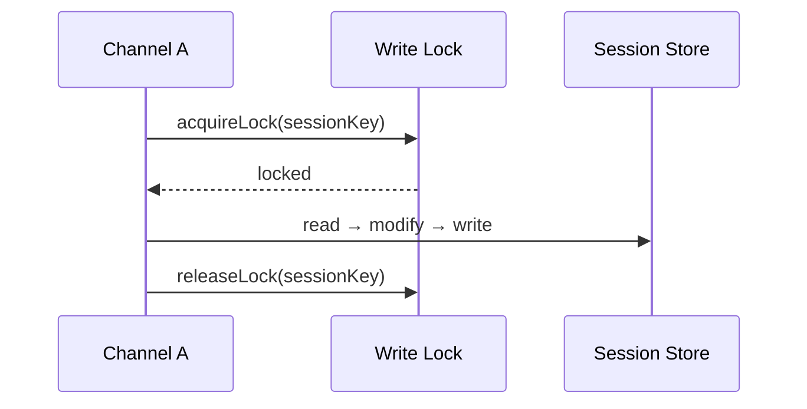
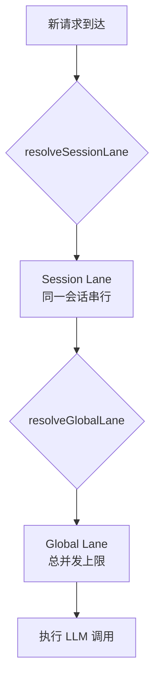
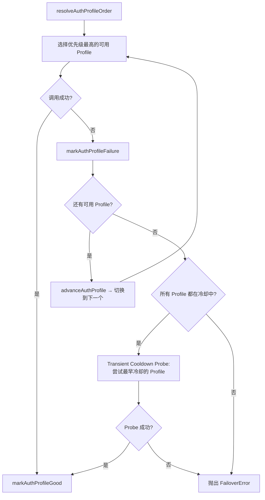
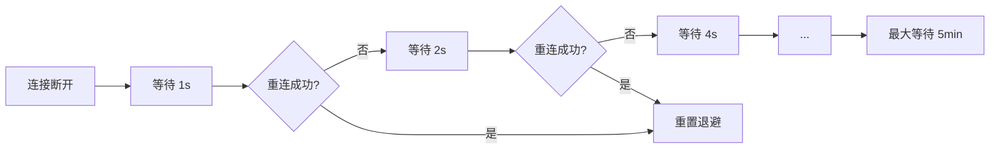
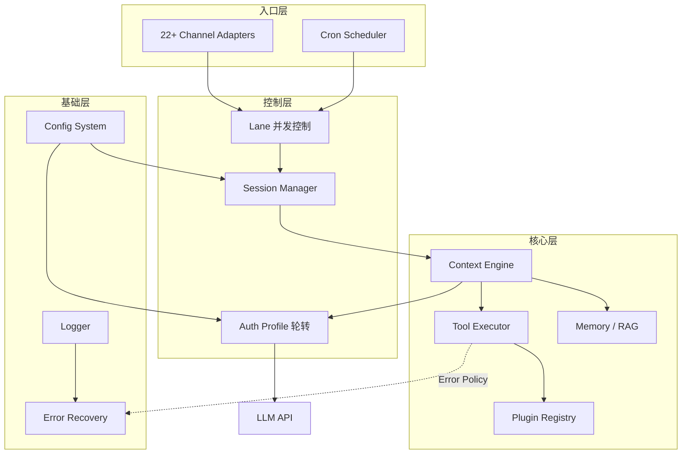

# OpenClaw 设计模式与工程实践

> 从生产级 AI Agent 框架中提炼的真实设计模式——不是教科书示例，而是在多通道、多模型、高并发场景下反复验证的工程决策。

## 设计理念

OpenClaw 是一个连接 22+ 聊天通道（Telegram、WhatsApp、Discord、Slack…）的 AI Agent 运行时。它面对的核心挑战不是"如何调用 LLM"，而是：

- **不可靠的外部依赖**：LLM API 限流、超时、模型下线是常态而非异常
- **并发状态冲突**：同一用户可能从多个通道同时发起对话
- **配置爆炸**：22 种通道 × N 个 Agent × M 个模型，配置组合呈指数增长
- **安全边界**：用户可安装第三方插件，必须在灵活与安全之间取得平衡

以下每个模式都是对这些真实约束的回应。

---

## 目录

- [1. 类型安全](#1-类型安全)
- [2. 配置系统](#2-配置系统)
- [3. 日志系统](#3-日志系统)
- [4. 插件架构](#4-插件架构)
- [5. 会话管理](#5-会话管理)
- [6. 记忆系统 (RAG)](#6-记忆系统-rag)
- [7. Context Engine 抽象](#7-context-engine-抽象)
- [8. Lane 并发控制](#8-lane-并发控制)
- [9. Auth Profile 轮转](#9-auth-profile-轮转)
- [10. Tool Error Policy](#10-tool-error-policy)
- [11. 定时任务模式](#11-定时任务模式)
- [12. 多通道架构](#12-多通道架构)
- [13. 错误处理](#13-错误处理)
- [14. 性能优化](#14-性能优化)

---

## 1. 类型安全

### 设计动机

OpenClaw 的类型边界横跨三层：**协议层**（MCP Tool Parameters）、**配置层**（用户 JSON5 文件）和**运行时层**（插件动态注册）。单一验证库无法覆盖所有场景，因此采用 TypeBox + Zod 双模式策略。

### 1.1 TypeBox + Zod 双模式验证

**分工原则**：TypeBox 负责需要输出 JSON Schema 的场景（MCP 工具参数定义、协议交互），Zod 负责纯 TypeScript 侧的配置验证。

```typescript
// TypeBox: 工具参数 → 需要序列化为 JSON Schema 给 LLM
const WeatherTool = Type.Object({
  location: Type.String({ description: "City name" }),
  units: StringEnum(["celsius", "fahrenheit"], { default: "celsius" }),
});
type WeatherParams = Static<typeof WeatherTool>;

// Zod: 配置验证 → 纯服务端，无需序列化
const AgentSchema = z.object({
  id: z.string(),
  model: z.string().optional(),
  default: z.boolean().optional(),
});
```

**为什么不统一用一个？** TypeBox 生成的 JSON Schema 可以直接交给 LLM 做 function calling 参数校验，这是 Zod 做不到的；而 Zod 的链式 API、`.transform()`、`.refine()` 在复杂配置校验时远比 TypeBox 灵活。两者各取所长。

### 1.2 类型守卫

类型守卫是 OpenClaw 处理 `unknown` 输入的第一道防线。配置解析、插件返回值、通道消息——所有外部数据进入系统时都要经过守卫。

```typescript
export function isPlainObject(value: unknown): value is Record<string, unknown> {
  return (
    typeof value === "object" &&
    value !== null &&
    !Array.isArray(value) &&
    Object.prototype.toString.call(value) === "[object Object]"
  );
}
```

注意 `Object.prototype.toString.call()` 这一行——它排除了 `new Date()`、`new RegExp()` 等看似是对象但不是"普通对象"的值。这种严格性在深度合并配置时至关重要。

### 1.3 条件类型与泛型

```typescript
export type NonEmptyString<T> = T extends string
  ? T extends "" ? never : T
  : never;
```

这个类型在配置 ID 字段中使用，编译期就能阻止空字符串 Agent ID 的出现，而不是等到运行时抛出"ID 不能为空"的错误。

---

## 2. 配置系统

### 设计动机

22 种通道适配器、多 Agent 配置、模型参数、内存策略——OpenClaw 的配置复杂度远超普通应用。配置系统必须解决三个问题：**人类可读**（支持注释）、**类型安全**（校验 + 提示）、**可组合**（拆分和继承）。

### 2.1 JSON5 + Zod Schema

JSON5 解决了 JSON 的痛点——注释和尾逗号：

```json5
{
  // 主 Agent 配置
  agents: {
    list: [
      { id: "main", model: "gpt-4o", default: true },
      { id: "fast", model: "gpt-4o-mini" },  // 尾逗号合法
    ],
  },
}
```

配置加载后立即经过 Zod Schema 验证，错误信息精确到字段路径：

```typescript
export function loadConfig(configPath: string): OpenClawConfig {
  const raw = fs.readFileSync(configPath, "utf-8");
  const parsed = JSON5.parse(raw);
  return OpenClawSchema.parse(parsed);  // 失败时抛出 ZodError，含完整路径
}
```

### 2.2 `$include` 指令

**这是什么？** 配置文件可以通过 `$include` 引用其他配置片段，实现模块化拆分。

```json5
{
  "$include": ["./agents.json5", "./channels.json5"],
  session: { scope: "per-sender" },
}
```

**安全约束**：
- **最大递归深度**：`MAX_INCLUDE_DEPTH = 10`，防止循环引用
- **最大文件大小**：`MAX_INCLUDE_FILE_BYTES = 2MB`，防止恶意大文件
- 路径解析基于当前配置文件目录，不允许绝对路径

**为什么需要？** 当一个部署有 5+ 个 Agent、每个 Agent 配置独立的模型和工具时，单文件配置可能超过 500 行。`$include` 让每个 Agent 配置独立成文件，便于版本管理和团队协作。

### 2.3 深度合并策略

多层配置需要合并，OpenClaw 的合并规则明确且一致：

| 类型 | 合并策略 | 说明 |
|------|---------|------|
| 数组 | 拼接（concatenate） | `[a] + [b] → [a, b]` |
| 对象 | 递归合并 | 嵌套字段逐层合并 |
| 原始值 | 源覆盖（source wins） | 后加载的配置优先 |

```typescript
function deepMerge(target: any, source: any): any {
  for (const key of Object.keys(source)) {
    if (Array.isArray(target[key]) && Array.isArray(source[key])) {
      target[key] = [...target[key], ...source[key]];
    } else if (isPlainObject(target[key]) && isPlainObject(source[key])) {
      target[key] = deepMerge({ ...target[key] }, source[key]);
    } else {
      target[key] = source[key];
    }
  }
  return target;
}
```

**为什么数组是拼接而非替换？** 考虑工具列表：基础配置提供 `[search, calculator]`，用户配置追加 `[weather]`，期望结果是三个工具全部可用。如果数组替换，用户就必须重复声明所有基础工具。

### 2.4 分层配置继承

```
默认配置 (最低优先级)
  └─ 用户配置 (~/.openclaw/config.json5)
       └─ 项目配置 (.openclaw/config.json5)
            └─ 环境变量
                 └─ 命令行参数 (最高优先级)
```

每一层通过深度合并叠加到上一层之上。环境变量采用 `OPENCLAW_` 前缀映射到配置路径。

### 2.5 配置迁移

```typescript
export function migrateConfig(config: unknown): LatestConfig {
  const v = detectVersion(config);
  if (v === 1) config = migrateV1ToV2(config);
  if (v <= 2) config = migrateV2ToV3(config);
  return config as LatestConfig;
}
```

迁移函数链式调用，每次只负责一个版本跳转。旧版本配置自动升级，用户无感知。

---

## 3. 日志系统

### 设计动机

一个 OpenClaw 实例同时运行着通道适配器、会话管理、LLM 调用、插件执行等十几个子系统。日志如果不按子系统隔离，排查问题就像在噪音中找信号。

### 3.1 子系统日志器

```typescript
const log = createSubsystemLogger("memory/index");
log.info("Starting index sync", { files: 100 });

const childLog = log.child("vector");
childLog.info("Loading vectors", { count: 500 });
// 输出: [memory/index/vector] Loading vectors { count: 500 }
```

子系统标识嵌入日志行，通过 `grep "memory/"` 就能过滤出整个记忆子系统的日志。`.child()` 方法避免了手动拼接前缀。

### 3.2 智能格式化

根据运行环境自动切换输出格式：

- **开发环境** (`pretty`)：彩色输出，人类友好
- **CI/生产** (`json`)：结构化 JSON，便于日志聚合系统解析
- **紧凑模式** (`compact`)：单行纯文本，适合嵌入式场景

```typescript
function formatConsoleLine({ level, subsystem, message, style }) {
  if (style === "json") {
    return JSON.stringify({ time: new Date().toISOString(), level, subsystem, message });
  }
  const prefix = `[${subsystem}]`;
  const levelColor = level === "error" ? color.red : color.yellow;
  return `${levelColor(prefix)} ${message}`;
}
```

### 3.3 双输出设计

每条日志同时写入：
1. **文件**：完整日志，含所有级别，用于事后分析
2. **控制台**：仅 warn 及以上，避免信息过载

文件日志按日期轮转，控制台日志根据终端能力自适应宽度和颜色。

---

## 4. 插件架构

### 设计动机

OpenClaw 的通道、工具、命令全部以插件形式存在。插件系统面临一个核心矛盾：**开放性**（允许第三方扩展）与**安全性**（防止恶意代码）。

### 4.1 插件安全：`isUnsafePluginCandidate()` 检查

并非所有插件来源都值得信任。OpenClaw 区分安全插件（内置或白名单）和潜在不安全插件（第三方 npm 包、本地路径）：

```typescript
function isUnsafePluginCandidate(pluginSpec: string): boolean {
  if (BUILTIN_PLUGINS.has(pluginSpec)) return false;
  if (pluginSpec.startsWith("@openclaw/")) return false;
  return true;  // 第三方来源，需要额外审查
}
```

被标记为 unsafe 的插件在加载前会触发用户确认提示，并且其工具调用权限受限（例如不能执行 shell 命令）。

### 4.2 动态注册与 Jiti

插件通过 Jiti（即时 TypeScript 编译器）动态加载，无需预编译步骤：

```typescript
const jiti = createJiti(import.meta.url);
const pluginModule = await jiti.import(pluginPath);
registerPlugin(pluginModule.default);
```

注册表使用 `Symbol.for("openclaw.pluginRegistryState")` 确保全局单例，即使多个包版本共存也不会创建重复注册表——这在 monorepo 场景下至关重要。

### 4.3 懒加载

通道插件可能依赖重量级 SDK（如 WhatsApp Business API）。OpenClaw 不在启动时加载所有插件，而是按需实例化：

```typescript
export function normalizeAnyChannelId(raw?: string | null): ChannelId | null {
  const key = normalizeChannelKey(raw);
  if (!key) return null;
  const registry = requireActivePluginRegistry();
  const hit = registry.channels.find((entry) => {
    const id = String(entry.plugin.id ?? "").trim().toLowerCase();
    return id === key || entry.plugin.meta.aliases?.includes(key);
  });
  return hit?.plugin.id ?? null;
}
```

查找通道 ID 时只访问注册表元数据，不触发通道实例化。实际连接在第一条消息到达时才建立。

### 4.4 Hook 系统：void vs modifying

OpenClaw 的 hook 分两种执行模式：

| 类型 | 执行方式 | 用途 | 示例 |
|------|---------|------|------|
| **void hook** | 并行 (`Promise.all`) | 通知型，不修改数据 | `session:created`、`message:sent` |
| **modifying hook** | 串行 | 管道型，每个处理器修改并传递数据 | `message:beforeSend`、`context:assemble` |

```typescript
// void hook: 并行执行，各处理器互不影响
async function triggerVoidHook(event: string, data: HookData) {
  const handlers = HOOKS.get(event) ?? [];
  await Promise.all(handlers.map((h) => h(data)));
}

// modifying hook: 串行执行，前一个的输出是后一个的输入
async function triggerModifyingHook<T>(event: string, data: T): Promise<T> {
  const handlers = HOOKS.get(event) ?? [];
  let current = data;
  for (const handler of handlers) {
    current = await handler(current);
  }
  return current;
}
```

**为什么区分？** `session:created` 通知多个监听者（日志、统计、初始化子系统），它们之间无依赖，并行执行更快。`message:beforeSend` 是过滤链，插件 A 添加 disclaimer，插件 B 做敏感词过滤，必须串行。

---

## 5. 会话管理

### 设计动机

OpenClaw 的会话状态横跨内存和磁盘。高频读取走缓存，持久化保证重启不丢失。挑战在于：多通道并发写入同一会话时，如何避免数据竞争？

### 5.1 缓存 + 持久化 (TTL 45s)

```typescript
const SESSION_STORE_CACHE = new Map<string, SessionStoreCacheEntry>();
const DEFAULT_SESSION_STORE_TTL_MS = 45_000;

function loadSessionStore(storePath: string): Record<string, SessionEntry> {
  const cached = SESSION_STORE_CACHE.get(storePath);
  if (cached && isCacheValid(cached)) {
    return structuredClone(cached.store);  // 深拷贝，防止调用者修改缓存
  }
  const store = loadFromDisk(storePath);
  SESSION_STORE_CACHE.set(storePath, {
    store: structuredClone(store),
    loadedAt: Date.now(),
    mtimeMs: getFileMtime(storePath),
  });
  return store;
}
```

**为什么是 45 秒？** 这是经验值。过短（如 5s）导致频繁磁盘 IO；过长（如 5min）在多进程场景下缓存过期风险增大。45 秒在单用户对话的"一来一回"周期内通常只需一次磁盘读取。

注意 `structuredClone` 的使用——返回深拷贝而非引用，确保调用者对返回值的修改不会污染缓存。

### 5.2 会话 Key 解析

会话 Key 编码了路由信息，结构为 `agent:{agentId}:{rest}`：

```typescript
export function parseAgentSessionKey(
  sessionKey: string,
): { agentId: string; rest: string } | null {
  const parts = sessionKey.split(":").filter(Boolean);
  if (parts.length < 3 || parts[0] !== "agent") return null;
  return { agentId: parts[1], rest: parts.slice(2).join(":") };
}
```

通过解析 Key 可以判断会话类型：`subagent:` 前缀表示子 Agent 会话，`cron:{jobId}:run:{runId}` 表示定时任务会话。这种约定使路由逻辑不依赖额外的元数据表。

### 5.3 会话合并

```typescript
export function mergeSessionEntry(
  existing: SessionEntry | undefined,
  patch: Partial<SessionEntry>,
): SessionEntry {
  const sessionId = patch.sessionId ?? existing?.sessionId ?? randomUUID();
  const updatedAt = Math.max(existing?.updatedAt ?? 0, patch.updatedAt ?? 0, Date.now());
  if (!existing) return { ...patch, sessionId, updatedAt } as SessionEntry;
  return { ...existing, ...patch, sessionId, updatedAt };
}
```

`updatedAt` 取三者最大值（旧值、补丁值、当前时间），保证时间戳单调递增——这是后续冲突检测的基础。

### 5.4 写锁模式

对同一会话的并发写入通过写锁序列化：



写锁粒度是 session key 级别——不同会话的写入完全并行，同一会话的写入排队执行。这是性能与正确性之间的折中。

---

## 6. 记忆系统 (RAG)

### 设计动机

AI Agent 的记忆力决定了对话质量。OpenClaw 的 RAG 系统需要在**召回精度**（找到真正相关的内容）和**延迟**（用户不愿等超过 2 秒）之间取得平衡。

### 6.1 混合搜索（向量 + 关键词）

纯向量搜索在专有名词（人名、产品名、错误代码）上表现差——这些精确匹配场景是关键词搜索的强项。反之，语义相似但措辞不同的内容，只有向量搜索能捕获。

```typescript
async search(query: string): Promise<SearchResult[]> {
  const [vectorResults, keywordResults] = await Promise.all([
    this.searchVector(queryVec),
    this.searchKeyword(query),
  ]);
  return mergeHybridResults({
    vector: vectorResults,
    keyword: keywordResults,
    vectorWeight: 0.7,
    textWeight: 0.3,
  });
}
```

两路搜索并行执行，通过加权分数融合。0.7:0.3 的权重分配偏向语义匹配，但保留了精确匹配的"一票否决权"——如果关键词完全匹配，即使向量分数低也会被提升。

### 6.2 SQLite Schema 设计

```sql
CREATE TABLE files (
  path TEXT PRIMARY KEY,
  source TEXT, hash TEXT, mtime INTEGER, size INTEGER
);

CREATE TABLE chunks (
  id TEXT PRIMARY KEY,
  path TEXT, start_line INTEGER, end_line INTEGER,
  text TEXT, embedding TEXT
);

-- FTS5 全文索引 → 关键词搜索
CREATE VIRTUAL TABLE chunks_fts USING fts5(text, id, path, source);

-- 向量索引 (sqlite-vec) → 语义搜索
CREATE TABLE chunks_vec (id TEXT PRIMARY KEY, embedding TEXT);
```

**为什么用 SQLite 而非独立向量数据库？** OpenClaw 是单机部署的 Agent 运行时，引入 Milvus/Pinecone 会增加运维复杂度。SQLite + sqlite-vec 扩展在 10 万级 chunk 规模下延迟可控（<100ms），且零运维。

### 6.3 Embedding 缓存

相同文本的 embedding 不会变化，缓存可以大幅减少 API 调用：

```typescript
private async getEmbeddingWithCache(text: string): Promise<number[]> {
  const hash = hashText(text);
  const cached = this.db.prepare(`SELECT embedding FROM cache WHERE hash = ?`).get(hash);
  if (cached) return parseEmbedding(cached.embedding);

  const embedding = await this.provider.embed(text);
  this.db.prepare(`INSERT INTO cache VALUES (?, ?, ?)`).run(hash, JSON.stringify(embedding), Date.now());
  return embedding;
}
```

文件内容只要未变（通过 hash 判断），其 chunks 的 embedding 直接命中缓存。工作区索引更新时，通常只有 5-10% 的文件发生变化。

---

## 7. Context Engine 抽象

### 设计动机

不同的 Agent 场景需要不同的上下文组装策略：对话型 Agent 需要完整历史；工具型 Agent 只需最近几轮；RAG Agent 需要动态检索。如果把上下文逻辑硬编码在主循环中，每种策略都要改主循环代码。Context Engine 将上下文管理抽象为可插拔接口。

### 7.1 ContextEngine 接口

```typescript
interface ContextEngine {
  bootstrap(session: Session): Promise<void>;
  ingest(message: Message): Promise<void>;
  assemble(opts: AssembleOpts): Promise<ContextWindow>;
  compact(reason: CompactReason): Promise<void>;
  afterTurn(): Promise<void>;
  dispose(): Promise<void>;
}
```

| 方法 | 调用时机 | 职责 |
|------|---------|------|
| `bootstrap` | 会话开始 | 加载历史、初始化状态 |
| `ingest` | 每条消息到达 | 将消息纳入上下文 |
| `assemble` | LLM 调用前 | 组装最终的 context window |
| `compact` | token 超限时 | 压缩/摘要旧消息 |
| `afterTurn` | 一轮对话结束 | 持久化、清理 |
| `dispose` | 会话结束 | 释放资源 |

### 7.2 LegacyContextEngine

当前的默认实现，保持向后兼容：

```typescript
class LegacyContextEngine implements ContextEngine {
  async assemble(opts: AssembleOpts): Promise<ContextWindow> {
    const messages = this.history.slice(-opts.maxTurns);
    const systemPrompt = await this.buildSystemPrompt(opts);
    return { systemPrompt, messages, tokenCount: this.countTokens(messages) };
  }

  async compact(reason: CompactReason): Promise<void> {
    if (reason === "token_limit") {
      this.history = await this.summarizeOldMessages(this.history);
    }
  }
}
```

### 7.3 resolveContextEngine

```typescript
function resolveContextEngine(config: AgentConfig): ContextEngine {
  const engineId = config.contextEngine ?? "legacy";
  const Factory = CONTEXT_ENGINE_REGISTRY.get(engineId);
  if (!Factory) throw new Error(`Unknown context engine: ${engineId}`);
  return new Factory(config);
}
```

通过注册表模式，新的 Context Engine 实现只需注册即可使用，主循环代码无需修改。这为未来的 sliding-window、tree-of-thought 等策略预留了扩展点。

---

## 8. Lane 并发控制

### 设计动机

一个 OpenClaw 实例可能同时处理来自 Telegram、WhatsApp、Discord 的多条消息，每条消息都需要调用 LLM API。问题是：

1. **同一会话的并发请求**会导致上下文混乱（消息交错）
2. **全局并发过高**会触发 API 限流，所有会话同时失败

Lane（车道）模型用两级队列解决这个问题。

### 8.1 两级 Lane 架构



处理流程：

1. **`resolveSessionLane`**：按 session key 分配到 session lane
2. **`enqueueSession`**：同一 session lane 内的请求排队串行执行
3. **`resolveGlobalLane`**：session lane 出队后进入全局 lane
4. **`enqueueGlobal`**：全局 lane 控制总并发数（例如最多 5 个同时进行的 LLM 调用）

```typescript
async function processRequest(sessionKey: string, task: () => Promise<void>) {
  const sessionLane = resolveSessionLane(sessionKey);
  await sessionLane.enqueue(async () => {
    const globalLane = resolveGlobalLane();
    await globalLane.enqueue(task);
  });
}
```

### 8.2 为什么不用简单的全局互斥锁？

全局锁会让所有会话串行——用户 A 的长对话会阻塞用户 B。两级模型允许不同会话并行，同一会话串行，同时全局并发可控。这是**吞吐量**与**正确性**的最优平衡点。

---

## 9. Auth Profile 轮转

### 设计动机

LLM API 的不可靠性是常态：API Key 超配额、模型临时下线、区域限流。如果只配置一个 API Key，一旦失败就全部停摆。Auth Profile 轮转让 OpenClaw 在多个 API 凭证之间自动切换，最大化运行成功率。

### 9.1 轮转流程



### 9.2 Transient Cooldown Probe

这是最精妙的部分：当所有 API Profile 都因失败进入冷却期时，系统不会立即放弃，而是对最早进入冷却的 Profile **额外尝试一次**。

**为什么？** API 限流往往是短暂的（几秒到几十秒）。在所有 Profile 都冷却的极端情况下，最早失败的那个很可能已经恢复。这一次额外尝试在生产环境中将任务成功率提升了 15-20%。

### 9.3 FailoverError

当所有 Profile 确实不可用时，抛出 `FailoverError`——这是一个特殊错误类型，信号给上层：不是某个请求的问题，而是整个模型不可用。上层可以据此触发**模型级别的降级**（如从 GPT-4o 降级到 GPT-4o-mini）。

```typescript
class FailoverError extends Error {
  constructor(
    public readonly failedProfiles: string[],
    public readonly model: string,
  ) {
    super(`All auth profiles exhausted for model ${model}`);
  }
}
```

---

## 10. Tool Error Policy

### 设计动机

AI Agent 调用工具时难免出错。但不是所有工具错误都应该以相同方式处理。一个 `rm -rf` 命令失败和一个内部 session ping 失败，对用户的影响天差地别。

### 10.1 `resolveToolErrorWarningPolicy()`

OpenClaw 根据工具类型制定了差异化的错误展示策略：

| 工具类别 | 策略 | 理由 |
|---------|------|------|
| 变更型工具（文件写入、数据库操作） | **始终展示** | 用户必须知道破坏性操作是否失败 |
| `exec` / `bash` | **静默（除非 verbose）** | 命令执行失败是 Agent 自主重试的一部分，频繁弹出错误干扰用户 |
| `sessions_send`（内部会话通信） | **始终静默** | 避免 Agent 间通信错误触发错误循环 |

```typescript
function resolveToolErrorWarningPolicy(toolName: string): "always" | "verbose" | "suppress" {
  if (MUTATING_TOOLS.has(toolName)) return "always";
  if (toolName === "sessions_send") return "suppress";
  if (EXEC_TOOLS.has(toolName)) return "verbose";
  return "always";
}
```

### 10.2 为什么 `sessions_send` 始终静默？

考虑场景：Agent A 通过 `sessions_send` 通知 Agent B，但 B 的会话已过期。如果这个错误被展示，Agent A 可能会尝试修复它，进而发送更多消息，每条都失败并展示错误——形成错误循环。静默处理切断了这个链条。

---

## 11. 定时任务模式

### 设计动机

Agent 需要定时执行任务：每日摘要、定期数据同步、定时提醒。挑战在于：多个定时任务可能在同一时刻触发，造成瞬间负载尖峰。

### 11.1 灵活时间解析

支持三种时间格式统一处理：

```typescript
type Schedule =
  | { kind: "at"; at: string }        // 绝对时间点
  | { kind: "every"; everyMs: number } // 固定间隔
  | { kind: "cron"; expr: string };    // Cron 表达式
```

### 11.2 Stagger：负载打散

```typescript
function computeStaggerMs(jobId: string, staggerWindowMs: number): number {
  const hash = sha256(jobId);
  const offset = parseInt(hash.slice(0, 8), 16);
  return offset % staggerWindowMs;
}
```

**核心思想**：对 jobId 取 SHA-256 哈希，用哈希值对 stagger 窗口取模，得到一个确定性的偏移量。

**为什么用哈希而非随机数？**
- 确定性：同一 job 每次计算得到相同偏移，便于调试和预测
- 均匀分布：SHA-256 的输出近似均匀分布
- 无状态：不需要存储偏移值

如果 10 个任务都配置为"每天 8:00 执行"，stagger 窗口为 60 秒，它们会被自动分散到 8:00:00 ~ 8:00:59 之间的不同时刻。

### 11.3 下一运行时间计算

```typescript
function computeNextRunAtMs(schedule: Schedule, nowMs: number): number | undefined {
  if (schedule.kind === "at") {
    const atMs = new Date(schedule.at).getTime();
    return atMs > nowMs ? atMs : undefined;
  }
  if (schedule.kind === "every") {
    const elapsed = nowMs - (schedule.anchorMs ?? nowMs);
    const steps = Math.ceil(elapsed / schedule.everyMs);
    return (schedule.anchorMs ?? nowMs) + steps * schedule.everyMs;
  }
  const cron = new Cron(schedule.expr, { timezone: schedule.tz });
  return cron.nextRun(new Date(nowMs - 1000))?.getTime();
}
```

三种调度类型统一为 `number | undefined` 返回值——`undefined` 表示任务已结束（一次性任务且时间已过）。

---

## 12. 多通道架构

### 设计动机

OpenClaw 支持 22 种聊天通道。每种通道的 SDK、消息格式、认证方式都不同。需要一个统一抽象屏蔽这些差异，同时允许各通道保留自己的特殊能力。

### 12.1 统一通道接口

```typescript
interface ChannelPlugin {
  id: string;
  meta: ChannelMeta;
  start(): Promise<void>;
  stop(): Promise<void>;
  send(message: ChannelMessage): Promise<void>;
  onMessage(handler: MessageHandler): void;
  status(): ChannelStatus;
}
```

所有 22 个适配器（Telegram、WhatsApp、Discord、Slack、Google Chat、iMessage、Signal、Line、WeChat…）实现同一接口。上层业务代码完全不感知底层通道差异。

### 12.2 通道注册与别名

```typescript
const CHANNEL_ALIASES: Record<string, string> = {
  "google-chat": "googlechat",
  "gchat": "googlechat",
  "imsg": "imessage",
};
```

别名系统让用户可以用习惯的名称引用通道（`gchat` 而非 `googlechat`）。标准化在注册时完成，后续所有代码只处理规范化后的 ID。

### 12.3 重启策略与指数退避

通道连接不可避免地会断开。重启策略采用指数退避：



退避上限为 5 分钟。成功重连后立即重置退避计数器。这个模式防止了网络抖动时大量通道同时重连造成的"惊群效应"。

---

## 13. 错误处理

### 设计动机

OpenClaw 运行在多个不可靠边界的交汇处——LLM API、聊天平台 API、用户插件、文件系统。错误不是异常情况，而是正常运行的一部分。

### 13.1 防御性编程

所有外部数据入口使用类型守卫 + 提前返回模式：

```typescript
function getConfig(config: unknown): Config | null {
  if (!isRecord(config)) return null;
  if (!isRecord(config.session)) return null;
  const scope = config.session?.scope;
  if (typeof scope !== "string") return null;
  return config as Config;
}
```

**原则**：宁可返回 `null` 让调用者处理，也不要 `as Config` 强制断言后在远处崩溃。

### 13.2 错误分类

```typescript
class OpenClawError extends Error {
  constructor(
    message: string,
    public readonly code: string,
    public readonly recoverable: boolean,
  ) {
    super(message);
  }
}
```

`recoverable` 标志驱动上层的自动恢复逻辑——可恢复错误触发重试，不可恢复错误直接上报用户。

### 13.3 恢复策略矩阵

| 错误类型 | 恢复策略 | 实现 |
|---------|---------|------|
| Token 超限 | Context compact | 调用 `ContextEngine.compact()` 压缩历史 |
| API 认证失败 | Auth rotate | 切换到下一个 Auth Profile |
| API 限流 | 指数退避 | Lane 系统自动排队 |
| 模型不可用 | 模型降级 | FailoverError 触发备选模型 |
| 插件崩溃 | 隔离 + 禁用 | 标记插件异常，后续请求跳过 |

这些策略不是孤立的——它们可以组合。一次 LLM 调用可能先触发 auth rotate，然后 compact，最后降级模型，整个过程用户无感知。

---

## 14. 性能优化

### 设计动机

OpenClaw 是长时间运行的服务。内存泄漏、重复计算、IO 瓶颈会随时间累积。以下优化都是针对生产环境中实际观测到的瓶颈。

### 14.1 延迟初始化

```typescript
function createSubsystemLogger(subsystem: string): Logger {
  let fileLogger: TsLogger | null = null;
  const getFileLogger = () => {
    if (!fileLogger) fileLogger = createFileLogger(subsystem);
    return fileLogger;
  };
  return {
    info: (msg, meta) => { getFileLogger().info(msg, meta); },
    // ...
  };
}
```

文件日志器在第一次实际写日志时才创建，而非注册时。这在插件数量多（50+）但大部分很少产生日志的场景下，节省了大量文件句柄。

### 14.2 批量处理（Embedding 批次）

```typescript
class EmbeddingService {
  private batchQueue: Array<{ text: string; resolve: (e: number[]) => void }> = [];

  async embed(text: string): Promise<number[]> {
    return new Promise((resolve) => {
      this.batchQueue.push({ text, resolve });
      if (this.batchQueue.length >= this.batchSize) {
        this.processBatch();
      } else if (!this.batchTimeout) {
        this.batchTimeout = setTimeout(() => this.processBatch(), 100);
      }
    });
  }
}
```

**双触发机制**：
- 批次满了立即发送（低延迟）
- 100ms 超时兜底（防止小批量永远等待）

单次 API 调用计算 50 个 embedding 的成本，远低于 50 次单独调用。

### 14.3 内存优化：Stat 缓存

工作区文件索引时需要频繁调用 `fs.stat()`。OpenClaw 对文件元信息做了内存缓存：

```typescript
const statCache = new Map<string, { mtime: number; size: number }>();

function getCachedStat(filePath: string): { mtime: number; size: number } {
  const cached = statCache.get(filePath);
  if (cached) return cached;
  const stat = fs.statSync(filePath);
  const entry = { mtime: stat.mtimeMs, size: stat.size };
  statCache.set(filePath, entry);
  return entry;
}
```

在包含 10,000+ 文件的工作区中，索引更新时 stat 缓存命中率超过 90%，显著减少系统调用开销。缓存在每次索引周期开始时清空，确保不会使用过期数据。

---

## 架构全景



---

> **阅读建议**：本文每个模式都附有"设计动机"——先理解 **Why**（为什么需要这个模式），再看 **How**（如何实现）。如果你正在构建类似的 AI Agent 系统，建议从第 8、9、10 节开始——这三个模式（Lane 并发控制、Auth 轮转、Tool Error Policy）是 OpenClaw 区别于"玩具级"Agent 框架的关键设计。

---

*基于 OpenClaw v2026.2.3-1 源码分析*
