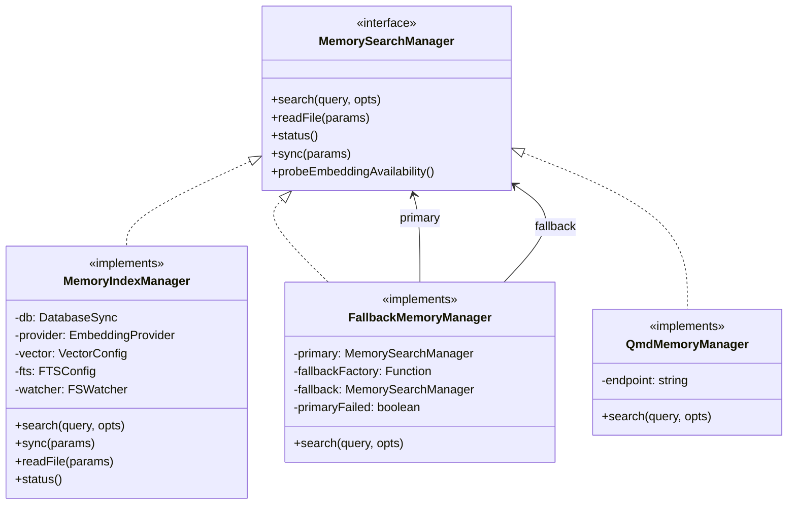
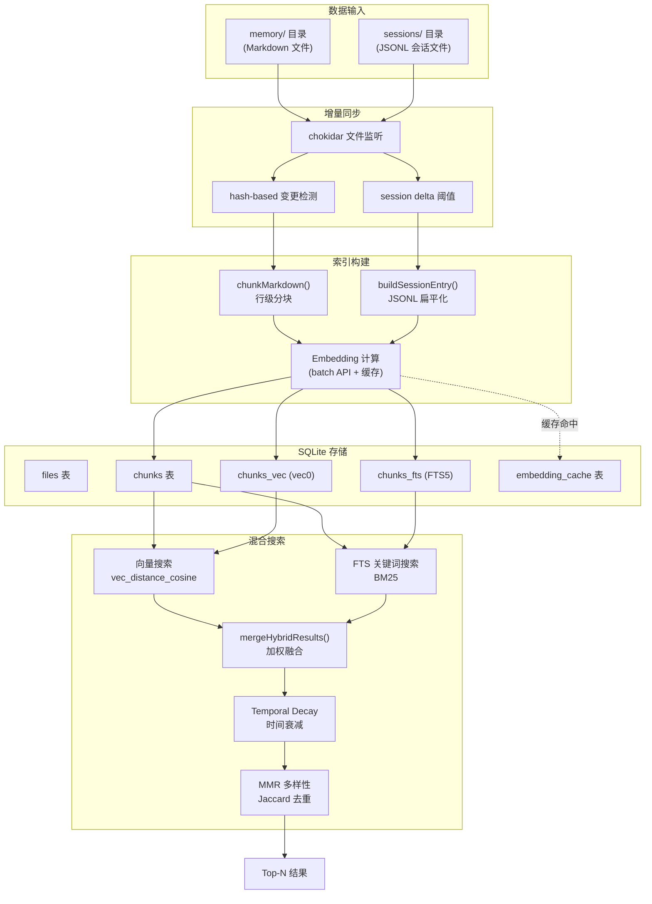
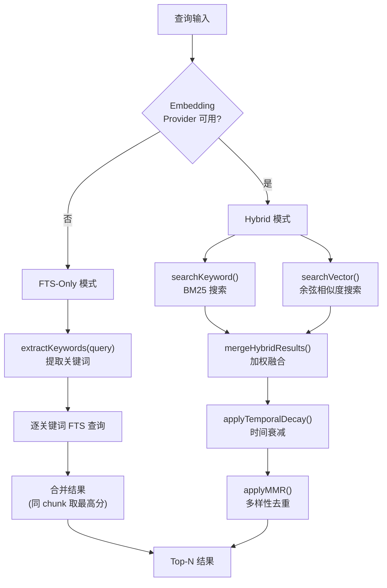
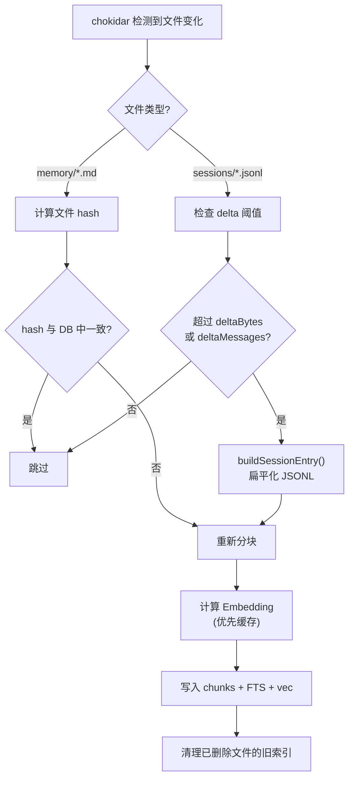
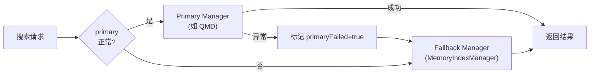
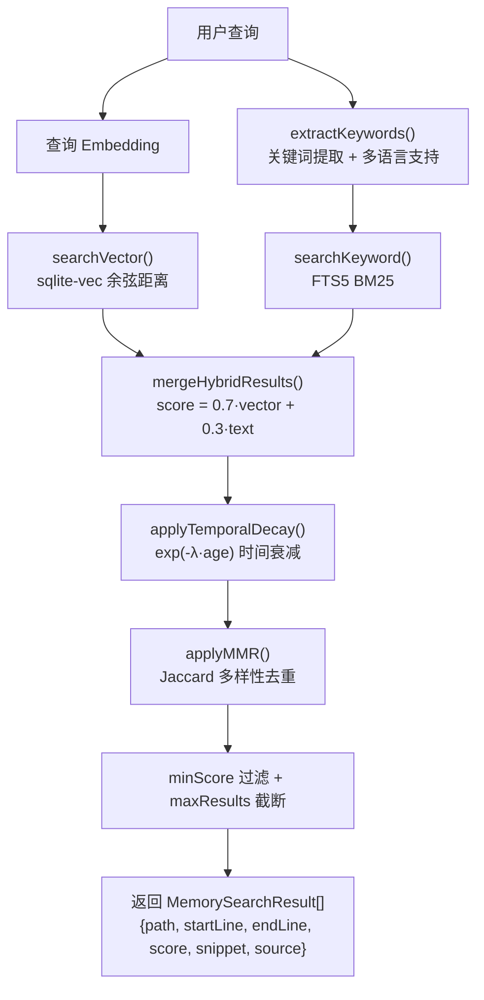

# OpenClaw 记忆系统源码深度分析

> 基于源码逐行拆解，深入理解 OpenClaw 记忆系统的每一个核心细节

---

## 设计理念

OpenClaw 的记忆系统围绕三大设计原则构建：

### Hybrid RAG — 混合检索增强生成

结合两种互补的检索策略以最大化召回率：

| 维度 | 向量搜索 (Semantic) | 全文搜索 (FTS5 BM25) |
|------|---------------------|----------------------|
| 匹配方式 | 语义相似度 (余弦距离) | 关键词精确匹配 |
| 擅长场景 | 近义词、跨语言、模糊意图 | 精确名称、代码标识符、技术术语 |
| 依赖 | Embedding Provider | SQLite FTS5 模块 |

两者的结果通过 **Hybrid Scoring** 加权融合（默认向量 70% + 关键词 30%），兼顾语义理解和精确匹配。

### Local-first — 本地优先

- **SQLite + sqlite-vec**：全部数据存储在本地 SQLite 数据库，向量索引通过 `sqlite-vec` 扩展实现
- 无需云端服务、无需 Pinecone/Weaviate 等外部向量数据库
- 数据完全留在用户本地，保障隐私

### Incremental Sync — 增量同步

- **chokidar** 文件监听器实时感知文件变更
- **hash-based** 变更检测：只有文件内容 hash 变化时才重新索引
- **Session delta** 阈值：会话文件按字节增量 (`deltaBytes`) 和消息增量 (`deltaMessages`) 触发同步，配合 5 秒防抖

---

## 架构概览

### 核心模块结构

```
src/memory/
├── manager.ts              # MemoryIndexManager — 核心管理器
├── search-manager.ts       # MemorySearchManager 工厂 + 接口定义
├── manager-search.ts       # 搜索算法实现 (searchVector / searchKeyword)
├── hybrid.ts               # 混合搜索融合、FTS 查询构建、MMR、时间衰减
├── internal.ts             # chunkMarkdown()、hashText()、工具函数
├── embeddings.ts           # Embedding 提供商注册与路由
├── embeddings-openai.ts    # OpenAI Embeddings
├── embeddings-gemini.ts    # Gemini Embeddings
├── embeddings-voyage.ts    # Voyage AI Embeddings
├── embeddings-mistral.ts   # Mistral Embeddings
├── embeddings-ollama.ts    # Ollama (本地) Embeddings
├── embeddings-local.ts     # node-llama-cpp 本地推理
├── schema.ts               # SQLite Schema 定义
├── types.ts                # 类型定义
├── session-files.ts        # Session JSONL → 文本 扁平化
├── sync-memory.ts          # memory 目录同步
├── sync-sessions.ts        # sessions 目录同步
├── fallback.ts             # FallbackMemoryManager 故障转移
├── backend-config.ts       # 后端配置解析
└── qmd-manager.ts          # QMD 远程后端
```

### 组件交互关系



### 端到端数据流



---

## Chunking 算法

> **重要纠正**：旧版文档将分块描述为基于 token 估算的句子级分割，这是不准确的。实际实现为**基于字符数的行级分割**。

### 源码：`internal.ts → chunkMarkdown()`

核心逻辑如下：

**1. 字符数计算（非 token 计数）**

```typescript
const maxChars = Math.max(32, chunking.tokens * 4);
const overlapChars = Math.max(0, chunking.overlap * 4);
```

以默认配置 `tokens=400, overlap=80` 为例：
- `maxChars = 1600` 字符
- `overlapChars = 320` 字符

**2. 行级分割（非句子级）**

```
输入文本按 '\n' 拆分为行数组
for each line:
    if 当前 chunk 字符数 + line 长度 > maxChars:
        保存当前 chunk
        以前一个 chunk 的最后 overlapChars 个字符作为新 chunk 的开头
    else:
        追加 line 到当前 chunk
```

**3. 长行处理**

当单行长度超过 `maxChars` 时，按 `maxChars` 字符强行截断拆分为多个 segment。

**4. 重叠机制**

Overlap 不是行级重叠，而是**字符级**：从前一个 chunk 的文本末尾取最后 `overlapChars` 个字符，拼接到新 chunk 的开头，确保语义连贯性。

**5. Chunk ID 生成**

```typescript
id = hashText(`${source}:${path}:${startLine}:${endLine}:${hash}:${model}`)
```

通过源类型、文件路径、行范围、内容 hash 和模型名称的组合哈希生成全局唯一 ID。相同内容 + 相同模型 = 相同 ID，天然支持去重。

### 分块示意

```
┌───────────────────────────────────────────────┐
│  MEMORY.md (假设 maxChars=1600)               │
├───────────────────────────────────────────────┤
│  Line 1-12: 内容约 1500 chars                  │ → Chunk 1 (startLine=1, endLine=12)
│  ─── overlap: 最后 320 chars ───               │
│  Line 8-20: 内容约 1400 chars                  │ → Chunk 2 (startLine=8, endLine=20)
│  ─── overlap: 最后 320 chars ───               │
│  Line 17-25: 内容约 800 chars                  │ → Chunk 3 (startLine=17, endLine=25)
└───────────────────────────────────────────────┘
```

---

## Session File Chunking

> **新增内容**：旧版文档完全缺失对会话文件处理的描述。

### 源码：`session-files.ts → buildSessionEntry()`

会话文件存储为 JSONL 格式（每行一条 JSON 记录）。索引前需要扁平化为可搜索的纯文本。

**处理流程：**

1. **逐行解析 JSONL**：筛选 `type === "message"` 且 `role` 为 `user` 或 `assistant` 的记录
2. **提取文本内容**：只保留 `content` 中类型为 `text` 的部分
3. **扁平化格式**：

```
User: 用户说的话...
Assistant: 助手的回复...
User: 另一条消息...
```

4. **lineMap 映射**：构建 `flattened line index → 原始 JSONL 行号` 的映射表
5. **remapChunkLines()**：分块后将 chunk 的 `startLine/endLine` 从扁平文本行号映射回原始 JSONL 行号，确保 `memory_get` 读取时能精确定位

### Session Delta 触发机制

不是每次文件变化都重新索引，而是基于阈值：

| 条件 | 说明 |
|------|------|
| `deltaBytes` | 文件大小增长超过阈值字节数 |
| `deltaMessages` | 新增消息数超过阈值条数 |
| debounce | 5 秒防抖，避免频繁写入时多次触发 |

---

## Embedding 系统

### 支持的提供商

| 提供商 | 模块 | Batch API | 特点 |
|--------|------|-----------|------|
| **OpenAI** | `embeddings-openai.ts` | ✅ | `text-embedding-3-small/large`，性价比首选 |
| **Gemini** | `embeddings-gemini.ts` | ✅ | `gemini-embedding-001`，Google 生态集成 |
| **Voyage** | `embeddings-voyage.ts` | ✅ | `voyage-2/4-large`，高质量检索向量 |
| **Mistral** | `embeddings-mistral.ts` | ❌ | `mistral-embed`，欧洲供应商 |
| **Ollama** | `embeddings-ollama.ts` | ❌ | 本地运行，隐私保护，兼容 OpenAI API |
| **Local** | `embeddings-local.ts` | ❌ | `node-llama-cpp`，纯本地推理 |

### Batch 处理机制

```
常量:
  EMBEDDING_BATCH_MAX_TOKENS = 8000
  EMBEDDING_INDEX_CONCURRENCY = 4
```

**执行策略：**

1. 将待嵌入文本按 `EMBEDDING_BATCH_MAX_TOKENS` 分组
2. 以 `EMBEDDING_INDEX_CONCURRENCY=4` 的并发度并行调用 Batch API
3. OpenAI / Gemini / Voyage 支持原生 Batch API，单次请求处理多条文本
4. Mistral / Ollama / Local 回退到同步逐条嵌入

**容错降级：**

```
连续 2 次 Batch API 失败
  → 该 provider 的 Batch API 被禁用
  → 回退到同步逐条嵌入
  → 不影响后续索引流程
```

### Embedding 缓存

**缓存表结构：**

```sql
embedding_cache (
  provider     TEXT NOT NULL,
  model        TEXT NOT NULL,
  provider_key TEXT NOT NULL,
  hash         TEXT NOT NULL,
  embedding    TEXT NOT NULL,   -- JSON 序列化的向量
  dims         INTEGER,
  updated_at   INTEGER NOT NULL,
  PRIMARY KEY (provider, model, provider_key, hash)
)
```

**缓存逻辑：**

1. 查询时以 `(provider, model, provider_key, hash)` 四元组作为 key
2. 命中缓存：直接返回，跳过 API 调用
3. 未命中：调用 API → 存入缓存
4. **LRU 淘汰**：当缓存条目数超过 `maxEntries` 时，按 `updated_at` 升序删除最久未使用的记录

---

## 向量存储

### sqlite-vec 扩展

```sql
-- vec0 虚拟表，N 为 embedding 维度
CREATE VIRTUAL TABLE chunks_vec USING vec0(
  id TEXT PRIMARY KEY,
  embedding FLOAT[N]
);

-- 搜索：余弦距离
SELECT c.id, c.path, c.start_line, c.end_line, c.text, c.source,
       vec_distance_cosine(v.embedding, ?) AS dist
  FROM chunks_vec v
  JOIN chunks c ON c.id = v.id
 WHERE c.model = ?
 ORDER BY dist ASC
 LIMIT ?
```

**余弦距离 → 相似度：**

$$
\text{score} = 1 - \text{vec\_distance\_cosine}(a, b)
$$

### Fallback：内存计算

当 `sqlite-vec` 扩展加载失败时：

1. 从 `chunks.embedding` 字段读取 JSON 格式的向量
2. 在内存中逐条计算余弦相似度
3. 性能较差但功能完整，确保系统不因扩展缺失而中断

---

## 混合搜索算法

### 源码：`hybrid.ts`

根据 Embedding Provider 是否可用，采用不同的搜索路径：



### mergeHybridResults() 详解

**合并策略：**

1. **Union by Chunk ID**：将向量搜索和关键词搜索的结果按 chunk ID 合并
2. 同一 chunk 同时出现在两种结果中时，保留两个分数
3. 只出现在一种结果中的 chunk，另一种分数设为 0

**评分公式：**

$$
\text{score} = w_{\text{vector}} \times s_{\text{vector}} + w_{\text{text}} \times s_{\text{text}}
$$

默认权重：$w_{\text{vector}} = 0.7$，$w_{\text{text}} = 0.3$

**计算示例：**

| Chunk | Vector Score | Text Score | Hybrid Score |
|-------|-------------|------------|--------------|
| A | 0.90 | 0.60 | 0.7×0.90 + 0.3×0.60 = **0.81** |
| B | 0.00 | 0.85 | 0.7×0.00 + 0.3×0.85 = **0.255** |
| C | 0.75 | 0.00 | 0.7×0.75 + 0.3×0.00 = **0.525** |

---

## FTS 查询构建

### Token 化

```typescript
// 正则：匹配 Unicode 字母、数字、下划线
const TOKEN_REGEX = /[\p{L}\p{N}_]+/gu;
```

支持中文、日文、韩文等 Unicode 字符。

### 查询格式

```
输入: "OpenClaw memory search 记忆"
Token化: ["OpenClaw", "memory", "search", "记忆"]
FTS查询: "OpenClaw" AND "memory" AND "search" AND "记忆"
```

所有 token 之间为 AND 关系，要求每个关键词都必须匹配。

### BM25 分数转换

```typescript
function bm25RankToScore(rank: number): number {
  if (rank >= 0) {
    // rank 为正时（FTS5 的 rank 越小越好，负数表示更相关）
    return 1 / (1 + rank);
  }
  // rank 为负时（更相关）
  const relevance = -rank;
  return relevance / (1 + relevance);
}
```

将 FTS5 的 BM25 rank 值（负数 = 更相关）映射到 `[0, 1)` 区间，与向量搜索的余弦相似度在同一尺度上。

---

## Temporal Decay（时间衰减）

### 源码：`hybrid.ts → applyTemporalDecayToHybridResults()`

让近期的记忆比旧记忆获得更高的分数加成，模拟自然遗忘曲线。

### 日期提取规则

| 文件类型 | 日期来源 |
|----------|----------|
| `memory/YYYY-MM-DD.md` | 文件名中的日期 |
| `memory/2024-01-15-meeting.md` | 文件名中的日期 |
| 非日期命名文件 | 文件的 `mtime`（最后修改时间） |

### Evergreen 文件（不衰减）

以下文件被标记为"常青"，**不受时间衰减影响**：

- `MEMORY.md` / `memory.md`（根目录长期记忆文件）
- `memory/*.md` 中不含日期的文件（如 `memory/projects.md`）

### 衰减公式

$$
\text{multiplier} = e^{-\lambda \times \text{ageInDays}}
$$

其中：

$$
\lambda = \frac{\ln 2}{\text{halfLifeDays}}
$$

**含义**：经过 `halfLifeDays` 天后，分数衰减到原来的 50%。

**衰减曲线示例**（halfLifeDays = 30）：

| 天数 | 衰减乘数 |
|------|----------|
| 0 天 | 1.000 |
| 7 天 | 0.851 |
| 30 天 | 0.500 |
| 60 天 | 0.250 |
| 90 天 | 0.125 |

---

## MMR 多样性去重

### 源码：`hybrid.ts → applyMMRToHybridResults()`

**MMR (Maximal Marginal Relevance)** 在保持相关性的同时降低结果的冗余度。

### 算法

$$
\text{MMR}(d) = \lambda \times \text{relevance}(d) - (1 - \lambda) \times \max_{d_j \in S} \text{similarity}(d, d_j)
$$

- $d$：候选文档
- $S$：已选中的结果集
- $\lambda$：多样性参数（越大越偏向相关性，越小越偏向多样性）

### 相似度度量

采用 **Jaccard 系数**，基于 tokenized snippet 计算：

$$
J(A, B) = \frac{|A \cap B|}{|A \cup B|}
$$

**迭代选择过程：**

1. 选择分数最高的结果加入 $S$
2. 对每个剩余候选，计算其 MMR 值
3. 选择 MMR 值最高的加入 $S$
4. 重复直到达到 `maxResults`

---

## Query Expansion 多语言支持

### 源码：`hybrid.ts → extractKeywords()`

`extractKeywords()` 负责从查询中提取有效关键词，内置了多语言停用词和特殊处理逻辑。

### 停用词过滤

支持 7 种语言的停用词表：

| 语言 | 示例停用词 |
|------|-----------|
| English | the, is, at, which, on, a, an |
| Español | el, la, los, las, de, en |
| Português | o, a, os, as, de, em |
| العربية | في, من, على, إلى |
| 中文 | 的, 了, 是, 在, 和, 也 |
| 한국어 | 은, 는, 이, 가, 를, 을 |
| 日本語 | の, は, が, を, に, で |

### 特殊语言处理

**CJK (中日韩) 字符 N-gram：**

CJK 文字不以空格分词，使用字符级 n-gram：

```
输入: "记忆系统"
输出: ["记忆", "忆系", "系统"]  (bigrams)
```

**韩语助词剥离：**

```
输入: "기억을"  →  "기억" (去掉助词 "을")
```

**日语按书写系统分割：**

```
输入: "メモリシステムの検索" 
→ ["メモリシステム", "検索"]  (按假名/汉字边界分割)
```

### 关键词有效性校验 — `isValidKeyword()`

过滤掉无效的 token：
- 过短的单词（如单个拉丁字母）
- 纯数字
- 仅由标点符号组成的字符串

---

## 索引管理

### 文件同步流程



### 同步触发条件

| 触发方式 | 说明 |
|----------|------|
| **文件监听** | chokidar 监听 memory/ 和 sessions/ 目录 |
| **定时同步** | `sync.intervalMinutes` 周期性触发 |
| **手动同步** | `memory_sync` 工具调用 |
| **配置变更** | provider / model / scope / extraPaths 变化时触发完整重建 |

### 重建策略：原子交换

当检测到 provider/model 等关键配置变更时，不能在原 DB 上增量更新（维度可能不同），需要：

1. 创建临时数据库文件
2. 在临时 DB 中完成全部重新索引
3. 原子交换（rename）替换旧 DB
4. 确保在重建过程中旧索引仍可用于搜索

---

## 故障恢复

### SQLITE_READONLY 处理

```
检测到 SQLITE_READONLY 错误
  → 关闭当前数据库连接
  → 重新打开数据库
  → 重试操作
```

### Embedding Provider 降级

```
Embedding API 调用失败
  → activateFallbackProvider()
  → 切换到备选 provider
  → 触发全量重建索引（因为 embedding 维度/模型可能不同）
```

### FallbackMemoryManager



Primary 一旦失败，后续所有请求直接路由到 Fallback，避免反复超时。

---

## 配置参考

### 默认值速查表

| 配置项 | 默认值 | 说明 |
|--------|--------|------|
| `provider` | `"auto"` | 自动选择可用的 Embedding 提供商 |
| `chunking.tokens` | `400` | 每块最大 token（实际 maxChars = tokens × 4） |
| `chunking.overlap` | `80` | 重叠 token（实际 overlapChars = overlap × 4） |
| `query.maxResults` | `6` | 最大返回结果数 |
| `query.minScore` | `0.35` | 最低相似度阈值 |
| `query.hybrid.enabled` | `true` | 启用混合搜索 |
| `query.hybrid.vectorWeight` | `0.7` | 向量搜索权重 |
| `query.hybrid.textWeight` | `0.3` | 关键词搜索权重 |
| `sync.intervalMinutes` | — | 定时同步间隔 |
| `sync.watchDebounceMs` | `1500` | 文件监听防抖 |
| `cache.maxEntries` | — | Embedding 缓存最大条目数 |

### Embedding 提供商对照表

| 提供商 | 代表模型 | Batch API | 维度 | 特点 |
|--------|---------|-----------|------|------|
| OpenAI | `text-embedding-3-small` | ✅ | 1536 | 性价比高，生态成熟 |
| OpenAI | `text-embedding-3-large` | ✅ | 3072 | 高精度 |
| Gemini | `gemini-embedding-001` | ✅ | 768 | Google 生态 |
| Voyage | `voyage-2` / `voyage-4-large` | ✅ | — | 检索场景专用 |
| Mistral | `mistral-embed` | ❌ | 1024 | 欧洲供应商 |
| Ollama | 本地模型 | ❌ | 依赖模型 | 本地运行，隐私保护 |
| Local | node-llama-cpp | ❌ | 依赖模型 | 纯本地，无需网络 |

### 记忆工具

| 工具 | 说明 |
|------|------|
| `memory_search` | 语义搜索记忆，参数：`query`, `maxResults?`, `minScore?` |
| `memory_get` | 读取记忆文件，参数：`path`, `from?`, `lines?` |

---

## 完整搜索管线总结



---

*基于 OpenClaw v2026.2.3-1 源码分析*
