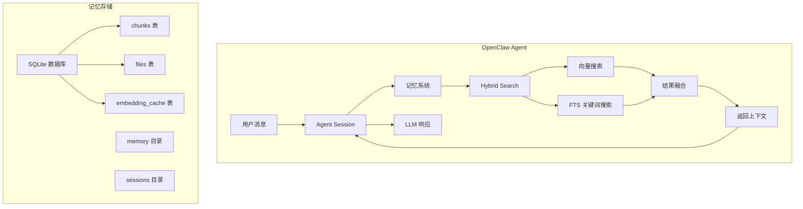
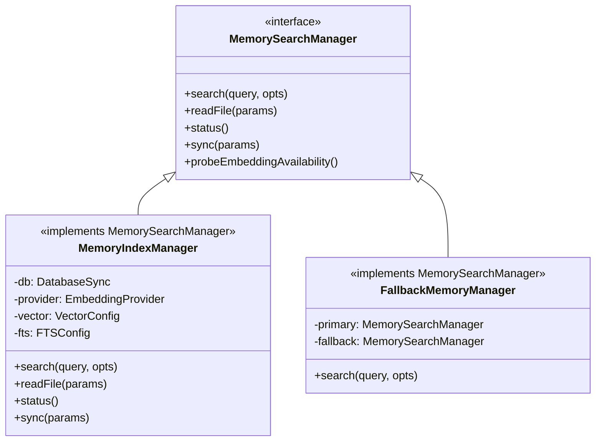
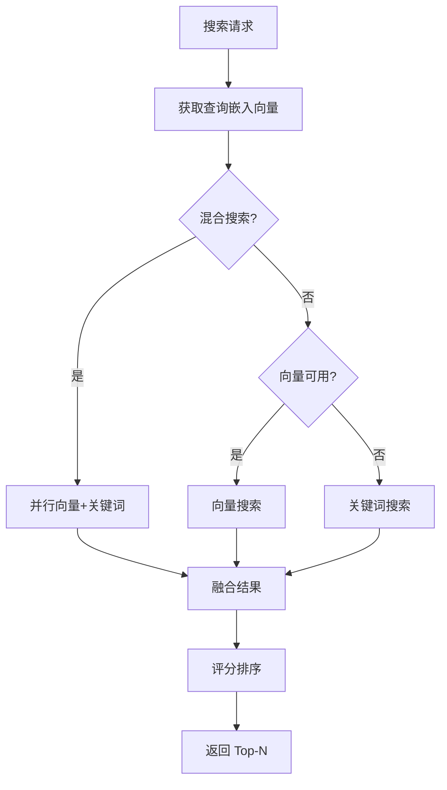
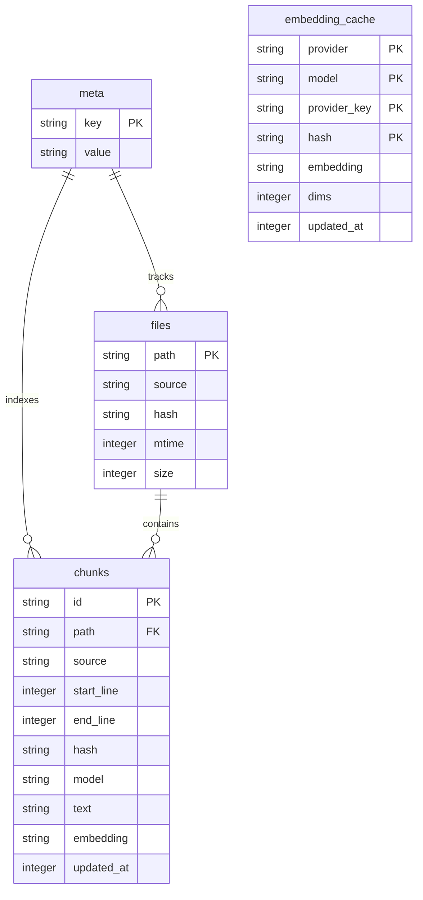
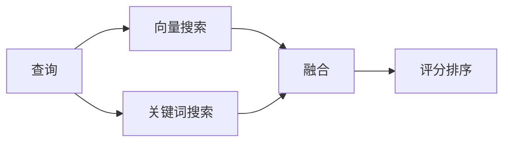
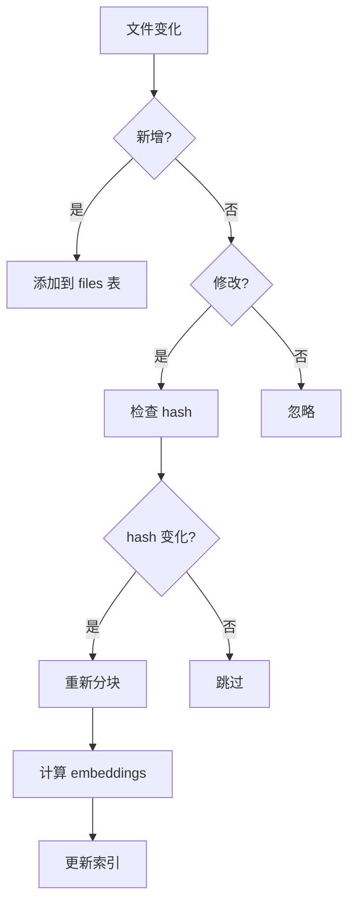

# OpenClaw 记忆系统源码深度分析

> 基于源码的全面解析，帮助你深入理解 OpenClaw 的记忆机制

## 概述

OpenClaw 的记忆系统是一个**混合检索增强生成 (Hybrid RAG)** 系统，结合了：

1. **向量搜索 (Vector Search)** - 基于语义相似度的检索
2. **全文搜索 (FTS)** - 基于关键词的精确匹配
3. **混合评分 (Hybrid Scoring)** - 融合两种搜索结果

### 核心特性

| 特性 | 描述 |
|------|------|
| **混合检索** | 向量 + 关键词融合，提高召回率 |
| **自动同步** | 监听文件变化，自动更新索引 |
| **增量更新** | 只处理变更的文件，避免重复计算 |
| **多源支持** | 支持 `memory` 和 `sessions` 两种来源 |
| **嵌入缓存** | 避免重复计算相同内容的 Embedding |
| **SQLite 存储** | 轻量级本地数据库，无需额外服务 |

### 系统定位



---

## 架构设计

### 核心模块结构

```
src/memory/
├── index.ts                    # 导出入口
├── types.ts                    # 类型定义
├── schema.ts                   # SQLite Schema
├── manager.ts                  # 核心管理器 (MemoryIndexManager)
├── search-manager.ts           # 搜索管理器 (MemorySearchManager)
├── manager-search.ts           # 搜索算法实现
├── hybrid.ts                   # 混合搜索融合
├── internal.ts                 # 内部工具函数
├── embeddings.ts               # Embedding 提供商
├── embeddings-openai.ts        # OpenAI Embeddings
├── embeddings-gemini.ts       # Gemini Embeddings
├── embeddings-voyage.ts       # Voyage AI Embeddings
├── backend-config.ts           # 后端配置
├── qmd-manager.ts             # QMD 后端实现
└── sync-*.ts                  # 文件同步逻辑
```

### 组件交互关系



---

## 核心组件详解

### MemoryIndexManager

`MemoryIndexManager` 是记忆系统的核心实现类，负责：

1. **索引管理** - 维护 SQLite 数据库
2. **文件同步** - 监听文件变化
3. **分块处理** - 将文件分割为 chunks
4. **嵌入计算** - 调用 LLM 生成向量
5. **混合搜索** - 协调向量和关键词搜索

#### 核心属性

```typescript
class MemoryIndexManager implements MemorySearchManager {
  // 数据库连接
  private db: DatabaseSync;
  
  // 配置
  private readonly settings: ResolvedMemorySearchConfig;
  private readonly provider: EmbeddingProvider;
  private readonly sources: Set<MemorySource>;
  
  // 向量搜索配置
  private readonly vector: {
    enabled: boolean;
    available: boolean | null;
    extensionPath?: string;
    dims?: number;
  };
  
  // FTS 配置
  private readonly fts: {
    enabled: boolean;
    available: boolean;
  };
  
  // 文件监听
  private watcher: FSWatcher | null = null;
  private dirty = false;
}
```

#### 搜索流程



### MemorySearchManager

这是**工厂模式**的实现：

```typescript
// search-manager.ts
export async function getMemorySearchManager(params: {
  cfg: OpenClawConfig;
  agentId: string;
}): Promise<MemorySearchManagerResult> {
  const resolved = resolveMemoryBackendConfig(params);
  
  // 尝试 QMD 后端
  if (resolved.backend === "qmd" && resolved.qmd) {
    const wrapper = new FallbackMemoryManager({
      primary: await QmdMemoryManager.create(...),
      fallbackFactory: async () => {
        return await MemoryIndexManager.get(params);
      }
    });
    return { manager: wrapper };
  }
  
  // 使用内置索引
  const manager = await MemoryIndexManager.get(params);
  return { manager };
}
```

### FallbackMemoryManager

提供故障转移机制：

```typescript
class FallbackMemoryManager implements MemorySearchManager {
  private primaryFailed = false;
  private fallback: MemorySearchManager | null = null;
  
  async search(query: string, opts?: {...}) {
    if (!this.primaryFailed) {
      try {
        return await this.deps.primary.search(query, opts);
      } catch (err) {
        this.primaryFailed = true;
        return await this.ensureFallback().search(query, opts);
      }
    }
  }
}
```

---

## 数据结构与 Schema

### SQLite Schema 设计



### Schema 源码

```typescript
// memory-schema.ts
export function ensureMemoryIndexSchema(params: {
  db: DatabaseSync;
  embeddingCacheTable: string;
  ftsTable: string;
  ftsEnabled: boolean;
}) {
  // 1. Meta 表
  db.exec(`CREATE TABLE IF NOT EXISTS meta (key TEXT PRIMARY KEY, value TEXT NOT NULL)`);
  
  // 2. Files 表 - 追踪源文件
  db.exec(`CREATE TABLE IF NOT EXISTS files (path TEXT PRIMARY KEY, source TEXT NOT NULL DEFAULT 'memory', hash TEXT NOT NULL, mtime INTEGER NOT NULL, size INTEGER NOT NULL)`);
  
  // 3. Chunks 表 - 存储文本块和嵌入
  db.exec(`CREATE TABLE IF NOT EXISTS chunks (id TEXT PRIMARY KEY, path TEXT NOT NULL, source TEXT NOT NULL DEFAULT 'memory', start_line INTEGER NOT NULL, end_line INTEGER NOT NULL, hash TEXT NOT NULL, model TEXT NOT NULL, text TEXT NOT NULL, embedding TEXT NOT NULL, updated_at INTEGER NOT NULL)`);
  
  // 4. Embedding Cache
  db.exec(`CREATE TABLE IF NOT EXISTS ${params.embeddingCacheTable} (provider TEXT NOT NULL, model TEXT NOT NULL, provider_key TEXT NOT NULL, hash TEXT NOT NULL, embedding TEXT NOT NULL, dims INTEGER, updated_at INTEGER NOT NULL, PRIMARY KEY (provider, model, provider_key, hash))`);
  
  // 5. FTS 全文索引
  if (params.ftsEnabled) {
    try {
      db.exec(`CREATE VIRTUAL TABLE IF NOT EXISTS ${params.ftsTable} USING fts5(text, id UNINDEXED, path UNINDEXED, source UNINDEXED, model UNINDEXED, start_line UNINDEXED, end_line UNINDEXED)`);
    } catch (err) { /* FTS 不可用 */ }
  }
  
  // 6. 向量索引
  db.exec(`CREATE TABLE IF NOT EXISTS chunks_vec (id TEXT PRIMARY KEY, embedding TEXT NOT NULL)`);
}
```

### 数据类型

```typescript
// types.ts
export type MemorySource = "memory" | "sessions";

export type MemorySearchResult = {
  path: string;           // 文件路径
  startLine: number;      // 开始行号
  endLine: number;        // 结束行号
  score: number;          // 综合评分 (0-1)
  snippet: string;        // 文本片段 (最多 700 字符)
  source: MemorySource;   // 数据来源
  citation?: string;      // 引用标识
};
```

---

## 搜索流程详解

### 向量搜索

#### 算法：余弦相似度

```typescript
// manager-search.ts
export async function searchVector(params: {
  db: DatabaseSync;
  queryVec: number[];
  limit: number;
}): Promise<SearchRowResult[]> {
  const rows = params.db
    .prepare(`
      SELECT c.id, c.path, c.start_line, c.end_line, c.text, c.source,
             vec_distance_cosine(v.embedding, ?) AS dist
        FROM chunks_vec v
        JOIN chunks c ON c.id = v.id
       WHERE c.model = ?
       ORDER BY dist ASC
       LIMIT ?
    `)
    .all(vectorToBlob(params.queryVec), params.providerModel, params.limit);
  
  return rows.map(row => ({
    id: row.id,
    path: row.path,
    startLine: row.start_line,
    endLine: row.end_line,
    score: 1 - row.dist,  // 余弦距离转相似度
    snippet: truncateUtf16Safe(row.text, SNIPPET_MAX_CHARS),
    source: row.source,
  }));
}
```

#### 余弦相似度公式

$$
\text{similarity}(a, b) = \frac{a \cdot b}{\|a\| \cdot \|b\|} = 1 - \text{cosine\_distance}
$$

### 关键词搜索

#### 算法：BM25 + FTS5

```typescript
// manager-search.ts
export async function searchKeyword(params: {
  db: DatabaseSync;
  query: string;
  limit: number;
}): Promise<SearchRowResult[]> {
  const ftsQuery = buildFtsQuery(params.query);
  if (!ftsQuery) return [];
  
  const rows = params.db
    .prepare(`
      SELECT id, path, source, start_line, end_line, text,
             bm25(chunks_fts) AS rank
        FROM chunks_fts
       WHERE chunks_fts MATCH ? AND model = ?
       ORDER BY rank ASC
       LIMIT ?
    `)
    .all(ftsQuery, params.providerModel, params.limit);
  
  return rows.map(row => ({
    id: row.id,
    path: row.path,
    startLine: row.start_line,
    endLine: row.end_line,
    score: bm25RankToScore(row.rank),
    snippet: truncateUtf16Safe(row.text, SNIPPET_MAX_CHARS),
    source: row.source,
  }));
}
```

#### FTS 查询构建

```typescript
// hybrid.ts
export function buildFtsQuery(raw: string): string | null {
  const tokens = raw.match(/[A-Za-z0-9_]+/g)?.map(t => t.trim()).filter(Boolean) ?? [];
  if (tokens.length === 0) return null;
  
  const quoted = tokens.map(t => `"${t.replaceAll('"', "")}"`);
  return quoted.join(" AND ");
  
  // 示例: "openclaw memory search" -> "openclaw AND memory AND search"
}
```

### 混合搜索

#### 结果融合

```typescript
// hybrid.ts
export function mergeHybridResults(params: {
  vector: HybridVectorResult[];
  keyword: HybridKeywordResult[];
  vectorWeight: number;  // 默认 0.7
  textWeight: number;     // 默认 0.3
}): HybridResult[] {
  const byId = new Map<string, Entry>();
  
  for (const r of params.vector) {
    byId.set(r.id, { ..., vectorScore: r.vectorScore, textScore: 0 });
  }
  for (const r of params.keyword) {
    const existing = byId.get(r.id);
    if (existing) {
      existing.textScore = r.textScore;
    } else {
      byId.set(r.id, { ..., vectorScore: 0, textScore: r.textScore });
    }
  }
  
  return Array.from(byId.values()).map(entry => ({
    ...entry,
    score: params.vectorWeight * entry.vectorScore + params.textWeight * entry.textScore,
  })).toSorted((a, b) => b.score - a.score);
}
```

#### 混合搜索流程



---

## 索引管理

### 文件同步机制



### 分块策略

```typescript
// internal.ts
export function chunkMarkdown(params: {
  content: string;
  tokens: number;      // 默认 400
  overlap: number;     // 默认 80
}): MemoryChunk[] {
  const chunks: MemoryChunk[] = [];
  const lines = params.content.split('\n');
  
  let currentChunk = "";
  let currentTokens = 0;
  
  for (const line of lines) {
    const lineTokens = estimateTokens(line);
    
    if (currentTokens + lineTokens > params.tokens && currentChunk.length > 0) {
      chunks.push({ text: currentChunk.trim(), ... });
      const overlapText = extractOverlap(currentChunk, params.overlap);
      currentChunk = overlapText + '\n' + line;
      currentTokens = estimateTokens(overlapText) + lineTokens;
    } else {
      currentChunk += line + '\n';
      currentTokens += lineTokens;
    }
  }
  
  return chunks;
}
```

### 分块示意

```
┌─────────────────────────────────────────┐
│  MEMORY.md 内容                          │
├─────────────────────────────────────────┤
│  Line 1: # 概述                          │
│  Line 2:                                 │
│  Line 3: 这是内容...                      │
│  ...                                     │
├─────────────────────────────────────────┤
│  Chunk 1 (Lines 1-10)                    │
│  Chunk 2 (Lines 5-15) ← overlap         │
│  Chunk 3 (Lines 12-22)                  │
└─────────────────────────────────────────┘
```

### Embedding 缓存

```typescript
class MemoryIndexManager {
  private async getEmbeddingWithCache(text: string): Promise<number[]> {
    const hash = hashText(text);
    
    // 1. 查找缓存
    const cached = this.db
      .prepare(`SELECT embedding FROM embedding_cache WHERE hash = ?`)
      .get(hash);
    
    if (cached) return parseEmbedding(cached.embedding);
    
    // 2. 调用 LLM 计算
    const embedding = await this.provider.embed(text);
    
    // 3. 存入缓存
    this.db
      .prepare(`INSERT INTO embedding_cache VALUES (?, ?, ?, ?, ?, ?)`)
      .run(this.provider, this.model, this.providerKey, hash,
           JSON.stringify(embedding), Date.now());
    
    return embedding;
  }
}
```

---

## 记忆存储

### 文件结构

```
~/.openclaw/workspace/
├── AGENTS.md           # Agent 配置 (自动加载)
├── SOUL.md             # Agent 身份定义
├── USER.md             # 用户信息
├── TOOLS.md            # 工具配置
├── MEMORY.md           # 长期记忆
├── memory/             # 记忆文件目录
│   ├── daily-notes/    # 每日笔记
│   ├── projects/       # 项目相关
│   └── ...
├── sessions/           # 会话历史
└── [其他项目文件]
```

### 配置示例

```json
{
  "memory": {
    "sources": ["memory", "sessions"],
    "extraPaths": ["/path/to/extra"],
    "provider": "auto",
    "model": "text-embedding-3-small",
    "chunking": {
      "tokens": 400,
      "overlap": 80
    },
    "query": {
      "maxResults": 6,
      "minScore": 0.35,
      "hybrid": {
        "enabled": true,
        "vectorWeight": 0.7,
        "textWeight": 0.3
      }
    }
  }
}
```

---

## 配置选项

### 默认值速查表

| 配置项 | 默认值 | 说明 |
|--------|--------|------|
| `provider` | `"auto"` | 自动选择提供商 |
| `chunking.tokens` | `400` | 每块最大 token |
| `chunking.overlap` | `80` | 重叠 token 数 |
| `query.maxResults` | `6` | 返回结果数 |
| `query.minScore` | `0.35` | 最小相似度 |
| `query.hybrid.enabled` | `true` | 启用混合搜索 |
| `query.hybrid.vectorWeight` | `0.7` | 向量权重 |
| `query.hybrid.textWeight` | `0.3` | 关键词权重 |
| `sync.watchDebounceMs` | `1500` | 防抖时间 |
| `cache.enabled` | `true` | 启用缓存 |

### Embedding 提供商

| 提供商 | 模型 | 特点 |
|--------|------|------|
| `openai` | `text-embedding-3-small` | 性价比高 |
| `gemini` | `gemini-embedding-001` | Google 生态 |
| `voyage` | `voyage-4-large` | 高质量 |
| `local` | 本地模型 | 隐私保护 |
| `auto` | 自动选择 | 默认推荐 |

---

## 使用指南

### 工具调用

#### memory_search - 语义搜索

```typescript
export async function memory_search(
  query: string,
  maxResults?: number,
  minScore?: number
): Promise<MemorySearchResult[]>
```

**使用示例：**

```
搜索: "Tom 的项目信息"
返回:
  [
    {
      "path": "memory/projects/openclaw.md",
      "startLine": 10,
      "endLine": 20,
      "score": 0.85,
      "snippet": "Tom 正在开发 OpenClaw...",
      "source": "memory"
    }
  ]
```

#### memory_get - 读取记忆

```typescript
// 读取文件
await memory_get({ path: "memory/daily-notes/2024-01-15.md" });

// 读取行范围
await memory_get({ path: "memory/projects.md", from: 10, lines: 20 });
```

### 最佳实践

#### 1. 记忆文件组织

```
memory/
├── AGENTS.md           # Agent 核心配置
├── SOUL.md             # Agent 身份定义
├── USER.md             # 用户偏好
├── MEMORY.md           # 长期重要记忆
├── daily-notes/        # 每日笔记
│   ├── 2024-01-15.md
│   └── 2024-01-16.md
├── projects/           # 项目相关
│   ├── openclaw.md
│   └── website.md
└── preferences/        # 偏好设置
```

#### 2. 内容格式

```markdown
# SSH 配置

## 概述
记录 Tom 的 SSH 配置信息。

## 主机信息
- 服务器: 192.168.1.100
- 用户: admin
- 端口: 22

## 密钥位置
~/.ssh/id_rsa_openclaw
```

#### 3. 性能优化

```typescript
// 减少返回结果
await memory_search("查询", maxResults=3);

// 提高分数阈值
await memory_search("查询", minScore=0.5);

// 禁用混合搜索
{ "memory": { "query": { "hybrid": { "enabled": false } } } }
```

---

## 源码关键代码解读

### 1. 混合搜索入口

```typescript
// manager.ts
async search(query: string, opts?: {...}): Promise<MemorySearchResult[]> {
  const queryVec = await this.provider.embed(query);
  return await this.hybridSearch(queryVec, opts);
}

private async hybridSearch(queryVec: number[], opts?: {...}) {
  const { hybrid } = this.settings.query;
  
  if (hybrid.enabled && queryVec.length > 0) {
    const [vectorResults, keywordResults] = await Promise.all([
      this.searchVector(queryVec, opts),
      this.searchKeyword(query, opts),
    ]);
    
    return mergeHybridResults({
      vector: vectorResults,
      keyword: keywordResults,
      vectorWeight: hybrid.vectorWeight,
      textWeight: hybrid.textWeight,
    });
  }
  
  return queryVec.length > 0 
    ? this.searchVector(queryVec, opts)
    : this.searchKeyword(query, opts);
}
```

### 2. 评分计算

```typescript
// 综合评分公式
score = vectorWeight × vectorScore + textWeight × textScore

// 示例
// 向量 0.9 + 关键词 0.6
// 综合 = 0.7 × 0.9 + 0.3 × 0.6 = 0.81
```

### 3. 增量同步

```typescript
// manager.ts
private async syncFiles(): Promise<void> {
  const files = await listMemoryFiles(this.memoryDir);
  
  for (const file of files) {
    const currentHash = await hashFile(file.path);
    const dbHash = this.getFileHash(file.path);
    
    if (currentHash !== dbHash) {
      await this.reindexFile(file);
    }
  }
  
  this.cleanupDeletedFiles();
}
```

---

## 常见问题

### Q1: 搜索不到内容？

1. 检查 `memory/` 目录下是否有文件
2. 确认 `memory_search` 的 `minScore` 不要太高
3. 运行 `memory_sync` 手动触发同步

### Q2: 性能差？

1. 启用 Embedding 缓存 (`cache.enabled: true`)
2. 使用 `sqlite-vec` 扩展加速向量搜索
3. 减少 `chunking.tokens` 增加并行度

### Q3: FTS 不可用？

SQLite 编译时缺少 FTS5 模块，降级到关键词匹配。

### Q4: 如何清除索引？

删除 SQLite 数据库文件：
```bash
rm ~/.openclaw/workspace/.memory/index.sqlite
```

### Q5: 支持哪些 Embedding 模型？

| 提供商 | 模型 |
|--------|------|
| OpenAI | `text-embedding-3-small`, `text-embedding-3-large` |
| Gemini | `gemini-embedding-001` |
| Voyage | `voyage-2`, `voyage-4-large` |
| 本地 | 支持 Ollama 等兼容 OpenAI API 的服务 |

---

## 总结

OpenClaw 记忆系统核心要点：

1. **混合搜索**: 向量 (70%) + 关键词 (30%) 融合
2. **SQLite 存储**: 轻量级本地数据库
3. **自动同步**: 文件变化监听 + 防抖
4. **增量更新**: 只处理变更文件
5. **嵌入缓存**: 避免重复计算
6. **分块策略**: 400 tokens + 80 overlap
7. **故障转移**: QMD → 内置索引回退

掌握这些，就能高效使用 OpenClaw 的记忆系统！
