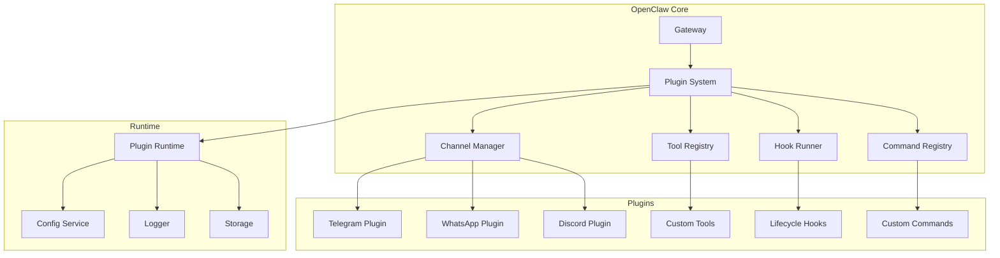
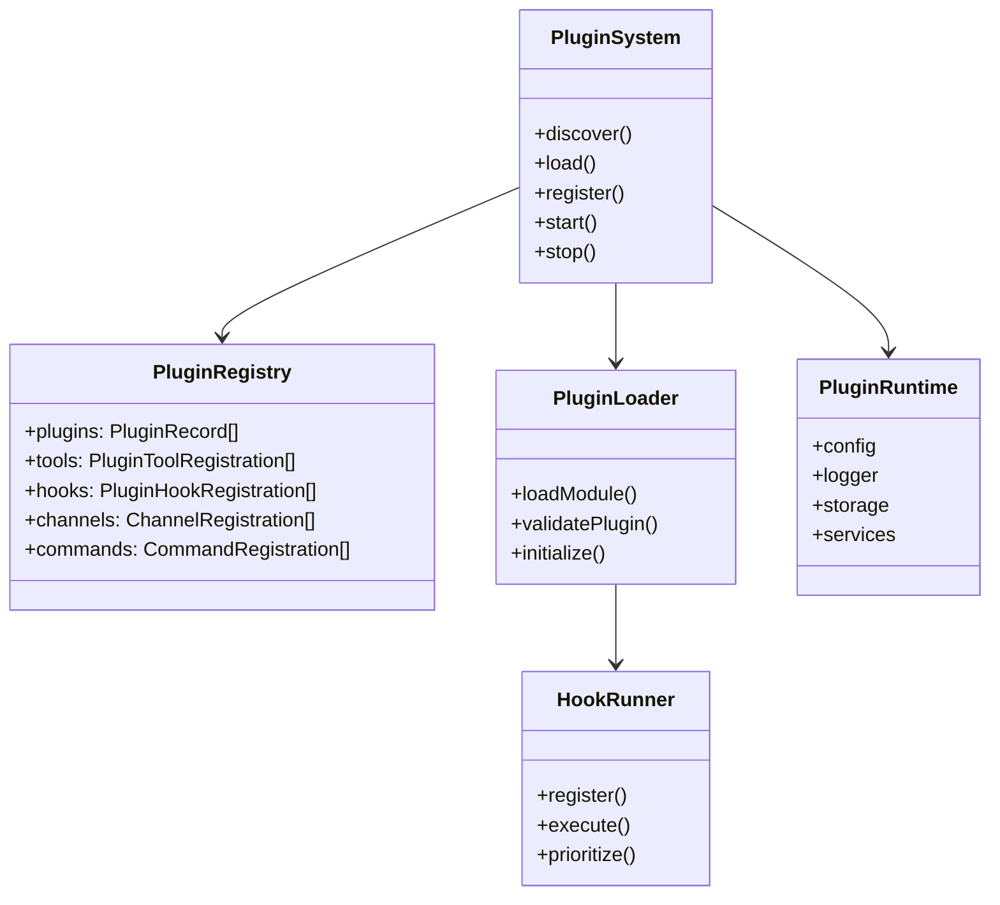
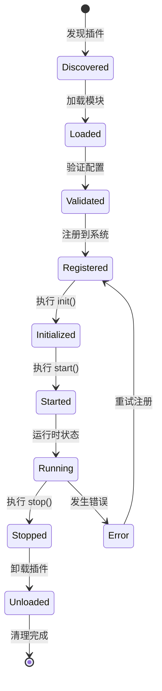
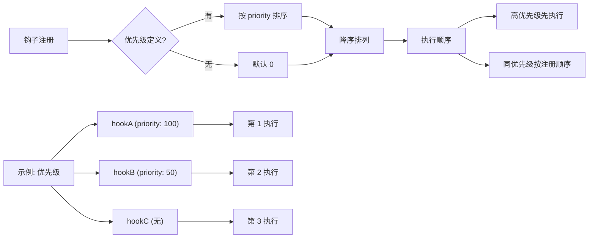
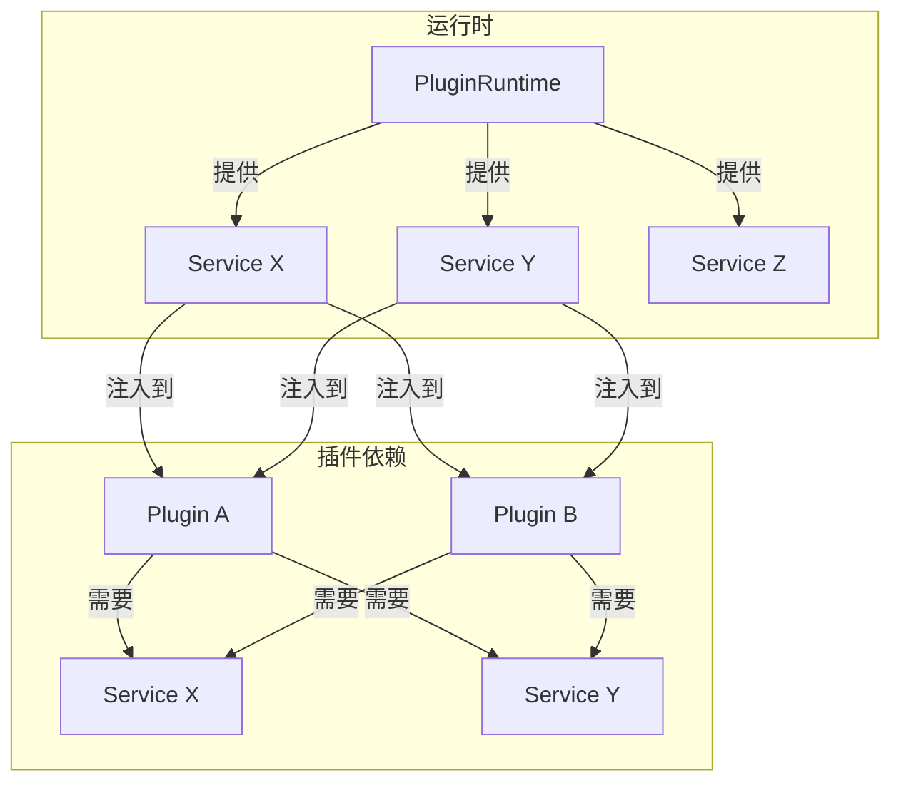

# OpenClaw 插件系统源码深度分析

> 基于源码的全面解析，帮助你深入理解 OpenClaw 的插件架构

## 目录

- [概述](#概述)
- [架构设计](#架构设计)
- [核心概念](#核心概念)
  - [插件类型](#插件类型)
  - [插件注册表](#插件注册表)
  - [插件生命周期](#插件生命周期)
- [插件发现与加载](#插件发现与加载)
  - [发现机制](#发现机制)
  - [加载流程](#加载流程)
  - [模块解析](#模块解析)
- [通道插件](#通道插件)
  - [通道接口](#通道接口)
  - [适配器模式](#适配器模式)
  - [配置管理](#配置管理)
- [工具插件](#工具插件)
  - [工具工厂](#工具工厂)
  - [上下文传递](#上下文传递)
- [钩子系统](#钩子系统)
  - [钩子类型](#钩子类型)
  - [执行机制](#执行机制)
  - [优先级排序](#优先级排序)
- [运行时集成](#运行时集成)
  - [PluginRuntime](#pluginruntime)
  - [服务注入](#服务注入)
  - [依赖管理](#依赖管理)
- [配置与状态](#配置与状态)
  - [配置模式](#配置模式)
  - [状态管理](#状态管理)
- [使用指南](#使用指南)
  - [创建插件](#创建插件)
  - [注册插件](#注册插件)
  - [插件开发最佳实践](#插件开发最佳实践)
- [源码关键代码解读](#源码关键代码解读)
- [常见问题](#常见问题)

---

## 概述

OpenClaw 的插件系统是一个**高度模块化的扩展框架**，支持：

1. **通道插件** - 支持多种消息通道（Telegram、WhatsApp、Discord 等）
2. **工具插件** - 扩展 Agent 工具集
3. **钩子插件** - 拦截和修改系统行为
4. **命令插件** - 添加自定义命令
5. **HTTP 处理器** - 提供 HTTP API 接口

### 系统定位



### 核心特性

| 特性 | 描述 |
|------|------|
| **多类型插件** | 通道、工具、钩子、命令、HTTP |
| **动态加载** | 支持本地、npm、git 源 |
| **懒加载** | 按需导入，避免启动开销 |
| **依赖注入** | 通过 Runtime 注入服务 |
| **版本管理** | 支持版本锁定和更新检查 |
| **沙箱隔离** | 可选的沙箱执行环境 |

---

## 架构设计

### 模块结构

```
src/plugins/
├── types.ts              # 类型定义
├── registry.ts           # 插件注册表
├── discovery.ts         # 插件发现
├── loader.ts            # 插件加载器
├── manifest.ts          # 插件清单
├── config-state.ts      # 配置状态
├── hooks.ts            # 钩子系统
├── commands.ts          # 命令注册
├── tools.ts            # 工具注册
├── install.ts           # 安装管理
├── update.ts            # 更新检查
├── runtime/             # 运行时
│   └── index.ts        # PluginRuntime
└── channels/           # 通道管理
```

### 组件交互



---

## 核心概念

### 插件类型

```typescript
// types.ts

export type PluginKind = "memory";

// 插件定义结构
export type OpenClawPluginDefinition = {
  id: string;                    // 插件唯一标识
  name?: string;                 // 显示名称
  version?: string;              // 版本号
  description?: string;           // 描述
  
  // 注册项
  channels?: ChannelPlugin[];   // 通道插件
  tools?: ToolFactory[];         // 工具插件
  hooks?: HookEntry[];           // 钩子插件
  commands?: Command[];           // 命令插件
  
  // 配置
  config?: PluginConfig;        // 插件配置
  schema?: ConfigSchema;         // 配置 Schema
  
  // 生命周期
  init?: (runtime: PluginRuntime) => Promise<void>;
  start?: (runtime: PluginRuntime) => Promise<void>;
  stop?: (runtime: PluginRuntime) => Promise<void>;
};
```

### 插件注册表

```typescript
// registry.ts

export type PluginRegistry = {
  // 插件记录
  plugins: PluginRecord[];
  
  // 工具注册
  tools: PluginToolRegistration[];
  
  // 钩子注册
  hooks: PluginHookRegistration[];
  typedHooks: TypedPluginHookRegistration[];
  
  // 通道注册
  channels: PluginChannelRegistration[];
  
  // 提供商注册
  providers: PluginProviderRegistration[];
  
  // 网关处理器
  gatewayHandlers: GatewayRequestHandlers;
  
  // HTTP 处理器
  httpHandlers: PluginHttpRegistration[];
  httpRoutes: PluginHttpRouteRegistration[];
  
  // CLI 注册
  cliRegistrars: PluginCliRegistration[];
  
  // 服务注册
  services: PluginServiceRegistration[];
  
  // 命令注册
  commands: PluginCommandRegistration[];
  
  // 诊断
  diagnostics: PluginDiagnostic[];
};
```

### 插件生命周期



---

## 插件发现与加载

### 发现机制

```typescript
// discovery.ts

const EXTENSION_EXTS = new Set([".ts", ".js", ".mts", ".cts", ".mjs", ".cjs"]);

// 插件来源
type PluginOrigin = "config" | "workspace" | "global" | "bundled";

// 插件候选
type PluginCandidate = {
  idHint: string;
  source: string;           // 文件路径
  rootDir: string;          // 根目录
  origin: PluginOrigin;      // 来源
  workspaceDir?: string;
  packageName?: string;
  packageVersion?: string;
  packageDescription?: string;
};

// 发现流程
function discoverPlugins(): PluginDiscoveryResult {
  const candidates: PluginCandidate[] = [];
  
  // 1. 从配置目录发现
  discoverInDirectory({
    dir: CONFIG_DIR,
    origin: "config",
    candidates,
  });
  
  // 2. 从工作区发现
  discoverInDirectory({
    dir: WORKSPACE_PLUGINS_DIR,
    origin: "workspace",
    candidates,
  });
  
  // 3. 从全局目录发现
  discoverInDirectory({
    dir: GLOBAL_PLUGINS_DIR,
    origin: "global",
    candidates,
  });
  
  return { candidates, diagnostics: [] };
}

function discoverInDirectory(params: {
  dir: string;
  origin: PluginOrigin;
  workspaceDir?: string;
  candidates: PluginCandidate[];
  diagnostics: PluginDiagnostic[];
}) {
  const entries = fs.readdirSync(params.dir, { withFileTypes: true });
  
  for (const entry of entries) {
    if (entry.isFile() && isExtensionFile(entry.name)) {
      // 添加插件候选
      addCandidate({
        candidates: params.candidates,
        idHint: path.basename(entry.name, path.extname(entry.name)),
        source: path.join(params.dir, entry.name),
        rootDir: params.dir,
        origin: params.origin,
        workspaceDir: params.workspaceDir,
      });
    }
  }
}
```

### 加载流程

```typescript
// loader.ts

export async function loadPlugins(options: PluginLoadOptions): Promise<PluginRegistry> {
  // 1. 发现插件
  const { candidates } = discoverPlugins();
  
  // 2. 过滤启用的插件
  const enabled = candidates.filter(c => isPluginEnabled(c, options.config));
  
  // 3. 加载每个插件
  const registry = createPluginRegistry();
  
  for (const candidate of enabled) {
    try {
      // 动态导入模块
      const module = await importPluginModule(candidate.source);
      
      // 提取插件定义
      const definition = extractPluginDefinition(module);
      
      // 验证配置
      const validated = validatePluginConfig(definition.config);
      
      // 注册到注册表
      registerPlugin(registry, candidate, definition, validated);
      
    } catch (err) {
      // 记录错误但继续加载其他插件
      registry.diagnostics.push({
        level: "error",
        message: `Failed to load ${candidate.idHint}: ${String(err)}`,
        source: candidate.source,
      });
    }
  }
  
  return registry;
}

async function importPluginModule(source: string): Promise<OpenClawPluginModule> {
  // 使用 jiti 支持 TypeScript
  const jiti = createJiti(import.meta.url);
  return await jiti.import(source);
}
```

### 模块解析

```typescript
// loader.ts

function resolvePluginModuleExport(moduleExport: unknown): {
  definition?: OpenClawPluginDefinition;
  register?: OpenClawPluginDefinition["register"];
} {
  // 支持多种导出方式
  
  // 1. 默认导出
  if (moduleExport && typeof moduleExport === "object" && "default" in moduleExport) {
    const def = moduleExport.default;
    if (typeof def === "function") {
      return { register: def };
    }
    if (def && typeof def === "object") {
      return { definition: def as OpenClawPluginDefinition };
    }
  }
  
  // 2. 命名导出
  if (moduleExport && typeof moduleExport === "object") {
    const def = moduleExport as OpenClawPluginDefinition;
    if (def.register || def.activate || def.id) {
      return { definition: def };
    }
  }
  
  return {};
}
```

---

## 通道插件

### 通道接口

```typescript
// channels/plugins/types.plugin.ts

export type ChannelPlugin<ResolvedAccount = any, Probe = unknown, Audit = unknown> = {
  // 核心标识
  id: ChannelId;
  meta: ChannelMeta;
  
  // 能力声明
  capabilities: ChannelCapabilities;
  
  // 配置
  config: ChannelConfigAdapter<ResolvedAccount>;
  configSchema?: ChannelConfigSchema;
  
  // 生命周期
  setup?: ChannelSetupAdapter;
  
  // 功能适配器
  auth?: ChannelAuthAdapter;
  security?: ChannelSecurityAdapter;
  outbound?: ChannelOutboundAdapter;
  groups?: ChannelGroupAdapter;
  mentions?: ChannelMentionAdapter;
  messaging?: ChannelMessagingAdapter;
  streaming?: ChannelStreamingAdapter;
  threading?: ChannelThreadingAdapter;
  directory?: ChannelDirectoryAdapter;
  
  // 特殊功能
  commands?: ChannelCommandAdapter;
  actions?: ChannelMessageActionAdapter;
  agentPrompt?: ChannelAgentPromptAdapter;
  agentTools?: ChannelAgentToolFactory;
  
  // 工具
  heartbeat?: ChannelHeartbeatAdapter;
};
```

### 适配器模式

```typescript
// 通道适配器接口示例

// 消息适配器
type ChannelMessagingAdapter = {
  // 发送消息
  send: (params: {
    channelId: string;
    target: string;
    message: ChannelMessage;
    replyTo?: string;
    threadId?: string;
  }) => Promise<SendResult>;
  
  // 接收消息
  onMessage: (handler: MessageHandler) => void;
  
  // 流式消息
  stream?: (params: {
    channelId: string;
    target: string;
  }) => AsyncIterable<ChannelMessage>;
};

// 认证适配器
type ChannelAuthAdapter = {
  // 开始认证流程
  startAuth: (ctx: AuthContext) => Promise<AuthResult>;
  
  // 检查认证状态
  checkStatus: (ctx: AuthContext) => Promise<AuthStatus>;
  
  // 撤销认证
  revoke?: (ctx: AuthContext) => Promise<void>;
};
```

### 配置管理

```typescript
// 通道配置 Schema

export type ChannelConfigSchema = {
  schema: Record<string, unknown>;
  uiHints?: Record<string, {
    label?: string;
    help?: string;
    advanced?: boolean;
    sensitive?: boolean;
    placeholder?: string;
  }>;
};

// 示例: WhatsApp 配置
const whatsappConfigSchema: ChannelConfigSchema = {
  schema: {
    type: "object",
    properties: {
      sessionDir: { type: "string" },
      phoneNumber: { type: "string" },
      autoConnect: { type: "boolean" },
      webhookUrl: { type: "string" },
    },
    required: ["sessionDir"],
  },
  uiHints: {
    sessionDir: {
      label: "会话目录",
      help: "存储认证信息的目录路径",
    },
    phoneNumber: {
      label: "手机号",
      placeholder: "+8613888888888",
    },
    webhookUrl: {
      label: "Webhook URL",
      advanced: true,
    },
  },
};
```

---

## 工具插件

### 工具工厂

```typescript
// tools.ts

export type OpenClawPluginToolFactory = (
  ctx: OpenClawPluginToolContext,
) => AnyAgentTool | AnyAgentTool[] | null | undefined;

export type OpenClawPluginToolContext = {
  config?: OpenClawConfig;
  workspaceDir?: string;
  agentDir?: string;
  agentId?: string;
  sessionKey?: string;
  messageChannel?: string;
  agentAccountId?: string;
  sandboxed?: boolean;
};

// 工具定义
export type AnyAgentTool = {
  name: string;
  description: string;
  parameters: ToolParameters;
  handler: ToolHandler;
};

// 工具注册
export type PluginToolRegistration = {
  pluginId: string;
  factory: OpenClawPluginToolFactory;
  names: string[];
  optional: boolean;
  source: string;
};
```

### 上下文传递

```typescript
// 工具工厂示例
function createCustomToolFactory(): OpenClawPluginToolFactory {
  return (ctx: OpenClawPluginToolContext) => {
    // 上下文包含所有必要信息
    const { config, workspaceDir, agentId, sessionKey, sandboxed } = ctx;
    
    return {
      name: "custom_tool",
      description: "A custom tool provided by plugin",
      parameters: {
        type: "object",
        properties: {
          input: { type: "string" },
        },
        required: ["input"],
      },
      handler: async (args, context) => {
        // 使用上下文执行工具
        const result = await executeCustomLogic(args, {
          workspaceDir,
          agentId,
          sessionKey,
          sandboxed,
        });
        return result;
      },
    };
  };
}
```

---

## 钩子系统

### 钩子类型

```typescript
// hooks/types.ts

// 钩子事件类型
type PluginHookName =
  // 网关生命周期
  | "gateway:start"
  | "gateway:stop"
  
  // 会话生命周期
  | "session:start"
  | "session:end"
  
  // 消息生命周期
  | "message:received"
  | "message:sending"
  | "message:sent"
  
  // Agent 生命周期
  | "agent:start"
  | "agent:end"
  | "agent:compaction"
  
  // 工具调用
  | "tool:before"
  | "tool:after";

// 钩子定义
type HookEntry = {
  name: string;
  events: PluginHookName[];
  handler: HookHandler;
  priority?: number;  // 优先级 (越高越先执行)
  pluginId?: string;
};

// 钩子上下文
type HookContext = {
  sessionKey?: string;
  agentId?: string;
  messageId?: string;
  timestamp: number;
};
```

### 执行机制

```typescript
// hooks/runner.ts

export function createHookRunner(registry: PluginRegistry) {
  // 按优先级排序
  function getHooksForName<K extends PluginHookName>(
    hookName: K,
  ): PluginHookRegistration<K>[] {
    return registry.typedHooks
      .filter((h) => h.hookName === hookName)
      .toSorted((a, b) => (b.priority ?? 0) - (a.priority ?? 0));
  }
  
  // 执行 void 钩子 (并行)
  async function runVoidHook<K extends PluginHookName>(
    hookName: K,
    event: Parameters<HookHandler>[0],
    ctx: Parameters<HookHandler>[1],
  ): Promise<void> {
    const hooks = getHooksForName(hookName);
    if (hooks.length === 0) return;
    
    // 并行执行所有处理器
    const promises = hooks.map(async (hook) => {
      try {
        await hook.handler(event, ctx);
      } catch (err) {
        // 错误不中断其他钩子
        console.error(`Hook ${hookName} failed: ${err}`);
      }
    });
    
    await Promise.all(promises);
  }
  
  // 执行 modifying 钩子 (串行，结果合并)
  async function runModifyingHook<K extends PluginHookName, TResult>(
    hookName: K,
    event: Parameters<HookHandler>[0],
    ctx: Parameters<HookHandler>[1],
    mergeResults?: (acc: TResult, next: TResult) => TResult,
  ): Promise<TResult | undefined> {
    const hooks = getHooksForName(hookName);
    let result: TResult | undefined;
    
    // 串行执行，结果合并
    for (const hook of hooks) {
      const hookResult = await hook.handler(event, ctx);
      if (hookResult !== undefined) {
        result = result !== undefined && mergeResults
          ? mergeResults(result, hookResult)
          : hookResult;
      }
    }
    
    return result;
  }
  
  return { runVoidHook, runModifyingHook };
}
```

### 优先级排序



---

## 运行时集成

### PluginRuntime

```typescript
// runtime/types.ts

export type PluginRuntime = {
  // 配置访问
  config: {
    get<T = unknown>(key: string): T | undefined;
    set<T>(key: string, value: T): void;
    has(key: string): boolean;
  };
  
  // 日志
  logger: PluginLogger;
  
  // 存储
  storage: {
    get<T>(key: string): T | undefined;
    set<T>(key: string, value: T): void;
    delete(key: string): void;
    clear(): void;
  };
  
  // 服务
  services: {
    get<T>(name: string): T | undefined;
    register<T>(name: string, service: T): void;
  };
  
  // 生命周期
  events: EventEmitter;
  
  // 工具
  tools: ToolRegistry;
  
  // HTTP
  http: {
    get(url: string, options?: RequestInit): Promise<Response>;
    post(url: string, body: unknown): Promise<Response>;
  };
};
```

### 服务注入

```typescript
// runtime/index.ts

export function createPluginRuntime(params: {
  config: OpenClawConfig;
  logger: PluginLogger;
  workspaceDir: string;
}): PluginRuntime {
  const storage = createPluginStorage();
  const eventEmitter = new EventEmitter();
  
  return {
    // 配置服务
    config: createConfigAdapter(params.config),
    
    // 日志服务
    logger: {
      debug: (msg) => params.logger.debug(msg),
      info: (msg) => params.logger.info(msg),
      warn: (msg) => params.logger.warn(msg),
      error: (msg) => params.logger.error(msg),
    },
    
    // 存储服务
    storage: {
      get: (key) => storage.get(key),
      set: (key, value) => storage.set(key, value),
      delete: (key) => storage.delete(key),
      clear: () => storage.clear(),
    },
    
    // 事件服务
    events: eventEmitter,
    
    // HTTP 服务
    http: {
      async get(url, options) {
        return await fetch(url, { ...options, method: "GET" });
      },
      async post(url, body) {
        return await fetch(url, {
          method: "POST",
          headers: { "Content-Type": "application/json" },
          body: JSON.stringify(body),
        });
      },
    },
  };
}
```

### 依赖管理



---

## 配置与状态

### 配置模式

```typescript
// config-state.ts

// 配置标准化
export function normalizePluginsConfig(config: OpenClawConfig): NormalizedPluginsConfig {
  return {
    enabled: config.plugins?.enabled ?? true,
    plugins: normalizePluginList(config.plugins?.plugins),
    hooks: normalizeHookList(config.plugins?.hooks),
  };
}

function normalizePluginList(plugins?: PluginConfigList): Record<string, PluginConfigEntry> {
  const result: Record<string, PluginConfigEntry> = {};
  
  if (Array.isArray(plugins)) {
    for (const entry of plugins) {
      if (entry?.id) {
        result[entry.id] = {
          id: entry.id,
          enabled: entry.enabled ?? true,
          config: entry.config ?? {},
        };
      }
    }
  }
  
  return result;
}

// 配置验证
export function validatePluginConfig(params: {
  schema?: Record<string, unknown>;
  value?: unknown;
}): { ok: boolean; value?: Record<string, unknown>; errors?: string[] } {
  if (!params.schema) {
    return { ok: true, value: params.value as Record<string, unknown> };
  }
  
  // 使用 JSON Schema 验证
  const errors = validateJsonSchema(params.schema, params.value);
  if (errors.length > 0) {
    return { ok: false, errors };
  }
  
  return { ok: true, value: params.value as Record<string, unknown> };
}
```

### 状态管理

```typescript
// config-state.ts

export type PluginRecord = {
  id: string;
  name: string;
  version?: string;
  description?: string;
  kind?: PluginKind;
  source: string;
  origin: PluginOrigin;
  workspaceDir?: string;
  
  // 状态
  enabled: boolean;
  status: "loaded" | "disabled" | "error";
  error?: string;
  
  // 功能清单
  toolNames: string[];
  hookNames: string[];
  channelIds: string[];
  providerIds: string[];
  gatewayMethods: string[];
  cliCommands: string[];
  services: string[];
  commands: string[];
  httpHandlers: number;
  hookCount: number;
  
  // 配置
  configSchema: boolean;
  configUiHints?: Record<string, PluginConfigUiHint>;
  configJsonSchema?: Record<string, unknown>;
};

// 创建插件记录
export function createPluginRecord(params: {
  id: string;
  name?: string;
  description?: string;
  version?: string;
  source: string;
  origin: PluginOrigin;
  enabled: boolean;
  configSchema: boolean;
}): PluginRecord {
  return {
    id: params.id,
    name: params.name ?? params.id,
    description: params.description,
    version: params.version,
    source: params.source,
    origin: params.origin,
    enabled: params.enabled,
    status: params.enabled ? "loaded" : "disabled",
    toolNames: [],
    hookNames: [],
    channelIds: [],
    providerIds: [],
    gatewayMethods: [],
    cliCommands: [],
    services: [],
    commands: [],
    httpHandlers: 0,
    hookCount: 0,
    configSchema: params.configSchema,
  };
}
```

---

## 使用指南

### 创建插件

#### 1. 定义插件

```typescript
// my-plugin.ts
import type { OpenClawPluginDefinition, PluginRuntime } from "@openclaw/plugin-sdk";

export default {
  id: "my-plugin",
  name: "我的插件",
  version: "1.0.0",
  description: "这是一个示例插件",
  
  // 注册工具
  tools: [
    {
      name: "my_tool",
      description: "我的自定义工具",
      parameters: {
        type: "object",
        properties: {
          input: { type: "string" },
        },
        required: ["input"],
      },
      handler: async (args, ctx) => {
        return { result: `处理: ${args.input}` };
      },
    },
  ],
  
  // 注册钩子
  hooks: [
    {
      name: "消息处理钩子",
      events: ["message:received"],
      handler: async (event, ctx) => {
        console.log(`收到消息: ${event.message}`);
      },
      priority: 100,
    },
  ],
  
  // 初始化
  async init(runtime: PluginRuntime) {
    console.log("插件初始化");
  },
  
  // 启动
  async start(runtime: PluginRuntime) {
    console.log("插件启动");
  },
  
  // 停止
  async stop(runtime: PluginRuntime) {
    console.log("插件停止");
  },
} satisfies OpenClawPluginDefinition;
```

#### 2. 配置文件

```json
{
  "plugins": {
    "enabled": true,
    "plugins": [
      {
        "id": "my-plugin",
        "enabled": true,
        "config": {
          "option1": "value1",
          "option2": 123
        }
      }
    ]
  }
}
```

### 注册插件

```typescript
// 在 openclaw.config.ts 中注册
export default {
  plugins: {
    enabled: true,
    plugins: [
      {
        id: "my-plugin",
        enabled: true,
        config: {
          // 插件配置
        }
      }
    ],
    hooks: [
      {
        id: "my-hook",
        enabled: true,
        events: ["session:start"]
      }
    ]
  }
};
```

### 插件开发最佳实践

```typescript
// 1. 错误处理
async function myToolHandler(args: ToolArgs, ctx: ToolContext): Promise<ToolResult> {
  try {
    // 执行逻辑
    return { success: true, result: "..." };
  } catch (err) {
    // 返回结构化错误
    return {
      success: false,
      error: err instanceof Error ? err.message : "Unknown error"
    };
  }
}

// 2. 使用日志
function createTool(runtime: PluginRuntime) {
  const logger = runtime.logger;
  
  return {
    name: "my_tool",
    handler: async (args, ctx) => {
      logger.info(`Tool called with ${JSON.stringify(args)}`);
      // ...
    },
  };
}

// 3. 状态持久化
function createPlugin(runtime: PluginRuntime) {
  const storage = runtime.storage;
  
  return {
    name: "stateful-plugin",
    async init() {
      // 恢复状态
      const state = storage.get<PluginState>("state");
      if (state) {
        this.state = state;
      }
    },
    async handleEvent(event) {
      // 更新状态
      this.state.lastEvent = event;
      // 持久化
      storage.set("state", this.state);
    },
  };
}
```

---

## 源码关键代码解读

### 1. 插件注册表创建

```typescript
// registry.ts

export function createPluginRegistry(params: PluginRegistryParams): PluginRegistry {
  const registry: PluginRegistry = {
    plugins: [],
    tools: [],
    hooks: [],
    typedHooks: [],
    channels: [],
    providers: [],
    gatewayHandlers: {},
    httpHandlers: [],
    httpRoutes: [],
    cliRegistrars: [],
    services: [],
    commands: [],
    diagnostics: [],
  };
  
  return registry;
}
```

### 2. 插件注册

```typescript
// registry.ts

export function registerPlugin(
  registry: PluginRegistry,
  candidate: PluginCandidate,
  definition: OpenClawPluginDefinition,
  validatedConfig: Record<string, unknown>,
): PluginRecord {
  // 创建插件记录
  const record = createPluginRecord({
    id: candidate.idHint,
    name: definition.name,
    version: definition.version,
    description: definition.description,
    source: candidate.source,
    origin: candidate.origin,
    enabled: true,
    configSchema: !!definition.schema,
  });
  
  // 注册工具
  if (definition.tools) {
    for (const tool of definition.tools) {
      const factory = createToolFactory(tool);
      registry.tools.push({
        pluginId: record.id,
        factory,
        names: [tool.name],
        optional: false,
        source: candidate.source,
      });
      record.toolNames.push(tool.name);
    }
  }
  
  // 注册钩子
  if (definition.hooks) {
    for (const hook of definition.hooks) {
      registry.hooks.push({
        pluginId: record.id,
        entry: hook,
        events: hook.events,
        source: candidate.source,
      });
      record.hookNames.push(...hook.events);
      record.hookCount += hook.events.length;
    }
  }
  
  // 添加到注册表
  registry.plugins.push(record);
  
  return record;
}
```

### 3. 钩子执行器

```typescript
// hooks/runner.ts

export function createHookRunner(registry: PluginRegistry) {
  // 按名称和优先级获取钩子
  function getHooksForName<K extends PluginHookName>(hookName: K) {
    return registry.typedHooks
      .filter((h) => h.hookName === hookName)
      .toSorted((a, b) => (b.priority ?? 0) - (a.priority ?? 0));
  }
  
  // 并行执行 void 钩子
  async function runVoidHook<K extends PluginHookName>(
    hookName: K,
    event: Parameters<HookHandler>[0],
    ctx: Parameters<HookHandler>[1],
  ): Promise<void> {
    const hooks = getHooksForName(hookName);
    
    const promises = hooks.map(async (hook) => {
      try {
        await hook.handler(event, ctx);
      } catch (err) {
        console.error(`Hook ${hookName} from ${hook.pluginId} failed: ${err}`);
      }
    });
    
    await Promise.all(promises);
  }
  
  return { runVoidHook };
}
```

### 4. 配置验证

```typescript
// schema-validator.ts

export function validateJsonSchemaValue(params: {
  schema: Record<string, unknown>;
  cacheKey?: string;
  value?: unknown;
}): { ok: boolean; errors?: string[] } {
  // 使用 AJV 进行 JSON Schema 验证
  const ajv = new Ajv({ allErrors: true });
  const validate = ajv.compile(params.schema);
  const valid = validate(params.value);
  
  if (valid) {
    return { ok: true };
  }
  
  const errors = validate.errors?.map((err) => {
    const path = err.instancePath || "root";
    return `${path}: ${err.message}`;
  }) ?? ["Unknown error"];
  
  return { ok: false, errors };
}
```

---

## 常见问题

### Q1: 如何调试插件？

```typescript
// 启用调试日志
runtime.logger.debug("Debug message");
runtime.logger.info("Info message");
runtime.logger.warn("Warning");
runtime.logger.error("Error");

// 查看注册表状态
console.log(registry.plugins);
console.log(registry.tools);
console.log(registry.hooks);
```

### Q2: 插件加载失败怎么办？

1. 检查插件 ID 是否正确
2. 验证配置文件语法
3. 查看错误日志：`openclaw logs | grep -i plugin`
4. 尝试手动禁用/启用插件

```bash
# 查看插件状态
openclaw plugins list

# 禁用插件
openclaw plugins disable my-plugin

# 启用插件
openclaw plugins enable my-plugin
```

### Q3: 如何传递数据给工具？

```typescript
// 使用上下文
function createTool(runtime: PluginRuntime) {
  const config = runtime.config.get<MyConfig>("my-plugin");
  
  return {
    name: "my_tool",
    handler: async (args, ctx) => {
      // 通过上下文访问配置
      const apiKey = config?.apiKey;
      // ...
    },
  };
}

// 使用存储
runtime.storage.set("key", value);
const value = runtime.storage.get("key");
```

### Q4: 钩子之间如何通信？

```typescript
// 使用事件系统
runtime.events.emit("my:event", data);

// 监听事件
runtime.events.on("my:event", (data) => {
  console.log("Received:", data);
});

// 使用存储共享状态
pluginA.runtime.storage.set("shared", data);
pluginB.runtime.storage.get("shared");
```

### Q5: 如何创建 HTTP 端点？

```typescript
// 在插件中定义 HTTP 处理器
export default {
  id: "http-plugin",
  
  http: {
    handlers: [
      {
        method: "GET",
        path: "/my-plugin/status",
        handler: async (req, res) => {
          return { status: "ok" };
        },
      },
    ],
  },
};
```

### Q6: 插件如何访问 Agent 上下文？

```typescript
function createTool(runtime: PluginRuntime) {
  return {
    name: "context_tool",
    handler: async (args, ctx) => {
      // 通过上下文访问
      const agentId = ctx.agentId;
      const sessionKey = ctx.sessionKey;
      const workspaceDir = runtime.config.get("workspaceDir");
      
      return {
        agentId,
        sessionKey,
        workspaceDir,
      };
    },
  };
}
```

---

## 总结

OpenClaw 插件系统核心要点：

1. **多类型支持** - 通道、工具、钩子、命令、HTTP
2. **动态发现** - 支持本地、npm、git 多种来源
3. **懒加载** - 按需导入，最小化启动开销
4. **依赖注入** - 通过 Runtime 提供标准化服务
5. **钩子系统** - 支持优先级排序和结果合并
6. **配置验证** - JSON Schema + UI Hints
7. **沙箱隔离** - 可选的安全执行环境

掌握这些概念，就能开发功能强大的 OpenClaw 插件！
