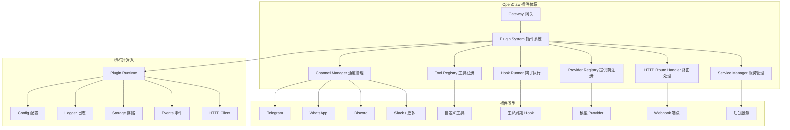
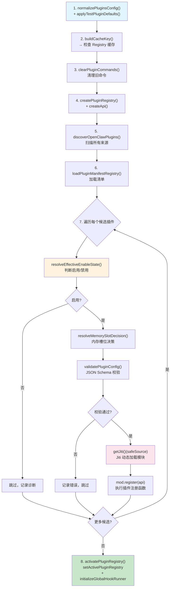
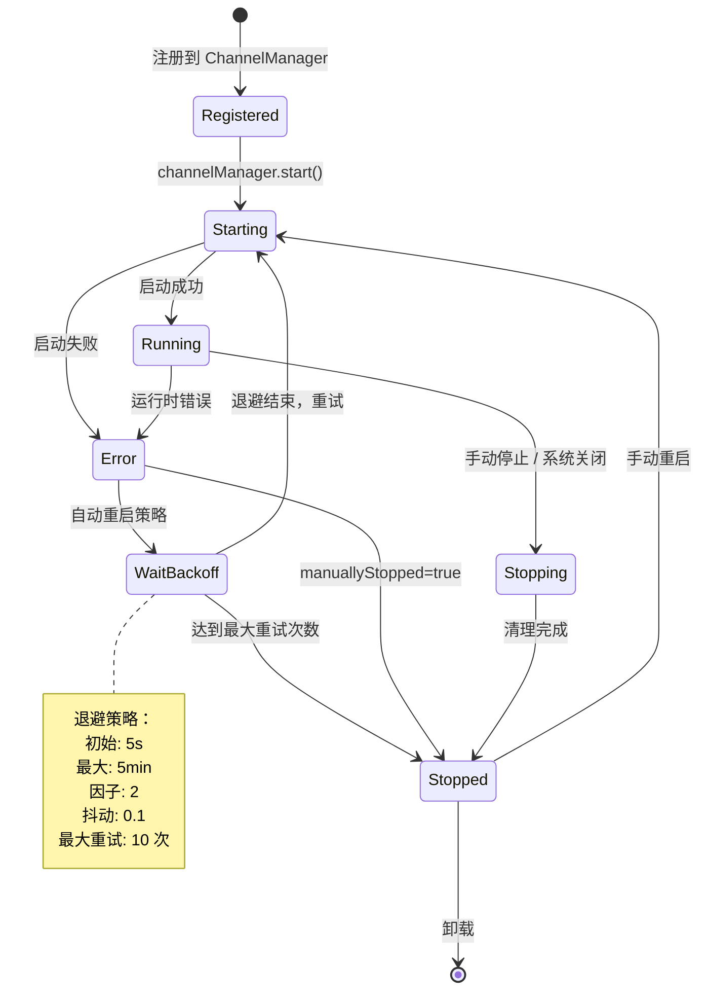

# OpenClaw 插件系统源码深度分析

> 基于源码的全面解析，深入剖析 OpenClaw 插件架构的每一个关键环节

## 目录

- [设计理念](#设计理念)
- [插件发现与安全检查](#插件发现与安全检查)
- [Manifest Registry](#manifest-registry)
- [加载管线](#加载管线-loaderts)
- [Plugin Registry](#plugin-registry-registryts)
- [通道插件](#通道插件)
- [Hook 系统](#hook-系统)
- [插件运行时](#插件运行时)
- [插件 HTTP 路由](#插件-http-路由)
- [插件服务生命周期](#插件服务生命周期)
- [配置与状态](#配置与状态)
- [常见问题](#常见问题)

---

## 设计理念

OpenClaw 的插件系统遵循三大核心原则：

### 模块化可扩展

在 OpenClaw 中，**一切皆插件**——通道（Channel）、工具（Tool）、Hook、Provider、HTTP 路由都以插件形式存在。这种设计使系统具备高度的可组合性，开发者可以按需组装功能模块，而不必修改核心代码。

### 安全优先

插件安全不是事后补救，而是**在发现阶段就前置检查**。系统会在扫描插件候选时立即校验路径安全性，包括路径逃逸检测、世界可写目录检查、文件所有权验证等，将不安全的插件拦截在加载之前。

### 热加载

通过 [Jiti](https://github.com/unjs/jiti) 运行时模块加载器，OpenClaw 可以直接加载 `.ts`、`.js`、`.mts`、`.cts`、`.mjs`、`.cjs` 等多种格式的插件文件，无需预编译步骤，极大提升了开发体验。



| 特性 | 描述 |
|------|------|
| **一切皆插件** | 通道、工具、Hook、Provider、HTTP 路由、CLI、服务均为插件 |
| **安全前置** | 发现阶段即检查路径逃逸、权限、所有权 |
| **热加载** | Jiti 运行时直接加载 .ts/.js，无需预编译 |
| **依赖注入** | 通过 Plugin Runtime 注入 config、logger、storage、services、events |
| **缓存加速** | Discovery 缓存 ~1s TTL，Registry 可缓存 |
| **优先级覆盖** | workspace > managed > bundled > extra，局部覆盖全局 |

---

## 插件发现与安全检查

### 发现来源优先级

插件发现按以下优先级依次扫描，优先级从高到低：

```
config（用户配置目录）> workspace（工作区）> global（全局目录）> bundled/stock（内置插件）
```

### `discoverInDirectory()` 扫描机制

```typescript
const EXTENSION_EXTS = new Set([".ts", ".js", ".mts", ".cts", ".mjs", ".cjs"]);

type PluginOrigin = "config" | "workspace" | "global" | "bundled";

type PluginCandidate = {
  idHint: string;
  source: string;           // 文件路径
  rootDir: string;          // 根目录
  origin: PluginOrigin;     // 来源
  workspaceDir?: string;
  packageName?: string;
  packageVersion?: string;
  packageDescription?: string;
};
```

`discoverInDirectory()` 对每个目录执行以下扫描：

1. **单文件插件** — 匹配 `.ts`/`.js`/`.mts`/`.cts`/`.mjs`/`.cjs` 扩展名的文件直接作为候选
2. **包插件** — 检测目录中的 `package.json`，如果包含 `openclaw.extensions` 字段则识别为插件包

### 安全检查：`isUnsafePluginCandidate()`

在将候选加入列表前，系统会执行严格的安全校验：

| 检查项 | 说明 |
|--------|------|
| **路径逃逸检测** | 检查插件路径是否通过 `..` 等方式逃逸出预期目录 |
| **世界可写目录** | 检测插件是否位于任何用户都可写入的目录（如 `/tmp`） |
| **文件所有权** | 验证插件文件的所有者是否为当前用户或 root |

不通过安全检查的候选会被标记为 `unsafe` 并记录诊断信息，不会进入后续加载流程。

### Discovery 缓存

发现结果内置 **~1 秒 TTL 缓存**，避免在短时间内重复扫描文件系统，提升启动和重载性能。

---

## Manifest Registry

### `manifest-registry.ts` 工作流程

Manifest Registry 负责从每个插件候选中加载和校验元数据清单：

1. **加载清单** — 从插件根目录读取 `openclaw.json` 文件
2. **Schema 校验** — 验证 config schema 的合法性
3. **字段校验** — 检查 `kind`、`channels`、`providers`、`skills` 等声明
4. **生成记录** — 产出 `PluginManifestRecord`

```typescript
type PluginManifestRecord = {
  id: string;                              // 插件唯一标识
  source: string;                          // 插件文件路径
  configSchema?: Record<string, unknown>;  // JSON Schema 配置定义
  kind?: PluginKind;                       // 插件类型 (如 "memory")
  channels?: string[];                     // 声明的通道列表
  providers?: string[];                    // 声明的 Provider 列表
  skills?: string[];                       // 声明的 Skill 列表
};
```

Manifest Registry 的作用是在**实际加载模块代码之前**就建立一份插件能力清单，用于启用状态判断、配置校验和加载优化。

---

## 加载管线 (loader.ts)

加载管线是整个插件系统的核心编排流程，按严格的步骤顺序执行：



### 各步骤详解

#### Step 1: 配置标准化

```typescript
normalizePluginsConfig(config);
applyTestPluginDefaults(config); // 测试环境下的默认值
```

将原始配置转换为统一的内部格式，处理数组/对象/简写等多种配置写法。

#### Step 2: 缓存检查

```typescript
const cacheKey = buildCacheKey(config, workspaceDir);
// 如果缓存命中且未过期，直接返回缓存的 Registry
```

#### Step 3~4: 清理与初始化

清除上一轮注册的命令，创建空白的 `PluginRegistry` 和面向插件的 `Api` 对象。

#### Step 5~6: 发现与清单

执行上文所述的发现扫描和 Manifest 加载。

#### Step 7: 逐个加载

对每个候选执行三道关卡：

| 关卡 | 函数 | 作用 |
|------|------|------|
| 启用判断 | `resolveEffectiveEnableState()` | 综合配置、来源优先级、显式禁用等因素决定是否加载 |
| 内存决策 | `resolveMemorySlotDecision()` | 对 `kind: "memory"` 类型插件进行槽位竞争决策 |
| 配置校验 | `validatePluginConfig()` | 使用 AJV 进行 JSON Schema 校验 |

通过所有关卡后，使用 Jiti 动态加载模块并调用 `mod.register(api)` 完成注册。

#### Step 8: 激活

```typescript
setActivePluginRegistry(registry);
initializeGlobalHookRunner(registry);
```

将 Registry 设置为全局活跃实例，初始化 Hook 执行器，插件系统正式就绪。

---

## Plugin Registry (registry.ts)

### Registry 数据结构

Plugin Registry 是所有已注册插件能力的中央仓库：

```typescript
type PluginRegistry = {
  plugins: PluginRecord[];                    // 插件记录
  tools: PluginToolRegistration[];            // 工具
  hooks: PluginHookRegistration[];            // Hook
  typedHooks: TypedPluginHookRegistration[];  // 类型化 Hook
  channels: PluginChannelRegistration[];      // 通道
  providers: PluginProviderRegistration[];    // Provider
  gatewayHandlers: GatewayRequestHandlers;    // 网关方法
  httpHandlers: PluginHttpRegistration[];     // HTTP 处理器（旧）
  httpRoutes: PluginHttpRouteRegistration[];  // HTTP 路由（新）
  cliRegistrars: PluginCliRegistration[];     // CLI 注册
  services: PluginServiceRegistration[];      // 服务
  commands: PluginCommandRegistration[];      // 命令
  diagnostics: PluginDiagnostic[];            // 诊断信息
};
```

### Plugin API

`createApi(record, config)` 为每个插件创建隔离的注册 API，暴露以下方法：

| API 方法 | 注册能力 |
|----------|----------|
| `registerTool(factory)` | 注册工具工厂函数 |
| `registerHook(hookName, handler, priority?)` | 注册 Hook 处理器 |
| `registerChannel(channelPlugin)` | 注册通道插件 |
| `registerProvider(provider)` | 注册模型 Provider |
| `registerGatewayMethod(name, handler)` | 注册网关方法 |
| `registerHttpRoute(route)` | 注册 HTTP 路由 |
| `registerService(service)` | 注册后台服务 |
| `registerCommand(command)` | 注册 CLI 命令 |
| `registerCli(registrar)` | 注册 CLI 扩展 |

### 重复检测

系统使用 `pluginId + source` 的组合进行重复检测。当检测到相同标识的插件从不同来源注册时，按来源优先级决定保留哪一个，并在诊断信息中记录冲突。

---

## 通道插件

### ChannelPlugin 接口

通道插件是 OpenClaw 最复杂的插件类型，定义了 **22 个适配器接口**，覆盖通信通道的全部能力：

```typescript
type ChannelPlugin<ResolvedAccount = any, Probe = unknown, Audit = unknown> = {
  id: ChannelId;
  meta: ChannelMeta;
  capabilities: ChannelCapabilities;

  // 22 个适配器（均为可选）
  config: ChannelConfigAdapter<ResolvedAccount>;  // 配置
  gateway: ChannelGatewayAdapter;                 // 网关
  outbound: ChannelOutboundAdapter;               // 出站消息
  security: ChannelSecurityAdapter;               // 安全
  groups: ChannelGroupAdapter;                    // 群组
  mentions: ChannelMentionAdapter;                // @提及
  setup: ChannelSetupAdapter;                     // 初始化设置
  pairing: ChannelPairingAdapter;                 // 配对
  auth: ChannelAuthAdapter;                       // 认证
  elevated: ChannelElevatedAdapter;               // 提权
  commands: ChannelCommandAdapter;                // 命令
  streaming: ChannelStreamingAdapter;             // 流式传输
  threading: ChannelThreadingAdapter;             // 线程/回复
  messaging: ChannelMessagingAdapter;             // 消息收发
  agentPrompt: ChannelAgentPromptAdapter;         // Agent 提示词
  directory: ChannelDirectoryAdapter;             // 目录/联系人
  resolver: ChannelResolverAdapter;               // 标识解析
  actions: ChannelMessageActionAdapter;           // 消息操作
  heartbeat: ChannelHeartbeatAdapter;             // 心跳
  status: ChannelStatusAdapter;                   // 状态
  agentTools: ChannelAgentToolFactory;            // Agent 工具
  gatewayMethods: ChannelGatewayMethodAdapter;    // 网关方法
};
```

### 通道生命周期



### 重启策略

通道采用指数退避重启策略：

| 参数 | 值 | 说明 |
|------|-----|------|
| 初始退避 | 5 秒 | 首次重试等待时间 |
| 最大退避 | 5 分钟 | 退避上限 |
| 退避因子 | 2 | 每次失败后退避时间翻倍 |
| 抖动系数 | 0.1 | 防止多通道同时重试（10% 随机偏移） |
| 最大重试 | MAX_RESTART_ATTEMPTS = 10 | 超过后停止自动重启 |

关键机制：当通道被用户**手动停止**时，`manuallyStopped` 标志为 `true`，此时即使发生错误也**不会触发自动重启**，避免与用户意图冲突。

---

## Hook 系统

### Hook 事件类型

Hook 覆盖了 OpenClaw 的全部生命周期阶段：

| 分类 | 事件 | 说明 |
|------|------|------|
| **网关** | `gateway:start` / `gateway:stop` | 网关启停 |
| **会话** | `session:start` / `session:end` | 会话生命周期 |
| **消息** | `message:received` / `message:sending` / `message:sent` | 消息收发链路 |
| **Agent** | `agent:start` / `agent:end` / `agent:compaction` | Agent 生命周期 |
| **工具** | `tool:before` / `tool:after` | 工具调用前后 |

### 两种执行模式

| 模式 | 执行方式 | 适用场景 |
|------|----------|----------|
| **Void Hook** | 并行执行（`Promise.all`） | 日志记录、通知、统计等无需修改数据的场景 |
| **Modifying Hook** | 串行执行 + 结果合并 | 消息变换、权限检查等需要修改或拦截数据的场景 |

```typescript
// Void Hook — 并行执行，互不影响
async function runVoidHook(hookName, event, ctx) {
  const hooks = getHooksForName(hookName);
  await Promise.all(hooks.map(h => h.handler(event, ctx).catch(err => {
    logger.error(`Hook ${hookName} from ${h.pluginId} failed: ${err}`);
  })));
}

// Modifying Hook — 串行执行，前一个的结果传给下一个
async function runModifyingHook(hookName, event, ctx, mergeResults?) {
  const hooks = getHooksForName(hookName);
  let result = undefined;
  for (const hook of hooks) {
    const hookResult = await hook.handler(event, ctx);
    if (hookResult !== undefined) {
      result = result !== undefined && mergeResults
        ? mergeResults(result, hookResult)
        : hookResult;
    }
  }
  return result;
}
```

### 优先级与覆盖

**优先级排序规则**：`priority` 值越高越先执行，相同优先级按注册顺序。

**来源覆盖规则**（低到高）：

```
extra（外部附加） < bundled（内置） < managed（托管） < workspace（工作区）
```

workspace 来源的 Hook 优先级最高，可以覆盖内置行为。

### 事件分发：`triggerInternalHook(event)`

Hook 执行器支持两级事件匹配：

1. **精确匹配** — `event.type` (如 `message:received`)
2. **动作匹配** — `event.type:action` (如 `message:received:transform`)

这允许插件既可以监听某类事件的全部触发，也可以精确监听特定动作。

---

## 插件运行时

### 依赖注入

每个插件在注册时获得一个隔离的 Runtime 实例，包含以下注入服务：

```typescript
type PluginRuntime = {
  config: PluginConfigAccess;   // 配置读写
  logger: PluginLogger;         // 日志（debug/info/warn/error）
  storage: PluginStorage;       // KV 存储
  services: ServiceRegistry;    // 服务注册与获取
  events: EventEmitter;         // 事件总线
  tools: ToolRegistry;          // 工具注册表
  http: HttpClient;             // HTTP 客户端
};
```

### 网关请求作用域

通过 `AsyncLocalStorage` 实现请求级别的上下文传递：

```typescript
// 为 WebSocket 连接创建请求作用域
withPluginRuntimeGatewayRequestScope(requestContext, async () => {
  // 在此闭包内，所有插件代码都能访问当前请求上下文
  await processMessage(message);
});
```

### 非 WebSocket 路径的上下文

对于不走 WebSocket 的路径（如 Telegram Webhook、HTTP API 回调等），系统提供 `setFallbackGatewayContext()` 方法：

```typescript
setFallbackGatewayContext({
  channelId: "telegram",
  accountId: webhookAccountId,
  // ...
});
```

这确保了即使在 Webhook 回调等非标准路径下，插件也能正确访问网关上下文。

---

## 插件 HTTP 路由

### 路由匹配

HTTP 请求进入网关后的处理流程：

1. `createGatewayPluginRequestHandler` 创建统一的请求处理器
2. 请求到达时调用 `findMatchingPluginHttpRoutes` 匹配已注册路由
3. 根据路由的认证模式执行鉴权
4. 分发给对应插件的处理函数

### 认证模式

| 模式 | 值 | 说明 |
|------|-----|------|
| **网关认证** | `"gateway"` | 要求请求通过网关层面的认证（API Key / Token），适用于内部 API |
| **插件自管** | `"plugin"` | 由插件自行管理认证逻辑，适用于第三方 Webhook 回调等场景 |

```typescript
type PluginHttpRoute = {
  method: "GET" | "POST" | "PUT" | "DELETE" | "PATCH";
  path: string;
  auth: "gateway" | "plugin";  // 认证模式
  handler: (req: Request, res: Response) => Promise<void>;
};
```

---

## 插件服务生命周期

插件可以注册长生命周期的后台服务（如定时任务、连接池管理等），系统保证服务的有序启停：

### 启动顺序

按**注册顺序正序**启动，确保先注册的基础服务先就绪：

```typescript
for (const service of registry.services) {
  await service.start(serviceContext);
}
```

### 停止顺序

按**注册顺序逆序**停止，确保依赖于基础服务的上层服务先关闭：

```typescript
for (const service of [...registry.services].reverse()) {
  await service.stop();
}
```

这种正序启动、逆序停止的模式是经典的栈式生命周期管理，避免了服务关闭时的依赖残留问题。

---

## 配置与状态

### 配置标准化

`normalizePluginsConfig()` 将多种配置格式统一为内部表示：

```typescript
function normalizePluginsConfig(config) {
  return {
    enabled: config.plugins?.enabled ?? true,
    plugins: normalizePluginList(config.plugins?.plugins),
    hooks: normalizeHookList(config.plugins?.hooks),
  };
}
```

### JSON Schema 校验

使用 AJV 对插件配置进行严格校验：

```typescript
function validateJsonSchemaValue(params: {
  schema: Record<string, unknown>;
  cacheKey?: string;
  value?: unknown;
}): { ok: boolean; errors?: string[] } {
  const ajv = new Ajv({ allErrors: true });
  const validate = ajv.compile(params.schema);
  const valid = validate(params.value);
  
  if (valid) return { ok: true };
  
  const errors = validate.errors?.map(err => {
    const path = err.instancePath || "root";
    return `${path}: ${err.message}`;
  }) ?? ["Unknown error"];
  
  return { ok: false, errors };
}
```

### 插件记录（PluginRecord）

每个成功注册的插件都会生成一份完整的能力清单：

```typescript
type PluginRecord = {
  id: string;
  name: string;
  version?: string;
  description?: string;
  kind?: PluginKind;
  source: string;
  origin: PluginOrigin;
  workspaceDir?: string;
  
  enabled: boolean;
  status: "loaded" | "disabled" | "error";
  error?: string;
  
  // 完整能力清单
  toolNames: string[];
  hookNames: string[];
  channelIds: string[];
  providerIds: string[];
  gatewayMethods: string[];
  cliCommands: string[];
  services: string[];
  commands: string[];
  httpHandlers: number;
  hookCount: number;
  
  configSchema: boolean;
  configUiHints?: Record<string, PluginConfigUiHint>;
  configJsonSchema?: Record<string, unknown>;
};
```

---

## 常见问题

### Q1: 插件加载失败，如何排查？

**排查步骤**：

1. 检查 `diagnostics` 诊断信息 — 加载管线会将每一步的错误记录到 `registry.diagnostics`
2. 确认插件文件路径和扩展名是否在支持列表中（`.ts`/`.js`/`.mts`/`.cts`/`.mjs`/`.cjs`）
3. 检查安全校验 — 通过日志搜索 `unsafe` 关键字，确认是否被安全检查拦截
4. 验证 `openclaw.json` 清单文件格式是否正确
5. 检查配置 Schema 校验错误 — AJV 会返回详细的字段级错误信息

```bash
openclaw plugins list          # 查看插件状态
openclaw logs | grep plugin    # 搜索插件相关日志
```

### Q2: 如何控制插件的启用/禁用？

插件启用状态由 `resolveEffectiveEnableState()` 综合决定，优先级如下：

1. **用户配置中的显式设置**（最高优先级）
2. **来源优先级**（workspace > global > bundled）
3. **默认值**（未配置时默认启用）

```json
{
  "plugins": {
    "plugins": [
      { "id": "my-plugin", "enabled": false }
    ]
  }
}
```

### Q3: 多个 Hook 的执行顺序是怎样的？

- **Void Hook**：所有处理器并行执行，互不阻塞，单个失败不影响其他
- **Modifying Hook**：按 `priority` 降序串行执行，前一个结果传给下一个
- **来源覆盖**：workspace 的 Hook 覆盖 bundled 的同名 Hook

### Q4: 通道崩溃后的重启行为？

系统自动执行指数退避重启（5s → 10s → 20s → ... → 5min），最多 10 次。如果是用户手动停止的通道（`manuallyStopped=true`），则不会自动重启。

### Q5: 如何注册自定义 HTTP 端点？

```typescript
export function register(api) {
  api.registerHttpRoute({
    method: "POST",
    path: "/my-plugin/webhook",
    auth: "plugin",  // 插件自行管理认证
    handler: async (req, res) => {
      const body = await req.json();
      // 处理 webhook 回调
      res.json({ ok: true });
    },
  });
}
```

### Q6: Webhook 等非 WebSocket 路径如何获取网关上下文？

使用 `setFallbackGatewayContext()` 为当前请求设置上下文，确保插件代码能正常访问 channel、account 等信息。这对 Telegram Webhook、Slack Events API 等场景特别重要。

### Q7: 插件服务的启停顺序有保证吗？

有保证。启动按注册顺序正序执行，停止按注册顺序逆序执行，遵循栈式生命周期模型。基础服务先启动后停止，上层服务后启动先停止。

---

*基于 OpenClaw v2026.2.3-1 源码分析*
