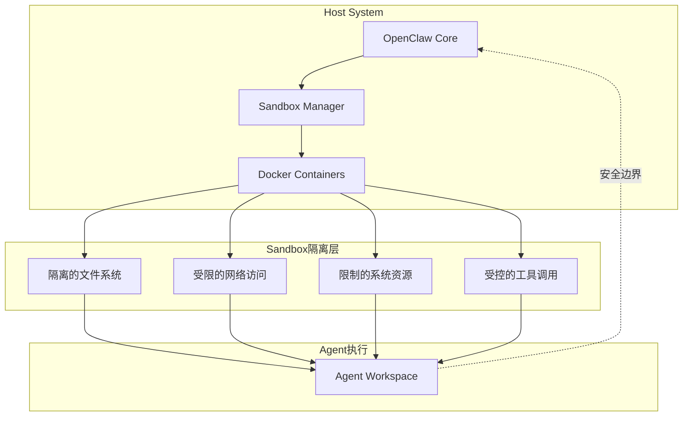
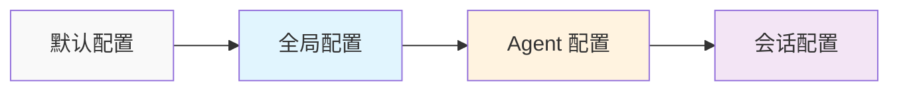
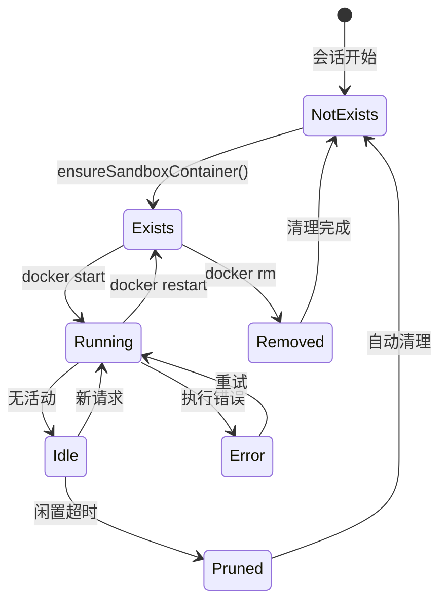
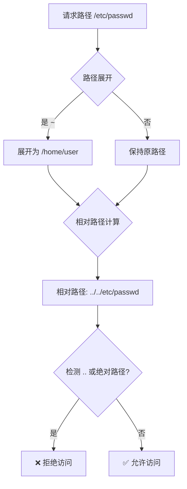
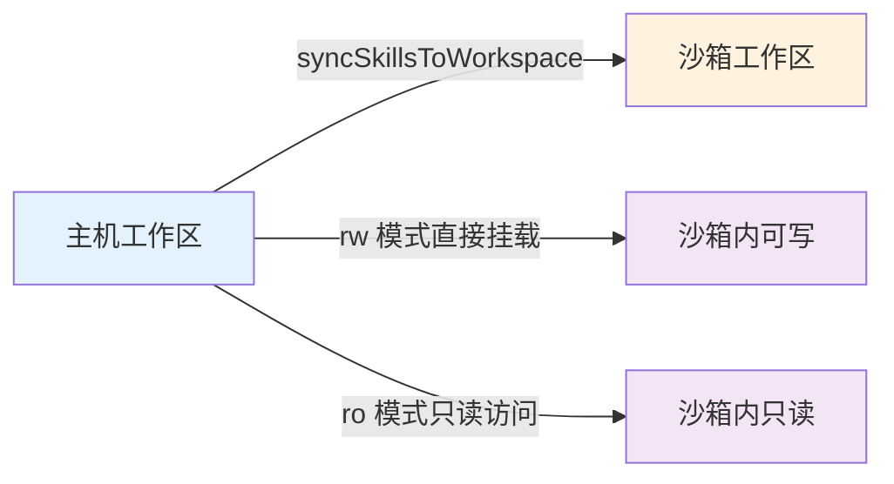

# OpenClaw Sandbox 机制源码深度分析

> 基于源码的全面解析，帮助你深入理解 OpenClaw 的沙箱安全架构

## 目录

- [概述](#概述)
- [架构设计](#架构设计)
- [核心概念](#核心概念)
  - [沙箱模式](#沙箱模式)
  - [作用域类型](#作用域类型)
  - [工作区访问控制](#工作区访问控制)
- [配置系统](#配置系统)
  - [Docker 配置](#docker-配置)
  - [浏览器配置](#浏览器配置)
  - [工具策略](#工具策略)
  - [清理策略](#清理策略)
- [核心组件](#核心组件)
  - [路径安全](#路径安全)
  - [容器管理](#容器管理)
  - [工具调用](#工具调用)
  - [媒体处理](#媒体处理)
- [工作流程](#工作流程)
  - [上下文解析](#上下文解析)
  - [容器创建](#容器创建)
  - [会话管理](#会话管理)
- [安全机制](#安全机制)
  - [路径穿越防护](#路径穿越防护)
  - [符号链接检测](#符号链接检测)
  - [工具白名单](#工具白名单)
  - [只读根文件系统](#只读根文件系统)
- [配置示例](#配置示例)
  - [全局配置](#全局配置)
  - [Agent 级别配置](#agent-级别配置)
- [CLI 操作](#cli-操作)
- [源码关键代码解读](#源码关键代码解读)
- [常见问题](#常见问题)

---

## 概述

OpenClaw 的 **Sandbox 机制**是一个基于 Docker 的安全隔离系统，为 AI Agent 提供受控的执行环境。

### 核心目标



### 主要特性

| 特性 | 描述 |
|------|------|
| **Docker 隔离** | 使用 Docker 容器提供完整隔离 |
| **多级配置** | 全局配置 / Agent 配置 / 会话配置 |
| **工具策略** | 白名单/黑名单控制可用工具 |
| **工作区控制** | 只读/读写工作区访问 |
| **浏览器支持** | 集成浏览器沙箱（ CDP + VNC） |
| **自动清理** | 闲置/过期容器自动删除 |

---

## 架构设计

### 模块结构

```
src/agents/sandbox/
├── types.ts              # 类型定义
├── constants.ts          # 常量定义
├── config.ts            # 配置解析
├── context.ts           # 上下文解析
├── docker.ts            # Docker 操作
├── workspace.ts         # 工作区管理
├── browser.ts           # 浏览器沙箱
├── prune.ts             # 清理逻辑
├── paths.ts             # 路径安全
├── tool-policy.ts       # 工具策略
├── manage.ts            # 容器管理
├── runtime-status.ts    # 运行时状态
├── registry.ts          # 注册表
├── config-hash.ts       # 配置哈希
└── shared.ts            # 共享工具
```

### 配置层次



---

## 核心概念

### 沙箱模式

```typescript
// types.ts

export type SandboxConfig = {
  mode: "off" | "non-main" | "all";  // 沙箱模式
  scope: SandboxScope;                // 作用域类型
  workspaceAccess: SandboxWorkspaceAccess;  // 工作区访问
  // ... 其他配置
};

// 模式说明
type SandboxMode =
  | "off"      // 不使用沙箱
  | "non-main" // 除 main 会话外都使用沙箱
  | "all";     // 所有会话都使用沙箱
```

| 模式 | 说明 |
|------|------|
| `off` | 不使用沙箱，直接在主机执行 |
| `non-main` | 仅主会话（main）在主机执行，其他会话使用沙箱 |
| `all` | 所有会话都使用沙箱隔离 |

### 作用域类型

```typescript
// types.ts

export type SandboxScope = "session" | "agent" | "shared";

// 作用域示意
// ┌─────────────────────────────────────────────────┐
// │ shared: 所有会话共享一个沙箱容器                  │
// │ agent:  每个 Agent 一个沙箱容器                  │
// │ session: 每个会话一个独立的沙箱容器               │
// └─────────────────────────────────────────────────┘
```

| 作用域 | 说明 | 容器命名示例 |
|--------|------|-------------|
| `shared` | 全局共享一个容器 | `openclaw-sbx-shared` |
| `agent` | 每个 Agent 一个容器 | `openclaw-sbx-agent-{agentId}` |
| `session` | 每个会话一个容器 | `openclaw-sbx-{sessionKey}` |

### 工作区访问控制

```typescript
// types.ts

export type SandboxWorkspaceAccess = "none" | "ro" | "rw";

// 访问模式
// ┌──────────────────────────────────────────────────────┐
// │ none: 不访问工作区，仅使用沙箱内置工作区              │
// │ ro:   只读访问主机工作区                             │
// │ rw:   读写访问主机工作区（危险！）                    │
// └──────────────────────────────────────────────────────┘
```

---

## 配置系统

### Docker 配置

```typescript
// types.docker.ts

export type SandboxDockerConfig = {
  image: string;              // Docker 镜像
  containerPrefix: string;   // 容器名前缀
  workdir: string;           // 工作目录
  readOnlyRoot: boolean;     // 只读根文件系统
  tmpfs: string[];           // tmpfs 挂载
  network: string;           // 网络模式
  user?: string;             // 运行用户
  capDrop: string[];         // 移除的能力
  env: Record<string, string>;  // 环境变量
  memory?: string;           // 内存限制
  memorySwap?: string;       // Swap 限制
  cpus?: number;             // CPU 限制
  pidsLimit?: number;        // 进程数限制
  seccompProfile?: string;   // Seccomp 配置文件
  apparmorProfile?: string;  // AppArmor 配置文件
  dns?: string[];            // DNS 服务器
  extraHosts?: string[];     // 额外 hosts
  binds?: string[];          // 卷挂载
};
```

**默认 Docker 配置：**

```typescript
// constants.ts

DEFAULT_SANDBOX_IMAGE = "openclaw-sandbox:bookworm-slim";
DEFAULT_SANDBOX_CONTAINER_PREFIX = "openclaw-sbx-";
DEFAULT_SANDBOX_WORKDIR = "/workspace";
DEFAULT_SANDBOX_READ_ONLY_ROOT = true;      // 只读根文件系统
DEFAULT_SANDBOX_TMPFS = ["/tmp", "/var/tmp", "/run"];
DEFAULT_SANDBOX_NETWORK = "none";            // 禁用网络
DEFAULT_SANDBOX_CAP_DROP = ["ALL"];         // 移除所有能力
DEFAULT_SANDBOX_ENV = { LANG: "C.UTF-8" };
```

### 浏览器配置

```typescript
// types.ts

export type SandboxBrowserConfig = {
  enabled: boolean;              // 是否启用
  image: string;                 // 浏览器镜像
  containerPrefix: string;        // 容器名前缀
  cdpPort: number;               // CDP 端口
  vncPort: number;               // VNC 端口
  noVncPort: number;             // noVNC 端口
  headless: boolean;             // 是否无头模式
  enableNoVnc: boolean;         // 是否启用 noVNC
  allowHostControl: boolean;    // 是否允许主机控制
  autoStart: boolean;           // 是否自动启动
  autoStartTimeoutMs: number;   // 自动启动超时
};
```

### 工具策略

```typescript
// types.ts

export type SandboxToolPolicy = {
  allow?: string[];  // 工具白名单
  deny?: string[];    // 工具黑名单
};

// 默认允许的工具
DEFAULT_TOOL_ALLOW = [
  "exec",
  "process",
  "read",
  "write",
  "edit",
  "apply_patch",
  "image",
  "sessions_list",
  "sessions_history",
  "sessions_send",
  "sessions_spawn",
  "session_status",
];

// 默认拒绝的工具
DEFAULT_TOOL_DENY = [
  "browser",
  "canvas",
  "nodes",
  "cron",
  "gateway",
  ...CHANNEL_IDS,  // 所有通道工具
];
```

### 清理策略

```typescript
// types.ts

export type SandboxPruneConfig = {
  idleHours: number;   // 闲置时间（小时）
  maxAgeDays: number; // 最大保留天数
};

// 默认值
DEFAULT_SANDBOX_IDLE_HOURS = 24;   // 24小时无活动清理
DEFAULT_SANDBOX_MAX_AGE_DAYS = 7;   // 最多保留7天
```

---

## 核心组件

### 路径安全

```typescript
// paths.ts

export function resolveSandboxPath(params: {
  filePath: string;
  cwd: string;
  root: string;
}): { resolved: string; relative: string } {
  // 1. 展开路径（处理 ~ 和相对路径）
  const resolved = resolveToCwd(params.filePath, params.cwd);
  
  // 2. 计算相对路径
  const rootResolved = path.resolve(params.root);
  const relative = path.relative(rootResolved, resolved);
  
  // 3. 路径穿越检测
  if (!relative || relative === "") {
    return { resolved, relative: "" };
  }
  if (relative.startsWith("..") || path.isAbsolute(relative)) {
    throw new Error(
      `Path escapes sandbox root (${shortPath(rootResolved)}): ${params.filePath}`
    );
  }
  
  return { resolved, relative };
}
```

### 符号链接检测

```typescript
// paths.ts

async function assertNoSymlink(relative: string, root: string) {
  if (!relative) return;
  
  const parts = relative.split(path.sep).filter(Boolean);
  let current = root;
  
  for (const part of parts) {
    current = path.join(current, part);
    try {
      const stat = await fs.lstat(current);
      if (stat.isSymbolicLink()) {
        throw new Error(`Symlink not allowed in sandbox path: ${current}`);
      }
    } catch {
      // 文件不存在，跳过
    }
  }
}
```

### 媒体处理

```typescript
// paths.ts

export async function resolveSandboxedMediaSource(params: {
  media: string;
  sandboxRoot: string;
}): Promise<string> {
  const raw = params.media.trim();
  
  // HTTP URL 直接通过
  if (HTTP_URL_RE.test(raw)) {
    return raw;
  }
  
  // 跳过 data: URL
  if (DATA_URL_RE.test(raw)) {
    throw new Error("data: URLs are not supported for media. Use buffer instead.");
  }
  
  // 处理 file:// URL
  if (/^file:\/\//i.test(raw)) {
    candidate = fileURLToPath(raw);
  }
  
  // 验证沙箱路径
  const resolved = await assertSandboxPath({
    filePath: candidate,
    cwd: params.sandboxRoot,
    root: params.sandboxRoot,
  });
  
  return resolved.resolved;
}
```

---

## 工作流程

### 上下文解析

```typescript
// context.ts

export async function resolveSandboxContext(params: {
  config?: OpenClawConfig;
  sessionKey?: string;
  workspaceDir?: string;
}): Promise<SandboxContext | null> {
  // 1. 检查会话密钥
  const rawSessionKey = params.sessionKey?.trim();
  if (!rawSessionKey) {
    return null;
  }
  
  // 2. 检查沙箱运行时状态
  const runtime = resolveSandboxRuntimeStatus({
    cfg: params.config,
    sessionKey: rawSessionKey,
  });
  if (!runtime.sandboxed) {
    return null;  // 不需要沙箱
  }
  
  // 3. 解析沙箱配置
  const cfg = resolveSandboxConfigForAgent(params.config, runtime.agentId);
  
  // 4. 确定工作区路径
  const workspaceRoot = resolveUserPath(cfg.workspaceRoot);
  const scopeKey = resolveSandboxScopeKey(cfg.scope, rawSessionKey);
  const sandboxWorkspaceDir = resolveSandboxWorkspaceDir(workspaceRoot, scopeKey);
  
  // 5. 确保工作区存在
  await ensureSandboxWorkspace(sandboxWorkspaceDir, agentWorkspaceDir);
  
  // 6. 同步 skills
  if (cfg.workspaceAccess !== "rw") {
    await syncSkillsToWorkspace({
      sourceWorkspaceDir: agentWorkspaceDir,
      targetWorkspaceDir: sandboxWorkspaceDir,
    });
  }
  
  // 7. 确保容器存在
  const containerName = await ensureSandboxContainer({
    sessionKey: rawSessionKey,
    workspaceDir: sandboxWorkspaceDir,
    cfg,
  });
  
  // 8. 确保浏览器存在（如需要）
  const browser = await ensureSandboxBrowser({
    scopeKey,
    workspaceDir: sandboxWorkspaceDir,
    cfg,
  });
  
  return {
    enabled: true,
    sessionKey: rawSessionKey,
    workspaceDir: sandboxWorkspaceDir,
    agentWorkspaceDir,
    containerName,
    docker: cfg.docker,
    tools: cfg.tools,
    browser: browser,
  };
}
```

### 容器创建

```typescript
// docker.ts

export function buildSandboxCreateArgs(params: {
  name: string;
  cfg: SandboxDockerConfig;
  scopeKey: string;
  createdAtMs?: number;
  labels?: Record<string, string>;
}) {
  const args = ["create", "--name", params.name];
  
  // 添加标签
  args.push("--label", "openclaw.sandbox=1");
  args.push("--label", `openclaw.sessionKey=${params.scopeKey}`);
  args.push("--label", `openclaw.createdAtMs=${params.createdAtMs}`);
  
  // 只读根文件系统
  if (params.cfg.readOnlyRoot) {
    args.push("--read-only");
  }
  
  // tmpfs 挂载
  for (const entry of params.cfg.tmpfs) {
    args.push("--tmpfs", entry);
  }
  
  // 网络隔离
  args.push("--network", params.cfg.network);
  
  // 能力限制
  for (const cap of params.cfg.capDrop) {
    args.push("--cap-drop", cap);
  }
  
  // 环境变量
  for (const [key, value] of Object.entries(params.cfg.env)) {
    args.push("--env", `${key}=${value}`);
  }
  
  // 资源限制
  if (params.cfg.memory) {
    args.push("--memory", params.cfg.memory);
  }
  if (params.cfg.cpus) {
    args.push("--cpus", String(params.cfg.cpus));
  }
  
  return args;
}
```

### 容器生命周期



---

## 安全机制

### 路径穿越防护



### 工具白名单机制

```typescript
// tool-policy.ts

export function isToolAllowed(policy: SandboxToolPolicy, name: string): boolean {
  const normalized = name.trim().toLowerCase();
  
  // 1. 检查黑名单
  const deny = compilePatterns(policy.deny);
  if (matchesAny(normalized, deny)) {
    return false;
  }
  
  // 2. 检查白名单
  const allow = compilePatterns(policy.allow);
  if (allow.length === 0) {
    return true;  // 无白名单则全部允许
  }
  
  return matchesAny(normalized, allow);
}

// 模式匹配
function compilePattern(pattern: string): CompiledPattern {
  const normalized = pattern.trim().toLowerCase();
  
  if (!normalized) {
    return { kind: "exact", value: "" };
  }
  if (normalized === "*") {
    return { kind: "all" };  // 通配符
  }
  if (!normalized.includes("*")) {
    return { kind: "exact", value: normalized };  // 精确匹配
  }
  return {
    kind: "regex",
    value: new RegExp(`^${escaped.replaceAll("\\*", ".*")}$`),
  };
}
```

### Docker 安全加固

```yaml
# 默认安全配置
security:
  # 只读根文件系统
  readOnlyRoot: true
  
  # 网络隔离
  network: none
  
  # 能力限制
  capDrop:
    - ALL
  
  # 进程限制
  pidsLimit: 100
  
  # 内存限制（可配置）
  memory: 2g
  
  # 用户权限
  user: "1000:1000"
```

---

## 配置示例

### 全局配置

```typescript
// openclaw.config.ts
export default {
  sandbox: {
    mode: "non-main",           // 非主会话使用沙箱
    scope: "session",           // 每个会话独立容器
    workspaceAccess: "ro",      // 只读访问工作区
    workspaceRoot: "~/.openclaw/sandboxes",
    
    docker: {
      image: "openclaw-sandbox:bookworm-slim",
      memory: "2g",
      cpus: 2,
      env: {
        LANG: "C.UTF-8",
        NODE_ENV: "production",
      },
      binds: [
        "/data/shared:/shared:ro",
      ],
    },
    
    browser: {
      enabled: true,
      headless: true,
      autoStart: false,
    },
    
    tools: {
      allow: ["exec", "read", "write"],
      deny: ["gateway", "cron"],
    },
    
    prune: {
      idleHours: 12,
      maxAgeDays: 3,
    },
  },
};
```

### Agent 级别配置

```typescript
// openclaw.config.ts
export default {
  agents: {
    list: [
      {
        id: "coding-agent",
        sandbox: {
          mode: "all",           // 所有会话都使用沙箱
          scope: "agent",       // 每个 Agent 独立容器
          workspaceAccess: "rw", // 读写访问工作区（危险！）
          
          docker: {
            image: "custom-sandbox:latest",
            memory: "4g",
            cpus: 4,
          },
          
          tools: {
            allow: ["*"],       // 允许所有工具
            deny: ["gateway"],
          },
        },
      },
    ],
  },
};
```

### 禁用沙箱

```typescript
// 对特定 Agent 禁用沙箱
{
  agents: {
    list: [
      {
        id: "trusted-agent",
        sandbox: {
          mode: "off",  // 禁用沙箱
        },
      },
    ],
  },
}
```

---

## CLI 操作

```bash
# 列出所有沙箱容器
openclaw sandbox list

# 查看沙箱状态
openclaw sandbox status

# 清理闲置沙箱
openclaw sandbox prune

# 强制清理所有沙箱
openclaw sandbox prune --force

# 查看沙箱日志
openclaw sandbox logs <container-name>

# 删除特定沙箱
openclaw sandbox rm <container-name>

# 健康检查
openclaw doctor --sandbox
```

---

## 源码关键代码解读

### 1. 配置解析优先级

```typescript
// config.ts

export function resolveSandboxDockerConfig(params: {
  scope: SandboxScope;
  globalDocker?: Partial<SandboxDockerConfig>;
  agentDocker?: Partial<SandboxDockerConfig>;
}): SandboxDockerConfig {
  // Agent 配置优先于全局配置
  const agentDocker = params.scope === "shared" ? undefined : params.agentDocker;
  const globalDocker = params.globalDocker;
  
  // 合并环境变量（Agent 覆盖全局）
  const env = agentDocker?.env
    ? { ...(globalDocker?.env ?? { LANG: "C.UTF-8" }), ...agentDocker.env }
    : (globalDocker?.env ?? { LANG: "C.UTF-8" });
  
  // 合并 ulimits
  const ulimits = agentDocker?.ulimits
    ? { ...globalDocker?.ulimits, ...agentDocker.ulimits }
    : globalDocker?.ulimits;
  
  return {
    image: agentDocker?.image ?? globalDocker?.image ?? DEFAULT_SANDBOX_IMAGE,
    // ...
  };
}
```

### 2. 工具策略解析

```typescript
// tool-policy.ts

export function resolveSandboxToolPolicyForAgent(
  cfg?: OpenClawConfig,
  agentId?: string,
): SandboxToolPolicyResolved {
  // 解析 Agent 配置
  const agentConfig = cfg && agentId ? resolveAgentConfig(cfg, agentId) : undefined;
  const agentAllow = agentConfig?.tools?.sandbox?.tools?.allow;
  const agentDeny = agentConfig?.tools?.sandbox?.tools?.deny;
  
  // 解析全局配置
  const globalAllow = cfg?.tools?.sandbox?.tools?.allow;
  const globalDeny = cfg?.tools?.sandbox?.tools?.deny;
  
  // 优先级：Agent 配置 > 全局配置 > 默认配置
  const deny = Array.isArray(agentDeny)
    ? agentDeny
    : Array.isArray(globalDeny)
      ? globalDeny
      : [...DEFAULT_TOOL_DENY];
  
  const allow = Array.isArray(agentAllow)
    ? agentAllow
    : Array.isArray(globalAllow)
      ? globalAllow
      : [...DEFAULT_TOOL_ALLOW];
  
  // 展开工具组
  const expandedDeny = expandToolGroups(deny);
  const expandedAllow = expandToolGroups(allow);
  
  // image 工具特殊处理
  if (!expandedDeny.map(v => v.toLowerCase()).includes("image")) {
    expandedAllow.push("image");
  }
  
  return {
    allow: expandedAllow,
    deny: expandedDeny,
  };
}
```

### 3. 容器注册表

```typescript
// registry.ts

type SandboxContainerInfo = {
  sessionKey: string;
  containerName: string;
  workspaceDir: string;
  createdAtMs: number;
  lastUsedAtMs: number;
  configHash: string;
  state: "running" | "exited" | "unknown";
};

// 读取注册表
export async function readRegistry(): Promise<SandboxRegistry> {
  const path = SANDBOX_REGISTRY_PATH;
  if (!await fs.exists(path)) {
    return { version: 1, containers: {} };
  }
  const data = await fs.readFile(path, "utf-8");
  return JSON.parse(data);
}

// 更新注册表
export async function updateRegistry(
  registry: SandboxRegistry,
): Promise<void> {
  await fs.mkdir(path.dirname(SANDBOX_REGISTRY_PATH), { recursive: true });
  await fs.writeFile(
    SANDBOX_REGISTRY_PATH,
    JSON.stringify(registry, null, 2),
  );
}
```

---

## 常见问题

### Q1: 沙箱启动失败怎么办？

```bash
# 1. 检查 Docker 是否运行
docker ps

# 2. 检查镜像是否存在
docker images | grep openclaw

# 3. 查看详细错误
openclaw doctor --sandbox

# 4. 手动拉取镜像
docker pull debian:bookworm-slim
docker tag debian:bookworm-slim openclaw-sandbox:bookworm-slim
```

### Q2: 如何调试沙箱内的问题？

```typescript
// 开启调试日志
runtime.logger.debug("Sandbox context:", sandboxContext);
runtime.logger.debug("Container logs:", await getContainerLogs(containerName));
```

### Q3: 沙箱内无法访问网络？

```yaml
# 默认禁用网络，如需启用：
sandbox:
  docker:
    network: "bridge"  # 或 "host"
    dns: ["8.8.8.8", "114.114.114.114"]
```

### Q4: 如何让特定工具在沙箱外执行？

```yaml
agents:
  list:
    - id: "my-agent"
      sandbox:
        mode: "all"
        tools:
          allow: ["exec", "read", "write"]
          deny: ["local_exec"]  # 被拒绝的工具在沙箱外执行
```

### Q5: 工作区文件同步如何工作？



### Q6: 沙箱清理策略如何工作？

```typescript
// prune.ts

export async function maybePruneSandboxes(cfg: SandboxConfig) {
  const registry = await readRegistry();
  const now = Date.now();
  
  for (const [id, container] of Object.entries(registry.containers)) {
    // 1. 检查是否过期
    const ageDays = (now - container.createdAtMs) / (1000 * 60 * 60 * 24);
    if (ageDays > cfg.prune.maxAgeDays) {
      await removeSandboxContainer(container.containerName);
      delete registry.containers[id];
      continue;
    }
    
    // 2. 检查是否闲置
    const idleHours = (now - container.lastUsedAtMs) / (1000 * 60 * 60);
    if (idleHours > cfg.prune.idleHours) {
      await removeSandboxContainer(container.containerName);
      delete registry.containers[id];
      continue;
    }
  }
  
  await updateRegistry(registry);
}
```

### Q7: 如何配置自定义 Docker 镜像？

```yaml
sandbox:
  docker:
    image: "my-custom-sandbox:v1.0"
    # 可选：自定义启动命令
    setupCommand: |
      apt-get update && apt-get install -y curl jq
```

---

## 总结

OpenClaw Sandbox 核心要点：

### 安全设计原则

1. **最小权限** - 默认禁用所有危险操作
2. **隔离优先** - Docker 容器提供完整隔离
3. **可配置** - 支持多级配置和细粒度控制
4. **可观测** - 完整的日志和状态监控

### 最佳实践

```yaml
# 推荐配置
sandbox:
  mode: "non-main"           # 非敏感会话使用沙箱
  scope: "session"           # 隔离会话
  workspaceAccess: "ro"      # 只读访问
  docker:
    network: "none"          # 禁用网络（除非必要）
    capDrop: ["ALL"]         # 移除所有能力
    readOnlyRoot: true       # 只读根文件系统
  tools:
    allow: ["exec", "read", "write"]
    deny: ["gateway", "cron", "nodes"]
```

掌握这些概念，就能安全地使用 OpenClaw 的沙箱功能！
