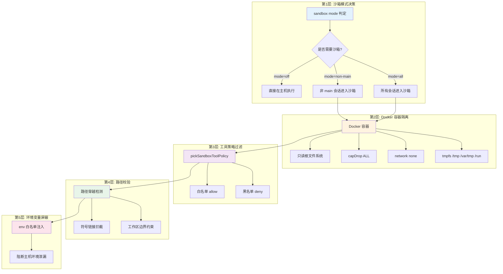
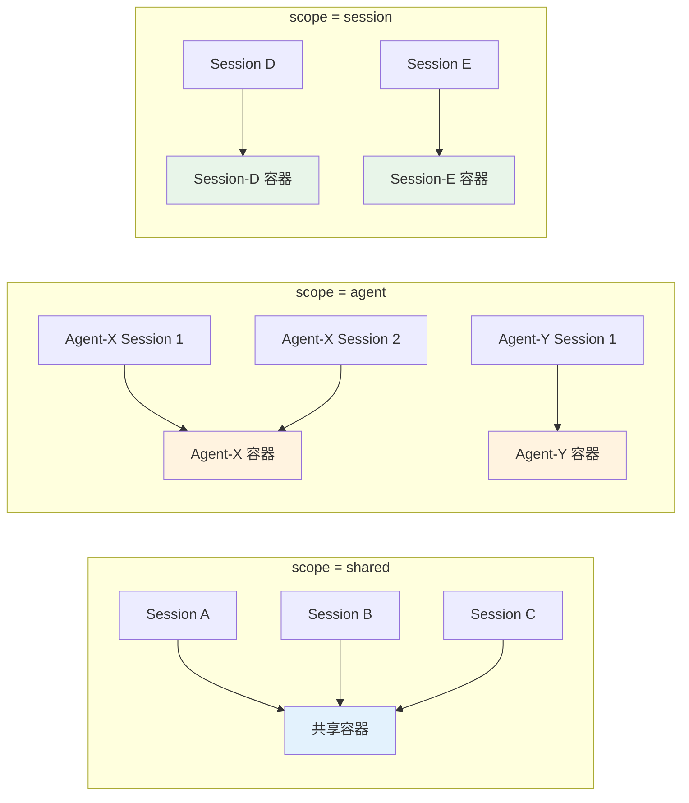
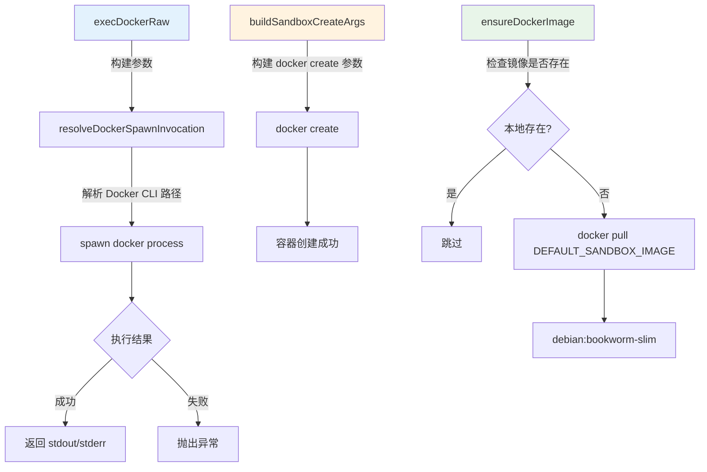
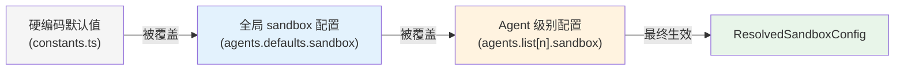
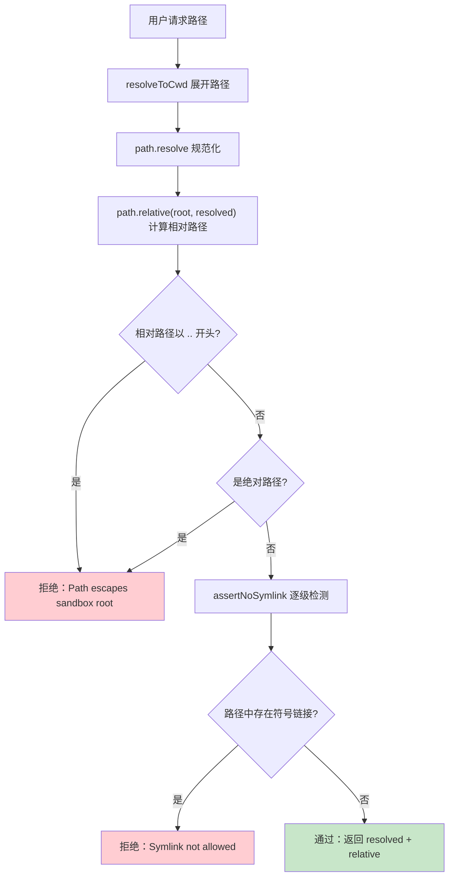
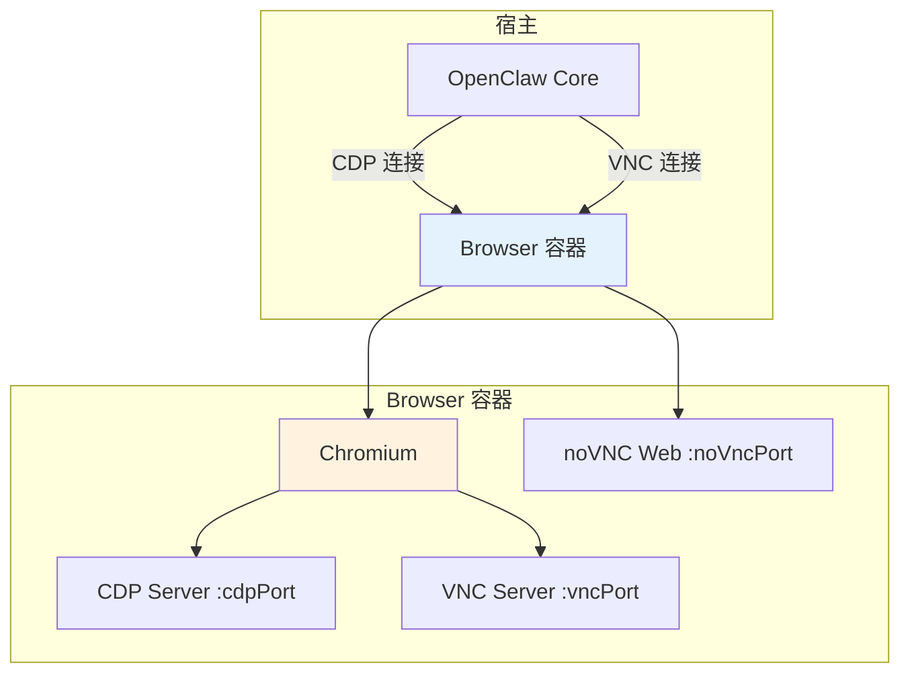
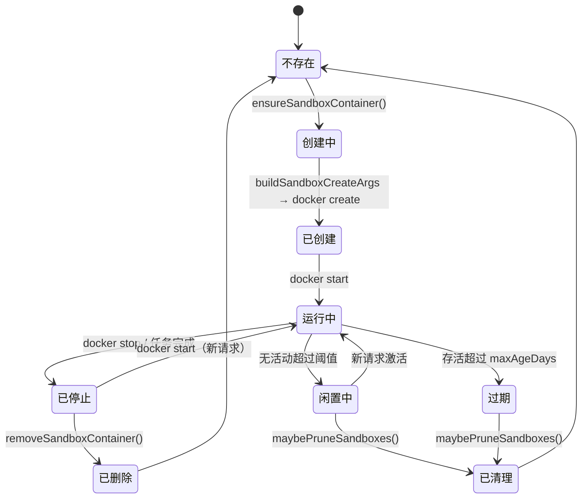
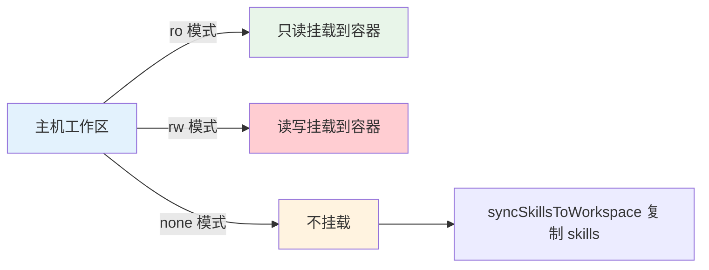

# OpenClaw 沙箱机制源码深度分析

> 纵深防御、默认安全——基于源码的全面解析，深入理解 OpenClaw 沙箱安全架构的设计哲学与实现细节

## 目录

- [设计理念](#设计理念)
- [沙箱模式与作用域](#沙箱模式与作用域)
- [Docker 执行管线](#docker-执行管线)
- [沙箱配置解析](#沙箱配置解析)
- [安全审计](#安全审计)
- [路径安全](#路径安全)
- [沙箱工具策略](#沙箱工具策略)
- [Browser 沙箱](#browser-沙箱)
- [容器生命周期](#容器生命周期)
- [工作区访问控制](#工作区访问控制)
- [配置示例](#配置示例)
- [常见问题](#常见问题)

---

## 设计理念

OpenClaw 的沙箱系统遵循 **纵深防御（Defense in Depth）** 原则，通过多层叠加的安全机制构建完整的隔离体系，任何单一层被突破都不会导致系统整体沦陷。

### 纵深防御模型



### 默认安全原则

OpenClaw 采用 **Default Secure（默认安全）** 策略：非 main 会话默认进入沙箱，所有安全配置都取最保守的默认值。

| 安全维度 | 默认值 | 含义 |
|----------|--------|------|
| `mode` | `"non-main"` | 非主会话自动沙箱化 |
| `readOnlyRoot` | `true` | 容器根文件系统只读 |
| `network` | `"none"` | 禁用网络访问 |
| `capDrop` | `["ALL"]` | 移除全部 Linux Capability |
| `workspaceAccess` | `"ro"` | 工作区只读挂载 |

### 源码模块结构

```
src/agents/sandbox/
├── types.ts              # 类型定义：SandboxConfig, SandboxDockerConfig 等
├── constants.ts          # 常量：默认镜像、网络、能力等
├── config.ts             # 配置解析与合并逻辑
├── context.ts            # 沙箱上下文解析入口
├── docker.ts             # Docker 操作：创建、执行、镜像管理
├── workspace.ts          # 工作区准备与挂载
├── workspace-mounts.ts   # bind mount 构建逻辑
├── browser.ts            # 浏览器沙箱（CDP + VNC）
├── prune.ts              # 容器清理逻辑
├── paths.ts              # 路径安全校验
├── tool-policy.ts        # 工具白/黑名单策略
├── fs-bridge.ts          # 宿主侧文件操作桥接
├── manage.ts             # 容器管理（list, remove）
├── runtime-status.ts     # 运行时状态判定
├── registry.ts           # 容器注册表持久化
├── config-hash.ts        # 配置哈希（检测配置变更）
├── shared.ts             # 共享工具函数
└── validate-sandbox-security.ts  # 安全审计校验
```

---

## 沙箱模式与作用域

### 三种沙箱模式

```typescript
// types.ts
export type SandboxMode = "off" | "non-main" | "all";
```

| 模式 | 行为 | 适用场景 |
|------|------|----------|
| `off` | 不启用沙箱，所有会话直接在主机执行 | 完全信任的本地开发 |
| `non-main` | 主会话（main）在主机执行，其余会话沙箱化 | **默认推荐**，平衡安全与便利 |
| `all` | 所有会话（含 main）均在沙箱中执行 | 高安全要求场景 |

### 三种作用域

```typescript
// types.ts
export type SandboxScope = "session" | "agent" | "shared";
```



| 作用域 | 隔离粒度 | 容器命名示例 | 特点 |
|--------|----------|-------------|------|
| `shared` | 全局共享 | `openclaw-sbx-shared` | 资源复用最高，隔离性最低 |
| `agent` | 每 Agent 一个 | `openclaw-sbx-agent-{agentId}` | 同一 Agent 的多个会话共享状态 |
| `session` | 每会话一个 | `openclaw-sbx-{sessionKey}` | 隔离性最高，每次会话干净环境 |

### 工作区访问级别

```typescript
// types.ts
export type SandboxWorkspaceAccess = "none" | "ro" | "rw";
```

| 级别 | 挂载方式 | 风险等级 |
|------|----------|----------|
| `none` | 不挂载主机工作区，仅使用容器内置目录 | 最安全 |
| `ro` | 只读挂载主机工作区到容器 | **推荐默认** |
| `rw` | 读写挂载主机工作区到容器 | 危险：容器可修改主机文件 |

---

## Docker 执行管线

Docker 执行管线是沙箱的核心基础设施，负责容器的创建、镜像管理和命令执行。

### 执行流程



### execDockerRaw 执行原语

```typescript
// docker.ts

export async function execDockerRaw(
  args: string[],
  opts?: { timeout?: number; cwd?: string },
): Promise<{ stdout: string; stderr: string; exitCode: number }> {
  const invocation = resolveDockerSpawnInvocation(args);
  // 通过 child_process.spawn 执行 docker CLI
  // 捕获 stdout/stderr，处理超时和错误
}
```

`execDockerRaw` 是最底层的 Docker 操作原语，所有 Docker 命令（`create`、`start`、`exec`、`rm` 等）最终都通过它执行。`resolveDockerSpawnInvocation` 负责解析 Docker CLI 的完整路径，确保跨平台兼容。

### buildSandboxCreateArgs 容器创建

```typescript
// docker.ts

export function buildSandboxCreateArgs(params: {
  name: string;
  cfg: SandboxDockerConfig;
  scopeKey: string;
  createdAtMs?: number;
  labels?: Record<string, string>;
}): string[] {
  const args = ["create", "--name", params.name];

  // 标签（用于管理和清理）
  args.push("--label", "openclaw.sandbox=1");
  args.push("--label", `openclaw.sessionKey=${params.scopeKey}`);
  args.push("--label", `openclaw.createdAtMs=${params.createdAtMs}`);

  // 安全隔离参数
  if (params.cfg.readOnlyRoot) args.push("--read-only");
  for (const entry of params.cfg.tmpfs)   args.push("--tmpfs", entry);
  args.push("--network", params.cfg.network);
  for (const cap of params.cfg.capDrop)   args.push("--cap-drop", cap);

  // 环境变量注入
  for (const [key, value] of Object.entries(params.cfg.env)) {
    args.push("--env", `${key}=${value}`);
  }

  // 资源限制
  if (params.cfg.memory)    args.push("--memory", params.cfg.memory);
  if (params.cfg.memorySwap) args.push("--memory-swap", params.cfg.memorySwap);
  if (params.cfg.cpus)      args.push("--cpus", String(params.cfg.cpus));
  if (params.cfg.pidsLimit) args.push("--pids-limit", String(params.cfg.pidsLimit));

  // 安全配置文件
  if (params.cfg.seccompProfile)  args.push("--security-opt", `seccomp=${params.cfg.seccompProfile}`);
  if (params.cfg.apparmorProfile) args.push("--security-opt", `apparmor=${params.cfg.apparmorProfile}`);

  // bind 挂载
  for (const bind of params.cfg.binds ?? []) {
    args.push("--volume", bind);
  }

  // 工作目录和镜像
  args.push("--workdir", params.cfg.workdir);
  args.push(params.cfg.image);

  return args;
}
```

### ensureDockerImage 镜像保障

```typescript
// docker.ts / constants.ts

const DEFAULT_SANDBOX_IMAGE = "debian:bookworm-slim";

export async function ensureDockerImage(image: string): Promise<void> {
  // 检查本地是否已有镜像
  const result = await execDockerRaw(["image", "inspect", image]);
  if (result.exitCode === 0) return; // 已存在

  // 不存在则拉取
  await execDockerRaw(["pull", image]);
}
```

### 容器隔离参数汇总

| 参数 | 默认值 | 安全效果 |
|------|--------|----------|
| `--read-only` | 启用 | 根文件系统只读，防止恶意写入 |
| `--cap-drop ALL` | 启用 | 移除全部 Linux Capability |
| `--network none` | 启用 | 完全隔离网络，阻断数据外泄 |
| `--tmpfs /tmp,/var/tmp,/run` | 启用 | 仅允许临时目录可写 |
| `--pids-limit` | 可配置 | 防止 fork bomb |
| `--memory` | 可配置 | 防止 OOM 影响宿主 |
| `--security-opt seccomp=...` | 可配置 | 系统调用过滤 |
| `--security-opt apparmor=...` | 可配置 | 强制访问控制 |

---

## 沙箱配置解析

### resolveSandboxConfigForAgent

核心配置合并函数，将 `agents.defaults.sandbox` 与 Agent 级别的 `sandbox` 覆盖配置进行深度合并：

```typescript
// config.ts

export function resolveSandboxConfigForAgent(
  cfg?: OpenClawConfig,
  agentId?: string,
): ResolvedSandboxConfig {
  // 1. 读取全局默认配置
  const globalSandbox = cfg?.agents?.defaults?.sandbox;

  // 2. 读取特定 Agent 的覆盖配置
  const agentConfig = agentId ? findAgentConfig(cfg, agentId) : undefined;
  const agentSandbox = agentConfig?.sandbox;

  // 3. 深度合并（Agent 覆盖全局，全局覆盖默认）
  return {
    mode:            agentSandbox?.mode ?? globalSandbox?.mode ?? "non-main",
    scope:           agentSandbox?.scope ?? globalSandbox?.scope ?? "session",
    workspaceAccess: agentSandbox?.workspaceAccess ?? globalSandbox?.workspaceAccess ?? "ro",
    docker:          resolveSandboxDockerConfig({
      globalDocker: globalSandbox?.docker,
      agentDocker:  agentSandbox?.docker,
    }),
    browser: resolveSandboxBrowserConfig(globalSandbox?.browser, agentSandbox?.browser),
    tools:   resolveSandboxToolPolicyForAgent(cfg, agentId),
    prune:   { ...DEFAULT_PRUNE_CONFIG, ...globalSandbox?.prune, ...agentSandbox?.prune },
  };
}
```

### Docker 配置合并

```typescript
// config.ts

export function resolveSandboxDockerConfig(params: {
  globalDocker?: Partial<SandboxDockerConfig>;
  agentDocker?: Partial<SandboxDockerConfig>;
}): SandboxDockerConfig {
  const g = params.globalDocker;
  const a = params.agentDocker;

  // 环境变量：Agent 层叠加到全局层之上
  const env = a?.env
    ? { ...(g?.env ?? { LANG: "C.UTF-8" }), ...a.env }
    : (g?.env ?? { LANG: "C.UTF-8" });

  return {
    image:          a?.image          ?? g?.image          ?? DEFAULT_SANDBOX_IMAGE,
    workdir:        a?.workdir        ?? g?.workdir        ?? "/workspace",
    readOnlyRoot:   a?.readOnlyRoot   ?? g?.readOnlyRoot   ?? true,
    tmpfs:          a?.tmpfs          ?? g?.tmpfs          ?? ["/tmp", "/var/tmp", "/run"],
    network:        a?.network        ?? g?.network        ?? "none",
    capDrop:        a?.capDrop        ?? g?.capDrop        ?? ["ALL"],
    env,
    memory:         a?.memory         ?? g?.memory,
    cpus:           a?.cpus           ?? g?.cpus,
    pidsLimit:      a?.pidsLimit      ?? g?.pidsLimit,
    seccompProfile: a?.seccompProfile ?? g?.seccompProfile,
    apparmorProfile:a?.apparmorProfile?? g?.apparmorProfile,
    binds:          a?.binds          ?? g?.binds,
  };
}
```

### 配置层次优先级



---

## 安全审计

OpenClaw 内置了自动化安全审计机制，在配置生效前检测潜在风险。

### validate-sandbox-security.ts

该模块对 bind mount 进行安全校验，防止危险的宿主目录挂载：

```typescript
// validate-sandbox-security.ts

export function validateBindMounts(binds: string[]): ValidationResult[] {
  const results: ValidationResult[] = [];
  for (const bind of binds) {
    const [hostPath, containerPath, mode] = bind.split(":");

    // 检测危险的宿主路径
    if (isDangerousHostPath(hostPath)) {
      results.push({
        severity: "error",
        message: `Dangerous host path in bind mount: ${hostPath}`,
        bind,
      });
    }

    // 检测可写挂载到敏感容器路径
    if (mode !== "ro" && isSensitiveContainerPath(containerPath)) {
      results.push({
        severity: "warning",
        message: `Writable mount to sensitive container path: ${containerPath}`,
        bind,
      });
    }
  }
  return results;
}
```

### audit-extra.sync.ts

运行时审计模块提供两组关键检查：

**collectSandboxDangerousConfigFindings** — 扫描配置中的高风险项：

| 检查项 | 触发条件 | 风险说明 |
|--------|----------|----------|
| 危险 bind 挂载 | 挂载 `/`, `/etc`, `/var/run/docker.sock` 等 | 容器逃逸风险 |
| 非隔离网络 | `network` 不为 `"none"` | 数据外泄风险 |
| 缺失 seccomp | 未配置 seccomp profile | 系统调用未受限 |
| 缺失 AppArmor | 未配置 AppArmor profile | MAC 策略缺失 |
| 未 drop 能力 | `capDrop` 非 `["ALL"]` | 权限过大 |

**collectSandboxDockerNoopFindings** — 检测"假沙箱"配置：

```typescript
// audit-extra.sync.ts

export function collectSandboxDockerNoopFindings(
  cfg: ResolvedSandboxConfig,
): AuditFinding[] {
  const findings: AuditFinding[] = [];

  // 沙箱开启但 Docker 未生效的情况
  if (cfg.mode !== "off" && !cfg.docker.readOnlyRoot) {
    findings.push({
      level: "warn",
      code: "SANDBOX_NOOP_RW_ROOT",
      message: "Sandbox enabled but root filesystem is writable",
    });
  }

  if (cfg.mode !== "off" && cfg.docker.network !== "none") {
    findings.push({
      level: "warn",
      code: "SANDBOX_NOOP_NETWORK",
      message: "Sandbox enabled but network is not isolated",
    });
  }

  return findings;
}
```

---

## 路径安全

路径安全是沙箱的最后一道防线，确保所有文件操作都不会逃逸出工作区边界。

### 路径穿越防护



### 核心实现

```typescript
// paths.ts

export function resolveSandboxPath(params: {
  filePath: string;
  cwd: string;
  root: string;
}): { resolved: string; relative: string } {
  const resolved = resolveToCwd(params.filePath, params.cwd);
  const rootResolved = path.resolve(params.root);
  const relative = path.relative(rootResolved, resolved);

  // 路径穿越检测：相对路径不能以 .. 开头或是绝对路径
  if (relative.startsWith("..") || path.isAbsolute(relative)) {
    throw new Error(
      `Path escapes sandbox root (${shortPath(rootResolved)}): ${params.filePath}`
    );
  }

  return { resolved, relative };
}
```

### 符号链接逐级检测

```typescript
// paths.ts

async function assertNoSymlink(relative: string, root: string): Promise<void> {
  if (!relative) return;

  const parts = relative.split(path.sep).filter(Boolean);
  let current = root;

  // 逐级遍历路径的每一段，检测是否为符号链接
  for (const part of parts) {
    current = path.join(current, part);
    try {
      const stat = await fs.lstat(current);
      if (stat.isSymbolicLink()) {
        throw new Error(`Symlink not allowed in sandbox path: ${current}`);
      }
    } catch (e) {
      if ((e as NodeJS.ErrnoException).code === "ENOENT") continue;
      throw e;
    }
  }
}
```

### 媒体资源路径校验

```typescript
// paths.ts

export async function resolveSandboxedMediaSource(params: {
  media: string;
  sandboxRoot: string;
}): Promise<string> {
  const raw = params.media.trim();

  if (HTTP_URL_RE.test(raw))  return raw;           // HTTP URL 直接放行
  if (DATA_URL_RE.test(raw))  throw new Error("data: URLs not supported");

  // file:// URL 转为本地路径
  let candidate = /^file:\/\//i.test(raw) ? fileURLToPath(raw) : raw;

  // 所有本地路径必须通过沙箱边界校验
  const resolved = await assertSandboxPath({
    filePath: candidate,
    cwd: params.sandboxRoot,
    root: params.sandboxRoot,
  });

  return resolved.resolved;
}
```

---

## 沙箱工具策略

### pickSandboxToolPolicy

根据当前沙箱模式和会话类型，动态决定可用工具集合：

```typescript
// tool-policy.ts

export function pickSandboxToolPolicy(params: {
  sandboxMode: SandboxMode;
  isMainSession: boolean;
  agentToolPolicy?: SandboxToolPolicy;
  globalToolPolicy?: SandboxToolPolicy;
}): SandboxToolPolicyResolved {
  // mode=off 或 (mode=non-main 且是主会话) → 不限制工具
  if (params.sandboxMode === "off") return UNRESTRICTED_POLICY;
  if (params.sandboxMode === "non-main" && params.isMainSession) return UNRESTRICTED_POLICY;

  // 否则应用白/黑名单策略
  return resolveToolPolicy(params.agentToolPolicy, params.globalToolPolicy);
}
```

### 工具过滤逻辑

```typescript
// tool-policy.ts

export function isToolAllowed(policy: SandboxToolPolicy, name: string): boolean {
  const normalized = name.trim().toLowerCase();

  // 黑名单优先：命中 deny 则拒绝
  if (matchesAny(normalized, compilePatterns(policy.deny))) {
    return false;
  }

  // 白名单为空 → 全部允许；否则必须命中 allow
  const allow = compilePatterns(policy.allow);
  return allow.length === 0 || matchesAny(normalized, allow);
}
```

### 默认工具策略

```typescript
// constants.ts

DEFAULT_TOOL_ALLOW = [
  "exec", "process", "read", "write", "edit",
  "apply_patch", "image",
  "sessions_list", "sessions_history",
  "sessions_send", "sessions_spawn", "session_status",
];

DEFAULT_TOOL_DENY = [
  "browser", "canvas", "nodes", "cron", "gateway",
  ...CHANNEL_IDS,  // 所有通道类工具
];
```

### fs-bridge.ts 文件桥接

沙箱化会话无法直接操作宿主文件系统。`fs-bridge.ts` 提供宿主侧的文件操作桥接，将容器内的文件读写请求安全地代理到宿主：

```typescript
// fs-bridge.ts

export async function bridgeFileRead(params: {
  filePath: string;
  sandboxRoot: string;
}): Promise<string> {
  // 先通过路径安全校验
  const { resolved } = await assertSandboxPath({
    filePath: params.filePath,
    cwd: params.sandboxRoot,
    root: params.sandboxRoot,
  });

  return fs.readFile(resolved, "utf-8");
}
```

---

## Browser 沙箱

浏览器沙箱为 Agent 提供隔离的浏览器环境，通过 CDP（Chrome DevTools Protocol）和 VNC 实现远程控制。

### 架构



### 配置

```typescript
// types.ts

export type SandboxBrowserConfig = {
  enabled: boolean;               // 是否启用浏览器沙箱
  image: string;                  // 浏览器专用镜像（与主沙箱镜像不同）
  containerPrefix: string;        // 容器名前缀
  cdpPort: number;                // Chrome DevTools Protocol 端口
  vncPort: number;                // VNC 端口
  noVncPort: number;              // noVNC Web 端口
  headless: boolean;              // 无头模式
  enableNoVnc: boolean;           // 是否启用 noVNC Web 界面
  allowHostControl: boolean;      // 是否允许主机控制浏览器
  autoStart: boolean;             // 随沙箱自动启动
  autoStartTimeoutMs: number;     // 自动启动超时
  network: string;                // 浏览器容器网络（通常需要联网，与主沙箱不同）
};
```

**关键差异：** 浏览器容器使用独立的镜像和网络配置。主沙箱通常 `network: "none"`，但浏览器容器往往需要 `network: "bridge"` 以访问被测网站。

---

## 容器生命周期

### 完整生命周期



### 关键操作

**创建容器：**

```typescript
// docker.ts
const args = buildSandboxCreateArgs({ name, cfg, scopeKey, createdAtMs });
await execDockerRaw(args);
```

**列出沙箱容器：**

```typescript
// manage.ts
export async function listSandboxContainers(): Promise<ContainerInfo[]> {
  const result = await execDockerRaw([
    "ps", "-a",
    "--filter", "label=openclaw.sandbox=1",
    "--format", "{{json .}}",
  ]);
  // 解析 JSON 输出
}
```

**删除容器：**

```typescript
// manage.ts
export async function removeSandboxContainer(name: string): Promise<void> {
  await execDockerRaw(["rm", "-f", name]);
}
```

**清理逻辑：**

```typescript
// prune.ts
export async function maybePruneSandboxes(cfg: SandboxPruneConfig): Promise<void> {
  const registry = await readRegistry();
  const now = Date.now();

  for (const [id, container] of Object.entries(registry.containers)) {
    const ageDays = (now - container.createdAtMs) / (1000 * 60 * 60 * 24);
    const idleHours = (now - container.lastUsedAtMs) / (1000 * 60 * 60);

    if (ageDays > cfg.maxAgeDays || idleHours > cfg.idleHours) {
      await removeSandboxContainer(container.containerName);
      delete registry.containers[id];
    }
  }

  await updateRegistry(registry);
}
```

| 清理参数 | 默认值 | 含义 |
|----------|--------|------|
| `idleHours` | `24` | 无活动超过此小时数则清理 |
| `maxAgeDays` | `7` | 容器存活超过此天数则清理 |

---

## 工作区访问控制

### ensureSandboxWorkspaceForSession

此函数负责为每个沙箱会话准备工作区目录结构：

```typescript
// workspace.ts

export async function ensureSandboxWorkspaceForSession(params: {
  sandboxWorkspaceDir: string;
  agentWorkspaceDir: string;
  workspaceAccess: SandboxWorkspaceAccess;
}): Promise<void> {
  // 创建沙箱工作区目录
  await fs.mkdir(params.sandboxWorkspaceDir, { recursive: true });

  // ro/none 模式下同步 skills 到沙箱
  if (params.workspaceAccess !== "rw") {
    await syncSkillsToWorkspace({
      sourceWorkspaceDir: params.agentWorkspaceDir,
      targetWorkspaceDir: params.sandboxWorkspaceDir,
    });
  }
}
```

### workspace-mounts.ts bind 挂载构建

```typescript
// workspace-mounts.ts

export function buildWorkspaceMounts(params: {
  workspaceAccess: SandboxWorkspaceAccess;
  sandboxWorkspaceDir: string;
  agentWorkspaceDir: string;
  containerWorkdir: string;
}): string[] {
  const mounts: string[] = [];

  switch (params.workspaceAccess) {
    case "none":
      // 仅挂载沙箱内部工作区
      mounts.push(`${params.sandboxWorkspaceDir}:${params.containerWorkdir}`);
      break;

    case "ro":
      // 只读挂载主机工作区
      mounts.push(`${params.agentWorkspaceDir}:${params.containerWorkdir}:ro`);
      // 可写层挂载沙箱工作区的 overlay
      mounts.push(`${params.sandboxWorkspaceDir}/overlay:${params.containerWorkdir}/overlay`);
      break;

    case "rw":
      // 读写挂载主机工作区（危险！）
      mounts.push(`${params.agentWorkspaceDir}:${params.containerWorkdir}:rw`);
      break;
  }

  return mounts;
}
```

### 工作区目录结构

```
~/.openclaw/sandboxes/
├── shared/                          # scope=shared
│   ├── workspace/                   # 沙箱工作区
│   └── overlay/                     # 可写覆盖层
├── agent-{agentId}/                 # scope=agent
│   ├── workspace/
│   └── overlay/
└── session-{sessionKey}/            # scope=session
    ├── workspace/
    └── overlay/
```

---

## 配置示例

### 全局配置（推荐安全基线）

```json5
// openclaw.config.json5
{
  agents: {
    defaults: {
      sandbox: {
        mode: "non-main",           // 非主会话自动沙箱化
        scope: "session",           // 每个会话独立容器
        workspaceAccess: "ro",      // 只读访问工作区

        docker: {
          image: "debian:bookworm-slim",
          readOnlyRoot: true,
          network: "none",
          capDrop: ["ALL"],
          tmpfs: ["/tmp", "/var/tmp", "/run"],
          memory: "2g",
          cpus: 2,
          pidsLimit: 100,
          env: {
            LANG: "C.UTF-8",
          },
        },

        browser: {
          enabled: false,
        },

        tools: {
          allow: ["exec", "read", "write", "edit", "apply_patch"],
          deny: ["gateway", "cron", "nodes", "canvas"],
        },

        prune: {
          idleHours: 24,
          maxAgeDays: 7,
        },
      },
    },
  },
}
```

### Agent 级别覆盖配置

```json5
// openclaw.config.json5
{
  agents: {
    defaults: {
      sandbox: {
        mode: "non-main",
        // ... 全局默认
      },
    },

    list: [
      {
        id: "coding-agent",
        sandbox: {
          // 覆盖：此 Agent 所有会话均沙箱化
          mode: "all",
          scope: "agent",
          workspaceAccess: "rw",      // 需要写入

          docker: {
            image: "custom-dev:latest",
            memory: "4g",
            cpus: 4,
            network: "bridge",        // 需要网络（如拉取依赖）
            dns: ["8.8.8.8"],
          },

          browser: {
            enabled: true,
            headless: true,
            autoStart: true,
            network: "bridge",
          },

          tools: {
            allow: ["*"],
            deny: ["gateway"],
          },
        },
      },
      {
        id: "trusted-local-agent",
        sandbox: {
          mode: "off",                // 完全信任，禁用沙箱
        },
      },
    ],
  },
}
```

---

## 常见问题

### Q1: 沙箱无法启动，提示 Docker 未找到

```bash
# 1. 确认 Docker 守护进程运行中
docker ps

# 2. 确认默认镜像存在
docker images | grep bookworm-slim

# 3. 手动拉取镜像
docker pull debian:bookworm-slim

# 4. 运行 OpenClaw 自检
openclaw doctor --sandbox
```

### Q2: 沙箱内无法访问网络

默认行为：沙箱容器 `network: "none"`，完全禁用网络。如需联网：

```json5
{
  sandbox: {
    docker: {
      network: "bridge",
      dns: ["8.8.8.8", "114.114.114.114"],
    },
  },
}
```

> 注意：开启网络会降低隔离等级，审计系统会发出 `SANDBOX_NOOP_NETWORK` 警告。

### Q3: 如何调试沙箱内部问题？

```bash
# 进入运行中的沙箱容器
docker exec -it openclaw-sbx-{sessionKey} /bin/bash

# 查看容器日志
openclaw sandbox logs openclaw-sbx-{sessionKey}

# 查看容器配置
docker inspect openclaw-sbx-{sessionKey}
```

### Q4: 工作区文件同步机制



### Q5: 如何查看安全审计结果？

安全审计在配置加载时自动执行。可以通过以下方式查看：

```bash
# 运行完整安全检查
openclaw doctor --sandbox

# 查看审计发现
openclaw sandbox audit
```

### Q6: 配置变更后容器会怎样？

OpenClaw 通过 `config-hash.ts` 计算配置哈希值。当检测到配置变更时，现有容器会被标记为过期，下次使用时自动重建。

---

*基于 OpenClaw v2026.2.3-1 源码分析*
