# OpenClaw 会话系统源码深度分析

> 基于源码的全面解析，帮助你深入理解 OpenClaw 的会话管理机制

## 目录

- [设计理念](#设计理念)
- [核心概念](#核心概念)
  - [Session Key 格式与解析](#session-key-格式与解析)
  - [Session Key 解析 API 完整表](#session-key-解析-api-完整表)
  - [Session Key 构建](#session-key-构建)
  - [Session Entry](#session-entry)
  - [Session Scope](#session-scope)
- [架构设计](#架构设计)
  - [目录结构](#目录结构)
  - [组件关系](#组件关系)
- [Session Store (store.ts)](#session-store-storets)
  - [缓存机制](#缓存机制)
  - [Store 维护操作](#store-维护操作)
  - [Session ID 验证](#session-id-验证)
  - [写锁机制](#写锁机制)
  - [Windows 平台处理](#windows-平台处理)
- [Session Paths (paths.ts)](#session-paths-pathsts)
- [Send Policy (send-policy.ts)](#send-policy-send-policyts)
- [Transcript (JSONL)](#transcript-jsonl)
- [会话类型](#会话类型)
- [队列模式](#队列模式)
- [会话生命周期](#会话生命周期)
- [源码关键代码解读](#源码关键代码解读)
- [常见问题](#常见问题)

---

## 设计理念

OpenClaw 的会话系统遵循三个核心设计原则：

```
Session = 路由单元 (Routing Unit) + 状态容器 (State Container) + 历史存储 (History Store)
```

| 设计维度 | 实现策略 |
|----------|----------|
| **确定性路由** | Session Key 编码了 agent、channel、peer 信息，确保同一消息源始终路由到同一会话 |
| **Local-first 存储** | JSON 文件持久化 + 内存缓存，无需外部数据库依赖 |
| **会话隔离** | 每个会话拥有独立的状态、配置和历史记录 |
| **策略分离** | 发送策略与会话逻辑解耦，支持灵活的规则引擎 |

### 系统定位

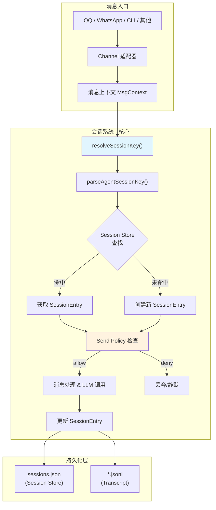

---

## 核心概念

### Session Key 格式与解析

Session Key 是会话的唯一标识符。其**规范格式**（Canonical Form）为：

```
agent:<agentId>:<rest>
```

- 全部小写，冒号分隔
- `agentId` 标识 Agent 实例
- `rest` 部分编码了会话的类型、通道、目标等信息

#### 解析逻辑

```typescript
// session-key-utils.ts
export function parseAgentSessionKey(sessionKey: string): ParsedAgentSessionKey | null {
  const parts = sessionKey.split(":").filter(Boolean);
  if (parts.length < 3 || parts[0] !== "agent") {
    return null;
  }
  return {
    agentId: parts[1],           // parts[0] === "agent"
    rest: parts.slice(2).join(":"), // 冒号重新连接剩余部分
  };
}
```

#### 各类 Session Key 示例

```
# 私聊主会话
agent:default:main:qqbot:5de05a2765375641985db70cae9611db

# 群组会话
agent:default:group:12345678:qqbot:group_12345678

# 线程/话题会话
agent:default:thread:1001:qqbot:group_12345678

# 子代理会话
agent:default:subagent:memory:uuid-123

# Cron 定时任务会话
agent:default:cron:reminder:run:uuid-456

# ACP 会话
agent:default:acp:service-name:req-id
```

### Session Key 解析 API 完整表

| 函数 | 用途 | 匹配规则 |
|------|------|----------|
| `parseAgentSessionKey()` | 解析为 `{agentId, rest}` | `parts[0]==="agent"`, `agentId=parts[1]`, `rest=parts.slice(2).join(":")` |
| `deriveSessionChatType()` | 推导聊天类型 | rest → `group` / `channel` / `direct` / `unknown` |
| `isCronRunSessionKey()` | 是否为 Cron 运行会话 | `rest` 匹配 `^cron:[^:]+:run:[^:]+$` |
| `isCronSessionKey()` | 是否为 Cron 会话 | `rest.startsWith("cron:")` |
| `isSubagentSessionKey()` | 是否为子代理会话 | 原始 key 以 `subagent:` 开头，或 `rest.startsWith("subagent:")` |
| `getSubagentDepth()` | 获取子代理嵌套深度 | 计算 key 中 `:subagent:` 出现次数 |
| `isAcpSessionKey()` | 是否为 ACP 会话 | 原始 key 以 `acp:` 开头，或 `rest.startsWith("acp:")` |
| `resolveThreadParentSessionKey()` | 解析线程的父会话 Key | 截取 `:thread:` 或 `:topic:` 之前的部分 |

#### 类型判断流程

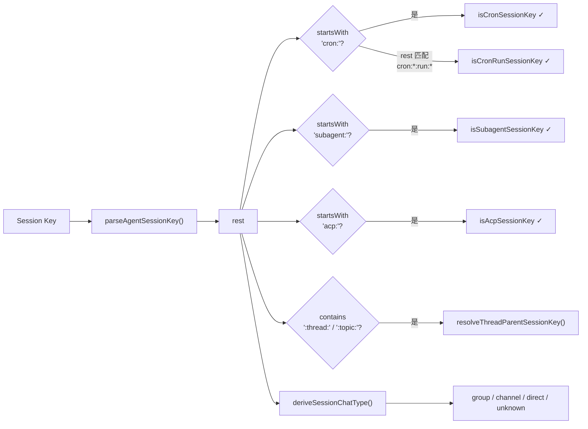

### Session Key 构建

Session Key 的构建遵循分层策略：

```typescript
// 高层入口：resolveSessionKey()
function resolveSessionKey(ctx): string {
  // 1. 显式指定的 SessionKey 优先
  if (ctx.SessionKey?.trim()) {
    return normalizeExplicitSessionKey(ctx.SessionKey);
  }
  // 2. 否则构建 Agent 主会话 Key
  return buildAgentMainSessionKey(/* ... */);
}

// 底层推导：deriveSessionKey()
function deriveSessionKey(scope, ctx): string {
  // global scope → 固定 key "global"
  if (scope === "global") return "global";

  // 群组消息 → resolveGroupSessionKey()
  const group = resolveGroupSessionKey(ctx);
  if (group) return group.key;

  // 私聊 → normalizeE164(ctx.From) 或 "unknown"
  return normalizeE164(ctx.From) || "unknown";
}
```

#### Key 构建流程

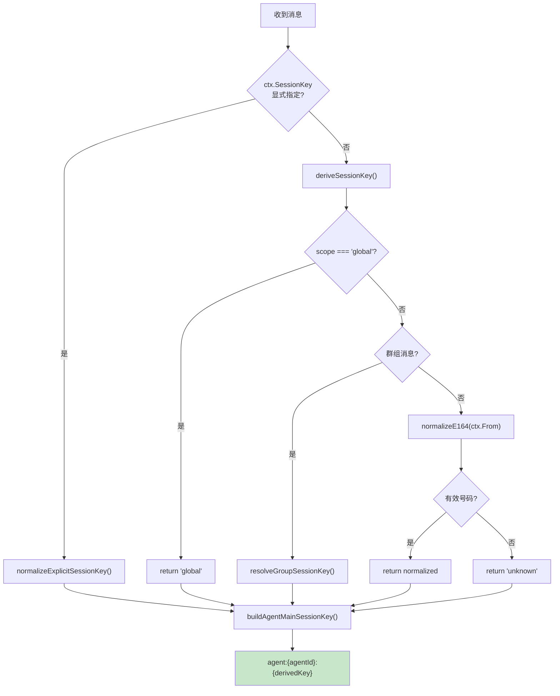

### Session Entry

Session Entry 存储会话的完整状态：

```typescript
export type SessionEntry = {
  // ── 核心标识 ──
  sessionId: string;
  updatedAt: number;
  sessionFile?: string;

  // ── 父子关系 ──
  spawnedBy?: string;              // 父会话 key

  // ── 执行配置 ──
  thinkingLevel?: string;
  verboseLevel?: string;
  reasoningLevel?: string;
  elevatedLevel?: string;

  // ── 模型配置 ──
  providerOverride?: string;
  modelOverride?: string;
  model?: string;
  modelProvider?: string;

  // ── 消息队列 ──
  queueMode?: QueueMode;
  queueDebounceMs?: number;
  queueCap?: number;
  queueDrop?: "old" | "new" | "summarize";

  // ── 发送策略 ──
  sendPolicy?: "allow" | "deny";

  // ── Token 统计 ──
  inputTokens?: number;
  outputTokens?: number;
  totalTokens?: number;
  contextTokens?: number;

  // ── 压缩 & 记忆 ──
  compactionCount?: number;
  memoryFlushAt?: number;
  memoryFlushCompactionCount?: number;

  // ── 元数据 ──
  label?: string;
  displayName?: string;
  channel?: string;
  groupId?: string;
  subject?: string;
  origin?: SessionOrigin;
  chatType?: SessionChatType;

  // ── 技能 & 提示快照 ──
  skillsSnapshot?: SessionSkillSnapshot;
  systemPromptReport?: SessionSystemPromptReport;
};
```

### Session Scope

```typescript
export type SessionScope = "per-sender" | "global";

// per-sender: 每个发送者独立会话（默认）
// global:     全局单一会话，所有消息共享
```

---

## 架构设计

### 目录结构

```
src/config/sessions/
├── types.ts              # 类型定义 (SessionEntry, SessionScope 等)
├── store.ts              # Session Store 核心 (读写、缓存、锁)
├── store-cache.ts        # 缓存 TTL 管理
├── session-key.ts        # Session Key 构建函数
├── group.ts              # 群组会话 Key 解析
├── metadata.ts           # 会话元数据管理
├── main-session.ts       # 主会话配置
├── paths.ts              # 文件路径解析
├── reset.ts              # 会话重置逻辑
├── transcript.ts         # Transcript 读写
└── send-policy.ts        # 发送策略引擎

src/sessions/
├── session-key-utils.ts  # Key 解析工具函数
├── send-policy.ts        # 策略决策逻辑
├── session-label.ts      # 标签管理
└── transcript-events.ts  # Transcript 事件触发
```

### 组件关系

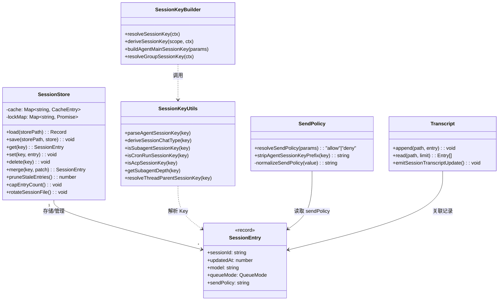

---

## Session Store (store.ts)

### 存储格式

- **文件格式**：JSON（`sessions.json`）
- **数据结构**：`Record<sessionKey, SessionEntry>`
- **Key 归一化**：`normalizeStoreSessionKey()` → `trim().toLowerCase()`

```json
{
  "agent:default:main:qqbot:5de05a2765375641985db70cae9611db": {
    "sessionId": "uuid-123",
    "updatedAt": 1704889600000,
    "model": "claude-sonnet-4-20250514",
    "thinkingLevel": "medium",
    "inputTokens": 15000,
    "outputTokens": 5000,
    "queueMode": "steer",
    "channel": "qqbot"
  }
}
```

### 缓存机制

```typescript
// store-cache.ts
const SESSION_STORE_CACHE = new Map<string, SessionStoreCacheEntry>();
const DEFAULT_SESSION_STORE_TTL_MS = 45_000; // 45 秒

// 环境变量覆盖: OPENCLAW_SESSION_CACHE_TTL_MS

function isSessionStoreCacheValid(entry: SessionStoreCacheEntry): boolean {
  const ttl = getSessionStoreTtl(); // 默认 45s, 可通过环境变量配置
  return Date.now() - entry.loadedAt <= ttl;
}
```

加载策略：

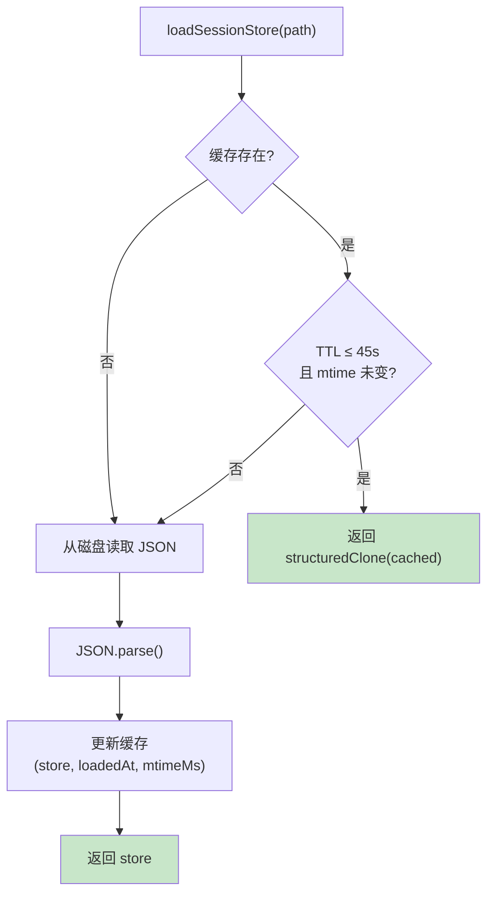

### Store 维护操作

| 操作 | 函数 | 用途 |
|------|------|------|
| 清理过期条目 | `pruneStaleEntries()` | 移除过期/不活跃的 SessionEntry |
| 条目数上限 | `capEntryCount()` | 强制执行最大条目数限制 |
| 文件轮转 | `rotateSessionFile()` | 当 sessions.json 过大时进行轮转 |
| 磁盘配额 | `enforceSessionDiskBudget()` | 管理会话文件总磁盘占用 |

这些操作确保 Session Store 不会无限膨胀：

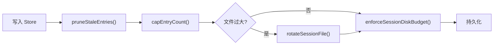

### Session ID 验证

```typescript
// 合法 Session ID 的正则约束
const SAFE_SESSION_ID_RE = /^[a-z0-9][a-z0-9._-]{0,127}$/i;

function validateSessionId(id: string): boolean {
  return SAFE_SESSION_ID_RE.test(id);
}
```

规则说明：
- 以字母或数字开头
- 仅允许 `a-z`、`0-9`、`.`、`_`、`-`
- 长度 1–128 字符
- 大小写不敏感

### 写锁机制

```typescript
// 通过 acquireSessionWriteLock() 获取写锁
// 使用 withSessionStoreLock() 包裹写操作，确保并发安全

await withSessionStoreLock(storePath, async () => {
  const store = loadSessionStore(storePath);
  store[normalizedKey] = entry;
  saveSessionStore(storePath, store);
});
```

### Windows 平台处理

Windows 平台存在文件系统竞争问题，Session Store 采用重试策略：

- 当读取到空内容或损坏数据时自动重试
- 重试间隔使用 `Atomics.wait(50ms)` 阻塞等待
- 避免 `setTimeout` 在同步上下文中的不确定性

```
读取 sessions.json → 空/损坏 → 等待 50ms → 重试 → 成功
                                    ↓ (多次失败)
                              使用空 Store 兜底
```

---

## Session Paths (paths.ts)

会话相关文件的路径约定：

| 路径类型 | 格式 |
|----------|------|
| **基础目录** | `~/.openclaw/agents/<agentId>/sessions/` |
| **Store 文件** | `sessions/sessions.json` |
| **Transcript 文件** | `sessions/<sessionId>.jsonl` |
| **Topic Transcript** | `sessions/<sessionId>-topic-<topicId>.jsonl` |

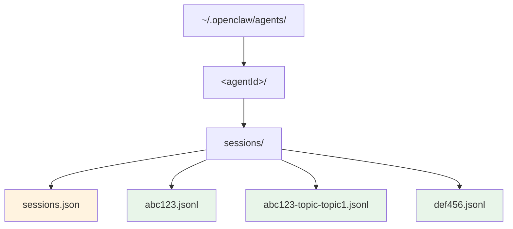

---

## Send Policy (send-policy.ts)

发送策略决定消息是否允许发送。采用**规则链 + 首次匹配**（first-match-wins）模式：

```typescript
function resolveSendPolicy(params: {
  cfg: OpenClawConfig;
  entry?: SessionEntry;
  sessionKey?: string;
  channel?: string;
  chatType?: SessionChatType;
}): "allow" | "deny" {
  // 1. 会话级覆盖优先
  const override = normalizeSendPolicy(params.entry?.sendPolicy);
  if (override) return override;

  // 2. 遍历全局规则链
  for (const rule of cfg.session?.sendPolicy?.rules ?? []) {
    if (matchesRule(rule, params)) {
      return normalizeSendPolicy(rule.action) ?? "allow";
    }
  }

  // 3. 无匹配规则 → 默认 allow
  return "allow";
}
```

### 规则匹配维度

| 维度 | 说明 |
|------|------|
| `channel` | 匹配消息通道（如 `qqbot`, `whatsapp`） |
| `chatType` | 匹配聊天类型（`group`, `direct`, `channel`） |
| `keyPrefix` | 匹配 Session Key 前缀（完整 key） |
| `rawKeyPrefix` | 匹配去掉 agent 前缀后的 rest 部分 |

辅助函数 `stripAgentSessionKeyPrefix()`：

```typescript
// agent:default:group:12345 → group:12345
stripAgentSessionKeyPrefix("agent:default:group:12345");
```

### 配置示例

```json
{
  "session": {
    "sendPolicy": {
      "default": "allow",
      "rules": [
        {
          "action": "deny",
          "match": { "channel": "qqbot", "chatType": "group" }
        },
        {
          "action": "allow",
          "match": { "rawKeyPrefix": "main:" }
        }
      ]
    }
  }
}
```

### 策略决策流程

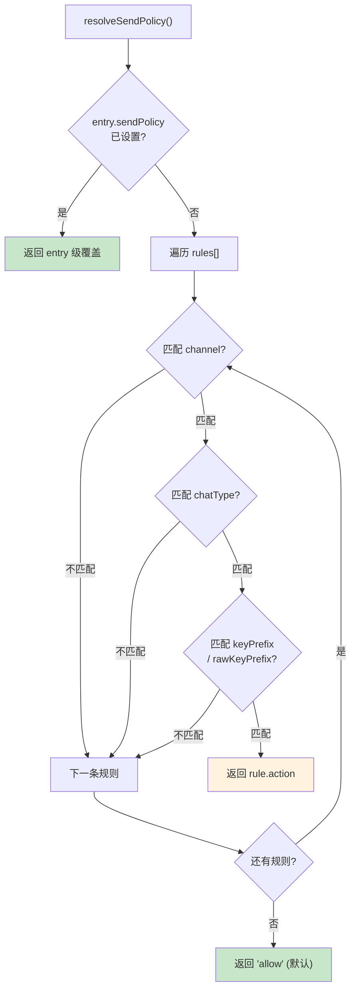

---

## Transcript (JSONL)

会话历史以 **JSONL**（JSON Lines）格式存储，每行一条记录：

```jsonl
{"role":"user","content":"你好","timestamp":1704889600000}
{"role":"assistant","content":"你好！有什么可以帮你的吗？","timestamp":1704889601000,"metadata":{"model":"claude-sonnet-4-20250514","tokens":150}}
```

### 核心操作

| 操作 | 说明 |
|------|------|
| **追加** | `appendFileSync` 逐行写入，天然支持并发追加 |
| **读取** | 按行解析，支持 `limit` 参数截取最近 N 条 |
| **记忆同步** | `emitSessionTranscriptUpdate()` 触发记忆系统同步 |

### Topic 机制

Transcript 支持按话题分文件：
- 主 Transcript：`<sessionId>.jsonl`
- Topic Transcript：`<sessionId>-topic-<topicId>.jsonl`

---

## 会话类型

| 类型 | Session Key 模式 | Bootstrap | 工具集 | 典型用途 |
|------|-------------------|-----------|--------|----------|
| **主会话 (Main)** | `agent:<id>:main:...` | 完整初始化 | 完整 | 用户直接交互 |
| **子代理 (Subagent)** | `...:subagent:<name>:<uuid>` | 最小化 | 受限 | 并行任务处理 |
| **线程 (Thread)** | `...:thread:<threadId>:...` | 继承父会话 | 继承父会话 | 群组内话题隔离 |
| **Cron** | `...:cron:<name>:run:<uuid>` | 最小化 | 按配置 | 定时任务 |

### 会话层级关系

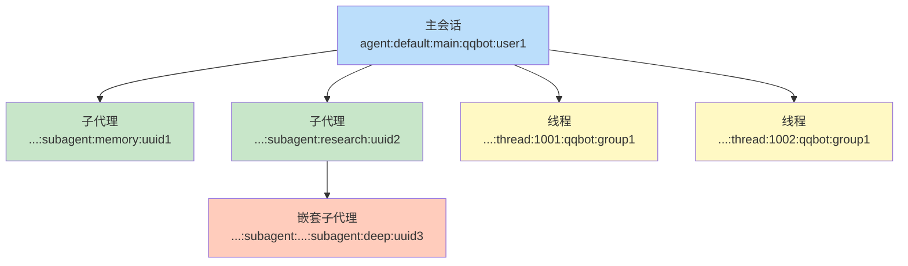

> **嵌套深度**：`getSubagentDepth()` 通过统计 key 中 `:subagent:` 的出现次数来确定嵌套层级。

---

## 队列模式

队列模式控制并发消息的处理策略：

| 模式 | 行为 | 适用场景 |
|------|------|----------|
| `steer` | 新消息追加到当前运行中 | 多轮对话引导 |
| `followup` | 等待当前运行完成后自动继续 | 连续提问 |
| `collect` | 收集所有待处理消息后统一处理 | 批量输入 |
| `interrupt` | 中止当前运行，启动新运行 | 紧急命令 |
| `steer-backlog` | steer + 积压队列 | 高并发场景 |
| `steer+backlog` | 组合模式（等同 steer-backlog） | 高并发场景 |
| `queue` | 严格 FIFO 排队 | 有序处理 |

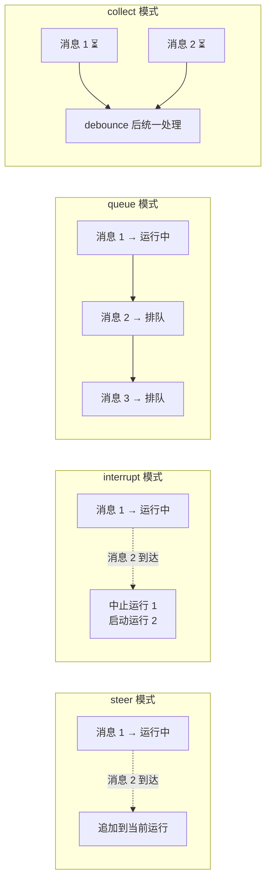

---

## 会话生命周期

### 完整生命周期

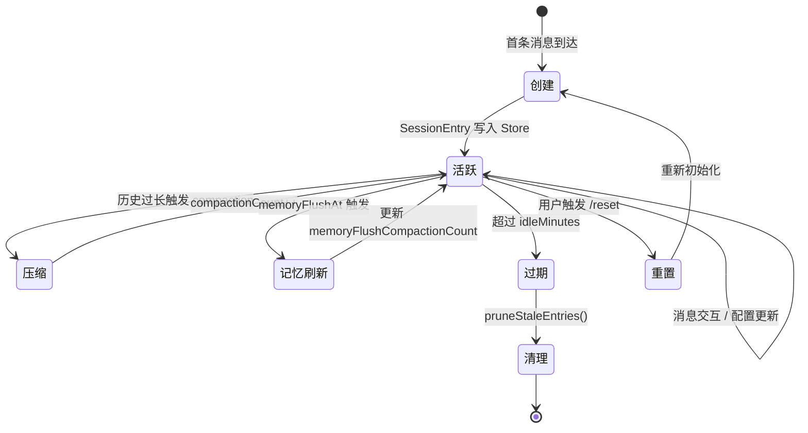

### 消息路由详细流程

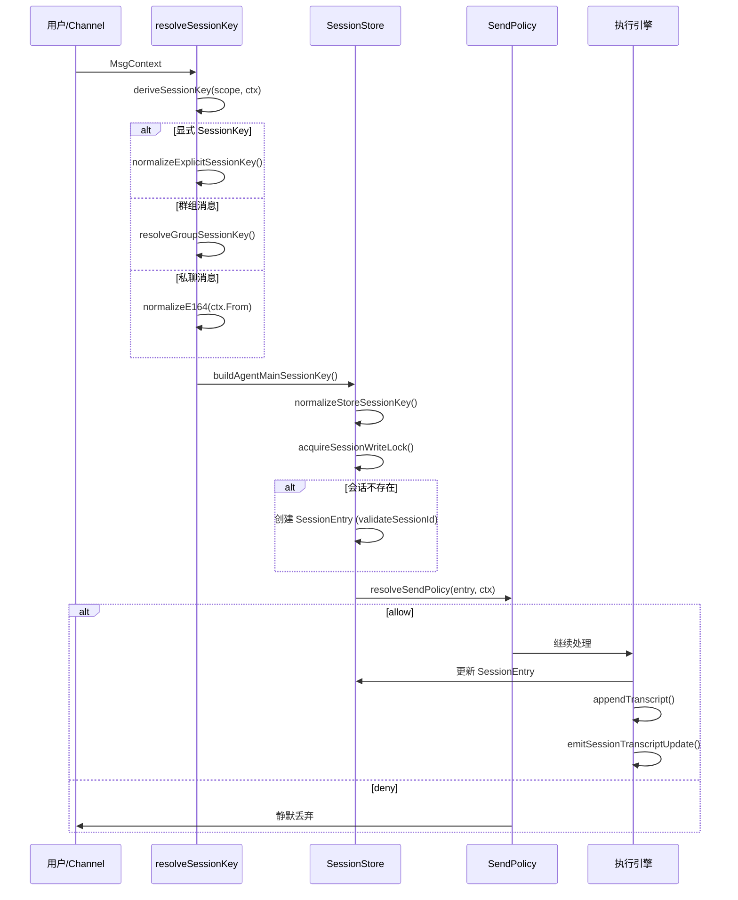

---

## 源码关键代码解读

### 1. Session Key 解析工具

```typescript
// session-key-utils.ts

// 判断子代理会话
export function isSubagentSessionKey(sessionKey: string | undefined | null): boolean {
  const raw = sessionKey?.trim() ?? "";
  if (raw.toLowerCase().startsWith("subagent:")) return true;
  const parsed = parseAgentSessionKey(raw);
  return (parsed?.rest ?? "").toLowerCase().startsWith("subagent:");
}

// 判断 Cron 运行会话
export function isCronRunSessionKey(sessionKey: string | undefined | null): boolean {
  const parsed = parseAgentSessionKey(sessionKey);
  if (!parsed) return false;
  return /^cron:[^:]+:run:[^:]+$/.test(parsed.rest);
}

// 判断 ACP 会话
export function isAcpSessionKey(sessionKey: string | undefined | null): boolean {
  const raw = sessionKey?.trim() ?? "";
  if (raw.toLowerCase().startsWith("acp:")) return true;
  const parsed = parseAgentSessionKey(raw);
  return (parsed?.rest ?? "").toLowerCase().startsWith("acp:");
}

// 解析线程父会话
export function resolveThreadParentSessionKey(
  sessionKey: string | undefined | null,
): string | null {
  const THREAD_SESSION_MARKERS = [":thread:", ":topic:"];
  const normalized = sessionKey?.toLowerCase() ?? "";
  for (const marker of THREAD_SESSION_MARKERS) {
    const idx = normalized.lastIndexOf(marker);
    if (idx > 0) return sessionKey!.slice(0, idx).trim();
  }
  return null;
}
```

### 2. 群组 Key 解析

```typescript
// group.ts
export function resolveGroupSessionKey(ctx: MsgContext): GroupKeyResolution | undefined {
  // 优先使用显式群组 ID
  if (ctx.GroupId?.trim()) {
    return {
      key: `group:${ctx.GroupId.trim()}`,
      id: ctx.GroupId.trim(),
      chatType: "group",
    };
  }

  // 从 RoomId + Sender 推导 channel 类型
  if (ctx.RoomId?.trim() && ctx.Sender?.trim()) {
    return {
      key: `channel:${ctx.RoomId}:${ctx.Sender}`,
      id: ctx.RoomId,
      chatType: "channel",
    };
  }

  return undefined;
}
```

### 3. Store 缓存加载

```typescript
// store.ts
function loadSessionStore(storePath: string): Record<string, SessionEntry> {
  // 1. 检查内存缓存
  const cached = SESSION_STORE_CACHE.get(storePath);
  if (cached && isSessionStoreCacheValid(cached)) {
    const currentMtimeMs = getFileMtimeMs(storePath);
    if (currentMtimeMs === cached.mtimeMs) {
      return structuredClone(cached.store); // 深拷贝防止外部修改
    }
  }

  // 2. 从磁盘加载
  let store: Record<string, SessionEntry> = {};
  try {
    const raw = fs.readFileSync(storePath, "utf-8");
    store = JSON.parse(raw);
  } catch {
    // 文件不存在或解析失败 → 空 Store
  }

  // 3. 写回缓存
  SESSION_STORE_CACHE.set(storePath, {
    store: structuredClone(store),
    loadedAt: Date.now(),
    storePath,
    mtimeMs: getFileMtimeMs(storePath),
  });

  return store;
}
```

### 4. 会话条目合并

```typescript
// types.ts
export function mergeSessionEntry(
  existing: SessionEntry | undefined,
  patch: Partial<SessionEntry>,
): SessionEntry {
  const sessionId = patch.sessionId ?? existing?.sessionId ?? crypto.randomUUID();
  const updatedAt = Math.max(
    existing?.updatedAt ?? 0,
    patch.updatedAt ?? 0,
    Date.now(),
  );

  if (!existing) return { ...patch, sessionId, updatedAt };
  return { ...existing, ...patch, sessionId, updatedAt };
}
```

---

## 常见问题

### Q1: Session Key 的大小写敏感吗？

不敏感。所有 Session Key 在存储和查询前都会经过 `normalizeStoreSessionKey()` 处理（`trim().toLowerCase()`），确保一致性。

### Q2: 缓存 TTL 如何调整？

```bash
# 禁用缓存（每次从磁盘读取）
export OPENCLAW_SESSION_CACHE_TTL_MS=0

# 自定义 TTL（60 秒）
export OPENCLAW_SESSION_CACHE_TTL_MS=60000
```

### Q3: 如何判断子代理的嵌套深度？

```typescript
import { getSubagentDepth } from "./sessions/session-key-utils.js";

getSubagentDepth("agent:default:subagent:a:1");
// → 1

getSubagentDepth("agent:default:subagent:a:1:subagent:b:2");
// → 2
```

### Q4: Session ID 有什么格式要求？

必须匹配 `/^[a-z0-9][a-z0-9._-]{0,127}$/i`：以字母数字开头，仅包含字母、数字、点、下划线、连字符，最长 128 字符。

### Q5: Store 文件过大怎么办？

系统会自动执行维护操作：
1. `pruneStaleEntries()` 清理过期条目
2. `capEntryCount()` 限制最大条目数
3. `rotateSessionFile()` 轮转大文件
4. `enforceSessionDiskBudget()` 控制总磁盘占用

### Q6: Windows 环境下 Store 读取报错？

Windows 文件系统可能出现读取竞争。Session Store 内置了重试机制（每次等待 50ms），通常能自动恢复。如果持续失败，检查是否有其他进程锁定了 `sessions.json`。

---

*基于 OpenClaw v2026.2.3-1 源码分析*
