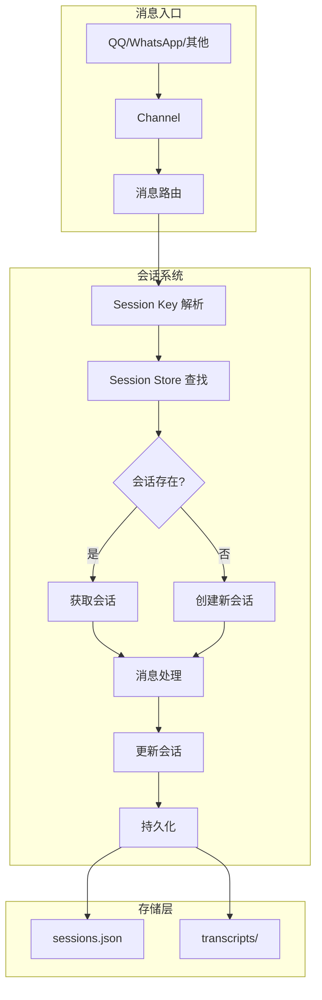
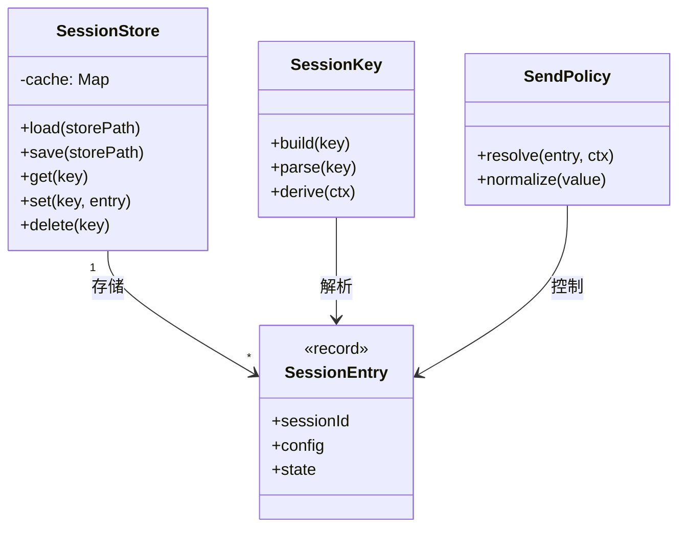
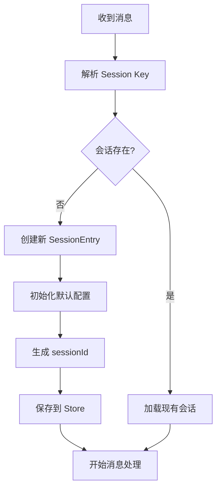

# OpenClaw 会话系统源码深度分析

> 基于源码的全面解析，帮助你深入理解 OpenClaw 的会话管理机制

## 目录

- [概述](#概述)
- [核心概念](#核心概念)
  - [Session Key](#session-key)
  - [Session Entry](#session-entry)
  - [Session Scope](#session-scope)
- [架构设计](#架构设计)
  - [目录结构](#目录结构)
  - [组件关系](#组件关系)
- [核心组件详解](#核心组件详解)
  - [Session Store](#session-store)
  - [Session Key Utils](#session-key-utils)
  - [Send Policy](#send-policy)
  - [Transcript](#transcript)
- [会话生命周期](#会话生命周期)
  - [会话创建](#会话创建)
  - [消息路由](#消息路由)
  - [会话存储](#会话存储)
- [会话类型](#会话类型)
  - [主会话](#主会话)
  - [子会话](#子会话)
  - [线程会话](#线程会话)
  - [Cron 会话](#cron-会话)
- [配置选项](#配置选项)
- [使用指南](#使用指南)
  - [消息路由](#消息路由-1)
  - [会话策略](#会话策略)
  - [队列模式](#队列模式)
- [源码关键代码解读](#源码关键代码解读)
- [常见问题](#常见问题)

---

## 概述

OpenClaw 的会话系统是整个框架的核心，负责：

1. **消息路由** - 将消息路由到正确的会话
2. **状态管理** - 维护会话状态（模型、配置、技能等）
3. **历史记录** - 持久化会话历史
4. **策略控制** - 控制消息发送策略

### 核心特性

| 特性 | 描述 |
|------|------|
| **多会话支持** | 主会话、子会话、线程会话 |
| **灵活路由** | 基于发送者、群组、线程的路由 |
| **持久化** | JSON5 格式，45秒缓存 |
| **策略控制** | 发送策略、队列模式精细控制 |
| **会话标签** | 支持标签、显示名称 |

### 系统定位



---

## 核心概念

### Session Key

Session Key 是会话的唯一标识符，格式如下：

```
主会话: agent:{agentId}:main:{channelType}:{target}

子会话: agent:{agentId}:subagent:{name}:{id}

线程会话: agent:{agentId}:thread:{threadId}:{channelType}:{target}

群组会话: agent:{agentId}:group:{groupId}:{channelType}

Cron 会话: agent:{agentId}:cron:{name}:run:{id}
```

#### 示例

```
# 主会话 (QQ 私聊)
agent:default:main:qqbot:5DE05A2765375641985DB70CAE9611DB

# 群组会话
agent:default:group:12345678:qqbot:group_12345678

# 线程会话
agent:default:thread:1001:qqbot:5DE05A2765375641985DB70CAE9611DB

# 子会话
agent:default:subagent:memory:uuid-123

# Cron 会话
agent:default:cron:reminder:run:uuid-456
```

#### Key 解析

```typescript
// session-key-utils.ts
export function parseAgentSessionKey(sessionKey: string): ParsedAgentSessionKey | null {
  const parts = sessionKey.split(":").filter(Boolean);
  if (parts.length < 3 || parts[0] !== "agent") {
    return null;
  }
  const agentId = parts[1];
  const rest = parts.slice(2).join(":");
  return { agentId, rest };
}

// 判断会话类型
isSubagentSessionKey(key)      // 是否子会话
isAcpSessionKey(key)           // 是否 ACP 会话
isCronRunSessionKey(key)       // 是否 Cron 运行
```

### Session Entry

Session Entry 存储会话的完整状态：

```typescript
// types.ts
export type SessionEntry = {
  // 核心标识
  sessionId: string;
  updatedAt: number;
  sessionFile?: string;
  
  // 父子关系
  spawnedBy?: string;  // 父会话 key
  
  // 执行配置
  thinkingLevel?: string;
  verboseLevel?: string;
  reasoningLevel?: string;
  elevatedLevel?: string;
  
  // 模型配置
  providerOverride?: string;
  modelOverride?: string;
  model?: string;
  modelProvider?: string;
  
  // 消息队列
  queueMode?: "steer" | "followup" | "collect" | "steer-backlog" | "steer+backlog" | "queue" | "interrupt";
  queueDebounceMs?: number;
  queueCap?: number;
  queueDrop?: "old" | "new" | "summarize";
  
  // 发送策略
  sendPolicy?: "allow" | "deny";
  
  // Token 统计
  inputTokens?: number;
  outputTokens?: number;
  totalTokens?: number;
  contextTokens?: number;
  
  // 压缩计数
  compactionCount?: number;
  
  // 记忆刷新
  memoryFlushAt?: number;
  memoryFlushCompactionCount?: number;
  
  // CLI 会话
  cliSessionIds?: Record<string, string>;
  
  // 元数据
  label?: string;
  displayName?: string;
  channel?: string;
  groupId?: string;
  subject?: string;
  
  // 来源信息
  origin?: SessionOrigin;
  chatType?: SessionChatType;
  
  // 技能快照
  skillsSnapshot?: SessionSkillSnapshot;
  
  // 系统提示报告
  systemPromptReport?: SessionSystemPromptReport;
};
```

### Session Scope

```typescript
export type SessionScope = "per-sender" | "global";

// per-sender: 每个发送者独立会话
// global: 全局单一会话
```

---

## 架构设计

### 目录结构

```
src/config/sessions/
├── types.ts              # 类型定义
├── store.ts             # 会话存储 (核心)
├── session-key.ts       # Session Key 构建
├── group.ts            # 群组会话解析
├── metadata.ts         # 元数据管理
├── main-session.ts     # 主会话配置
├── paths.ts            # 路径解析
├── reset.ts            # 重置逻辑
├── transcript.ts       # 记录管理
└── send-policy.ts      # 发送策略

src/sessions/
├── session-key-utils.ts # Key 工具函数
├── send-policy.ts       # 策略解析
├── session-label.ts    # 标签管理
└── transcript-events.ts # 记录事件
```

### 组件关系



---

## 核心组件详解

### Session Store

#### 核心职责

1. **加载/保存** - 从 JSON5 文件加载和保存会话
2. **缓存管理** - 45秒 TTL 缓存
3. **自动保存** - 定期刷新到磁盘

#### 缓存机制

```typescript
// store.ts
const SESSION_STORE_CACHE = new Map<string, SessionStoreCacheEntry>();
const DEFAULT_SESSION_STORE_TTL_MS = 45_000;  // 45秒

function isSessionStoreCacheValid(entry: SessionStoreCacheEntry): boolean {
  const now = Date.now();
  const ttl = getSessionStoreTtl();
  return now - entry.loadedAt <= ttl;
}

// 加载时先检查缓存
function loadSessionStore(storePath: string): Record<string, SessionEntry> {
  const cached = SESSION_STORE_CACHE.get(storePath);
  if (cached && isSessionStoreCacheValid(cached)) {
    return structuredClone(cached.store);  // 返回深拷贝
  }
  // 缓存失效，从磁盘加载
}
```

#### 存储格式

```json5
// sessions.json
{
  "agent:default:main:qqbot:5DE05A2765375641985DB70CAE9611DB": {
    "sessionId": "uuid-123",
    "updatedAt": 1704889600000,
    "model": "claude-sonnet-4-20250514",
    "thinkingLevel": "medium",
    "inputTokens": 15000,
    "outputTokens": 5000,
    "queueMode": "steer",
    "channel": "qqbot",
    "lastTo": "5DE05A2765375641985DB70CAE9611DB"
  }
}
```

#### 关键方法

```typescript
class SessionStore {
  // 获取会话
  get(key: string): SessionEntry | undefined
  
  // 设置会话
  set(key: string, entry: SessionEntry): void
  
  // 删除会话
  delete(key: string): void
  
  // 合并会话 (用于更新)
  merge(key: string, patch: Partial<SessionEntry>): SessionEntry
  
  // 清理过期会话
  prune(maxAgeMs: number): number
  
  // 备份
  backup(): void
}
```

### Session Key Utils

```typescript
// session-key-utils.ts

// 解析 Session Key
export function parseAgentSessionKey(
  sessionKey: string | undefined | null,
): ParsedAgentSessionKey | null {
  const parts = sessionKey.split(":").filter(Boolean);
  if (parts.length < 3 || parts[0] !== "agent") {
    return null;
  }
  return {
    agentId: parts[1],
    rest: parts.slice(2).join(":"),
  };
}

// 判断会话类型
export function isSubagentSessionKey(sessionKey: string | undefined | null): boolean {
  const raw = sessionKey?.trim() ?? "";
  if (raw.toLowerCase().startsWith("subagent:")) {
    return true;
  }
  const parsed = parseAgentSessionKey(raw);
  return (parsed?.rest ?? "").toLowerCase().startsWith("subagent:");
}

export function isCronRunSessionKey(sessionKey: string | undefined | null): boolean {
  const parsed = parseAgentSessionKey(sessionKey);
  if (!parsed) return false;
  return /^cron:[^:]+:run:[^:]+$/.test(parsed.rest);
}

export function isAcpSessionKey(sessionKey: string | undefined | null): boolean {
  const raw = sessionKey?.trim() ?? "";
  if (raw.toLowerCase().startsWith("acp:")) {
    return true;
  }
  const parsed = parseAgentSessionKey(raw);
  return (parsed?.rest ?? "").toLowerCase().startsWith("acp:");
}

// 解析线程父会话
export function resolveThreadParentSessionKey(
  sessionKey: string | undefined | null,
): string | null {
  const THREAD_SESSION_MARKERS = [":thread:", ":topic:"];
  const normalized = sessionKey?.toLowerCase() ?? "";
  
  for (const marker of THREAD_SESSION_MARKERS) {
    const idx = normalized.lastIndexOf(marker);
    if (idx > 0) {
      return sessionKey!.slice(0, idx).trim();
    }
  }
  return null;
}
```

### Send Policy

发送策略控制消息是否被允许发送：

```typescript
// send-policy.ts

export type SessionSendPolicyDecision = "allow" | "deny";

export function resolveSendPolicy(params: {
  cfg: OpenClawConfig;
  entry?: SessionEntry;
  sessionKey?: string;
  channel?: string;
  chatType?: SessionChatType;
}): SessionSendPolicyDecision {
  // 1. 检查会话级别的覆盖
  const override = normalizeSendPolicy(params.entry?.sendPolicy);
  if (override) {
    return override;
  }
  
  // 2. 检查全局策略
  const policy = params.cfg.session?.sendPolicy;
  if (!policy) {
    return "allow";
  }
  
  // 3. 匹配规则
  for (const rule of policy.rules ?? []) {
    const action = normalizeSendPolicy(rule.action) ?? "allow";
    const match = rule.match ?? {};
    
    // 匹配通道
    if (match.channel && match.channel !== channel) {
      continue;
    }
    
    // 匹配会话类型
    if (match.chatType && match.chatType !== chatType) {
      continue;
    }
    
    // 匹配 Key 前缀
    if (match.keyPrefix && !sessionKey.startsWith(match.keyPrefix)) {
      continue;
    }
    
    // 命中拒绝规则
    if (action === "deny") {
      return "deny";
    }
  }
  
  return "allow";
}
```

#### 配置示例

```json
{
  "session": {
    "sendPolicy": {
      "default": "allow",
      "rules": [
        {
          "action": "deny",
          "match": {
            "channel": "qqbot",
            "chatType": "group"
          }
        }
      ]
    }
  }
}
```

### Transcript

```typescript
// transcript.ts

export interface TranscriptEntry {
  role: "user" | "assistant" | "system";
  content: string;
  timestamp: number;
  metadata?: {
    tokens?: number;
    model?: string;
    thinking?: string;
  };
}

// 添加记录
export function appendTranscript(
  sessionDir: string,
  entry: TranscriptEntry
): void {
  const transcriptPath = path.join(sessionDir, "transcript.jsonl");
  const line = JSON.stringify({
    ...entry,
    timestamp: entry.timestamp ?? Date.now(),
  });
  fs.appendFileSync(transcriptPath, line + "\n");
}

// 读取历史
export function readTranscript(
  sessionDir: string,
  limit?: number
): TranscriptEntry[] {
  const transcriptPath = path.join(sessionDir, "transcript.jsonl");
  const lines = fs.readFileSync(transcriptPath, "utf-8").split("\n");
  return lines
    .filter(Boolean)
    .slice(-(limit ?? 100))
    .map(line => JSON.parse(line));
}
```

---

## 会话生命周期

### 会话创建流程



### 消息路由

```typescript
// sessions.ts
export function resolveSessionKey(
  scope: SessionScope,
  ctx: MsgContext,
  mainKey?: string
): string {
  // 1. 优先使用显式指定的 Key
  if (ctx.SessionKey?.trim()) {
    return ctx.SessionKey.toLowerCase();
  }
  
  // 2. 推导 Key
  const raw = deriveSessionKey(scope, ctx);
  
  // 3. 群组会话保持独立
  const isGroup = raw.includes(":group:") || raw.includes(":channel:");
  if (isGroup) {
    return `agent:${DEFAULT_AGENT_ID}:${raw}`;
  }
  
  // 4. 非群组会话归一到主会话
  const canonicalMainKey = buildAgentMainSessionKey({
    agentId: DEFAULT_AGENT_ID,
    mainKey: mainKey ?? "main",
  });
  
  return canonicalMainKey;
}
```

### 作用域解析

```typescript
export function deriveSessionKey(scope: SessionScope, ctx: MsgContext) {
  if (scope === "global") {
    return "global";
  }
  
  // 群组会话
  const resolvedGroup = resolveGroupSessionKey(ctx);
  if (resolvedGroup) {
    return resolvedGroup.key;
  }
  
  // 私聊会话 (基于发送者)
  const from = normalizeE164(ctx.From) ?? "";
  return from || "unknown";
}
```

---

## 会话类型

### 主会话

```typescript
// 每个用户/群组对应一个主会话
agent:default:main:qqbot:{target}

特点：
- 默认会话类型
- 所有私聊归一到各自的主会话
- 群组会话保持独立
```

### 子会话

```typescript
// 由父会话派生的独立会话
agent:default:subagent:{name}:{uuid}

特点：
- 独立的状态和历史
- 共享父会话的上下文
- 用于并行任务处理

示例：
agent:default:subagent:memory:abc123
agent:default:subagent:research:def456
```

### 线程会话

```typescript
// 群组内的线程/话题
agent:default:thread:{threadId}:qqbot:{groupId}

特点：
- 群组内支持多个独立线程
- 线程间消息隔离
- 父会话为群组主会话

示例：
agent:default:thread:1001:qqbot:group_12345678
```

### Cron 会话

```typescript
// 定时任务会话
agent:default:cron:{name}:run:{uuid}

特点：
- 定时触发
- 独立的执行上下文
- 任务完成后可清理

示例：
agent:default:cron:daily-summary:run:uuid-789
```

---

## 配置选项

### 全局配置

```json
{
  "session": {
    "scope": "per-sender",
    "resetTriggers": ["/new", "/reset"],
    "idleMinutes": 60,
    "sendPolicy": {
      "default": "allow",
      "rules": []
    }
  }
}
```

### 会话条目配置

```typescript
// 可在会话中动态配置
{
  "thinkingLevel": "medium",
  "verboseLevel": "on",
  "reasoningLevel": "high",
  "queueMode": "steer",
  "queueDebounceMs": 3000,
  "queueCap": 10,
  "sendPolicy": "allow"
}
```

### 队列模式

| 模式 | 描述 |
|------|------|
| `steer` | 转向消息可中断当前执行 |
| `followup` | 后续消息等当前执行完成 |
| `collect` | 收集多条消息后统一处理 |
| `steer-backlog` | 转向 + 积压模式 |
| `steer+backlog` | 组合模式 |
| `queue` | 严格队列 |
| `interrupt` | 强制中断 |

---

## 使用指南

### 消息路由

```typescript
// 根据消息上下文解析会话 Key
import { resolveSessionKey, deriveSessionKey } from "./sessions.js";

// 私聊消息
const key1 = resolveSessionKey("per-sender", {
  From: "5DE05A2765375641985DB70CAE9611DB",
  SessionKey: undefined
});
// -> "agent:default:main:qqbot:5de05a..."

// 群组消息
const key2 = resolveSessionKey("per-sender", {
  From: "12345678",
  SessionKey: undefined
});
// -> "agent:default:group:12345678:qqbot:group_12345678"

// 线程消息
const key3 = resolveSessionKey("per-sender", {
  From: "12345678",
  SessionKey: "agent:default:thread:1001:qqbot:group_12345678"
});
// -> "agent:default:thread:1001:qqbot:group_12345678"
```

### 会话策略

```typescript
import { resolveSendPolicy } from "./sessions/send-policy.js";

// 检查是否允许发送
const decision = resolveSendPolicy({
  cfg: openclawConfig,
  entry: sessionEntry,
  channel: "qqbot",
  chatType: "group"
});

if (decision === "deny") {
  console.log("消息被策略阻止");
} else {
  // 发送消息
}
```

### 会话操作

```typescript
// 获取会话
const entry = sessionStore.get(sessionKey);

// 更新会话配置
sessionStore.set(sessionKey, {
  ...entry,
  thinkingLevel: "high",
  modelOverride: "claude-sonnet-4"
});

// 合并更新
const updated = sessionStore.merge(sessionKey, {
  queueMode: "steer"
});

// 删除会话
sessionStore.delete(sessionKey);
```

---

## 源码关键代码解读

### 1. 会话 Key 解析

```typescript
// session-key.ts
export function buildAgentMainSessionKey(params: {
  agentId: string;
  mainKey: string;
}): string {
  const mainKey = params.mainKey.trim().toLowerCase();
  if (!mainKey) {
    throw new Error("Main key must be non-empty");
  }
  return `agent:${params.agentId}:main:${mainKey}`;
}

export function buildAgentSubagentSessionKey(params: {
  agentId: string;
  name: string;
  id: string;
}): string {
  const name = params.name.trim().toLowerCase();
  const id = params.id.trim().toLowerCase();
  return `agent:${params.agentId}:subagent:${name}:${id}`;
}
```

### 2. 会话条目合并

```typescript
// types.ts
export function mergeSessionEntry(
  existing: SessionEntry | undefined,
  patch: Partial<SessionEntry>,
): SessionEntry {
  const sessionId = patch.sessionId ?? existing?.sessionId ?? crypto.randomUUID();
  const updatedAt = Math.max(
    existing?.updatedAt ?? 0,
    patch.updatedAt ?? 0,
    Date.now()
  );
  
  if (!existing) {
    return { ...patch, sessionId, updatedAt };
  }
  
  return { ...existing, ...patch, sessionId, updatedAt };
}
```

### 3. 群组 Key 解析

```typescript
// group.ts
export function resolveGroupSessionKey(
  ctx: MsgContext,
): GroupKeyResolution | undefined {
  // 优先使用显式群组 ID
  if (ctx.GroupId?.trim()) {
    const groupId = ctx.GroupId.trim();
    return {
      key: `group:${groupId}`,
      id: groupId,
      chatType: "group",
    };
  }
  
  // 从 RoomId 和 Sender 推导
  if (ctx.RoomId?.trim() && ctx.Sender?.trim()) {
    return {
      key: `channel:${ctx.RoomId}:${ctx.Sender}`,
      id: ctx.RoomId,
      chatType: "channel",
    };
  }
  
  return undefined;
}
```

### 4. 会话 Store 缓存

```typescript
// store.ts
function loadSessionStore(storePath: string): Record<string, SessionEntry> {
  // 1. 检查缓存
  const cached = SESSION_STORE_CACHE.get(storePath);
  if (cached && isSessionStoreCacheValid(cached)) {
    const currentMtimeMs = getFileMtimeMs(storePath);
    if (currentMtimeMs === cached.mtimeMs) {
      return structuredClone(cached.store);  // 深拷贝防止外部修改
    }
  }
  
  // 2. 加载文件
  let store: Record<string, SessionEntry> = {};
  try {
    const raw = fs.readFileSync(storePath, "utf-8");
    const parsed = JSON5.parse(raw);
    store = parsed;
  } catch (err) {
    // 文件不存在或解析失败
  }
  
  // 3. 更新缓存
  SESSION_STORE_CACHE.set(storePath, {
    store: structuredClone(store),
    loadedAt: Date.now(),
    storePath,
    mtimeMs: getFileMtimeMs(storePath),
  });
  
  return store;
}
```

---

## 常见问题

### Q1: 如何创建子会话？

```typescript
import { buildAgentSubagentSessionKey } from "./sessions/session-key.js";

const subagentKey = buildAgentSubagentSessionKey({
  agentId: "default",
  name: "research",
  id: crypto.randomUUID()
});
// -> "agent:default:subagent:research:uuid-xxx"
```

### Q2: 如何实现线程支持？

```typescript
import { resolveThreadParentSessionKey } from "./sessions/session-key-utils.js";

// 从线程会话获取父会话
const parentKey = resolveThreadParentSessionKey(
  "agent:default:thread:1001:qqbot:group_123"
);
// -> "agent:default:group:qqbot:group_123"
```

### Q3: 缓存不生效？

检查环境变量：

```bash
# 禁用缓存
export OPENCLAW_SESSION_CACHE_TTL_MS=0

# 或设置自定义 TTL
export OPENCLAW_SESSION_CACHE_TTL_MS=60000  # 60秒
```

### Q4: 如何清理过期会话？

```typescript
import { pruneSessions } from "./sessions/store.js";

const prunedCount = pruneSessions({
  maxAgeMs: 7 * 24 * 60 * 60 * 1000,  // 7天
  maxEntries: 100,
});
console.log(`清理了 ${prunedCount} 个会话`);
```

### Q5: 会话 ID 冲突？

Session ID 是随机 UUID，由 `crypto.randomUUID()` 生成。理论上不会冲突。

```typescript
// 确保唯一性
const sessionId = crypto.randomUUID();
// 示例: "550e8400-e29b-41d4-a716-446655440000"
```

---

## 总结

OpenClaw 会话系统核心要点：

1. **Session Key** - 唯一标识，支持多种格式
2. **Session Entry** - 存储完整状态
3. **Session Store** - JSON5 存储 + 45秒缓存
4. **灵活路由** - 支持主会话、子会话、线程
5. **策略控制** - 发送策略、队列模式
6. **自动管理** - 压缩、清理、备份

掌握这些概念，就能高效使用 OpenClaw 的会话系统！
