# OpenClaw Skills 系统源码深度分析

> 从设计理念到实现细节，全面解析 OpenClaw 最具特色的渐进式技能加载系统

## 目录

- [设计理念](#设计理念)
- [Skills 是什么](#skills-是什么)
- [SKILL.md 编写规范](#skillmd-编写规范)
- [内置 Skills 全景](#内置-skills-全景)
- [Skills 发现与加载](#skills-发现与加载)
- [渐进式披露机制](#渐进式披露机制)
- [Frontmatter 解析](#frontmatter-解析)
- [过滤与资格评估](#过滤与资格评估)
- [Prompt 构建与注入](#prompt-构建与注入)
- [Skill Snapshot 缓存机制](#skill-snapshot-缓存机制)
- [环境变量注入与安全](#环境变量注入与安全)
- [Skills 安装系统](#skills-安装系统)
- [远程节点 Skills](#远程节点-skills)
- [Skills 文件监控与刷新](#skills-文件监控与刷新)
- [插件提供的 Skills](#插件提供的-skills)
- [Gateway 协议与 CLI 命令](#gateway-协议与-cli-命令)
- [工具执行与 Skills 信任](#工具执行与-skills-信任)
- [配置参考](#配置参考)
- [完整生命周期](#完整生命周期)
- [常见问题](#常见问题)

---

## 设计理念

OpenClaw 的 Skills 系统是整个项目中最具独创性的设计之一，它解决了一个根本矛盾：**Agent 需要丰富的能力，但 LLM 上下文窗口是有限的**。

传统做法是把所有工具和指令塞进 system prompt，但这样 50 个技能就可能消耗掉上万个 token，挤占真正有用的对话空间。OpenClaw 的解决方案是**渐进式披露（Progressive Disclosure）**：

1. **总是加载**的只有技能名和描述（每个约 100 字符），50 个技能也就 ~5000 字符
2. **条件加载**完整的 SKILL.md 内容（通常 1-5KB），只在 LLM 判断需要时才读取
3. **按需执行**的脚本和资源（scripts/、references/），只在工具执行时才触发

这种三层架构让 OpenClaw 在不牺牲能力的前提下，将 Skills 对上下文的基础占用控制在极低水平。

其他设计原则：

- **多来源合并**：内置、管理、工作区、插件、额外目录，五个来源按优先级合并，同名技能高优先级覆盖低优先级
- **安全隔离**：Skills 注入的环境变量受严格过滤，危险变量被阻断，API Key 不会泄漏到子进程
- **远程执行**：通过 macOS/iOS 节点提供本地不可用的能力（如 macOS 专属工具），实现跨设备技能协作
- **自动安装**：通过 brew/npm/go/uv/download 五种方式自动安装依赖，降低使用门槛

---

## Skills 是什么

一个 Skill 本质上是一个**带有结构化元数据的 Markdown 文件**（`SKILL.md`），告诉 Agent 如何使用某种外部能力。它不是插件（不是代码），也不是工具定义（不直接注册工具函数），而是 Agent 的**操作手册**。

Skill 的目录结构：

```
my-skill/
├── SKILL.md              # 必须：技能说明文档
├── scripts/              # 可选：可执行脚本
│   ├── run.sh
│   └── helper.py
└── references/           # 可选：参考文档
    └── api-docs.md
```

Agent 使用 Skill 的流程：
1. 在 system prompt 中看到 `<available_skills>` 列表（只有名字和描述）
2. 判断某个 Skill 与用户请求匹配
3. 使用 `read` 工具读取该 Skill 的 `SKILL.md` 文件
4. 按照 SKILL.md 中的指令操作（可能调用 scripts/、读取 references/）

---

## SKILL.md 编写规范

### 基本格式

```markdown
---
name: weather
description: "Get current weather via wttr.in. Use when: user asks about weather. NOT for: historical data."
homepage: https://wttr.in/:help
metadata:
  {
    "openclaw":
      {
        "emoji": "☔",
        "requires": { "bins": ["curl"] },
      },
  }
---

# Weather Skill

## 使用方法

```bash
curl "wttr.in/Beijing?format=j1"
```

## 参数说明
- 城市名：中英文均可
- format=j1：JSON 输出
```

### Frontmatter 字段

| 字段 | 类型 | 必须 | 说明 |
|------|------|------|------|
| `name` | string | 是 | 技能唯一名称（用于合并和过滤） |
| `description` | string | 是 | 简短描述（注入到 prompt 中，要控制长度） |
| `homepage` | string | 否 | 技能主页链接 |
| `user-invocable` | boolean | 否 | 用户是否可直接调用（默认 true） |
| `disable-model-invocation` | boolean | 否 | 是否禁止 LLM 自动调用（默认 false） |
| `metadata` | object | 否 | OpenClaw 扩展元数据 |

### OpenClaw Metadata 字段

`metadata.openclaw` 对象：

| 字段 | 类型 | 说明 |
|------|------|------|
| `always` | boolean | 总是包含在 prompt 中（不受过滤影响） |
| `emoji` | string | 技能图标 |
| `homepage` | string | 技能主页 |
| `skillKey` | string | 自定义技能键（默认使用 name） |
| `primaryEnv` | string | 主要 API Key 环境变量名 |
| `os` | string[] | 限定操作系统（如 `["darwin", "linux"]`） |
| `requires.bins` | string[] | 必须的可执行文件（全部满足） |
| `requires.anyBins` | string[] | 可执行文件（任一满足） |
| `requires.env` | string[] | 必须的环境变量 |
| `requires.config` | string[] | 必须的配置路径 |
| `install` | SkillInstallSpec[] | 安装方式定义 |

### 安装规范示例

```yaml
metadata:
  openclaw:
    requires:
      bins: ["gh"]
    install:
      - id: brew
        kind: brew
        formula: gh
        bins: ["gh"]
        label: "Install GitHub CLI (brew)"
      - id: apt
        kind: apt
        package: gh
        bins: ["gh"]
        label: "Install GitHub CLI (apt)"
```

支持的安装类型：`brew`、`node`（npm/pnpm/yarn/bun）、`go`、`uv`、`download`。

### 编写最佳实践

1. **description 要精准**：这是 LLM 决定是否使用该 Skill 的唯一依据，要包含 "Use when" 和 "NOT for"
2. **Body 要实用**：包含具体命令、参数说明、示例输出，Agent 读完就能操作
3. **scripts/ 要自包含**：脚本应该处理好错误，返回明确的输出
4. **references/ 放大文档**：外部 API 文档、配置模板等放这里，按需读取

---

## 内置 Skills 全景

OpenClaw 内置 **51 个 Skill**，覆盖多个领域：

### 按类别分组

| 类别 | Skills | 说明 |
|------|--------|------|
| **开发工具** | github, gh-issues, coding-agent, diffs, skill-creator | Git/GitHub 操作、代码技能 |
| **通讯社交** | discord, slack, imsg, bluebubbles | 消息平台操作 |
| **笔记知识** | apple-notes, bear-notes, notion, obsidian, trello, things-mac | 笔记和任务管理 |
| **多媒体** | video-frames, openai-image-gen, camsnap, gifgrep, openai-whisper, openai-whisper-api, sherpa-onnx-tts, voice-call, songsee | 图像/音频/视频处理 |
| **网络工具** | weather, xurl, blogwatcher, nano-pdf, summarize | Web 请求、内容处理 |
| **系统工具** | tmux, session-logs, model-usage, healthcheck, peekaboo | 终端和系统管理 |
| **智能家居** | openhue, sonoscli, goplaces | 灯光、音响控制 |
| **邮件** | himalaya | 命令行邮件客户端 |
| **音乐** | spotify-player | Spotify 控制 |
| **密码管理** | 1password | 1Password CLI |
| **AI 生成** | gemini, oracle | AI 模型调用 |
| **平台特定** | canvas, clawhub, gog, sag | OpenClaw 内部功能 |

### 带脚本的 Skills

| Skill | 脚本 | 用途 |
|-------|------|------|
| video-frames | `scripts/frame.sh` | FFmpeg 帧提取 |
| tmux | `scripts/wait-for-text.sh`, `scripts/find-sessions.sh` | tmux 会话控制 |
| skill-creator | 5 个 Python 脚本 | Skill 创建和测试工具 |
| openai-whisper-api | `scripts/transcribe.sh` | 语音转文字 |
| openai-image-gen | `scripts/gen.py`, `scripts/test_gen.py` | OpenAI 图像生成 |
| model-usage | `scripts/model_usage.py` | 模型用量统计 |

### 带参考文档的 Skills

| Skill | 参考文档 |
|-------|----------|
| model-usage | `references/codexbar-cli.md` |
| himalaya | `references/message-composition.md`, `references/configuration.md` |
| 1password | `references/get-started.md`, `references/cli-examples.md` |

---

## Skills 发现与加载

### 多来源发现

源码：`src/agents/skills/workspace.ts` → `loadSkillEntries()`

Skills 从以下 7 个来源发现，**从低到高**优先级排列：

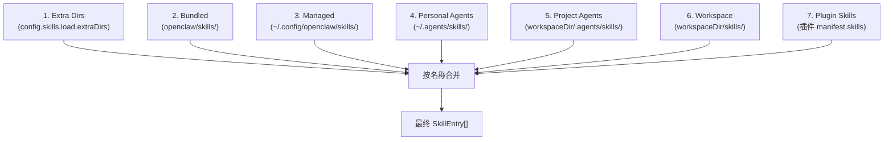

**合并规则**：后加载的来源覆盖先加载的同名 Skill。这意味着你可以在 workspace 中创建一个同名 Skill 来覆盖内置版本。

### Bundled Skills 目录解析

`src/agents/skills/bundled-dir.ts` → `resolveBundledSkillsDir()`：

1. `OPENCLAW_BUNDLED_SKILLS_DIR` 环境变量覆盖
2. 编译后的 `execPath/skills` 目录
3. `<packageRoot>/skills`（通过 `resolveOpenClawPackageRootSync()`）
4. Fallback：从模块目录向上查找（最多 6 层）

通过 `looksLikeSkillsDir(dir)` 验证：目录中是否有 `.md` 文件或 `*/SKILL.md`。

### 加载限制

| 常量 | 默认值 | 说明 |
|------|--------|------|
| `maxCandidatesPerRoot` | 300 | 每个来源目录最多扫描的候选数 |
| `maxSkillsLoadedPerSource` | 200 | 每个来源最多加载的 Skill 数 |
| `maxSkillsInPrompt` | 150 | 注入 prompt 的最大 Skill 数 |
| `maxSkillsPromptChars` | 30,000 | Skills prompt 的最大字符数 |
| `maxSkillFileBytes` | 256,000 | 单个 SKILL.md 的最大文件大小 |

### 加载流程

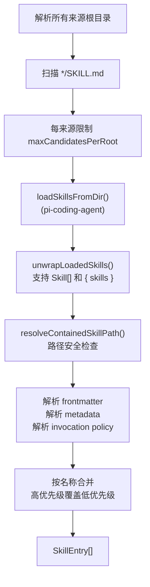

---

## 渐进式披露机制

这是 Skills 系统的核心设计，通过三层加载实现 token 最优利用：

### Layer 1: Metadata（总是加载）

**何时**：Agent 启动时立即加载所有 Skills 的 frontmatter。

**内容**：只有 `name`、`description`（及少量元数据），以 XML 格式注入 system prompt：

```xml
<available_skills>
  <skill>
    <name>weather</name>
    <description>Get current weather via wttr.in. Use when: user asks about weather.</description>
    <location>~/skills/weather/SKILL.md</location>
  </skill>
  <skill>
    <name>github</name>
    <description>GitHub operations via gh CLI: issues, PRs, CI runs, code review.</description>
    <location>~/skills/github/SKILL.md</location>
  </skill>
</available_skills>
```

**Token 开销**：
- 基础开销：~195 字符（`<available_skills>` 标签 + 指令）
- 每个 Skill：~97 字符 + name + description + location 的长度
- 50 个 Skill 约 5000-8000 字符

### Layer 2: SKILL.md Body（条件加载）

**何时**：LLM 判断某个 Skill 与用户请求匹配时，使用 `read` 工具读取完整 SKILL.md。

**触发机制**：System prompt 中的指令告诉 LLM：

```
## Skills (mandatory)
Before replying: scan <available_skills> <description> entries.
- If exactly one skill clearly applies: read its SKILL.md at <location> with `read`, then follow it.
- If multiple could apply: choose the most specific one, then read/follow it.
- If none clearly apply: do not read any SKILL.md.
Constraints: never read more than one skill up front; only read after selecting.
```

关键规则：**一次最多读一个 SKILL.md**，避免多 Skill 同时占用上下文。

### Layer 3: Resources（按需加载）

**何时**：Agent 在执行 Skill 操作过程中，根据 SKILL.md 的指引按需读取。

**内容**：
- `scripts/`：可执行脚本（通过 `exec` 工具执行）
- `references/`：参考文档（通过 `read` 工具读取）

---

## Frontmatter 解析

源码：`src/agents/skills/frontmatter.ts`

### 解析流程

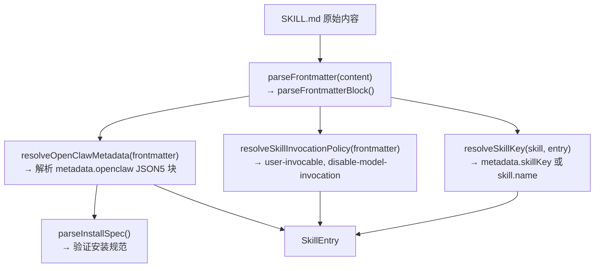

### 安装规范验证

`parseInstallSpec()` 对每种安装方式进行安全验证：

| 类型 | 验证规则 |
|------|----------|
| brew | formula 必须是合法的 brew formula 名 |
| node | package 必须是合法的 npm 包名 |
| go | module 必须是合法的 Go module 路径 |
| uv | package 必须是合法的 Python 包名 |
| download | URL 必须是 HTTPS，拒绝 `file:///`、`file:../` 等 |

---

## 过滤与资格评估

源码：`src/agents/skills/config.ts` → `shouldIncludeSkill()`

### 过滤流程

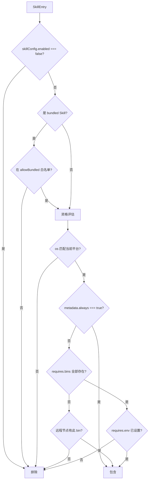

### Bundled Allowlist

- `config.skills.allowBundled`：字符串数组，仅影响 `openclaw-bundled` 来源的 Skills
- 空/未定义 = 允许所有 bundled Skills
- 设置后只允许列表中的 bundled Skills

### 远程资格评估

`SkillEligibilityContext.remote`：

当本地缺少某个 bin（如 macOS 专属工具）时，检查是否有远程 macOS 节点提供该 bin。如果有，Skill 仍然被标记为 eligible，Agent 可以通过 `nodes.run` 在远程节点执行。

---

## Prompt 构建与注入

### 构建管线

源码：`src/agents/skills/workspace.ts`, `src/agents/system-prompt.ts`

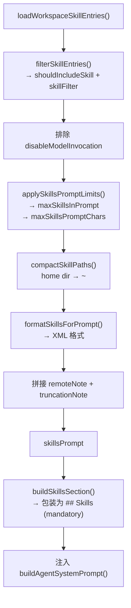

### Prompt 截断策略

当 Skills 超出限制时的处理：

1. 如果总字符数超过 `maxSkillsPromptChars`（默认 30,000），逐个移除最后的 Skill 直到 fit
2. 如果 Skill 数量超过 `maxSkillsInPrompt`（默认 150），截断
3. 被截断时添加 `truncationNote` 告知 LLM 有 N 个 Skills 因空间限制未展示

### System Prompt 中的位置

Skills section 在 system prompt 中的插入位置：

```
... Safety rules ...
## Skills (mandatory)
Before replying: scan <available_skills> <description> entries.
...
<available_skills>
  <skill>...</skill>
  ...
</available_skills>
... Memory section ...
```

---

## Skill Snapshot 缓存机制

源码：`src/agents/skills/workspace.ts` → `buildWorkspaceSkillSnapshot()`

### Snapshot 结构

```typescript
interface SkillSnapshot {
  prompt: string;                              // 格式化后的 skills prompt
  skills: Array<{
    name: string;
    primaryEnv?: string;
    requiredEnv?: string[];
  }>;
  skillFilter?: string[];                      // 应用的过滤器
  resolvedSkills?: Skill[];                    // 完整的 Skill 对象（用于 env 注入）
  version?: number;                            // 缓存版本号
}
```

### 缓存策略

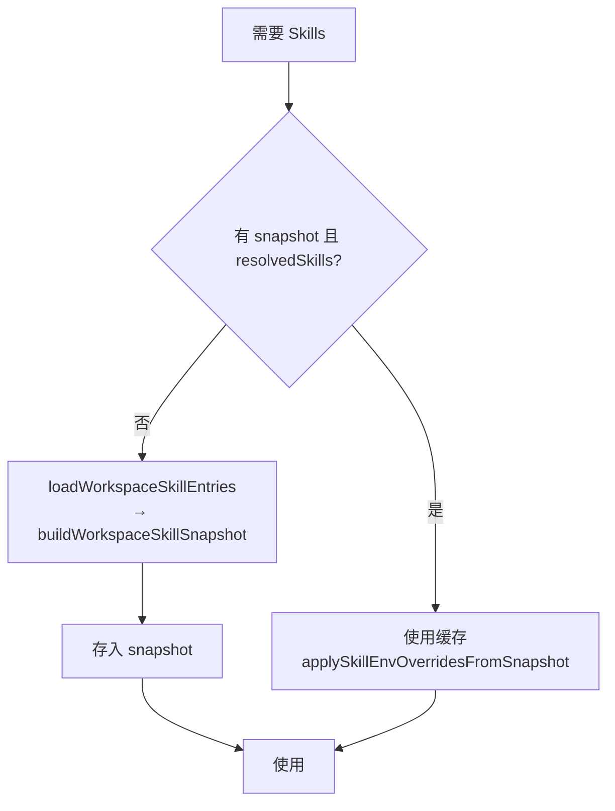

**版本管理**：

- `getSkillsSnapshotVersion(workspaceDir)`：获取当前版本号
- `bumpSkillsSnapshotVersion({ reason, changedPath })`：触发版本递增
- 版本变化触发 snapshot 重建

**使用场景**：

| 场景 | 代码位置 | 说明 |
|------|----------|------|
| Agent 运行 | `commands/agent.ts` | 构建 snapshot 传入 runEmbeddedPiAgent |
| Attempt 执行 | `pi-embedded-runner/run/attempt.ts` | resolveEmbeddedRunSkillEntries |
| Compaction | `pi-embedded-runner/compact.ts` | 压缩时重新加载 Skills |
| Cron 任务 | `cron/isolated-agent/skills-snapshot.ts` | 定时任务的 Skills |
| Session 更新 | `session-updates.ts` | 会话更新时的 Skills |

---

## 环境变量注入与安全

源码：`src/agents/skills/env-overrides.ts`

### 注入流程

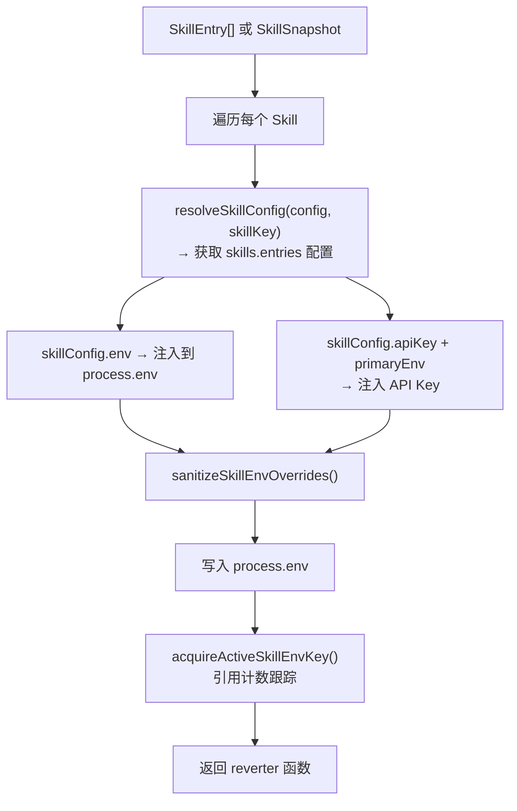

### 安全防护

多层安全确保 Skill 环境变量不会造成危害：

**1. 危险变量阻断**

以下变量**永远被阻断**，Skill 不能注入：

```
LD_PRELOAD, LD_LIBRARY_PATH, LD_AUDIT,
DYLD_INSERT_LIBRARIES, DYLD_LIBRARY_PATH,
NODE_OPTIONS, NODE_PATH,
PYTHONPATH, PYTHONHOME,
RUBYLIB, PERL5LIB,
BASH_ENV, ENV, GCONV_PATH, IFS,
SSLKEYLOGFILE, OPENSSL_CONF
```

**2. 值验证**

- 拒绝包含 null 字节的值
- 拒绝超过 32KB 的值
- 检测 base64-like 凭据格式

**3. 不覆盖现有值**

如果 `process.env[key]` 已经存在且不是由 Skill 设置的，Skill 值被跳过。

**4. 引用计数**

`acquireActiveSkillEnvKey` / `releaseActiveSkillEnvKey` 实现引用计数，支持多个 Skill 并发使用同一个 env key。

**5. 子进程隔离**

`getActiveSkillEnvKeys()` 返回当前注入的 key 列表，ACP harness 使用它来避免将这些 key 泄漏到子进程。

### Reverter 机制

每次注入返回一个 reverter 函数。Agent 运行结束后调用 reverter 恢复原始环境：

```typescript
const restoreSkillEnv = applySkillEnvOverrides({ skills, config });
try {
  // Agent 运行...
} finally {
  restoreSkillEnv(); // 恢复原始 process.env
}
```

---

## Skills 安装系统

源码：`src/agents/skills-install.ts`, `src/agents/skills-install-download.ts`

### 安装流程

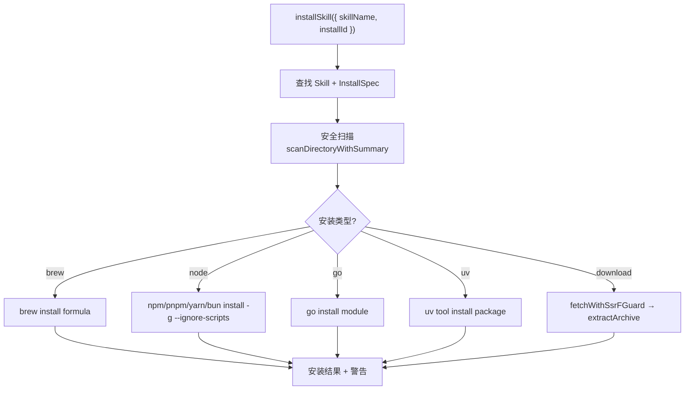

### 安装类型详解

| 类型 | 命令 | 自动安装依赖 |
|------|------|-------------|
| brew | `brew install <formula>` | — |
| node | `npm install -g --ignore-scripts <package>` | 根据 `prefs.nodeManager` 选择 npm/pnpm/yarn/bun |
| go | `go install <module>` | macOS: brew install go; Linux: apt install golang-go |
| uv | `uv tool install <package>` | brew install uv（如果缺失） |
| download | 下载 URL → 解压到 `CONFIG_DIR/tools/<hash>/` | 支持 tar.gz, tgz, tar.bz2, tbz2, zip |

### 安装偏好选择

当一个 Skill 有多种安装方式时，`selectPreferredInstallSpec` 按以下优先级选择：

1. 如果 `preferBrew` 且 brew 可用 → brew
2. uv
3. node
4. brew（即使不可用，给出更清晰的错误）
5. go
6. download
7. 第一个可用的 spec

---

## 远程节点 Skills

源码：`src/infra/skills-remote.ts`

### 设计场景

你在 Linux 服务器上运行 OpenClaw Gateway，但有些 Skills 需要 macOS 专属工具（如 Apple Notes、Things 等）。通过连接 macOS 设备作为远程节点，这些 Skills 仍然可用。

### 工作原理

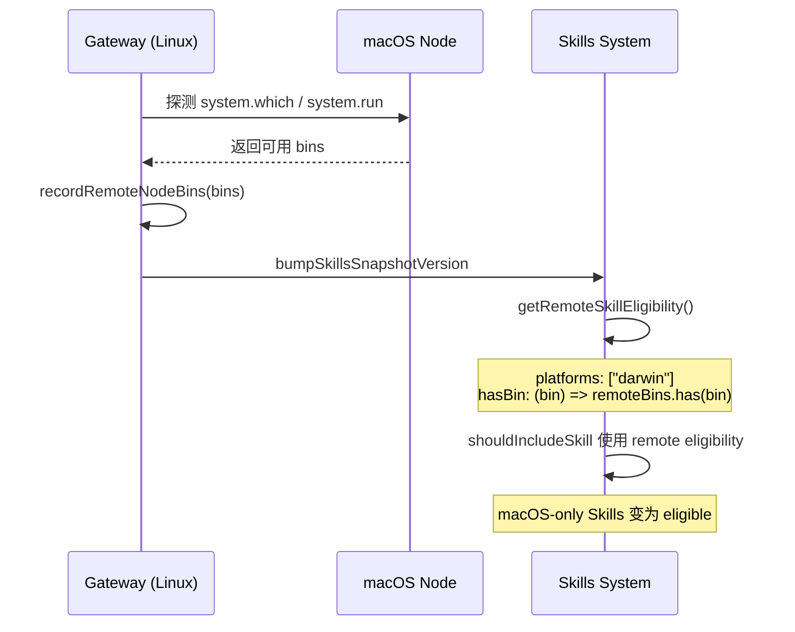

### 远程 Bin 探测

`refreshRemoteNodeBins()`：

1. 加载所有 workspace 的 skill entries
2. 收集 darwin 平台需要的 bins（`collectRequiredBins(entries, "darwin")`）
3. 对每个 macOS 节点：
   - 优先使用 `system.which`（批量查询）
   - 否则使用 `system.run`（shell 脚本 `command -v`）
4. 解析结果，更新 `remoteNodes` 状态
5. 如果 bins 变化，触发 `bumpSkillsSnapshotVersion`

### 远程 Note

当有远程 macOS 节点可用时，skills prompt 中会追加：

> Remote macOS node available (xxx). Run macOS-only skills via nodes.run on that node.

---

## Skills 文件监控与刷新

源码：`src/agents/skills/refresh.ts`

### 监控范围

`ensureSkillsWatcher({ workspaceDir, config })` 启动 chokidar 监控以下路径：

| 路径 | 说明 |
|------|------|
| `workspaceDir/skills` | 工作区 Skills |
| `workspaceDir/.agents/skills` | 项目 Agent Skills |
| `CONFIG_DIR/skills` | 管理 Skills |
| `~/.agents/skills` | 个人 Agent Skills |
| extra dirs | 额外配置的 Skills 目录 |
| plugin skill dirs | 插件提供的 Skills 目录 |

### 监控目标

- `*/SKILL.md`
- `*/*/SKILL.md`（嵌套一层）

### 忽略模式

```
.git, node_modules, dist, .venv, venv, __pycache__,
.mypy_cache, .pytest_cache, build, .cache
```

### 防抖

- 默认 250ms（`config.skills.load.watchDebounceMs`）
- 文件变化 → 防抖 → `bumpSkillsSnapshotVersion({ reason: "watch", changedPath })`

### 事件传播

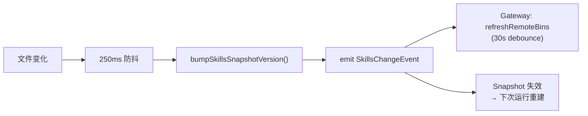

---

## 插件提供的 Skills

源码：`src/agents/skills/plugin-skills.ts`, `src/plugins/manifest.ts`

### 机制

插件可以通过 `openclaw.json` manifest 声明 Skills 目录：

```json
{
  "skills": ["skills/my-skill"]
}
```

### 解析流程

`resolvePluginSkillDirs({ workspaceDir, config })`：

1. 加载 plugin registry
2. 过滤已启用的插件
3. 解析 `record.skills` 路径（相对于 `record.rootDir`）
4. 返回绝对路径数组

### 已有的插件 Skills

| 插件 | Skill |
|------|-------|
| open-prose | `skills/prose` |
| feishu | `skills/feishu`, `skills/feishu-doc` |
| diffs | `skills/diffs` |
| acpx | `skills/acp-router` |

---

## Gateway 协议与 CLI 命令

### Gateway WS 方法

源码：`src/gateway/server-methods/skills.ts`

| 方法 | 参数 | 说明 |
|------|------|------|
| `skills.status` | `{ agentId? }` | 返回所有 Skills 的状态报告 |
| `skills.bins` | `{}` | 返回所有 Skills 需要的可执行文件列表 |
| `skills.install` | `{ skillName, installId, timeoutMs? }` | 安装指定 Skill 的依赖 |
| `skills.update` | `{ skillKey, enabled?, apiKey?, env? }` | 更新 Skill 配置 |

### CLI 命令

| 命令 | 入口 | 说明 |
|------|------|------|
| `openclaw configure` → skills | `commands/configure.wizard.ts` | 交互式 Skills 配置 |
| `openclaw onboard` → skills | `commands/onboard-skills.ts` | Skills 初始化引导 |
| `openclaw doctor` | `commands/doctor-workspace-status.ts` | Skills 健康检查 |

### Onboarding 流程

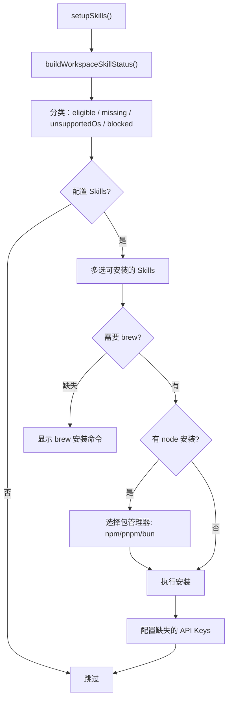

---

## 工具执行与 Skills 信任

源码：`src/infra/exec-approvals-allowlist.ts`

### Skill Bin 自动信任

当 `autoAllowSkills` 配置启用时，Skills 声明的可执行文件（`requires.bins`）会被自动加入工具执行的信任列表：

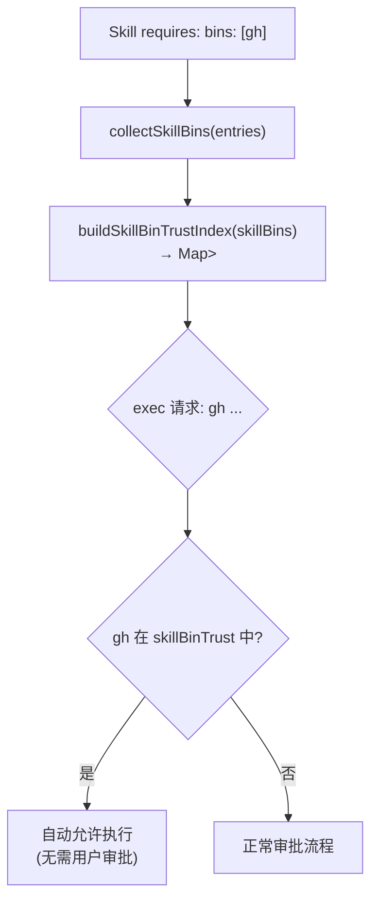

这意味着如果你安装了 `github` Skill（requires `gh`），Agent 使用 `gh` 命令时不需要额外的用户审批。

---

## 配置参考

### 完整配置结构

```json5
{
  skills: {
    // Bundled Skills 白名单（空 = 全部允许）
    allowBundled: ["github", "weather", "tmux"],

    load: {
      // 额外 Skills 目录
      extraDirs: ["~/my-skills"],
      // 是否启用文件监控
      watch: true,
      // 监控防抖时间
      watchDebounceMs: 250,
    },

    install: {
      // 优先使用 brew
      preferBrew: true,
      // Node 包管理器
      nodeManager: "pnpm",  // npm | pnpm | yarn | bun
    },

    limits: {
      maxCandidatesPerRoot: 300,
      maxSkillsLoadedPerSource: 200,
      maxSkillsInPrompt: 150,
      maxSkillsPromptChars: 30000,
      maxSkillFileBytes: 256000,
    },

    // 每个 Skill 的独立配置
    entries: {
      github: {
        enabled: true,
      },
      "openai-image-gen": {
        enabled: true,
        apiKey: "sk-...",  // 注入到 primaryEnv
        env: {
          CUSTOM_VAR: "value",
        },
      },
      weather: {
        enabled: false,  // 禁用
      },
    },
  },
}
```

---

## 完整生命周期

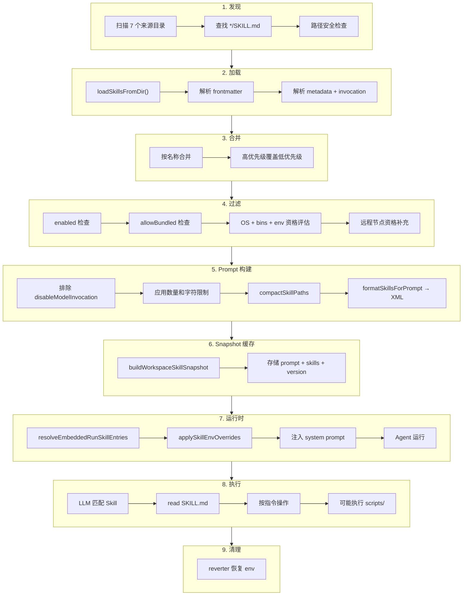

---

## 常见问题

### Q1: 如何创建自定义 Skill？

在 workspace 的 `skills/` 目录下创建子目录，编写 `SKILL.md`：

```bash
mkdir -p skills/my-tool
cat > skills/my-tool/SKILL.md << 'EOF'
---
name: my-tool
description: "操作 my-tool CLI。Use when: 用户提到 my-tool。NOT for: 其他工具。"
metadata: { "openclaw": { "requires": { "bins": ["my-tool"] } } }
---

# My Tool Skill

## 使用方法
...
EOF
```

重启 Gateway 或等待文件监控触发即可生效。

### Q2: 如何覆盖内置 Skill？

在 workspace `skills/` 目录下创建同名 Skill。Workspace 来源优先级高于 bundled，会自动覆盖。

### Q3: Skill 的 description 为什么那么重要？

因为 LLM 只能看到 `<available_skills>` 中的 name 和 description 来决定是否读取完整 SKILL.md。一个模糊的 description 会导致 LLM 在不该使用时读取该 Skill（浪费 token），或在该使用时忽略它（功能缺失）。

建议格式：`"简述功能。Use when: 使用场景。NOT for: 不适用场景。"`

### Q4: 为什么限制一次只读一个 SKILL.md？

Token 经济性。一个 SKILL.md 通常 1-5KB，如果允许同时读取多个，很快就会占满上下文窗口。一次一个的设计强制 LLM 做出选择，确保最相关的 Skill 获得完整的上下文空间。

### Q5: Skills 和 Plugins 有什么区别？

| 维度 | Skill | Plugin |
|------|-------|--------|
| 本质 | Markdown 文档 | TypeScript/JavaScript 代码 |
| 注册 | 文件系统发现 | `register(api)` 编程注册 |
| 能力 | 指导 Agent 使用现有工具 | 扩展系统功能（新工具、新通道） |
| 运行时 | Agent 通过 read 工具读取 | Gateway 启动时加载执行 |
| 安全性 | 无代码执行权限 | 完整 Node.js 权限 |
| 适用场景 | 集成外部 CLI 工具 | 添加新通道、新工具函数、新 Hook |

### Q6: 如何为 Skill 配置 API Key？

两种方式：

1. **配置文件**：`config.skills.entries.<skillKey>.apiKey`，自动注入到 `primaryEnv` 环境变量
2. **环境变量**：直接设置 `primaryEnv` 对应的环境变量（如 `OPENAI_API_KEY`）

配置文件方式更安全（不会出现在 shell history 中）。

### Q7: Skill 的 scripts/ 如何执行？

Skill 文档中引用 `{baseDir}/scripts/xxx.sh` 路径。Agent 使用 `exec` 工具执行该脚本。如果 `autoAllowSkills` 启用且脚本在 Skill 声明的 `bins` 范围内，执行不需要额外审批。

### Q8: 远程节点如何提供 Skill 能力？

当 macOS 设备作为节点连接到 Gateway 时，Gateway 会探测节点上可用的 binaries。如果某个 macOS-only Skill 的 `requires.bins` 在远程节点上存在，该 Skill 就变为 eligible。Agent 使用 `nodes.run` 在远程节点执行相关命令。

---

## 关键源码文件索引

| 文件 | 职责 |
|------|------|
| `src/agents/skills/types.ts` | 类型定义（SkillEntry, SkillSnapshot, SkillInstallSpec 等） |
| `src/agents/skills/workspace.ts` | 加载、过滤、prompt 构建、snapshot、同步 |
| `src/agents/skills/config.ts` | 过滤逻辑（shouldIncludeSkill, resolveSkillConfig） |
| `src/agents/skills/frontmatter.ts` | Frontmatter 解析、metadata 提取、install 验证 |
| `src/agents/skills/env-overrides.ts` | 环境变量注入与安全 |
| `src/agents/skills/refresh.ts` | 文件监控、版本管理 |
| `src/agents/skills/bundled-dir.ts` | Bundled Skills 目录解析 |
| `src/agents/skills/bundled-context.ts` | Bundled Skills 名称缓存 |
| `src/agents/skills/plugin-skills.ts` | 插件 Skills 目录解析 |
| `src/agents/skills/filter.ts` | Skill 过滤规范化 |
| `src/agents/skills/serialize.ts` | 按 key 序列化同步 |
| `src/agents/skills-install.ts` | 安装逻辑（brew/node/go/uv） |
| `src/agents/skills-install-download.ts` | 下载安装 |
| `src/agents/system-prompt.ts` | buildSkillsSection |
| `src/agents/pi-embedded-runner/skills-runtime.ts` | 运行时 Skills 解析 |
| `src/infra/skills-remote.ts` | 远程节点 Skills 能力 |
| `src/infra/exec-approvals-allowlist.ts` | Skill bin 自动信任 |
| `src/commands/onboard-skills.ts` | Onboarding 向导 |
| `src/gateway/server-methods/skills.ts` | Gateway WS 方法 |
| `src/config/types.skills.ts` | 配置类型定义 |

---

*基于 OpenClaw v2026.2.3-1 源码 `src/agents/skills/` 及相关模块分析*
