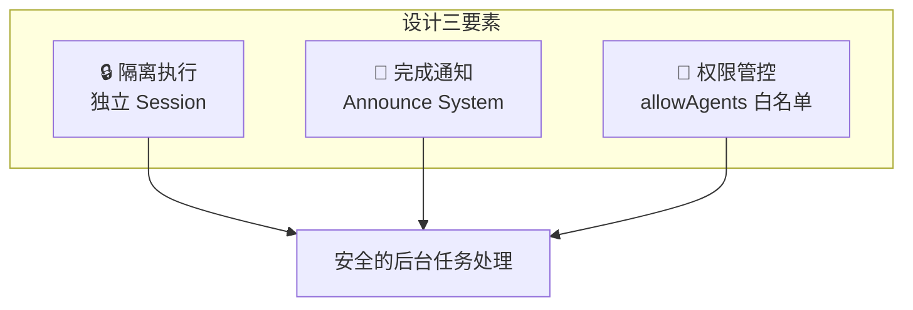
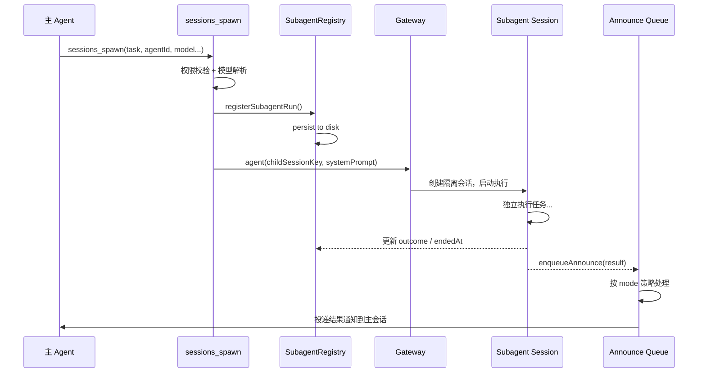
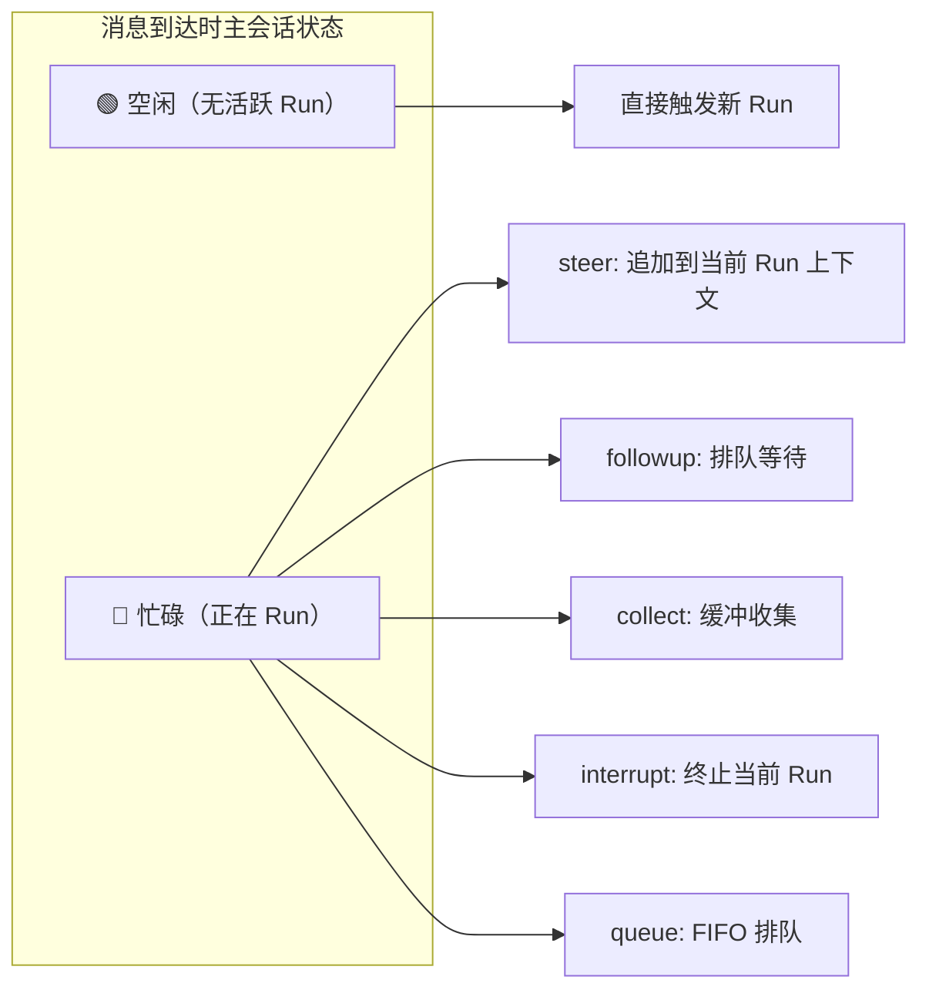
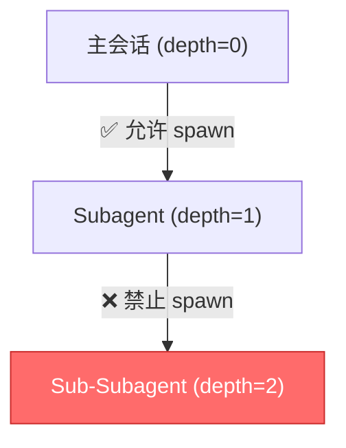
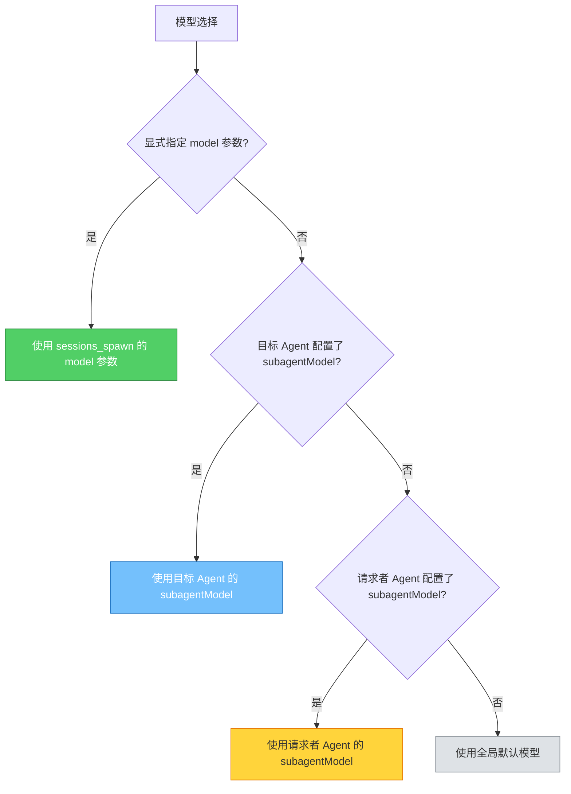
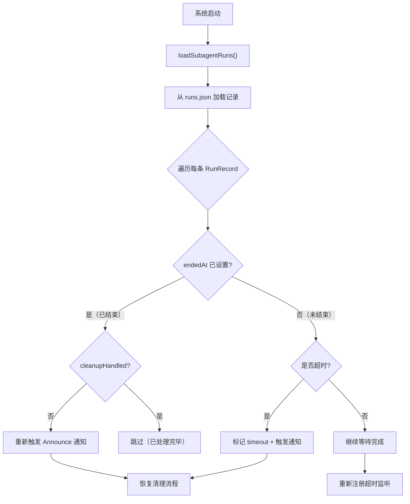
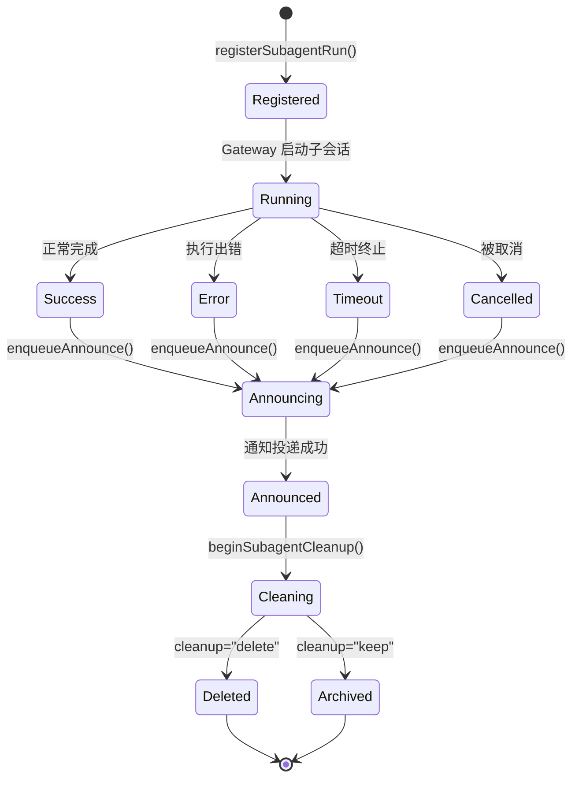
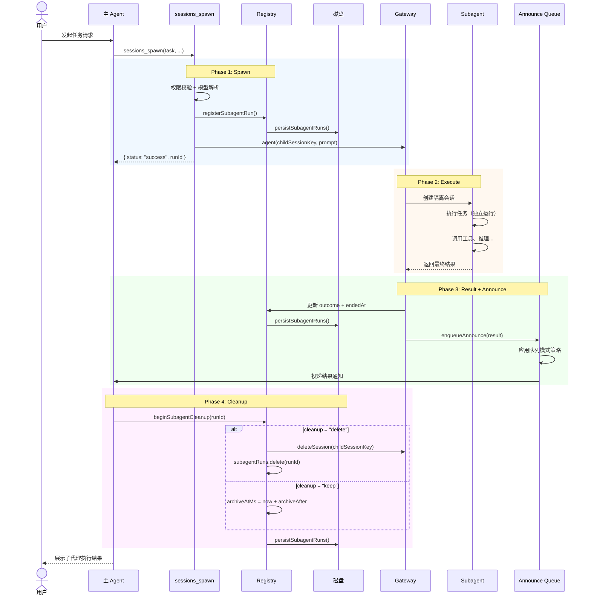

# OpenClaw Subagent 机制源码深度分析

> 基于 OpenClaw 源码的全面解析，深入理解子代理（Subagent）架构的设计哲学、核心实现与运行机制

## 目录

- [设计理念](#设计理念)
- [架构总览](#架构总览)
- [核心组件](#核心组件)
  - [Subagent Registry](#subagent-registry)
  - [sessions_spawn Tool](#sessions_spawn-tool)
  - [Announce System](#announce-system)
  - [Queue Modes](#queue-modes)
- [Subagent 嵌套深度](#subagent-嵌套深度)
- [跨 Agent 调用](#跨-agent-调用)
- [超时控制](#超时控制)
- [持久化与恢复](#持久化与恢复)
- [完整生命周期](#完整生命周期)

---

## 设计理念

OpenClaw Subagent 机制围绕三个核心设计原则构建：

### 1. 隔离式后台任务执行

每个 Subagent 在完全独立的会话（Session）中运行，与主会话之间不共享上下文、历史记录或中间状态。这种隔离确保了：

- 子任务的失败不会污染主会话状态
- 多个 Subagent 可以并行执行互不干扰
- 每个 Subagent 拥有独立的工具调用权限和资源配额

### 2. 完成即通知（Notify-on-Complete via Announce）

Subagent 不需要主会话轮询结果。当任务完成时，通过 **Announce System** 主动将结果推送回主会话。这是一种事件驱动的通知模型：

```
Subagent 完成任务 → 生成结果摘要 → Announce Queue 入队 → 按队列模式投递 → 主会话收到通知
```

### 3. 权限受控的跨 Agent 委派

Subagent 可以指定不同的 Agent 来执行任务，但必须通过白名单权限校验。这使得一个"编排型" Agent 可以按需委派专业任务给不同的"专家型" Agent，同时防止未授权的跨 Agent 调用。



---

## 架构总览

### 模块结构

```
src/agents/
├── subagent-registry.ts          # Subagent 注册表（元数据与状态管理）
├── subagent-registry.store.ts    # 持久化存储（磁盘读写）
├── subagent-announce.ts          # 结果通知逻辑（Announce 构建）
├── subagent-announce-queue.ts    # 通知队列（多模式排队与投递）
├── tools/
│   └── sessions-spawn-tool.ts    # sessions_spawn 工具入口
├── lanes.ts                      # Agent 通道配置
└── pi-embedded.ts                # 内嵌 PI 运行
```

### 核心数据流



---

## 核心组件

### Subagent Registry

**文件**: `subagent-registry.ts`

Registry 是 Subagent 系统的核心状态管理器，负责维护所有子代理运行的元数据和生命周期状态。内部使用内存 `Map<string, SubagentRunRecord>` 存储，并在每次状态变更时持久化到磁盘。

#### SubagentRunRecord 完整字段

```typescript
export type SubagentRunRecord = {
  // === 标识字段 ===
  runId: string;                     // 唯一运行 ID（crypto.randomUUID() 生成）
  childSessionKey: string;           // 子代理会话 Key（隔离会话的标识）
  requesterSessionKey: string;       // 请求者会话 Key（发起 spawn 的主会话）
  requesterOrigin?: DeliveryContext;  // 原始请求上下文（消息来源渠道等）
  requesterDisplayKey: string;       // 请求者显示 Key（用于 UI 展示）

  // === 任务字段 ===
  task: string;                      // 任务描述（传递给子代理的 prompt）
  label?: string;                    // 任务标签（可选，用于标识和检索）
  agentId?: string;                  // 目标 Agent ID（跨 Agent 调用时指定）
  model?: string;                    // 使用的模型标识

  // === 清理策略 ===
  cleanup: "delete" | "keep";        // "delete": 完成后删除子会话
                                     // "keep": 保留子会话供后续查看

  // === 时间戳 ===
  createdAt: number;                 // 注册时间（registerSubagentRun 时设置）
  startedAt?: number;                // 实际开始执行时间（Gateway 启动后设置）
  endedAt?: number;                  // 结束时间（outcome 确定后设置）

  // === 结果 ===
  outcome?: SubagentRunOutcome;      // 运行结果（见下方类型定义）

  // === 生命周期管理 ===
  archiveAtMs?: number;              // 归档时间戳（cleanup="keep" 时设置）
  cleanupCompletedAt?: number;       // 清理完成时间
  cleanupHandled?: boolean;          // 是否已执行清理
};

export type SubagentRunOutcome =
  | { status: "success"; reply?: string }   // 成功完成，可能包含回复
  | { status: "error"; error: string }      // 执行出错
  | { status: "timeout" }                   // 超时终止
  | { status: "cancelled" };                // 被取消
```

#### Registry 核心操作

| 操作 | 说明 |
|------|------|
| `registerSubagentRun(params)` | 创建新的 RunRecord，分配 runId，持久化并返回 |
| `waitForSubagentCompletion(runId)` | 阻塞等待指定 run 完成（带超时） |
| `beginSubagentCleanup(runId)` | 标记开始清理，根据 cleanup 策略执行删除或归档 |
| `finalizeSubagentCleanup(runId)` | 完成清理，设置 cleanupCompletedAt |
| `persistSubagentRuns()` | 将内存 Map 序列化为 JSON 写入磁盘 |
| `loadSubagentRuns()` | 启动时从磁盘恢复 RunRecord 到内存 |

---

### sessions_spawn Tool

**文件**: `sessions-spawn-tool.ts`

`sessions_spawn` 是 Agent 调用 Subagent 的唯一入口工具。

#### 参数定义

```typescript
const SessionsSpawnToolSchema = Type.Object({
  task: Type.String(),              // 【必填】任务描述，作为子代理的初始 prompt
  agentId: Type.Optional(           // 目标 Agent ID，不指定则使用请求者自身的 Agent
    Type.String()
  ),
  model: Type.Optional(             // 模型选择（覆盖默认模型配置）
    Type.String()
  ),
  cleanup: optionalStringEnum(      // 清理策略，默认 "delete"
    ["delete", "keep"] as const
  ),
  label: Type.Optional(             // 任务标签，方便识别和检索
    Type.String()
  ),
  runTimeoutSeconds: Type.Optional(  // 超时时间（秒），0 或不填表示无限制
    Type.Number({ minimum: 0 })
  ),
});
```

#### 返回值

调用成功时返回：

```typescript
{
  status: "success",
  runId: string,           // 可用于后续查询状态
  childSessionKey: string  // 子会话标识
}
```

#### 执行流程

```typescript
execute: async (_toolCallId, args) => {
  // 1. 参数解析
  const task = readStringParam(params, "task", { required: true });

  // 2. 嵌套检查 —— 子代理内部不允许再 spawn
  if (isSubagentSessionKey(requesterSessionKey)) {
    return jsonResult({
      status: "forbidden",
      error: "sessions_spawn is not allowed from sub-agent sessions",
    });
  }

  // 3. 确定目标 Agent
  const targetAgentId = requestedAgentId
    ? normalizeAgentId(requestedAgentId)
    : requesterAgentId;

  // 4. 权限校验（allowAgents 白名单）
  const allowAgents = resolveAgentConfig(cfg, requesterAgentId)
    ?.subagents?.allowAgents ?? [];
  const allowAny = allowAgents.some((v) => v.trim() === "*");
  if (!allowAny && !allowAgents.includes(targetAgentId)) {
    return jsonResult({
      status: "forbidden",
      error: `Agent "${targetAgentId}" is not allowed`,
    });
  }

  // 5. 模型解析（显式指定 > Agent 配置 > 全局默认）
  const modelConfig = await resolveSubagentModelConfig({
    cfg, requesterAgentId, targetAgentId,
    explicitOverride: modelOverride,
  });

  // 6. 注册到 Registry 并持久化
  const { runId, childSessionKey } = await registerSubagentRun({
    childSessionKey, requesterSessionKey,
    requesterOrigin, requesterDisplayKey,
    task, cleanup, label,
  });

  // 7. 通过 Gateway 启动子代理会话
  await callGateway({
    method: "agent",
    params: {
      sessionKey: childSessionKey,
      message: systemPrompt,
      model: modelConfig.model,
      deliver: false,
    },
  });

  return jsonResult({ status: "success", runId, childSessionKey });
}
```

---

### Announce System

**文件**: `subagent-announce.ts`

Announce System 负责在 Subagent 完成后将结果通知回主会话。它是连接"隔离执行"与"结果可见"的桥梁。

#### 投递模式

Announce 支持两种投递模式：

| 模式 | 行为 |
|------|------|
| `none` | 不发送任何通知（静默完成） |
| `announce` | 将结果以消息形式投递到主会话的 Announce Queue |

#### 通知消息结构

```typescript
export type AnnounceQueueItem = {
  prompt: string;            // 通知消息正文（包含结果摘要）
  summaryLine?: string;      // 一行式摘要（用于合并展示）
  enqueuedAt: number;        // 入队时间戳
  sessionKey: string;        // 目标会话 Key
  origin?: DeliveryContext;  // 原始请求上下文
  originKey?: string;        // 原始上下文 Key
};
```

#### 实现路径

```
Subagent 完成
  → cleanupSubagentRun() 更新 outcome
  → buildAnnouncePrompt() 构建通知文本
  → enqueueAnnounce() 入队到 Announce Queue
  → scheduleAnnounceDrain() 按队列模式排空
  → queue.send() 发送到主会话 Gateway
  → 主会话收到结果通知并展示给用户
```

---

### Queue Modes

**文件**: `subagent-announce-queue.ts`

Queue Modes 控制当多条 Announce 消息到达时如何投递到主会话。这是理解 Subagent 结果处理的关键，不同模式在**主会话正在运行**和**主会话空闲**时表现完全不同。

#### 模式行为对比（核心）



| 模式 | 消息到达时主会话正在 Run | Run 完成后的行为 | 适用场景 |
|------|------------------------|-----------------|---------|
| **steer** | 追加到当前 Run 的上下文中，Agent 可以在执行中"看到"新消息并调整方向 | N/A（消息已融入当前 Run） | 需要实时调整正在进行的任务 |
| **followup** | 排入队列，等待当前 Run 完成 | 自动作为新消息触发下一轮 Run | 异步通知，不打断当前工作 |
| **collect** | 放入收集缓冲区，不立即投递 | 将缓冲区中所有消息合并为一条，一次性发送 | 高频短任务，避免消息轰炸 |
| **interrupt** | 终止当前正在运行的 Run，立即以新消息启动新 Run | N/A（直接接管） | 紧急任务，需要立即处理 |
| **steer-backlog** | 行为同 steer，将消息追加到当前上下文；如果上下文已满则溢出到 backlog | backlog 中的积压消息依次处理 | steer + 溢出保护 |
| **steer+backlog** | steer 与 backlog 的组合策略 | 组合处理 | 复杂的混合场景 |
| **queue** | 严格 FIFO 排队，一次只处理一条 | 队列中下一条消息开始处理 | 保证顺序的串行处理 |

#### 队列状态结构

```typescript
type AnnounceQueueState = {
  items: AnnounceQueueItem[];       // 待投递消息列表
  draining: boolean;                // 是否正在排空队列
  lastEnqueuedAt: number;           // 最后入队时间
  mode: QueueMode;                  // 当前队列模式
  debounceMs: number;               // 防抖间隔（毫秒）
  cap: number;                      // 队列容量上限
  dropPolicy: QueueDropPolicy;      // 超出上限时的丢弃策略
  droppedCount: number;             // 已丢弃消息数
  summaryLines: string[];           // 被丢弃消息的摘要
  send: (item: AnnounceQueueItem) => Promise<void>;
};
```

#### 排空逻辑

```typescript
async function scheduleAnnounceDrain(key: string) {
  const queue = ANNOUNCE_QUEUES.get(key);
  if (!queue || queue.draining) return;

  queue.draining = true;

  while (queue.items.length > 0 || queue.droppedCount > 0) {
    await waitForQueueDebounce(queue);

    if (queue.mode === "collect") {
      // collect: 取出所有消息，合并为一条发送
      const items = queue.items.splice(0, queue.items.length);
      const summary = buildQueueSummaryPrompt({ state: queue });
      const prompt = buildCollectPrompt({ items, summary });
      await queue.send({ ...items[0], prompt });
    } else if (queue.mode === "steer") {
      // steer: 逐条发送，追加到当前上下文
      const next = queue.items.shift();
      if (next) await queue.send(next);
    }
    // ... 其他模式处理
  }

  queue.draining = false;
}
```

---

## Subagent 嵌套深度

OpenClaw 通过 **Session Key 中的 `:subagent:` 段** 来跟踪 Subagent 的嵌套层级。

### Session Key 结构

每当一个 Subagent 被创建时，其 `childSessionKey` 会在请求者的 Session Key 基础上追加 `:subagent:` 段：

```
主会话:           user:123:chat:456
第一层 Subagent:  user:123:chat:456:subagent:run-abc
第二层 Subagent:  user:123:chat:456:subagent:run-abc:subagent:run-def
```

### 嵌套深度计算

```typescript
function getSubagentDepth(sessionKey: string): number {
  // 计算 session key 中 ":subagent:" 段的数量
  const segments = sessionKey.split(":subagent:");
  return segments.length - 1;
}

// 示例
getSubagentDepth("user:123:chat:456")                           // → 0（主会话）
getSubagentDepth("user:123:chat:456:subagent:run-abc")          // → 1
getSubagentDepth("user:123:chat:456:subagent:run-abc:subagent:run-def") // → 2
```

### 嵌套限制

当前实现中，`sessions_spawn` 工具会检查请求者是否已经是 Subagent 会话，**禁止 Subagent 内部再次 spawn**：

```typescript
if (isSubagentSessionKey(requesterSessionKey)) {
  return jsonResult({
    status: "forbidden",
    error: "sessions_spawn is not allowed from sub-agent sessions",
  });
}
```

`isSubagentSessionKey()` 通过检测 Session Key 中是否包含 `:subagent:` 段来判断：

```typescript
function isSubagentSessionKey(key: string): boolean {
  return key.includes(":subagent:");
}
```

这意味着当前的**最大嵌套深度为 1**——只有主会话可以 spawn Subagent，Subagent 不能再创建子 Subagent。



---

## 跨 Agent 调用

Subagent 最强大的能力之一是**跨 Agent 委派**——一个 Agent 可以 spawn 另一个专门的 Agent 来执行特定任务。

### 权限控制

跨 Agent 调用需要在配置中显式授权：

```yaml
agents:
  list:
    - id: orchestrator
      subagents:
        allowAgents:
          - research-agent     # 允许调用 research-agent
          - coding-agent       # 允许调用 coding-agent
          # - "*"              # 取消注释以允许调用所有 Agent

    - id: research-agent
      subagents:
        allowAgents: []        # 不允许调用任何其他 Agent
```

权限校验逻辑：

```typescript
const allowAgents = resolveAgentConfig(cfg, requesterAgentId)
  ?.subagents?.allowAgents ?? [];

const allowAny = allowAgents.some((value) => value.trim() === "*");

if (!allowAny && !allowAgents.includes(targetAgentId)) {
  return jsonResult({
    status: "forbidden",
    error: `Agent "${targetAgentId}" is not allowed`,
  });
}
```

### 模型选择策略

跨 Agent 调用时的模型选择遵循严格的优先级链：



```typescript
async function resolveSubagentModelConfig(params) {
  // 优先级 1: 显式指定
  if (params.explicitOverride) {
    return { model: params.explicitOverride };
  }

  // 优先级 2: 目标 Agent 配置
  const targetConfig = resolveAgentConfig(params.cfg, params.targetAgentId);
  if (targetConfig?.subagents?.model) {
    return { model: targetConfig.subagents.model };
  }

  // 优先级 3: 请求者 Agent 配置
  const requesterConfig = resolveAgentConfig(params.cfg, params.requesterAgentId);
  if (requesterConfig?.subagents?.model) {
    return { model: requesterConfig.subagents.model };
  }

  // 优先级 4: 全局默认
  return undefined;
}
```

---

## 超时控制

### runTimeoutSeconds 参数

`sessions_spawn` 接受 `runTimeoutSeconds` 参数设置单次运行的最大执行时间：

```typescript
await sessions_spawn({
  task: "深度分析代码库",
  runTimeoutSeconds: 300,  // 5 分钟超时
});
```

### 超时解析优先级

```typescript
function resolveSubagentWaitTimeoutMs(
  cfg: ReturnType<typeof loadConfig>,
  runTimeoutSeconds?: number,
) {
  // 优先级 1: 参数级别（精确到秒）
  if (runTimeoutSeconds !== undefined && runTimeoutSeconds > 0) {
    return runTimeoutSeconds * 1000;
  }

  // 优先级 2: Agent 配置级别（精确到分钟）
  const configTimeout = cfg.agents?.defaults?.subagents?.runTimeoutMinutes;
  if (configTimeout && configTimeout > 0) {
    return configTimeout * 60 * 1000;
  }

  // 优先级 3: 无限制
  return 0;
}
```

### 卡死检测

当 Subagent 超时后，系统会：

1. 将 `outcome` 设置为 `{ status: "timeout" }`
2. 设置 `endedAt` 时间戳
3. 通过 Announce System 通知主会话超时信息
4. 根据 `cleanup` 策略执行清理

```typescript
// 超时处理
if (timeoutMs > 0) {
  setTimeout(async () => {
    const entry = subagentRuns.get(runId);
    if (entry && !entry.endedAt) {
      entry.outcome = { status: "timeout" };
      entry.endedAt = Date.now();
      persistSubagentRuns();
      await enqueueAnnounce(/* timeout notification */);
    }
  }, timeoutMs);
}
```

---

## 持久化与恢复

### 持久化机制

所有 `SubagentRunRecord` 在每次状态变更时写入磁盘：

```typescript
// subagent-registry.store.ts

function resolveSubagentRegistryPath(): string {
  return path.join(STATE_DIR, "subagents", "runs.json");
}

// 磁盘数据格式（版本 2）
type PersistedSubagentRegistryV2 = {
  version: 2;
  runs: Record<string, SubagentRunRecord>;
};
```

### 恢复流程

系统重启时的恢复逻辑：



关键恢复行为：

| 场景 | 恢复动作 |
|------|---------|
| Run 已结束但通知未发送 | 重新入队 Announce |
| Run 已结束且已通知但未清理 | 执行清理（delete/archive） |
| Run 未结束且未超时 | 继续等待，重新注册超时计时器 |
| Run 未结束且已超时 | 标记 timeout，发送通知，执行清理 |

---

## 完整生命周期

### 生命周期阶段

```
Spawn → Execute → Result → Announce → Cleanup
```

### 生命周期状态机



### 完整时序图



---

## 配置速查

### 全局默认配置

```yaml
agents:
  defaults:
    subagents:
      allowAgents: []               # 默认不允许跨 Agent 调用
      model: claude-sonnet-4        # 子代理默认模型
      runTimeoutMinutes: 30         # 默认超时（分钟）
      archiveAfterMinutes: 60       # 归档前等待时间
```

### Agent 级别配置

```yaml
agents:
  list:
    - id: orchestrator
      subagents:
        allowAgents: ["*"]          # 允许调用所有 Agent
        model: claude-sonnet-4      # 该 Agent 的子代理模型

    - id: research-agent
      subagents:
        allowAgents:                # 白名单
          - coding-agent
```

### 队列配置

```yaml
autoReply:
  queue:
    mode: collect                   # 队列模式
    debounceMs: 500                 # 防抖间隔
    cap: 20                         # 队列容量上限
    dropPolicy: summarize           # 溢出策略: summarize | keep | drop-old | drop-new
```

---

*基于 OpenClaw v2026.2.3-1 源码分析*
