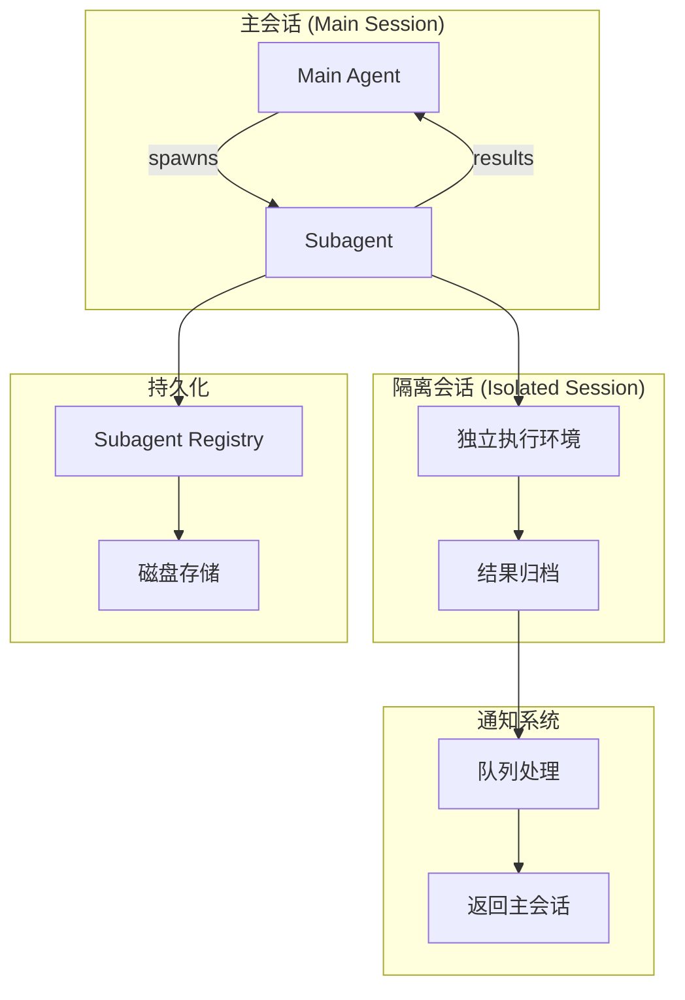
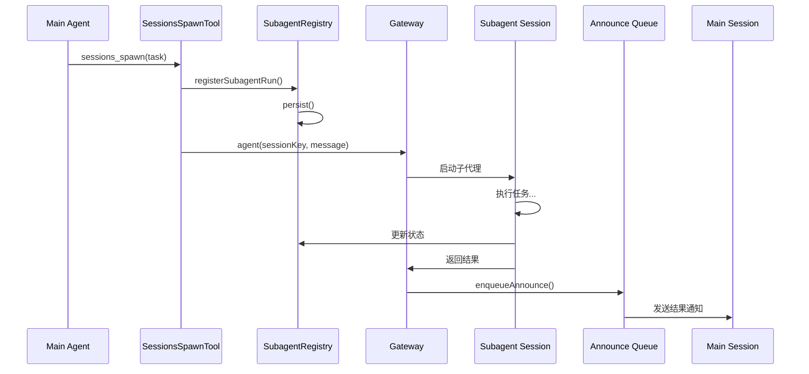
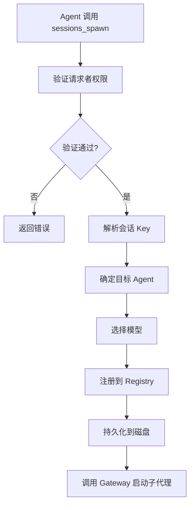
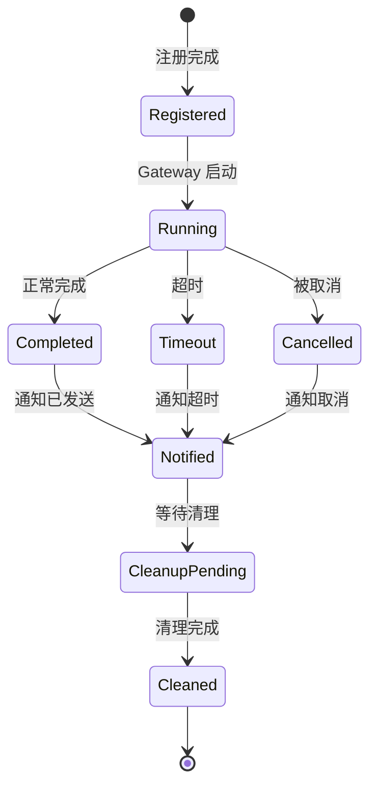
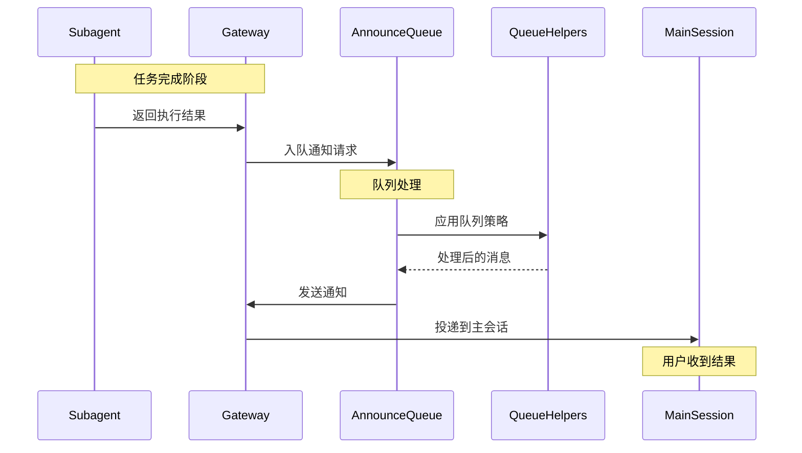
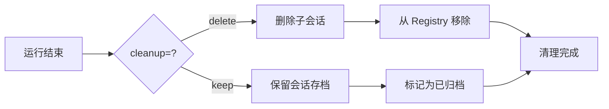
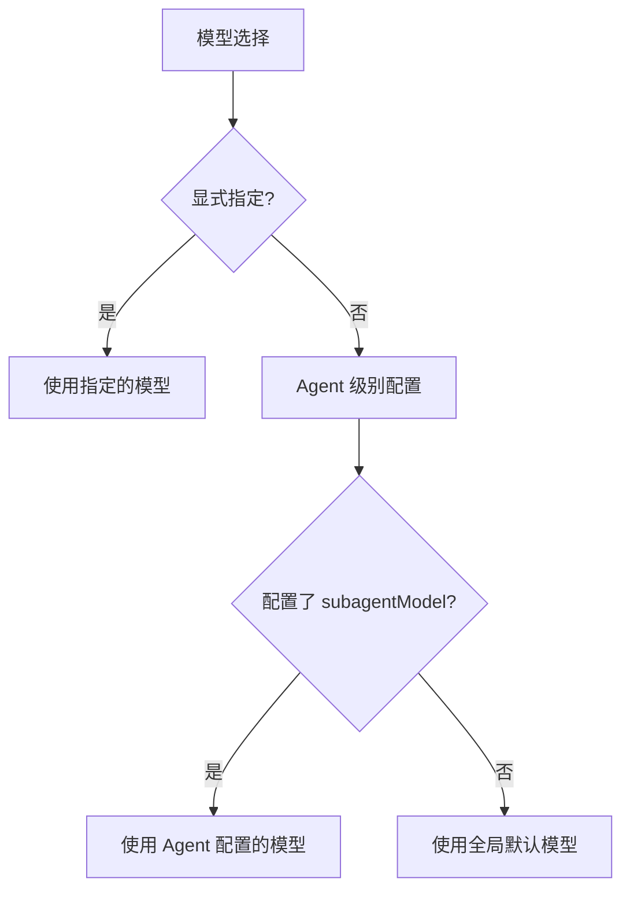
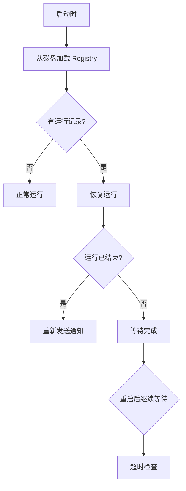

# OpenClaw Subagent 机制源码深度分析

> 基于源码的全面解析，帮助你深入理解 OpenClaw 的子代理（Subagent）架构

## 目录

- [概述](#概述)
- [架构设计](#架构设计)
- [核心组件](#核心组件)
  - [Subagent Registry](#subagent-registry-注册表)
  - [Sessions Spawn Tool](#sessions-spawn-tool-工具)
  - [Announce System](#announce-system-通知系统)
  - [Queue System](#queue-system-队列系统)
- [生命周期](#生命周期)
  - [Spawn 流程](#spawn-流程)
  - [执行阶段](#执行阶段)
  - [结果通知](#结果通知)
  - [清理阶段](#清理阶段)
- [关键机制](#关键机制)
  - [跨代理生成](#跨代理生成)
  - [模型选择策略](#模型选择策略)
  - [超时控制](#超时控制)
  - [持久化与恢复](#持久化与恢复)
- [配置选项](#配置选项)
- [使用示例](#使用示例)
- [源码关键代码解读](#源码关键代码解读)
- [常见问题](#常见问题)

---

## 概述

OpenClaw 的 **Subagent 机制**是一个强大的后台任务执行系统，允许 Agent 在隔离的会话中启动子代理来处理复杂任务，完成后自动将结果通知到主会话。

### 核心特性



| 特性 | 描述 |
|------|------|
| **隔离执行** | 每个 subagent 在独立会话中运行 |
| **结果通知** | 完成后自动通知主会话 |
| **持久化** | 支持崩溃恢复和重启继续 |
| **队列管理** | 支持多种队列模式 |
| **资源控制** | 超时、并发限制 |

### 使用场景

```typescript
// Agent 可以这样调用 subagent
await sessions_spawn({
  task: "分析这个代码库并生成报告",
  agentId: "research-agent",     // 可选：指定子代理
  model: "claude-sonnet-4",       // 可选：指定模型
  cleanup: "delete",              // 可选：完成后删除
  label: "代码分析任务",          // 可选：任务标签
});
```

---

## 架构设计

### 模块结构

```
src/agents/
├── subagent-registry.ts          # Subagent 注册表
├── subagent-registry.store.ts    # 持久化存储
├── subagent-announce.ts          # 结果通知逻辑
├── subagent-announce-queue.ts    # 通知队列
├── tools/
│   └── sessions-spawn-tool.ts  # Spawn 工具
├── lanes.ts                      # Agent 通道配置
└── pi-embedded.ts              # 内嵌 PI 运行
```

### 核心数据流



---

## 核心组件

### Subagent Registry (注册表)

**文件**: `subagent-registry.ts`

注册表是 Subagent 系统的核心，管理所有子代理运行的元数据和状态。

```typescript
// 核心数据结构
export type SubagentRunRecord = {
  runId: string;                    // 唯一运行 ID
  childSessionKey: string;          // 子代理会话 Key
  requesterSessionKey: string;      // 请求者会话 Key
  requesterOrigin?: DeliveryContext; // 原始请求上下文
  requesterDisplayKey: string;     // 请求者显示 Key
  task: string;                    // 任务描述
  cleanup: "delete" | "keep";      // 清理策略
  label?: string;                  // 任务标签
  createdAt: number;              // 创建时间
  startedAt?: number;             // 开始时间
  endedAt?: number;               // 结束时间
  outcome?: SubagentRunOutcome;   // 运行结果
  archiveAtMs?: number;           // 归档时间
  cleanupCompletedAt?: number;    // 清理完成时间
  cleanupHandled?: boolean;        // 是否已清理
};

// 注册表使用内存 Map 存储
const subagentRuns = new Map<string, SubagentRunRecord>();
```

**核心功能**:

| 功能 | 描述 |
|------|------|
| `registerSubagentRun()` | 注册新的 subagent 运行 |
| `waitForSubagentCompletion()` | 等待运行完成 |
| `beginSubagentCleanup()` | 开始清理流程 |
| `finalizeSubagentCleanup()` | 完成清理 |
| `persistSubagentRuns()` | 持久化到磁盘 |

### Sessions Spawn Tool (工具)

**文件**: `sessions-spawn-tool.ts`

这是 Agent 调用 subagent 的入口工具。

```typescript
// 工具定义
export function createSessionsSpawnTool(opts?: {
  agentSessionKey?: string;
  agentChannel?: GatewayMessageChannel;
  agentAccountId?: string;
  agentTo?: string;
  agentThreadId?: string | number;
  agentGroupId?: string | null;
  agentGroupChannel?: string | null;
  agentGroupSpace?: string | null;
  sandboxed?: boolean;
  requesterAgentIdOverride?: string;
}): AnyAgentTool {
  return {
    label: "Sessions",
    name: "sessions_spawn",
    description:
      "Spawn a background sub-agent run in an isolated session and announce the result back to the requester chat.",
    parameters: SessionsSpawnToolSchema,
    execute: async (_toolCallId, args) => {
      // 实现逻辑...
    },
  };
}
```

**参数定义**:

```typescript
const SessionsSpawnToolSchema = Type.Object({
  task: Type.String(),                           // 任务描述（必填）
  label: Type.Optional(Type.String()),            // 任务标签
  agentId: Type.Optional(Type.String()),         // 目标 Agent ID
  model: Type.Optional(Type.String()),           // 模型选择
  thinking: Type.Optional(Type.String()),        // Thinking 模式
  runTimeoutSeconds: Type.Optional(Type.Number({ minimum: 0 })), // 超时时间
  cleanup: optionalStringEnum(["delete", "keep"] as const), // 清理策略
});
```

### Announce System (通知系统)

**文件**: `subagent-announce.ts`

负责将子代理的执行结果通知回主会话。

```typescript
// 通知队列项
export type AnnounceQueueItem = {
  prompt: string;                    // 通知消息
  summaryLine?: string;              // 摘要行
  enqueuedAt: number;               // 入队时间
  sessionKey: string;               // 会话 Key
  origin?: DeliveryContext;         // 原始上下文
  originKey?: string;               // 原始 Key
};

// 结果类型
export type SubagentRunOutcome =
  | { status: "success"; reply?: string }
  | { status: "error"; error: string }
  | { status: "timeout" }
  | { status: "cancelled" };
```

### Queue System (队列系统)

**文件**: `subagent-announce-queue.ts`

管理通知消息的队列，支持多种队列模式。

```typescript
// 队列状态
type AnnounceQueueState = {
  items: AnnounceQueueItem[];       // 队列项
  draining: boolean;                // 是否正在排空
  lastEnqueuedAt: number;         // 最后入队时间
  mode: QueueMode;                 // 队列模式
  debounceMs: number;              // 防抖时间
  cap: number;                     // 队列上限
  dropPolicy: QueueDropPolicy;      // 丢弃策略
  droppedCount: number;             // 丢弃数量
  summaryLines: string[];          // 摘要行
  send: (item: AnnounceQueueItem) => Promise<void>; // 发送函数
};
```

**队列模式**:

| 模式 | 描述 |
|------|------|
| `collect` | 收集多条消息后合并 |
| `steer` | 转向（优先）处理 |
| `followup` | 跟进模式 |
| `interrupt` | 中断当前任务 |
| `backlog` | 积压处理 |

---

## 生命周期

### Spawn 流程



**源码关键步骤**:

```typescript
// 1. 权限验证
const allowAgents = resolveAgentConfig(cfg, requesterAgentId)?.subagents?.allowAgents ?? [];
const allowAny = allowAgents.some((value) => value.trim() === "*");
if (!allowAny && !allowAgents.includes(targetAgentId)) {
  return jsonResult({
    status: "forbidden",
    error: `Agent "${targetAgentId}" is not allowed`,
  });
}

// 2. 会话 Key 解析
const requesterInternalKey = resolveInternalSessionKey({
  key: requesterSessionKey,
  alias,
  mainKey,
});

// 3. 模型选择（优先级）
const modelConfig = await resolveSubagentModelConfig({
  cfg,
  requesterAgentId,
  targetAgentId,
  explicitOverride: modelOverride,
});

// 4. 注册运行记录
const { runId, childSessionKey } = await registerSubagentRun({
  childSessionKey,
  requesterSessionKey,
  requesterOrigin,
  requesterDisplayKey,
  task,
  cleanup,
  label,
});
```

### 执行阶段



### 结果通知



**队列处理逻辑**:

```typescript
async function scheduleAnnounceDrain(key: string) {
  const queue = ANNOUNCE_QUEUES.get(key);
  if (!queue || queue.draining) return;
  
  queue.draining = true;
  
  while (queue.items.length > 0 || queue.droppedCount > 0) {
    await waitForQueueDebounce(queue);
    
    if (queue.mode === "collect") {
      // 收集模式：合并多条消息
      const items = queue.items.splice(0, queue.items.length);
      const summary = buildQueueSummaryPrompt({ state: queue });
      const prompt = buildCollectPrompt({ items, summary });
      await queue.send({ ...items[0], prompt });
    } else if (queue.mode === "steer") {
      // 转向模式：优先处理
      const next = queue.items.shift();
      if (next) await queue.send(next);
    }
    // ... 其他模式
  }
}
```

### 清理阶段



**清理逻辑**:

```typescript
async function cleanupSubagentRun(params: {
  runId: string;
  outcome: SubagentRunOutcome;
  lastMessage?: string;
  usage?: SubagentUsage;
}) {
  const entry = subagentRuns.get(params.runId);
  if (!entry) return;
  
  // 更新运行记录
  entry.outcome = params.outcome;
  entry.endedAt = Date.now();
  
  if (params.usage) {
    entry.usage = params.usage;
  }
  
  // 执行清理
  if (entry.cleanup === "delete") {
    await deleteSubagentSession(entry.childSessionKey);
    subagentRuns.delete(params.runId);
  } else {
    // 保留，标记归档时间
    entry.archiveAtMs = resolveArchiveAfterMs();
  }
  
  persistSubagentRuns();
}
```

---

## 关键机制

### 跨代理生成

Subagent 支持指定不同的 Agent 来执行任务：

```typescript
// 配置允许的 Agent 列表
{
  agents: {
    list: [
      {
        id: "research-agent",
        subagents: {
          allowAgents: ["coding-agent", "analysis-agent"],  // 允许调用这些 Agent
        },
      },
    ],
  },
}

// 跨代理调用
await sessions_spawn({
  task: "分析这段代码",
  agentId: "coding-agent",  // 指定使用 coding-agent
});
```

### 模型选择策略

模型选择遵循优先级：



```typescript
async function resolveSubagentModelConfig(params) {
  // 1. 优先使用显式指定
  if (params.explicitOverride) {
    return { model: params.explicitOverride };
  }
  
  // 2. 检查目标 Agent 的配置
  const agentConfig = resolveAgentConfig(params.cfg, params.targetAgentId);
  if (agentConfig?.subagents?.model) {
    return { model: agentConfig.subagents.model };
  }
  
  // 3. 检查请求者 Agent 的配置
  const requesterConfig = resolveAgentConfig(params.cfg, params.requesterAgentId);
  if (requesterConfig?.subagents?.model) {
    return { model: requesterConfig.subagents.model };
  }
  
  // 4. 使用全局默认
  return undefined;
}
```

### 超时控制

```typescript
function resolveSubagentWaitTimeoutMs(
  cfg: ReturnType<typeof loadConfig>,
  runTimeoutSeconds?: number,
) {
  // 优先级：参数 > Agent 配置 > 全局默认
  const explicit = runTimeoutSeconds;  // 传入的超时参数
  
  if (explicit !== undefined && explicit > 0) {
    return explicit * 1000;  // 转换为毫秒
  }
  
  const configTimeout = cfg.agents?.defaults?.subagents?.runTimeoutMinutes;
  if (configTimeout && configTimeout > 0) {
    return configTimeout * 60 * 1000;
  }
  
  return 0;  // 无限制
}
```

### 持久化与恢复



**持久化文件**:

```typescript
// subagent-registry.store.ts

// 存储路径
function resolveSubagentRegistryPath(): string {
  return path.join(STATE_DIR, "subagents", "runs.json");
}

// 数据格式 (版本 2)
type PersistedSubagentRegistryV2 = {
  version: 2;                           // 版本号
  runs: Record<string, SubagentRunRecord>;  // 运行记录
};
```

---

## 配置选项

### 全局配置

```typescript
{
  agents: {
    defaults: {
      subagents: {
        // 允许跨 Agent 调用
        allowAgents?: string[];
        
        // 子代理默认模型
        model?: string;
        
        // 超时时间（分钟）
        runTimeoutMinutes?: number;
        
        // 归档前的等待时间（分钟）
        archiveAfterMinutes?: number;
      },
    },
  },
}
```

### Agent 级别配置

```typescript
{
  agents: {
    list: [
      {
        id: "my-agent",
        subagents: {
          // 允许调用的 Agent 列表
          allowAgents: ["research-agent", "coding-agent"],
          
          // 指定子代理使用特定模型
          model: "claude-sonnet-4",
          
          // 超时时间
          runTimeoutMinutes: 30,
        },
      },
    ],
  },
}
```

### 队列配置

```typescript
{
  autoReply: {
    queue: {
      // 默认队列模式
      mode: "collect" | "steer" | "followup" | "interrupt" | "backlog";
      
      // 防抖时间（毫秒）
      debounceMs?: number;
      
      // 队列上限
      cap?: number;
      
      // 超出上限时的策略
      dropPolicy?: "summarize" | "keep" | "drop-old" | "drop-new";
    },
  },
}
```

---

## 使用示例

### 基本使用

```typescript
// 启动一个简单的子代理任务
await sessions_spawn({
  task: "搜索关于 React 18 新特性的信息并总结",
});

// 带标签的任務
await sessions_spawn({
  task: "分析这个 PR 的代码变更",
  label: "PR 分析",
});
```

### 高级使用

```typescript
// 指定 Agent 和模型
await sessions_spawn({
  task: "写一个 Python 脚本处理 CSV 文件",
  agentId: "coding-agent",
  model: "claude-sonnet-4",
});

// 设置超时
await sessions_spawn({
  task: "深度分析这个代码库",
  runTimeoutSeconds: 300,  // 5 分钟
  cleanup: "keep",          // 保留会话供后续查看
});

// 指定清理策略
await sessions_spawn({
  task: "生成技术报告",
  cleanup: "delete",  // 完成后删除子会话
});
```

### 从配置文件

```yaml
# openclaw.yaml
agents:
  defaults:
    subagents:
      allowAgents:
        - research-agent
        - coding-agent
      model: claude-sonnet-4
      runTimeoutMinutes: 30

  list:
    - id: assistant
      subagents:
        allowAgents: ["*"]  # 允许所有 Agent
```

---

## 源码关键代码解读

### 1. 注册 Subagent 运行

```typescript
// subagent-registry.ts

export async function registerSubagentRun(params: {
  childSessionKey: string;
  requesterSessionKey: string;
  requesterOrigin?: DeliveryContext;
  requesterDisplayKey: string;
  task: string;
  cleanup: "delete" | "keep";
  label?: string;
}): Promise<{ runId: string; childSessionKey: string }> {
  const runId = crypto.randomUUID();
  
  const entry: SubagentRunRecord = {
    runId,
    childSessionKey: params.childSessionKey,
    requesterSessionKey: params.requesterSessionKey,
    requesterOrigin: params.requesterOrigin,
    requesterDisplayKey: params.requesterDisplayKey,
    task: params.task,
    cleanup: params.cleanup,
    label: params.label,
    createdAt: Date.now(),
  };
  
  // 添加到注册表
  subagentRuns.set(runId, entry);
  
  // 持久化
  persistSubagentRuns();
  
  // 确保清理监听器已启动
  ensureListener();
  
  return { runId, childSessionKey: params.childSessionKey };
}
```

### 2. Spawn 工具执行

```typescript
// sessions-spawn-tool.ts

execute: async (_toolCallId, args) => {
  // 1. 解析参数
  const task = readStringParam(params, "task", { required: true });
  const label = typeof params.label === "string" ? params.label.trim() : "";
  
  // 2. 权限检查
  if (isSubagentSessionKey(requesterSessionKey)) {
    return jsonResult({
      status: "forbidden",
      error: "sessions_spawn is not allowed from sub-agent sessions",
    });
  }
  
  // 3. 确定目标 Agent
  const targetAgentId = requestedAgentId
    ? normalizeAgentId(requestedAgentId)
    : requesterAgentId;
  
  // 4. 检查权限
  const allowAgents = resolveAgentConfig(cfg, requesterAgentId)?.subagents?.allowAgents ?? [];
  const allowAny = allowAgents.some((v) => v.trim() === "*");
  if (!allowAny && !allowAgents.includes(targetAgentId)) {
    return jsonResult({
      status: "forbidden",
      error: `Agent "${targetAgentId}" is not allowed`,
    });
  }
  
  // 5. 构建系统提示词
  const systemPrompt = await buildSubagentSystemPrompt({
    task,
    modelConfig,
    agentId: targetAgentId,
    subagentModelConfig,
    requesterDisplayKey,
    thinkingOverrideRaw,
    cfg,
    requesterOrigin,
    label,
  });
  
  // 6. 注册并启动
  const { runId, childSessionKey } = await registerSubagentRun({...});
  
  await callGateway({
    method: "agent",
    params: {
      sessionKey: childSessionKey,
      message: systemPrompt,
      model: modelConfig.model,
      deliver: false,
    },
  });
  
  return jsonResult({
    status: "success",
    runId,
    childSessionKey,
  });
}
```

### 3. 通知队列处理

```typescript
// subagent-announce-queue.ts

function scheduleAnnounceDrain(key: string) {
  const queue = ANNOUNCE_QUEUES.get(key);
  if (!queue || queue.draining) return;
  
  queue.draining = true;
  
  void (async () => {
    while (queue.items.length > 0 || queue.droppedCount > 0) {
      await waitForQueueDebounce(queue);
      
      // collect 模式：合并消息
      if (queue.mode === "collect") {
        const items = queue.items.splice(0, queue.items.length);
        const summary = buildQueueSummaryPrompt({ state: queue });
        const prompt = buildCollectPrompt({ items, summary });
        await queue.send({ ...items[0], prompt });
        continue;
      }
      
      // 其他模式...
    }
    queue.draining = false;
  })();
}
```

---

## 常见问题

### Q1: Subagent 和普通会话有什么区别？

| 方面 | Subagent | 普通会话 |
|------|----------|---------|
| **隔离** | 完全隔离的会话 | 共享会话 |
| **生命周期** | 临时性，任务完成结束 | 持久性，长期运行 |
| **结果返回** | 自动通知主会话 | 直接响应 |
| **清理** | 可配置自动删除 | 手动管理 |

### Q2: 如何控制 Subagent 的资源使用？

```yaml
# 1. 超时控制
agents:
  defaults:
    subagents:
      runTimeoutMinutes: 30  # 最多运行 30 分钟

# 2. 并发控制
agents:
  defaults:
    subagents:
      maxConcurrent: 4  # 最大并发数

# 3. 清理策略
await sessions_spawn({
  task: "...",
  cleanup: "delete",  # 完成后立即删除
});
```

### Q3: Subagent 崩溃后会发生什么？

```
1. 注册表持久化运行记录
2. 系统重启后自动恢复
3. 重新发送结果通知
4. 如果通知也失败，会标记待处理
```

### Q4: 如何调试 Subagent？

```typescript
// 1. 查看运行记录
openclaw sessions list

// 2. 查看特定运行详情
openclaw sessions info <runId>

// 3. 保留会话供调试
await sessions_spawn({
  task: "...",
  cleanup: "keep",  # 保留会话
});

// 4. 查看会话日志
openclaw logs --session <sessionKey>
```

### Q5: 队列模式如何选择？

| 场景 | 推荐模式 | 说明 |
|------|---------|------|
| 频繁短任务 | `steer` | 优先处理最新任务 |
| 批量处理 | `collect` | 合并多条消息 |
| 紧急通知 | `interrupt` | 中断当前任务 |
| 历史记录 | `followup` | 作为跟进消息 |

### Q6: 如何限制可调用的 Agent？

```yaml
agents:
  list:
    - id: research-agent
      subagents:
        allowAgents:  # 白名单
          - coding-agent
          - analysis-agent
```

---

## 总结

OpenClaw Subagent 机制核心要点：

### 架构设计

1. **分离执行** - 主代理和子代理完全隔离
2. **自动通知** - 结果自动返回主会话
3. **持久化** - 支持崩溃恢复
4. **灵活队列** - 多种通知模式

### 最佳实践

```yaml
# 推荐配置
agents:
  defaults:
    subagents:
      model: claude-sonnet-4
      runTimeoutMinutes: 30
      archiveAfterMinutes: 60

autoReply:
  queue:
    mode: collect
    debounceMs: 500
    cap: 20
```

### 使用建议

1. **复杂任务** - 使用 subagent 处理耗时任务
2. **专业化** - 指定专门的 Agent 处理特定任务
3. **资源控制** - 设置合理的超时和清理策略
4. **监控** - 定期检查 subagent 运行状态

掌握这些概念，就能高效使用 OpenClaw 的 Subagent 机制！
