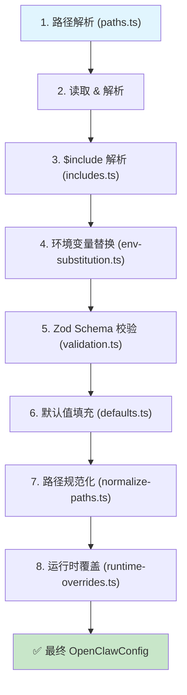

# OpenClaw 核心配置系统源码深度分析

> 基于 OpenClaw v2026.2.3-1 源码分析 | 2026-03-13

本文档从源码层面深入剖析 OpenClaw 的配置加载管线、Workspace 文件体系、Agent 运行时配置、Session/Memory/Heartbeat/Hook 子系统的设计与实现。

---

## 目录

1. [设计理念](#1-设计理念)
2. [Config 加载管线](#2-config-加载管线)
3. [Config 缓存机制](#3-config-缓存机制)
4. [Workspace 配置文件](#4-workspace-配置文件)
5. [各配置文件详解](#5-各配置文件详解)
6. [Agent Runtime 配置](#6-agent-runtime-配置)
7. [Session 配置](#7-session-配置)
8. [Memory 配置](#8-memory-配置)
9. [Heartbeat 配置](#9-heartbeat-配置)
10. [Hook 系统](#10-hook-系统)
11. [CLI 命令参考](#11-cli-命令参考)

---

## 1. 设计理念

OpenClaw 的配置系统遵循以下核心原则：

| 原则 | 实现方式 |
|------|---------|
| **人性化格式** | 采用 JSON5（支持注释、尾逗号、无引号键名），源码中通过 `JSON5.parse()` 解析 |
| **分层管线** | file → `$include` → env substitution → validation → defaults → normalization → runtime overrides |
| **Workspace 人格注入** | 通过 `.md` 文件将 Agent 的人格、工具、记忆等上下文注入 System Prompt |
| **安全优先** | 路径遍历防护、符号链接校验、文件大小限制、权限收紧（0o700/0o600） |
| **兼容演进** | 自动识别 legacy 配置文件名（`clawdbot.json`、`moldbot.json`、`moltbot.json`）和旧状态目录 |

---

## 2. Config 加载管线

### 2.1 管线总览



### 2.2 步骤 1：路径解析

**源码位置**：`src/config/paths.ts`

配置文件路径按以下优先级解析：

```
1. OPENCLAW_CONFIG_PATH 环境变量          → 指定的绝对路径
2. $OPENCLAW_STATE_DIR/openclaw.json      → 自定义状态目录
3. ~/.openclaw/openclaw.json              → 默认位置
4. Legacy 兼容：
   ├── ~/.openclaw/clawdbot.json
   ├── ~/.openclaw/moldbot.json
   ├── ~/.openclaw/moltbot.json
   ├── ~/.clawdbot/openclaw.json
   ├── ~/.moldbot/openclaw.json
   └── ~/.moltbot/openclaw.json
```

状态目录解析逻辑（`resolveStateDir()`）：

```
OPENCLAW_STATE_DIR / CLAWDBOT_STATE_DIR → 环境变量优先
→ ~/.openclaw (若存在)
→ ~/.clawdbot / ~/.moldbot / ~/.moltbot (legacy 兼容)
→ ~/.openclaw (新建默认)
```

### 2.3 步骤 2：读取 & 解析

**源码位置**：`src/config/io.ts` — `loadConfig()` / `createConfigIO()`

```typescript
// io.ts 核心流程
maybeLoadDotEnvForConfig(deps.env);          // 加载 .env 文件（仅真实 process.env）
const raw = deps.fs.readFileSync(configPath, "utf-8");
const parsed = deps.json5.parse(raw);        // JSON5 解析（支持注释/尾逗号）
```

### 2.4 步骤 3：$include 解析

**源码位置**：`src/config/includes.ts`

`$include` 指令用于模块化配置拆分：

```json5
{
  "$include": "./base.json5",                  // 单文件引入
  "$include": ["./a.json5", "./b.json5"]       // 多文件合并
}
```

**深度合并规则**（`deepMerge()`）：

| 类型 | 合并行为 |
|------|---------|
| 数组 | 拼接（`[...target, ...source]`） |
| 对象 | 递归合并 |
| 原始值 | source 覆盖 target |

**安全约束**：

| 约束 | 值 | 源码常量 |
|------|----|---------|
| 最大嵌套深度 | 10 层 | `MAX_INCLUDE_DEPTH = 10` |
| 单文件最大字节 | 2 MB | `MAX_INCLUDE_FILE_BYTES = 2 * 1024 * 1024` |
| 路径限制 | 必须在配置目录内 | `isPathInside()` + symlink 二次校验 |
| 循环检测 | 抛出 `CircularIncludeError` | `visited` Set 追踪 |

### 2.5 步骤 4：环境变量替换

**源码位置**：`src/config/env-substitution.ts`

```json5
{
  models: {
    providers: {
      "custom-gateway": {
        apiKey: "${VERCEL_GATEWAY_API_KEY}"     // 运行时替换为实际值
      }
    }
  }
}
```

**替换规则**：

| 语法 | 行为 |
|------|------|
| `${VAR_NAME}` | 替换为环境变量值 |
| `$${VAR_NAME}` | 转义，输出字面量 `${VAR_NAME}` |
| 变量名约束 | 仅匹配大写：`[A-Z_][A-Z0-9_]*` |
| 缺失变量 | 生成警告（不抛异常），保留原占位符 |

**关键细节**：`config.env` 中定义的变量会在替换前注入 `process.env`（`applyConfigEnvVars()`），使得 `${VAR}` 可以引用配置文件自身定义的变量。

### 2.6 步骤 5：Schema 校验

**源码位置**：`src/config/validation.ts`

使用 Zod schema（`OpenClawSchema`）进行结构化校验：

- 校验失败抛出 `INVALID_CONFIG` 错误，拒绝启动（fail closed）
- 校验警告不阻断启动，通过 `logger.warn` 输出
- 支持插件扩展校验（`validateConfigObjectWithPlugins()`）

### 2.7 步骤 6：默认值填充

**源码位置**：`src/config/defaults.ts`

默认值按**严格顺序**依次应用（嵌套调用结构）：

```
① applyMessageDefaults     → messages.ackReactionScope 默认 "group-mentions"
② applyLoggingDefaults     → logging.redactSensitive 默认 "tools"
③ applySessionDefaults     → session.mainKey 强制为 "main"
④ applyAgentDefaults       → maxConcurrent / subagents.maxConcurrent
⑤ applyContextPruningDefaults → contextPruning.mode / heartbeat.every
⑥ applyCompactionDefaults  → compaction.mode 默认 "safeguard"
⑦ applyModelDefaults       → 模型别名、cost、contextWindow、maxTokens
⑧ applyTalkConfigNormalization + applyTalkApiKey → TTS 配置标准化
```

源码中的实际调用链：

```typescript
// io.ts loadConfig() 第 799-809 行
const cfg = applyTalkConfigNormalization(
  applyModelDefaults(
    applyCompactionDefaults(
      applyContextPruningDefaults(
        applyAgentDefaults(
          applySessionDefaults(applyLoggingDefaults(applyMessageDefaults(validated.config))),
        ),
      ),
    ),
  ),
);
```

**内置模型别名**（`DEFAULT_MODEL_ALIASES`）：

| 别名 | 实际模型 ID |
|------|-----------|
| `opus` | `anthropic/claude-opus-4-6` |
| `sonnet` | `anthropic/claude-sonnet-4-6` |
| `gpt` | `openai/gpt-5.4` |
| `gpt-mini` | `openai/gpt-5-mini` |
| `gemini` | `google/gemini-3.1-pro-preview` |
| `gemini-flash` | `google/gemini-3-flash-preview` |
| `gemini-flash-lite` | `google/gemini-3.1-flash-lite-preview` |

### 2.8 步骤 7：路径规范化

**源码位置**：`src/config/normalize-paths.ts` + `src/config/normalize-exec-safe-bin.ts`

- 对键名匹配 `/(dir|path|paths|file|root|workspace)$/i` 的字符串值，自动展开 `~` 前缀为用户主目录
- `pathPrepend` 数组中的每个元素同样展开
- exec-safe-bin 配置中的路径也做相应规范化

### 2.9 步骤 8：运行时覆盖

**源码位置**：`src/config/runtime-overrides.ts`

`applyConfigOverrides()` 在管线最末端执行，将运行时通过 `setConfigOverride()` 设置的键值深度合并到最终配置：

```typescript
export function applyConfigOverrides(cfg: OpenClawConfig): OpenClawConfig {
  if (!overrides || Object.keys(overrides).length === 0) {
    return cfg;
  }
  return mergeOverrides(cfg, overrides) as OpenClawConfig;
}
```

---

## 3. Config 缓存机制

**源码位置**：`src/config/io.ts` — `loadConfig()` + 缓存逻辑

| 配置项 | 默认值 | 说明 |
|--------|--------|------|
| `OPENCLAW_CONFIG_CACHE_MS` | `200` ms | 缓存有效期 |
| `OPENCLAW_DISABLE_CONFIG_CACHE` | 未设置 | 设置任意值可完全绕过缓存 |

**缓存策略**：

```
loadConfig()
  ├── runtimeConfigSnapshot 存在？→ 直接返回（最高优先级）
  ├── configCache 未过期？→ 返回缓存
  └── 重新执行完整管线 → 写入缓存（configPath + expiresAt + config）
```

写配置时会自动调用 `clearConfigCache()` 清除缓存。

---

## 4. Workspace 配置文件

### 4.1 文件全景

```
<workspace>/
├── AGENTS.md          # Agent 身份与行为指南
├── SOUL.md            # 人格与沟通风格
├── TOOLS.md           # 工具使用指南
├── IDENTITY.md        # 身份标识信息
├── USER.md            # 用户偏好
├── HEARTBEAT.md       # 心跳消息模板
├── BOOTSTRAP.md       # 首次启动引导（一次性）
├── MEMORY.md          # 长期记忆
├── memory.md          # 长期记忆（备选文件名）
└── memory/
    └── YYYY-MM-DD.md  # 每日笔记
```

### 4.2 加载与注入

**源码位置**：`src/agents/workspace.ts` + `src/agents/bootstrap-files.ts`


### 4.3 安全防护

**`readWorkspaceFileWithGuards()`**：

| 防护项 | 值/行为 |
|--------|--------|
| 单文件最大字节 | 2 MB（`MAX_WORKSPACE_BOOTSTRAP_FILE_BYTES`） |
| 边界检查 | 通过 `openBoundaryFile()` 验证文件在 workspace 根目录内 |
| 文件缓存 | 基于 `dev:ino:size:mtime` 组合键的 stat 缓存，防止重复读取 |
| 大文件截断 | 超过 `bootstrapMaxChars`（默认 20000）截断并添加 `[TRUNCATED]` 标记 |

### 4.4 会话过滤

**`filterBootstrapFilesForSession()`** — 根据会话类型裁剪加载文件：

| 会话类型 | 加载的文件 |
|----------|-----------|
| 主会话 / DM / 群聊 | 全部文件 |
| Subagent / Cron | 仅 `MINIMAL_BOOTSTRAP_ALLOWLIST`：AGENTS.md, TOOLS.md, SOUL.md, IDENTITY.md, USER.md |

```typescript
// workspace.ts 第 557-563 行
const MINIMAL_BOOTSTRAP_ALLOWLIST = new Set([
  DEFAULT_AGENTS_FILENAME,    // "AGENTS.md"
  DEFAULT_TOOLS_FILENAME,     // "TOOLS.md"
  DEFAULT_SOUL_FILENAME,      // "SOUL.md"
  DEFAULT_IDENTITY_FILENAME,  // "IDENTITY.md"
  DEFAULT_USER_FILENAME,      // "USER.md"
]);
```

设计意图：subagent 和 cron 不需要 HEARTBEAT、BOOTSTRAP、MEMORY 等长期上下文，节省 token 开销。

---

## 5. 各配置文件详解

### 5.1 AGENTS.md — Agent 操作指南

| 维度 | 说明 |
|------|------|
| **作用** | Agent 的核心操作手册，定义每会话工作流、记忆管理规则、安全准则、群聊行为 |
| **加载优先级** | Bootstrap 注入中首个加载 |
| **所有会话可用** | ✅ 包含在 `MINIMAL_BOOTSTRAP_ALLOWLIST` 中 |
| **典型内容** | 每会话必读步骤、记忆写入规则、安全边界、群聊礼仪 |

### 5.2 SOUL.md — 人格与风格

| 维度 | 说明 |
|------|------|
| **作用** | 定义 AI 的人格特质、行为边界、沟通风格 |
| **所有会话可用** | ✅ |
| **典型内容** | 核心价值观、行为准则、称呼规则、回复风格 |

### 5.3 USER.md — 用户偏好

| 维度 | 说明 |
|------|------|
| **作用** | 记录用户个人信息、偏好设置、技术栈 |
| **所有会话可用** | ✅ |
| **典型内容** | 姓名、称呼、时区、GitHub 信息、沟通渠道偏好 |

### 5.4 TOOLS.md — 工具使用指南

| 维度 | 说明 |
|------|------|
| **作用** | 记录本地环境特定的工具配置，如 SSH 连接、TTS、摄像头 |
| **所有会话可用** | ✅ |
| **与 Skills 区别** | TOOLS.md 是本地环境配置，Skills 是可执行功能模块 |

### 5.5 IDENTITY.md — 身份定义

| 维度 | 说明 |
|------|------|
| **作用** | 定义 AI 名称、类型、签名表情、头像等身份标识 |
| **所有会话可用** | ✅ |
| **典型内容** | Name, Creature, Vibe, Emoji, Avatar |

### 5.6 HEARTBEAT.md — 心跳消息模板

| 维度 | 说明 |
|------|------|
| **作用** | 定义 Agent 在心跳周期需要检查的任务清单 |
| **仅主会话可用** | ❌ 不在 `MINIMAL_BOOTSTRAP_ALLOWLIST` 中 |
| **特殊行为** | lightweight 模式下 heartbeat 运行仅保留 HEARTBEAT.md |
| **典型内容** | 邮件/日历检查清单、定期巡检任务 |

### 5.7 MEMORY.md / memory.md — 长期记忆

| 维度 | 说明 |
|------|------|
| **作用** | 沉淀重要决策、上下文、偏好和教训 |
| **仅主会话可用** | ❌ 不在 `MINIMAL_BOOTSTRAP_ALLOWLIST` 中 |
| **安全规则** | 不在群聊中加载，不包含敏感密钥 |
| **备选文件名** | 同时识别 `MEMORY.md` 和 `memory.md` |

### 5.8 BOOTSTRAP.md — 首次启动引导

| 维度 | 说明 |
|------|------|
| **作用** | 一次性的首次启动引导脚本 |
| **仅主会话可用** | ❌ 不在 `MINIMAL_BOOTSTRAP_ALLOWLIST` 中 |
| **生命周期** | 首次启动时创建 → 执行引导 → 删除文件 → 标记 `onboardingCompletedAt` |
| **禁用引导** | `agent: { skipBootstrap: true }` |

---

## 6. Agent Runtime 配置

### 6.1 模型选择

```json5
{
  agents: {
    defaults: {
      model: "sonnet",                 // 使用别名或完整 provider/model 引用
      models: {
        "anthropic/claude-opus-4-6": {
          params: {
            cacheRetention: "short"     // Anthropic API Key 模式自动设置
          }
        }
      }
    }
  }
}
```

### 6.2 Auth 认证配置

```json5
{
  auth: {
    profiles: {
      "my-anthropic-key": {
        provider: "anthropic",
        mode: "api_key"                // "api_key" | "oauth" | "token"
      },
      "my-anthropic-oauth": {
        provider: "anthropic",
        mode: "oauth"
      }
    },
    order: {
      anthropic: ["my-anthropic-key", "my-anthropic-oauth"]  // 优先级轮换
    }
  }
}
```

系统会根据认证模式自动调整行为：
- **API Key 模式**：`contextPruning.mode` 默认 `"cache-ttl"`，`heartbeat.every` 默认 `"30m"`，Anthropic 模型自动添加 `cacheRetention: "short"`
- **OAuth 模式**：`heartbeat.every` 默认 `"1h"`

### 6.3 Context Window & Compaction

```json5
{
  agents: {
    defaults: {
      contextPruning: {
        mode: "cache-ttl",              // 默认值 (Anthropic 认证时)
        ttl: "1h"
      },
      compaction: {
        mode: "safeguard"               // 默认值，防止上下文溢出
      },
      maxConcurrent: 4,                 // DEFAULT_AGENT_MAX_CONCURRENT
      subagents: {
        maxConcurrent: 2                // DEFAULT_SUBAGENT_MAX_CONCURRENT
      }
    }
  }
}
```

### 6.4 工具策略

工具系统采用分层加载：

```
workspace/skills  →  ~/.openclaw/skills  →  <bundled>/skills
   (最高优先级)         (托管技能)           (捆绑技能)
```

---

## 7. Session 配置

### 7.1 Session Key 映射

```
直接消息 (DM):
  dmScope = "main"              → agent:<agentId>:main
  dmScope = "per-peer"          → agent:<agentId>:dm:<peerId>
  dmScope = "per-channel-peer"  → agent:<agentId>:<channel>:dm:<peerId>

群聊:
  → agent:<agentId>:<channel>:group:<id>

特殊会话:
  cron:<job.id>                 // 定时任务
  hook:<uuid>                   // Webhook
  node-<nodeId>                 // 节点运行
```

### 7.2 Session 生命周期

```json5
{
  session: {
    mainKey: "main",            // 强制为 "main"（忽略自定义值并警告）
    resetPolicy: {
      mode: "daily",            // "daily" | "idle"
      atHour: 4                 // 每日重置时间（主机本地时间）
    },
    idleMinutes: 60             // 空闲超时（可选）
  }
}
```

### 7.3 Send Policy

```json5
{
  session: {
    sendPolicy: {
      rules: [
        { action: "deny", match: { channel: "discord", chatType: "group" } }
      ],
      default: "allow"          // "allow" | "deny"
    }
  }
}
```

---

## 8. Memory 配置

### 8.1 向量搜索

```json5
{
  memory: {
    provider: "openai",          // "openai" | "gemini" | "voyage" | "local" | "auto"
    model: "text-embedding-3-small",
    chunking: {
      tokens: 512,
      overlap: 50
    },
    search: {
      maxResults: 10,
      minScore: 0.7,
      weights: {
        vector: 0.7,             // 向量搜索权重
        text: 0.3                // BM25 全文搜索权重
      }
    }
  }
}
```

### 8.2 混合搜索原理

```
┌─────────────────────────────────────────────────┐
│           Hybrid Search (BM25 + Vector)          │
├─────────────────────────────────────────────────┤
│  1. Vector Search → Top K by cosine similarity  │
│     语义匹配（措辞可不同）                        │
│                                                  │
│  2. BM25 Full-Text Search → Top K by FTS5 rank  │
│     精确匹配（ID、代码符号等）                    │
│                                                  │
│  3. Score Fusion                                 │
│     finalScore = vectorScore × 0.7               │
│                + textScore   × 0.3               │
└─────────────────────────────────────────────────┘
```

### 8.3 自动 Memory Flush

当会话 token 接近上下文窗口限制时，系统自动触发静默 Agent Turn 将重要信息写入 MEMORY.md：

```
Session Token → contextWindow - reserveTokensFloor - softThresholdTokens
                → 触发 Silent Agent Turn → 写入 Memory → 返回 NO_REPLY
```

---

## 9. Heartbeat 配置

### 9.1 配置结构

```json5
{
  agents: {
    defaults: {
      heartbeat: {
        every: "30m",                 // 间隔（API Key 默认 30m，OAuth 默认 1h）
        model: "sonnet",              // 可覆盖模型
        target: "last",               // "last" | "none" | <channelId>
        to: "user@example.com",       // 接收者覆盖
        prompt: "Check for updates",  // 自定义提示词
        ackMaxChars: 300,             // OK 响应最大长度
        activeHours: {
          start: "08:00",
          end: "22:00",
          tz: "Asia/Shanghai"
        }
      }
    }
  }
}
```

### 9.2 响应契约

| 响应类型 | 标记 | 行为 |
|---------|------|------|
| 正常响应 | 无 | 发送完整消息到目标通道 |
| 确认响应 | `HEARTBEAT_OK`（开头或结尾） | 静默处理，内容不超过 `ackMaxChars` |
| 静默响应 | `NO_REPLY` | 完全静默，不发送任何内容 |

### 9.3 Heartbeat vs Cron

| 维度 | Heartbeat | Cron |
|------|-----------|------|
| 触发方式 | 周期性（30m 级别） | 精确时间点（分钟级） |
| 上下文 | 完整会话上下文 | 独立/隔离上下文 |
| 输出 | 聊天通道消息 | 独立任务执行 |
| Bootstrap | 仅 HEARTBEAT.md（lightweight 模式） | MINIMAL_BOOTSTRAP_ALLOWLIST |

---

## 10. Hook 系统

### 10.1 Hook 发现与加载

**源码位置**：`src/hooks/loader.ts` + `src/hooks/workspace.ts`

Hook 按以下优先级从多个目录发现：

```
extra hooks (config)  <  bundled hooks  <  managed hooks  <  workspace hooks
                                                              (最高优先级)
```

加载流程：


### 10.2 启用条件

```json5
{
  hooks: {
    internal: {
      enabled: true                // 全局开关
    }
  }
}
```

单个 hook 可在配置中禁用：

```json5
{
  hooks: {
    "<hook-name>": {
      enabled: false
    }
  }
}
```

### 10.3 Hook 事件类型

Hook 通过 frontmatter 声明触发事件和调用策略：

| 事件类别 | 示例 |
|---------|------|
| **命令** | 自定义 CLI 命令扩展 |
| **会话** | session 创建、重置、消息前/后处理 |
| **Agent** | bootstrap 文件增强、工具注册 |
| **Gateway** | 服务启动、配置变更 |
| **消息** | 消息路由、转换、过滤 |

---

## 11. CLI 命令参考

| 命令 | 作用 |
|------|------|
| `openclaw setup` | 初始化配置 + 工作区 |
| `openclaw onboard` | 交互式向导设置 |
| `openclaw configure` | 配置向导 |
| `openclaw sessions --json` | 列出所有会话 |
| `openclaw status` | 查看会话状态 |
| `openclaw reset` | 重置当前会话 |
| `openclaw memory status` | 内存索引状态 |
| `openclaw memory index` | 重新索引记忆 |
| `openclaw memory search <query>` | 语义搜索记忆 |
| `openclaw system heartbeat last` | 查看上次心跳 |
| `openclaw system heartbeat enable/disable` | 启用/禁用心跳 |
| `openclaw cron list` | 列出定时任务 |
| `openclaw cron add` | 添加定时任务 |
| `openclaw skills list` | 列出已安装技能 |
| `openclaw skills info <name>` | 查看技能详情 |
| `openclaw gateway status` | Gateway 运行状态 |
| `openclaw gateway restart` | 重启 Gateway |
| `openclaw config set <path> <value>` | 设置配置项 |
| `openclaw config get <path>` | 读取配置项 |

---

## 关键文件路径速查

| 文件/目录 | 路径 | 作用 |
|----------|------|------|
| 全局配置 | `~/.openclaw/openclaw.json` | JSON5 核心配置 |
| 工作区根 | `~/.openclaw/workspace` | Agent 工作目录 |
| 会话存储 | `~/.openclaw/agents/<id>/sessions/` | 会话历史 |
| 记忆索引 | `~/.openclaw/memory/<id>.sqlite` | 向量检索数据库 |
| 认证信息 | `~/.openclaw/credentials/` | OAuth tokens |
| 托管技能 | `~/.openclaw/skills/` | 已安装技能 |
| 审计日志 | `~/.openclaw/logs/config-audit.jsonl` | 配置写入审计 |
| Gateway 锁 | `/tmp/openclaw-<uid>/` | 进程锁文件 |

---

## 配置来源优先级（从高到低）

```
1. Runtime Overrides (applyConfigOverrides)
2. 命令行参数 (--args)
3. 环境变量 (process.env)
4. 配置文件 (openclaw.json + $include)
5. 默认值 (defaults.ts 管线)
```

---

## 快速参考表

| 文件 | 所有会话 | 仅主会话 | 包含敏感信息 | 可空/可选 |
|------|---------|---------|------------|----------|
| AGENTS.md | ✅ | — | ❌ | 必需 |
| SOUL.md | ✅ | — | ❌ | 必需 |
| USER.md | ✅ | — | ✅ | 必需 |
| TOOLS.md | ✅ | — | ✅ | 可选 |
| IDENTITY.md | ✅ | — | ❌ | 可选 |
| HEARTBEAT.md | ❌ | ✅ | ❌ | 可选 |
| MEMORY.md | ❌ | ✅ | ✅ | 可选 |
| BOOTSTRAP.md | ❌ | ✅ | ❌ | 一次性 |

---

*基于 OpenClaw v2026.2.3-1 源码分析*
*源码路径：`/root/.nvm/versions/node/v22.22.0/lib/node_modules/openclaw/`*
*文档更新：2026-03-13*
