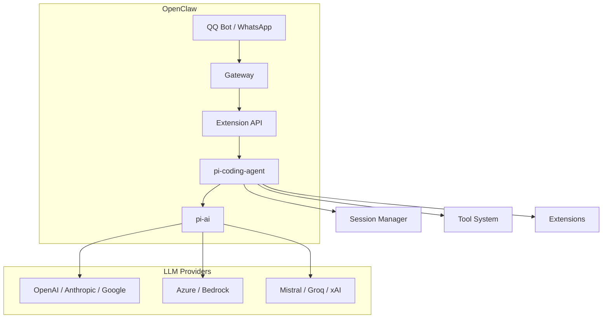
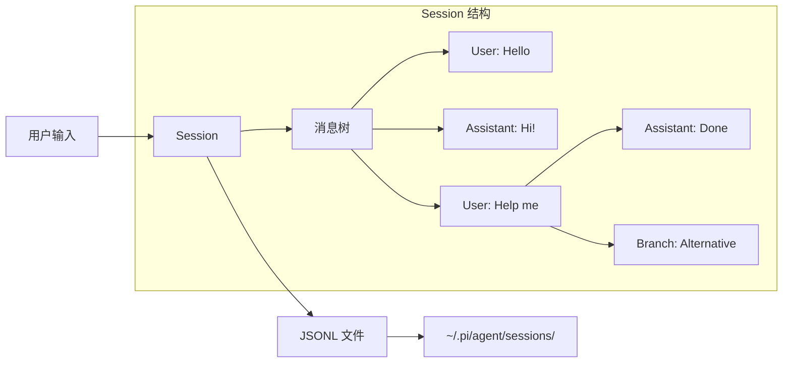
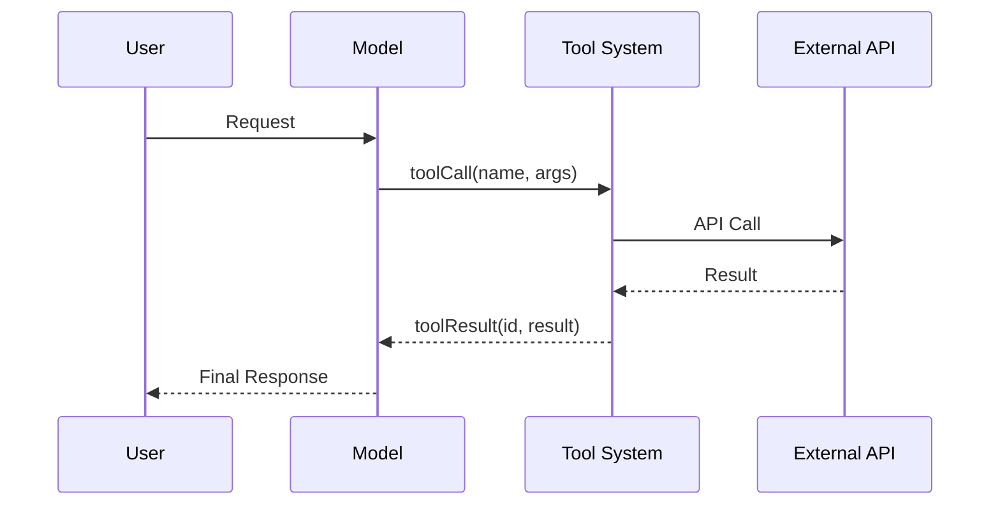
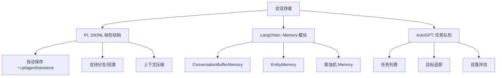
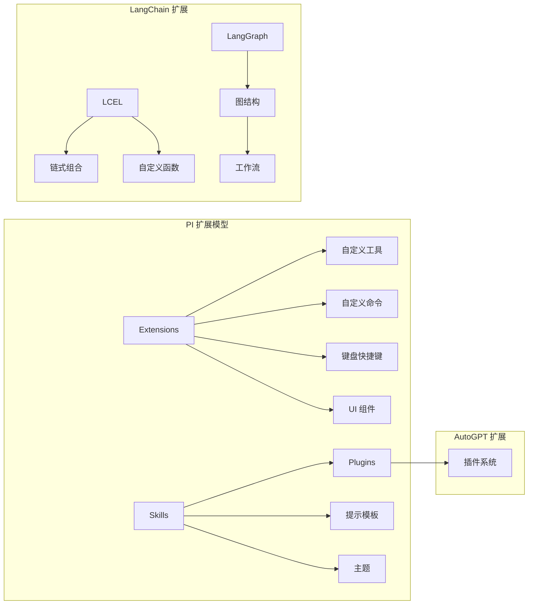
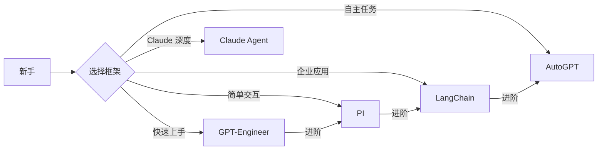

# PI 编程 Agent 框架详解

> 基于源码的深度分析，帮助你快速理解和使用 PI 框架

## 目录

- [概述](#概述)
- [架构设计](#架构设计)
- [核心模块详解](#核心模块详解)
  - [pi-ai - 统一 LLM API 层](#pi-ai---统一-llm-api-层)
  - [pi-coding-agent - 终端编程 Agent](#pi-coding-agent---终端编程-agent)
- [在 OpenClaw 中的使用](#在-openclaw-中的使用)
- [快速上手示例](#快速上手示例)
- [深入理解](#深入理解)
  - [Tools 系统](#tools-系统)
  - [Context 和消息传递](#context-和消息传递)
  - [Provider 和 Model 管理](#provider-和-model-管理)
  - [跨 Provider 切换](#跨-provider-切换)
- [进阶功能](#进阶功能)
  - [流式处理](#流式处理)
  - [Thinking/Reasoning](#thinkingreasoning)
  - [工具调用](#工具调用)
  - [图像输入](#图像输入)
  - [OAuth 认证](#oauth-认证)
- [常见问题](#常见问题)
- [参考资源](#参考资源)

---

## 概述

PI 是一个强大的编程 Agent 框架，由 Mario Zechner 开发，主要包含两个核心包：

| 包名 | 作用 | OpenClaw 中用途 |
|------|------|-----------------|
| `@mariozechner/pi-ai` | 统一 LLM API，提供模型抽象、工具调用、流式处理等 | 核心 LLM 交互层 |
| `@mariozechner/pi-coding-agent` | 终端编程 CLI，集成 read/write/edit/bash 工具 | 提供 Agent Session 管理 |

### PI 在 OpenClaw 中的定位



---

## 架构设计

### 核心依赖关系

```
pi-coding-agent
├── @mariozechner/pi-ai (核心 LLM 抽象)
│   ├── @anthropic-ai/sdk
│   ├── openai
│   ├── @google/genai
│   ├── @mistralai/mistralai
│   ├── @aws-sdk/client-bedrock-runtime
│   └── ...
├── @mariozechner/pi-tui (终端 UI)
├── @mariozechner/pi-agent-core
└── chalk, glob, marked, diff 等工具
```

### 源码目录结构

```
@ mariozechner/pi-ai/
├── src/
│   ├── types.ts           # 核心类型定义
│   ├── providers/         # Provider 实现
│   │   ├── anthropic.ts
│   │   ├── openai.ts
│   │   ├── google.ts
│   │   ├── bedrock.ts
│   │   └── ...
│   ├── env-api-keys.ts   # 环境变量认证
│   ├── oauth.ts          # OAuth 支持
│   └── ...
├── dist/
│   └── index.js          # 编译产物
├── README.md              # 详细文档
└── package.json

@ mariozechner/pi-coding-agent/
├── src/
│   ├── core/
│   │   ├── session.ts     # Session 管理
│   │   ├── tools.ts      # 工具系统
│   │   └── ...
│   ├── modes/
│   │   ├── interactive/  # 交互模式
│   │   ├── json/         # JSON 模式
│   │   └── rpc/          # RPC 模式
│   └── cli.ts
├── examples/
├── docs/
└── package.json
```

---

## 核心模块详解

### pi-ai - 统一 LLM API 层

#### 1. 核心概念

**Provider**: LLM 提供商（如 OpenAI、Anthropic、Google）

**Model**: 具体模型实例（如 gpt-4o、claude-sonnet-4）

**API**: Provider 使用的接口协议（如 OpenAI Completions API、Anthropic Messages API）

```typescript
// 关系示例
Provider: "anthropic"
  └── API: "anthropic-messages"
       └── Model: "claude-sonnet-4-20250514"

Provider: "openai"
  ├── API: "openai-completions" (兼容 OpenAI 协议的如 Mistral, Groq, xAI)
  └── API: "openai-responses" (OpenAI 官方 Responses API)
```

#### 2. 支持的 Provider

| Provider | API 类型 | 认证方式 |
|----------|---------|---------|
| OpenAI | openai-responses / openai-completions | API Key |
| Anthropic | anthropic-messages | API Key / OAuth |
| Google | google-generative-ai | API Key / OAuth |
| Azure OpenAI | azure-openai-responses | API Key |
| Amazon Bedrock | bedrock-converse-stream | AWS Credentials |
| Mistral | openai-completions | API Key |
| Groq | openai-completions | API Key |
| xAI | openai-completions | API Key |
| Cerebras | openai-completions | API Key |
| OpenRouter | openai-completions | API Key |
| Vercel AI Gateway | openai-completions | API Key |
| MiniMax | openai-completions | API Key |
| Kimi For Coding | anthropic-messages | API Key |
| GitHub Copilot | openai-completions | OAuth |
| Google Gemini CLI | google-gemini-cli | OAuth |
| Antigravity | google-generative-ai | OAuth |

#### 3. Model 元数据

每个模型都有丰富的元数据：

```typescript
interface Model<API> {
  id: string;                    // 模型标识符
  name: string;                 // 显示名称
  api: API;                     // 使用的 API 类型
  provider: string;             // 提供商名称
  
  // 能力
  reasoning: boolean;           // 是否支持 Thinking/Reasoning
  input: ('text' | 'image')[];  // 支持的输入类型
  
  // 成本 (美元/百万 token)
  cost: {
    input: number;
    output: number;
    cacheRead: number;
    cacheWrite: number;
  };
  
  // 限制
  contextWindow: number;        // 上下文窗口大小 (tokens)
  maxTokens: number;            // 最大输出 tokens
  
  // 连接配置 (可选)
  baseUrl?: string;             // 自定义 API 地址
  headers?: Record<string, string>; // 自定义请求头
  
  // 兼容性配置 (可选)
  compat?: OpenAICompletionsCompat;
}
```

### pi-coding-agent - 终端编程 Agent

#### 1. 核心功能

- **交互模式**: 终端 UI，支持快捷键、命令
- **工具系统**: read/write/edit/bash/grep/find/ls
- **会话管理**: 自动保存、树形历史、分支、压缩
- **扩展系统**: TypeScript 插件机制
- **Skill 系统**: Agent Skills 标准支持

#### 2. 内置工具

```typescript
// 核心工具定义
interface Tool {
  name: string;           // 工具名
  description: string;    // 描述
  parameters: Schema;      // 参数 Schema
}

// 内置工具
const BUILTIN_TOOLS = [
  'read',    // 读取文件
  'write',   // 创建/覆盖文件
  'edit',    // 编辑文件
  'bash',    // 执行 Shell 命令
  'grep',    // 文本搜索
  'find',    // 文件查找
  'ls',      // 列出目录
];
```

#### 3. 会话管理



---

## 在 OpenClaw 中的使用

### 1. Extension API 集成

```typescript
// extensionAPI.ts 中的关键导入
import {
  CURRENT_SESSION_VERSION,
  SessionManager,
  SettingsManager,
  codingTools,
  createAgentSession,
  createEditTool,
  createReadTool,
  createWriteTool,
  estimateTokens,
  readTool
} from "@mariozechner/pi-coding-agent";

import {
  complete,
  completeSimple,
  streamSimple
} from "@mariozechner/pi-ai";
```

### 2. 创建 Agent Session

```typescript
import { createAgentSession } from "@mariozechner/pi-coding-agent";

// 创建会话
const { session } = await createAgentSession({
  sessionManager: SessionManager.inMemory(),  // 或持久化
  authStorage: new AuthStorage(),
  modelRegistry: new ModelRegistry(authStorage),
});

// 发送提示
await session.prompt("List all .ts files in src/");
```

### 3. 流式交互

```typescript
import { stream, complete } from "@mariozechner/pi-ai";

// 获取模型
const model = getModel('openai', 'gpt-4o-mini');

// 构建上下文
const context: Context = {
  systemPrompt: 'You are a helpful assistant.',
  messages: [{ role: 'user', content: 'Hello!' }],
  tools: [/* 工具定义 */]
};

// 流式输出
const streamResult = stream(model, context);
for await (const event of streamResult) {
  switch (event.type) {
    case 'text_delta':
      process.stdout.write(event.delta);
      break;
    case 'toolcall_end':
      console.log(`Tool: ${event.toolCall.name}`);
      break;
    case 'done':
      console.log(`\nFinished: ${event.reason}`);
      break;
  }
}

// 非流式
const response = await complete(model, context);
```

---

## 快速上手示例

### 示例 1: 基础对话

```typescript
import { getModel, complete } from '@mariozechner/pi-ai';

const model = getModel('anthropic', 'claude-sonnet-4-20250514');

const response = await complete(model, {
  messages: [{ role: 'user', content: 'What is TypeScript?' }]
});

for (const block of response.content) {
  if (block.type === 'text') {
    console.log(block.text);
  }
}
```

### 示例 2: 工具调用

```typescript
import { Type, getModel, complete, Context, Tool } from '@mariozechner/pi-ai';

// 定义工具
const tools: Tool[] = [{
  name: 'get_weather',
  description: 'Get current weather for a location',
  parameters: Type.Object({
    location: Type.String({ description: 'City name' }),
    units: Type.Optional(Type.String({ enum: ['celsius', 'fahrenheit'], default: 'celsius' }))
  })
}];

const context: Context = {
  messages: [{ role: 'user', content: 'What is the weather in Tokyo?' }],
  tools
};

const response = await complete(getModel('openai', 'gpt-4o-mini'), context);

// 处理工具调用
for (const block of response.content) {
  if (block.type === 'toolCall') {
    console.log(`Calling: ${block.name}(${JSON.stringify(block.arguments)})`);
    
    // 执行工具并添加结果
    context.messages.push({
      role: 'toolResult',
      toolCallId: block.id,
      toolName: block.name,
      content: [{ type: 'text', text: 'Sunny, 25°C' }],
      isError: false,
      timestamp: Date.now()
    });
  }
}

// 继续对话
if (hasToolCalls) {
  const continuation = await complete(model, context);
}
```

### 示例 3: Thinking/Reasoning

```typescript
import { getModel, completeSimple } from '@mariozechner/pi-ai';

const model = getModel('anthropic', 'claude-sonnet-4-20250514');

// 启用 thinking
const response = await completeSimple(model, {
  messages: [{ role: 'user', content: 'Solve: 2x + 5 = 13' }]
}, {
  reasoning: 'medium'  // minimal | low | medium | high | xhigh
});

for (const block of response.content) {
  if (block.type === 'thinking') {
    console.log('Thinking:', block.thinking);
  } else if (block.type === 'text') {
    console.log('Response:', block.text);
  }
}
```

### 示例 4: 图像输入

```typescript
import { readFileSync } from 'fs';
import { getModel, complete } from '@mariozechner/pi-ai';

const model = getModel('openai', 'gpt-4o-mini');

// 检查模型是否支持图像
if (model.input.includes('image')) {
  const imageBuffer = readFileSync('image.png');
  const base64Image = imageBuffer.toString('base64');
  
  const response = await complete(model, {
    messages: [{
      role: 'user',
      content: [
        { type: 'text', text: 'What is in this image?' },
        { type: 'image', data: base64Image, mimeType: 'image/png' }
      ]
    }]
  });
}
```

### 示例 5: 自定义 Model

```typescript
import { Model } from '@mariozechner/pi-ai';

// Ollama 自定义模型
const ollamaModel: Model<'openai-completions'> = {
  id: 'llama-3.1-8b',
  name: 'Llama 3.1 8B (Ollama)',
  api: 'openai-completions',
  provider: 'ollama',
  baseUrl: 'http://localhost:11434/v1',
  cost: { input: 0, output: 0, cacheRead: 0, cacheWrite: 0 },
  contextWindow: 128000,
  maxTokens: 32000
};

// 使用
const response = await complete(ollamaModel, context, {
  apiKey: 'dummy'  // Ollama 不需要 API Key
});
```

---

## 深入理解

### Tools 系统

#### TypeBox Schema

PI 使用 TypeBox 进行类型安全的工具定义：

```typescript
import { Type, StringEnum } from '@mariozechner/pi-ai';

// 基础类型
Type.String()
Type.Number()
Type.Boolean()
Type.Array(Type.String())
Type.Object({ ... })

// 带选项
Type.String({ description: 'Name', minLength: 1 })
Type.Optional(Type.String())  // 可选字段

// 枚举
StringEnum(['a', 'b', 'c'], { default: 'a' })

// 复杂结构
Type.Object({
  name: Type.String(),
  age: Type.Number(),
  tags: Type.Array(Type.String()),
  address: Type.Optional(Type.Object({
    city: Type.String(),
    zip: Type.String()
  }))
})
```

#### 工具调用流程



### Context 和消息传递

#### 消息类型

```typescript
// 用户消息
{ role: 'user', content: 'Hello!' }

// 助手消息 (LLM 响应)
{ role: 'assistant', content: [...] }

// 工具调用结果
{ 
  role: 'toolResult', 
  toolCallId: 'call_123',
  toolName: 'get_weather',
  content: [{ type: 'text', text: 'Sunny, 25°C' }],
  isError: false,
  timestamp: 1234567890
}

// 助手消息内容块
type ContentBlock = 
  | { type: 'text', text: string }
  | { type: 'toolCall', id: string, name: string, arguments: Record<string, unknown> }
  | { type: 'thinking', thinking: string }
  | { type: 'image', data: string, mimeType: string };
```

#### Context 序列化

```typescript
const context: Context = {
  systemPrompt: 'You are a helpful assistant.',
  messages: [
    { role: 'user', content: 'Hello!' },
    { role: 'assistant', content: [{ type: 'text', text: 'Hi there!' }] }
  ],
  tools: [/* 工具定义 */]
};

// JSON 序列化 - 完美支持分布式
const serialized = JSON.stringify(context);
const restored: Context = JSON.parse(serialized);

// 继续使用
const response = await complete(model, restored);
```

### Provider 和 Model 管理

#### 查询可用模型

```typescript
import { getProviders, getModels, getModel } from '@mariozechner/pi-ai';

// 所有 Provider
const providers = getProviders();
// ['openai', 'anthropic', 'google', 'xai', 'groq', ...]

// Provider 下所有模型
const models = getModels('anthropic');
for (const model of models) {
  console.log(`${model.id}: ${model.name}`);
  console.log(`  Context: ${model.contextWindow} tokens`);
  console.log(`  Vision: ${model.input.includes('image')}`);
  console.log(`  Reasoning: ${model.reasoning}`);
}

// 获取具体模型
const model = getModel('openai', 'gpt-4o-mini');
```

#### Provider 特定选项

```typescript
// OpenAI
await complete(model, context, {
  reasoningEffort: 'medium',
  reasoningSummary: 'detailed'  // Responses API only
});

// Anthropic
await complete(model, context, {
  thinkingEnabled: true,
  thinkingBudgetTokens: 8192
});

// Google
await complete(model, context, {
  thinking: {
    enabled: true,
    budgetTokens: 8192  // -1 for dynamic
  }
});
```

### 跨 Provider 切换

#### 自动转换

```typescript
import { getModel, complete, Context } from '@mariozechner/pi-ai';

const context: Context = { messages: [] };

// 从 Anthropic 开始
const claude = getModel('anthropic', 'claude-sonnet-4-20250514');
context.messages.push({ role: 'user', content: 'What is 25 * 18?' });
const claudeResponse = await complete(claude, context);
context.messages.push(claudeResponse);

// 切换到 OpenAI - 自动转换 thinking 为 <thinking> 标签
const gpt5 = getModel('openai', 'gpt-5-mini');
context.messages.push({ role: 'user', content: 'Is that correct?' });
const gptResponse = await complete(gpt5, context);
context.messages.push(gptResponse);

// 再切换到 Google
const gemini = getModel('google', 'gemini-2.5-flash');
context.messages.push({ role: 'user', content: 'What was the question?' });
const geminiResponse = await complete(gemini, context);
```

#### 转换规则

| 源消息类型 | 同 API Provider | 不同 API Provider |
|-----------|-----------------|-------------------|
| User 消息 | 保持不变 | 保持不变 |
| Tool Result | 保持不变 | 保持不变 |
| Assistant 文本 | 保持不变 | 保持不变 |
| Tool Calls | 保持不变 | 保持不变 |
| Thinking 块 | 保持不变 | 转换为 `<thinking>...</thinking>` 文本 |

---

## 进阶功能

### 流式处理

#### 事件类型

```typescript
const s = stream(model, context);

for await (const event of s) {
  switch (event.type) {
    case 'start':
      // 流开始
      console.log(`Using model: ${event.partial.model}`);
      break;
      
    case 'text_start':
      // 文本块开始
      break;
    case 'text_delta':
      // 文本片段
      process.stdout.write(event.delta);
      break;
    case 'text_end':
      // 文本块结束
      break;
      
    case 'thinking_start':
      // Thinking 开始
      break;
    case 'thinking_delta':
      // Thinking 片段
      process.stdout.write(event.delta);
      break;
    case 'thinking_end':
      // Thinking 结束
      break;
      
    case 'toolcall_start':
      // 工具调用开始
      console.log(`[Tool call: ${event.contentIndex}]`);
      break;
    case 'toolcall_delta':
      // 工具参数 (部分流式)
      const partial = event.partial.content[event.contentIndex];
      if (partial.type === 'toolCall') {
        console.log(`[Streaming args for ${partial.name}]`);
      }
      break;
    case 'toolcall_end':
      // 工具调用完成
      console.log(`Tool: ${event.toolCall.name}`);
      console.log(`Args: ${JSON.stringify(event.toolCall.arguments)}`);
      break;
      
    case 'done':
      // 流结束
      console.log(`Stop reason: ${event.reason}`);
      break;
      
    case 'error':
      // 错误
      console.error(`Error: ${event.error}`);
      break;
  }
}

// 获取最终消息
const result = await s.result();
```

#### 部分 JSON 解析

在 `toolcall_delta` 期间，参数是渐进式解析的：

```typescript
for await (const event of s) {
  if (event.type === 'toolcall_delta') {
    const call = event.partial.content[event.contentIndex];
    
    if (call.type === 'toolCall') {
      // BE DEFENSIVE: arguments 可能不完整
      if (call.arguments?.path) {
        console.log(`Writing to: ${call.arguments.path}`);
      }
      // 字符串可能被截断
      // 数组可能不完整
      // 嵌套对象可能部分填充
    }
  }
}
```

### Thinking/Reasoning

#### 模型支持

| Provider | Model | Reasoning 支持 |
|----------|-------|---------------|
| OpenAI | o1, o3, gpt-5 | ✓ |
| Anthropic | Claude Sonnet 4 | ✓ |
| Google | Gemini 2.5 | ✓ |
| xAI | Grok | 部分 |
| Groq | GPT-OSS | 部分 |
| Cerebras | GPT-OSS | 部分 |

#### 配置选项

```typescript
// 简化接口
await completeSimple(model, context, {
  reasoning: 'medium'  // minimal | low | medium | high | xhigh
});

// OpenAI 特定
await complete(openaiModel, context, {
  reasoningEffort: 'medium',
  reasoningSummary: 'detailed'  // Responses API
});

// Anthropic 特定
await complete(anthropicModel, context, {
  thinkingEnabled: true,
  thinkingBudgetTokens: 8192
});

// Google 特定
await complete(googleModel, context, {
  thinking: {
    enabled: true,
    budgetTokens: 8192
  }
});
```

### 工具调用

#### 完整流程

```typescript
import { validateToolCall } from '@mariozechner/pi-ai';

const tools: Tool[] = [weatherTool, calculatorTool];
const context: Context = {
  messages: [{ role: 'user', content: 'What is 25 * 18?' }],
  tools
};

const response = await complete(model, context);

// 验证并执行工具
for (const block of response.content) {
  if (block.type === 'toolCall') {
    try {
      // 验证参数
      const validatedArgs = validateToolCall(tools, block);
      
      // 执行工具
      const result = await executeMyTool(block.name, validatedArgs);
      
      // 添加结果
      context.messages.push({
        role: 'toolResult',
        toolCallId: block.id,
        toolName: block.name,
        content: [{ type: 'text', text: result }],
        isError: false,
        timestamp: Date.now()
      });
    } catch (error) {
      // 验证失败 - 返回错误让模型重试
      context.messages.push({
        role: 'toolResult',
        toolCallId: block.id,
        toolName: block.name,
        content: [{ type: 'text', text: error.message }],
        isError: true,
        timestamp: Date.now()
      });
    }
  }
}

// 继续
if (hasToolCalls) {
  const continuation = await complete(model, context);
}
```

### 图像输入

#### 带图像的工具结果

```typescript
import { readFileSync } from 'fs';

context.messages.push({
  role: 'toolResult',
  toolCallId: 'tool_xyz',
  toolName: 'generate_chart',
  content: [
    { type: 'text', text: 'Generated chart' },
    { type: 'image', data: imageBase64, mimeType: 'image/png' }
  ],
  isError: false,
  timestamp: Date.now()
});
```

### OAuth 认证

#### 支持 OAuth 的 Provider

- Anthropic (Claude Pro/Max)
- OpenAI Codex (ChatGPT Plus/Pro)
- GitHub Copilot
- Google Gemini CLI
- Antigravity

#### OAuth 登录

```typescript
import { 
  loginGitHubCopilot, 
  getOAuthApiKey,
  refreshOAuthToken 
} from '@mariozechner/pi-ai';

const credentials = await loginGitHubCopilot({
  onAuth: (url, instructions) => {
    console.log(`Open: ${url}`);
  },
  onProgress: (message) => console.log(message)
});

// 获取 API Key (自动刷新过期 Token)
const result = await getOAuthApiKey('github-copilot', authMap);
if (result) {
  console.log('API Key:', result.apiKey);
  console.log('New credentials:', result.newCredentials);
}
```

#### CLI 登录

```bash
npx @mariozechner/pi-ai login              # 交互式选择
npx @mariozechner/pi-ai login anthropic    # 指定 Provider
npx @mariozechner/pi-ai list               # 列出可用 Provider
```

### 错误处理

#### Abort 请求

```typescript
import { stream } from '@mariozechner/pi-ai';

const controller = new AbortController();
// 2秒后取消
setTimeout(() => controller.abort(), 2000);

const s = stream(model, context, { signal: controller.signal });

for await (const event of s) {
  if (event.type === 'text_delta') {
    process.stdout.write(event.delta);
  } else if (event.type === 'error') {
    console.log(`${event.reason === 'aborted' ? 'Aborted' : 'Error'}`);
  }
}

const response = await s.result();
if (response.stopReason === 'aborted') {
  console.log('Partial content:', response.content);
  console.log('Tokens used:', response.usage);
}
```

#### 中断后继续

```typescript
// 第一次请求被中断
const controller = new AbortController();
setTimeout(() => controller.abort(), 2000);

const partial = await complete(model, context, { signal: controller.signal });

// 添加部分响应并继续
context.messages.push(partial);
context.messages.push({ role: 'user', content: 'Please continue' });

const continuation = await complete(model, context);
```

---

## 框架对比：PI vs LangChain vs 其他 Coding Agent

在选择编程 Agent 框架时，了解各框架的优劣势非常重要。以下从多个维度进行深度对比。

### 框架概览

| 框架 | 开发团队 | 定位 | 核心特点 |
|------|---------|------|---------|
| **PI** | Mario Zechner | 轻量级终端 Agent | 极简设计、强扩展性、专注编程 |
| **LangChain** | LangChain AI | 通用 LLM 应用框架 | 生态丰富、功能全面、学习曲线陡 |
| **LangGraph** | LangChain AI | Agent 工作流编排 | 图结构、状态管理、复杂编排 |
| **AutoGPT** | Significant Gravitas | 自主 Agent | 目标驱动、长期规划、自我反思 |
| **GPT-Engineer** | Anton Osenko | 代码生成 Agent | 提示驱动、快速生成、简单易用 |
| **Claude Agent** | Anthropic | 官方 Agent 工具 | 深度集成 Claude、官方支持 |
| **SWE-Agent** | Princeton | 软件工程 Agent | 学术背景、Bug 修复、代码质量 |
| **OpenManus** | Manus AI | 通用 Agent | 多模态、任务规划、工具调用 |

### 详细对比

#### 1. 架构设计哲学

```mermaid
mindmap
  root((框架架构))
    PI[PI]
      特点["轻量核心", "插件扩展", "终端优先"]
      优势["快速上手", "灵活定制", "资源友好"]
    
    LangChain[LangChain]
      特点["模块化", "组件丰富", "生态完整"]
      优势["功能全面", "社区活跃", "企业采用"]
    
    AutoGPT[AutoGPT]
      特点["目标驱动", "自主决策", "循环执行"]
      优势["自动化程度高", "长期任务", "自我修正"]
    
    Claude[Claude Agent]
      特点["官方集成", "深度优化", "安全设计"]
      优势["稳定性", "性能", "合规性"]
```

**PI 设计哲学：**
- **不内置**: 子 Agent、计划模式、MCP、权限弹窗、后台 bash、Todo 列表
- **可扩展**: 全部功能可通过 Extensions/Skills 扩展
- **轻量核心**: 保持核心最小，按需添加功能

**LangChain 设计哲学：**
- **模块化**: 每个功能都是可组合的组件
- **生态丰富**: 数百个集成、模板、应用
- **企业友好**: 类型安全、文档完善、商业支持

#### 2. Provider 和模型支持

| 框架 | OpenAI | Anthropic | Google | Azure | Bedrock | 本地模型 | 自定义 |
|------|--------|-----------|--------|-------|---------|---------|--------|
| **PI** | ✓ | ✓ | ✓ | ✓ | ✓ | ✓ (Ollama) | ✓ |
| **LangChain** | ✓ | ✓ | ✓ | ✓ | ✓ | ✓ | ✓ |
| **AutoGPT** | ✓ | ✓ | ✓ | ✗ | ✗ | 有限 | ✗ |
| **Claude Agent** | ✗ | ✓ (官方) | ✗ | ✗ | ✗ | ✗ | ✗ |

**PI 优势：**
- 自动模型发现和元数据管理
- 原生支持 20+ Provider
- 内置模型能力查询（Vision、Reasoning、Cost）
- 统一 API，切换 Provider 无感知

**LangChain 优势：**
- 更多集成（向量数据库、API、工具）
- 社区贡献的各种 Provider
- 企业级 Provider 支持

#### 3. 工具系统

```typescript
// PI: 简洁的 TypeBox 风格
const tools: Tool[] = [{
  name: 'get_weather',
  description: 'Get weather',
  parameters: Type.Object({
    city: Type.String()
  })
}];

// LangChain: 结构化的工具定义
const weatherTool = {
  name: "get_weather",
  description: "Get weather",
  parameters: z.object({
    city: z.string()
  })
};

// AutoGPT: JSON 配置风格
{
  "name": "get_weather",
  "description": "Get weather",
  "parameters": {
    "type": "object",
    "properties": {
      "city": { "type": "string" }
    }
  }
}
```

| 维度 | PI | LangChain | AutoGPT |
|------|-----|-----------|---------|
| **类型安全** | ✓ TypeBox + AJV | ✓ Zod | ✗ JSON Schema |
| **Schema 验证** | ✓ 自动验证 | ✓ 自动验证 | ✗ 手动 |
| **工具数量** | 基础 + 扩展 | 丰富 | 有限 |
| **自定义工具** | ✓ 简单 | ✓ 灵活 | ✓ |
| **工具描述** | 自动生成 | 手动定义 | JSON 配置 |

**PI 工具系统特点：**
- TypeBox Schema 提供编译时类型检查
- 自动参数验证
- 工具参数渐进式流式解析
- 工具结果支持文本和图像

#### 4. 会话管理



| 功能 | PI | LangChain | AutoGPT |
|------|-----|-----------|---------|
| **持久化** | ✓ JSONL | ✓ 可配置 | ✓ |
| **会话历史** | ✓ 完整 | ✓ 灵活 | ✓ 任务级 |
| **分支/回溯** | ✓ /tree | ✗ | ✗ |
| **上下文压缩** | ✓ 自动 | ✗ | ✗ |
| **会话分享** | ✓ HTML 导出 | ✗ | ✗ |

**PI 会话管理特点：**
- `/tree` 命令支持在会话树中导航
- `/fork` 创建分支
- 自动上下文压缩（当接近限制时）
- 完整历史保留在 JSONL 文件

#### 5. 流式处理

```typescript
// PI: 丰富的事件类型
for await (const event of stream(model, context)) {
  switch (event.type) {
    case 'text_delta':
    case 'thinking_delta':
    case 'toolcall_delta':  // 工具参数也支持流式
    case 'toolcall_end':
    case 'done':
    case 'error':
  }
}

// LangChain: 相对简单的流式
for (const chunk of llm.stream(prompt)) {
  console.log(chunk);
}
```

| 维度 | PI | LangChain | AutoGPT |
|------|-----|-----------|---------|
| **事件粒度** | 细粒度 | 中等 | 粗粒度 |
| **工具流式** | ✓ | 部分 | ✗ |
| **Thinking 流式** | ✓ | ✗ | ✗ |
| **Abort 支持** | ✓ | ✓ | ✗ |
| **部分 JSON** | ✓ | ✗ | ✗ |

**PI 流式处理优势：**
- `toolcall_delta` 支持流式工具参数
- 渐进式 JSON 解析，实时 UI 更新
- Thinking 过程实时可见
- 完善的 Abort 机制

#### 6. 扩展性



| 维度 | PI | LangChain | AutoGPT |
|------|-----|-----------|---------|
| **自定义工具** | ✓ Extension | ✓ LCEL | ✓ 插件 |
| **自定义命令** | ✓ Extension | ✗ | ✗ |
| **UI 扩展** | ✓ Extension | ✗ | ✗ |
| **工作流** | ✗ | ✓ LangGraph | ✓ |
| **包管理** | ✓ Pi Packages | ✗ | ✗ |
| **Skills** | ✓ Agent Skills | ✗ | ✗ |

**PI 扩展能力：**
- TypeScript Extension API
- 替换内置工具
- 自定义编辑器、UI 组件
- Pi Packages (npm/git 发布)
- Agent Skills 标准支持

#### 7. 学习曲线



| 框架 | 上手难度 | 文档质量 | 示例丰富度 | 社区支持 |
|------|---------|---------|-----------|---------|
| **PI** | ⭐⭐ | ⭐⭐⭐⭐ | ⭐⭐⭐ | ⭐⭐⭐ |
| **LangChain** | ⭐⭐⭐⭐ | ⭐⭐⭐⭐⭐ | ⭐⭐⭐⭐⭐ | ⭐⭐⭐⭐⭐ |
| **AutoGPT** | ⭐⭐⭐ | ⭐⭐ | ⭐⭐ | ⭐⭐⭐ |
| **Claude Agent** | ⭐⭐ | ⭐⭐⭐⭐ | ⭐⭐⭐ | ⭐⭐⭐⭐ |

**PI 学习路径：**
1. 基础使用：`pi "your request"`
2. 交互模式：快捷键、命令
3. 技能扩展：Agent Skills
4. 深度定制：TypeScript Extensions
5. 包发布：Pi Packages

#### 8. 性能对比

```typescript
// 假设场景：10轮对话 + 5次工具调用

// PI 性能特点
const model = getModel('anthropic', 'claude-sonnet-4-20250514');
// - 冷启动: ~500ms
// - 流式首字节: ~100ms
// - 上下文压缩: 自动优化
// - 内存占用: 低 (~50MB)

// LangChain 性能特点
const chain = LLMChain({ llm, prompt });
// - 冷启动: ~800ms
// - 模块开销: 中等
// - 优化空间: 大
// - 内存占用: 中 (~100MB)

// AutoGPT 性能特点
// - 冷启动: ~2s
// - 循环开销: 高
// - 内存占用: 高 (~200MB)
```

| 维度 | PI | LangChain | AutoGPT |
|------|-----|-----------|---------|
| **冷启动** | 快 | 中 | 慢 |
| **内存占用** | 低 | 中 | 高 |
| **流式效率** | 高 | 中 | 低 |
| **上下文优化** | ✓ 自动 | ✗ | ✗ |

#### 9. 适用场景

| 场景 | 推荐框架 | 原因 |
|------|---------|------|
| **日常编程** | PI | 快速、简洁、工具齐全 |
| **快速原型** | GPT-Engineer | 提示驱动、一键生成 |
| **复杂应用** | LangChain | 生态丰富、模块化 |
| **企业系统** | LangChain | 类型安全、文档完善 |
| **自主研究** | AutoGPT | 目标驱动、长期任务 |
| **Claude 深度** | Claude Agent | 官方集成、性能优化 |
| **学术研究** | PI / LangChain | 代码可控、社区活跃 |
| **多模态任务** | OpenManus | 原生支持 |
| **Bug 修复** | SWE-Agent | 学术优化 |

#### 10. 代码示例对比

**任务：实现一个天气查询工具**

```typescript
// PI 风格
import { Type, complete, Tool } from '@mariozechner/pi-ai';

const weatherTool: Tool = {
  name: 'get_weather',
  description: 'Get weather for a city',
  parameters: Type.Object({
    city: Type.String({ description: 'City name' })
  })
};

const response = await complete(model, {
  messages: [{ role: 'user', content: 'What is the weather in Tokyo?' }],
  tools: [weatherTool]
});
```

```typescript
// LangChain 风格
import { z } from 'zod';
import { ChatOpenAI } from '@langchain/openai';
import { HumanMessage, ToolMessage } from '@langchain/core/messages';
import { tool } from '@langchain/core/tools';

const getWeather = tool(async ({ city }) => {
  return `Weather in ${city}: Sunny, 25°C`;
}, {
  name: 'get_weather',
  description: 'Get weather for a city',
  schema: z.object({
    city: z.string().describe('City name')
  })
});

const model = new ChatOpenAI({ model: 'gpt-4o' }).bindTools([getWeather]);
const messages = [new HumanMessage('What is the weather in Tokyo?')];
const response = await model.invoke(messages);
```

```python
# AutoGPT 风格 (Python)
from autogpt import Agent

agent = Agent(
    name="WeatherAgent",
    role="Weather information assistant",
    goals=["Get weather information"]
)

# AutoGPT 会自动分解任务
# 1. 分析目标
# 2. 制定计划
# 3. 执行工具
# 4. 评估结果
# 5. 迭代优化
```

### 选择建议

```mermaid
decisionDiagram
    A{你的需求} --> B{优先级是什么?}
    
    B -->|简洁快速| C{需要长期运行?}
    B -->|功能丰富| D{企业级应用?}
    B -->|深度定制| E{使用 Claude?}
    
    C -->|是| F[AutoGPT]
    C -->|否| G[PI]
    
    D -->|是| H[LangChain]
    D -->|否| I[PI / GPT-Engineer]
    
    E -->|是| J[Claude Agent]
    E -->|否| K{复杂度?}
    
    K -->|高| L[LangGraph]
    K -->|低| M[PI]
```

#### 选 PI 的理由

1. **轻量高效**：资源占用低，启动快
2. **极简设计**：核心功能精简，不臃肿
3. **强扩展性**：按需扩展，不强制功能
4. **TypeScript 优先**：类型安全，IDE 支持好
5. **专注编程**：内置工具专为代码任务设计
6. **开源可控**：代码透明，可深度定制
7. **活跃维护**：作者亲自维护，响应快

#### 选 LangChain 的理由

1. **生态完整**：数百个集成，开箱即用
2. **社区庞大**：问题易解决，资源丰富
3. **企业验证**：大量生产环境使用
4. **模块灵活**：按需组合，自由度高
5. **文档完善**：官方文档详细，教程丰富
6. **商业支持**：LangChain AI 公司提供支持

#### 选 AutoGPT 的理由

1. **自主性强**：目标驱动，无需人工干预
2. **自我反思**：能评估和修正错误
3. **长期任务**：适合复杂的多步骤任务
4. **探索能力**：能自主发现和尝试工具

### 迁移指南

**从 LangChain 迁移到 PI：**

```typescript
// LangChain 旧代码
import { ChatOpenAI } from '@langchain/openai';
const llm = new ChatOpenAI({ model: 'gpt-4o' });

// PI 新代码
import { getModel } from '@mariozechner/pi-ai';
const model = getModel('openai', 'gpt-4o-mini');  // 或任何模型
```

**从 AutoGPT 迁移到 PI：**

```python
# AutoGPT 旧代码 (Python)
from autogpt import Agent
agent = Agent(name="Coder", role="Write code")

# PI 新代码 (TypeScript)
import { createAgentSession } from '@mariozechner/pi-coding-agent';
const { session } = await createAgentSession({...});
await session.prompt("Write a web server");
```

### 总结对比表

| 特性 | PI | LangChain | AutoGPT |
|------|-----|-----------|---------|
| **语言** | TypeScript | Python/TS | Python |
| **核心大小** | 小 | 大 | 中 |
| **Provider 数** | 20+ | 50+ | 5+ |
| **工具数量** | 基础+扩展 | 丰富 | 有限 |
| **流式支持** | 完整 | 部分 | 基础 |
| **类型安全** | 强 | 中 | 弱 |
| **会话管理** | 完整 | 模块化 | 任务级 |
| **扩展机制** | Extensions | LCEL | 插件 |
| **学习曲线** | 低-中 | 中-高 | 中 |
| **社区大小** | 中 | 大 | 中 |
| **维护活跃** | 高 | 高 | 中 |
| **开源协议** | MIT | MIT | MIT |
| **适合场景** | 编程/Agent | 通用应用 | 自主任务 |

---

## 常见问题

### Q1: 什么是 Context Window 和 Max Tokens?

- **Context Window**: 模型能处理的总 token 数（输入 + 输出）
- **Max Tokens**: 单次响应能输出的最大 token 数

```typescript
// 例如 Claude Sonnet 4
model.contextWindow === 200000  // 20万 tokens 上下文
model.maxTokens === 8192        // 单次最多输出 8192 tokens
```

### Q2: 工具调用失败怎么办?

1. 检查 Schema 定义是否正确
2. 使用 `validateToolCall` 验证参数
3. 返回结构化错误信息让模型重试

### Q3: 如何降低成本?

```typescript
// 1. 使用更便宜的模型
const model = getModel('openai', 'gpt-4o-mini');

// 2. 启用提示缓存 (长上下文场景)
context.messages.push({
  role: 'user',
  content: [
    { type: 'text', text: longSystemPrompt },
    { type: 'text', text: shortQuery }
  ]
});

// 3. 减少 Thinking 预算
await completeSimple(model, context, { reasoning: 'minimal' });
```

### Q4: Provider 之间如何选择?

| 场景 | 推荐 Provider |
|------|--------------|
| 编程任务 | Anthropic Claude |
| 快速响应 | Groq / xAI |
| 多模态 (图像) | OpenAI GPT-4o |
| 低成本 | MiniMax / Kimi |
| 企业合规 | Azure / Bedrock |

### Q5: 如何调试?

```typescript
// 打印 Provider Payload
await complete(model, context, {
  onPayload: (payload) => {
    console.log(JSON.stringify(payload, null, 2));
  }
});
```

---

## 参考资源

### 官方资源

- [PI Mono Repo](https://github.com/badlogic/pi-mono)
- [PI AI NPM](https://www.npmjs.com/package/@mariozechner/pi-ai)
- [PI Coding Agent NPM](https://www.npmjs.com/package/@mariozechner/pi-coding-agent)
- [Shitty Coding Agent](https://shittycodingagent.ai) - PI 官网

### 文档

- [PI AI README](../../node_modules/@mariozechner/pi-ai/README.md)
- [PI Coding Agent README](../../node_modules/@mariozechner/pi-coding-agent/README.md)
- [OpenClaw GitHub](https://github.com/openclaw/openclaw)

### 相关标准

- [Agent Skills 标准](https://agentskills.io)
- [OpenAI API](https://platform.openai.com/docs)
- [Anthropic API](https://docs.anthropic.com)

---

## 总结

PI 是一个设计精良的 Agent 框架，尤其适合编程任务和 Agent 应用开发：

### 核心优势

1. **轻量高效**：核心精简，资源占用低，启动快
2. **统一抽象**：通过 `pi-ai` 提供 Provider/Model 的统一接口
3. **类型安全**：完整的 TypeScript 类型支持，TypeBox Schema 验证
4. **流式处理**：丰富的事件系统，支持工具参数流式解析
5. **可扩展**：支持自定义 Provider、Tools、Extensions、Pi Packages
6. **跨平台**：Node.js 和 Browser 环境都支持
7. **会话管理**：树形历史、分支回溯、自动压缩

### 框架对比总结

| 维度 | PI 定位 |
|------|---------|
| **vs LangChain** | 更轻量、更专注编程、学习曲线更低 |
| **vs AutoGPT** | 更可控、不强制自主执行、更轻量 |
| **vs Claude Agent** | 更多 Provider 选择、更灵活 |
| **vs GPT-Engineer** | 更交互式、更可定制 |

### 掌握 PI 的关键

- **Context**: 对话上下文，可序列化，支持跨 Provider 传输
- **Tools**: 基于 TypeBox 的类型安全工具定义
- **Providers**: 支持 20+ LLM 提供商，切换无感知
- **Events**: 流式事件的细粒度控制
- **Session**: 持久化的对话历史管理，支持分支和压缩
- **Extensions**: TypeScript 扩展机制，按需定制

### 何时选择 PI

✅ 日常编程助手  
✅ 轻量级 Agent 应用  
✅ 需要多 Provider 切换的场景  
✅ 对性能和资源有要求  
✅ 喜欢极简设计的开发者  
✅ 需要深度定制的场景  

### 何时考虑其他框架

⚠️ 需要丰富的向量数据库集成 → LangChain  
⚠️ 需要复杂的工作流编排 → LangGraph  
⚠️ 需要完全自主的长期任务 → AutoGPT  
⚠️ 只用 Claude 且需要深度优化 → Claude Agent  

---

## 附录：核心概念速查

```typescript
// 快速参考

import { 
  // 模型获取
  getModel, getModels, getProviders,
  // 核心函数
  stream, complete, streamSimple, completeSimple,
  // 类型
  Context, Tool, AssistantMessage,
  // 工具定义
  Type, StringEnum,
  // 工具验证
  validateToolCall,
  // 会话管理
  createAgentSession, SessionManager
} from '@mariozechner/pi-ai';
```

祝你使用愉快！🚀
