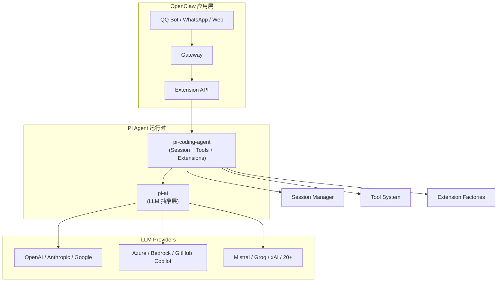
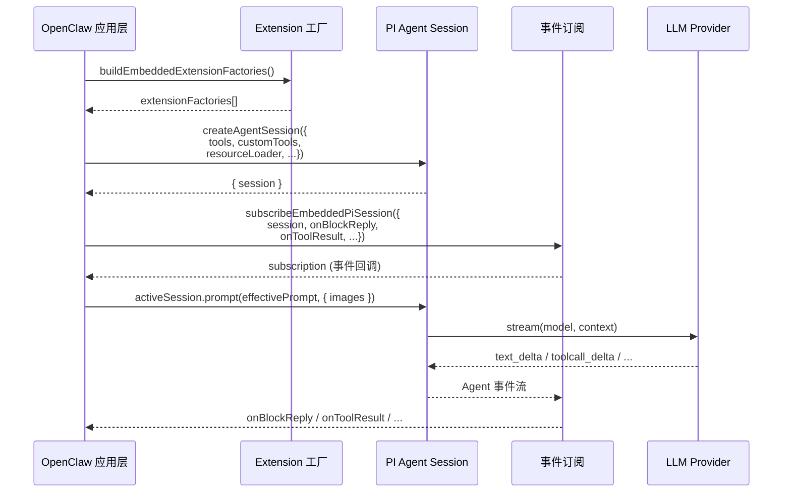
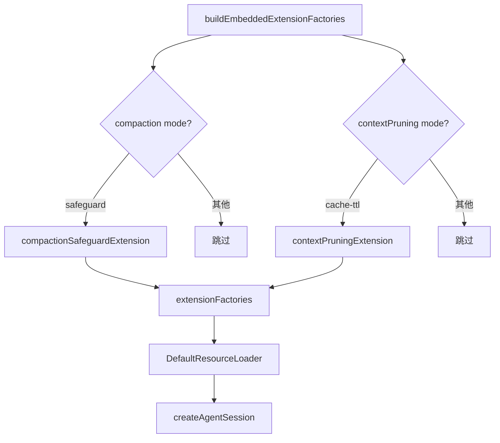
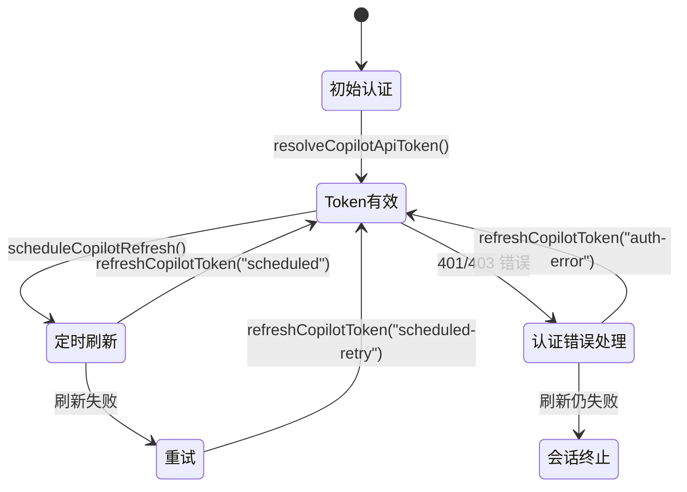
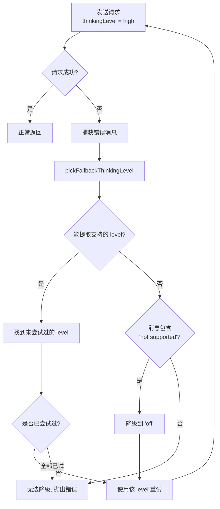
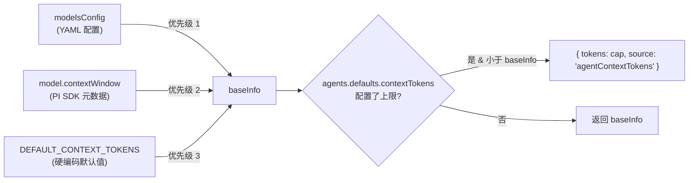
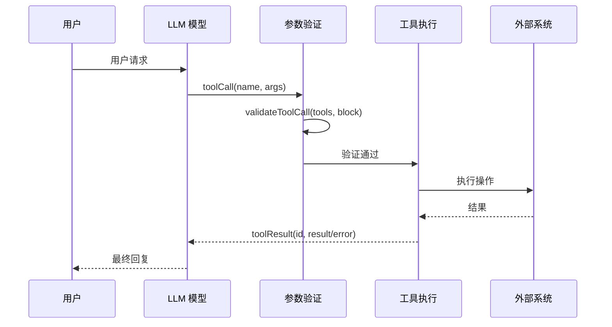
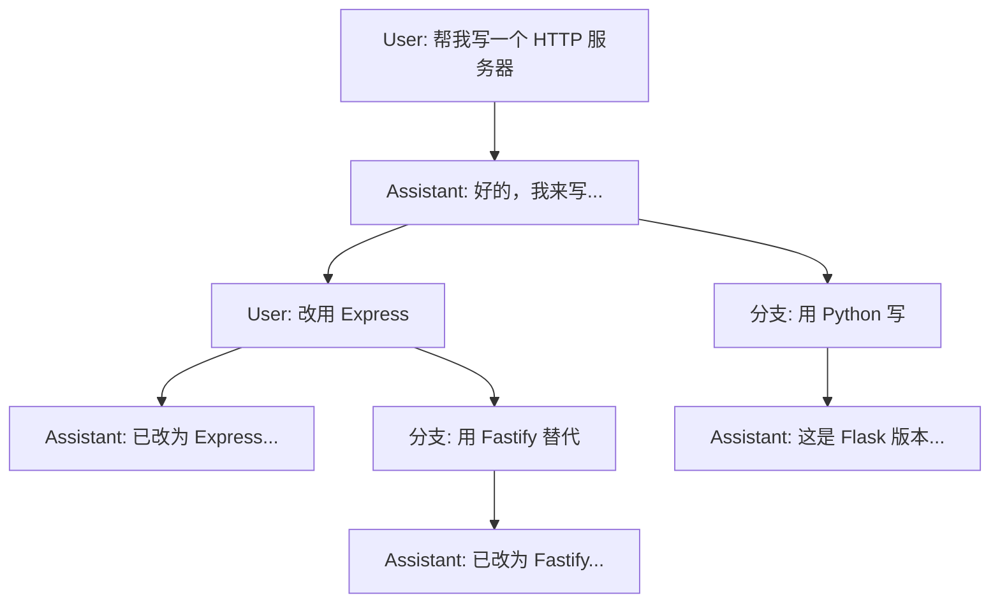
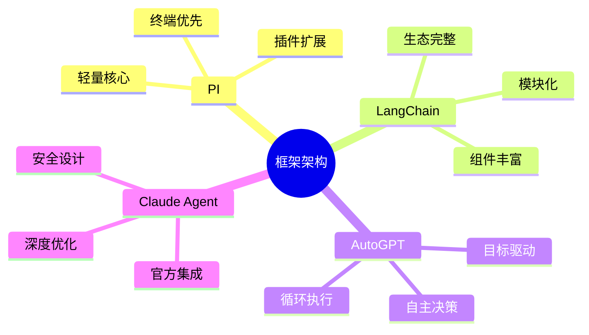

# PI Agent 框架源码深度分析

> 基于 OpenClaw 源码的深度剖析，完整揭示 PI 框架的设计理念、核心机制与 OpenClaw 集成细节

## 目录

- [设计理念](#设计理念)
- [架构总览](#架构总览)
- [核心模块详解](#核心模块详解)
  - [pi-ai — 统一 LLM 抽象层](#pi-ai--统一-llm-抽象层)
  - [pi-coding-agent — 终端编程 Agent](#pi-coding-agent--终端编程-agent)
- [OpenClaw 集成深度剖析](#openclaw-集成深度剖析)
  - [会话生命周期](#会话生命周期)
  - [Extension 扩展体系](#extension-扩展体系)
  - [工具分拆策略 (splitSdkTools)](#工具分拆策略-splitsdktools)
- [Copilot Token 刷新机制](#copilot-token-刷新机制)
- [Thinking Level 自动降级](#thinking-level-自动降级)
- [Model Context Window 解析链](#model-context-window-解析链)
- [Provider 支持矩阵](#provider-支持矩阵)
- [Tool 系统](#tool-系统)
- [Session 管理](#session-管理)
- [流式事件系统](#流式事件系统)
- [快速上手示例](#快速上手示例)
- [框架对比](#框架对比)
- [迁移指南](#迁移指南)
- [常见问题](#常见问题)
- [参考资源](#参考资源)

---

## 设计理念

PI 的核心定位可以用一句话概括：

> **统一 LLM 抽象层 + 终端编程 Agent**

框架拆分为两个独立的 npm 包，各司其职：

| 包名 | 定位 | 核心职责 |
|------|------|---------|
| `@mariozechner/pi-ai` | LLM API 统一抽象 | Provider 适配、模型元数据、流式处理、工具调用、Context 序列化 |
| `@mariozechner/pi-coding-agent` | 终端编程 CLI + Agent 运行时 | Session 管理、内置工具（read/write/edit/bash/grep/find/ls）、Extension/Skill 系统 |

**设计哲学的关键特征：**

- **不内置**：子 Agent、计划模式、MCP、权限弹窗、后台 bash、Todo 列表 —— 全部不在核心里
- **可扩展**：以上所有功能都可通过 Extensions / Skills 在外部实现
- **轻量核心**：保持最小化，按需添加功能，避免框架膨胀
- **Context 即数据**：对话历史是纯 JSON 可序列化数据，天然支持分布式和跨 Provider 传输



---

## 架构总览

### 依赖结构

```
pi-coding-agent
├── @mariozechner/pi-ai          ← 核心 LLM 抽象
│   ├── @anthropic-ai/sdk
│   ├── openai
│   ├── @google/genai
│   ├── @mistralai/mistralai
│   ├── @aws-sdk/client-bedrock-runtime
│   └── ...
├── @mariozechner/pi-agent-core  ← Agent 核心类型
├── @mariozechner/pi-tui         ← 终端 UI
└── chalk, glob, marked, diff
```

### 源码目录结构

```
@mariozechner/pi-ai/
├── src/
│   ├── types.ts              # Context, Tool, Model 等核心类型
│   ├── providers/            # 各 Provider 适配实现
│   │   ├── anthropic.ts
│   │   ├── openai.ts
│   │   ├── google.ts
│   │   ├── bedrock.ts
│   │   └── ...
│   ├── env-api-keys.ts       # 环境变量认证
│   └── oauth.ts              # OAuth 支持

@mariozechner/pi-coding-agent/
├── src/
│   ├── core/
│   │   ├── session.ts        # Session 创建与管理
│   │   ├── tools.ts          # 工具系统
│   │   └── ...
│   ├── modes/
│   │   ├── interactive/      # 终端交互模式
│   │   ├── json/             # JSON 输出模式
│   │   └── rpc/              # RPC 调用模式
│   └── cli.ts
```

---

## 核心模块详解

### pi-ai — 统一 LLM 抽象层

#### 核心三元组：Provider → API → Model

```typescript
// 关系示例
Provider: "anthropic"
  └── API: "anthropic-messages"
       └── Model: "claude-sonnet-4-20250514"

Provider: "openai"
  ├── API: "openai-completions"    // 兼容 OpenAI 协议的 Mistral, Groq, xAI 等
  └── API: "openai-responses"      // OpenAI 官方 Responses API
```

#### Model 元数据

每个模型都携带完整的能力描述和成本信息：

```typescript
interface Model<API> {
  id: string;                         // 模型标识符
  name: string;                       // 显示名称
  api: API;                           // 使用的 API 协议
  provider: string;                   // 提供商

  reasoning: boolean;                 // 是否支持 Thinking/Reasoning
  input: ('text' | 'image')[];       // 支持的输入类型

  cost: {
    input: number;                    // 美元/百万 token
    output: number;
    cacheRead: number;
    cacheWrite: number;
  };

  contextWindow: number;              // 上下文窗口大小 (tokens)
  maxTokens: number;                  // 最大输出 tokens

  baseUrl?: string;                   // 自定义 API 地址
  headers?: Record<string, string>;   // 自定义请求头
  compat?: OpenAICompletionsCompat;   // 兼容性配置
}
```

### pi-coding-agent — 终端编程 Agent

#### 核心功能

- **交互模式**：终端 UI，支持快捷键和斜杠命令
- **工具系统**：7 个内置工具 (read/write/edit/bash/grep/find/ls)
- **会话管理**：JSONL 持久化、树形历史、分支、自动压缩
- **扩展系统**：TypeScript Extension API
- **Skill 系统**：Agent Skills 标准支持

---

## OpenClaw 集成深度剖析

OpenClaw 不是简单地调用 PI SDK，而是围绕 PI 构建了一整套集成层。理解这个集成链路是掌握 OpenClaw Agent 能力的关键。

### 会话生命周期



#### 第一步：构建扩展工厂

在创建 Session 之前，OpenClaw 先组装 Extension 工厂，注入压缩保护和上下文修剪能力：

```typescript
// openclaw/src/agents/pi-embedded-runner/extensions.ts
const extensionFactories = buildEmbeddedExtensionFactories({
  cfg: params.config,
  sessionManager,
  provider: params.provider,
  modelId: params.modelId,
  model: params.model,
});
```

#### 第二步：创建 Agent Session

```typescript
// openclaw/src/agents/pi-embedded-runner/run/attempt.ts
const { session } = await createAgentSession({
  cwd: resolvedWorkspace,
  agentDir,
  authStorage: params.authStorage,
  modelRegistry: params.modelRegistry,
  model: params.model,
  thinkingLevel: mapThinkingLevel(params.thinkLevel),
  tools: builtInTools,
  customTools: allCustomTools,
  sessionManager,
  settingsManager,
  resourceLoader,
});
```

#### 第三步：订阅事件流

通过 `subscribeEmbeddedPiSession` 将 PI Session 的低级事件映射为 OpenClaw 的高层回调：

```typescript
// openclaw/src/agents/pi-embedded-runner/run/attempt.ts
const subscription = subscribeEmbeddedPiSession({
  session: activeSession,
  runId: params.runId,
  hookRunner: getGlobalHookRunner() ?? undefined,
  reasoningMode: params.reasoningLevel ?? "off",
  toolResultFormat: params.toolResultFormat,
  onToolResult: params.onToolResult,
  onReasoningStream: params.onReasoningStream,
  onBlockReply: params.onBlockReply,
  onBlockReplyFlush: params.onBlockReplyFlush,
  onPartialReply: params.onPartialReply,
  onAssistantMessageStart: params.onAssistantMessageStart,
  onAgentEvent: params.onAgentEvent,
  config: params.config,
});
```

#### 第四步：发送 Prompt

```typescript
// 支持可选的图像附件
if (imageResult.images.length > 0) {
  await abortable(activeSession.prompt(effectivePrompt, { images: imageResult.images }));
} else {
  await abortable(activeSession.prompt(effectivePrompt));
}
```

### Extension 扩展体系

OpenClaw 通过 `extensionFactories` 机制向 PI 注入两种关键扩展：



#### 压缩保护 (Compaction Safeguard)

当上下文接近窗口上限时，自动触发对话压缩，防止上下文溢出：

```typescript
// openclaw/src/agents/pi-embedded-runner/extensions.ts
if (resolveCompactionMode(params.cfg) === "safeguard") {
  setCompactionSafeguardRuntime(params.sessionManager, {
    maxHistoryShare: compactionCfg?.maxHistoryShare,
    contextWindowTokens: contextWindowInfo.tokens,
    identifierPolicy: compactionCfg?.identifierPolicy,
    qualityGuardEnabled: qualityGuardCfg?.enabled ?? false,
    qualityGuardMaxRetries: qualityGuardCfg?.maxRetries,
    model: params.model,
    recentTurnsPreserve: compactionCfg?.recentTurnsPreserve,
  });
  factories.push(compactionSafeguardExtension);
}
```

#### 上下文修剪 (Context Pruning)

基于缓存 TTL 策略，对过期的工具结果进行修剪，降低 Token 消耗：

```typescript
// openclaw/src/agents/pi-embedded-runner/extensions.ts
function buildContextPruningFactory(params) {
  const raw = params.cfg?.agents?.defaults?.contextPruning;
  if (raw?.mode !== "cache-ttl") return undefined;
  if (!isCacheTtlEligibleProvider(params.provider, params.modelId)) return undefined;

  const settings = computeEffectiveSettings(raw);
  setContextPruningRuntime(params.sessionManager, {
    settings,
    contextWindowTokens: resolveContextWindowTokens(params),
    isToolPrunable: makeToolPrunablePredicate(settings.tools),
    lastCacheTouchAt: readLastCacheTtlTimestamp(params.sessionManager),
  });
  return contextPruningExtension;
}
```

### 工具分拆策略 (splitSdkTools)

OpenClaw 通过 `splitSdkTools` 将所有工具统一转为 `customTools`，再与客户端工具合并，一起传入 Agent Session：

```typescript
// openclaw/src/agents/pi-embedded-runner/tool-split.ts
export function splitSdkTools(options: {
  tools: AnyAgentTool[];
  sandboxEnabled: boolean;
}): {
  builtInTools: AnyAgentTool[];
  customTools: ReturnType<typeof toToolDefinitions>;
} {
  return {
    builtInTools: [],                    // PI 内置工具清空
    customTools: toToolDefinitions(tools), // 全部转为自定义工具定义
  };
}
```

使用方式：

```typescript
// attempt.ts
const { builtInTools, customTools } = splitSdkTools({
  tools,
  sandboxEnabled: !!sandbox?.enabled,
});

// 追加 OpenResponses 等客户端工具
const allCustomTools = [...customTools, ...clientToolDefs];

const { session } = await createAgentSession({
  tools: builtInTools,          // 空数组 — 不使用 PI 默认内置工具
  customTools: allCustomTools,  // OpenClaw 完全控制工具集
  // ...
});
```

> **设计意图**：OpenClaw 需要对工具的权限、沙箱行为、输出格式等进行精细控制，因此选择将所有工具提升为 `customTools`，绕过 PI 的内置工具默认行为。

---

## Copilot Token 刷新机制

GitHub Copilot 的 API Token 有生命周期限制，OpenClaw 实现了自动刷新机制保证长会话不中断。



### refreshCopilotToken()

核心刷新函数，内部维护 `refreshInFlight` 防止并发刷新：

```typescript
// openclaw/src/agents/pi-embedded-runner/run.ts
const refreshCopilotToken = async (reason: string): Promise<void> => {
  if (!copilotTokenState) return;
  if (copilotTokenState.refreshInFlight) {
    await copilotTokenState.refreshInFlight;  // 等待已有的刷新完成
    return;
  }
  const { resolveCopilotApiToken } = await import("../../providers/github-copilot-token.js");
  copilotTokenState.refreshInFlight = (async () => {
    const copilotToken = await resolveCopilotApiToken({
      githubToken: copilotTokenState.githubToken.trim(),
    });
    authStorage.setRuntimeApiKey(model.provider, copilotToken.token);
    copilotTokenState.expiresAt = copilotToken.expiresAt;
  })()
    .catch((err) => { /* 错误处理 */ })
    .finally(() => { copilotTokenState.refreshInFlight = undefined; });

  await copilotTokenState.refreshInFlight;
};
```

### scheduleCopilotRefresh()

定时调度器，在 Token 过期前提前刷新：

```typescript
// openclaw/src/agents/pi-embedded-runner/run.ts
const scheduleCopilotRefresh = (): void => {
  if (!copilotTokenState || copilotRefreshCancelled) return;
  clearCopilotRefreshTimer();
  const now = Date.now();
  const refreshAt = copilotTokenState.expiresAt - COPILOT_REFRESH_MARGIN_MS;
  const delayMs = Math.max(COPILOT_REFRESH_MIN_DELAY_MS, refreshAt - now);

  const timer = setTimeout(() => {
    refreshCopilotToken("scheduled")
      .then(() => scheduleCopilotRefresh())       // 成功后重新调度
      .catch(() => {
        // 失败后延迟重试
        setTimeout(() => {
          refreshCopilotToken("scheduled-retry")
            .then(() => scheduleCopilotRefresh());
        }, COPILOT_REFRESH_RETRY_MS);
      });
  }, delayMs);

  copilotTokenState.refreshTimer = timer;
};
```

### 认证错误自动恢复

当请求遇到 401/403 认证错误时，自动触发 Token 刷新并重试：

```typescript
const maybeRefreshCopilotForAuthError = async (
  errorText: string,
  retried: boolean,
): Promise<boolean> => {
  if (!copilotTokenState || retried) return false;
  if (!isFailoverErrorMessage(errorText)) return false;
  if (classifyFailoverReason(errorText) !== "auth") return false;
  try {
    await refreshCopilotToken("auth-error");
    scheduleCopilotRefresh();
    return true;     // 允许上层重试
  } catch {
    return false;    // 放弃
  }
};
```

---

## Thinking Level 自动降级

不同 Provider 和模型对 Thinking/Reasoning 的支持级别不同。OpenClaw 实现了 `pickFallbackThinkingLevel()` 进行自动降级，确保请求不会因为不支持的 thinking level 而失败。



### pickFallbackThinkingLevel()

```typescript
// openclaw/src/agents/pi-embedded-helpers/thinking.ts
export function pickFallbackThinkingLevel(params: {
  message?: string;
  attempted: Set<ThinkLevel>;
}): ThinkLevel | undefined {
  const raw = params.message?.trim();
  if (!raw) return undefined;

  const supported = extractSupportedValues(raw);
  if (supported.length === 0) {
    // 错误明确指出不支持但没列出可用值时，直接降到 "off"
    if (/not supported/i.test(raw) && !params.attempted.has("off")) {
      return "off";
    }
    return undefined;
  }

  for (const entry of supported) {
    const normalized = normalizeThinkLevel(entry);
    if (!normalized) continue;
    if (params.attempted.has(normalized)) continue;
    return normalized;  // 返回第一个未尝试过的支持级别
  }
  return undefined;
}
```

### 调用场景

在 `run.ts` 的主循环中，遇到 thinking level 不支持的错误时自动降级：

```typescript
// prompt 错误时
const fallbackThinking = pickFallbackThinkingLevel({
  message: errorText,
  attempted: attemptedThinking,
});
if (fallbackThinking) {
  log.warn(`unsupported thinking level for ${provider}/${modelId}; retrying with ${fallbackThinking}`);
  thinkLevel = fallbackThinking;
  continue;  // 重试循环
}

// assistant 消息错误时
const fallbackThinking = pickFallbackThinkingLevel({
  message: lastAssistant?.errorMessage,
  attempted: attemptedThinking,
});
if (fallbackThinking && !aborted) {
  thinkLevel = fallbackThinking;
  continue;
}
```

### 跨 Provider Thinking 块转换

当对话历史中包含 Thinking 块，而目标 Provider 使用不同 API 时，PI 自动进行转换：

| 源消息类型 | 同 API Provider | 不同 API Provider |
|-----------|----------------|-------------------|
| Thinking 块 | 保持原生格式 | 转换为 `<thinking>...</thinking>` 文本标签 |
| 其他内容 | 保持不变 | 保持不变 |

---

## Model Context Window 解析链

OpenClaw 实现了多层级的上下文窗口解析链，确保模型在合理的 Token 限制内运行。



### resolveContextWindowInfo()

```typescript
// openclaw/src/agents/context-window-guard.ts
export function resolveContextWindowInfo(params: {
  cfg: OpenClawConfig | undefined;
  provider: string;
  modelId: string;
  modelContextWindow?: number;
  defaultTokens: number;
}): ContextWindowInfo {
  // 优先级 1：YAML 配置中的 models.providers[provider].models[id].contextWindow
  const fromModelsConfig = (() => {
    const providers = params.cfg?.models?.providers;
    const providerEntry = providers?.[params.provider];
    const models = Array.isArray(providerEntry?.models) ? providerEntry.models : [];
    const match = models.find((m) => m?.id === params.modelId);
    return normalizePositiveInt(match?.contextWindow);
  })();

  // 优先级 2：PI SDK 模型元数据中的 contextWindow
  const fromModel = normalizePositiveInt(params.modelContextWindow);

  // 优先级 3：硬编码默认值
  const baseInfo = fromModelsConfig
    ? { tokens: fromModelsConfig, source: "modelsConfig" }
    : fromModel
      ? { tokens: fromModel, source: "model" }
      : { tokens: Math.floor(params.defaultTokens), source: "default" };

  // 应用 agents.defaults.contextTokens 上限
  const capTokens = normalizePositiveInt(params.cfg?.agents?.defaults?.contextTokens);
  if (capTokens && capTokens < baseInfo.tokens) {
    return { tokens: capTokens, source: "agentContextTokens" };
  }

  return baseInfo;
}
```

### 安全保护常量

```typescript
export const CONTEXT_WINDOW_HARD_MIN_TOKENS = 16_000;   // 低于此值直接拒绝
export const CONTEXT_WINDOW_WARN_BELOW_TOKENS = 32_000;  // 低于此值输出警告
```

### evaluateContextWindowGuard()

```typescript
// openclaw/src/agents/context-window-guard.ts
export function evaluateContextWindowGuard(params: {
  info: ContextWindowInfo;
  warnBelowTokens?: number;
  hardMinTokens?: number;
}): ContextWindowGuardResult {
  const warnBelow = Math.max(1, Math.floor(params.warnBelowTokens ?? CONTEXT_WINDOW_WARN_BELOW_TOKENS));
  const hardMin = Math.max(1, Math.floor(params.hardMinTokens ?? CONTEXT_WINDOW_HARD_MIN_TOKENS));
  const tokens = Math.max(0, Math.floor(params.info.tokens));
  return {
    ...params.info,
    tokens,
    shouldWarn: tokens > 0 && tokens < warnBelow,    // < 32,000 → 警告
    shouldBlock: tokens > 0 && tokens < hardMin,     // < 16,000 → 阻断
  };
}
```

### 在运行时的应用

```typescript
// openclaw/src/agents/pi-embedded-runner/run.ts
const ctxInfo = resolveContextWindowInfo({
  cfg: params.config, provider, modelId,
  modelContextWindow: model.contextWindow,
  defaultTokens: DEFAULT_CONTEXT_TOKENS,
});

// 将解析后的有效窗口回写到模型，让 PI 的自动压缩使用正确的阈值
const effectiveModel = ctxInfo.tokens < (model.contextWindow ?? Infinity)
  ? { ...model, contextWindow: ctxInfo.tokens }
  : model;

const ctxGuard = evaluateContextWindowGuard({
  info: ctxInfo,
  warnBelowTokens: CONTEXT_WINDOW_WARN_BELOW_TOKENS,
  hardMinTokens: CONTEXT_WINDOW_HARD_MIN_TOKENS,
});

if (ctxGuard.shouldBlock) {
  throw new FailoverError(
    `Model context window too small (${ctxGuard.tokens} tokens). Minimum is ${CONTEXT_WINDOW_HARD_MIN_TOKENS}.`,
    { reason: "unknown", provider, model: modelId },
  );
}
```

---

## Provider 支持矩阵

| Provider | API 类型 | 认证方式 | Reasoning | Vision |
|----------|---------|---------|-----------|--------|
| OpenAI | openai-responses / openai-completions | API Key | ✓ (o1/o3/gpt-5) | ✓ |
| Anthropic | anthropic-messages | API Key / OAuth | ✓ (Claude Sonnet 4) | ✓ |
| Google | google-generative-ai | API Key / OAuth | ✓ (Gemini 2.5) | ✓ |
| Azure OpenAI | azure-openai-responses | API Key | ✓ | ✓ |
| Amazon Bedrock | bedrock-converse-stream | AWS Credentials | 部分 | ✓ |
| Mistral | openai-completions | API Key | 部分 | 部分 |
| Groq | openai-completions | API Key | 部分 | ✗ |
| xAI | openai-completions | API Key | 部分 (Grok) | ✗ |
| Cerebras | openai-completions | API Key | 部分 | ✗ |
| OpenRouter | openai-completions | API Key | 取决于模型 | 取决于模型 |
| Vercel AI Gateway | openai-completions | API Key | 取决于模型 | 取决于模型 |
| MiniMax | openai-completions | API Key | ✗ | ✗ |
| Kimi For Coding | anthropic-messages | API Key | ✗ | ✗ |
| GitHub Copilot | openai-completions | OAuth | 取决于模型 | 取决于模型 |
| Google Gemini CLI | google-gemini-cli | OAuth | ✓ | ✓ |
| Antigravity | google-generative-ai | OAuth | 取决于模型 | 取决于模型 |

> 通过 `openai-completions` 协议，任何兼容 OpenAI API 的服务都可以接入，包括 Ollama 本地模型。

---

## Tool 系统

### TypeBox Schema 定义

PI 使用 TypeBox 进行类型安全的工具参数定义：

```typescript
import { Type, StringEnum } from '@mariozechner/pi-ai';

const tools: Tool[] = [{
  name: 'get_weather',
  description: 'Get current weather for a location',
  parameters: Type.Object({
    location: Type.String({ description: 'City name' }),
    units: Type.Optional(
      StringEnum(['celsius', 'fahrenheit'], { default: 'celsius' })
    )
  })
}];
```

支持的类型：

| TypeBox | 用途 | 示例 |
|---------|------|------|
| `Type.String()` | 字符串 | 文件路径、名称 |
| `Type.Number()` | 数值 | 行号、计数 |
| `Type.Boolean()` | 布尔值 | 开关标志 |
| `Type.Array(T)` | 数组 | 文件列表 |
| `Type.Object({})` | 对象 | 复杂参数 |
| `Type.Optional(T)` | 可选字段 | 默认值参数 |
| `StringEnum([])` | 枚举 | 模式选择 |

### 内置工具

```typescript
const BUILTIN_TOOLS = [
  'read',    // 读取文件内容
  'write',   // 创建/覆盖文件
  'edit',    // 精确编辑文件
  'bash',    // 执行 Shell 命令
  'grep',    // 文本搜索 (ripgrep)
  'find',    // 文件查找
  'ls',      // 列出目录
];
```

### 工具调用流程



### 工具调用验证

```typescript
import { validateToolCall } from '@mariozechner/pi-ai';

for (const block of response.content) {
  if (block.type === 'toolCall') {
    try {
      const validatedArgs = validateToolCall(tools, block);
      const result = await executeMyTool(block.name, validatedArgs);

      context.messages.push({
        role: 'toolResult',
        toolCallId: block.id,
        toolName: block.name,
        content: [{ type: 'text', text: result }],
        isError: false,
        timestamp: Date.now()
      });
    } catch (error) {
      context.messages.push({
        role: 'toolResult',
        toolCallId: block.id,
        toolName: block.name,
        content: [{ type: 'text', text: error.message }],
        isError: true,     // 让模型看到错误并重试
        timestamp: Date.now()
      });
    }
  }
}
```

---

## Session 管理

### JSONL 树形历史

PI 的会话不是简单的线性列表，而是树形结构，支持分支和回溯：



会话持久化为 JSONL 文件，存储在 `~/.pi/agent/sessions/` 目录。

### 会话操作

| 命令 | 功能 |
|------|------|
| `/tree` | 浏览会话树 |
| `/fork` | 从当前节点创建分支 |
| `/compact` | 手动触发上下文压缩 |

### Context 序列化

Context 是纯 JSON，天然支持序列化和跨 Provider 传输：

```typescript
const context: Context = {
  systemPrompt: 'You are a helpful assistant.',
  messages: [
    { role: 'user', content: 'Hello!' },
    { role: 'assistant', content: [{ type: 'text', text: 'Hi!' }] }
  ],
  tools: [/* 工具定义 */]
};

const serialized = JSON.stringify(context);
const restored: Context = JSON.parse(serialized);
const response = await complete(model, restored);  // 完美恢复
```

---

## 流式事件系统

### 事件类型

```typescript
const s = stream(model, context);

for await (const event of s) {
  switch (event.type) {
    case 'start':           // 流开始
    case 'text_start':      // 文本块开始
    case 'text_delta':      // 文本增量
    case 'text_end':        // 文本块结束
    case 'thinking_start':  // Thinking 开始
    case 'thinking_delta':  // Thinking 增量
    case 'thinking_end':    // Thinking 结束
    case 'toolcall_start':  // 工具调用开始
    case 'toolcall_delta':  // 工具参数增量 (渐进式 JSON)
    case 'toolcall_end':    // 工具调用完成
    case 'done':            // 流结束
    case 'error':           // 错误
  }
}

const result = await s.result();
```

### 渐进式 JSON 解析

在 `toolcall_delta` 期间，工具参数是逐步解析的：

```typescript
for await (const event of s) {
  if (event.type === 'toolcall_delta') {
    const call = event.partial.content[event.contentIndex];
    if (call.type === 'toolCall') {
      // 注意：参数可能不完整
      // - 字符串可能被截断
      // - 数组可能不完整
      // - 嵌套对象可能部分填充
      if (call.arguments?.path) {
        console.log(`Writing to: ${call.arguments.path}`);
      }
    }
  }
}
```

### Abort/Resume 支持

```typescript
const controller = new AbortController();
setTimeout(() => controller.abort(), 5000);

const s = stream(model, context, { signal: controller.signal });

for await (const event of s) {
  if (event.type === 'text_delta') process.stdout.write(event.delta);
}

const partial = await s.result();
if (partial.stopReason === 'aborted') {
  // 添加部分响应并继续
  context.messages.push(partial);
  context.messages.push({ role: 'user', content: 'Please continue' });
  const continuation = await complete(model, context);
}
```

---

## 快速上手示例

### 基础对话

```typescript
import { getModel, complete } from '@mariozechner/pi-ai';

const model = getModel('anthropic', 'claude-sonnet-4-20250514');
const response = await complete(model, {
  messages: [{ role: 'user', content: 'What is TypeScript?' }]
});

for (const block of response.content) {
  if (block.type === 'text') console.log(block.text);
}
```

### 工具调用

```typescript
import { Type, getModel, complete, Tool } from '@mariozechner/pi-ai';

const tools: Tool[] = [{
  name: 'get_weather',
  description: 'Get current weather for a location',
  parameters: Type.Object({
    city: Type.String({ description: 'City name' })
  })
}];

const response = await complete(getModel('openai', 'gpt-4o-mini'), {
  messages: [{ role: 'user', content: 'What is the weather in Tokyo?' }],
  tools
});
```

### Thinking/Reasoning

```typescript
import { getModel, completeSimple } from '@mariozechner/pi-ai';

const model = getModel('anthropic', 'claude-sonnet-4-20250514');
const response = await completeSimple(model, {
  messages: [{ role: 'user', content: 'Solve: 2x + 5 = 13' }]
}, {
  reasoning: 'medium'  // minimal | low | medium | high | xhigh
});

for (const block of response.content) {
  if (block.type === 'thinking') console.log('思考过程:', block.thinking);
  else if (block.type === 'text') console.log('回答:', block.text);
}
```

### 自定义模型 (Ollama)

```typescript
import { Model, complete } from '@mariozechner/pi-ai';

const ollamaModel: Model<'openai-completions'> = {
  id: 'llama-3.1-8b',
  name: 'Llama 3.1 8B (Ollama)',
  api: 'openai-completions',
  provider: 'ollama',
  baseUrl: 'http://localhost:11434/v1',
  cost: { input: 0, output: 0, cacheRead: 0, cacheWrite: 0 },
  contextWindow: 128000,
  maxTokens: 32000
};

const response = await complete(ollamaModel, context, { apiKey: 'dummy' });
```

### 图像输入

```typescript
import { readFileSync } from 'fs';
import { getModel, complete } from '@mariozechner/pi-ai';

const model = getModel('openai', 'gpt-4o-mini');
if (model.input.includes('image')) {
  const response = await complete(model, {
    messages: [{
      role: 'user',
      content: [
        { type: 'text', text: 'What is in this image?' },
        { type: 'image', data: readFileSync('image.png').toString('base64'), mimeType: 'image/png' }
      ]
    }]
  });
}
```

---

## 框架对比

### 总览

| 框架 | 开发团队 | 定位 | 核心特点 |
|------|---------|------|---------|
| **PI** | Mario Zechner | 轻量级终端 Agent | 极简设计、强扩展性、专注编程 |
| **LangChain** | LangChain AI | 通用 LLM 应用框架 | 生态丰富、功能全面、学习曲线陡 |
| **LangGraph** | LangChain AI | Agent 工作流编排 | 图结构、状态管理、复杂编排 |
| **AutoGPT** | Significant Gravitas | 自主 Agent | 目标驱动、长期规划、自我反思 |
| **Claude Agent** | Anthropic | 官方 Agent 工具 | 深度集成 Claude、官方支持 |
| **SWE-Agent** | Princeton | 软件工程 Agent | 学术背景、Bug 修复、代码质量 |

### 架构设计哲学



### 关键维度对比

| 维度 | PI | LangChain | AutoGPT | Claude Agent |
|------|-----|-----------|---------|-------------|
| **语言** | TypeScript | Python/TS | Python | Python |
| **核心大小** | 小 | 大 | 中 | 中 |
| **Provider 数** | 20+ | 50+ | 5+ | 1 (Anthropic) |
| **类型安全** | 强 (TypeBox) | 中 (Zod) | 弱 (JSON) | 中 |
| **流式粒度** | 完整 (含工具参数) | 部分 | 基础 | 完整 |
| **Thinking 流式** | ✓ | ✗ | ✗ | ✓ |
| **会话分支** | ✓ (/tree /fork) | ✗ | ✗ | ✗ |
| **上下文压缩** | ✓ 自动 | ✗ | ✗ | 部分 |
| **学习曲线** | 低-中 | 中-高 | 中 | 低 |
| **冷启动** | 快 (~500ms) | 中 (~800ms) | 慢 (~2s) | 中 |
| **内存占用** | 低 (~50MB) | 中 (~100MB) | 高 (~200MB) | 中 |

### 适用场景推荐

| 场景 | 推荐框架 | 原因 |
|------|---------|------|
| 日常编程助手 | PI | 快速、简洁、工具齐全 |
| 复杂企业应用 | LangChain | 生态丰富、模块化、商业支持 |
| 自主长期任务 | AutoGPT | 目标驱动、自我反思 |
| Claude 深度集成 | Claude Agent | 官方优化、性能最佳 |
| 学术 Bug 修复 | SWE-Agent | 专业优化 |
| 多 Provider 切换 | PI | 统一抽象、切换无感知 |

---

## 迁移指南

### 从 LangChain 迁移到 PI

```typescript
// ❌ LangChain
import { ChatOpenAI } from '@langchain/openai';
const llm = new ChatOpenAI({ model: 'gpt-4o' });
const response = await llm.invoke([new HumanMessage('Hello')]);

// ✅ PI
import { getModel, complete } from '@mariozechner/pi-ai';
const model = getModel('openai', 'gpt-4o-mini');
const response = await complete(model, {
  messages: [{ role: 'user', content: 'Hello' }]
});
```

**工具定义迁移：**

```typescript
// ❌ LangChain (Zod)
import { z } from 'zod';
const schema = z.object({ city: z.string().describe('City name') });

// ✅ PI (TypeBox)
import { Type } from '@mariozechner/pi-ai';
const schema = Type.Object({ city: Type.String({ description: 'City name' }) });
```

### 从 AutoGPT 迁移到 PI

```python
# ❌ AutoGPT (Python)
from autogpt import Agent
agent = Agent(name="Coder", role="Write code")
```

```typescript
// ✅ PI (TypeScript)
import { createAgentSession } from '@mariozechner/pi-coding-agent';
const { session } = await createAgentSession({ /* ... */ });
await session.prompt("Write a web server");
```

---

## 常见问题

### Q1: Context Window 和 Max Tokens 是什么？

- **Context Window**：模型能处理的总 Token 数（输入 + 输出）
- **Max Tokens**：单次响应能输出的最大 Token 数

```typescript
model.contextWindow === 200000  // 20 万 Tokens 上下文 (Claude Sonnet 4)
model.maxTokens === 8192        // 单次最多输出 8192 Tokens
```

OpenClaw 的上下文窗口解析链会根据配置自动调整有效窗口大小，并在低于 16,000 时阻断请求、低于 32,000 时发出警告。

### Q2: 如何管理上下文窗口？

OpenClaw 提供多层保护：

1. **resolveContextWindowInfo()** — 多来源解析有效窗口大小
2. **evaluateContextWindowGuard()** — 最小值保护和警告
3. **compactionSafeguardExtension** — 接近上限时自动压缩
4. **contextPruningExtension** — 基于 cache-ttl 修剪过期内容

在 `openclaw.yml` 中配置：

```yaml
agents:
  defaults:
    contextTokens: 128000
    compaction:
      maxHistoryShare: 0.7
      recentTurnsPreserve: 3
      qualityGuard:
        enabled: true
        maxRetries: 2
    contextPruning:
      mode: cache-ttl
```

### Q3: 如何降低成本？

```typescript
// 1. 使用更便宜的模型
const model = getModel('openai', 'gpt-4o-mini');

// 2. 减少 Thinking 预算
await completeSimple(model, context, { reasoning: 'minimal' });

// 3. 利用缓存 (长上下文场景，Provider 侧自动缓存)
// Anthropic 和 Google 支持 Prompt Caching

// 4. 启用上下文修剪，减少重复的工具结果
// 配置 contextPruning.mode: "cache-ttl"
```

### Q4: Provider 之间如何选择？

| 场景 | 推荐 Provider | 原因 |
|------|--------------|------|
| 编程任务 | Anthropic Claude | 代码能力强，长上下文 |
| 快速响应 | Groq / Cerebras | 推理速度快 |
| 多模态 (图像) | OpenAI GPT-4o / Google Gemini | Vision 能力强 |
| 低成本 | MiniMax / Kimi / gpt-4o-mini | 价格低 |
| 企业合规 | Azure / Bedrock | 数据合规、私有部署 |
| 免费使用 | GitHub Copilot | 绑定 Copilot 订阅 |

### Q5: 如何调试？

```typescript
// 打印发送给 Provider 的完整 Payload
await complete(model, context, {
  onPayload: (payload) => {
    console.log(JSON.stringify(payload, null, 2));
  }
});
```

OpenClaw 的 verbose level 可以输出更多调试信息：

```yaml
agents:
  defaults:
    verboseLevel: debug  # off | info | debug
```

### Q6: Thinking Level 不支持怎么办？

不需要手动处理。OpenClaw 的 `pickFallbackThinkingLevel()` 会自动解析错误消息，找到 Provider 支持的 thinking level 并重试。降级顺序依赖于 Provider 错误消息中列出的支持值，最终回退到 `"off"`。

### Q7: GitHub Copilot Token 过期了怎么办？

不需要手动处理。`scheduleCopilotRefresh()` 会在 Token 过期前自动刷新。即使刷新失败也会重试。如果请求遇到认证错误，`maybeRefreshCopilotForAuthError()` 会自动触发刷新并重试请求。

---

## 参考资源

### 官方资源

- [PI Mono Repo](https://github.com/badlogic/pi-mono)
- [PI AI NPM](https://www.npmjs.com/package/@mariozechner/pi-ai)
- [PI Coding Agent NPM](https://www.npmjs.com/package/@mariozechner/pi-coding-agent)
- [Shitty Coding Agent](https://shittycodingagent.ai) — PI 官网

### 文档

- [PI AI README](../../node_modules/@mariozechner/pi-ai/README.md)
- [PI Coding Agent README](../../node_modules/@mariozechner/pi-coding-agent/README.md)

### 关键源码文件

| 文件 | 职责 |
|------|------|
| `openclaw/src/agents/pi-embedded-runner/run.ts` | Agent 运行主循环、Copilot 刷新、Thinking 降级 |
| `openclaw/src/agents/pi-embedded-runner/run/attempt.ts` | 单次 attempt 执行、Session 创建、事件订阅 |
| `openclaw/src/agents/pi-embedded-runner/extensions.ts` | Extension 工厂构建 |
| `openclaw/src/agents/pi-embedded-runner/tool-split.ts` | 工具分拆策略 |
| `openclaw/src/agents/pi-embedded-subscribe.ts` | PI Session 事件订阅桥接 |
| `openclaw/src/agents/pi-embedded-helpers/thinking.ts` | Thinking Level 降级逻辑 |
| `openclaw/src/agents/context-window-guard.ts` | Context Window 解析与保护 |
| `openclaw/src/agents/pi-extensions/compaction-safeguard.ts` | 压缩保护扩展 |

---

*基于 OpenClaw v2026.2.3-1 源码分析*
