# OpenViking 项目全面指南

> 为 AI Agent 而生的上下文数据库

## 📋 目录

1. [项目简介](#1-项目简介)
2. [核心概念](#2-核心概念)
3. [系统架构](#3-系统架构)
4. [上下文类型](#4-上下文类型)
5. [上下文层级](#5-上下文层级)
6. [存储架构](#6-存储架构)
7. [检索机制](#7-检索机制)
8. [会话管理](#8-会话管理)
9. [快速开始](#9-快速开始)
10. [部署模式](#10-部署模式)
11. [API 参考](#11-api-参考)
12. [最佳实践](#12-最佳实践)

---

## 1. 项目简介

### 1.1 什么是 OpenViking？

**OpenViking** 是由**火山引擎（Volcengine）** 开源的、专为 **AI Agent** 设计的**上下文数据库**（Context Database for AI Agents）。

它将传统 RAG 的扁平向量存储转变为**文件系统范式**（Filesystem Paradigm），让开发者像管理本地文件一样统一管理 Agent 的记忆（Memory）、资源（Resource）、技能（Skill）。

> **官方定位**：`openviking/__init__.py` 中的 slogan —— "An Agent-native context database. Data in, Context out."

### 1.2 为什么需要 OpenViking？

在构建 AI Agent 时，开发者面临五大挑战：

| 挑战 | 传统方案 | OpenViking 方案 |
|------|----------|-----------------|
| **上下文碎片化** | 记忆在代码、资源在向量库、技能散落各处 | 统一文件系统结构化管理 |
| **上下文猛增** | 简单截断导致信息损失 | 分层加载 (L0/L1/L2) 按需获取 |
| **检索效果差** | 平铺式向量检索，缺乏全局视野 | 目录递归检索，理解完整语境 |
| **不可观测** | 检索链路黑箱，难以调试 | 可视化检索轨迹 |
| **记忆迭代有限** | 仅有用户记忆 | 自动提取 Agent 经验记忆 |

### 1.3 核心理念

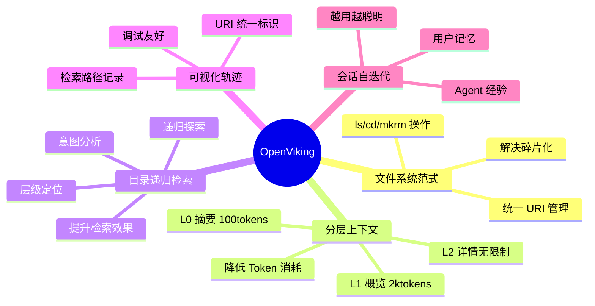

### 1.4 技术栈

OpenViking 是一个多语言混合工程：

| 层级 | 技术 | 说明 |
|------|------|------|
| **应用 / 服务层** | Python ≥ 3.10 | `openviking/`（核心包）、`openviking_cli/`（CLI 入口） |
| **HTTP 服务** | FastAPI + Uvicorn | `openviking/server/`，默认监听 `127.0.0.1:1933` |
| **底层文件系统** | **AGFS**（Aggregated File System）| Go 实现位于 `third_party/agfs/`，由 c44pt0r 开源 |
| **AGFS 重写版** | **RAGFS**（Rust 实现）| `crates/ragfs/`、`crates/ragfs-python/`，通过 PyO3 暴露给 Python；通过 `RAGFS_IMPL=auto/rust/go` 切换 |
| **CLI 工具** | Rust | `crates/ov_cli/`，命令名 `ov`（pyproject.toml `[project.scripts]`） |
| **核心扩展** | C++17 | `src/`，构建为 abi3 Python 扩展（向量引擎/索引等） |
| **向量索引** | 本地持久化 / HTTP / 火山引擎 VikingDB | `openviking/storage/vectordb*` |
| **模型服务** | Volcengine（豆包）/ OpenAI / OpenAI Codex / Kimi / GLM(Z.AI) / Ollama / Gemini / Jina / Voyage / MiniMax | VLM / Embedding / Rerank 三类 |
| **Bot 层** | TypeScript | `bot/vikingbot/`，可通过 `openviking-server --with-bot` 联合启动 |

> **注意**：项目根目录的 `Dockerfile`、`Makefile`、`Cargo.toml`、`pyproject.toml` 一起出现，本身就反映了"Python 主壳 + Rust/Go/C++ 内核"的多语言架构。

---

## 2. 核心概念

### 2.1 Viking URI

OpenViking 使用统一的 `viking://` 协议作为资源标识符。所有目录都是"数据记录"，由 `openviking/core/directories.py` 中的 `PRESET_DIRECTORIES` 在初始化时按需创建：

```
viking://
├── session/                       # 会话临时上下文（消息、归档、tool 结果）
│   └── {session_id}/
│       ├── messages.jsonl
│       └── history/archive_{N}/
├── user/                          # 用户作用域（跨会话持久化）
│   └── memories/
│       ├── profile.md             # ⚠️ 这是文件，不是目录
│       ├── preferences/           # 偏好（按主题聚合）
│       ├── entities/              # 实体（人/项目/概念）
│       └── events/                # 事件（决策/里程碑，不更新）
├── agent/                         # Agent 作用域（学习记忆 + 指令 + 技能）
│   ├── memories/
│   │   ├── cases/                 # 案例：具体问题+解决方案
│   │   └── patterns/              # 模式：可复用流程（不更新）
│   ├── instructions/              # Agent 行为约束/规则
│   └── skills/                    # Claude Skills 协议格式的技能
└── resources/                     # 资源：项目文档、代码、网页
    └── {project}/...
```

> **作用域隔离**：当 `namespace_policy.isolate_user_scope_by_agent=True` 时，会自动插入 `viking://user/{user_id}/...` 这一层；agent 作用域同理。

### 2.2 三大上下文类型

源码 `openviking_cli/retrieve/types.py` 中 `ContextType` 枚举：

| 类型 | 字面量 | 用途 | 默认根目录 |
|------|--------|------|-----------|
| **Resource** | `"resource"` | 外部知识 | `viking://resources/` |
| **Memory**   | `"memory"`   | Agent 认知 | `viking://user/memories/`、`viking://agent/memories/`、`viking://session/...` |
| **Skill**    | `"skill"`    | 可调用能力 | `viking://agent/skills/` |

### 2.3 三层信息模型（L0/L1/L2）

每个上下文目录在 AGFS 中以**统一文件名**承载三层：

| 层级 | 文件名 | 典型大小 | 用途 |
|------|--------|---------|------|
| **L0** | `.abstract.md` | ≈100 tokens | 入向量库、用于全局召回 |
| **L1** | `.overview.md` | ≈2k tokens | Rerank 输入、目录导航、摘要预览 |
| **L2** | 原始文件 (`*.md`/`*.pdf`/...) | 无限制 | 按需加载完整内容 |

---

## 3. 系统架构

### 3.1 整体架构图

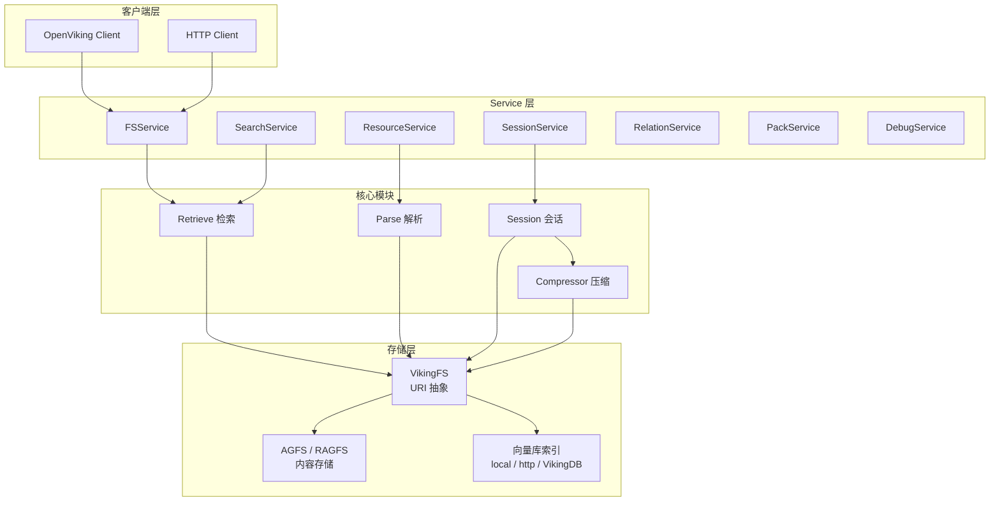

### 3.2 数据流架构

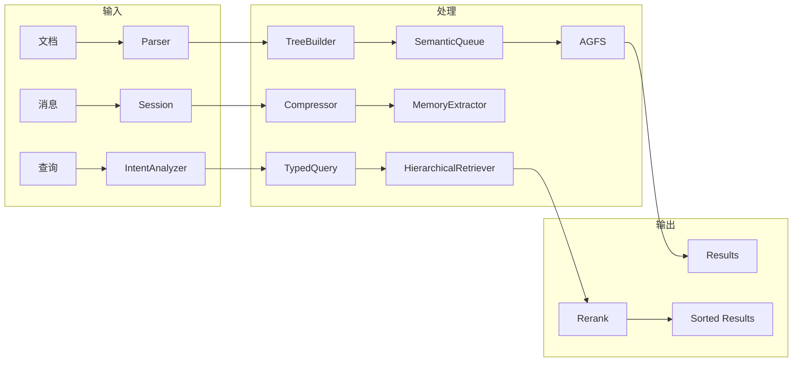

### 3.3 核心模块职责

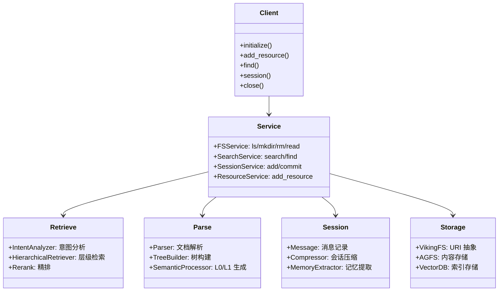

---

## 4. 上下文类型

### 4.1 Resource（资源）

**定义**：Agent 可以引用的外部知识

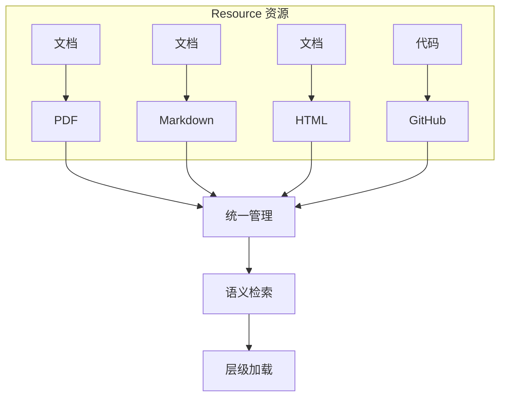

### 4.2 Memory（记忆）

**定义**：Agent 关于用户、自身经验和工具/技能使用情况的学习知识。源码 `openviking/session/memory_extractor.py` 中 `MemoryCategory` 枚举共定义 **8 种分类**（不是网上常见说法的 6 种）：

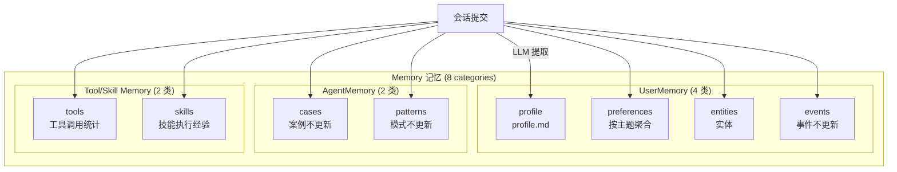

> **CATEGORY_DIRS 映射**（来自源码 `MemoryExtractor.CATEGORY_DIRS`）：
> - `profile → memories/profile.md`（**单文件**，全局合并）
> - `preferences/entities/events → memories/{category}/`
> - `cases/patterns → memories/{category}/`
> - `tools/skills → memories/{category}/`

### 4.3 Skill（技能）

**定义**：Agent 可以调用的能力

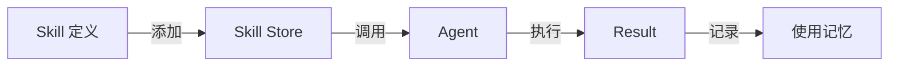

---

## 5. 上下文层级

### 5.1 L0/L1/L2 关系

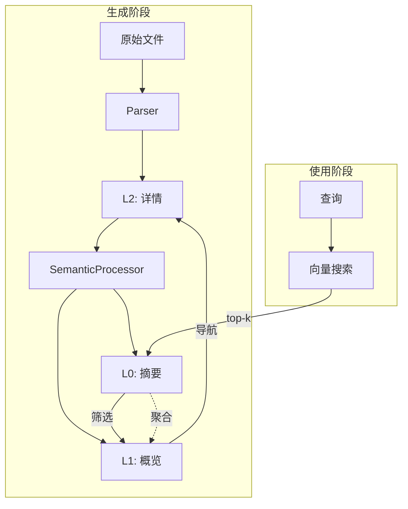

### 5.2 目录结构示例

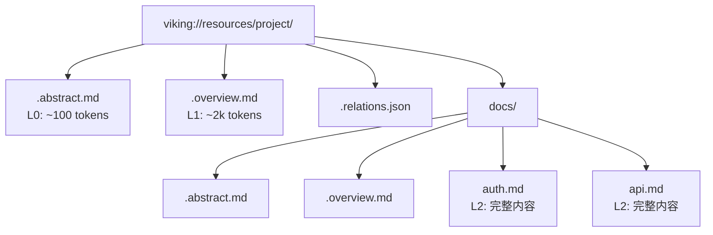

---

## 6. 存储架构

### 6.1 双层存储架构

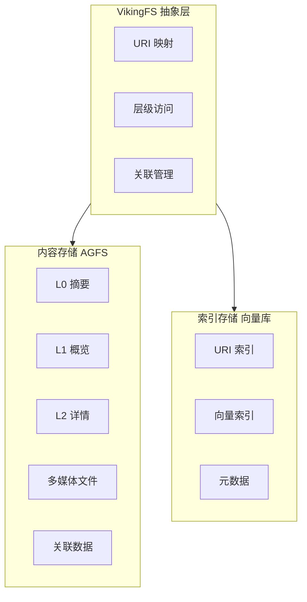

### 6.2 数据一致性

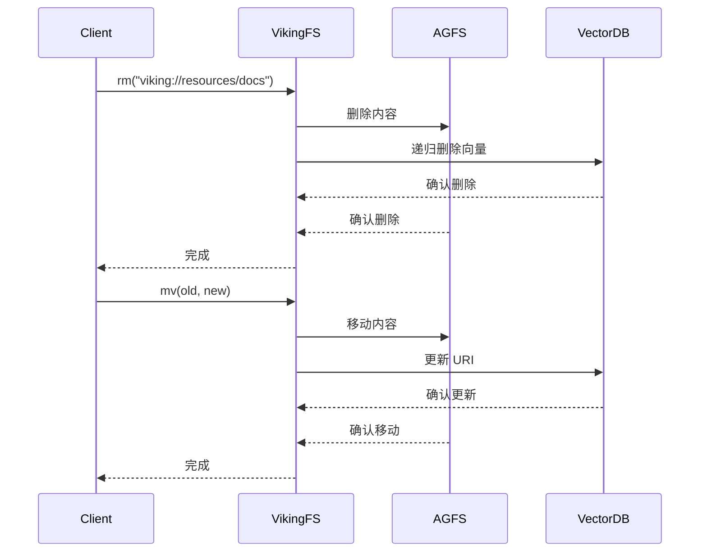

---

## 7. 检索机制

### 7.1 两阶段检索流程

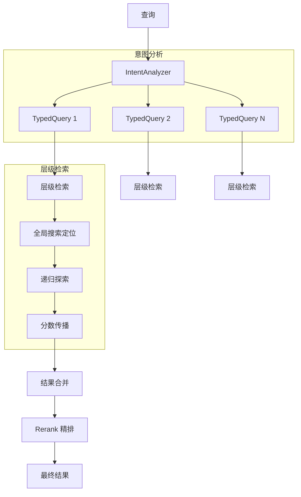

### 7.2 意图分析

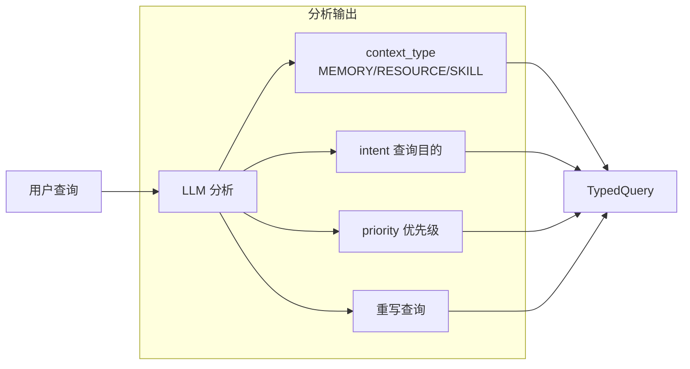

### 7.3 递归检索算法

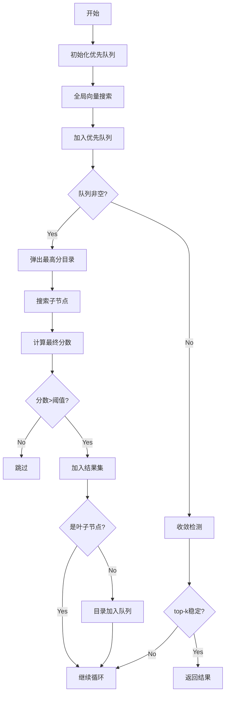

---

## 8. 会话管理

### 8.1 会话生命周期

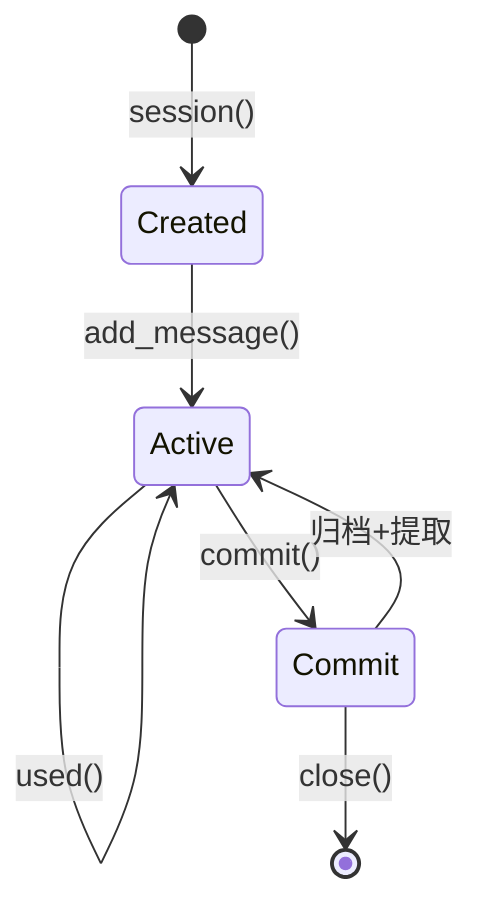

### 8.2 记忆提取流程

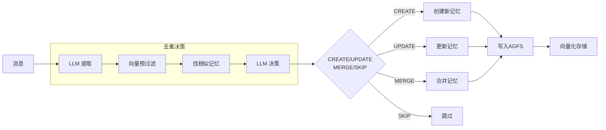

---

## 9. 快速开始

### 9.1 安装

```bash
pip install openviking
```

### 9.2 配置

创建 `~/.openviking/ov.conf`:

```json
{
  "embedding": {
    "dense": {
      "api_base": "https://ark.cn-beijing.volces.com/api/v3",
      "api_key": "your-api-key",
      "provider": "volcengine",
      "dimension": 1024,
      "model": "doubao-embedding-vision-250615"
    }
  },
  "vlm": {
    "api_base": "https://ark.cn-beijing.volces.com/api/v3",
    "api_key": "your-api-key",
    "provider": "volcengine",
    "model": "doubao-seed-1-8-251228"
  }
}
```

### 9.3 基本使用

```python
import openviking as ov
from openviking.message import TextPart

client = ov.OpenViking(path="./data")
client.initialize()

result = client.add_resource("https://docs.example.com")
uri = result["root_uri"]

ls_result = client.ls(uri)
abstract = client.abstract(uri)
overview = client.overview(uri)

results = client.find("认证方法", target_uri=uri)
for r in results.resources:
    print(r.uri, r.score)

session = client.session()
session.add_message("user", [TextPart(text="我喜欢...")])
session.commit()

client.close()
```

> ⚠️ **Part 类不在顶层包导出**：必须 `from openviking.message import TextPart, ContextPart, ToolPart`。`openviking/__init__.py` 仅导出 `OpenViking/SyncOpenViking/AsyncOpenViking/Session/SyncHTTPClient/AsyncHTTPClient/UserIdentifier`。
>
> ⚠️ **`ov.OpenViking` 默认是同步客户端**（即 `SyncOpenViking`）。要使用 async API，请显式 `ov.AsyncOpenViking(...)` 并 `await client.initialize()`。

---

## 10. 部署模式

### 10.1 嵌入式模式

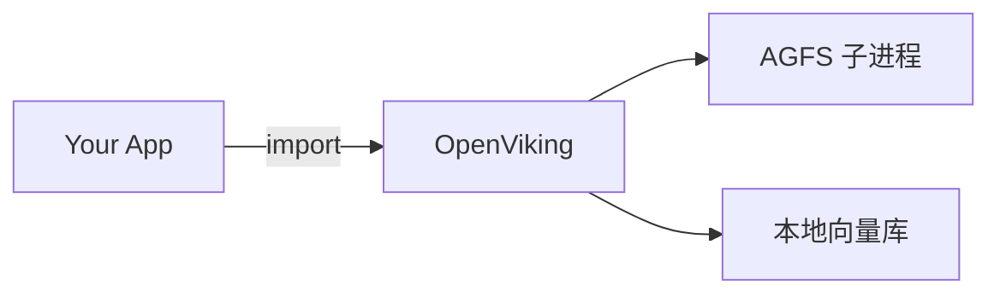

### 10.2 HTTP 服务模式

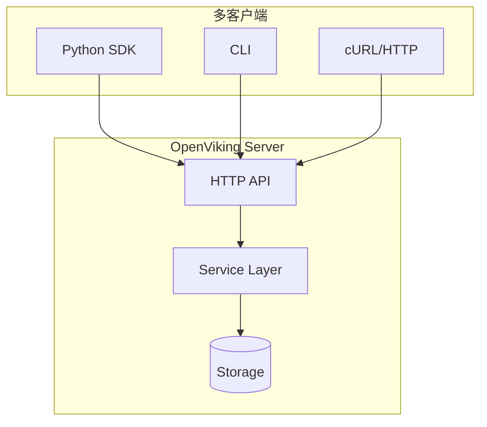

---

## 11. API 参考

### 11.1 核心 API 概览

下表方法均存在于 `openviking/sync_client.py::SyncOpenViking`（异步版去掉 `_async` 调用即可）：

| 类别 | API | 说明 |
|------|-----|------|
| **资源** | `add_resource(path, to=, parent=, build_index=True, summarize=False, wait=False)` | 添加资源（仅 resources scope） |
| **资源** | `add_skill(data)` | 添加 Claude Skills 协议技能 |
| **资源** | `wait_processed(timeout=None)` | 等待异步语义处理完成 |
| **浏览** | `ls(uri, recursive=, simple=, output=, ...)` | 列出目录 |
| **浏览** | `tree(uri, output=, abs_limit=, node_limit=1000, ...)` | 树形结构（**无 depth 参数**） |
| **浏览** | `stat(uri)` | 获取节点状态 |
| **浏览** | `read(uri, offset=0, limit=-1)` | 读取 L2 完整内容 |
| **浏览** | `abstract(uri)` / `overview(uri)` | 读取 L0 / L1 |
| **写入** | `write(uri, content, mode="replace")` | 写文件并刷新 L0/L1 与向量 |
| **写入** | `mkdir(uri, description=)` / `rm(uri, recursive=)` / `mv(from, to)` | 目录与节点操作 |
| **搜索** | `find(query, target_uri="", limit=10, score_threshold=, filter=, since=, until=, time_field=)` | 快速向量召回 |
| **搜索** | `search(query, target_uri="", session=None, session_id=None, ...)` | 含意图分析 / 会话上下文的复杂检索 |
| **搜索** | `grep(uri, pattern, case_insensitive=, ...)` | 文本正则搜索 |
| **搜索** | `glob(pattern, uri="viking://")` | 文件路径模式匹配 |
| **关联** | `link(from_uri, uris, reason="")` / `unlink(from_uri, uri)` / `relations(uri)` | 关联关系（unlink 是**单 uri**） |
| **会话** | `session(session_id=None, must_exist=False)` | 获取/创建 Session 对象 |
| **会话** | `create_session(session_id=None)` / `list_sessions()` / `get_session(...)` / `delete_session(...)` | 会话生命周期 |
| **会话** | `add_message(session_id, role, content=, parts=, ...)` / `commit_session(session_id)` | 消息与归档 |
| **会话** | `get_session_context(session_id, token_budget=128_000)` | 组装会话上下文 |
| **打包** | `export_ovpack(uri, to)` / `import_ovpack(file_path, target, force=False, vectorize=True)` | OVPack 导入导出 |
| **观测** | `get_status()` / `is_healthy()` / `observer` | 健康检查与组件状态 |

---

## 12. 最佳实践

### 12.1 上下文加载策略

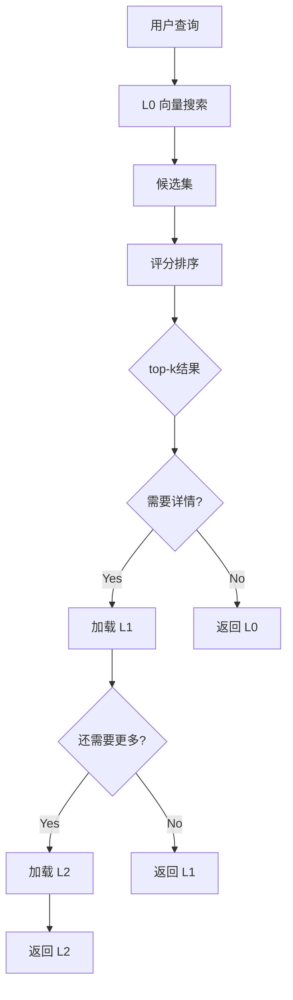

### 12.2 记忆更新策略

源码 `openviking/core/directories.py` 中各分类的 overview 已明确说明：

| 记忆类型 | 存储形态 | 更新策略 | 合并支持 |
|----------|----------|----------|----------|
| profile     | 单文件 `memories/profile.md`        | 追加合并（`_append_to_profile`） | ✅ |
| preferences | `memories/preferences/{topic}/`     | 同主题可追加聚合 | ✅ |
| entities    | `memories/entities/{entity}/`       | 可追加更新 | ✅ |
| events      | `memories/events/{event}/`          | **历史记录，不更新** | ❌ |
| cases       | `memories/cases/{case}/`            | **每条独立，不更新** | ❌ |
| patterns    | `memories/patterns/{pattern}/`      | **每条独立，不更新；如需变更请新建** | ❌ |
| tools       | `memories/tools/{tool}/`            | 工具使用统计/经验汇总 | ✅ |
| skills      | `memories/skills/{skill}/`          | 技能执行流程/策略汇总 | ✅ |

---

## 📚 相关文档

- [官方文档](https://www.openviking.ai/docs)
- [GitHub 仓库](https://github.com/volcengine/OpenViking)
- [配置指南](./configuration.md)
- [API 详解](./api-details.md)
