# OpenViking 项目全面指南

> 为 AI Agent 而生的上下文数据库

## 📋 目录

1. [项目简介](#1-项目简介)
2. [核心概念](#2-核心概念)
3. [系统架构](#3-系统架构)
4. [上下文类型](#4-上下文类型)
5. [上下文层级](#5-上下文层级)
6. [存储架构](#6-存储架构)
7. [检索机制](#7-检索机制)
8. [会话管理](#8-会话管理)
9. [快速开始](#9-快速开始)
10. [部署模式](#10-部署模式)
11. [API 参考](#11-api-参考)
12. [最佳实践](#12-最佳实践)

---

## 1. 项目简介

### 1.1 什么是 OpenViking？

**OpenViking** 是由**字节跳动火山引擎 Viking 团队**开源的、专为 **AI Agent** 设计的**上下文数据库**。

它将传统 RAG 的扁平存储模式转变为**文件系统范式**，让开发者可以像管理本地文件一样构建 Agent 的大脑。

### 1.2 为什么需要 OpenViking？

在构建 AI Agent 时，开发者面临五大挑战：

| 挑战 | 传统方案 | OpenViking 方案 |
|------|----------|-----------------|
| **上下文碎片化** | 记忆在代码、资源在向量库、技能散落各处 | 统一文件系统结构化管理 |
| **上下文猛增** | 简单截断导致信息损失 | 分层加载 (L0/L1/L2) 按需获取 |
| **检索效果差** | 平铺式向量检索，缺乏全局视野 | 目录递归检索，理解完整语境 |
| **不可观测** | 检索链路黑箱，难以调试 | 可视化检索轨迹 |
| **记忆迭代有限** | 仅有用户记忆 | 自动提取 Agent 经验记忆 |

### 1.3 核心理念

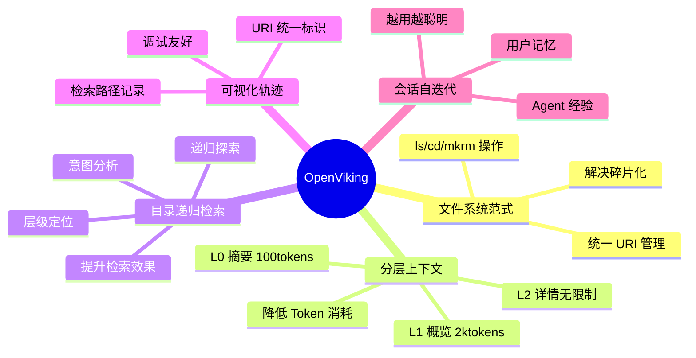

### 1.4 技术栈

| 层级 | 技术 |
|------|------|
| **语言** | Python 3.10+ |
| **核心存储** | AGFS (Abstract Generic File System) |
| **向量索引** | VikingDB / 自建向量库 |
| **模型服务** | 火山引擎豆包 / OpenAI |
| **部署** | HTTP Server / 嵌入式 |

---

## 2. 核心概念

### 2.1 Viking URI

OpenViking 使用统一的资源标识符 `viking://` 协议：

```
viking://
├── resources/           # 资源：项目文档、代码库、网页
│   ├── my_project/
│   │   ├── docs/
│   │   └── src/
│   └── ...
├── user/                # 用户：个人偏好、习惯
│   └── memories/
│       ├── preferences/
│       └── ...
└── agent/               # Agent：技能、指令、任务记忆
    ├── skills/
    └── memories/
```

### 2.2 三大上下文类型

| 类型 | 用途 | 示例 |
|------|------|------|
| **Resource** | 外部知识 | API 文档、代码仓库 |
| **Memory** | Agent 认知 | 用户偏好、经验积累 |
| **Skill** | 可调用能力 | 搜索技能、分析技能 |

### 2.3 三层信息模型

| 层级 | Token 限制 | 用途 |
|------|-----------|------|
| **L0** | ~100 | 向量搜索、快速过滤 |
| **L1** | ~2k | Rerank 精排、内容导航 |
| **L2** | 无限制 | 完整内容、按需加载 |

---

## 3. 系统架构

### 3.1 整体架构图

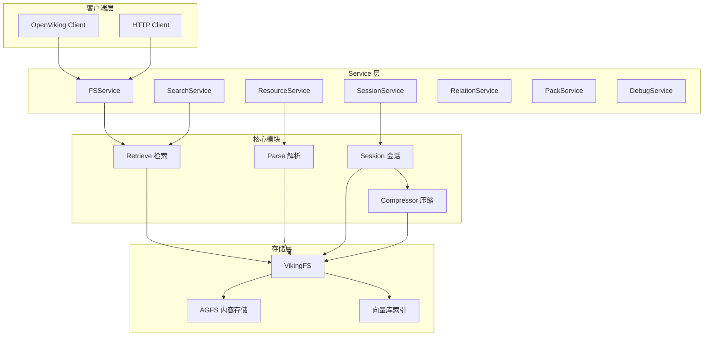

### 3.2 数据流架构

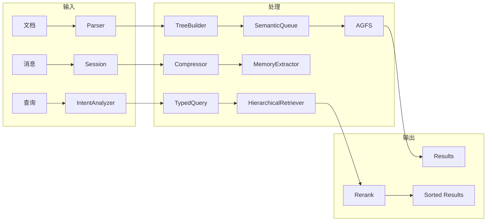

### 3.3 核心模块职责

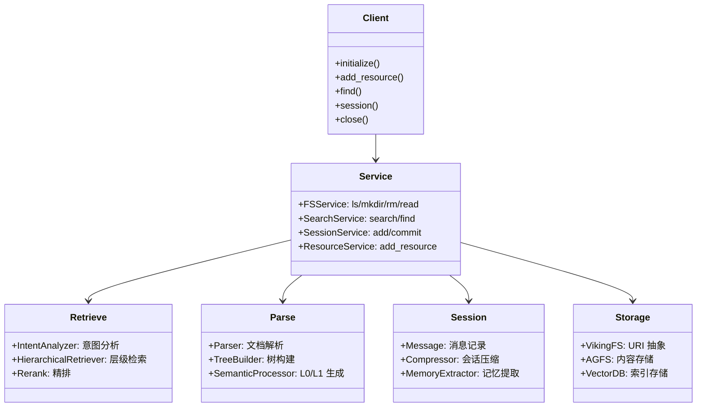

---

## 4. 上下文类型

### 4.1 Resource（资源）

**定义**：Agent 可以引用的外部知识

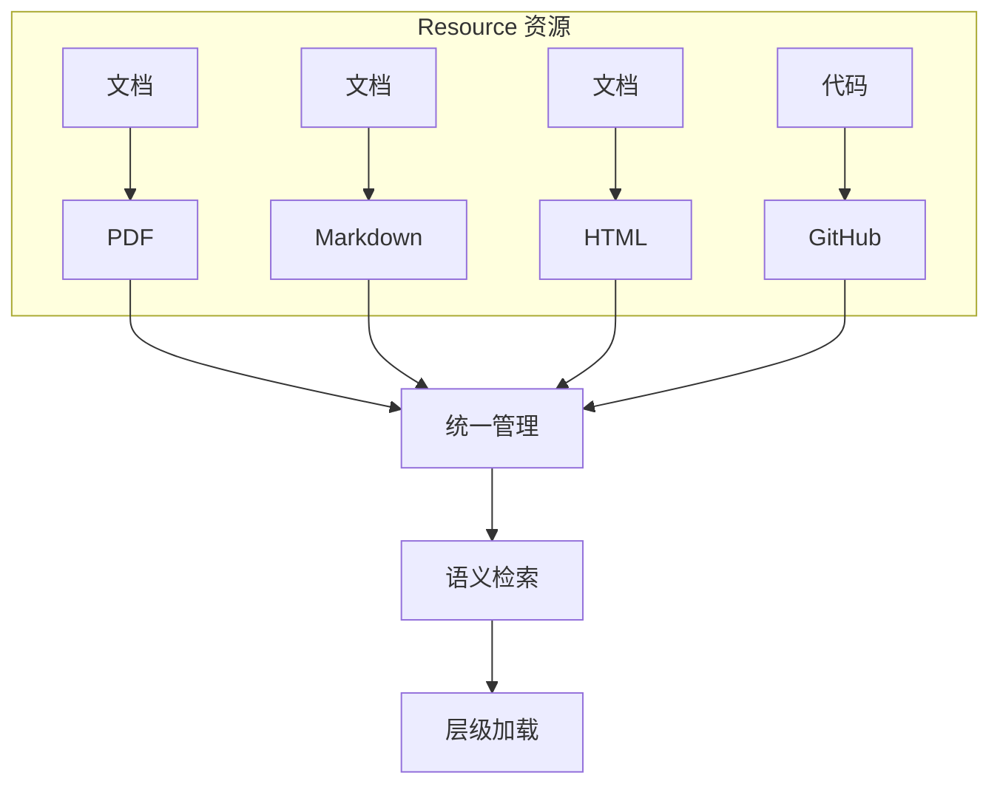

### 4.2 Memory（记忆）

**定义**：Agent 关于用户和世界的学习知识

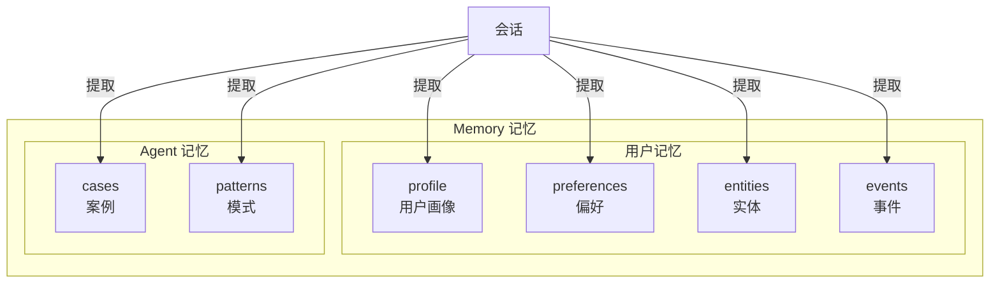

### 4.3 Skill（技能）

**定义**：Agent 可以调用的能力

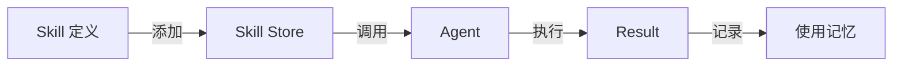

---

## 5. 上下文层级

### 5.1 L0/L1/L2 关系

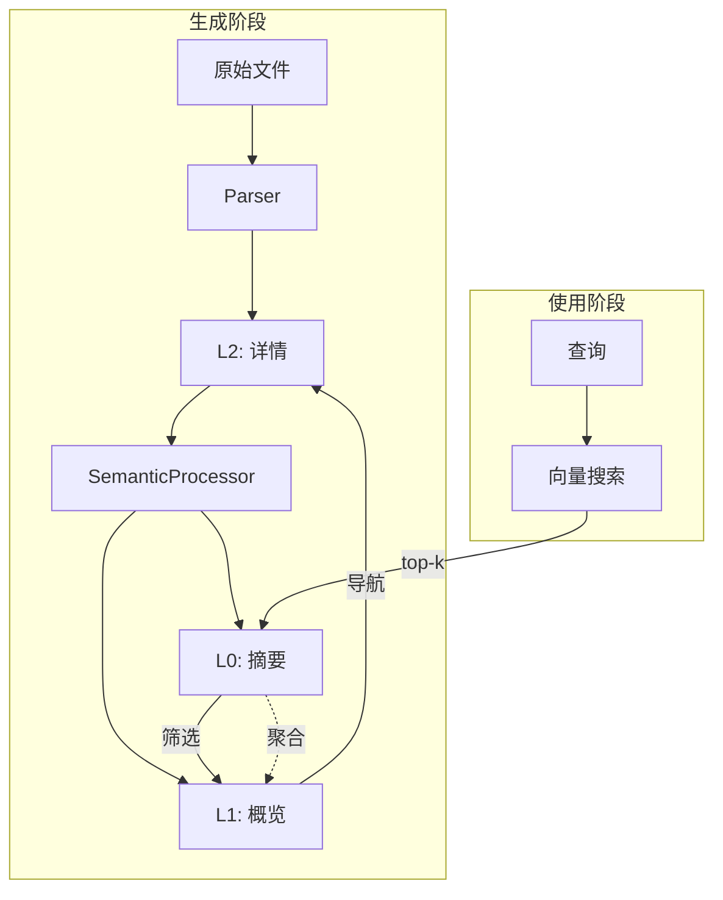

### 5.2 目录结构示例

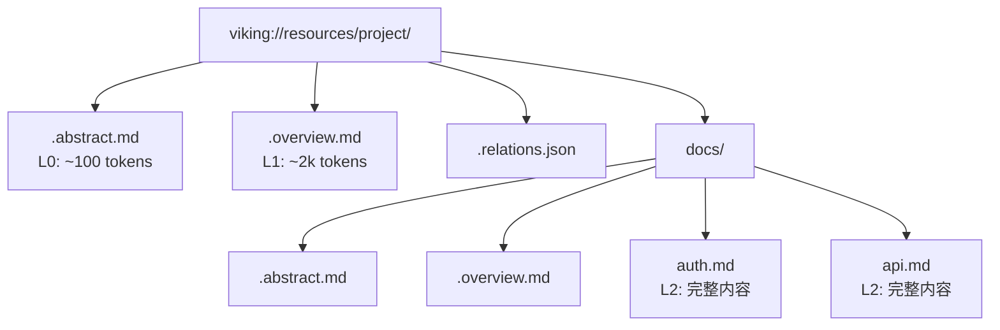

---

## 6. 存储架构

### 6.1 双层存储架构

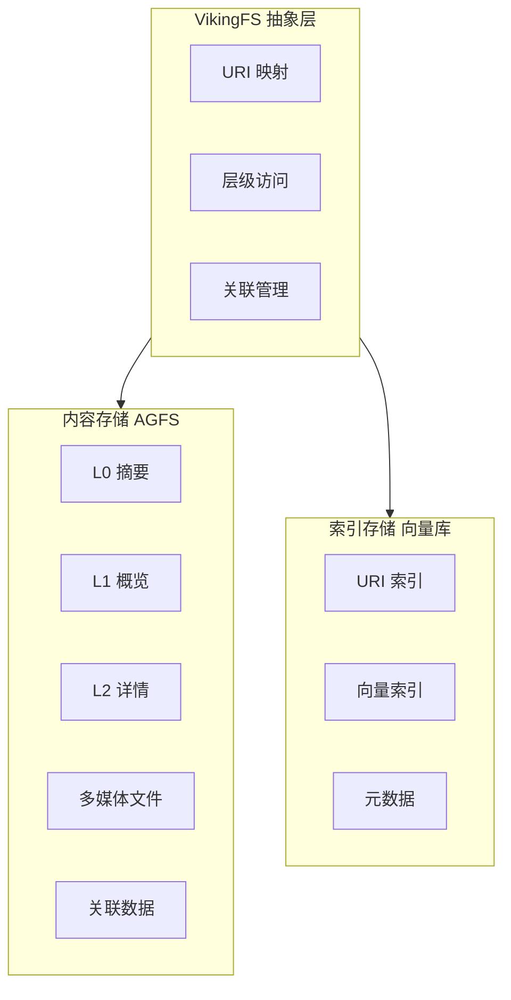

### 6.2 数据一致性

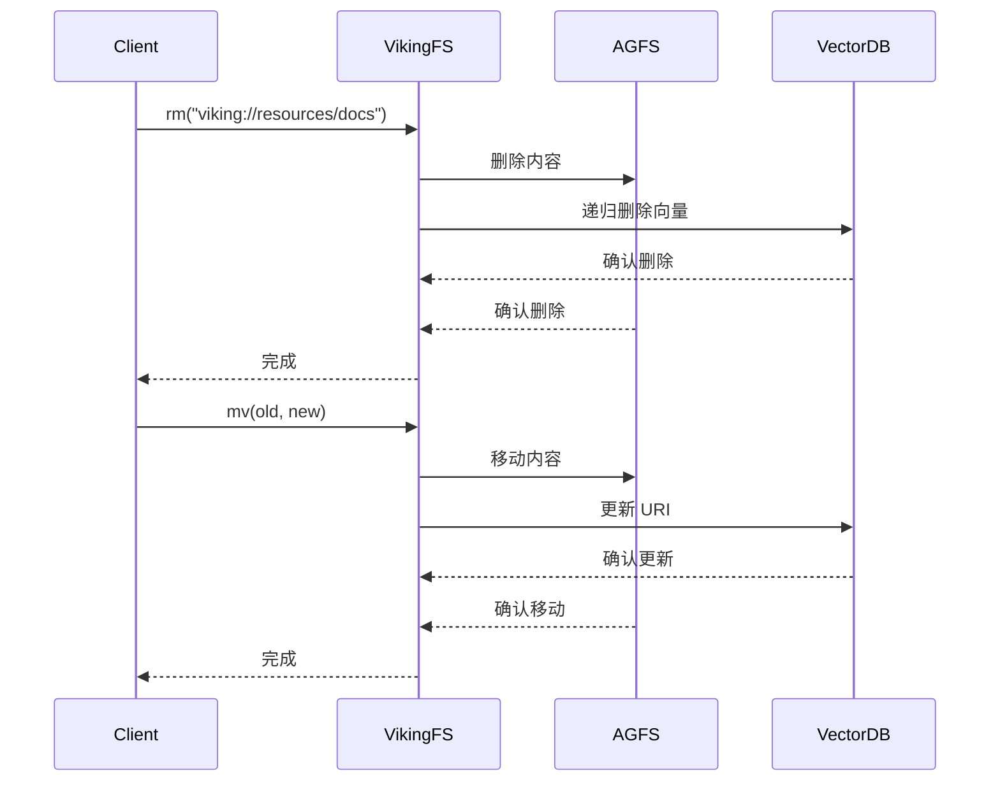

---

## 7. 检索机制

### 7.1 两阶段检索流程

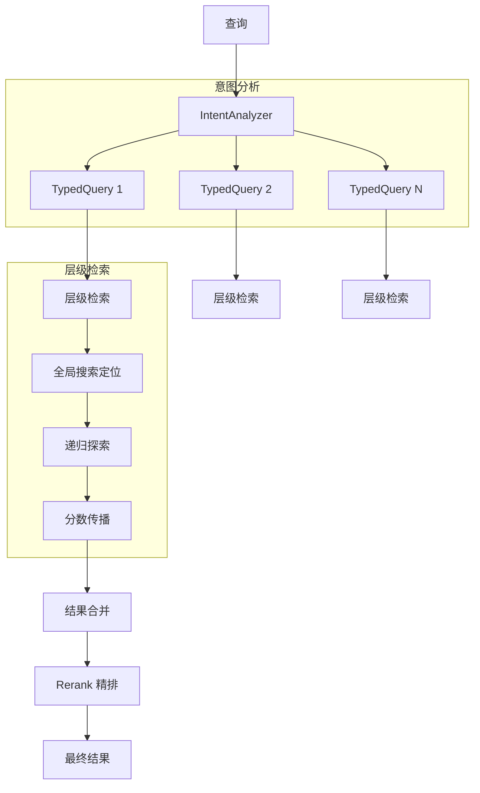

### 7.2 意图分析

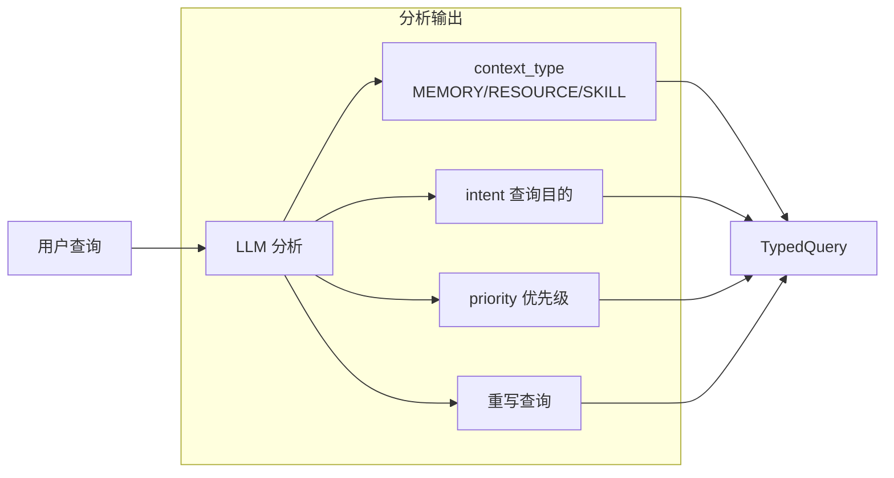

### 7.3 递归检索算法

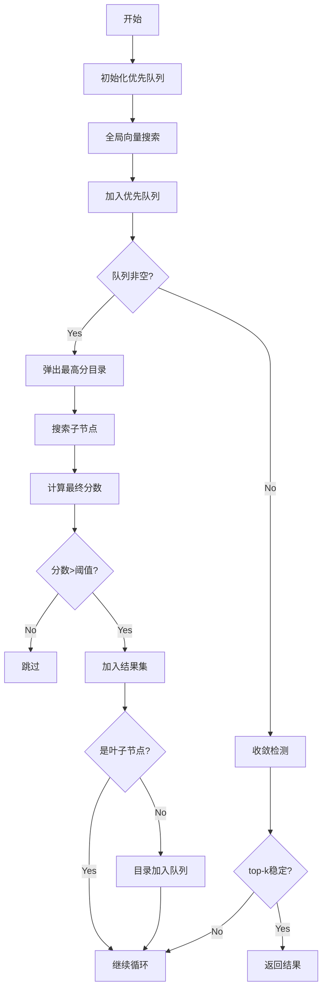

---

## 8. 会话管理

### 8.1 会话生命周期

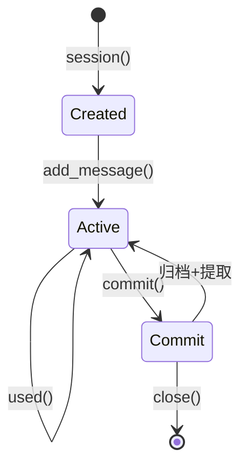

### 8.2 记忆提取流程

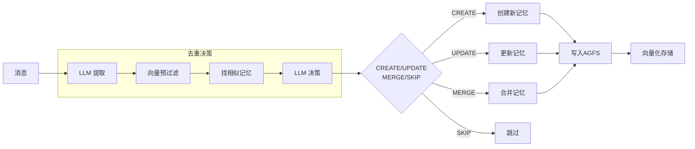

---

## 9. 快速开始

### 9.1 安装

```bash
pip install openviking
```

### 9.2 配置

创建 `~/.openviking/ov.conf`:

```json
{
  "embedding": {
    "dense": {
      "api_base": "https://ark.cn-beijing.volces.com/api/v3",
      "api_key": "your-api-key",
      "provider": "volcengine",
      "dimension": 1024,
      "model": "doubao-embedding-vision-250615"
    }
  },
  "vlm": {
    "api_base": "https://ark.cn-beijing.volces.com/api/v3",
    "api_key": "your-api-key",
    "provider": "volcengine",
    "model": "doubao-seed-1-8-251228"
  }
}
```

### 9.3 基本使用

```python
import openviking as ov

# 初始化
client = ov.OpenViking(path="./data")
client.initialize()

# 添加资源
result = client.add_resource("https://docs.example.com")
uri = result['root_uri']

# 层级浏览
ls = client.ls(uri)
abstract = client.abstract(uri)
overview = client.overview(uri)

# 语义搜索
results = client.find("认证方法", target_uri=uri)

# 会话管理
session = client.session()
session.add_message("user", [ov.TextPart("我喜欢...")])
session.commit()

# 关闭
client.close()
```

---

## 10. 部署模式

### 10.1 嵌入式模式

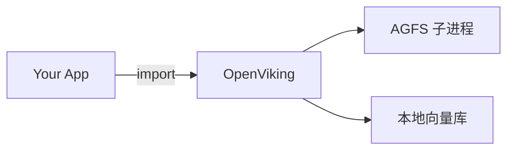

### 10.2 HTTP 服务模式

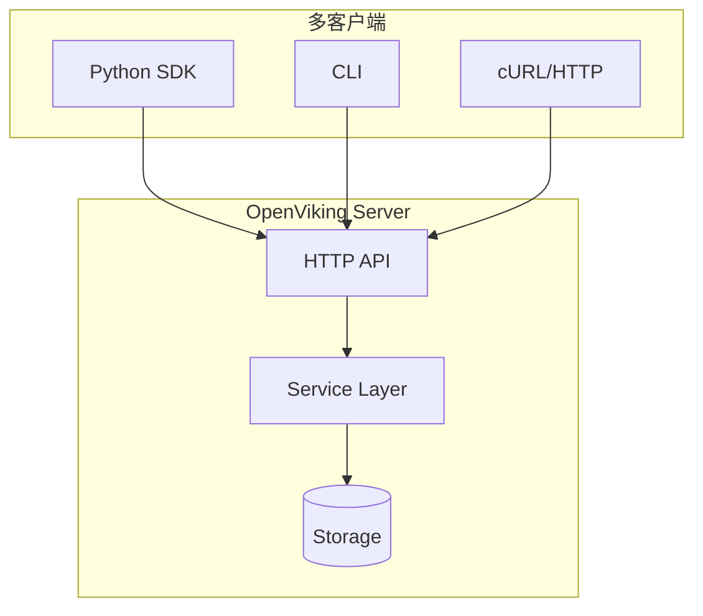

---

## 11. API 参考

### 11.1 核心 API 概览

| 类别 | API | 说明 |
|------|-----|------|
| **资源** | `add_resource()` | 添加资源 |
| **资源** | `wait_processed()` | 等待处理完成 |
| **浏览** | `ls()` | 列出目录 |
| **浏览** | `tree()` | 树形结构 |
| **浏览** | `read()` | 读取内容 |
| **浏览** | `abstract()` | 读取 L0 |
| **浏览** | `overview()` | 读取 L1 |
| **搜索** | `find()` | 简单搜索 |
| **搜索** | `search()` | 复杂搜索 |
| **会话** | `session()` | 创建会话 |
| **会话** | `commit()` | 提交会话 |

---

## 12. 最佳实践

### 12.1 上下文加载策略

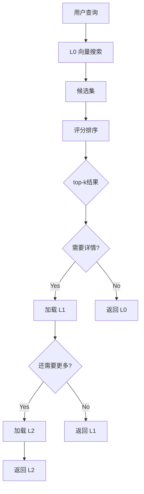

### 12.2 记忆更新策略

| 记忆类型 | 更新策略 | 合并支持 |
|----------|----------|----------|
| profile | 追加 | ✅ |
| preferences | 追加 | ✅ |
| entities | 更新 | ✅ |
| events | 不更新 | ❌ |
| cases | 不更新 | ❌ |
| patterns | 更新 | ✅ |

---

## 📚 相关文档

- [官方文档](https://www.openviking.ai/docs)
- [GitHub 仓库](https://github.com/volcengine/OpenViking)
- [配置指南](./configuration.md)
- [API 详解](./api-details.md)
