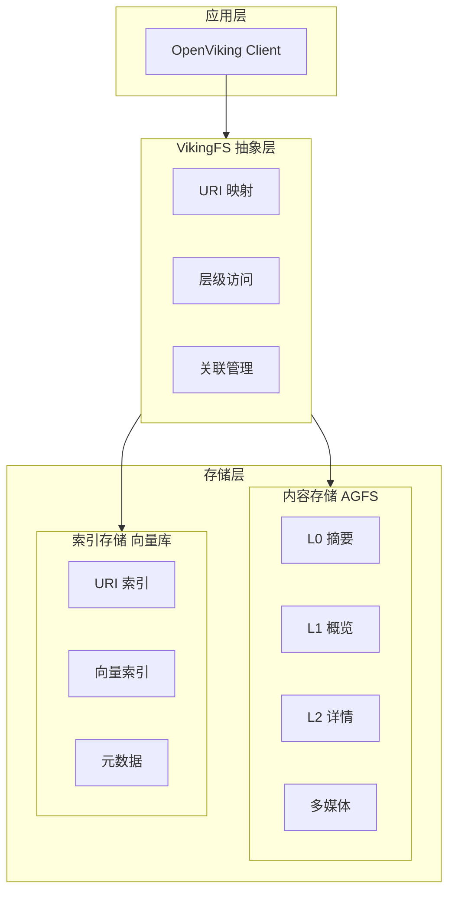
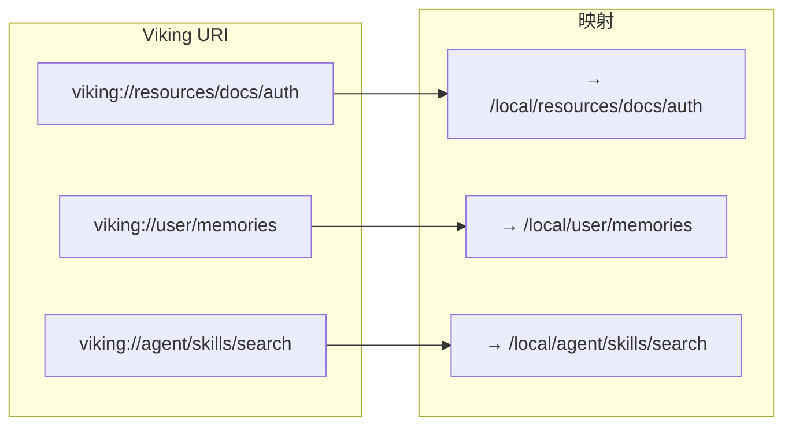
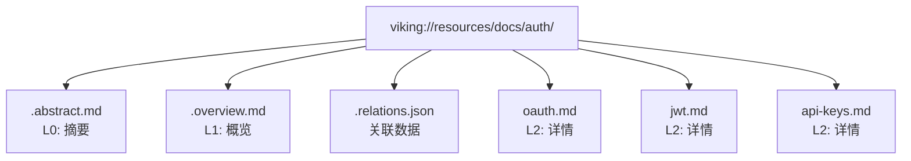
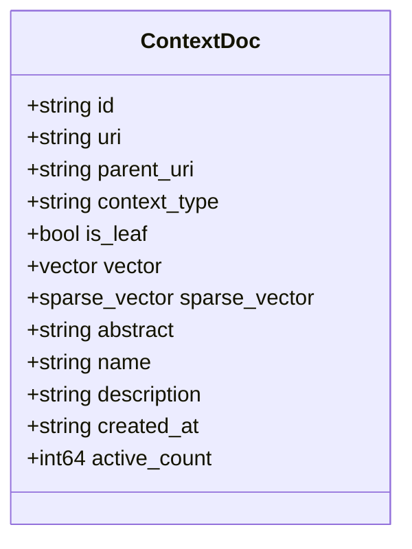
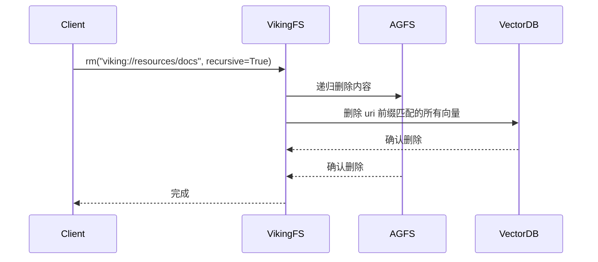
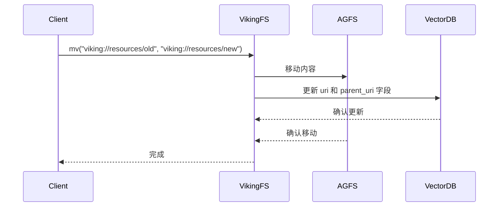
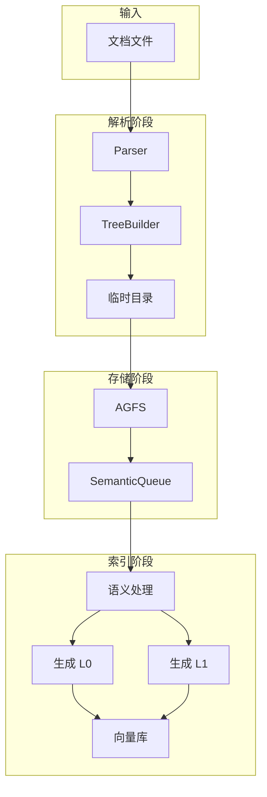
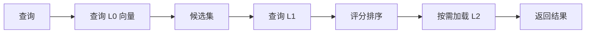

# OpenViking 存储架构详解

> 双层存储架构：内容与索引分离

## 目录

1. [架构概述](#1-架构概述)
2. [VikingFS 虚拟文件系统](#2-vikingfs-虚拟文件系统)
3. [AGFS 内容存储](#3-agfs-内容存储)
4. [向量库索引](#4-向量库索引)
5. [数据一致性](#5-数据一致性)
6. [后端配置](#6-后端配置)
7 [存储流程图](#7-存储流程图)

---

## 1. 架构概述

### 1.1 双层存储设计



### 1.2 存储层对比

| 存储层 | 职责 | 存储内容 |
|--------|------|----------|
| **AGFS** | 内容存储 | L0/L1/L2 完整内容、多媒体文件、关联关系 |
| **向量库** | 索引存储 | URI、向量、元数据（不存储文件内容） |

### 1.3 设计优势

1. **职责清晰** - 向量库只负责检索，AGFS 负责存储
2. **内存优化** - 向量库不存储文件内容，节省内存
3. **单一数据源** - 所有内容从 AGFS 读取，向量库只存引用
4. **独立扩展** - 向量库和 AGFS 可分别扩展

---

## 2. VikingFS 虚拟文件系统

### 2.1 URI 抽象

VikingFS 是统一的 URI 抽象层，屏蔽底层存储细节：



### 2.2 核心 API

| 方法 | 说明 |
|------|------|
| `read(uri)` | 读取文件内容 |
| `write(uri, data)` | 写入文件 |
| `mkdir(uri)` | 创建目录 |
| `rm(uri)` | 删除文件/目录 |
| `mv(old, new)` | 移动/重命名 |
| `abstract(uri)` | 读取 L0 摘要 |
| `overview(uri)` | 读取 L1 概览 |
| `relations(uri)` | 获取关联列表 |
| `find(query, uri)` | 语义搜索 |

### 2.3 URI 协议

```
viking://{context_type}/{path}

# 示例
viking://resources/project/docs/api.md
viking://user/memories/preferences/ui.md
viking://agent/skills/code-search/script.py
```

---

## 3. AGFS 内容存储

### 3.1 后端类型

| 后端 | 说明 | 配置项 |
|------|------|--------|
| `localfs` | 本地文件系统 | `path` |
| `s3fs` | S3 兼容存储 | `bucket`, `endpoint` |
| `memory` | 内存存储（测试用） | - |

### 3.2 目录结构

每个上下文目录遵循统一结构：



### 3.3 文件说明

| 文件 | 内容 |
|------|------|
| `.abstract.md` | L0 摘要 (~100 tokens) |
| `.overview.md` | L1 概览 (~2k tokens) |
| `*.md` | L2 完整内容 |
| `.relations.json` | 关联资源列表 |

---

## 4. 向量库索引

### 4.1 Collection Schema



### 4.2 字段说明

| 字段 | 类型 | 说明 |
|------|------|------|
| `id` | string | 主键 |
| `uri` | string | 资源 URI |
| `parent_uri` | string | 父目录 URI |
| `context_type` | string | resource/memory/skill |
| `is_leaf` | bool | 是否叶子节点 |
| `vector` | vector | 密集向量 |
| `sparse_vector` | sparse_vector | 稀疏向量 |
| `abstract` | string | L0 摘要文本 |
| `name` | string | 名称 |
| `description` | string | 描述 |
| `created_at` | string | 创建时间 |
| `active_count` | int64 | 使用次数 |

### 4.3 索引策略

```python
index_meta = {
    "IndexType": "flat_hybrid",  # 混合索引
    "Distance": "cosine",        # 余弦距离
    "Quant": "int8",             # 量化方式
}
```

### 4.4 后端支持

| 后端 | 说明 |
|------|------|
| `local` | 本地持久化 |
| `http` | HTTP 远程服务 |
| `volcengine` | 火山引擎 VikingDB |

---

## 5. 数据一致性

### 5.1 删除同步



### 5.2 移动同步



---

## 6. 后端配置

### 6.1 本地文件系统

```json
{
  "storage": {
    "agfs": {
      "backend": "localfs",
      "path": "/data/openviking"
    },
    "vectordb": {
      "backend": "local",
      "path": "/data/openviking/vector"
    }
  }
}
```

### 6.2 S3 兼容存储

```json
{
  "storage": {
    "agfs": {
      "backend": "s3fs",
      "bucket": "my-bucket",
      "endpoint": "https://s3.amazonaws.com",
      "region": "us-east-1"
    }
  }
}
```

### 6.3 火山引擎 VikingDB

```json
{
  "storage": {
    "vectordb": {
      "backend": "volcengine",
      "region": "cn-beijing",
      "endpoint": "https://vikingdb.volces.com",
      "api_key": "your-api-key"
    }
  }
}
```

---

## 7. 存储流程图

### 7.1 添加资源流程



### 7.2 读取流程



---

## 相关文档

- [架构概述](./01-项目概览与架构.md)
- [上下文层级](./03-上下文层级详解.md)
- [检索机制](./04-检索机制详解.md)
- [Viking URI](./05-Viking-URI详解.md)
