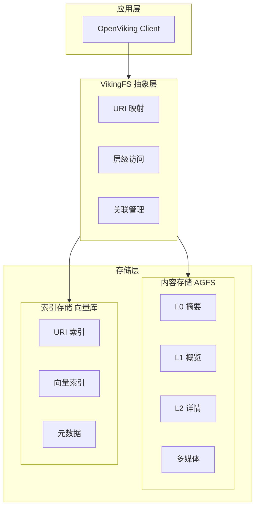
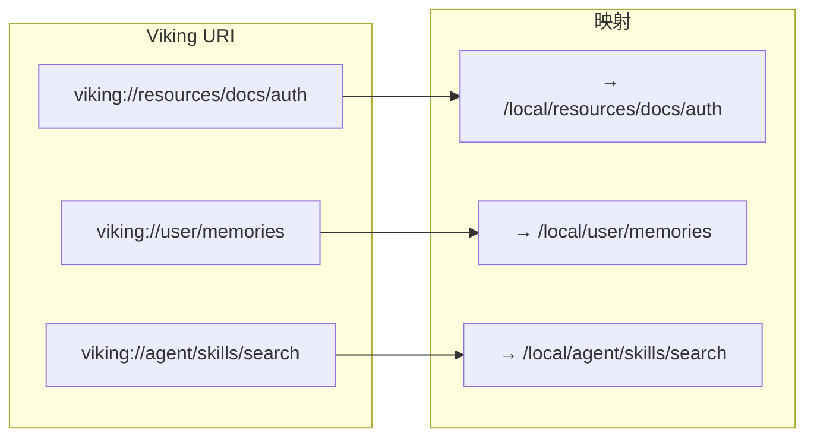
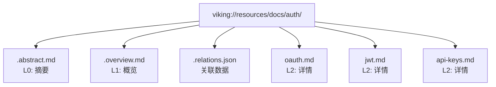
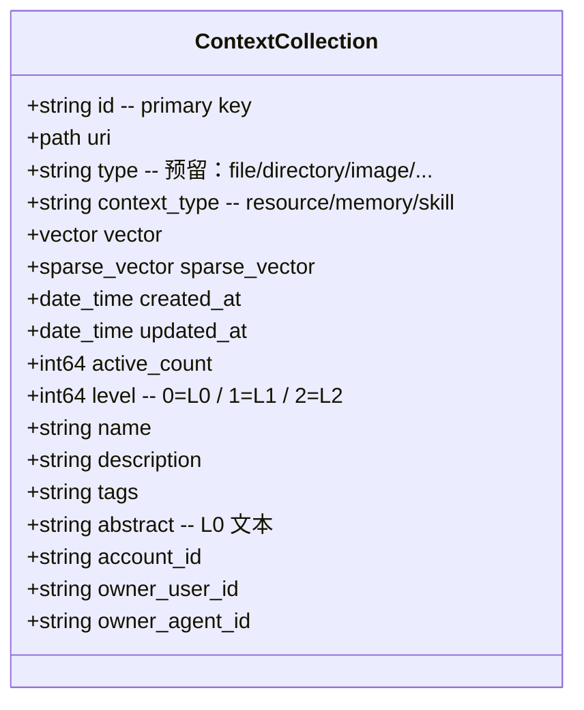
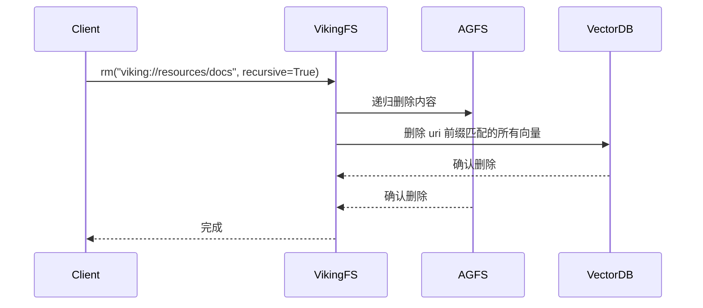
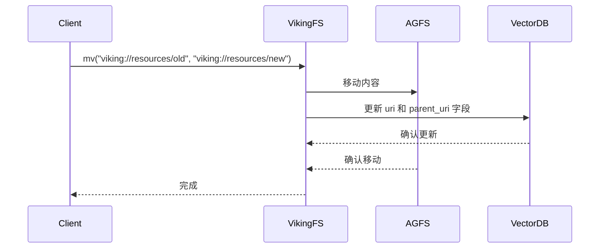
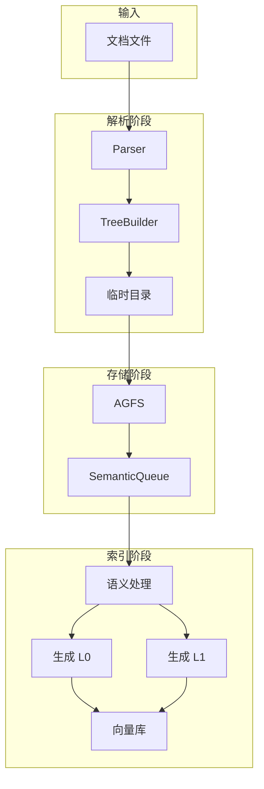
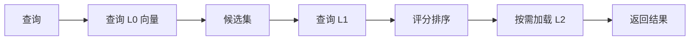

# OpenViking 存储架构详解

> 双层存储架构：内容与索引分离

## 目录

1. [架构概述](#1-架构概述)
2. [VikingFS 虚拟文件系统](#2-vikingfs-虚拟文件系统)
3. [AGFS 内容存储](#3-agfs-内容存储)
4. [向量库索引](#4-向量库索引)
5. [数据一致性](#5-数据一致性)
6. [后端配置](#6-后端配置)
7 [存储流程图](#7-存储流程图)

---

## 1. 架构概述

### 1.1 双层存储设计



### 1.2 存储层对比

| 存储层 | 职责 | 存储内容 |
|--------|------|----------|
| **AGFS / RAGFS** | 内容存储 | L0/L1/L2 完整内容、多媒体文件、`.relations.json` 等元文件 |
| **向量库** | 索引存储 | URI、向量、`level`、`context_type`、`abstract` 等标量字段（**不存原始文件**） |

> **AGFS 与 RAGFS 的关系**（来自 `crates/ragfs/ORIGIN.md`）：
> - **AGFS**（Aggregated File System）—— 由 c44pt0r 用 Go 实现，源码位于 `third_party/agfs/`。
> - **RAGFS** —— 在 `crates/ragfs/` 用 Rust 重写的等价实现，通过 PyO3（`crates/ragfs-python/`）以 abi3 native ext 暴露给 Python，模块名 `ragfs_python`。
> - 通过 `RAGFS_IMPL=auto|rust|go` 环境变量切换；默认 `auto`（优先 Rust，回退 Go）。
> - Python 侧统一通过 `openviking/pyagfs/` 包装：`from openviking.pyagfs import AGFSClient`。

### 1.3 设计优势

1. **职责清晰** - 向量库只做相似度检索，AGFS 负责持久化存储
2. **避免冗余** - 向量库不重复存原始文件内容
3. **单一数据源** - 所有正文都从 AGFS 读取，向量库通过 URI 关联
4. **独立扩展** - 向量库（local / http / volcengine）与 AGFS 后端可独立替换

---

## 2. VikingFS 虚拟文件系统

### 2.1 URI 抽象

VikingFS 是统一的 URI 抽象层，屏蔽底层存储细节：



### 2.2 核心 API

| 方法 | 说明 |
|------|------|
| `read(uri)` | 读取文件内容 |
| `write(uri, data)` | 写入文件 |
| `mkdir(uri)` | 创建目录 |
| `rm(uri)` | 删除文件/目录 |
| `mv(old, new)` | 移动/重命名 |
| `abstract(uri)` | 读取 L0 摘要 |
| `overview(uri)` | 读取 L1 概览 |
| `relations(uri)` | 获取关联列表 |
| `find(query, uri)` | 语义搜索 |

### 2.3 URI 协议

URI 顶层段对应 4 个 scope（来自 `openviking/core/directories.py::PRESET_DIRECTORIES`）：

```
viking://{scope}/{path}

# scope ∈ { session, user, agent, resources }
viking://session/{session_id}/messages.jsonl
viking://user/memories/profile.md           # ⚠️ 文件，不是目录
viking://user/memories/preferences/ui/...
viking://agent/memories/cases/case_001/...
viking://agent/instructions/...
viking://agent/skills/code-search/SKILL.md
viking://resources/myproject/docs/api.md
```

> **scope 与 context_type 的映射**（`openviking/core/directories.py::get_context_type_for_uri`）：
> - URI 含 `/memories` 或以 `viking://session` 开头 → `memory`
> - URI 含 `/resources` → `resource`
> - URI 含 `/skills` → `skill`
> - 其他 → `resource`

---

## 3. AGFS / RAGFS 内容存储

### 3.1 部署形态

OpenViking 默认嵌入式使用 **RAGFS Rust binding**（`openviking/pyagfs/__init__.py::_load_rust_binding`），通过 `openviking/lib/ragfs_python.abi3.so` 加载。也可作为独立的 AGFS Server 部署，通过 HTTP 访问（`AGFSClient` 客户端见 `openviking/pyagfs/client.py`）。

| 部署方式 | 说明 |
|---------|------|
| **嵌入式 binding-client** | 默认；Python 直接通过 PyO3 调用 Rust `RAGFSBindingClient` |
| **AGFS Server (HTTP)** | `AGFSClient(api_base_url=...)`，适用于多进程共享 |
| **Go 实现回退** | 设置 `RAGFS_IMPL=go` 时使用，方便对照原版 AGFS |

> 工作目录由 `~/.openviking/ov.conf` 中的 `storage.workspace` 决定（默认 `~/.openviking/data`）。

### 3.2 目录结构

每个上下文目录遵循统一结构：



### 3.3 文件说明

| 文件 | 内容 |
|------|------|
| `.abstract.md` | L0 摘要 (~100 tokens) |
| `.overview.md` | L1 概览 (~2k tokens) |
| `*.md` | L2 完整内容 |
| `.relations.json` | 关联资源列表 |

---

## 4. 向量库索引

### 4.1 Collection Schema

来自源码 `openviking/storage/collection_schemas.py::CollectionSchemas.context_collection`：



### 4.2 字段说明

| 字段 | 类型 | 说明 |
|------|------|------|
| `id` | string | 主键 |
| `uri` | path | 资源 URI（同时是 ScalarIndex） |
| `type` | string | 预留字段（如 `file`/`directory`/`image`/`repository`），当前未使用 |
| `context_type` | string | `"resource"` / `"memory"` / `"skill"` |
| `level` | int64 | **0=L0（abstract）、1=L1（overview）、2=L2（content，默认）** |
| `vector` | vector | 密集向量（dim 来自 `embedding.dimension`） |
| `sparse_vector` | sparse_vector | 稀疏向量 |
| `abstract` | string | L0 摘要文本（冗余存储，便于 Rerank 直接使用） |
| `name` | string | 节点名 |
| `description` | string | 描述 |
| `tags` | string | 标签 |
| `created_at` / `updated_at` | date_time | 时间戳 |
| `active_count` | int64 | 引用/命中次数（参与热度排序） |
| `account_id` / `owner_user_id` / `owner_agent_id` | string | 多租户与作用域隔离字段 |

> ⚠️ **没有 `parent_uri`、`is_leaf` 字段**。父子关系通过 URI 前缀直接表达；`is_leaf` 是检索期产物，不进入存储模式。

### 4.3 索引策略

ScalarIndex 由 schema 自动声明（`uri / type / context_type / created_at / updated_at / active_count / level / name / tags / account_id / owner_user_id / owner_agent_id`）；密集向量索引由后端实现，本地后端使用 BruteForce/cosine。

### 4.4 后端支持

| 后端（`storage.vectordb.backend`） | 说明 |
|------|------|
| `local` | 本地持久化（默认） |
| `http` | 自部署的 VikingDB HTTP 服务 |
| `volcengine` | 火山引擎托管 VikingDB |

---

## 5. 数据一致性

### 5.1 删除同步



### 5.2 移动同步



---

## 6. 后端配置

### 6.1 本地（默认）

`storage.workspace` 是主目录；`agfs` 与 `vectordb` 子配置可省略：

```json
{
  "storage": {
    "workspace": "/home/your-name/openviking_workspace"
  }
}
```

### 6.2 显式配置 RAGFS（AGFS）与向量库

```json
{
  "storage": {
    "workspace": "/data/openviking",
    "agfs": {
      "path": "/data/openviking/agfs"
    },
    "vectordb": {
      "backend": "local",
      "path": "/data/openviking/vector"
    }
  }
}
```

> 文档 `docs/zh/guides/01-configuration.md` 中 `agfs` 段被明确标注为 *"RAGFS (Rust-based AGFS) configuration"*。

### 6.3 火山引擎 VikingDB

```json
{
  "storage": {
    "vectordb": {
      "backend": "volcengine",
      "region": "cn-beijing",
      "endpoint": "https://vikingdb.volces.com",
      "api_key": "your-api-key"
    }
  }
}
```

---

## 7. 存储流程图

### 7.1 添加资源流程



### 7.2 读取流程



---

## 相关文档

- [架构概述](./01-项目概览与架构.md)
- [上下文层级](./03-上下文层级详解.md)
- [检索机制](./04-检索机制详解.md)
- [Viking URI](./05-Viking-URI详解.md)
