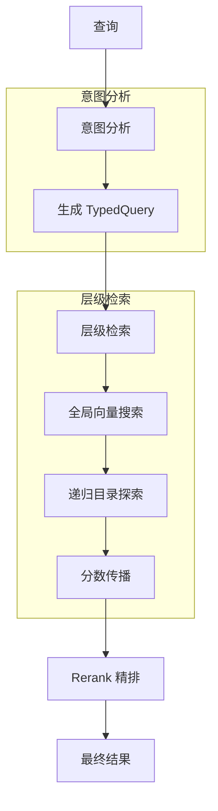
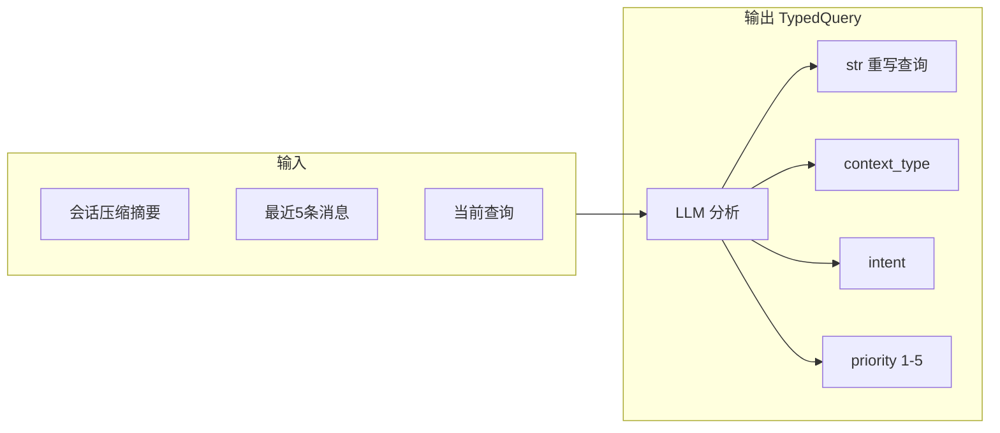
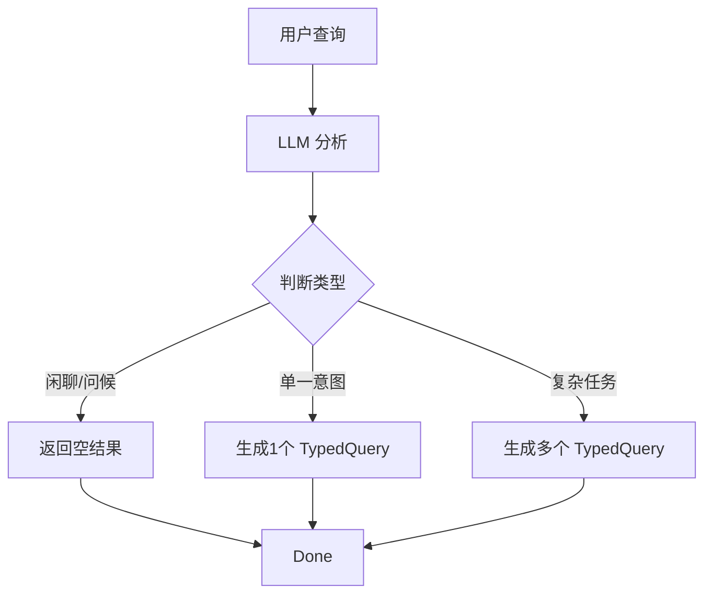
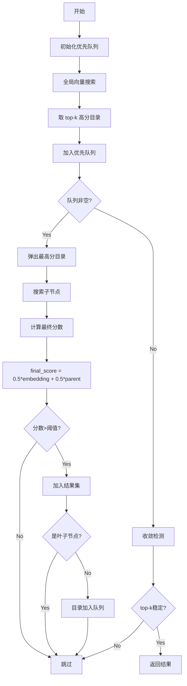
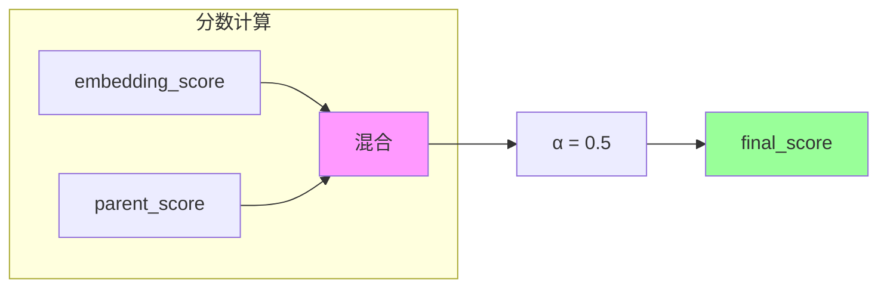
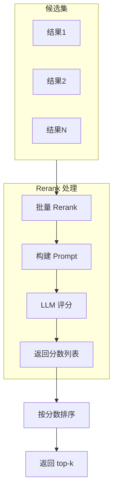
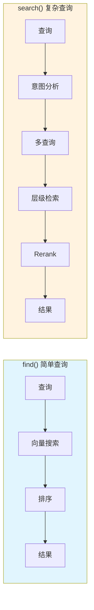

# OpenViking 检索机制详解

> 两阶段检索：意图分析 + 层级检索 + Rerank

## 目录

1. [检索概述](#1-检索概述)
2. [find vs search](#2-find-vs-search)
3. [意图分析](#3-意图分析)
4. [层级检索](#4-层级检索)
5. [Rerank 精排](#5-rerank-精排)
6. [检索结果](#6-检索结果)
7. [流程图](#7-流程图)

---

## 1. 检索概述

### 1.1 检索架构



### 1.2 检索流程

```
查询 → 意图分析 → 层级检索 → Rerank → 结果
   ↓          ↓          ↓
TypedQuery  目录递归    精排评分
```

---

## 2. find vs search

| 特性 | find() | search() |
|------|--------|----------|
| 会话上下文 | 不需要 | 需要 |
| 意图分析 | 不使用 | 使用 LLM 分析 |
| 查询数量 | 单一查询 | 0-5 个 TypedQuery |
| 延迟 | 低 | 较高 |
| 适用场景 | 简单查询 | 复杂任务 |

### 2.1 find() 使用场景

```python
# 快速向量召回（无需会话上下文）
results = client.find(
    "OAuth 认证",
    target_uri="viking://resources/docs",
    limit=10,
)
```

> `find()` 签名（来自 `openviking/sync_client.py`）：
> `find(query, target_uri="", limit=10, score_threshold=None, filter=None, telemetry=False, since=None, until=None, time_field=None)`
> **没有 `context_type` 参数**——若要限定类型，使用 `filter={"context_type": "resource"}`。

### 2.2 search() 使用场景

```python
session = client.session()
session.add_message("user", [TextPart(text="帮我创建一个 RFC 文档")])

results = client.search(
    "帮我创建一个 RFC 文档",
    session=session,           # 注意：参数名是 session（也可传 session_id）
)
```

> `search()` 签名：
> `search(query, target_uri="", session=None, session_id=None, limit=10, score_threshold=None, filter=None, telemetry=False, since=None, until=None, time_field=None)`
> **没有 `mode` 参数**——是否启用 Rerank 取决于 `ov.conf` 是否提供了 `rerank` 配置。

---

## 3. 意图分析

### 3.1 IntentAnalyzer

IntentAnalyzer 使用 LLM 分析查询意图，生成 0-5 个 TypedQuery：



### 3.2 TypedQuery 结构

来自 `openviking_cli/retrieve/types.py::TypedQuery`：

```python
@dataclass
class TypedQuery:
    query: str
    context_type: Optional[ContextType]   # ContextType.MEMORY / RESOURCE / SKILL
    intent: str                            # 查询目的
    priority: int = 3                      # 1-5（1 最高）
    target_directories: List[str] = ...    # LLM 定位的目录 URI 列表
```

> `target_directories` 字段允许 LLM 在意图分析阶段直接指定**目录前缀**作为检索范围，由 `HierarchicalRetriever.retrieve` 接收为 `query.target_directories`。

### 3.3 查询类型映射

| context_type | 查询风格 | 示例 |
|--------------|----------|------|
| **skill** | 动词开头 | "创建 RFC 文档"、"提取 PDF 表格" |
| **resource** | 名词短语 | "RFC 文档模板"、"API 使用指南" |
| **memory** | "用户XX" | "用户的代码规范偏好" |

### 3.4 特殊情况

- **0 个查询**：闲聊、问候等不需要检索的场景
- **多个查询**：复杂任务可能需要技能 + 资源 + 记忆



---

## 4. 层级检索

### 4.1 HierarchicalRetriever

使用优先队列递归搜索目录结构：



### 4.2 根目录映射

| context_type | 根目录 |
|--------------|--------|
| MEMORY | `viking://user/memories`, `viking://agent/memories` |
| RESOURCE | `viking://resources` |
| SKILL | `viking://agent/skills` |

### 4.3 关键参数

来自 `openviking/retrieve/hierarchical_retriever.py::HierarchicalRetriever`：

| 类常量 | 值 | 说明 |
|------|-----|------|
| `SCORE_PROPAGATION_ALPHA` | 0.5 | `final = α·embedding + (1-α)·parent` |
| `MAX_CONVERGENCE_ROUNDS` | 3 | top-k 不变多少轮后收敛 |
| `GLOBAL_SEARCH_TOPK` | **10** | 全局召回候选数（更多候选 = Rerank 更稳） |
| `DIRECTORY_DOMINANCE_RATIO` | 1.2 | 目录分数需高于子项最大分的倍率 |
| `MAX_RELATIONS` | 5 | 每个上下文最大关联数 |
| `HOTNESS_ALPHA` | 0.2 | 热度（active_count）在最终排名中的权重；0 表示禁用 |
| `LEVEL_URI_SUFFIX` | `{0:".abstract.md", 1:".overview.md"}` | level → URI 后缀 |

### 4.4 分数传播算法

```python
# 核心公式
final_score = alpha * embedding_score + (1 - alpha) * parent_score

# 其中 alpha = 0.5
# 优点：平衡局部相关性和全局相关性
```



---

## 5. Rerank 精排

### 5.1 触发条件

- 配置了 Rerank API Key
- 使用 THINKING 模式（search() 默认）

### 5.2 Rerank 流程



### 5.3 评分方式

```python
if rerank_client and mode == THINKING:
    # 使用 Rerank 模型
    scores = rerank_client.rerank_batch(query, documents)
else:
    # 使用向量分数
    scores = [r["_score"] for r in results]
```

### 5.4 后端支持

| 后端 | 模型 |
|------|------|
| Volcengine | doubao-seed-rerank |

---

## 6. 检索结果

### 6.1 MatchedContext

来自 `openviking_cli/retrieve/types.py::MatchedContext`：

```python
@dataclass
class MatchedContext:
    uri: str
    context_type: ContextType         # RESOURCE / MEMORY / SKILL
    level: int = 2                    # 0=L0, 1=L1, 2=L2（默认）
    abstract: str = ""                # L0 文本（已加载）
    overview: Optional[str] = None    # L1 文本（按需加载）
    category: str = ""                # 记忆细分类，如 preferences / cases
    score: float = 0.0
    match_reason: str = ""
    relations: List[RelatedContext] = field(default_factory=list)
```

> ⚠️ 旧版文章里出现的 `is_leaf: bool` **在源码中不存在**，是否叶子节点应通过 `level` 与 URI 自身判断。

### 6.2 FindResult

```python
@dataclass
class FindResult:
    memories: List[MatchedContext]    # 记忆结果
    resources: List[MatchedContext]   # 资源结果
    skills: List[MatchedContext]      # 技能结果
    query_plan: Optional[QueryPlan]    # search() 时有
    query_results: Optional[List[QueryResult]]
    total: int                         # 总数
```

### 6.3 结果示例

```python
results = client.find("OAuth 认证", target_uri="viking://resources/")

for r in results.resources:
    print(f"URI: {r.uri}")
    print(f"Level: {r.level} (0=L0,1=L1,2=L2)")
    print(f"Score: {r.score:.4f}")
    print(f"Category: {r.category}")
    print(f"Abstract: {r.abstract[:80]}...")
    print(f"Relations: {len(r.relations)}")

print(f"Total: {results.total}")

# search() 时还可以拿到 query_plan
if results.query_plan:
    print("Reasoning:", results.query_plan.reasoning)
    for q in results.query_plan.queries:
        print("  -", q.context_type, q.priority, q.query)
```

---

## 7. 流程图

### 7.1 find() 完整流程

```mermaid
flowchart TB
    Start[find("query", target_uri)] --> Check{检查参数}
    
    Check -->|有效| Search[向量搜索]
    Check -->|无效| Error[返回错误]
    
    Search --> Filter[标量过滤]
    Filter --> TopK[取 top-k]
    TopK --> Load[加载 L0/L1]
    Load --> Score[计算分数]
    Score --> Rerank{需要 Rerank?}
    
    Rerank -->|Yes| RerankCall[Rerank API]
    Rerank -->|No| Sort[排序]
    
    RerankCall --> Sort
    Sort --> Build[构建 MatchedContext]
    Build --> Return[返回结果]
```

### 7.2 search() 完整流程

```mermaid
flowchart TB
    Start["search(query, session=...)"] --> Intent[意图分析]
    
    Intent --> Types{生成类型}
    
    Types -->|skill| SkillQ[TypedQuery(SKILL)]
    Types -->|resource| ResourceQ[TypedQuery(RESOURCE)]
    Types -->|memory| MemoryQ[TypedQuery(MEMORY)]
    
    SkillQ --> Parallel[并行检索]
    ResourceQ --> Parallel
    MemoryQ --> Parallel
    
    Parallel --> Merge[结果合并]
    Merge --> Rerank[Rerank 精排]
    Rerank --> Final[最终排序]
    Final --> Return[返回结果]
```

### 7.3 检索模式对比



---

## 相关文档

- [架构概述](./01-项目概览与架构.md)
- [存储架构](./03-存储架构详解.md)
- [上下文层级](./06-上下文层级详解.md)
- [会话管理](./07-会话管理详解.md)
