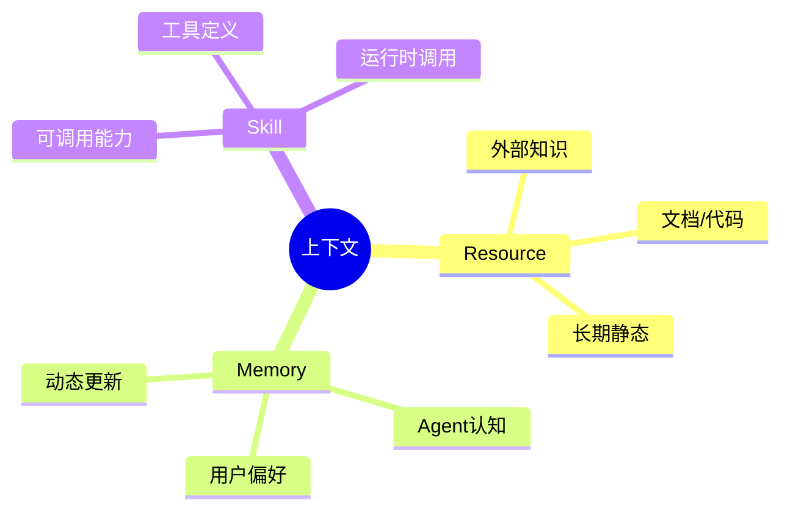
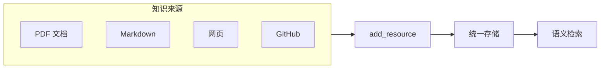
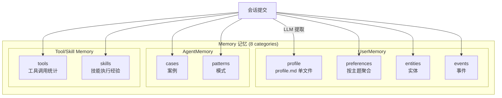
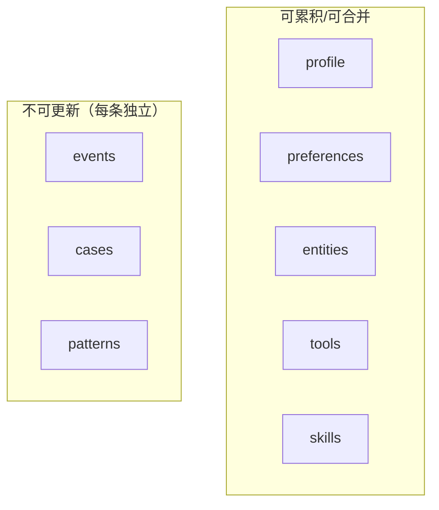
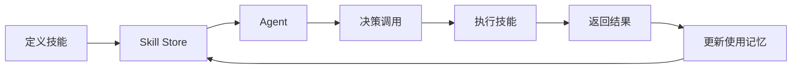
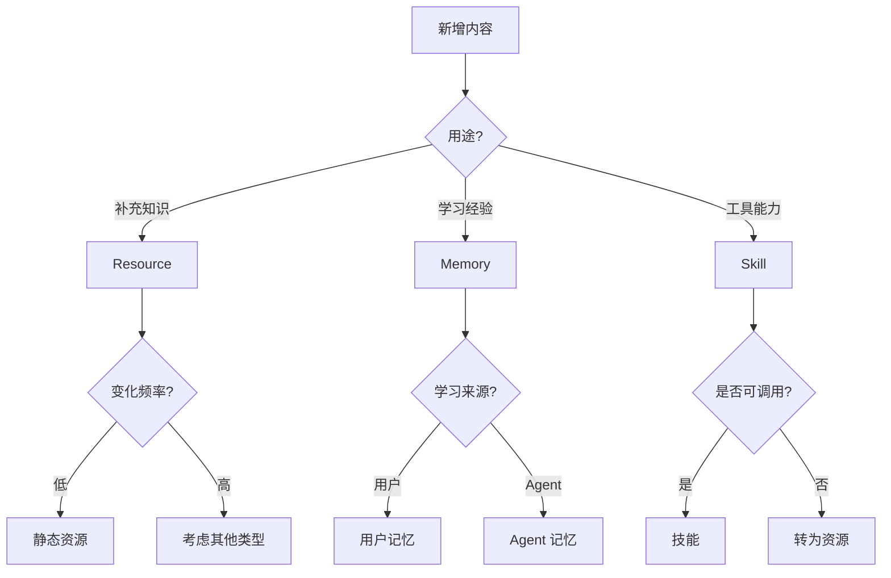

# OpenViking 上下文类型详解

> Resource、Memory、Skill 三种上下文类型

## 目录

1. [类型概述](#1-类型概述)
2. [Resource 资源](#2-resource-资源)
3. [Memory 记忆](#3-memory-记忆)
4. [Skill 技能](#4-skill-技能)
5. [统一检索](#5-统一检索)
6. [类型选择指南](#6-类型选择指南)

---

## 1. 类型概述

### 1.1 三大类型

OpenViking 将上下文抽象为 **资源、记忆、技能** 三种基本类型：



### 1.2 类型对比

| 类型 | 用途 | 生命周期 | 主动性 | 示例 |
|------|------|----------|--------|------|
| **Resource** | 知识和规则 | 长期，相对静态 | 用户添加 | API 文档 |
| **Memory** | Agent 认知 | 长期，动态更新 | Agent 记录 | 用户偏好 |
| **Skill** | 可调用能力 | 长期，静态 | Agent 调用 | 搜索技能 |

---

## 2. Resource 资源

### 2.1 定义

Resource 是 **Agent 可以引用的外部知识**，用于补充大模型的知识。



### 2.2 特点

- **用户主动**：由用户主动添加
- **静态内容**：添加后很少变化
- **结构化存储**：按项目/主题目录组织

### 2.3 使用示例

```python
# 添加资源
result = client.add_resource(
    path="https://docs.example.com/api.pdf",
    reason="API 文档"
)
root_uri = result['root_uri']

# 搜索资源
results = client.find(
    "认证方法",
    target_uri="viking://resources/"
)

# 遍历资源结果
for r in results.resources:
    print(f"资源: {r.uri}, 分数: {r.score:.4f}")
```

### 2.4 适用场景

| 场景 | 说明 |
|------|------|
| API 文档 | 产品手册、SDK 文档 |
| 代码仓库 | GitHub 项目、内部代码 |
| 知识库 | FAQ、常见问题 |
| 研究资料 | 论文、技术规范 |

---

## 3. Memory 记忆

### 3.1 定义

Memory 是 Agent 在交互过程中学习到的、与用户/经验/工具使用相关的知识。源码 `openviking/session/memory_extractor.py::MemoryCategory` 共定义 **8 种分类**（不是常被引用的 6 种）：



### 3.2 八种分类

来自 `MemoryExtractor.CATEGORY_DIRS`（注意 `profile` 是 `.md` 文件而非目录）：

| 分类 | 路径模板 | 说明 | 更新策略 |
|------|----------|------|----------|
| **profile**     | `viking://user/memories/profile.md`         | 用户身份/画像（单文件，全局合并） | ✅ 追加合并 |
| **preferences** | `viking://user/memories/preferences/{topic}/` | 按主题的用户偏好 | ✅ 同主题聚合 |
| **entities**    | `viking://user/memories/entities/{entity}/`   | 实体（人物、项目、概念） | ✅ 可追加更新 |
| **events**      | `viking://user/memories/events/{event}/`      | 事件（决策、里程碑） | ❌ 历史记录不更新 |
| **cases**       | `viking://agent/memories/cases/{case}/`       | 案例（具体问题+解决方案） | ❌ 每条独立不更新 |
| **patterns**    | `viking://agent/memories/patterns/{pattern}/` | 模式（可复用流程） | ❌ 每条独立不更新；如需变更请新建 |
| **tools**       | `viking://agent/memories/tools/{tool}/`       | 工具调用统计与优化经验 | ✅ 可累积 |
| **skills**      | `viking://agent/memories/skills/{skill}/`     | 技能执行流程与策略 | ✅ 可累积 |

### 3.3 使用示例

```python
from openviking.message import TextPart

session = client.session()
session.add_message("user", [
    TextPart(text="我喜欢深色模式，代码风格偏好 TypeScript"),
])
result = session.commit()  # 自动归档 + 后台异步提取记忆

# 也可以手动写入记忆文件
client.write(
    uri="viking://user/memories/preferences/coding/style.md",
    content="# 编码偏好\n\n- 语言: TypeScript\n- 风格: 函数式\n- 框架: React\n",
)

results = client.find(
    "用户界面偏好",
    target_uri="viking://user/memories/",
)
```

### 3.4 记忆目录结构

```
viking://user/memories/
├── profile.md                       # ⚠️ 单文件，不是 .overview.md
├── preferences/
│   ├── ui/                          # 按主题分子目录
│   ├── coding/
│   └── writing/
├── entities/
│   ├── person_001/
│   └── project_001/
└── events/
    ├── decision_001/
    └── milestone_001/

viking://agent/memories/
├── cases/
│   ├── case_001/
│   └── case_002/
├── patterns/
│   ├── workflow_001/
│   └── technique_001/
├── tools/                           # 工具调用经验
└── skills/                          # 技能执行经验
```

### 3.5 可合并 vs 不可合并



> ⚠️ **patterns 是不可更新的**——源码 `core/directories.py` 明确："each independent and not updated; create new pattern if modification needed."

---

## 4. Skill 技能

### 4.1 定义

Skill 是 **Agent 可以调用的能力**，如搜索、计算、分析等。



### 4.2 特点

- **定义的能力**：完成某项工作的工具定义
- **相对静态**：运行时技能定义不变
- **可调用**：Agent 决定何时使用

### 4.3 存储结构

```
viking://agent/skills/{skill-name}/
├── .abstract.md          # L0: 简短描述
├── .overview.md         # L1: 详细概览
├── SKILL.md             # 技能定义
└── scripts/             # 脚本目录
    ├── search.py
    └── analyze.py
```

### 4.4 使用示例

```python
# 添加技能（Claude Skills 协议格式，由 SkillLoader 解析）
client.add_skill({
    "name": "search-web",
    "description": "搜索网络获取信息",
    "content": """# search-web

## 描述
用于搜索网络获取最新信息

## 参数
- query: 搜索关键词
""",
})

# 检索技能（仅做发现）
results = client.find(
    "网络搜索",
    target_uri="viking://agent/skills/",
)
```

> ⚠️ **OpenViking 不直接执行 Skill**：不存在 `client.use_skill()`。检索到 Skill 后，由调用方（如 Agent 框架）自行选择执行方式；Skill 的执行结果可通过 `Session.used(skill={...})` 记录，并在 commit 时由 `MemoryExtractor` 提取为 `tools/skills` 类记忆。

---

## 5. 统一检索

### 5.1 跨类型搜索

```python
# 跨所有上下文类型搜索
results = await client.find("用户认证")

# 分别获取结果
for ctx in results.memories:
    print(f"📝 记忆: {ctx.uri}")
    print(f"   摘要: {ctx.abstract[:50]}...")
    
for ctx in results.resources:
    print(f"📄 资源: {ctx.uri}")
    print(f"   分数: {ctx.score:.4f}")
    
for ctx in results.skills:
    print(f"🛠️ 技能: {ctx.uri}")
```

### 5.2 指定类型搜索

`find()` / `search()` **没有 `context_type` 参数**。限定类型有两种方式：

```python
# 方式 A：通过 target_uri 限制目录子树（最常用）
results = client.find("认证方法", target_uri="viking://resources/")
results = client.find("用户偏好", target_uri="viking://user/memories/")
results = client.find("搜索", target_uri="viking://agent/skills/")

# 方式 B：通过 filter 在标量索引上过滤
results = client.find(
    "OAuth",
    filter={"context_type": "resource"},
)
```

> 即使不指定 `target_uri`，意图分析器也会根据查询风格自动生成对应类型的 `TypedQuery` 并把结果分别归入 `results.memories / resources / skills`。

---

## 6. 类型选择指南

### 6.1 决策树



### 6.2 场景对照表

| 内容 | 推荐类型 | 原因 |
|------|----------|------|
| API 文档 / 代码仓库 | Resource | 静态知识 |
| 用户姓名 / 公司项目 | Memory (entities) | 需记住的实体对象 |
| 界面偏好 / 编码风格 | Memory (preferences) | 主题型用户偏好 |
| 用户的关键决策 / 里程碑 | Memory (events) | 时间轴上的不可变事件 |
| 单个 bug 的修复方案 | Memory (cases) | 一次性案例 |
| 通用最佳实践 / 工作流模板 | Memory (patterns) | 蒸馏出的可复用经验 |
| 工具调用统计 | Memory (tools) | 工具使用积累 |
| 技能执行流程 | Memory (skills) | 技能执行经验 |
| 网络搜索 / 代码生成 | Skill | 可被 Agent 调用的能力定义 |

---

## 相关文档

- [架构概述](./01-项目概览与架构.md)
- [上下文层级](./06-上下文层级详解.md)
- [会话管理](./05-会话管理详解.md)
- [API 参考](./06-API参考.md)
