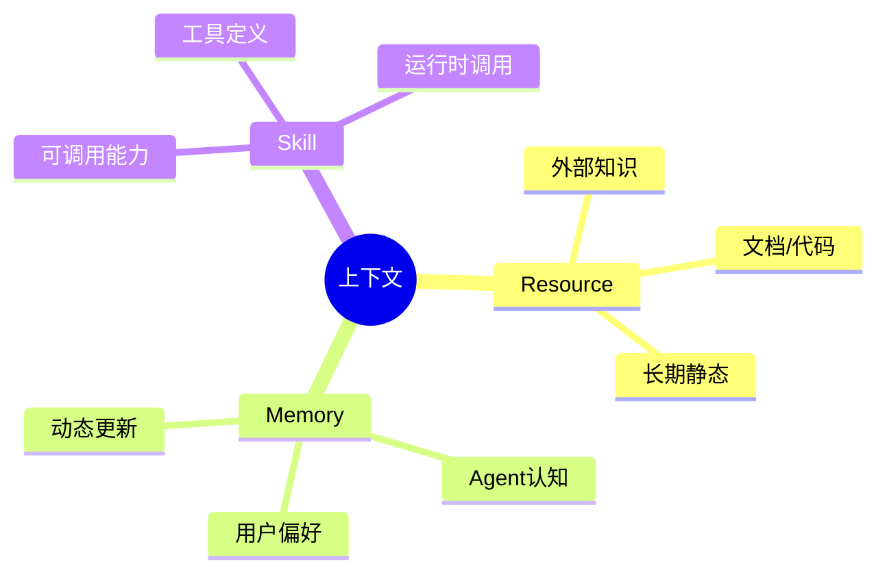
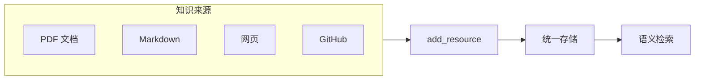
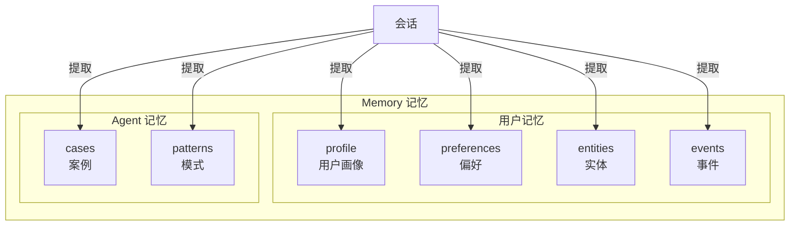
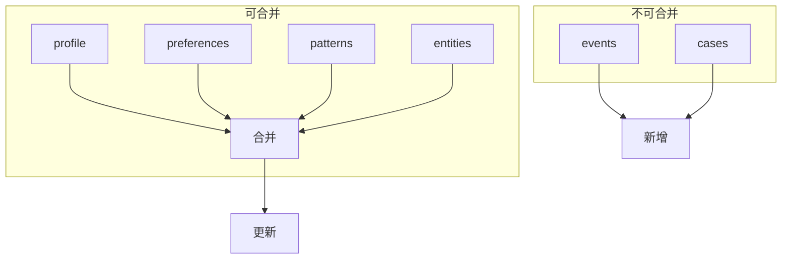
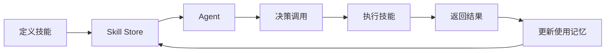
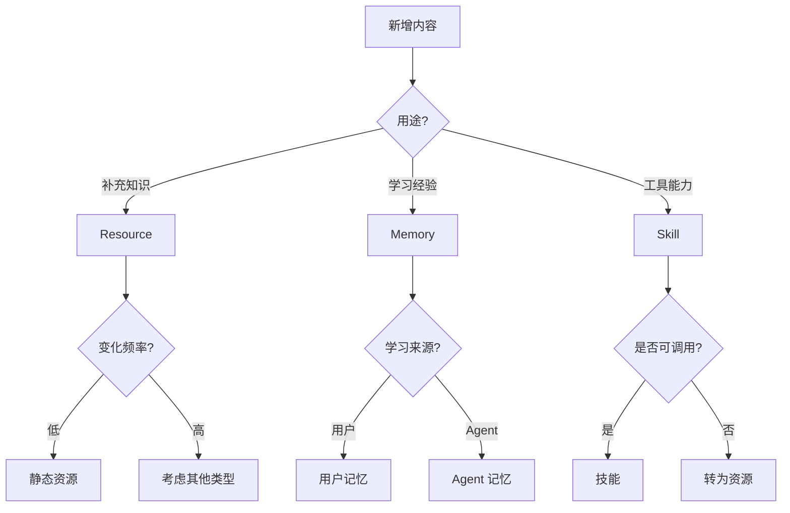

# OpenViking 上下文类型详解

> Resource、Memory、Skill 三种上下文类型

## 目录

1. [类型概述](#1-类型概述)
2. [Resource 资源](#2-resource-资源)
3. [Memory 记忆](#3-memory-记忆)
4. [Skill 技能](#4-skill-技能)
5. [统一检索](#5-统一检索)
6. [类型选择指南](#6-类型选择指南)

---

## 1. 类型概述

### 1.1 三大类型

OpenViking 将上下文抽象为 **资源、记忆、技能** 三种基本类型：



### 1.2 类型对比

| 类型 | 用途 | 生命周期 | 主动性 | 示例 |
|------|------|----------|--------|------|
| **Resource** | 知识和规则 | 长期，相对静态 | 用户添加 | API 文档 |
| **Memory** | Agent 认知 | 长期，动态更新 | Agent 记录 | 用户偏好 |
| **Skill** | 可调用能力 | 长期，静态 | Agent 调用 | 搜索技能 |

---

## 2. Resource 资源

### 2.1 定义

Resource 是 **Agent 可以引用的外部知识**，用于补充大模型的知识。



### 2.2 特点

- **用户主动**：由用户主动添加
- **静态内容**：添加后很少变化
- **结构化存储**：按项目/主题目录组织

### 2.3 使用示例

```python
# 添加资源
result = client.add_resource(
    path="https://docs.example.com/api.pdf",
    reason="API 文档"
)
root_uri = result['root_uri']

# 搜索资源
results = client.find(
    "认证方法",
    target_uri="viking://resources/"
)

# 遍历资源结果
for r in results.resources:
    print(f"资源: {r.uri}, 分数: {r.score:.4f}")
```

### 2.4 适用场景

| 场景 | 说明 |
|------|------|
| API 文档 | 产品手册、SDK 文档 |
| 代码仓库 | GitHub 项目、内部代码 |
| 知识库 | FAQ、常见问题 |
| 研究资料 | 论文、技术规范 |

---

## 3. Memory 记忆

### 3.1 定义

Memory 是 **Agent 关于用户和世界的学习知识**，分为用户记忆和 Agent 记忆。



### 3.2 六种分类

| 分类 | 位置 | 说明 | 更新策略 |
|------|------|------|----------|
| **profile** | `user/memories/.overview.md` | 用户基本信息 | ✅ 可追加 |
| **preferences** | `user/memories/preferences/` | 按主题的用户偏好 | ✅ 可追加 |
| **entities** | `user/memories/entities/` | 实体记忆（人物、项目） | ✅ 可追加 |
| **events** | `user/memories/events/` | 事件记录（决策、里程碑） | ❌ 不更新 |
| **cases** | `agent/memories/cases/` | 学习的案例 | ❌ 不更新 |
| **patterns** | `agent/memories/patterns/` | 学习的模式 | ❌ 不更新 |

### 3.3 使用示例

```python
# 创建会话
session = client.session()

# 添加消息
session.add_message("user", [
    ov.TextPart("我喜欢深色模式，代码风格偏好 TypeScript")
])

# 提交自动提取记忆
result = session.commit()

# 手动创建记忆
client.write(
    uri="viking://user/memories/preferences/coding.md",
    content="# 编码偏好\n\n- 语言: TypeScript\n- 风格: 函数式\n- 框架: React\n"
)

# 搜索记忆
results = client.find(
    "用户界面偏好",
    target_uri="viking://user/memories/"
)
```

### 3.4 记忆目录结构

```
viking://user/memories/
├── .overview.md              # profile: 用户画像
├── preferences/
│   ├── ui.md               # UI 偏好
│   ├── coding.md           # 编码偏好
│   └── writing.md          # 写作偏好
├── entities/
│   ├── person_001.md       # 人物
│   └── project_001.md     # 项目
└── events/
    ├── decision_001.md    # 决策
    └── milestone_001.md   # 里程碑

viking://agent/memories/
├── cases/
│   ├── case_001.md        # 问题 + 解决方案
│   └── case_002.md
└── patterns/
    ├── workflow_001.md    # 可复用流程
    └── technique_001.md   # 技术模式
```

### 3.5 可合并 vs 不可合并



---

## 4. Skill 技能

### 4.1 定义

Skill 是 **Agent 可以调用的能力**，如搜索、计算、分析等。



### 4.2 特点

- **定义的能力**：完成某项工作的工具定义
- **相对静态**：运行时技能定义不变
- **可调用**：Agent 决定何时使用

### 4.3 存储结构

```
viking://agent/skills/{skill-name}/
├── .abstract.md          # L0: 简短描述
├── .overview.md         # L1: 详细概览
├── SKILL.md             # 技能定义
└── scripts/             # 脚本目录
    ├── search.py
    └── analyze.py
```

### 4.4 使用示例

```python
# 添加技能
await client.add_skill({
    "name": "search-web",
    "description": "搜索网络获取信息",
    "content": """# search-web

## 描述
用于搜索网络获取最新信息

## 参数
- query: 搜索关键词

## 返回
搜索结果列表
"""
})

# 搜索技能
results = await client.find(
    "网络搜索",
    target_uri="viking://agent/skills/"
)

# 使用技能
skill_result = await client.use_skill(
    uri="viking://agent/skills/search-web",
    input={"query": "OpenViking"}
)
```

---

## 5. 统一检索

### 5.1 跨类型搜索

```python
# 跨所有上下文类型搜索
results = await client.find("用户认证")

# 分别获取结果
for ctx in results.memories:
    print(f"📝 记忆: {ctx.uri}")
    print(f"   摘要: {ctx.abstract[:50]}...")
    
for ctx in results.resources:
    print(f"📄 资源: {ctx.uri}")
    print(f"   分数: {ctx.score:.4f}")
    
for ctx in results.skills:
    print(f"🛠️ 技能: {ctx.uri}")
```

### 5.2 指定类型搜索

```python
# 只搜索资源
results = client.find(
    "认证方法",
    target_uri="viking://resources/",
    context_type="resource"
)

# 只搜索记忆
results = client.find(
    "用户偏好",
    target_uri="viking://user/memories/",
    context_type="memory"
)

# 只搜索技能
results = client.find(
    "搜索",
    target_uri="viking://agent/skills/",
    context_type="skill"
)
```

---

## 6. 类型选择指南

### 6.1 决策树



### 6.2 场景对照表

| 内容 | 推荐类型 | 原因 |
|------|----------|------|
| API 文档 | Resource | 静态知识 |
| 用户姓名 | Memory (entities) | 需记住的实体 |
| 界面偏好 | Memory (preferences) | 用户偏好 |
| 代码规范 | Memory (patterns) | Agent 经验 |
| 问题解决方案 | Memory (cases) | 案例学习 |
| 搜索功能 | Skill | 可调用能力 |
| 计算功能 | Skill | 可调用能力 |

---

## 相关文档

- [架构概述](./01-项目概览与架构.md)
- [上下文层级](./06-上下文层级详解.md)
- [会话管理](./05-会话管理详解.md)
- [API 参考](./06-API参考.md)
